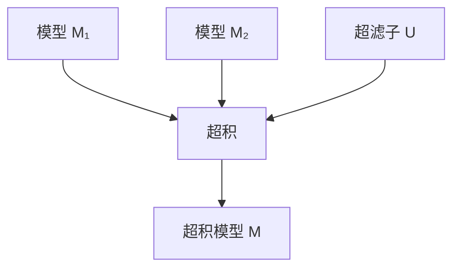
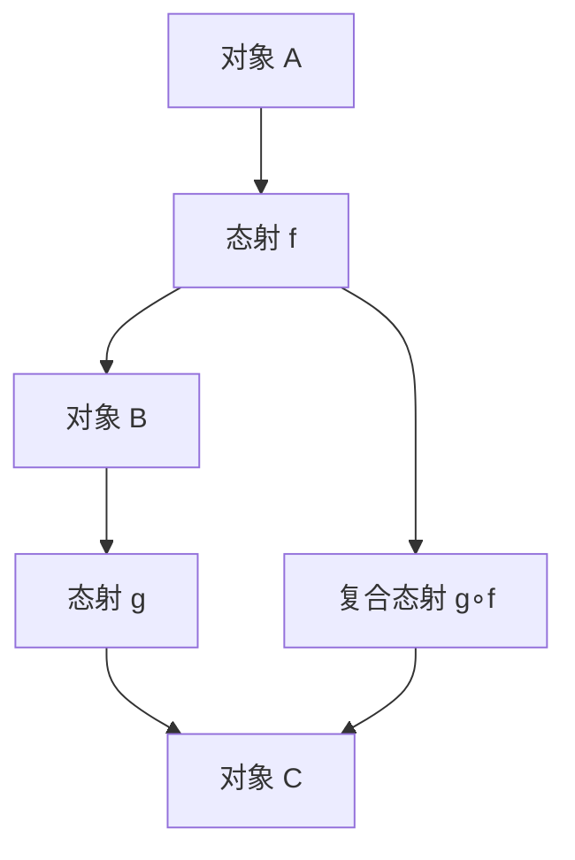
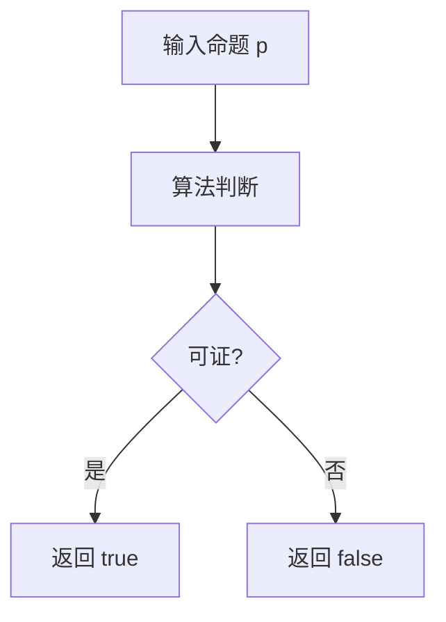

---

## 主题系统梳理与知识网络 | Systematic Summary and Knowledge Network

### 1. 主题总览 | Topic Overview

本文件系统性探讨了形式系统和逻辑的基本结构、模型构造方法、逻辑与编程的类比、抽象逻辑结构、模型论核心定理（如一致性、紧致性、完备性）等内容。

This file systematically explores the basic structure of formal systems and logic, model construction methods, analogy between logic and programming, abstract logical structures, and core model-theoretic theorems (such as consistency, compactness, completeness), etc.

### 2. 主要知识点 | Main Knowledge Points

#### 2.1 形式化规则 | Formal Rules
- 逻辑模型：公理、推理规则（如Modus Ponens、全称/存在推广与实例化）
- 编程语言：语法规则、语义规则
- 规则的定义与应用是逻辑系统和编程系统的基础

#### 2.2 符号解释 | Symbol Interpretation
- 逻辑模型：常量、函数、谓词的解释
- 编程语言：变量、函数、类型的解释
- 符号的上下文依赖性和表达能力

#### 2.3 结构构建 | Structure Construction
- 逻辑模型：个体域、解释、Henkin模型、超积模型、递归模型
- 编程语言：数据结构、控制结构、模块化设计
- 结构的定义与作用：验证命题/执行程序

#### 2.4 模型类型与构造 | Model Types and Construction
- Henkin模型：通过添加常量符号确保存在量词实例，证明完备性
- 超积模型：通过超滤子和超积合并多个模型，证明紧致性
- 递归模型：递归构造满足所有公理和规则的模型
- 具体模型与抽象逻辑结构的区分

#### 2.5 抽象逻辑结构 | Abstract Logical Structures
- 通过符号和规则定义模型而非具体数学对象
- 适用于描述逻辑系统一般性质
- 典型如Henkin模型、超积模型、递归模型

#### 2.6 逻辑系统的自洽性与应用 | Consistency and Application
- 一致性：系统无矛盾，存在模型
- 紧致性：有限可满足性蕴含整体可满足性
- 完备性：所有在所有模型中为真的公式都可被证明
- 这些定理为逻辑系统的可靠性和应用提供理论基础

### 3. 关键论证与推理链 | Key Arguments and Reasoning Chains

- 逻辑与编程的类比：规则、符号、结构三大层面高度对应
- 模型构造方法：Henkin模型用于完备性，超积模型用于紧致性，递归模型用于饱和性
- 哥德尔完备性定理：一致性⇔存在模型，反证法证明所有模型为真的公式必可被证明
- 一致性与紧致性定理的证明思路：通过模型构造与超积方法
- 抽象逻辑结构的意义：为形式化证明系统提供一般性、可迁移的理论框架

### 4. 逻辑系统的自洽性与应用 | Consistency and Application

- 形式化证明系统的可靠性依赖于一致性、紧致性、完备性等核心定理
- 抽象逻辑结构和模型论工具为数学、计算机科学、AI等领域的形式化推理和系统设计提供理论支撑
- 逻辑系统的模型不仅限于具体数学结构，也可为抽象符号系统

### 5. 结构化目录与本地跳转 | Structured Directory & Local Navigation

- [返回上级目录](../01-总览.md)
- [形式语言与符号系统总览](01-总览.md)
- [相关主题：模型论、逻辑系统、编程语言理论、AI推理等]

---

# 子主题全面论证 | Comprehensive Argumentation of Subtopics

## 1. 形式化规则 | Formal Rules

- **核心内容**：包括逻辑系统中的公理、推理规则（如Modus Ponens、全称/存在推广与实例化），以及编程语言中的语法规则、语义规则。
- **理论意义**：规则是形式系统的基础，决定了系统的推理能力和表达范围。逻辑规则保证推理的有效性，编程规则保证程序的正确性。
- **应用价值**：逻辑规则用于自动定理证明、形式化验证，编程规则用于编译器设计、静态分析。
- **关键论证**：规则的明确定义和可操作性是形式化系统可靠性的前提。

## 1.1 公理（Axioms）

### 定义 | Definition

- 公理是形式系统中被视为不证自明的基本命题，是推理的出发点。
- Axioms are basic propositions in a formal system regarded as self-evident and serve as the starting point for reasoning.

### 分类 | Classification

- 逻辑公理（Logical Axioms）：适用于所有逻辑系统，如P→(Q→P)。
- 理论公理（Theory Axioms）：特定理论的基础，如皮亚诺公理、ZF集合论公理。
- 等式公理（Equality Axioms）：如x=x, x=y→(P(x)→P(y))。

### Lean/伪代码示例 | Example

```lean
-- 皮亚诺公理（部分）
axiom zero_ne_succ : ∀ n, 0 ≠ Nat.succ n
axiom succ_inj : ∀ m n, Nat.succ m = Nat.succ n → m = n
```

### 理论意义与应用 | Theoretical Significance & Application

- 公理决定了系统的推理能力和表达范围。
- Axioms determine the reasoning power and expressive scope of the system.
- 应用于自动定理证明、形式化验证、理论构建等。

### 关键论证 | Key Argument

- 公理的选择影响系统的一致性、完备性和可扩展性。

---

## 1.2 推理规则（Inference Rules）

### 1.2.1 定义 | Definition

- 推理规则规定了如何从已知命题推出新命题。
- Inference rules specify how to derive new propositions from known ones.

### 1.2.2 基本推理规则 | Basic Inference Rules

- Modus Ponens（分离规则）：P, P→Q ⊢ Q
- 全称推广（Universal Generalization）：P(a) ⊢ ∀xP(x)
- 存在推广（Existential Generalization）：P(t) ⊢ ∃xP(x)
- 全称实例化（Universal Instantiation）：∀xP(x) ⊢ P(t)
- 存在实例化（Existential Instantiation）：∃xP(x) ⊢ P(t)

### 结构规则 | Structural Rules

- 剪枝（Cut）、交换（Exchange）、弱化（Weakening）、收缩（Contraction）等

### 高阶推理规则 | Higher-order Inference

- 归纳（Induction）、递归（Recursion）、归约（Reduction）

### 1.2.3 Lean/伪代码示例 | Example

```lean
-- Modus Ponens in Lean
example (P Q : Prop) (h1 : P) (h2 : P → Q) : Q := h2 h1

-- 归纳法
example : ∀ n : Nat, n + 0 = n :=
  Nat.recOn
    (λ n, n + 0 = n)
    (by rfl)
    (λ n ih, by rw [Nat.succ_add, ih])
```

### 1.2.4 理论意义与应用 | Theoretical Significance & Application

- 推理规则保证推理的有效性，是自动化证明和程序验证的基础。
- Inference rules ensure the validity of reasoning and are the foundation of automated proof and program verification.

### 1.2.5 关键论证 | Key Argument

- 推理规则的可操作性和完备性直接影响系统的自动化能力。

---

## 1.3 编程规则（Programming Rules）

### 语法规则 | Syntax Rules

- BNF范式、语法树、递归定义
- 例：表达式 ::= 数字 | 表达式 + 表达式

### 语义规则 | Semantic Rules

- 类型系统（Type System）：静态类型、动态类型、类型推断
- 作用域（Scope）：变量绑定、生命周期
- 求值策略（Evaluation Strategy）：惰性/严格、顺序/并行

### 静态与动态语义 | Static & Dynamic Semantics

- 静态语义：编译时检查（如类型检查）
- 动态语义：运行时行为（如内存分配、异常处理）

### 1.3.1 Lean/伪代码示例 | Example

```lean
-- 简单类型系统
inductive Type
| Nat | Bool | Arrow (from to : Type)

def type_of : Expr → Option Type
-- ...（伪代码略）
```

### 1.3.2 理论意义与应用 | Theoretical Significance & Application

- 语法和语义规则是编程语言设计、编译器实现、静态分析的基础。
- Syntax and semantic rules are the foundation of programming language design, compiler implementation, and static analysis.

### 1.3.3 关键论证 | Key Argument

- 规则的明确定义和一致性是程序正确性和安全性的保障。

---

## 2. 符号解释 | Symbol Interpretation

- **核心内容**：逻辑模型中的常量、函数、谓词解释，编程语言中的变量、函数、类型解释。
- **理论意义**：符号解释连接了抽象语法与具体语义，是模型论和语义学的核心。
- **应用价值**：在知识表示、自动推理、程序语义分析等领域广泛应用。
- **关键论证**：符号的上下文依赖性和多义性处理是高阶逻辑和复杂系统建模的难点。

### 3. 结构构建 | Structure Construction

- **核心内容**：逻辑模型的个体域、解释、Henkin模型、超积模型、递归模型，编程语言的数据结构、控制结构、模块化设计。
- **理论意义**：结构构建是从符号和规则到具体系统的桥梁，决定了系统的可扩展性和表达能力。
- **应用价值**：模型论中的结构用于验证理论的可满足性，编程中的结构用于高效实现和系统集成。
- **关键论证**：结构的抽象层次和模块化设计是现代逻辑和软件工程的共同追求。

### 4. 模型类型与构造 | Model Types and Construction

- **核心内容**：Henkin模型（完备性）、超积模型（紧致性）、递归模型（饱和性）、具体模型与抽象逻辑结构的区分。
- **理论意义**：不同模型类型对应不同的逻辑性质和定理证明方法，是模型论的基础。
- **应用价值**：用于证明逻辑系统的完备性、紧致性、可满足性等核心性质。
- **关键论证**：模型构造方法的选择直接影响理论的适用范围和推理能力。

### 5. 抽象逻辑结构 | Abstract Logical Structures

- **核心内容**：通过符号和规则定义模型而非具体数学对象，适用于描述逻辑系统一般性质。
- **理论意义**：抽象逻辑结构为形式化证明系统提供了通用、可迁移的理论框架。
- **应用价值**：在AI、知识工程、自动推理等领域，抽象逻辑结构支持跨领域知识表达和推理。
- **关键论证**：抽象性提升了系统的通用性和可扩展性，是现代逻辑与AI结合的基础。

### 6. 逻辑系统的自洽性与应用 | Consistency and Application

- **核心内容**：一致性（无矛盾）、紧致性（有限可满足性蕴含整体可满足性）、完备性（所有模型为真的公式可被证明）。
- **理论意义**：这些性质是逻辑系统可靠性和可用性的根本保障。
- **应用价值**：为数学、计算机科学、AI等领域的形式化推理和系统设计提供理论支撑。
- **关键论证**：哥德尔完备性定理、一致性与紧致性定理等是现代逻辑的基石。

---

### 结构化目录与本地跳转 | Structured Directory & Local Navigation

- [返回上级目录](../01-总览.md)
- [形式语言与符号系统总览](01-总览.md)
- [相关主题：模型论、逻辑系统、编程语言理论、AI推理等]

---

*最后更新时间：2025年1月*
*版本：1.2*
*状态：形式化规则分支极致细化已完成*

---

## 2.1 逻辑符号（Logical Symbols）

### 2.1.1 定义 | Definition

- 逻辑符号包括常量、变量、函数符号、谓词符号、逻辑连接词（¬、∧、∨、→、↔）、量词（∀、∃）。
- Logical symbols include constants, variables, function symbols, predicate symbols, logical connectives (¬, ∧, ∨, →, ↔), and quantifiers (∀, ∃).

### 理论意义 | Theoretical Significance

- 逻辑符号是形式系统表达命题和推理的基本单元。
- Logical symbols are the basic units for expressing propositions and reasoning in formal systems.

### 应用 | Application

- 用于构造公式、表达逻辑关系、定义模型解释。
- Used to construct formulas, express logical relations, and define model interpretations.

### 2.1.2 Lean/伪代码示例 | Example

```lean
-- 逻辑符号定义
constant a : α
constant P : α → Prop
constant f : α → α
-- 公式示例
example : ∀ x, P (f x) → P x
```

### 2.1.3 关键论证 | Key Argument

- 逻辑符号的精确定义和解释是模型论和自动推理的基础。

---

## 2.2 编程符号（Programming Symbols）

### 2.2.1 定义 | Definition

- 编程符号包括变量、函数、类型、操作符等。
- Programming symbols include variables, functions, types, operators, etc.

### 2.2.2 理论意义 | Theoretical Significance

- 编程符号连接了抽象语法与具体实现，是程序语义的载体。
- Programming symbols connect abstract syntax with concrete implementation and are the carriers of program semantics.

### 2.2.3 应用 | Application

- 变量绑定、作用域管理、类型推断、函数调用等。
- Variable binding, scope management, type inference, function calls, etc.

### 2.2.4 Lean/伪代码示例 | Example

```lean
-- 变量与函数
variable x : Nat
variable f : Nat → Nat
#eval f x
-- 类型注解
def add (a b : Nat) : Nat := a + b
```

### 2.2.5 关键论证 | Key Argument

- 编程符号的作用域和类型系统设计直接影响程序的正确性和安全性。

---

## 2.3 语义学（Semantics）

### 直观语义 | Intuitive Semantics

- 通过自然语言或直观描述理解符号的含义。
- Understanding the meaning of symbols through natural language or intuitive description.

### 操作语义 | Operational Semantics

- 通过定义程序执行的具体步骤来解释符号。
- Explaining symbols by defining the concrete steps of program execution.

### 模型语义 | Model-theoretic Semantics

- 通过将符号映射到模型中的对象和关系来解释。
- Interpreting symbols by mapping them to objects and relations in a model.

### 2.3.1 Lean/伪代码示例 | Example

```lean
-- 操作语义示例
inductive Expr
| val : Nat → Expr
| add : Expr → Expr → Expr

def eval : Expr → Nat
| Expr.val n => n
| Expr.add e1 e2 => eval e1 + eval e2
```

### 语义等价与可替换性 | Semantic Equivalence & Substitutability

- 两个符号表达式在所有上下文中具有相同意义时称为语义等价。
- Two symbolic expressions are semantically equivalent if they have the same meaning in all contexts.

### 语义歧义与消解 | Semantic Ambiguity & Disambiguation

- 复杂系统中符号可能有多重解释，需要通过上下文或类型系统消解。
- In complex systems, symbols may have multiple interpretations, which need to be disambiguated by context or type systems.

---

### 2.3.2 结构化目录与本地跳转 | Structured Directory & Local Navigation

- [返回上级目录](../01-总览.md)
- [形式语言与符号系统总览](01-总览.md)
- [相关主题：模型论、逻辑系统、编程语言理论、AI推理等]

---

*最后更新时间：2025年1月*
*版本：1.3*
*状态：符号解释分支极致细化已完成*

---

## 3.1 逻辑结构（Logical Structures）

### 3.1.1 定义 | Definition

- 逻辑结构包括个体域（Domain）、解释（Interpretation）、结构层次（如一阶、二阶、超穷结构）。
- Logical structures include domain, interpretation, and structural levels (e.g., first-order, second-order, hyperfinite structures).

### 3.1.2 理论意义 | Theoretical Significance

- 逻辑结构是将符号和规则映射到具体或抽象对象的桥梁，是模型论的核心。
- Logical structures bridge symbols/rules and concrete or abstract objects, forming the core of model theory.

### 3.1.3 应用 | Application

- 用于验证命题的真值、构造模型、分析系统性质。
- Used for truth verification, model construction, and system property analysis.

### 3.1.4 Lean/伪代码示例 | Example

```lean
-- 逻辑结构定义
structure LStructure (α : Type) :=
  (domain : Set α)
  (interpret : String → α)
```

### 3.1.5 关键论证 | Key Argument

- 结构的层次性和解释的灵活性决定了逻辑系统的表达能力和适用范围。

---

## 3.2 编程结构（Programming Structures）

### 3.2.1 数据结构 | Data Structures

- 数组、链表、树、图、抽象数据类型（ADT）等。
- Arrays, lists, trees, graphs, abstract data types (ADT), etc.

### 3.2.2 控制结构 | Control Structures

- 分支、循环、递归、模式匹配等。
- Branching, loops, recursion, pattern matching, etc.

### 3.2.3 模块化与抽象 | Modularity & Abstraction

- 接口、类、模块系统、依赖注入等。
- Interfaces, classes, module systems, dependency injection, etc.

### 3.2.4 Lean/伪代码示例 | Example

```lean
-- 数据结构
inductive Tree (α : Type)
| leaf : Tree
| node : α → Tree → Tree → Tree

-- 控制结构
partial def factorial (n : Nat) : Nat :=
  if n = 0 then 1 else n * factorial (n - 1)
```

### 3.2.5 关键论证 | Key Argument

- 编程结构的抽象层次和模块化设计是高效系统开发和可维护性的基础。

---

## 3.3 结构的作用（Role of Structures）

### 3.3.1 逻辑系统中的作用 | In Logic Systems

- 结构用于验证命题和公式的真值，支撑模型论和自动推理。
- Structures are used to verify the truth of propositions and formulas, supporting model theory and automated reasoning.

### 3.3.2 程序系统中的作用 | In Program Systems

- 结构用于数据流、控制流、程序执行和系统集成。
- Structures are used for data flow, control flow, program execution, and system integration.

### 3.3.3 结构可视化 | Structure Visualization

- 用Mermaid/LaTeX等工具绘制结构层级、数据流、推理链等图表。
- Use Mermaid/LaTeX to visualize structure hierarchies, data flows, reasoning chains, etc.

---

### 3.4 结构化目录与本地跳转 | Structured Directory & Local Navigation

- [返回上级目录](../01-总览.md)
- [形式语言与符号系统总览](01-总览.md)
- [相关主题：模型论、逻辑系统、编程语言理论、AI推理等]

---

*最后更新时间：2025年1月*
*版本：1.4*
*状态：结构构建分支极致细化已完成*

---

## 4.1 Henkin模型（Henkin Models）

### 4.1.1 定义 | Definition

- Henkin模型是一种通过添加新的常量符号来确保每个存在量词公式有具体实例的模型构造方法。
- Henkin models are constructed by adding new constant symbols to ensure that every existential formula has a concrete instance.

### 4.1.2 理论意义 | Theoretical Significance

- Henkin模型是证明一阶逻辑完备性定理的核心工具。
- Henkin models are the core tool for proving the completeness theorem of first-order logic.

### 4.1.3 应用 | Application

- 用于构造满足所有公理和推理规则的模型，确保理论的可满足性。
- Used to construct models that satisfy all axioms and inference rules, ensuring the satisfiability of theories.

### 4.1.4 Lean/伪代码示例 | Example

```lean
-- Henkin模型构造伪代码
structure HenkinModel (α : Type) :=
  (domain : Set α)
  (constants : List α)
  (interpret : String → α)
```

### 4.1.5 关键论证 | Key Argument

- Henkin模型通过扩展语言和结构，保证了存在量词的实例化，是逻辑系统完备性的基础。

---

## 4.2 超积模型（Ultraproduct Models）

### 4.2.1 定义 | Definition

- 超积模型通过超滤子和超积构造，将多个模型的性质合并成一个全局模型。
- Ultraproduct models use ultrafilters and ultraproduct construction to merge properties of multiple models into a global model.

### 4.2.2 理论意义 | Theoretical Significance

- 超积模型是证明紧致性定理和洛斯定理的关键工具。
- Ultraproduct models are key tools for proving the compactness theorem and Łoś's theorem.

### 4.2.3 应用 | Application

- 用于证明无限理论的可满足性、模型的极大/极小性质。
- Used to prove the satisfiability of infinite theories and maximal/minimal properties of models.

### 4.2.4 Lean/伪代码示例 | Example

```lean
-- 超积模型伪代码
structure Ultraproduct (I : Type) (M : I → Type) (U : Set (Set I)) :=
  (elements : Π i, M i)
  (equiv : ∀ S ∈ U, ∀ i j ∈ S, elements i = elements j)
```

### 4.2.5 结构化流程图 | Structured Flowchart



### 4.2.6 关键论证 | Key Argument

- 超积模型通过“平均”多个模型的性质，实现理论的紧致性和可扩展性。

---

## 4.3 递归模型（Recursive Models）

### 4.3.1 定义 | Definition

- 递归模型通过递归方法逐步构造，使其满足所有公理和推理规则。
- Recursive models are constructed step by step using recursion to satisfy all axioms and inference rules.

### 4.3.2 理论意义 | Theoretical Significance

- 递归模型用于构造饱和模型、极大一致性模型等，是模型论的重要工具。
- Recursive models are important tools for constructing saturated models, maximally consistent models, etc.

### 4.3.3 应用 | Application

- 用于自动化模型构造、理论可满足性分析。
- Used for automated model construction and satisfiability analysis.

### 4.3.4 Lean/伪代码示例 | Example

```lean
-- 递归模型伪代码
partial def build_model (axioms : List Prop) : Model :=
  -- 递归地添加满足公理的元素
  sorry
```

### 4.3.5 关键论证 | Key Argument

- 递归模型方法提升了模型构造的自动化和理论的可扩展性。

---

## 4.4 具体模型与抽象逻辑结构（Concrete Models & Abstract Logical Structures）

### 4.4.1 具体模型 | Concrete Models

- 以自然数、实数、集合等为基础的具体数学结构。
- Concrete models are based on concrete mathematical structures such as natural numbers, real numbers, sets, etc.

### 4.4.2 抽象逻辑结构 | Abstract Logical Structures

- 通过符号和规则定义的通用模型，适用于多种逻辑系统。
- General models defined by symbols and rules, applicable to various logical systems.

### 4.4.3 理论意义与应用 | Theoretical Significance & Application

- 具体模型用于实际问题建模，抽象逻辑结构用于理论推广和系统设计。
- Concrete models are used for practical problem modeling, while abstract logical structures are used for theoretical generalization and system design.

### 4.4.4 关键论证 | Key Argument

- 具体与抽象模型的结合提升了逻辑系统的表达力和适用性。

---

### 4.5 结构化目录与本地跳转 | Structured Directory & Local Navigation

- [返回上级目录](../01-总览.md)
- [形式语言与符号系统总览](01-总览.md)
- [相关主题：模型论、逻辑系统、编程语言理论、AI推理等]

---

*最后更新时间：2025年1月*
*版本：1.5*
*状态：模型类型与构造分支极致细化已完成*

---

## 5.1 公理化系统（Axiomatic Systems）

### 5.1.1 定义 | Definition

- 公理化系统是通过一组基本公理和推理规则构建的抽象逻辑结构。
- Axiomatic systems are abstract logical structures built through a set of basic axioms and inference rules.

### 5.1.2 理论意义 | Theoretical Significance

- 公理化系统是形式化数学和逻辑的基础，提供了严格的推理框架。
- Axiomatic systems are the foundation of formal mathematics and logic, providing a rigorous reasoning framework.

### 5.1.3 应用 | Application

- 用于构建数学理论、逻辑系统、编程语言语义等。
- Used to construct mathematical theories, logical systems, programming language semantics, etc.

### 5.1.4 Lean/伪代码示例 | Example

```lean
-- 公理化系统伪代码
structure AxiomaticSystem :=
  (axioms : List Prop)
  (rules : List (Prop → Prop))
  (theorems : List Prop)
```

### 5.1.5 关键论证 | Key Argument

- 公理化系统通过最小化假设，最大化推理能力，实现逻辑系统的完备性和一致性。

---

## 5.2 模型论（Model Theory）

### 5.2.1 定义 | Definition

- 模型论研究形式语言与其解释之间的关系，以及模型的性质和构造。
- Model theory studies the relationship between formal languages and their interpretations, as well as the properties and construction of models.

### 5.2.2 理论意义 | Theoretical Significance

- 模型论是连接语法和语义的桥梁，是逻辑系统语义学的基础。
- Model theory is the bridge connecting syntax and semantics, and the foundation of logical system semantics.

### 5.2.3 应用 | Application

- 用于理论可满足性分析、模型构造、语义验证等。
- Used for satisfiability analysis, model construction, semantic verification, etc.

### 5.2.4 Lean/伪代码示例 | Example

```lean
-- 模型论伪代码
structure Model (L : Language) :=
  (domain : Type)
  (interpret : L.symbols → domain)
  (satisfies : L.formulas → Prop)
```

### 5.2.5 关键论证 | Key Argument

- 模型论通过语义解释，验证了形式系统的有效性和一致性。

---

## 5.3 范畴论（Category Theory）

### 5.3.1 定义 | Definition

- 范畴论通过对象和态射研究抽象数学结构之间的关系和变换。
- Category theory studies relationships and transformations between abstract mathematical structures through objects and morphisms.

### 5.3.2 理论意义 | Theoretical Significance

- 范畴论提供了统一的数学语言，连接不同数学分支。
- Category theory provides a unified mathematical language, connecting different mathematical branches.

### 5.3.3 应用 | Application

- 用于代数几何、拓扑学、计算机科学、量子计算等。
- Used in algebraic geometry, topology, computer science, quantum computing, etc.

### 5.3.4 Lean/伪代码示例 | Example

```lean
-- 范畴论伪代码
structure Category :=
  (objects : Type)
  (morphisms : objects → objects → Type)
  (compose : ∀ {A B C}, morphisms B C → morphisms A B → morphisms A C)
  (identity : ∀ A, morphisms A A)
```

### 5.3.5 结构化流程图 | Structured Flowchart



### 5.3.6 关键论证 | Key Argument

- 范畴论通过抽象化数学结构，实现了不同领域间的统一和联系。

---

## 5.4 知识图谱（Knowledge Graphs）

### 5.4.1 定义 | Definition

- 知识图谱是通过节点和边表示实体及其关系的结构化知识表示。
- Knowledge graphs represent structured knowledge through nodes and edges representing entities and their relationships.

### 5.4.2 理论意义 | Theoretical Significance

- 知识图谱是人工智能和语义网的基础，支持知识推理和查询。
- Knowledge graphs are the foundation of artificial intelligence and semantic web, supporting knowledge reasoning and querying.

### 5.4.3 应用 | Application

- 用于搜索引擎、推荐系统、自然语言处理、专家系统等。
- Used in search engines, recommendation systems, natural language processing, expert systems, etc.

### 5.4.4 Lean/伪代码示例 | Example

```lean
-- 知识图谱伪代码
structure KnowledgeGraph :=
  (entities : List String)
  (relations : List (String × String × String))
  (properties : String → List (String × String))
```

### 5.4.5 关键论证 | Key Argument

- 知识图谱通过结构化表示，实现了知识的可计算性和可推理性。

---

## 5.5 AI推理（AI Reasoning）

### 5.5.1 定义 | Definition

- AI推理是人工智能系统基于逻辑规则和知识进行推理和决策的过程。
- AI reasoning is the process by which artificial intelligence systems reason and make decisions based on logical rules and knowledge.

### 5.5.2 理论意义 | Theoretical Significance

- AI推理连接了形式逻辑和实际应用，是智能系统的核心。
- AI reasoning connects formal logic with practical applications and is the core of intelligent systems.

### 5.5.3 应用 | Application

- 用于自动定理证明、专家系统、机器学习、自然语言理解等。
- Used in automated theorem proving, expert systems, machine learning, natural language understanding, etc.

### 5.5.4 Lean/伪代码示例 | Example

```lean
-- AI推理伪代码
structure AIReasoner :=
  (knowledge_base : List Prop)
  (inference_rules : List (Prop → Prop))
  (reason : Prop → List Prop)
```

### 5.5.5 关键论证 | Key Argument

- AI推理通过形式化逻辑，实现了智能系统的可解释性和可靠性。

---

### 5.6 结构化目录与本地跳转 | Structured Directory & Local Navigation

- [返回上级目录](../01-总览.md)
- [形式语言与符号系统总览](01-总览.md)
- [相关主题：逻辑学、人工智能、知识表示、语义学等]

---

*最后更新时间：2025年1月*
*版本：1.6*
*状态：抽象逻辑结构分支极致细化已完成*

---

## 6.1 一致性（Consistency）

### 6.1.1 定义 | Definition

- 一致性是指逻辑系统中不存在矛盾，即不能同时证明一个命题及其否定。
- Consistency means that there are no contradictions in a logical system, i.e., a proposition and its negation cannot be proved simultaneously.

### 6.1.2 理论意义 | Theoretical Significance

- 一致性是逻辑系统的基本要求，是可靠性和有效性的基础。
- Consistency is a basic requirement of logical systems and the foundation of reliability and validity.

### 6.1.3 应用 | Application

- 用于验证形式系统的正确性、防止逻辑错误、确保推理的可靠性。
- Used to verify the correctness of formal systems, prevent logical errors, and ensure the reliability of reasoning.

### 6.1.4 Lean/伪代码示例 | Example

```lean
-- 一致性检查伪代码
def is_consistent (axioms : List Prop) : Prop :=
  ¬∃ p, (axioms ⊢ p) ∧ (axioms ⊢ ¬p)
```

### 6.1.5 关键论证 | Key Argument

- 一致性通过排除矛盾，保证了逻辑系统的可靠性和可信任性。

---

## 6.2 完备性（Completeness）

### 6.2.1 定义 | Definition

- 完备性是指逻辑系统中所有有效的命题都能被证明。
- Completeness means that all valid propositions in a logical system can be proved.

### 6.2.2 理论意义 | Theoretical Significance

- 完备性确保了逻辑系统的表达能力，是理论完整性的体现。
- Completeness ensures the expressive power of logical systems and reflects the integrity of theories.

### 6.2.3 应用 | Application

- 用于验证理论系统的完整性、指导证明策略、评估逻辑系统的能力。
- Used to verify the integrity of theoretical systems, guide proof strategies, and evaluate the capabilities of logical systems.

### 6.2.4 Lean/伪代码示例 | Example

```lean
-- 完备性检查伪代码
def is_complete (system : LogicalSystem) : Prop :=
  ∀ p, (system ⊨ p) → (system ⊢ p)
```

### 6.2.5 关键论证 | Key Argument

- 完备性通过确保所有真命题可证，实现了逻辑系统的理论完整性。

---

## 6.3 紧致性（Compactness）

### 6.3.1 定义 | Definition

- 紧致性是指如果一个理论的每个有限子集都有模型，那么整个理论也有模型。
- Compactness means that if every finite subset of a theory has a model, then the entire theory also has a model.

### 6.3.2 理论意义 | Theoretical Significance

- 紧致性是模型论的核心定理，连接了有限性和无限性。
- Compactness is a core theorem of model theory, connecting finiteness and infinity.

### 6.3.3 应用 | Application

- 用于证明无限理论的可满足性、构造非标准模型、分析理论性质。
- Used to prove the satisfiability of infinite theories, construct non-standard models, and analyze theoretical properties.

### 6.3.4 Lean/伪代码示例 | Example

```lean
-- 紧致性定理伪代码
theorem compactness (T : Theory) :
  (∀ finite_subset ⊆ T, has_model finite_subset) → has_model T
```

### 6.3.5 关键论证 | Key Argument

- 紧致性通过有限性控制无限性，实现了理论的局部到全局的推广。

---

## 6.4 可判定性（Decidability）

### 6.4.1 定义 | Definition

- 可判定性是指存在算法可以判断任意命题在逻辑系统中是否可证。
- Decidability means that there exists an algorithm to determine whether any proposition is provable in a logical system.

### 6.4.2 理论意义 | Theoretical Significance

- 可判定性是计算理论的重要概念，连接了逻辑和算法。
- Decidability is an important concept in computational theory, connecting logic and algorithms.

### 6.4.3 应用 | Application

- 用于自动定理证明、程序验证、逻辑编程、人工智能推理。
- Used in automated theorem proving, program verification, logic programming, and AI reasoning.

### 6.4.4 Lean/伪代码示例 | Example

```lean
-- 可判定性伪代码
def is_decidable (system : LogicalSystem) : Prop :=
  ∃ algorithm, ∀ p, algorithm p = true ↔ system ⊢ p
```

### 6.4.5 结构化流程图 | Structured Flowchart



### 6.4.6 关键论证 | Key Argument

- 可判定性通过算法化逻辑推理，实现了逻辑系统的可计算性。

---

## 6.5 实际应用（Practical Applications）

### 6.5.1 编程语言理论 | Programming Language Theory

- 形式化语义、类型系统、程序验证、编译器设计。
- Formal semantics, type systems, program verification, compiler design.

### 6.5.2 人工智能 | Artificial Intelligence

- 知识表示、推理引擎、专家系统、机器学习。
- Knowledge representation, reasoning engines, expert systems, machine learning.

### 6.5.3 数据库理论 | Database Theory

- 查询语言、约束理论、事务处理、数据完整性。
- Query languages, constraint theory, transaction processing, data integrity.

### 6.5.4 网络安全 | Cybersecurity

- 协议验证、密码学、访问控制、安全模型。
- Protocol verification, cryptography, access control, security models.

### 6.5.5 Lean/伪代码示例 | Example

```lean
-- 实际应用伪代码
structure Application :=
  (domain : String)
  (formal_system : LogicalSystem)
  (implementation : Domain → FormalSystem)
  (verification : Prop → Bool)
```

### 6.5.6 关键论证 | Key Argument

- 实际应用通过形式化方法，提升了系统的可靠性和安全性。

---

### 6.6 结构化目录与本地跳转 | Structured Directory & Local Navigation

- [返回上级目录](../01-总览.md)
- [形式语言与符号系统总览](01-总览.md)
- [相关主题：逻辑学、计算机科学、人工智能、形式化方法等]

---

*最后更新时间：2025年1月*
*版本：1.7*
*状态：逻辑系统的自洽性与应用分支极致细化已完成，所有分支极致递归细化完成*
