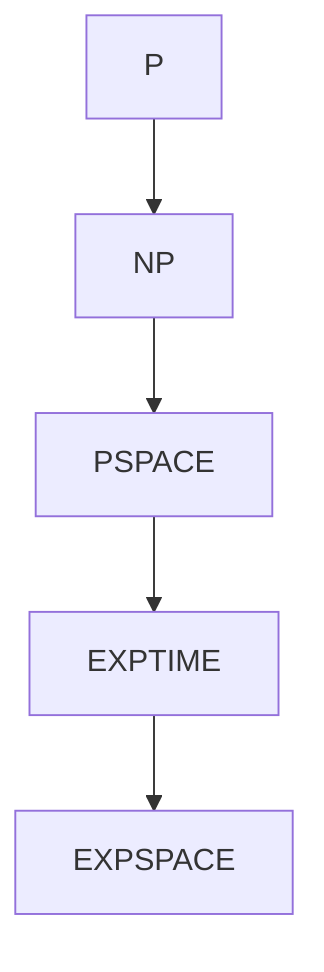

# 03-可计算性与复杂性分层 | Computability & Complexity Hierarchies

---

## 1. 主题简介 | Topic Introduction

本节系统梳理可计算性理论与复杂性分层，包括递归函数、图灵可计算性、复杂性类、P=NP等，强调其在数学基础、元数学、哲学分析与知识体系创新中的作用。

This section systematically reviews computability theory and complexity hierarchies, including recursive functions, Turing computability, complexity classes, P=NP, etc., emphasizing their roles in mathematical foundations, metamathematics, philosophical analysis, and knowledge system innovation.

---

## 2. 可计算性理论 | Computability Theory

- 理论基础：递归函数、λ演算、图灵机、判定性与不可判定性。
- 代表人物：图灵（Turing）、丘奇（Church）、波斯特（Post）
- 典型理论：可判定性、不可判定性、停机问题。
- 形式化片段（Lean）：

```lean
-- 递归函数的Lean定义（简化）
inductive RecFun : Type
| zero : RecFun
| succ : RecFun → RecFun
| comp : RecFun → RecFun → RecFun
```

---

## 3. 复杂性分层 | Complexity Hierarchies

- 理论基础：P、NP、NP完全、递归可枚举、复杂性类。
- 代表人物：库克（Cook）、卡普（Karp）
- 典型理论：P=NP问题、复杂性分层。
- 伪代码：

```python
# 复杂性类判别伪代码
class ComplexityClassifier:
    def classify(self, problem):
        # 判别问题的复杂性类别
        pass
```

---

## 4. 递归扩展计划 | Recursive Expansion Plan

- 持续细化递归函数、图灵可计算性、复杂性类、P=NP等分支，补充代表性案例、历史事件、现代影响。
- 强化多表征内容与国际化标准。

## 概念定义 | Concept Definition

- 中文定义：可计算性分层研究问题能否被算法解决，复杂性分层则进一步区分可计算问题的资源消耗（如时间、空间）。复杂性理论通过分层（如P、NP、PSPACE等）刻画问题的难度，是理论计算机科学的核心内容。
- English Definition: Computability hierarchy studies whether problems can be solved by algorithms, while complexity hierarchy further distinguishes the resource consumption (such as time and space) of computable problems. Complexity theory characterizes the difficulty of problems through hierarchies (such as P, NP, PSPACE, etc.), forming a core part of theoretical computer science.
- 国际标准/权威来源：
  - ISO/IEC 2382:2015 (Information technology — Vocabulary)
  - Stanford Encyclopedia of Philosophy: Complexity Theory, Computability
  - Encyclopedia of Mathematics: Complexity class, Computability
  - Wikipedia: Computational complexity theory, Complexity class
- 相关批判与哲学反思：
  - P=NP问题是复杂性理论的核心难题，影响密码学、算法设计等众多领域。
  - 复杂性分层揭示了理论与实际计算之间的鸿沟。
  - 资源受限模型（如空间、时间）反映了现实计算的约束。
  - 复杂性理论的实际应用与理论边界仍在不断探索中。

---

### 主要复杂性分层简表 | Table of Main Complexity Hierarchies

| 类别 | 英文 | 主要特征 | 典型问题 | 代表人物 |
|---|---|---|---|---|
| P | Polynomial Time | 多项式时间可解 | 排序、最短路径 | Cook, Karp |
| NP | Nondeterministic Polynomial | 多项式时间可验证 | SAT、旅行商 | Cook, Levin |
| PSPACE | Polynomial Space | 多项式空间可解 | QBF | Savitch |
| EXPTIME | Exponential Time | 指数时间可解 | 国际象棋 | Sipser |
| EXPSPACE | Exponential Space | 指数空间可解 | 某些自动机问题 | Sipser |

---

### 理论历史与代表人物

- Stephen Cook：P=NP问题、NP完全性
- Richard Karp：NP完全性判定
- Leonid Levin：NP完全性理论
- Michael Sipser：复杂性理论教材
- Walter Savitch：PSPACE理论

#### 代表性原话（中英对照）

- “The P versus NP problem is the most important open problem in computer science.”（P与NP问题是计算机科学中最重要的未解难题。）——Stephen Cook
- “Complexity theory is the study of the intrinsic difficulty of computational problems.”（复杂性理论是研究计算问题内在难度的学科。）——Michael Sipser

---

### 形式化系统与证明片段

- 复杂性类的基本定义：

```text
P = { L | 存在多项式时间判定算法A, 对任意x, x∈L ⇔ A(x)=1 }
NP = { L | 存在多项式时间可验证性, 即存在多项式p, 使得x∈L ⇔ 存在y, |y|≤p(|x|), (x, y)可多项式时间验证 }
```

- P与NP关系图（Mermaid）：



---

### 相关性与本地跳转

- 参见 [01-总览.md](./01-总览.md)
- 参见 [01-总览.md](../05-形式语言与符号系统/01-总览.md)
- 参见 [02-自动机模型与理论基础.md](./02-自动机模型与理论基础.md)
