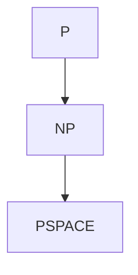

# 02-复杂性分层与P=NP问题 | Complexity Hierarchies & P vs NP Problem

---

## 1. 主题简介 | Topic Introduction

本节系统梳理复杂性分层与P=NP问题，包括P、NP、NP完全、PSPACE、EXPTIME等复杂性类，P=NP问题，强调其在数学基础、元数学、哲学分析与知识体系创新中的作用。

This section systematically reviews complexity hierarchies and the P vs NP problem, including P, NP, NP-complete, PSPACE, EXPTIME, etc., and the P=NP problem, emphasizing their roles in mathematical foundations, metamathematics, philosophical analysis, and knowledge system innovation.

---

## 2. 复杂性分层 | Complexity Hierarchies

- 理论基础：复杂性类、可计算性边界、资源约束。
- 主要类型：P、NP、NP完全、PSPACE、EXPTIME。
- 代表人物：库克（Cook）、卡普（Karp）、萨维奇（Savitch）
- 典型理论：复杂性分层、Savitch定理。
- 形式化片段（Lean）：

```lean
-- 复杂性类的Lean定义（简化）
inductive ComplexityClass
| P | NP | NPC | PSPACE | EXPTIME
```

---

## 3. P=NP问题 | P vs NP Problem

- 理论基础：多项式时间、非确定性、NP完全。
- 代表人物：库克（Cook）、卡普（Karp）、莱文（Levin）
- 典型理论：Cook-Levin定理、NP完全性。
- 伪代码：

```python
# P=NP问题判别伪代码（理论上未解决）
def is_p_equal_np():
    # 理论上未解决，仅作复杂性说明
    raise NotImplementedError
```

---

## 4. 递归扩展计划 | Recursive Expansion Plan

- 持续细化复杂性分层、P=NP、NP完全、PSPACE、EXPTIME等分支，补充代表性案例、历史事件、现代影响。
- 强化多表征内容与国际化标准。

## 概念定义 | Concept Definition

- 中文定义：复杂性分层是将计算问题按资源消耗（如时间、空间）划分为不同复杂性类（如P、NP、PSPACE等）。P=NP问题是理论计算机科学的核心难题，询问所有多项式时间可验证问题是否都能在多项式时间内求解。
- English Definition: Complexity hierarchy classifies computational problems into different complexity classes (such as P, NP, PSPACE, etc.) according to resource consumption (e.g., time, space). The P vs NP problem is a central open question in theoretical computer science, asking whether every problem whose solution can be verified in polynomial time can also be solved in polynomial time.
- 国际标准/权威来源：
  - ISO/IEC 2382:2015 (Information technology — Vocabulary)
  - Stanford Encyclopedia of Philosophy: Complexity Theory, P vs NP Problem
  - Encyclopedia of Mathematics: Complexity class, P vs NP
  - Wikipedia: Computational complexity theory, P versus NP problem
- 相关批判与哲学反思：
  - P=NP问题影响密码学、优化、人工智能等众多领域。
  - 复杂性分层揭示了理论与实际计算之间的鸿沟。
  - 复杂性理论的实际应用与理论边界仍在不断探索中。
  - P≠NP是主流观点，但尚无严格证明。

---

### 主要复杂性类与P=NP问题简表 | Table of Main Complexity Classes and P vs NP Problem

| 类别 | 英文 | 主要特征 | 典型问题 | 代表人物 |
|---|---|---|---|---|
| P | Polynomial Time | 多项式时间可解 | 排序、最短路径 | Cook, Karp |
| NP | Nondeterministic Polynomial | 多项式时间可验证 | SAT、旅行商 | Cook, Levin |
| NP完全 | NP-Complete | NP中最难问题 | SAT、3-SAT | Cook, Karp |
| PSPACE | Polynomial Space | 多项式空间可解 | QBF | Savitch |

---

### 理论历史与代表人物

- Stephen Cook：P=NP问题、NP完全性
- Richard Karp：NP完全性判定
- Leonid Levin：NP完全性理论
- Michael Sipser：复杂性理论教材
- Walter Savitch：PSPACE理论

#### 代表性原话（中英对照）

- “The P versus NP problem is the most important open problem in computer science.”（P与NP问题是计算机科学中最重要的未解难题。）——Stephen Cook
- “If P=NP, then the world would be a profoundly different place.”（如果P=NP，世界将会截然不同。）——Scott Aaronson

---

### 形式化系统与证明片段

- 复杂性类的基本定义：

```text
P = { L | 存在多项式时间判定算法A, 对任意x, x∈L ⇔ A(x)=1 }
NP = { L | 存在多项式时间可验证性, 即存在多项式p, 使得x∈L ⇔ 存在y, |y|≤p(|x|), (x, y)可多项式时间验证 }
```

- P与NP关系图（Mermaid）：



---

### 相关性与本地跳转

- 参见 [01-总览.md](./01-总览.md)
- 参见 [01-总览.md](../06-可计算性与自动机理论/01-总览.md)
- 参见 [03-算法理论与创新.md](./03-算法理论与创新.md)
