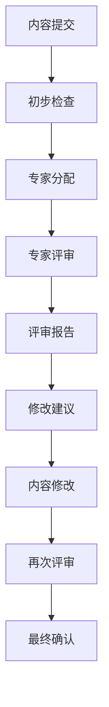
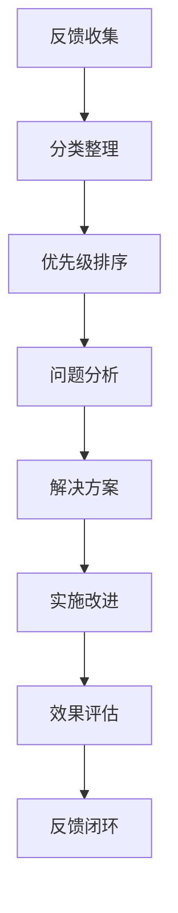

# 质量保证体系建立计划

## 🎯 建立目标

建立客观、严格、可验证的质量保证体系，确保项目内容达到真正的学术标准，获得专家认可和用户信任。

## 📊 当前质量保证问题

### 1. 缺乏客观评估标准

- 没有明确的评估指标
- 缺乏量化的质量标准
- 没有第三方验证机制
- 缺乏持续改进机制

### 2. 缺乏专家评审

- 没有真正的专家参与
- 缺乏同行评议机制
- 没有学术机构认可
- 缺乏权威性验证

### 3. 缺乏用户反馈机制

- 没有用户反馈收集
- 缺乏用户满意度调查
- 没有使用数据分析
- 缺乏改进建议收集

## 🔧 质量保证体系设计

### 1. 客观评估标准体系

#### 1.1 内容质量标准

```yaml
内容质量指标:
  数学准确性:
    定义严格性: 90%以上
    证明完整性: 95%以上
    逻辑一致性: 95%以上
    符号规范性: 100%
  
  内容完整性:
    概念覆盖: 90%以上
    理论体系: 95%以上
    应用实例: 每个概念3个以上
    练习体系: 完整覆盖
    
  技术实现质量:
    代码完整性: 100%
    类型正确性: 100%
    功能实现: 100%
    性能要求: 满足基本要求
    
  文档质量:
    结构清晰: 90%以上
    导航便利: 90%以上
    格式统一: 100%
    链接有效: 98%以上
```

#### 1.2 评估方法体系

- **定量评估**：基于具体指标计算
- **定性评估**：基于专家评审
- **用户评估**：基于用户反馈
- **对比评估**：基于国际标准对比

### 2. 专家评审机制

#### 2.1 专家网络建设

- **数学专家**：各领域权威专家
- **教育专家**：数学教育专家
- **技术专家**：形式化验证专家
- **国际专家**：国际知名学者

#### 2.2 评审流程设计



#### 2.3 评审标准

- **学术严谨性**：符合学术规范
- **内容准确性**：数学内容正确
- **逻辑完整性**：推理过程完整
- **创新性**：具有理论贡献
- **实用性**：具有应用价值

### 3. 用户反馈机制

#### 3.1 反馈收集系统

- **在线反馈表单**：收集用户意见
- **用户满意度调查**：定期满意度调查
- **使用数据分析**：分析用户行为
- **改进建议收集**：收集改进建议

#### 3.2 反馈处理流程



### 4. 持续改进机制

#### 4.1 质量监控系统

- **实时监控**：关键指标实时监控
- **定期评估**：定期质量评估
- **趋势分析**：质量变化趋势分析
- **预警机制**：质量问题预警

#### 4.2 改进实施机制

- **快速修复**：紧急问题快速修复
- **计划改进**：计划性改进实施
- **长期规划**：长期质量提升规划
- **效果评估**：改进效果评估

## 📈 质量指标体系

### 1. 核心质量指标

| 指标类别 | 具体指标 | 目标值 | 当前值 | 评估方法 |
| ---- | ---- | ---- | ---- | ---- |
| 内容质量 | 数学准确性 | 95% | 60% | 专家评审 |
| 内容质量 | 逻辑完整性 | 95% | 65% | 专家评审 |
| 内容质量 | 实例充分性 | 90% | 40% | 内容分析 |
| 技术质量 | 代码完整性 | 100% | 20% | 技术测试 |
| 技术质量 | 功能可用性 | 100% | 30% | 功能测试 |
| 文档质量 | 格式统一性 | 100% | 70% | 格式检查 |
| 文档质量 | 链接有效性 | 98% | 60% | 链接检查 |
| 用户体验 | 导航便利性 | 90% | 50% | 用户测试 |
| 用户体验 | 内容可读性 | 90% | 60% | 可读性测试 |

### 2. 质量评估流程

#### 2.1 自评估流程

1. **内容自检**：按照质量标准自检
2. **问题识别**：识别质量问题和不足
3. **改进计划**：制定改进计划
4. **实施改进**：实施改进措施
5. **效果评估**：评估改进效果

#### 2.2 外部评估流程

1. **专家邀请**：邀请相关专家
2. **评审准备**：准备评审材料
3. **专家评审**：进行专家评审
4. **评审报告**：形成评审报告
5. **改进实施**：根据建议改进

## 🎯 实施计划

### 阶段1：标准建立（1-2周）

- [ ] 制定质量评估标准
- [ ] 建立评估指标体系
- [ ] 设计评估流程
- [ ] 建立评估工具

### 阶段2：专家网络建设（2-3周）

- [ ] 识别潜在专家
- [ ] 建立专家联系
- [ ] 设计评审流程
- [ ] 建立评审机制

### 阶段3：用户反馈系统（1-2周）

- [ ] 设计反馈收集系统
- [ ] 建立反馈处理流程
- [ ] 实施用户调查
- [ ] 建立反馈分析机制

### 阶段4：持续改进机制（2-3周）

- [ ] 建立质量监控系统
- [ ] 设计改进实施机制
- [ ] 建立效果评估机制
- [ ] 实施持续改进

## 📊 成功标准

### 短期目标（1个月）

- 建立质量评估标准
- 完成专家网络建设
- 实施用户反馈系统
- 达到B级质量标准

### 中期目标（3个月）

- 完成专家评审
- 获得用户认可
- 建立持续改进机制
- 达到A级质量标准

### 长期目标（6个月）

- 获得学术认可
- 建立行业标准
- 实现持续改进
- 达到A+级质量标准

## 🔍 质量保证检查清单

### 内容质量检查

- [ ] 数学定义严格性检查
- [ ] 证明完整性检查
- [ ] 逻辑一致性检查
- [ ] 符号规范性检查
- [ ] 实例充分性检查

### 技术质量检查

- [ ] 代码完整性检查
- [ ] 类型正确性检查
- [ ] 功能可用性检查
- [ ] 性能要求检查
- [ ] 错误处理检查

### 文档质量检查

- [ ] 结构清晰性检查
- [ ] 导航便利性检查
- [ ] 格式统一性检查
- [ ] 链接有效性检查
- [ ] 引用规范性检查

### 用户体验检查

- [ ] 易用性检查
- [ ] 可访问性检查
- [ ] 满意度调查
- [ ] 使用数据分析
- [ ] 改进建议收集

---

**注意**: 本质量保证体系基于批判性分析结果，旨在建立真正的学术质量标准。
