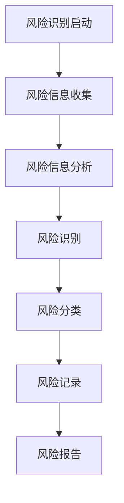
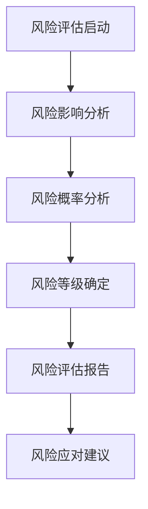
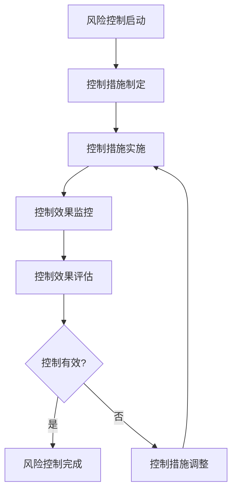
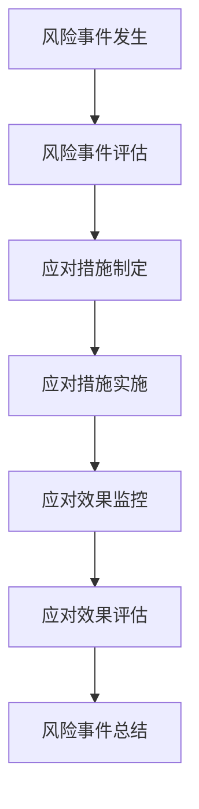

# 数学知识体系项目风险控制机制

## 📊 机制概述

**建立日期**: 2025年1月  
**机制类型**: 风险控制机制  
**适用范围**: 数学知识体系项目所有模块  

---

## 🎯 风险控制目标

### 1. 总体目标

- **风险识别**: 及时识别项目风险
- **风险评估**: 准确评估风险影响
- **风险控制**: 有效控制风险发生
- **风险应对**: 及时应对风险事件

### 2. 具体目标

- **风险识别率**: 达到95%以上
- **风险评估准确率**: 达到90%以上
- **风险控制有效率**: 达到90%以上
- **风险应对及时率**: 达到95%以上

---

## 🏗️ 风险控制框架

### 1. 风险分类

#### 1.1 内容风险

**风险类型**:

- **数学准确性风险**: 数学内容不准确的风险
- **逻辑完整性风险**: 逻辑推理不完整的风险
- **概念清晰性风险**: 概念定义不清晰的风险
- **引用规范性风险**: 引用格式不规范的风险

**风险等级**:

```yaml
内容风险等级:
  高风险:
    标准: 严重影响内容质量
    影响: 用户信任度大幅下降
    处理: 立即修复
  
  中风险:
    标准: 影响内容质量
    影响: 用户满意度下降
    处理: 24小时内修复
  
  低风险:
    标准: 轻微影响内容质量
    影响: 用户体验轻微下降
    处理: 1周内修复
```

#### 1.2 技术风险

**风险类型**:

- **代码完整性风险**: 代码不完整的风险
- **系统稳定性风险**: 系统不稳定的风险
- **性能风险**: 性能不达标的风险
- **安全风险**: 安全漏洞的风险

**风险等级**:

```yaml
技术风险等级:
  高风险:
    标准: 严重影响系统运行
    影响: 系统无法正常使用
    处理: 立即修复
  
  中风险:
    标准: 影响系统性能
    影响: 系统性能下降
    处理: 24小时内修复
  
  低风险:
    标准: 轻微影响系统性能
    影响: 用户体验轻微下降
    处理: 1周内修复
```

#### 1.3 管理风险

**风险类型**:

- **进度风险**: 项目进度延误的风险
- **资源风险**: 资源不足的风险
- **质量风险**: 质量不达标的风险
- **沟通风险**: 沟通不畅的风险

**风险等级**:

```yaml
管理风险等级:
  高风险:
    标准: 严重影响项目进展
    影响: 项目无法按时完成
    处理: 立即调整计划
  
  中风险:
    标准: 影响项目进展
    影响: 项目进度延误
    处理: 24小时内调整
  
  低风险:
    标准: 轻微影响项目进展
    影响: 项目进度轻微延误
    处理: 1周内调整
```

#### 1.4 外部风险

**风险类型**:

- **市场风险**: 市场需求变化的风险
- **技术风险**: 技术发展变化的风险
- **政策风险**: 政策变化的风险
- **竞争风险**: 竞争加剧的风险

**风险等级**:

```yaml
外部风险等级:
  高风险:
    标准: 严重影响项目发展
    影响: 项目发展受阻
    处理: 立即调整策略
  
  中风险:
    标准: 影响项目发展
    影响: 项目发展放缓
    处理: 24小时内调整
  
  低风险:
    标准: 轻微影响项目发展
    影响: 项目发展轻微放缓
    处理: 1周内调整
```

### 2. 风险控制流程

#### 2.1 风险识别流程



#### 2.2 风险评估流程



#### 2.3 风险控制流程



#### 2.4 风险应对流程



### 3. 风险控制机制

#### 3.1 预防机制

**目标**: 预防风险发生

**预防措施**:

- **风险预警**: 建立风险预警系统
- **风险监控**: 建立风险监控系统
- **风险预防**: 制定风险预防措施
- **风险培训**: 进行风险意识培训

**实施方法**:

```yaml
预防机制:
  风险预警:
    方法: 预警系统建立
    频率: 实时预警
    输出: 预警信息
  
  风险监控:
    方法: 监控系统建立
    频率: 持续监控
    输出: 监控报告
  
  风险预防:
    方法: 预防措施制定
    频率: 定期更新
    输出: 预防措施计划
  
  风险培训:
    方法: 培训计划实施
    频率: 每季度一次
    输出: 培训效果报告
```

#### 3.2 控制机制

**目标**: 控制风险影响

**控制措施**:

- **风险隔离**: 隔离风险影响范围
- **风险转移**: 转移风险责任
- **风险分担**: 分担风险责任
- **风险接受**: 接受可接受风险

**实施方法**:

```yaml
控制机制:
  风险隔离:
    方法: 隔离措施实施
    频率: 风险发生时
    输出: 隔离效果报告
  
  风险转移:
    方法: 转移措施实施
    频率: 风险发生时
    输出: 转移效果报告
  
  风险分担:
    方法: 分担措施实施
    频率: 风险发生时
    输出: 分担效果报告
  
  风险接受:
    方法: 接受措施实施
    频率: 风险发生时
    输出: 接受效果报告
```

#### 3.3 应对机制

**目标**: 应对风险事件

**应对措施**:

- **应急响应**: 建立应急响应机制
- **危机管理**: 建立危机管理机制
- **恢复计划**: 制定恢复计划
- **经验总结**: 总结应对经验

**实施方法**:

```yaml
应对机制:
  应急响应:
    方法: 应急响应机制建立
    频率: 风险事件发生时
    输出: 应急响应报告
  
  危机管理:
    方法: 危机管理机制建立
    频率: 危机事件发生时
    输出: 危机管理报告
  
  恢复计划:
    方法: 恢复计划制定
    频率: 风险事件发生后
    输出: 恢复计划
  
  经验总结:
    方法: 经验总结机制建立
    频率: 风险事件处理后
    输出: 经验总结报告
```

---

## 📈 风险监控体系

### 1. 风险监控指标

#### 1.1 内容风险监控

**监控指标**:

- **数学准确性**: 目标≥95%，当前待测
- **逻辑完整性**: 目标100%，当前待测
- **概念清晰性**: 目标≥90%，当前待测
- **引用规范性**: 目标100%，当前待测

**监控方法**:

```yaml
内容风险监控:
  数学准确性:
    监控工具: 数学验证工具
    监控频率: 实时监控
    报警阈值: <95%
  
  逻辑完整性:
    监控工具: 逻辑验证工具
    监控频率: 实时监控
    报警阈值: <100%
  
  概念清晰性:
    监控工具: 可读性测试
    监控频率: 每周监控
    报警阈值: <90%
  
  引用规范性:
    监控工具: 引用检查工具
    监控频率: 实时监控
    报警阈值: <100%
```

#### 1.2 技术风险监控

**监控指标**:

- **代码完整性**: 目标100%，当前待测
- **系统稳定性**: 目标≥99%，当前待测
- **性能指标**: 目标符合预期，当前待测
- **安全指标**: 目标无漏洞，当前待测

**监控方法**:

```yaml
技术风险监控:
  代码完整性:
    监控工具: 自动化测试
    监控频率: 实时监控
    报警阈值: <100%
  
  系统稳定性:
    监控工具: 系统监控工具
    监控频率: 实时监控
    报警阈值: <99%
  
  性能指标:
    监控工具: 性能测试工具
    监控频率: 每小时监控
    报警阈值: 超出预期范围
  
  安全指标:
    监控工具: 安全扫描工具
    监控频率: 每日监控
    报警阈值: 发现漏洞
```

#### 1.3 管理风险监控

**监控指标**:

- **进度完成率**: 目标≥90%，当前待测
- **资源利用率**: 目标≥80%，当前待测
- **质量达标率**: 目标≥90%，当前待测
- **沟通效率**: 目标≥85%，当前待测

**监控方法**:

```yaml
管理风险监控:
  进度完成率:
    监控工具: 进度监控工具
    监控频率: 每日监控
    报警阈值: <90%
  
  资源利用率:
    监控工具: 资源监控工具
    监控频率: 每周监控
    报警阈值: <80%
  
  质量达标率:
    监控工具: 质量监控工具
    监控频率: 每周监控
    报警阈值: <90%
  
  沟通效率:
    监控工具: 沟通监控工具
    监控频率: 每周监控
    报警阈值: <85%
```

#### 1.4 外部风险监控

**监控指标**:

- **市场变化**: 目标及时响应，当前待测
- **技术发展**: 目标及时跟进，当前待测
- **政策变化**: 目标及时适应，当前待测
- **竞争态势**: 目标及时调整，当前待测

**监控方法**:

```yaml
外部风险监控:
  市场变化:
    监控工具: 市场监控工具
    监控频率: 每月监控
    报警阈值: 重大变化
  
  技术发展:
    监控工具: 技术监控工具
    监控频率: 每月监控
    报警阈值: 重大发展
  
  政策变化:
    监控工具: 政策监控工具
    监控频率: 每月监控
    报警阈值: 重大变化
  
  竞争态势:
    监控工具: 竞争监控工具
    监控频率: 每月监控
    报警阈值: 重大变化
```

### 2. 风险预警系统

#### 2.1 预警机制

**预警类型**:

- **实时预警**: 实时监控风险指标
- **定期预警**: 定期检查风险状态
- **事件预警**: 风险事件发生时预警
- **趋势预警**: 风险趋势变化时预警

**预警方法**:

```yaml
预警机制:
  实时预警:
    方法: 实时监控系统
    频率: 实时监控
    输出: 实时预警信息
  
  定期预警:
    方法: 定期检查系统
    频率: 每日检查
    输出: 定期预警报告
  
  事件预警:
    方法: 事件监控系统
    频率: 事件发生时
    输出: 事件预警信息
  
  趋势预警:
    方法: 趋势分析系统
    频率: 每周分析
    输出: 趋势预警报告
```

#### 2.2 预警响应

**响应级别**:

- **一级响应**: 高风险事件，立即响应
- **二级响应**: 中风险事件，24小时内响应
- **三级响应**: 低风险事件，1周内响应
- **四级响应**: 轻微风险事件，1个月内响应

**响应方法**:

```yaml
预警响应:
  一级响应:
    方法: 立即响应机制
    时间: 立即响应
    输出: 一级响应报告
  
  二级响应:
    方法: 快速响应机制
    时间: 24小时内响应
    输出: 二级响应报告
  
  三级响应:
    方法: 标准响应机制
    时间: 1周内响应
    输出: 三级响应报告
  
  四级响应:
    方法: 常规响应机制
    时间: 1个月内响应
    输出: 四级响应报告
```

---

## 🔧 风险控制工具

### 1. 风险识别工具

#### 1.1 内容风险识别工具

**工具类型**:

- **数学验证工具**: 识别数学内容风险
- **逻辑验证工具**: 识别逻辑推理风险
- **格式检查工具**: 识别格式规范风险
- **链接检查工具**: 识别链接有效性风险

**工具配置**:

```yaml
内容风险识别工具:
  数学验证工具:
    功能: 识别数学内容风险
    频率: 实时检查
    输出: 数学风险报告
  
  逻辑验证工具:
    功能: 识别逻辑推理风险
    频率: 实时检查
    输出: 逻辑风险报告
  
  格式检查工具:
    功能: 识别格式规范风险
    频率: 每次更新后
    输出: 格式风险报告
  
  链接检查工具:
    功能: 识别链接有效性风险
    频率: 每次更新后
    输出: 链接风险报告
```

#### 1.2 技术风险识别工具

**工具类型**:

- **代码分析工具**: 识别代码质量风险
- **系统监控工具**: 识别系统运行风险
- **性能测试工具**: 识别性能风险
- **安全扫描工具**: 识别安全风险

**工具配置**:

```yaml
技术风险识别工具:
  代码分析工具:
    功能: 识别代码质量风险
    频率: 每次代码更新后
    输出: 代码风险报告
  
  系统监控工具:
    功能: 识别系统运行风险
    频率: 实时监控
    输出: 系统风险报告
  
  性能测试工具:
    功能: 识别性能风险
    频率: 每周测试
    输出: 性能风险报告
  
  安全扫描工具:
    功能: 识别安全风险
    频率: 每日扫描
    输出: 安全风险报告
```

### 2. 风险评估工具

#### 2.1 风险影响评估工具

**工具类型**:

- **影响分析工具**: 分析风险影响程度
- **概率分析工具**: 分析风险发生概率
- **等级评估工具**: 评估风险等级
- **优先级评估工具**: 评估风险优先级

**工具配置**:

```yaml
风险影响评估工具:
  影响分析工具:
    功能: 分析风险影响程度
    频率: 风险识别后
    输出: 影响分析报告
  
  概率分析工具:
    功能: 分析风险发生概率
    频率: 风险识别后
    输出: 概率分析报告
  
  等级评估工具:
    功能: 评估风险等级
    频率: 风险识别后
    输出: 等级评估报告
  
  优先级评估工具:
    功能: 评估风险优先级
    频率: 风险识别后
    输出: 优先级评估报告
```

#### 2.2 风险控制评估工具

**工具类型**:

- **控制效果评估工具**: 评估控制措施效果
- **成本效益分析工具**: 分析控制成本效益
- **可行性分析工具**: 分析控制措施可行性
- **风险评估工具**: 评估控制措施风险

**工具配置**:

```yaml
风险控制评估工具:
  控制效果评估工具:
    功能: 评估控制措施效果
    频率: 控制措施实施后
    输出: 控制效果报告
  
  成本效益分析工具:
    功能: 分析控制成本效益
    频率: 控制措施制定时
    输出: 成本效益报告
  
  可行性分析工具:
    功能: 分析控制措施可行性
    频率: 控制措施制定时
    输出: 可行性分析报告
  
  风险评估工具:
    功能: 评估控制措施风险
    频率: 控制措施制定时
    输出: 风险评估报告
```

---

## 📋 风险控制检查清单

### 风险识别检查

- [ ] 风险识别系统建立
- [ ] 风险识别工具配置
- [ ] 风险识别流程制定
- [ ] 风险识别培训完成
- [ ] 风险识别效果验证

### 风险评估检查

- [ ] 风险评估标准制定
- [ ] 风险评估工具配置
- [ ] 风险评估流程制定
- [ ] 风险评估培训完成
- [ ] 风险评估效果验证

### 风险控制检查

- [ ] 风险控制措施制定
- [ ] 风险控制工具配置
- [ ] 风险控制流程制定
- [ ] 风险控制培训完成
- [ ] 风险控制效果验证

### 风险应对检查

- [ ] 风险应对预案制定
- [ ] 风险应对工具配置
- [ ] 风险应对流程制定
- [ ] 风险应对培训完成
- [ ] 风险应对效果验证

---

## 🎯 成功标准

### 短期目标（1个月）

- 建立风险控制机制
- 实施风险识别
- 建立风险评估
- 达到基本风险控制标准

### 中期目标（3个月）

- 完善风险控制机制
- 优化风险监控工具
- 完善风险评估工具
- 达到良好风险控制标准

### 长期目标（6个月）

- 建立完善风险控制体系
- 实现有效风险控制
- 获得风险控制效果
- 达到优秀风险控制标准

---

**建立人**: 项目风险控制团队  
**建立日期**: 2025年1月  
**版本**: v1.0  
**有效期**: 持续有效，定期更新  

---

**注意**: 本风险控制机制基于客观的批判性分析结果，旨在建立有效的风险控制体系，确保项目能够有效识别、评估、控制和应对各种风险，保障项目顺利进行。
