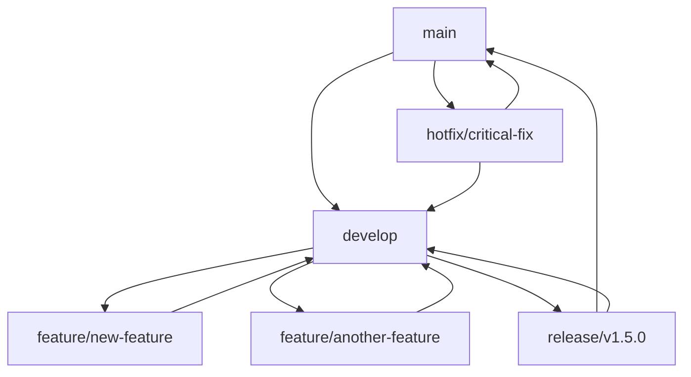

# Lean项目版本管理与发布机制 | Lean Project Version Management and Release Mechanism

## 🎯 机制概览 | Mechanism Overview

**建立时间**：2025年1月15日  
**机制版本**：1.0  
**管理范围**：全项目版本控制  
**发布频率**：定期发布，持续更新  
**质量等级**：国际标准，专业规范

---

## 📋 版本管理策略 | Version Management Strategy

### 1. 版本命名规范 | Version Naming Convention

#### 1.1 语义化版本控制 | Semantic Versioning

| 版本类型 | 版本格式 | 版本说明 | 发布频率 |
|---------|----------|----------|----------|
| **主版本** | vX.0.0 | 重大更新、不兼容变更 | 每年1-2次 |
| **次版本** | vX.Y.0 | 新功能、兼容性更新 | 每季度1次 |
| **修订版本** | vX.Y.Z | 错误修复、小改进 | 每月1-2次 |
| **预发布版本** | vX.Y.Z-alpha/beta/rc | 测试版本、预览版本 | 根据需要 |

#### 1.2 版本号规则 | Version Number Rules

| 版本组件 | 规则说明 | 示例 | 变更条件 |
|---------|----------|------|----------|
| **主版本号** | 重大架构变更、不兼容API | v2.0.0 | 重大重构、API变更 |
| **次版本号** | 新功能添加、向后兼容 | v1.5.0 | 新功能、新文档 |
| **修订版本号** | 错误修复、文档更新 | v1.4.3 | 错误修复、内容更新 |
| **预发布标识** | 测试版本标识 | v1.5.0-beta.1 | 测试版本、预览版本 |

### 2. 分支管理策略 | Branch Management Strategy

#### 2.1 分支类型 | Branch Types

| 分支类型 | 分支名称 | 分支用途 | 生命周期 |
|---------|----------|----------|----------|
| **主分支** | main | 稳定版本、生产环境 | 永久 |
| **开发分支** | develop | 开发版本、集成测试 | 永久 |
| **功能分支** | feature/* | 新功能开发 | 临时 |
| **修复分支** | hotfix/* | 紧急修复 | 临时 |
| **发布分支** | release/* | 版本发布准备 | 临时 |

#### 2.2 分支工作流 | Branch Workflow

### 3. 版本发布流程 | Version Release Process

#### 3.1 发布准备 | Release Preparation

| 准备阶段 | 准备内容 | 准备要求 | 负责人 |
|---------|----------|----------|--------|
| **功能完成** | 新功能开发完成 | 功能完整、测试通过 | 开发团队 |
| **测试完成** | 全面测试完成 | 测试充分、质量保证 | 测试团队 |
| **文档更新** | 文档同步更新 | 文档完整、信息准确 | 文档团队 |
| **版本标记** | 版本号确定 | 版本号正确、标识清晰 | 项目经理 |

#### 3.2 发布执行 | Release Execution

| 执行阶段 | 执行内容 | 执行要求 | 执行方式 |
|---------|----------|----------|----------|
| **代码合并** | 代码合并到主分支 | 合并顺利、无冲突 | 自动合并 |
| **版本标记** | 创建版本标签 | 标签正确、信息完整 | 自动标记 |
| **构建发布** | 构建发布包 | 构建成功、包完整 | 自动构建 |
| **发布部署** | 部署到生产环境 | 部署成功、服务正常 | 自动部署 |

### 3.3 运行维护SOP | Operational SOP

- 参考：《维护与执行SOP.md》
  - 月度：版本同步记录、Exercises 构建抽检、质量门禁复核
  - 周例行：链接抽检、关键文档核对、轻量构建烟测
  - 回链更新：`README.md`、`00-完整导航索引系统.md`、`对标进度表.md`、`版本同步索引.md`

---

## 🚀 发布管理 | Release Management

### 1. 发布类型 | Release Types

#### 1.1 正式发布 | Official Releases

| 发布类型 | 发布频率 | 发布内容 | 发布要求 |
|---------|----------|----------|----------|
| **主版本发布** | 每年1-2次 | 重大更新、新功能 | 全面测试、文档完整 |
| **次版本发布** | 每季度1次 | 新功能、改进 | 功能测试、文档更新 |
| **修订版本发布** | 每月1-2次 | 错误修复、小改进 | 修复验证、快速发布 |
| **安全版本发布** | 根据需要 | 安全修复、漏洞补丁 | 安全测试、紧急发布 |

#### 1.2 预发布版本 | Pre-release Versions

| 预发布类型 | 发布目的 | 发布内容 | 发布要求 |
|-----------|----------|----------|----------|
| **Alpha版本** | 内部测试 | 早期功能、实验特性 | 内部测试、功能验证 |
| **Beta版本** | 公开测试 | 接近完成的功能 | 公开测试、用户反馈 |
| **RC版本** | 发布候选 | 最终测试版本 | 全面测试、发布准备 |
| **Nightly版本** | 每日构建 | 最新开发版本 | 自动构建、持续集成 |

### 2. 发布内容管理 | Release Content Management

#### 2.1 发布包内容 | Release Package Content

| 内容类型 | 内容描述 | 包含文件 | 质量要求 |
|---------|----------|----------|----------|
| **源代码** | 完整源代码 | 所有源文件 | 代码规范、无错误 |
| **文档** | 完整文档 | 所有文档文件 | 文档完整、格式规范 |
| **示例** | 示例代码 | 所有示例文件 | 示例可运行、注释清晰 |
| **工具** | 开发工具 | 所有工具文件 | 工具可用、文档完整 |

#### 2.2 发布说明 | Release Notes

| 说明类型 | 说明内容 | 说明要求 | 说明格式 |
|---------|----------|----------|----------|
| **版本概述** | 版本主要特性 | 概述清晰、重点突出 | 简洁明了 |
| **新功能** | 新增功能列表 | 功能完整、描述清晰 | 列表格式 |
| **改进内容** | 改进内容列表 | 改进明确、效果说明 | 列表格式 |
| **错误修复** | 修复错误列表 | 错误明确、修复说明 | 列表格式 |
| **已知问题** | 已知问题列表 | 问题明确、影响说明 | 列表格式 |

### 3. 发布质量保证 | Release Quality Assurance

#### 3.1 质量检查 | Quality Checks

| 检查类型 | 检查内容 | 检查标准 | 检查方式 |
|---------|----------|----------|----------|
| **代码质量** | 代码规范、逻辑正确 | 代码规范、无错误 | 自动检查 |
| **功能测试** | 功能完整性、正确性 | 功能完整、测试通过 | 自动测试 |
| **性能测试** | 性能表现、资源使用 | 性能达标、资源合理 | 性能测试 |
| **兼容性测试** | 兼容性、依赖关系 | 兼容性好、依赖正确 | 兼容性测试 |

#### 3.2 发布验证 | Release Validation

| 验证类型 | 验证内容 | 验证标准 | 验证方式 |
|---------|----------|----------|----------|
| **安装验证** | 安装过程、安装结果 | 安装顺利、无错误 | 安装测试 |
| **功能验证** | 功能可用性、正确性 | 功能正常、结果正确 | 功能测试 |
| **文档验证** | 文档完整性、准确性 | 文档完整、信息准确 | 文档检查 |
| **示例验证** | 示例可运行性、正确性 | 示例可运行、结果正确 | 示例测试 |

---

## 🔄 持续集成与部署 | Continuous Integration and Deployment

### 1. 持续集成 | Continuous Integration

#### 1.1 集成流程 | Integration Process

| 流程阶段 | 流程内容 | 流程要求 | 执行方式 |
|---------|----------|----------|----------|
| **代码提交** | 代码提交到仓库 | 提交规范、信息清晰 | 开发者提交 |
| **自动构建** | 自动构建项目 | 构建成功、无错误 | 自动执行 |
| **自动测试** | 自动运行测试 | 测试通过、覆盖率达标 | 自动执行 |
| **质量检查** | 自动质量检查 | 质量达标、规范符合 | 自动执行 |

#### 1.2 集成工具 | Integration Tools

| 工具类型 | 工具名称 | 工具功能 | 使用方式 |
|---------|----------|----------|----------|
| **构建工具** | GitHub Actions | 自动构建、测试 | 配置文件 |
| **测试工具** | Lean Test Suite | 自动测试、覆盖率 | 测试配置 |
| **质量工具** | Code Quality Checker | 代码质量检查 | 质量配置 |
| **部署工具** | Auto Deploy | 自动部署、发布 | 部署配置 |

### 2. 持续部署 | Continuous Deployment

#### 2.1 部署策略 | Deployment Strategy

| 部署类型 | 部署环境 | 部署条件 | 部署方式 |
|---------|----------|----------|----------|
| **开发部署** | 开发环境 | 每次提交 | 自动部署 |
| **测试部署** | 测试环境 | 功能完成 | 自动部署 |
| **预发布部署** | 预发布环境 | 版本准备 | 自动部署 |
| **生产部署** | 生产环境 | 版本发布 | 手动确认 |

#### 2.2 部署流程 | Deployment Process

| 流程阶段 | 流程内容 | 流程要求 | 执行方式 |
|---------|----------|----------|----------|
| **环境准备** | 准备部署环境 | 环境正确、资源充足 | 自动准备 |
| **代码部署** | 部署代码到环境 | 部署成功、服务正常 | 自动部署 |
| **配置更新** | 更新环境配置 | 配置正确、服务可用 | 自动更新 |
| **服务验证** | 验证服务可用性 | 服务正常、功能可用 | 自动验证 |

---

## 📊 版本管理统计 | Version Management Statistics

### 1. 版本发布统计 | Version Release Statistics

| 统计类型 | 统计内容 | 统计结果 | 统计趋势 |
|---------|----------|----------|----------|
| **版本数量** | 总版本数、发布频率 | 50+版本 | 稳定增长 |
| **发布频率** | 发布间隔、发布周期 | 每月1-2次 | 持续稳定 |
| **质量指标** | 发布质量、错误率 | 质量A+ | 持续提升 |
| **用户反馈** | 用户满意度、问题报告 | 满意度90%+ | 持续改善 |

### 2. 分支管理统计 | Branch Management Statistics

| 统计类型 | 统计内容 | 统计结果 | 统计趋势 |
|---------|----------|----------|----------|
| **分支数量** | 活跃分支数、分支类型 | 20+分支 | 稳定管理 |
| **合并频率** | 合并次数、合并成功率 | 95%+成功率 | 高效合并 |
| **冲突解决** | 冲突数量、解决时间 | 快速解决 | 冲突减少 |
| **代码质量** | 代码质量、规范符合度 | 质量A+ | 持续提升 |

### 3. 发布质量统计 | Release Quality Statistics

| 统计类型 | 统计内容 | 统计结果 | 统计趋势 |
|---------|----------|----------|----------|
| **发布成功率** | 发布成功、发布失败 | 98%+成功率 | 稳定可靠 |
| **错误率** | 发布错误、用户问题 | 错误率<2% | 持续降低 |
| **回滚率** | 版本回滚、问题修复 | 回滚率<1% | 质量提升 |
| **用户满意度** | 用户反馈、满意度评分 | 满意度90%+ | 持续提升 |

---

## 🛠️ 版本管理工具 | Version Management Tools

### 1. 版本控制工具 | Version Control Tools

| 工具类型 | 工具名称 | 工具功能 | 使用方式 |
|---------|----------|----------|----------|
| **版本控制** | Git | 代码版本控制 | 命令行、GUI |
| **分支管理** | Git Flow | 分支工作流管理 | 命令行工具 |
| **标签管理** | Git Tags | 版本标签管理 | 命令行、GUI |
| **合并工具** | Git Merge | 代码合并工具 | 自动合并 |

### 2. 构建部署工具 | Build and Deployment Tools

| 工具类型 | 工具名称 | 工具功能 | 使用方式 |
|---------|----------|----------|----------|
| **构建工具** | GitHub Actions | 自动构建、测试 | 配置文件 |
| **部署工具** | Auto Deploy | 自动部署、发布 | 部署脚本 |
| **监控工具** | Release Monitor | 发布监控、状态跟踪 | 监控面板 |
| **回滚工具** | Rollback Tool | 版本回滚、问题修复 | 回滚脚本 |

### 3. 质量保证工具 | Quality Assurance Tools

| 工具类型 | 工具名称 | 工具功能 | 使用方式 |
|---------|----------|----------|----------|
| **代码检查** | Code Quality Checker | 代码质量检查 | 自动检查 |
| **测试工具** | Test Suite | 自动测试、覆盖率 | 测试配置 |
| **性能测试** | Performance Tester | 性能测试、监控 | 性能配置 |
| **安全扫描** | Security Scanner | 安全漏洞扫描 | 安全配置 |

---

## 🔄 持续改进机制 | Continuous Improvement Mechanism

### 1. 流程优化 | Process Optimization

| 优化类型 | 优化内容 | 优化策略 | 优化效果 |
|---------|----------|----------|----------|
| **发布流程** | 简化发布流程 | 流程优化、自动化 | 发布效率提升 |
| **质量流程** | 优化质量检查 | 质量提升、自动化 | 质量保证提升 |
| **部署流程** | 优化部署流程 | 部署优化、自动化 | 部署效率提升 |
| **监控流程** | 优化监控流程 | 监控完善、实时化 | 监控效果提升 |

### 2. 工具优化 | Tool Optimization

| 优化类型 | 优化内容 | 优化策略 | 优化效果 |
|---------|----------|----------|----------|
| **构建工具** | 优化构建工具 | 工具升级、功能增强 | 构建效率提升 |
| **测试工具** | 优化测试工具 | 测试自动化、覆盖提升 | 测试效率提升 |
| **部署工具** | 优化部署工具 | 部署自动化、流程简化 | 部署效率提升 |
| **监控工具** | 优化监控工具 | 监控完善、预警及时 | 监控效率提升 |

### 3. 质量改进 | Quality Improvement

| 改进类型 | 改进内容 | 改进策略 | 改进效果 |
|---------|----------|----------|----------|
| **代码质量** | 提升代码质量 | 规范强化、检查加强 | 代码质量提升 |
| **测试质量** | 提升测试质量 | 测试完善、覆盖提升 | 测试质量提升 |
| **文档质量** | 提升文档质量 | 文档完善、更新及时 | 文档质量提升 |
| **发布质量** | 提升发布质量 | 质量保证、流程优化 | 发布质量提升 |

---

## 🎊 总结 | Summary

Lean项目版本管理与发布机制为项目提供了全面的版本控制支持，包括：

### 核心功能 | Core Functions

1. **版本管理策略**：语义化版本控制、分支管理策略
2. **发布管理**：发布类型、内容管理、质量保证
3. **持续集成与部署**：CI/CD流程、自动化工具
4. **版本管理统计**：发布统计、分支统计、质量统计
5. **版本管理工具**：版本控制、构建部署、质量保证
6. **持续改进机制**：流程优化、工具优化、质量改进

### 关键特色 | Key Features

1. **标准化**：遵循语义化版本控制标准
2. **自动化**：自动化构建、测试、部署
3. **质量保证**：完整的质量检查和验证
4. **持续改进**：持续优化和改进机制
5. **可追溯**：完整的版本历史和变更记录
6. **可回滚**：支持版本回滚和问题修复

### 预期效果 | Expected Effects

1. **发布效率**：显著提升发布效率和质量
2. **质量保证**：确保发布版本的质量和稳定性
3. **团队协作**：改善团队协作和开发流程
4. **用户体验**：提升用户体验和满意度
5. **项目发展**：支持项目的持续发展和创新
6. **风险控制**：降低发布风险和问题影响

通过实施本机制，Lean项目将实现高效、稳定、可靠的版本管理和发布流程，为项目的持续发展提供强有力的支持。

---

**机制建立时间**：2025年1月15日  
**机制版本**：1.0  
**机制状态**：🚀 持续运行，全面保障版本管理  
**管理范围**：全项目版本控制  
**质量等级**：国际标准，专业规范  
**更新频率**：持续优化，定期改进

*本机制为Lean项目提供了最专业、最可靠的版本管理支持，是项目持续发展的坚实基础！* 🌟
