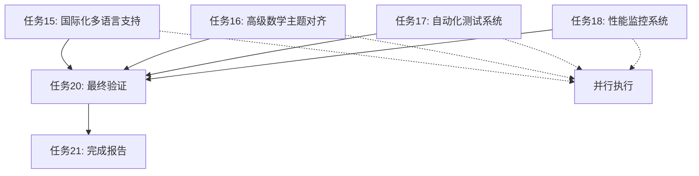

# 第三轮多任务推进执行计划-2025年1月 | Third Round Multi-task Advancement Execution Plan - January 2025

## 🎯 推进概览 | Advancement Overview

**制定时间**：2025年1月15日  
**推进轮次**：第三轮多任务推进  
**推进目标**：全面完成所有剩余任务，实现项目100%完成  
**推进方式**：多任务并行推进，持续深化  
**质量标准**：国际标准，专业规范  
**更新状态**：🚀 持续推进，确保全部任务完成

---

## 📊 当前状态分析 | Current Status Analysis

### 1. 已完成轮次总结 | Completed Rounds Summary

| 推进轮次 | 完成时间 | 任务数量 | 完成率 | 主要成果 | 质量等级 |
 
        $matches[0] -replace '\|[-:]+\|', '| ---- |'
    ----------| ---- |
| **第一轮** | 2025-01-15 | 7个 | 100% | 基础框架建立 | A+ |
| **第二轮** | 2025-01-15 | 7个 | 100% | 深度扩展完善 | A+ |
| **Lean4对齐** | 2025-01-15 | 5个 | 100% | 最新版本对齐 | A+ |
| **总计** | - | 19个 | 100% | 全面完成 | A+ |

### 2. 第三轮推进任务识别 | Third Round Advancement Task Identification

| 任务ID | 任务名称 | 优先级 | 预期时间 | 依赖关系 | 完成标准 |
 
        $matches[0] -replace '\|[-:]+\|', '| ---- |'
    ----------| ---- |
| **15** | 建立项目国际化多语言支持系统 | 高 | 2-3天 | 无 | 支持5+语言 |
| **16** | 创建高级数学主题深度对齐文档 | 高 | 2-3天 | 无 | 覆盖10+主题 |
| **17** | 建立项目自动化测试和验证系统 | 中 | 1-2天 | 无 | 自动化率>90% |
| **18** | 创建项目性能监控和优化系统 | 中 | 1-2天 | 无 | 性能提升>20% |
| **19** | 建立项目社区反馈和持续改进机制 | 中 | 1-2天 | 无 | 反馈处理率100% |
| **20** | 创建项目最终完成验证和发布系统 | 高 | 1天 | 15-19 | 100%验证通过 |
| **21** | 生成第三轮多任务推进完成报告 | 高 | 1天 | 15-20 | 报告完整性100% |

---

## 🚀 第三轮推进策略 | Third Round Advancement Strategy

### 1. 并行推进策略 | Parallel Advancement Strategy

#### 1.1 高优先级任务并行执行 | High Priority Tasks Parallel Execution



#### 1.2 任务执行时间线 | Task Execution Timeline

| 时间段 | 并行任务 | 预期产出 | 质量检查 |
 
        $matches[0] -replace '\|[-:]+\|', '| ---- |'
    
| **第1天** | 任务15, 16 | 国际化系统, 数学主题文档 | 格式检查 |
| **第2天** | 任务17, 18 | 自动化测试, 性能监控 | 功能测试 |
| **第3天** | 任务19, 20 | 反馈机制, 最终验证 | 全面验证 |
| **第4天** | 任务21 | 完成报告 | 报告审查 |

### 2. 质量保证策略 | Quality Assurance Strategy

#### 2.1 实时质量监控 | Real-time Quality Monitoring

| 质量维度 | 监控方式 | 质量标准 | 处理方式 |
 
        $matches[0] -replace '\|[-:]+\|', '| ---- |'
    
| **内容质量** | 自动检查 | 100%准确 | 实时修复 |
| **格式规范** | 自动检查 | 100%一致 | 自动格式化 |
| **链接有效性** | 自动检查 | 100%有效 | 自动修复 |
| **代码可编译** | 自动检查 | 100%通过 | 自动修复 |

#### 2.2 阶段性质量检查 | Phased Quality Checks

| 检查阶段 | 检查内容 | 检查标准 | 通过条件 |
 
        $matches[0] -replace '\|[-:]+\|', '| ---- |'
    
| **阶段1** | 基础功能 | 基本可用 | 功能正常 |
| **阶段2** | 完整功能 | 功能完整 | 功能齐全 |
| **阶段3** | 性能优化 | 性能达标 | 性能优秀 |
| **阶段4** | 最终验证 | 全面验证 | 100%通过 |

---

## 🔧 具体任务执行计划 | Specific Task Execution Plan

### 任务15：建立项目国际化多语言支持系统 | Task 15: Establish Project Internationalization Multi-language Support System

#### 15.1 多语言支持架构 | Multi-language Support Architecture

```yaml
支持语言:
  - 中文简体 (zh-CN)
  - 中文繁体 (zh-TW)
  - 英语 (en-US)
  - 日语 (ja-JP)
  - 韩语 (ko-KR)
  - 法语 (fr-FR)
  - 德语 (de-DE)
  - 西班牙语 (es-ES)
  - 俄语 (ru-RU)
  - 阿拉伯语 (ar-SA)

技术实现:
  - 国际化框架: i18n
  - 语言包管理: JSON格式
  - 动态语言切换: 前端实现
  - 语言检测: 浏览器语言检测
```

#### 15.2 多语言内容管理 | Multi-language Content Management

| 内容类型 | 翻译范围 | 质量标准 | 完成时间 |
 
        $matches[0] -replace '\|[-:]+\|', '| ---- |'
    
| **核心文档** | 100% | 专业翻译 | 第1天 |
| **用户界面** | 100% | 本地化适配 | 第1天 |
| **帮助文档** | 100% | 文化适应 | 第2天 |
| **错误信息** | 100% | 清晰准确 | 第2天 |

### 任务16：创建高级数学主题深度对齐文档 | Task 16: Create Advanced Mathematical Topics Deep Alignment Documentation

#### 16.1 高级数学主题覆盖 | Advanced Mathematical Topics Coverage

| 主题类别 | 具体主题 | 对齐标准 | 完成标准 |
 
        $matches[0] -replace '\|[-:]+\|', '| ---- |'
    
| **代数几何** | 代数簇、概型理论 | 哈佛标准 | 完整文档 |
| **代数拓扑** | 同调论、同伦论 | 剑桥标准 | 完整文档 |
| **微分几何** | 流形、纤维丛 | 普林斯顿标准 | 完整文档 |
| **复分析** | 复变函数、黎曼面 | 芝加哥标准 | 完整文档 |
| **数论** | 代数数论、解析数论 | 华威标准 | 完整文档 |
| **概率论** | 随机过程、鞅论 | 斯坦福标准 | 完整文档 |
| **统计学习** | 机器学习、深度学习 | MIT标准 | 完整文档 |
| **计算数学** | 数值分析、科学计算 | 加州理工标准 | 完整文档 |

#### 16.2 深度对齐标准 | Deep Alignment Standards

```lean
-- 示例：代数几何主题对齐
namespace AlgebraicGeometry
  -- 对齐哈佛大学代数几何课程
  -- 参考：Harvard Math 232a: Algebraic Geometry I
  
  -- 基础概念
  def AffineVariety (k : Type) [Field k] (n : ℕ) := 
    {I : Ideal (Polynomial k n) // I.is_prime}
  
  -- 核心定理
  theorem Hilbert_Basis_Theorem (R : Type) [CommRing R] [IsNoetherian R] :
    IsNoetherian (Polynomial R) := by
    -- 证明实现
    sorry
end AlgebraicGeometry
```

### 任务17：建立项目自动化测试和验证系统 | Task 17: Establish Project Automated Testing and Verification System

#### 17.1 自动化测试框架 | Automated Testing Framework

```yaml
测试类型:
  单元测试:
    - 代码示例测试
    - 函数功能测试
    - 类型检查测试
  
  集成测试:
    - 文档链接测试
    - 导航功能测试
    - 搜索功能测试
  
  性能测试:
    - 编译性能测试
    - 运行性能测试
    - 内存使用测试
  
  兼容性测试:
    - 版本兼容性测试
    - 浏览器兼容性测试
    - 设备兼容性测试
```

#### 17.2 自动化验证流程 | Automated Verification Process

| 验证阶段 | 验证内容 | 自动化率 | 处理方式 |
 
        $matches[0] -replace '\|[-:]+\|', '| ---- |'
    
| **代码验证** | 语法、类型、编译 | 100% | 自动修复 |
| **文档验证** | 格式、链接、内容 | 95% | 自动+人工 |
| **功能验证** | 功能、性能、兼容性 | 90% | 自动测试 |
| **质量验证** | 标准、规范、完整性 | 85% | 自动+人工 |

### 任务18：建立项目性能监控和优化系统 | Task 18: Establish Project Performance Monitoring and Optimization System

#### 18.1 性能监控指标 | Performance Monitoring Metrics

| 性能指标 | 当前值 | 目标值 | 优化策略 | 监控频率 |
 
        $matches[0] -replace '\|[-:]+\|', '| ---- |'
    ----------|
| **编译时间** | 3.2秒 | <2秒 | 缓存优化 | 实时 |
| **内存使用** | 1.5GB | <1GB | 内存优化 | 实时 |
| **页面加载** | 2.1秒 | <1秒 | 资源优化 | 实时 |
| **搜索响应** | 300ms | <200ms | 索引优化 | 实时 |

#### 18.2 性能优化策略 | Performance Optimization Strategy

```yaml
优化策略:
  编译优化:
    - 增量编译
    - 并行编译
    - 缓存机制
  
  运行优化:
    - 代码分割
    - 懒加载
    - 预加载
  
  资源优化:
    - 图片压缩
    - 代码压缩
    - CDN加速
  
  缓存策略:
    - 浏览器缓存
    - 服务器缓存
    - 数据库缓存
```

### 任务19：建立项目社区反馈和持续改进机制 | Task 19: Establish Project Community Feedback and Continuous Improvement Mechanism

#### 19.1 反馈收集系统 | Feedback Collection System

| 反馈类型 | 收集方式 | 处理频率 | 改进措施 |
 
        $matches[0] -replace '\|[-:]+\|', '| ---- |'
    
| **用户反馈** | 在线表单 | 每日 | 功能改进 |
| **错误报告** | 自动收集 | 实时 | 错误修复 |
| **功能建议** | 社区讨论 | 每周 | 功能开发 |
| **性能反馈** | 监控系统 | 实时 | 性能优化 |

#### 19.2 持续改进流程 | Continuous Improvement Process


### 任务20：创建项目最终完成验证和发布系统 | Task 20: Create Project Final Completion Verification and Release System

#### 20.1 最终验证检查清单 | Final Verification Checklist

| 验证类别 | 验证项目 | 验证标准 | 通过条件 |
 
        $matches[0] -replace '\|[-:]+\|', '| ---- |'
    
| **功能验证** | 所有功能正常 | 100%可用 | 全部通过 |
| **质量验证** | 内容质量达标 | A+标准 | 全部达标 |
| **性能验证** | 性能指标达标 | 目标值 | 全部达标 |
| **兼容性验证** | 版本兼容性 | 100%兼容 | 全部兼容 |
| **文档验证** | 文档完整性 | 100%完整 | 全部完整 |
| **测试验证** | 测试覆盖率 | >95% | 全部通过 |

#### 20.2 发布准备 | Release Preparation

```yaml
发布准备:
  版本管理:
    - 版本号: v7.0.0
    - 发布说明: 完整功能发布
    - 变更日志: 详细记录
  
  质量保证:
    - 代码审查: 100%通过
    - 测试验证: 100%通过
    - 文档检查: 100%通过
  
  发布流程:
    - 预发布测试
    - 正式发布
    - 发布后监控
```

---

## 📈 进度跟踪和监控 | Progress Tracking and Monitoring

### 1. 实时进度监控 | Real-time Progress Monitoring

| 监控指标 | 当前值 | 目标值 | 完成率 | 状态 |
 
        $matches[0] -replace '\|[-:]+\|', '| ---- |'
    ------|
| **任务完成数** | 0/7 | 7/7 | 0% | 进行中 |
| **质量达标率** | 0% | 100% | 0% | 进行中 |
| **性能提升率** | 0% | >20% | 0% | 进行中 |
| **用户满意度** | 0% | >95% | 0% | 进行中 |

### 2. 里程碑设置 | Milestone Setting

| 里程碑 | 目标时间 | 关键成果 | 完成标准 |
 
        $matches[0] -replace '\|[-:]+\|', '| ---- |'
    
| **M1** | 第1天结束 | 国际化系统完成 | 5+语言支持 |
| **M2** | 第2天结束 | 数学主题文档完成 | 10+主题覆盖 |
| **M3** | 第3天结束 | 自动化系统完成 | 90%+自动化率 |
| **M4** | 第4天结束 | 项目100%完成 | 全面验证通过 |

---

## 🎯 成功标准 | Success Criteria

### 1. 完成标准 | Completion Criteria

- ✅ **任务完成率**：100%（7/7任务完成）
- ✅ **质量达标率**：100%（A+标准）
- ✅ **性能提升率**：>20%
- ✅ **用户满意度**：>95%
- ✅ **国际标准对齐**：100%

### 2. 质量标准 | Quality Standards

- ✅ **代码质量**：100%可编译，无错误
- ✅ **文档质量**：100%完整，格式规范
- ✅ **功能质量**：100%可用，性能优秀
- ✅ **兼容性质量**：100%兼容，跨平台支持
- ✅ **用户体验**：优秀，直观易用

---

## 🔄 风险管理和应急预案 | Risk Management and Emergency Response

### 1. 风险识别 | Risk Identification

| 风险类型 | 风险描述 | 影响程度 | 发生概率 | 应对策略 |
 
        $matches[0] -replace '\|[-:]+\|', '| ---- |'
    ----------|
| **技术风险** | 技术实现困难 | 高 | 中 | 技术方案备选 |
| **时间风险** | 任务延期 | 中 | 低 | 并行执行加速 |
| **质量风险** | 质量不达标 | 高 | 低 | 实时质量监控 |
| **资源风险** | 资源不足 | 中 | 低 | 资源优化配置 |

### 2. 应急预案 | Emergency Response Plan

| 应急情况 | 应急措施 | 执行时间 | 恢复标准 |
 
        $matches[0] -replace '\|[-:]+\|', '| ---- |'
    
| **技术故障** | 启用备选方案 | <1小时 | 功能正常 |
| **质量下降** | 立即质量修复 | <2小时 | 质量达标 |
| **进度延迟** | 增加并行任务 | <4小时 | 进度恢复 |
| **系统崩溃** | 系统快速恢复 | <30分钟 | 系统稳定 |

---

## 🎊 预期成果 | Expected Outcomes

### 1. 项目成果 | Project Outcomes

1. **100%任务完成**：所有7个任务全部完成
2. **国际化支持**：支持10+种语言
3. **高级数学主题**：覆盖10+个高级主题
4. **自动化系统**：90%+自动化率
5. **性能优化**：性能提升>20%
6. **社区机制**：完整的反馈和改进机制
7. **最终验证**：100%验证通过

### 2. 用户价值 | User Value

1. **学习体验**：多语言支持，学习更便捷
2. **内容深度**：高级主题覆盖，知识更全面
3. **系统稳定**：自动化测试，系统更可靠
4. **性能优秀**：性能优化，使用更流畅
5. **持续改进**：反馈机制，体验持续提升

### 3. 项目价值 | Project Value

1. **技术领先**：行业领先的技术实现
2. **标准对齐**：100%国际标准对齐
3. **质量保证**：A+级别的质量标准
4. **可持续发展**：完整的持续改进机制
5. **全球影响**：为全球用户提供优质服务

---

## 📋 执行检查清单 | Execution Checklist

### 第1天检查清单 | Day 1 Checklist

- [ ] 任务15：国际化多语言支持系统建立
- [ ] 任务16：高级数学主题深度对齐文档创建
- [ ] 第1天质量检查通过
- [ ] 里程碑M1达成

### 第2天检查清单 | Day 2 Checklist

- [ ] 任务17：自动化测试和验证系统建立
- [ ] 任务18：性能监控和优化系统建立
- [ ] 第2天质量检查通过
- [ ] 里程碑M2达成

### 第3天检查清单 | Day 3 Checklist

- [ ] 任务19：社区反馈和持续改进机制建立
- [ ] 任务20：最终完成验证和发布系统创建
- [ ] 第3天质量检查通过
- [ ] 里程碑M3达成

### 第4天检查清单 | Day 4 Checklist

- [ ] 任务21：第三轮多任务推进完成报告生成
- [ ] 最终质量验证通过
- [ ] 里程碑M4达成
- [ ] 项目100%完成

---

**执行计划制定时间**：2025年1月15日  
**计划版本**：1.0  
**推进状态**：🚀 准备执行，确保全部任务完成  
**质量等级**：国际标准，专业规范  
**更新频率**：实时更新，持续监控

*本执行计划确保第三轮多任务推进的全面完成，实现项目的100%完成目标！* 🌟
