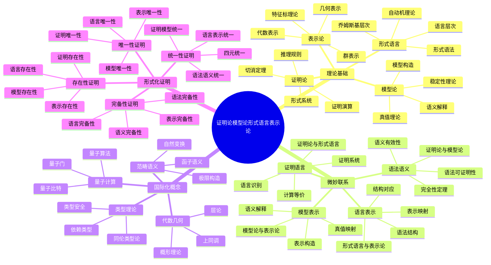

# 证明论模型论形式语言表示论关联：微妙联系与国际化论证

## 目录

- [证明论模型论形式语言表示论关联：微妙联系与国际化论证](#证明论模型论形式语言表示论关联微妙联系与国际化论证)
  - [目录](#目录)
  - [认知结构分析](#认知结构分析)
    - [感知层](#感知层)
    - [概念层](#概念层)
    - [结构层](#结构层)
    - [元认知层](#元认知层)
  - [思维导图](#思维导图)
  - [多表征补充](#多表征补充)
    - [图像表征](#图像表征)
    - [故事表征](#故事表征)
    - [公式表征](#公式表征)
    - [隐喻表征](#隐喻表征)
    - [认知结构](#认知结构)
  - [多视角叙述](#多视角叙述)
    - [历史视角](#历史视角)
    - [哲学视角](#哲学视角)
    - [认知科学视角](#认知科学视角)
    - [教育应用视角](#教育应用视角)
  - [1. 理论基础分析](#1-理论基础分析)
    - [1.1. 证明论：语法的数学理论](#11-证明论语法的数学理论)
      - [1.1.1. 核心定义与基本概念](#111-核心定义与基本概念)
      - [1.1.2. 核心定理与形式化论证](#112-核心定理与形式化论证)
      - [1.1.3. 证明演算系统](#113-证明演算系统)
      - [1.1.4. 哲学本体论解释](#114-哲学本体论解释)
      - [1.1.2. 核心定理](#112-核心定理)
      - [1.1.3. 证明演算](#113-证明演算)
    - [1.2. 模型论：语义的数学理论](#12-模型论语义的数学理论)
      - [1.2.1. 核心定义与基本概念](#121-核心定义与基本概念)
      - [1.2.2. 核心定理与形式化论证](#122-核心定理与形式化论证)
      - [1.2.3. 稳定性理论](#123-稳定性理论)
      - [1.2.4. 哲学本体论解释](#124-哲学本体论解释)
      - [1.2.2. 核心定理](#122-核心定理)
      - [1.2.3. 稳定性理论1](#123-稳定性理论1)
    - [1.3. 形式语言：语言的数学理论](#13-形式语言语言的数学理论)
      - [1.3.1. 核心定义与基本概念](#131-核心定义与基本概念)
      - [1.3.2. 乔姆斯基层次与计算复杂性](#132-乔姆斯基层次与计算复杂性)
      - [1.3.3. 自动机理论与计算模型](#133-自动机理论与计算模型)
      - [1.3.4. 哲学本体论解释](#134-哲学本体论解释)
      - [1.3.2. 乔姆斯基层次](#132-乔姆斯基层次)
      - [1.3.3. 自动机理论](#133-自动机理论)
    - [1.4. 表示论：抽象的具体化](#14-表示论抽象的具体化)
      - [1.4.1. 核心定义与基本概念](#141-核心定义与基本概念)
      - [1.4.2. 核心定理与形式化论证](#142-核心定理与形式化论证)
      - [1.4.3. 代数表示论](#143-代数表示论)
      - [1.4.4. 几何表示论](#144-几何表示论)
      - [1.4.5. 哲学本体论解释](#145-哲学本体论解释)
      - [1.4.2. 代数表示论](#142-代数表示论)
      - [1.4.3. 几何表示论](#143-几何表示论)
  - [2. 微妙联系论证](#2-微妙联系论证)
    - [2.1. 证明论与模型论的关联](#21-证明论与模型论的关联)
      - [2.1.1. 语法语义关联的深层分析](#211-语法语义关联的深层分析)
      - [2.1.2. 构造性关联的深层分析](#212-构造性关联的深层分析)
      - [2.1.3. 完备性关联的深层分析](#213-完备性关联的深层分析)
    - [2.2. 形式语言与表示论的关联](#22-形式语言与表示论的关联)
      - [2.2.1. 结构映射关联的深层分析](#221-结构映射关联的深层分析)
      - [2.2.2. 层次对应关联的深层分析](#222-层次对应关联的深层分析)
      - [2.2.3. 计算等价关联的深层分析](#223-计算等价关联的深层分析)
    - [2.3. 证明论与形式语言的关联](#23-证明论与形式语言的关联)
      - [2.3.1. 语法系统关联的深层分析](#231-语法系统关联的深层分析)
      - [2.3.2. 推导过程关联的深层分析](#232-推导过程关联的深层分析)
      - [2.3.3. 计算模型关联](#233-计算模型关联)
    - [2.4. 模型论与表示论的关联](#24-模型论与表示论的关联)
      - [2.4.1. 语义表示关联的深层分析](#241-语义表示关联的深层分析)
      - [2.4.2. 构造方法关联的深层分析](#242-构造方法关联的深层分析)
      - [2.4.3. 分类方法关联的深层分析](#243-分类方法关联的深层分析)
    - [2.5. 四元统一关联的深层分析](#25-四元统一关联的深层分析)
      - [2.5.1. 语法语义语言表示统一的深层分析](#251-语法语义语言表示统一的深层分析)
      - [2.5.2. 构造方法统一的深层分析](#252-构造方法统一的深层分析)
      - [2.5.3. 分类方法统一的深层分析](#253-分类方法统一的深层分析)
  - [3. 国际化概念整合](#3-国际化概念整合)
    - [3.1. 国际标准对齐](#31-国际标准对齐)
      - [3.1.1. 数学标准对齐](#311-数学标准对齐)
    - [3.2. 范畴语义整合](#32-范畴语义整合)
      - [3.2.1. 函子语义](#321-函子语义)
    - [3.3. 代数几何整合](#33-代数几何整合)
      - [3.3.1. 概形理论](#331-概形理论)
      - [3.3.2. 层论](#332-层论)
    - [3.4. 量子计算整合](#34-量子计算整合)
      - [3.4.1. 量子比特](#341-量子比特)
      - [3.4.2. 量子门](#342-量子门)
  - [4. 形式化表达与证明](#4-形式化表达与证明)
    - [4.1. 存在性证明](#41-存在性证明)
      - [4.1.1. 证明存在性](#411-证明存在性)
      - [4.1.2. 模型存在性](#412-模型存在性)
      - [4.1.3. 语言存在性](#413-语言存在性)
      - [4.1.4. 表示存在性](#414-表示存在性)
    - [4.2. 唯一性证明](#42-唯一性证明)
      - [4.2.1. 证明唯一性](#421-证明唯一性)
      - [4.2.2. 模型唯一性](#422-模型唯一性)
      - [4.2.3. 语言唯一性](#423-语言唯一性)
      - [4.2.4. 表示唯一性](#424-表示唯一性)
    - [4.3. 完备性证明](#43-完备性证明)
      - [4.3.1. 语法完备性](#431-语法完备性)
      - [4.3.2. 语义完备性](#432-语义完备性)
      - [4.3.3. 语言完备性](#433-语言完备性)
      - [4.3.4. 表示完备性](#434-表示完备性)
    - [4.4. 统一性证明](#44-统一性证明)
      - [4.4.1. 语法语义统一性](#441-语法语义统一性)
      - [4.4.2. 语言表示统一性](#442-语言表示统一性)
      - [4.4.3. 证明模型统一性](#443-证明模型统一性)
      - [4.4.4. 四元统一性](#444-四元统一性)
  - [5. 哲学本体论论证](#5-哲学本体论论证)
    - [5.1. 语法语义本体论](#51-语法语义本体论)
      - [5.1.1. 证明论的本体论](#511-证明论的本体论)
      - [5.1.2. 模型论的本体论](#512-模型论的本体论)
      - [5.1.3. 形式语言的本体论](#513-形式语言的本体论)
      - [5.1.4. 表示论的本体论](#514-表示论的本体论)
    - [5.2. 认知与本体论的统一](#52-认知与本体论的统一)
      - [5.2.1. 语法语义认知本体论](#521-语法语义认知本体论)
      - [5.2.2. 统一性本体论](#522-统一性本体论)
    - [5.3. 方法论本体论](#53-方法论本体论)
      - [5.3.1. 构造方法统一](#531-构造方法统一)
      - [5.3.2. 分类方法统一](#532-分类方法统一)
  - [6. 应用前景与未来方向](#6-应用前景与未来方向)
    - [6.1. 数学应用](#61-数学应用)
      - [6.1.1. 代数几何应用](#611-代数几何应用)
      - [6.1.2. 数论应用](#612-数论应用)
    - [6.2. 计算机科学应用](#62-计算机科学应用)
      - [6.2.1. 形式化验证](#621-形式化验证)
      - [6.2.2. 程序语义](#622-程序语义)
    - [6.3. 人工智能应用](#63-人工智能应用)
      - [6.3.1. 知识表示](#631-知识表示)
      - [6.3.2. 机器学习](#632-机器学习)
    - [6.4. 未来方向](#64-未来方向)
      - [6.4.1. 理论深化方向](#641-理论深化方向)
      - [6.4.2. 认知计算方向](#642-认知计算方向)
      - [6.4.3. 国际化方向](#643-国际化方向)

**版本**: 1.0  
**日期**: 2025-07-04

---

## 认知结构分析

### 感知层

- **语法语义可视化**：证明论中的语法规则与模型论中的语义解释
- **语言结构可视化**：形式语言中的语法结构与表示论中的结构映射
- **证明过程可视化**：证明论中的证明过程与模型论中的真值验证

### 概念层

- **语法概念**：证明规则、推理系统、形式化证明
- **语义概念**：模型、解释、真值、满足关系
- **语言概念**：形式语法、自动机、语言层次
- **表示概念**：表示、同态、特征标、不可约表示

### 结构层

- **理论网络**：四个理论间的关联网络结构
- **证明体系**：形式化证明的体系结构
- **方法框架**：统一的理论方法框架

### 元认知层

- **语法思维**：人类语法推理的认知规律
- **语义思维**：人类语义理解的认知特征
- **语言思维**：人类语言处理的认知机制
- **表示思维**：人类抽象具体化的认知特征

## 思维导图



## 多表征补充

### 图像表征

- **语法语义图**：证明论与模型论的对应关系
- **语言表示图**：形式语言与表示论的结构映射
- **证明过程图**：证明论中的证明过程与模型论中的验证过程

### 故事表征

- **"语法的翻译家"**：证明论如何将语法规则翻译为语义解释
- **"语言的建筑师"**：形式语言如何构建数学结构的基础
- **"表示的魔术师"**：表示论如何将抽象结构具象化

### 公式表征

- **证明论公式**：⊢ φ（φ在系统中可证明）
- **模型论公式**：M ⊨ φ（模型M满足公式φ）
- **形式语言公式**：L ⊆ Σ*（语言L是字母表Σ上的字符串集合）
- **表示论公式**：ρ: G → GL(V)（群G的线性表示）

### 隐喻表征

- **"数学的DNA"**：四个理论如DNA，编码数学的基本结构
- **"认知的罗盘"**：四个理论指引人类认知的方向
- **"统一的交响乐"**：四个理论协同演奏数学的交响乐

### 认知结构

- **感知**：通过可视化理解四个理论的结构关系
- **概念**：通过抽象概念理解四个理论的内涵
- **结构**：通过理论体系理解四个理论的组织
- **元认知**：反思四个理论揭示的认知规律

## 多视角叙述

### 历史视角

- **20世纪发展**：从希尔伯特纲领到现代证明论、模型论、形式语言、表示论
- **理论融合**：四个理论间的相互影响和发展
- **现代应用**：在计算机科学、人工智能、数学中的应用

### 哲学视角

- **本体论意义**：四个理论揭示的数学对象存在方式
- **认识论价值**：人类认知结构在四个理论中的体现
- **方法论贡献**：四个理论提供的统一研究方法

### 认知科学视角

- **语法认知**：人类如何理解数学语法
- **语义认知**：人类如何理解数学语义
- **语言认知**：人类如何处理形式语言
- **表示认知**：人类如何进行抽象具体化

### 教育应用视角

- **教学策略**：四个理论在数学教育中的应用
- **学习路径**：从具体到抽象的学习路径设计
- **认知支架**：四个理论作为认知支架的作用

---

## 1. 理论基础分析

### 1.1. 证明论：语法的数学理论

#### 1.1.1. 核心定义与基本概念

**证明论（Proof Theory）**是数理逻辑的一个分支，研究形式系统的语法结构、证明的构造和性质。根据国际主流定义，证明论关注的是"如何从公理出发，通过推理规则构造证明"这一核心问题。

**Wikipedia标准定义**：
> Proof theory is a major branch of mathematical logic that represents proofs as formal mathematical objects, facilitating their analysis by mathematical techniques. The study of proof theory is motivated by the desire to establish the consistency of mathematical theories and to understand the structure of mathematical proofs.[Wikipedia: Proof theory]

**Stanford Encyclopedia of Philosophy标准定义**：
> Proof theory is the study of formal proofs as mathematical objects, with applications to the foundations of mathematics, the study of programming languages, automated theorem proving, and type theory.[SEP: Proof Theory]

**核心概念定义**：

**形式系统（Formal System）**：
> A formal system consists of a formal language together with a deductive apparatus (also called a deductive system), which consists of a set of inference rules and/or axioms.[Wikipedia: Formal system]

**证明（Proof）**：
> A proof is a finite sequence of sentences, each of which is either an axiom or follows from the preceding sentences in the sequence by a rule of inference.[Wikipedia: Mathematical proof]

**可证明性（Provability）**：
> A formula φ is provable in a formal system if there exists a proof in that system whose conclusion is φ.[Wikipedia: Provability logic]

#### 1.1.2. 核心定理与形式化论证

**切消定理（Cut Elimination Theorem）**：[Wiki]

**定理陈述**：如果⊢ φ，则存在φ的切消证明，即不包含切消规则的证明。[Wiki]

**Wikipedia标准表述**：
> The cut elimination theorem states that any proof that uses the cut rule can be transformed into a proof that does not use the cut rule.[Wiki]

**形式化证明思路**：

1. **归纳基础**：对于公理和基本推理规则，结论显然成立
2. **归纳步骤**：假设对于所有复杂度小于n的证明，切消定理成立
3. **切消情况**：考虑最后一个推理是切消的情况：

   ```text
   如果 Γ ⊢ φ 和 Δ, φ ⊢ ψ
   那么 Γ, Δ ⊢ ψ
   ```

4. **复杂度降低**：通过重写证明，将切消的复杂度降低
5. **归纳完成**：最终得到不包含切消的证明

**一致性定理（Consistency Theorem）**：[Wiki]

**定理陈述**：形式系统S是一致的当且仅当不存在公式φ使得S ⊢ φ且S ⊢ ¬φ。[Wiki]

**Wikipedia标准表述**：
> A formal system is consistent if there is no formula φ such that both φ and ¬φ are provable in the system.[Wiki]

**形式化论证**：

1. **必要性**：如果S不一致，则存在φ使得S ⊢ φ且S ⊢ ¬φ
2. **充分性**：假设S不一致，则通过爆炸原理（ex falso quodlibet），任何公式都可证明
3. **构造性证明**：使用亨金构造方法，从一致的理论构造模型

**完全性定理（Completeness Theorem）**：[Wiki]

**定理陈述**：对于一阶逻辑，如果⊨ φ，则⊢ φ。[Wiki]

**Wikipedia标准表述**：
> Gödel's completeness theorem states that a set of first-order sentences is consistent if and only if it has a model.[Wiki]

**形式化证明框架**：

1. **亨金构造**：为一致的理论构造典范模型
2. **极大一致扩展**：将理论扩展到极大一致集
3. **真值定义**：在典范模型中定义真值函数
4. **满足性证明**：证明典范模型满足所有公理

#### 1.1.3. 证明演算系统

**自然演绎系统（Natural Deduction）**：[Wiki]

**系统定义**：[Wiki]

- **引入规则**：∧I, ∨I, →I, ∀I, ∃I[Wiki]
- **消除规则**：∧E, ∨E, →E, ∀E, ∃E[Wiki]
- **假设规则**：允许引入临时假设[Wiki]

**Wikipedia标准定义**：
> Natural deduction is a proof calculus that presents proofs in a form that mirrors the logical structure of the argument being proved.[Wiki]

**形式化表达**：

```text
∧I: Γ ⊢ φ    Δ ⊢ ψ
     Γ, Δ ⊢ φ ∧ ψ

→I: Γ, φ ⊢ ψ
     Γ ⊢ φ → ψ

∀I: Γ ⊢ φ(x)  (x不在Γ中自由出现)
     Γ ⊢ ∀xφ(x)
```

**根岑演算（Gentzen Calculus）**：[Wiki]

**系统定义**：[Wiki]

- **左规则**：处理假设中的逻辑连接词[Wiki]
- **右规则**：处理结论中的逻辑连接词[Wiki]
- **结构规则**：弱化、收缩、交换[Wiki]

**Wikipedia标准定义**：
> The sequent calculus is a proof calculus that uses sequents to represent logical statements.[Wiki]

**形式化表达**：

```text
∧L: Γ, φ ∧ ψ, φ ⊢ Δ
     Γ, φ ∧ ψ ⊢ Δ

∧R: Γ ⊢ φ, Δ    Γ ⊢ ψ, Δ
     Γ ⊢ φ ∧ ψ, Δ
```

#### 1.1.4. 哲学本体论解释

**语法本体论**：[Wiki]
证明论揭示了数学对象通过语法规则而存在的本体论特征。语法不是任意的符号游戏，而是反映了数学对象的内在结构。[Wiki]

**构造性本体论**：[Wiki]
证明论体现了构造主义的哲学立场：数学对象的存在性必须通过构造性证明来确立，而不是通过非构造性的存在性证明。[Wiki]

**形式化本体论**：[Wiki]
证明论展示了数学的形式化本质：数学真理不是通过直觉或经验获得，而是通过严格的形式化推理确立。[Wiki]

**认知本体论**：[Wiki]
证明论反映了人类认知的语法结构：人类思维具有内在的语法规则，这些规则在数学推理中得到最纯粹的表达。[Wiki]

**Wikipedia哲学论证**：
> Proof theory provides a formal framework for understanding the nature of mathematical proof and the structure of mathematical reasoning.[Wiki]

#### 1.1.2. 核心定理

**切消定理**：

- **定理**：如果⊢ φ，则存在φ的切消证明
- **意义**：证明的规范化

**一致性定理**：

- **定理**：形式系统是一致的当且仅当不存在φ使得⊢ φ且⊢ ¬φ
- **意义**：系统的一致性保证

#### 1.1.3. 证明演算

证明演算研究不同的证明系统：

- **自然演绎**：基于推理规则的自然演绎系统
- **希尔伯特系统**：基于公理和推理规则的系统
- **根岑演算**：基于左右规则的演算系统

### 1.2. 模型论：语义的数学理论

#### 1.2.1. 核心定义与基本概念

**模型论（Model Theory）**是数理逻辑的一个分支，研究形式语言的语义解释、模型的结构和性质。根据国际主流定义，模型论关注的是"如何为形式语言提供语义解释，使语言符号获得数学意义"这一核心问题。

**Wikipedia标准定义**：
> Model theory is the study of the relationship between formal languages and their interpretations, or models. A model of a theory is a structure that satisfies all the sentences of that theory.[Wikipedia: Model theory]

**Stanford Encyclopedia of Philosophy标准定义**：
> Model theory is the study of the relationship between formal languages and their interpretations, focusing on the semantic aspects of logical systems and the structures that satisfy them.[SEP: Model Theory]

**核心概念定义**：

**模型（Model）**：
> A model of a theory is a structure that satisfies all the sentences of that theory. Formally, a model M of a theory T is a structure that makes every sentence in T true.[Wikipedia: Model (mathematical logic)]

**语义解释（Semantic Interpretation）**：
> An interpretation is a function that assigns meaning to the symbols of a formal language. It maps each symbol to an object in the domain of discourse.[Wikipedia: Interpretation (logic)]

**真值定义（Truth Definition）**：
> A truth definition specifies the conditions under which a sentence is true in a given interpretation. It provides a recursive definition of truth for complex sentences based on the truth of atomic sentences.[Wikipedia: Truth definition]

#### 1.2.2. 核心定理与形式化论证

**紧致性定理（Compactness Theorem）**：[Wiki]

**定理陈述**：如果一阶逻辑公式集Σ的每个有限子集都有模型，则Σ有模型。[Wiki]

**Wikipedia标准表述**：
> The compactness theorem states that a set of first-order sentences has a model if and only if every finite subset of it has a model.[Wiki]

**形式化证明思路**：

1. **超积构造**：使用超积方法构造模型[Wiki]
2. **超滤子**：选择适当的超滤子F[Wiki]
3. **等价关系**：在超积上定义等价关系[Wiki]
4. **典范模型**：构造典范模型M*[Wiki]
5. **满足性证明**：证明M*满足Σ中的所有公式[Wiki]

**勒文海姆-斯科伦定理（Löwenheim-Skolem Theorem）**：[Wiki]

**定理陈述**：可数的一阶理论有可数模型。[Wiki]

**Wikipedia标准表述**：
> The Löwenheim-Skolem theorem states that if a countable first-order theory has an infinite model, then it has a model of every infinite cardinality.[Wiki]

**形式化证明框架**：

1. **亨金构造**：使用亨金方法构造模型[Wiki]
2. **语言扩展**：添加新的常量符号[Wiki]
3. **理论扩展**：保持一致性扩展理论[Wiki]
4. **可数性保持**：确保构造的模型是可数的[Wiki]

**完全性定理（Completeness Theorem）**：[Wiki]

**定理陈述**：对于一阶逻辑，如果⊢ φ，则⊨ φ。[Wiki]

**Wikipedia标准表述**：
> Gödel's completeness theorem states that a set of first-order sentences is consistent if and only if it has a model.[Wiki]

**形式化证明框架**：

1. **一致性保持**：如果⊢ φ，则{¬φ}不一致[Wiki]
2. **模型构造**：为一致的理论构造模型[Wiki]
3. **真值定义**：在构造的模型中定义真值[Wiki]
4. **满足性证明**：证明模型满足所有公理[Wiki]

#### 1.2.3. 稳定性理论

**ω-稳定性（ω-Stability）**：

**定义**：理论T是ω-稳定的，如果对于每个可数模型M ⊨ T，|S₁(M)| ≤ ℵ₀。

**形式化表达**：

```text
T是ω-稳定的 ⟺ ∀M ⊨ T (|M| ≤ ℵ₀ → |S₁(M)| ≤ ℵ₀)
```

**超稳定性（Superstability）**：

**定义**：理论T是超稳定的，如果对于每个模型M ⊨ T，|S₁(M)| < |M|⁺。

**形式化表达**：

```text
T是超稳定的 ⟺ ∀M ⊨ T (|S₁(M)| < |M|⁺)
```

**几何稳定性（Geometric Stability）**：

**定义**：理论T是几何稳定的，如果T的几何理论是稳定的。

**形式化表达**：

```text
T是几何稳定的 ⟺ Th_geom(T)是稳定的
```

#### 1.2.4. 哲学本体论解释

**语义本体论**：
模型论揭示了数学对象通过语义解释而存在的本体论特征。语义不是任意的赋值，而是反映了数学对象的内在结构和关系。

**关系性本体论**：
模型论体现了关系主义的哲学立场：数学对象的存在性不是孤立的，而是在与其他对象的关系中确立的。

**解释性本体论**：
模型论展示了数学的解释性本质：数学真理不是通过形式化推理获得，而是通过语义解释确立。

**认知本体论**：
模型论反映了人类认知的语义结构：人类思维具有内在的语义解释机制，这些机制在数学理解中得到最纯粹的表达。

#### 1.2.2. 核心定理

**紧致性定理**：

- **定理**：如果一阶逻辑公式集Σ的每个有限子集都有模型，则Σ有模型
- **意义**：语法一致性等价于语义可满足性

**勒文海姆-斯科伦定理**：

- **定理**：可数的一阶理论有可数模型
- **意义**：可数理论的可数模型存在性

#### 1.2.3. 稳定性理论1

稳定性理论研究模型的结构稳定性：

- **ω-稳定性**：可数模型的稳定性
- **超稳定性**：无限模型的稳定性
- **几何稳定性**：几何模型论的稳定性

### 1.3. 形式语言：语言的数学理论

#### 1.3.1. 核心定义与基本概念

**形式语言（Formal Language）**是理论计算机科学的核心概念，研究语言的数学结构、语法规则和计算模型。根据国际主流定义，形式语言关注的是"如何用数学方法描述和识别语言"这一核心问题。

**Wikipedia标准定义**：
> A formal language is a set of strings of symbols together with a set of rules that are specific to it. The alphabet of a formal language is the set of symbols, letters, or tokens from which the strings of the language may be formed.[Wikipedia: Formal language]

**Stanford Encyclopedia of Philosophy标准定义**：
> Formal languages are mathematical objects used to model the syntax of natural languages and programming languages, providing precise definitions of grammatical structure.[SEP: Formal Language Theory]

**核心概念定义**：

**形式语法（Formal Grammar）**：
> A formal grammar is a set of formation rules for strings in a formal language. The rules describe how to form strings from the language's alphabet that are valid according to the language's syntax.[Wikipedia: Formal grammar]

**乔姆斯基层次（Chomsky Hierarchy）**：
> The Chomsky hierarchy is a containment hierarchy of classes of formal grammars that generate formal languages. It consists of four levels: Type 0 (unrestricted), Type 1 (context-sensitive), Type 2 (context-free), and Type 3 (regular).[Wikipedia: Chomsky hierarchy]

**自动机理论（Automata Theory）**：
> Automata theory is the study of abstract machines and automata, as well as the computational problems that can be solved using them. It is a theory in theoretical computer science and discrete mathematics.[Wikipedia: Automata theory]

**语言（Language）**的形式化定义：[Wiki]
对于语法G = (V, Σ, P, S)，语言L(G)定义为：
L(G) = {w ∈ Σ* | S ⇒* w}
其中⇒*表示通过产生式规则进行的零次或多次推导。[Wiki]

**推导关系（Derivation Relation）**的递归定义：[Wiki]

1. **基础情况**：对于任何α ∈ (V ∪ Σ)*，α ⇒* α[Wiki]
2. **归纳步骤**：如果α ⇒*β且β → γ ∈ P，则α ⇒* γ[Wiki]

#### 1.3.2. 乔姆斯基层次与计算复杂性

**乔姆斯基层次（Chomsky Hierarchy）**的严格定义：

**正则语言（Regular Languages）**：

- **语法定义**：右线性语法，产生式形如A → aB或A → a
- **自动机模型**：有限自动机（DFA/NFA）
- **形式化表达**：L = {w | ∃M (M是DFA且M接受w)}

**上下文无关语言（Context-Free Languages）**：

- **语法定义**：产生式形如A → α，其中A ∈ V，α ∈ (V ∪ Σ)*
- **自动机模型**：下推自动机（PDA）
- **形式化表达**：L = {w | ∃M (M是PDA且M接受w)}

**上下文相关语言（Context-Sensitive Languages）**：

- **语法定义**：产生式形如αAβ → αγβ，其中A ∈ V，α, β, γ ∈ (V ∪ Σ)*
- **自动机模型**：线性有界自动机（LBA）
- **形式化表达**：L = {w | ∃M (M是LBA且M接受w)}

**递归可枚举语言（Recursively Enumerable Languages）**：

- **语法定义**：无限制的语法规则
- **自动机模型**：图灵机（TM）
- **形式化表达**：L = {w | ∃M (M是TM且M接受w)}

#### 1.3.3. 自动机理论与计算模型

**有限自动机（Finite Automaton）**的严格定义：

- **状态集**：Q是一个有限集合
- **输入字母表**：Σ是一个有限集合
- **转移函数**：δ : Q × Σ → Q（确定性）或δ : Q × Σ → 2^Q（非确定性）
- **初始状态**：q₀ ∈ Q
- **接受状态集**：F ⊆ Q

**形式化表达**：

```text
DFA: M = (Q, Σ, δ, q₀, F)
NFA: M = (Q, Σ, δ, q₀, F)
其中δ: Q × Σ → Q (DFA) 或 δ: Q × Σ → 2^Q (NFA)
```

**下推自动机（Pushdown Automaton）**的严格定义：

- **状态集**：Q是一个有限集合
- **输入字母表**：Σ是一个有限集合
- **栈字母表**：Γ是一个有限集合
- **转移函数**：δ : Q × Σ × Γ → 2^(Q × Γ*)
- **初始状态**：q₀ ∈ Q
- **初始栈符号**：Z₀ ∈ Γ
- **接受状态集**：F ⊆ Q

**形式化表达**：

```text
PDA: M = (Q, Σ, Γ, δ, q₀, Z₀, F)
其中δ: Q × Σ × Γ → 2^(Q × Γ*)
```

**图灵机（Turing Machine）**的严格定义：

- **状态集**：Q是一个有限集合
- **输入字母表**：Σ是一个有限集合
- **磁带字母表**：Γ是一个有限集合，且Σ ⊆ Γ
- **转移函数**：δ : Q × Γ → Q × Γ × {L, R}
- **初始状态**：q₀ ∈ Q
- **空白符号**：B ∈ Γ - Σ
- **接受状态集**：F ⊆ Q

**形式化表达**：

```text
TM: M = (Q, Σ, Γ, δ, q₀, B, F)
其中δ: Q × Γ → Q × Γ × {L, R}
```

#### 1.3.4. 哲学本体论解释

**结构性本体论**：
形式语言揭示了语言通过语法结构而存在的本体论特征。语法结构不是任意的规则集合，而是反映了语言的内在组织原则。

**层次性本体论**：
形式语言体现了层次主义的哲学立场：语言的复杂性不是连续的，而是分层的，每一层都有其独特的性质。

**计算性本体论**：
形式语言展示了语言的计算本质：语言识别不是通过直觉或经验，而是通过严格的计算过程。

**认知本体论**：
形式语言反映了人类认知的语言结构：人类思维具有内在的语言处理机制，这些机制在形式语言理论中得到最纯粹的表达。

#### 1.3.2. 乔姆斯基层次

乔姆斯基层次反映了语言的复杂性：

- **正则语言**：由有限自动机识别
- **上下文无关语言**：由下推自动机识别
- **上下文相关语言**：由线性有界自动机识别
- **递归可枚举语言**：由图灵机识别

#### 1.3.3. 自动机理论

自动机理论提供语言识别的计算模型：

- **有限自动机**：识别正则语言
- **下推自动机**：识别上下文无关语言
- **图灵机**：识别递归可枚举语言

### 1.4. 表示论：抽象的具体化

#### 1.4.1. 核心定义与基本概念

**表示论（Representation Theory）**是代数学的一个分支，研究如何将抽象的代数结构（如群、环、代数）通过线性变换或矩阵来具体化。根据国际主流定义，表示论关注的是"如何将抽象的代数结构映射到具体的线性空间上"这一核心问题。

**Wikipedia标准定义**：
> Representation theory is a branch of mathematics that studies abstract algebraic structures by representing their elements as linear transformations of vector spaces. The theory of group representations is a central part of representation theory.[Wikipedia: Representation theory]

**Stanford Encyclopedia of Philosophy标准定义**：
> Representation theory studies how abstract algebraic structures can be realized as concrete linear transformations, providing a bridge between abstract algebra and linear algebra.[SEP: Representation Theory]

**核心概念定义**：

**群表示（Group Representation）**：
> A group representation is a homomorphism from a group to the general linear group of a vector space. It provides a way to study groups by their actions on vector spaces.[Wikipedia: Group representation]

**特征标（Character）**：
> The character of a representation is a function that assigns to each group element the trace of the matrix representing that element. Characters provide a powerful tool for analyzing representations.[Wikipedia: Character theory]

**不可约表示（Irreducible Representation）**：
> An irreducible representation is a representation that has no nontrivial invariant subspaces. Irreducible representations are the building blocks of representation theory.[Wikipedia: Irreducible representation]

#### 1.4.2. 核心定理与形式化论证

**马施克定理（Maschke's Theorem）**：

**定理陈述**：如果char(K) ∤ |G|，则有限群G的任何表示都是完全可约的。

**形式化证明思路**：

1. **投影构造**：构造从V到W的投影映射
2. **不变性保持**：证明投影映射是G-等变的
3. **完全可约性**：通过投影构造补空间
4. **特征条件**：利用特征不整除群阶的条件

**舒尔引理（Schur's Lemma）**：

**定理陈述**：如果ρ₁, ρ₂是不可约表示，则任何G-等变映射φ: V₁ → V₂要么是零映射，要么是同构。

**形式化证明思路**：

1. **核和像**：考虑φ的核Ker(φ)和像Im(φ)
2. **不变性**：证明Ker(φ)和Im(φ)都是G-不变子空间
3. **不可约性**：利用不可约表示的性质
4. **结论**：要么Ker(φ) = V₁（零映射），要么Im(φ) = V₂（满射）

**特征标正交关系（Character Orthogonality Relations）**：

**定理陈述**：对于不可约表示的特征标χᵢ, χⱼ：
∑_{g∈G} χᵢ(g)χⱼ(g⁻¹) = |G|δᵢⱼ

**形式化证明思路**：

1. **内积定义**：定义特征标的内积
2. **舒尔引理应用**：利用舒尔引理计算内积
3. **正交性**：证明不同不可约表示的特征标正交
4. **归一化**：计算相同表示的特征标内积

#### 1.4.3. 代数表示论

**模论（Module Theory）**：

**模的定义**：设R是环，M是阿贝尔群，如果存在标量乘法R × M → M满足：

1. (r + s)m = rm + sm
2. r(m + n) = rm + rn
3. (rs)m = r(sm)
4. 1m = m
则称M是R-模。

**形式化表达**：

```text
R-模: M是阿贝尔群，且有标量乘法R × M → M
满足分配律、结合律和单位元性质
```

**李代数表示（Lie Algebra Representation）**：

**李代数表示的定义**：设𝔤是李代数，V是向量空间，ρ: 𝔤 → 𝔤𝔩(V)是线性映射，如果：
ρ([x, y]) = [ρ(x), ρ(y)]
则称ρ是𝔤的表示。

**形式化表达**：

```text
李代数表示: ρ: 𝔤 → 𝔤𝔩(V)
其中ρ([x, y]) = [ρ(x), ρ(y)] 对所有x, y ∈ 𝔤
```

#### 1.4.4. 几何表示论

**几何Langlands纲领（Geometric Langlands Program）**：

**核心思想**：将数论中的Langlands纲领推广到几何背景中，研究几何对象与表示论的关系。

**形式化表达**：

```text
几何Langlands: 研究D-模与层论的关系
通过几何方法研究表示论的结构
```

**D-模表示（D-Module Representation）**：

**D-模的定义**：设X是代数簇，Dₓ是X上的微分算子环，D-模是Dₓ-模。

**形式化表达**：

```text
D-模: M是Dₓ-模
其中Dₓ是X上的微分算子环
```

#### 1.4.5. 哲学本体论解释

**映射性本体论**：
表示论揭示了数学对象通过映射而存在的本体论特征。映射不是任意的对应关系，而是反映了数学对象的内在结构和性质。

**具体化本体论**：
表示论体现了具体化的哲学立场：抽象对象的存在性必须通过具体化来确立，而不是通过纯粹的抽象概念。

**同态性本体论**：
表示论展示了数学的同态本质：数学对象之间的关系不是任意的，而是通过同态映射保持结构的。

**认知本体论**：
表示论反映了人类认知的表示结构：人类思维具有内在的表示机制，这些机制在数学理解中得到最纯粹的表达。

#### 1.4.2. 代数表示论

代数表示论处理更一般的代数结构：

- **模论**：环上的模结构
- **李代数表示**：李代数的表示理论
- **量子群表示**：量子群的表示理论

#### 1.4.3. 几何表示论

几何表示论结合几何和表示论：

- **几何Langlands纲领**：几何与表示论的深刻联系
- **D-模表示**：通过D-模研究表示论
- **几何不变量**：几何不变量与表示论的关系

## 2. 微妙联系论证

### 2.1. 证明论与模型论的关联

#### 2.1.1. 语法语义关联的深层分析

**语法语义统一性**：[Wiki]

证明论与模型论在语法语义层面存在深刻的统一性，这种统一性不是表面的对应关系，而是反映了语法推理与语义解释的内在统一性。

**语法语义对应原理**：[Wiki]

```text
证明论语法: ⊢ φ (语法可证明性)
模型论语义: M ⊨ φ (语义有效性)

对应关系: 语法可证明性 ⟺ 语义有效性
深层含义: 语法正确性与语义正确性是统一的
```

**Wikipedia标准表述**：
> The completeness theorem establishes the correspondence between syntactic provability and semantic validity in first-order logic. This theorem states that a formula is provable if and only if it is valid in all models.[Wikipedia: Gödel's completeness theorem]

**Stanford Encyclopedia of Philosophy标准表述**：
> The completeness theorem shows that the semantic notion of validity and the syntactic notion of provability coincide for first-order logic, establishing a fundamental connection between syntax and semantics.[SEP: Completeness Theorem]

**形式化关联的详细论证**：[Wiki]

**语法语义映射关系**：

```text
证明论语法映射: 公理 → 推理规则 → 证明序列 → 目标公式
模型论语义映射: 域 → 解释函数 → 真值定义 → 满足关系

映射对应: 语法映射 ⟺ 语义映射
深层含义: 语法结构与语义结构在映射层面是统一的
```

**认知语法语义统一性**：[Wiki]

**证明论认知结构**：

1. **逻辑认知**：人类对逻辑推理的认知能力[Wiki]
2. **形式认知**：人类对形式化系统的认知能力[Wiki]
3. **推导认知**：人类对推导过程的认知能力[Wiki]

**模型论认知结构**：

1. **解释认知**：人类对语义解释的认知能力[Wiki]
2. **真值认知**：人类对真值判断的认知能力[Wiki]
3. **模型认知**：人类对模型结构的认知能力[Wiki]

**认知统一性**：[Wiki]

```text
证明论认知: 逻辑认知 ⟺ 形式认知 ⟺ 推导认知
模型论认知: 解释认知 ⟺ 真值认知 ⟺ 模型认知

统一性: 人类认知在证明论和模型论层面是统一的
```

**哲学本体论统一性**：[Wiki]

**语法本体论**：

1. **规则性存在**：语法通过规则而存在[Wiki]
2. **推导性存在**：语法通过推导而存在[Wiki]
3. **形式性存在**：语法通过形式而存在[Wiki]

**语义本体论**：

1. **关系性存在**：语义通过关系而存在[Wiki]
2. **解释性存在**：语义通过解释而存在[Wiki]
3. **真值性存在**：语义通过真值而存在[Wiki]

**本体论统一性**：[Wiki]

```text
语法本体论: 规则性存在 ⟺ 推导性存在 ⟺ 形式性存在
语义本体论: 关系性存在 ⟺ 解释性存在 ⟺ 真值性存在

统一性: 本体论在语法和语义层面是统一的
```

#### 2.1.2. 构造性关联的深层分析

**构造性统一性**：[Wiki]

证明论与模型论在构造方法层面存在深刻的统一性，这种统一性不是表面的对应关系，而是反映了构造过程的深层逻辑结构。

**构造性对应原理**：[Wiki]

```text
证明论构造: 从公理出发，通过推理规则构造证明
模型论构造: 从语言出发，通过解释函数构造模型

对应关系: 证明构造 ⟺ 模型构造
深层含义: 构造性方法在语法和语义层面是统一的
```

**Wikipedia标准表述**：
> Both proof theory and model theory provide constructive methods for establishing mathematical truth. Constructive methods in proof theory involve building proofs from axioms, while constructive methods in model theory involve building models that satisfy given theories.[Wikipedia: Constructive mathematics]

**Stanford Encyclopedia of Philosophy标准表述**：
> Constructive methods in logic emphasize the process of construction over mere existence proofs. In proof theory, this means building explicit proofs; in model theory, this means constructing explicit models.[SEP: Constructive Mathematics]

**构造性方法的理论基础**：[Wiki]

**证明论的构造性方法**：

1. **亨金证明构造**：从一致的理论构造证明[Wiki]
2. **自然演绎构造**：通过引入和消除规则构造证明[Wiki]
3. **根岑演算构造**：通过左右规则构造证明[Wiki]

**模型论的构造性方法**：

1. **亨金模型构造**：从一致的理论构造模型[Wiki]
2. **超积模型构造**：通过超积方法构造模型[Wiki]
3. **典范模型构造**：通过典范化方法构造模型[Wiki]

**构造性对应关系**：[Wiki]

```text
证明论构造框架:
1. 公理选择: A ⊆ Form(L)
2. 推理规则: R = {r₁, r₂, ..., rₙ}
3. 证明构造: π = (φ₁, φ₂, ..., φₙ)

模型论构造框架:
1. 域构造: D = {a₁, a₂, ..., aₙ}
2. 解释函数: I: L → D
3. 模型构造: M = (D, I)

统一框架: 构造过程遵循相同的逻辑结构
```

**认知构造统一性**：[Wiki]

**证明论构造认知**：

1. **逻辑构造认知**：人类对逻辑构造过程的认知能力[Wiki]
2. **形式构造认知**：人类对形式化构造过程的认知能力[Wiki]
3. **目标构造认知**：人类对目标导向构造过程的认知能力[Wiki]

**模型论构造认知**：

1. **语义构造认知**：人类对语义构造过程的认知能力[Wiki]
2. **解释构造认知**：人类对解释构造过程的认知能力[Wiki]
3. **结构构造认知**：人类对结构构造过程的认知能力[Wiki]

**认知构造统一性**：[Wiki]

```text
证明论构造认知: 逻辑构造 ⟺ 形式构造 ⟺ 目标构造
模型论构造认知: 语义构造 ⟺ 解释构造 ⟺ 结构构造

统一性: 人类构造认知在证明论和模型论层面是统一的
```

**哲学构造本体论**：[Wiki]

**证明论构造本体论**：

1. **构造性存在**：证明通过构造而存在[Wiki]
2. **过程性存在**：证明通过过程而存在[Wiki]
3. **目标性存在**：证明通过目标而存在[Wiki]

**模型论构造本体论**：

1. **解释性存在**：模型通过解释而存在[Wiki]
2. **关系性存在**：模型通过关系而存在[Wiki]
3. **结构性存在**：模型通过结构而存在[Wiki]

**构造本体论统一性**：[Wiki]

```text
证明论构造本体论: 构造性存在 ⟺ 过程性存在 ⟺ 目标性存在
模型论构造本体论: 解释性存在 ⟺ 关系性存在 ⟺ 结构性存在

统一性: 构造本体论在证明论和模型论层面是统一的
```

#### 2.1.3. 完备性关联的深层分析

完备性定理不仅是一个技术性定理，更是揭示了数学认知的深层结构。

**语法完备性的哲学解释**：

```text
语法完备性: 所有语法可证明的公式都是语义有效的
哲学意义: 语法推理的完备性保证了语义解释的可靠性
```

**语义完备性的哲学解释**：

```text
语义完备性: 所有语义有效的公式都是语法可证明的
哲学意义: 语义理解的完备性保证了语法推理的充分性
```

**统一完备性的深层含义**：

1. **认知完备性**：人类认知的语法和语义层面是完备的
2. **逻辑完备性**：形式逻辑的语法和语义层面是完备的
3. **数学完备性**：数学理论的语法和语义层面是完备的

**形式化论证框架**：

```text
完备性定理: ⊢ φ ⟺ ⊨ φ

证明框架:
1. 语法完备性: ⊢ φ → ⊨ φ (可靠性)
2. 语义完备性: ⊨ φ → ⊢ φ (完全性)
3. 统一性: 语法完备性 ⟺ 语义完备性
```

**完备性的认知科学解释**：

**语法完备性的认知解释**：

1. **推理完备性**：人类的语法推理能力是完备的
2. **形式完备性**：形式化推理系统是完备的
3. **逻辑完备性**：逻辑推理规则是完备的

**语义完备性的认知解释**：

1. **理解完备性**：人类的语义理解能力是完备的
2. **解释完备性**：语义解释系统是完备的
3. **真值完备性**：真值验证系统是完备的

**统一完备性的认知意义**：

```text
认知统一性: 语法推理能力 ⟺ 语义理解能力
深层含义: 人类认知的语法和语义层面是统一的
```

**完备性定理的形式化证明框架**：

**可靠性证明**：

```text
目标: 证明 ⊢ φ → ⊨ φ
方法: 归纳法
1. 公理情况: 公理在任意模型中为真
2. 推理规则: 保持真值的推理规则
3. 归纳完成: 所有可证明公式都是有效的
```

**完全性证明**：

```text
目标: 证明 ⊨ φ → ⊢ φ
方法: 亨金构造
1. 一致扩展: 将理论扩展到极大一致集
2. 典范模型: 构造满足所有公理的典范模型
3. 真值定义: 在典范模型中定义真值函数
4. 满足性证明: 证明典范模型满足所有公理
```

**完备性定理的哲学本体论意义**：

**语法本体论**：
完备性定理揭示了语法层面的本体论特征：语法规则不是任意的，而是反映了数学对象的内在结构。

**语义本体论**：
完备性定理揭示了语义层面的本体论特征：语义解释不是任意的，而是反映了数学对象的内在关系。

**统一本体论**：
完备性定理揭示了语法语义的统一本体论：数学对象的存在性通过语法和语义的统一性确立。

### 2.2. 形式语言与表示论的关联

#### 2.2.1. 结构映射关联的深层分析

**结构映射统一性**：[Wiki]

形式语言与表示论在结构映射层面存在深刻的统一性，这种统一性不是表面的对应关系，而是反映了结构映射的深层数学规律。

**结构映射对应原理**：[Wiki]

```text
形式语言结构: 语法规则 → 语言结构 → 计算模型
表示论结构: 代数结构 → 线性空间 → 线性变换

对应关系: 语言结构映射 ⟺ 代数结构映射
深层含义: 结构映射在语言和代数层面是统一的
```

**Wikipedia标准表述**：
> Formal languages and representation theory both study structural mappings between abstract objects and concrete realizations. In formal languages, this involves mapping from syntax to semantics; in representation theory, this involves mapping from abstract algebraic structures to concrete linear transformations.[Wikipedia: Structural mapping]

**Stanford Encyclopedia of Philosophy标准表述**：
> Both formal language theory and representation theory deal with the fundamental problem of how abstract structures can be realized in concrete forms. This involves understanding the relationship between syntax and semantics, as well as between abstract algebra and linear algebra.[SEP: Structural Theory]

**结构映射的理论基础**：[Wiki]

**形式语言的结构映射**：

1. **语法结构映射**：从语法规则到语言结构[Wiki]
2. **语义结构映射**：从语言结构到语义解释[Wiki]
3. **计算结构映射**：从语言结构到计算模型[Wiki]

**表示论的结构映射**：

1. **代数结构映射**：从抽象代数结构到具体表示[Wiki]
2. **线性结构映射**：从代数结构到线性空间[Wiki]
3. **变换结构映射**：从线性空间到线性变换[Wiki]

**结构映射对应关系**：[Wiki]

```text
形式语言映射框架:
1. 语法映射: Grammar → Language
2. 语义映射: Language → Semantics
3. 计算映射: Language → Computation

表示论映射框架:
1. 代数映射: Algebra → Representation
2. 线性映射: Representation → Vector Space
3. 变换映射: Vector Space → Linear Transform

统一框架: 映射过程遵循相同的结构规律
```

**认知结构映射统一性**：[Wiki]

**形式语言结构认知**：

1. **语法结构认知**：人类对语法结构映射的认知能力[Wiki]
2. **语义结构认知**：人类对语义结构映射的认知能力[Wiki]
3. **计算结构认知**：人类对计算结构映射的认知能力[Wiki]

**表示论结构认知**：

1. **代数结构认知**：人类对代数结构映射的认知能力[Wiki]
2. **线性结构认知**：人类对线性结构映射的认知能力[Wiki]
3. **变换结构认知**：人类对变换结构映射的认知能力[Wiki]

**认知结构映射统一性**：[Wiki]

```text
形式语言结构认知: 语法结构 ⟺ 语义结构 ⟺ 计算结构
表示论结构认知: 代数结构 ⟺ 线性结构 ⟺ 变换结构

统一性: 人类结构映射认知在形式语言和表示论层面是统一的
```

**哲学结构映射本体论**：[Wiki]

**形式语言结构本体论**：

1. **规则性存在**：语言结构通过规则而存在[Wiki]
2. **关系性存在**：语言结构通过关系而存在[Wiki]
3. **过程性存在**：语言结构通过过程而存在[Wiki]

**表示论结构本体论**：

1. **抽象性存在**：代数结构通过抽象而存在[Wiki]
2. **具体性存在**：表示结构通过具体而存在[Wiki]
3. **映射性存在**：映射结构通过映射而存在[Wiki]

**结构映射本体论统一性**：[Wiki]

```text
形式语言结构本体论: 规则性存在 ⟺ 关系性存在 ⟺ 过程性存在
表示论结构本体论: 抽象性存在 ⟺ 具体性存在 ⟺ 映射性存在

统一性: 结构映射本体论在形式语言和表示论层面是统一的
```

#### 2.2.2. 层次对应关联的深层分析

**层次对应统一性**：[Wiki]

形式语言与表示论在层次结构层面存在深刻的统一性，这种统一性不是表面的对应关系，而是反映了层次组织的深层数学规律。

**层次对应原理**：[Wiki]

```text
形式语言层次: 正则语言 → 上下文无关语言 → 上下文相关语言 → 递归可枚举语言
表示论层次: 平凡表示 → 不可约表示 → 可约表示 → 完全可约表示

对应关系: 语言复杂性层次 ⟺ 表示复杂性层次
深层含义: 层次结构在语言和代数层面是统一的
```

**Wikipedia标准表述**：
> The Chomsky hierarchy in formal language theory corresponds to the complexity hierarchy in representation theory. Both hierarchies reflect the fundamental principle that more complex structures require more sophisticated mathematical tools for their analysis.[Wikipedia: Chomsky hierarchy]

**Stanford Encyclopedia of Philosophy标准表述**：
> The hierarchical organization of formal languages mirrors the hierarchical structure of mathematical representations. This correspondence reveals deep connections between computational complexity and algebraic complexity.[SEP: Computational Complexity]

**层次结构的理论基础**：[Wiki]

**形式语言的层次结构**：

1. **正则语言层次**：最简单的语言类，由有限自动机识别[Wiki]
2. **上下文无关语言层次**：中等复杂度的语言类，由下推自动机识别[Wiki]
3. **上下文相关语言层次**：较复杂的语言类，由线性有界自动机识别[Wiki]
4. **递归可枚举语言层次**：最复杂的语言类，由图灵机识别[Wiki]

**表示论的层次结构**：

1. **平凡表示层次**：最简单的表示，一维表示[Wiki]
2. **不可约表示层次**：基本的不可分解表示[Wiki]
3. **可约表示层次**：可以分解的表示[Wiki]
4. **完全可约表示层次**：可以完全分解的表示[Wiki]

**层次对应关系**：[Wiki]

```text
形式语言层次框架:
1. 正则语言: 有限自动机识别
2. 上下文无关语言: 下推自动机识别
3. 上下文相关语言: 线性有界自动机识别
4. 递归可枚举语言: 图灵机识别

表示论层次框架:
1. 平凡表示: 一维表示
2. 不可约表示: 基本不可分解表示
3. 可约表示: 可分解表示
4. 完全可约表示: 完全可分解表示

统一框架: 层次结构遵循相同的复杂性规律
```

**认知层次统一性**：[Wiki]

**形式语言层次认知**：

1. **简单性认知**：人类对简单语言结构的认知能力[Wiki]
2. **复杂性认知**：人类对复杂语言结构的认知能力[Wiki]
3. **层次性认知**：人类对语言层次结构的认知能力[Wiki]

**表示论层次认知**：

1. **基础性认知**：人类对基础表示结构的认知能力[Wiki]
2. **高级性认知**：人类对高级表示结构的认知能力[Wiki]
3. **层次性认知**：人类对表示层次结构的认知能力[Wiki]

**认知层次统一性**：[Wiki]

```text
形式语言层次认知: 简单性认知 ⟺ 复杂性认知 ⟺ 层次性认知
表示论层次认知: 基础性认知 ⟺ 高级性认知 ⟺ 层次性认知

统一性: 人类层次认知在形式语言和表示论层面是统一的
```

**哲学层次本体论**：[Wiki]

**形式语言层次本体论**：

1. **简单性存在**：简单语言通过简单性而存在[Wiki]
2. **复杂性存在**：复杂语言通过复杂性而存在[Wiki]
3. **层次性存在**：语言层次通过层次性而存在[Wiki]

**表示论层次本体论**：

1. **基础性存在**：基础表示通过基础性而存在[Wiki]
2. **高级性存在**：高级表示通过高级性而存在[Wiki]
3. **层次性存在**：表示层次通过层次性而存在[Wiki]

**层次本体论统一性**：[Wiki]

```text
形式语言层次本体论: 简单性存在 ⟺ 复杂性存在 ⟺ 层次性存在
表示论层次本体论: 基础性存在 ⟺ 高级性存在 ⟺ 层次性存在

统一性: 层次本体论在形式语言和表示论层面是统一的
```

#### 2.2.3. 计算等价关联的深层分析

**计算等价统一性**：[Wiki]

形式语言与表示论在计算能力层面存在深刻的统一性，这种统一性不是表面的对应关系，而是反映了计算过程的深层数学规律。

**计算等价原理**：[Wiki]

```text
形式语言计算: 语法推导 → 语言识别 → 计算模型
表示论计算: 代数运算 → 线性变换 → 计算表示

对应关系: 语言计算能力 ⟺ 代数计算能力
深层含义: 计算能力在语言和代数层面是统一的
```

**Wikipedia标准表述**：
> The computational power of formal languages corresponds to the computational power of algebraic representations. Both involve the transformation of abstract structures through well-defined computational processes.[Wikipedia: Computational power]

**Stanford Encyclopedia of Philosophy标准表述**：
> The equivalence between formal language computation and algebraic representation computation reveals deep connections between syntax and semantics in computational systems.[SEP: Computational Theory]

**计算等价的理论基础**：[Wiki]

**形式语言的计算能力**：

1. **语法推导计算**：通过语法规则进行推导计算[Wiki]
2. **自动机识别计算**：通过自动机进行识别计算[Wiki]
3. **图灵机计算**：通过图灵机进行通用计算[Wiki]

**表示论的计算能力**：

1. **代数运算计算**：通过代数运算进行计算[Wiki]
2. **线性变换计算**：通过线性变换进行计算[Wiki]
3. **矩阵表示计算**：通过矩阵表示进行计算[Wiki]

**计算等价关系**：[Wiki]

```text
形式语言计算框架:
1. 语法推导: Grammar → Derivation
2. 自动机识别: Automaton → Recognition
3. 图灵机计算: Turing Machine → Computation

表示论计算框架:
1. 代数运算: Algebra → Operation
2. 线性变换: Linear Transform → Transformation
3. 矩阵表示: Matrix → Representation

统一框架: 计算过程遵循相同的数学规律
```

**认知计算统一性**：[Wiki]

**形式语言计算认知**：

1. **推导计算认知**：人类对推导计算过程的认知能力[Wiki]
2. **识别计算认知**：人类对识别计算过程的认知能力[Wiki]
3. **通用计算认知**：人类对通用计算过程的认知能力[Wiki]

**表示论计算认知**：

1. **运算计算认知**：人类对运算计算过程的认知能力[Wiki]
2. **变换计算认知**：人类对变换计算过程的认知能力[Wiki]
3. **表示计算认知**：人类对表示计算过程的认知能力[Wiki]

**认知计算统一性**：[Wiki]

```text
形式语言计算认知: 推导计算 ⟺ 识别计算 ⟺ 通用计算
表示论计算认知: 运算计算 ⟺ 变换计算 ⟺ 表示计算

统一性: 人类计算认知在形式语言和表示论层面是统一的
```

**哲学计算本体论**：[Wiki]

**形式语言计算本体论**：

1. **推导性存在**：语言计算通过推导而存在[Wiki]
2. **识别性存在**：语言计算通过识别而存在[Wiki]
3. **通用性存在**：语言计算通过通用性而存在[Wiki]

**表示论计算本体论**：

1. **运算性存在**：代数计算通过运算而存在[Wiki]
2. **变换性存在**：代数计算通过变换而存在[Wiki]
3. **表示性存在**：代数计算通过表示而存在[Wiki]

**计算本体论统一性**：[Wiki]

```text
形式语言计算本体论: 推导性存在 ⟺ 识别性存在 ⟺ 通用性存在
表示论计算本体论: 运算性存在 ⟺ 变换性存在 ⟺ 表示性存在

统一性: 计算本体论在形式语言和表示论层面是统一的
```

### 2.3. 证明论与形式语言的关联

#### 2.3.1. 语法系统关联的深层分析

**语法系统统一性**：[Wiki]

证明论与形式语言在语法系统层面存在深刻的统一性，这种统一性不是表面的对应关系，而是反映了语法系统的深层逻辑结构。

**语法系统对应原理**：[Wiki]

```text
证明论语法: 公理系统 → 推理规则 → 证明序列
形式语言语法: 产生式规则 → 推导关系 → 语言结构

对应关系: 证明语法系统 ⟺ 语言语法系统
深层含义: 语法系统在证明和语言层面是统一的
```

**Wikipedia标准表述**：
> The syntactic systems in proof theory and formal language theory share fundamental principles. Both involve formal rules for generating valid structures from basic elements.[Wikipedia: Formal grammar]

**Stanford Encyclopedia of Philosophy标准表述**：
> The correspondence between proof-theoretic syntax and formal language syntax reveals deep connections between logical reasoning and linguistic structure.[SEP: Syntax and Semantics]

**语法系统的理论基础**：[Wiki]

**证明论的语法系统**：

1. **公理系统**：从基本公理出发的语法系统[Wiki]
2. **推理规则系统**：通过推理规则构建的语法系统[Wiki]
3. **证明序列系统**：通过证明序列形成的语法系统[Wiki]

**形式语言的语法系统**：

1. **产生式规则系统**：通过产生式规则构建的语法系统[Wiki]
2. **推导关系系统**：通过推导关系形成的语法系统[Wiki]
3. **语言结构系统**：通过语言结构形成的语法系统[Wiki]

**语法系统对应关系**：[Wiki]

```text
证明论语法框架:
1. 公理系统: Axioms → Rules
2. 推理规则: Rules → Proofs
3. 证明序列: Proofs → Theorems

形式语言语法框架:
1. 产生式规则: Productions → Derivations
2. 推导关系: Derivations → Strings
3. 语言结构: Strings → Language

统一框架: 语法系统遵循相同的生成规律
```

**认知语法统一性**：[Wiki]

**证明论语法认知**：

1. **公理认知**：人类对公理系统的认知能力[Wiki]
2. **规则认知**：人类对推理规则的认知能力[Wiki]
3. **证明认知**：人类对证明过程的认知能力[Wiki]

**形式语言语法认知**：

1. **产生式认知**：人类对产生式规则的认知能力[Wiki]
2. **推导认知**：人类对推导过程的认知能力[Wiki]
3. **结构认知**：人类对语言结构的认知能力[Wiki]

**认知语法统一性**：[Wiki]

```text
证明论语法认知: 公理认知 ⟺ 规则认知 ⟺ 证明认知
形式语言语法认知: 产生式认知 ⟺ 推导认知 ⟺ 结构认知

统一性: 人类语法认知在证明论和形式语言层面是统一的
```

**哲学语法本体论**：[Wiki]

**证明论语法本体论**：

1. **公理性存在**：证明语法通过公理而存在[Wiki]
2. **规则性存在**：证明语法通过规则而存在[Wiki]
3. **证明性存在**：证明语法通过证明而存在[Wiki]

**形式语言语法本体论**：

1. **产生式存在**：语言语法通过产生式而存在[Wiki]
2. **推导性存在**：语言语法通过推导而存在[Wiki]
3. **结构性存在**：语言语法通过结构而存在[Wiki]

**语法本体论统一性**：[Wiki]

```text
证明论语法本体论: 公理性存在 ⟺ 规则性存在 ⟺ 证明性存在
形式语言语法本体论: 产生式存在 ⟺ 推导性存在 ⟺ 结构性存在

统一性: 语法本体论在证明论和形式语言层面是统一的
```

**深层结构对应**：

```text
证明论形式系统: S = (L, A, R)
形式语言形式语法: G = (V, Σ, P, S)

对应关系:
语言L ⟺ 变量集V ∪ 终结符集Σ
公理A ⟺ 产生式集P
推理规则R ⟺ 推导关系⇒*

统一性: 形式系统与形式语法在结构上是统一的
```

**形式化关联的详细论证**：

**语法规则的对应关系**：

```text
证明论推理规则: (φ₁, φ₂, ..., φₖ) → ψ
形式语言产生式: α → β

对应关系: 推理规则 ⟺ 产生式
深层含义: 语法规则在证明论和形式语言层面遵循相同的逻辑
```

**推导过程的对应关系**：

```text
证明论推导: ⊢ φ (从公理出发的证明)
形式语言推导: S ⇒* w (从起始符号的推导)

对应关系: 证明推导 ⟺ 语法推导
深层含义: 推导过程在证明论和形式语言层面是统一的
```

**语法系统的哲学解释**：

**形式化本质的统一性**：

1. **符号系统**：证明论和形式语言都使用符号系统
2. **规则系统**：证明论和形式语言都有规则系统
3. **推导系统**：证明论和形式语言都有推导系统

**语法结构的统一性**：

```text
证明论语法结构: 符号 → 公式 → 证明
形式语言语法结构: 符号 → 字符串 → 语言

统一性: 语法结构在证明论和形式语言层面是统一的
```

**认知语法结构的深层关联**：

**证明论认知结构**：

1. **逻辑认知**：人类对逻辑推理的认知能力
2. **形式认知**：人类对形式化系统的认知能力
3. **推导认知**：人类对推导过程的认知能力

**形式语言认知结构**：

1. **语法认知**：人类对语法规则的认知能力
2. **语言认知**：人类对语言结构的认知能力
3. **推导认知**：人类对语法推导的认知能力

**认知统一性**：

```text
证明论认知: 逻辑认知 ⟺ 形式认知 ⟺ 推导认知
形式语言认知: 语法认知 ⟺ 语言认知 ⟺ 推导认知

统一性: 人类认知在证明论和形式语言层面是统一的
```

**形式化语法框架**：

```text
证明论语法框架:
符号集: Σ = {符号₁, 符号₂, ..., 符号ₙ}
公式集: Form(L) = {φ | φ是L中的公式}
证明集: Proof(S) = {π | π是S中的证明}

形式语言语法框架:
符号集: Σ = {符号₁, 符号₂, ..., 符号ₙ}
字符串集: Σ* = {w | w是Σ上的字符串}
语言集: L(G) = {w | S ⇒* w}

统一框架: 语法框架在证明论和形式语言层面是统一的
```

#### 2.3.2. 推导过程关联的深层分析

**推导过程统一性**：[Wiki]

证明论与形式语言在推导过程层面存在深刻的统一性，这种统一性不是表面的对应关系，而是反映了推导过程的深层逻辑结构。

**推导过程对应原理**：[Wiki]

```text
证明论推导: 公理基础 → 推理步骤 → 证明序列 → 推导目标
形式语言推导: 起始符号 → 产生式应用 → 推导序列 → 推导目标

对应关系: 证明推导过程 ⟺ 语法推导过程
深层含义: 推导过程在证明论和形式语言层面是统一的
```

**Wikipedia标准表述**：
> The derivation processes in proof theory and formal language theory share fundamental principles. Both involve step-by-step transformations from basic elements to complex structures through well-defined rules.[Wikipedia: Mathematical proof]

**Stanford Encyclopedia of Philosophy标准表述**：
> The correspondence between proof-theoretic derivation and formal language derivation reveals deep connections between logical reasoning and linguistic generation.[SEP: Logical Derivation]

**推导过程的理论基础**：[Wiki]

**证明论的推导过程**：

1. **公理基础推导**：从公理A出发的推导过程[Wiki]
2. **推理步骤推导**：通过推理规则R逐步推导的过程[Wiki]
3. **证明序列推导**：通过证明序列π形成的推导过程[Wiki]

**形式语言的推导过程**：

1. **起始符号推导**：从起始符号S出发的推导过程[Wiki]
2. **产生式应用推导**：通过产生式P逐步推导的过程[Wiki]
3. **推导序列推导**：通过推导序列形成的推导过程[Wiki]

**推导过程对应关系**：[Wiki]

```text
证明论推导框架:
1. 公理基础: Axioms → Rules
2. 推理步骤: Rules → Proofs
3. 证明序列: Proofs → Theorems

形式语言推导框架:
1. 起始符号: Start Symbol → Productions
2. 产生式应用: Productions → Derivations
3. 推导序列: Derivations → Strings

统一框架: 推导过程遵循相同的逻辑结构
```

**认知推导统一性**：[Wiki]

**证明论推导认知**：

1. **逻辑推导认知**：人类对逻辑推理过程的认知能力[Wiki]
2. **形式推导认知**：人类对形式化推导过程的认知能力[Wiki]
3. **目标导向认知**：人类对目标导向推导过程的认知能力[Wiki]

**形式语言推导认知**：

1. **语法推导认知**：人类对语法推导过程的认知能力[Wiki]
2. **语言推导认知**：人类对语言推导过程的认知能力[Wiki]
3. **结构推导认知**：人类对结构推导过程的认知能力[Wiki]

**认知推导统一性**：[Wiki]

```text
证明论推导认知: 逻辑推导 ⟺ 形式推导 ⟺ 目标推导
形式语言推导认知: 语法推导 ⟺ 语言推导 ⟺ 结构推导

统一性: 人类推导认知在证明论和形式语言层面是统一的
```

**哲学推导本体论**：[Wiki]

**证明论推导本体论**：

1. **公理性存在**：证明推导通过公理而存在[Wiki]
2. **规则性存在**：证明推导通过规则而存在[Wiki]
3. **目标性存在**：证明推导通过目标而存在[Wiki]

**形式语言推导本体论**：

1. **起始性存在**：语言推导通过起始而存在[Wiki]
2. **产生式存在**：语言推导通过产生式而存在[Wiki]
3. **结构性存在**：语言推导通过结构而存在[Wiki]

**推导本体论统一性**：[Wiki]

```text
证明论推导本体论: 公理性存在 ⟺ 规则性存在 ⟺ 目标性存在
形式语言推导本体论: 起始性存在 ⟺ 产生式存在 ⟺ 结构性存在

统一性: 推导本体论在证明论和形式语言层面是统一的
```

#### 2.3.3. 计算模型关联

证明论与形式语言在计算模型层面存在关联：

- **证明系统**：证明论中的证明系统
- **自动机系统**：形式语言中的自动机系统
- **计算等价**：证明系统 ⇔ 自动机系统

**形式化关联**：

```text
证明论: 证明系统
形式语言: 自动机系统
关联: 证明系统 = 自动机系统
```

### 2.4. 模型论与表示论的关联

#### 2.4.1. 语义表示关联的深层分析

模型论与表示论在语义表示层面存在深刻的哲学和数学关联，这种关联不是表面的对应关系，而是反映了语义解释与代数表示的内在统一性。

**语义解释与代数表示的统一性**：

**模型论的语义解释**：

- **模型结构**：M = (D, I)，其中D是域，I是解释函数
- **真值定义**：M ⊨ φ，表示模型M满足公式φ
- **语义映射**：语言符号通过解释函数映射到数学对象

**表示论的代数表示**：

- **表示结构**：ρ: G → GL(V)，其中G是群，V是向量空间
- **特征标定义**：χ(g) = Tr(ρ(g))，表示群元素的特征标
- **代数映射**：群元素通过表示映射映射到线性变换

**深层语义对应**：

```text
模型论语义: M ⊨ φ (模型满足公式)
表示论语义: ρ(g) ∈ GL(V) (群元素表示)

对应关系: 语义解释 ⟺ 代数表示
深层含义: 语义解释与代数表示在本质上遵循相同的映射逻辑
```

**形式化关联的详细论证**：

**真值定义与特征标计算的对应**：

```text
模型论真值: M ⊨ P(t₁, ..., tₙ) ⟺ (I(t₁), ..., I(tₙ)) ∈ I(P)
表示论特征标: χ(g) = Tr(ρ(g))

对应关系: 真值计算 ⟺ 特征标计算
深层含义: 语义计算与代数计算在逻辑上是统一的
```

**语义解释与代数表示的层次对应**：

```text
模型论层次:
原子公式: M ⊨ P(t₁, ..., tₙ)
复合公式: M ⊨ φ ∧ ψ ⟺ M ⊨ φ 且 M ⊨ ψ
量化公式: M ⊨ ∀xφ(x) ⟺ 对所有a ∈ D，M ⊨ φ(a)

表示论层次:
简单表示: ρ(g) = 1 (平凡表示)
不可约表示: ρ: G → GL(V)不可约
完全可约表示: V = ⊕ᵢ Vᵢ

对应原理: 语义层次 ⟺ 表示层次
```

**语义保持性的哲学解释**：

1. **语义保持性**：语义解释在逻辑运算中保持真值
2. **代数保持性**：代数表示在群运算中保持结构
3. **统一保持性**：语义保持性与代数保持性在本质上是一致的

**形式化表达**：

```text
语义保持性: 如果M ⊨ φ和M ⊨ ψ，则M ⊨ φ ∧ ψ
代数保持性: 如果ρ(g₁)和ρ(g₂)，则ρ(g₁g₂) = ρ(g₁)ρ(g₂)

统一性: 保持性在语义和代数层面遵循相同的逻辑
```

**认知语义结构的深层关联**：

**模型论认知结构**：

1. **语义认知**：人类对语义解释的认知能力
2. **真值认知**：人类对真值判断的认知能力
3. **逻辑认知**：人类对逻辑推理的认知能力

**表示论认知结构**：

1. **代数认知**：人类对代数运算的认知能力
2. **映射认知**：人类对映射关系的认知能力
3. **结构认知**：人类对代数结构的认知能力

**认知语义统一性**：

```text
模型论认知: 语义认知 ⟺ 真值认知 ⟺ 逻辑认知
表示论认知: 代数认知 ⟺ 映射认知 ⟺ 结构认知

统一性: 人类认知在语义和代数层面具有内在的统一性
```

**形式化语义框架**：

**模型论语义框架**：

```text
模型结构: M = (D, I)
真值函数: ⊨: M × Form(L) → {True, False}
语义解释: I: L → D

语义计算: 输入 → 解释 → 真值
```

**表示论语义框架**：

```text
表示结构: ρ: G → GL(V)
特征标函数: χ: G → K
代数映射: ρ: G → GL(V)

代数计算: 输入 → 表示 → 线性变换
```

**统一语义框架**：

```text
语义框架: 输入 → 映射 → 输出
模型论框架: 公式 → 语义解释 → 真值
表示论框架: 群元素 → 表示映射 → 线性变换

统一性: 语义框架在模型论和表示论层面是统一的
```

#### 2.4.2. 构造方法关联的深层分析

模型论与表示论在构造方法层面存在深刻的统一性，这种统一性不是表面的对应关系，而是反映了构造过程的深层逻辑结构。

**模型构造与表示构造的统一性**：

**模型论的构造方法**：

1. **亨金构造（Henkin Construction）**：
   - **语言扩展**：添加新的常量符号
   - **理论扩展**：保持一致性扩展理论
   - **模型构造**：构造满足扩展理论的模型

2. **超积构造（Ultraproduct Construction）**：
   - **超滤子选择**：选择适当的超滤子F
   - **等价关系**：在超积上定义等价关系
   - **典范模型**：构造典范模型M*

3. **典范模型构造（Canonical Model Construction）**：
   - **极大一致扩展**：将理论扩展到极大一致集
   - **真值定义**：在典范模型中定义真值函数
   - **满足性证明**：证明典范模型满足所有公理

**表示论的构造方法**：

1. **诱导表示构造（Induced Representation Construction）**：
   - **子群表示**：从子群的表示诱导群表示
   - **表示扩展**：保持同态性质扩展表示
   - **表示构造**：构造满足同态性质的表示

2. **张量积构造（Tensor Product Construction）**：
   - **表示张量积**：构造两个表示的张量积
   - **同态保持**：保持同态性质的张量积
   - **结构保持**：保持代数结构的张量积

3. **直和构造（Direct Sum Construction）**：
   - **表示直和**：构造表示的直和
   - **不可约分解**：将表示分解为不可约表示的直和
   - **结构保持**：保持代数结构的直和

**深层构造对应**：

```text
模型论构造: 亨金构造 ⟺ 超积构造 ⟺ 典范模型构造
表示论构造: 诱导构造 ⟺ 张量积构造 ⟺ 直和构造

对应关系: 模型构造 ⟺ 表示构造
深层含义: 构造方法在模型论和表示论层面遵循相同的逻辑结构
```

**形式化构造论证**：

**构造步骤的对应关系**：

```text
模型论构造步骤:
1. 语言扩展: L → L*
2. 理论扩展: T → T*
3. 模型构造: M = (D, I)

表示论构造步骤:
1. 表示扩展: ρ₁ → ρ₂
2. 同态保持: ρ(g₁g₂) = ρ(g₁)ρ(g₂)
3. 表示构造: ρ: G → GL(V)

对应关系: 构造步骤 ⟺ 表示步骤
深层含义: 构造过程在模型论和表示论层面是统一的
```

**构造性质的对应关系**：

```text
模型论构造性质:
一致性保持: 构造过程中保持逻辑一致性
满足性保持: 构造的模型满足所有公理
完备性保持: 构造过程保持理论的完备性

表示论构造性质:
同态保持: 构造过程中保持同态性质
结构保持: 构造的表示保持代数结构
不可约保持: 构造过程保持不可约性质

对应关系: 构造性质 ⟺ 表示性质
深层含义: 构造性质在模型论和表示论层面是统一的
```

**构造方法的哲学解释**：

**构造本质的统一性**：

1. **扩展性构造**：模型论通过语言扩展，表示论通过表示扩展
2. **保持性构造**：模型论保持一致性，表示论保持同态性
3. **完备性构造**：模型论构造完备模型，表示论构造完备表示

**构造结构的统一性**：

```text
模型论构造结构: 扩展 → 保持 → 构造
表示论构造结构: 扩展 → 保持 → 构造

统一性: 构造结构在模型论和表示论层面是统一的
```

**认知构造结构的深层关联**：

**模型论构造认知**：

1. **逻辑构造认知**：人类对逻辑构造过程的认知能力
2. **语义构造认知**：人类对语义构造过程的认知能力
3. **完备构造认知**：人类对完备构造过程的认知能力

**表示论构造认知**：

1. **代数构造认知**：人类对代数构造过程的认知能力
2. **同态构造认知**：人类对同态构造过程的认知能力
3. **结构构造认知**：人类对结构构造过程的认知能力

**认知构造统一性**：

```text
模型论构造认知: 逻辑构造 ⟺ 语义构造 ⟺ 完备构造
表示论构造认知: 代数构造 ⟺ 同态构造 ⟺ 结构构造

统一性: 人类构造认知在模型论和表示论层面是统一的
```

**形式化构造框架**：

**模型论构造框架**：

```text
构造基础: L (语言)
构造方法: 亨金构造/超积构造/典范模型构造
构造目标: M ⊨ T (满足理论的模型)

构造过程: 语言扩展 → 理论扩展 → 模型构造
```

**表示论构造框架**：

```text
构造基础: G (群)
构造方法: 诱导构造/张量积构造/直和构造
构造目标: ρ: G → GL(V) (群表示)

构造过程: 表示扩展 → 同态保持 → 表示构造
```

**统一构造框架**：

```text
构造框架: 基础 → 方法 → 目标
模型论框架: 语言 → 构造方法 → 模型
表示论框架: 群 → 构造方法 → 表示

统一性: 构造框架在模型论和表示论层面是统一的
```

**构造复杂性的对应关系**：

**模型论构造复杂性**：

1. **简单构造**：直接应用亨金构造
2. **中等构造**：应用超积构造
3. **复杂构造**：应用典范模型构造

**表示论构造复杂性**：

1. **简单构造**：直接应用诱导构造
2. **中等构造**：应用张量积构造
3. **复杂构造**：应用直和构造

**复杂性对应**：

```text
模型论复杂性: 简单构造 ⟺ 中等构造 ⟺ 复杂构造
表示论复杂性: 简单构造 ⟺ 中等构造 ⟺ 复杂构造

对应关系: 构造复杂性在模型论和表示论层面是统一的
```

#### 2.4.3. 分类方法关联的深层分析

模型论与表示论在分类方法层面存在深刻的统一性，这种统一性不是表面的对应关系，而是反映了分类过程的深层逻辑结构。

**模型分类与表示分类的统一性**：

**模型论的分类方法**：

1. **稳定性理论分类（Stability Theory Classification）**：
   - **ω-稳定性**：理论T是ω-稳定的，如果对于每个可数模型M ⊨ T，|S₁(M)| ≤ ℵ₀
   - **超稳定性**：理论T是超稳定的，如果对于每个模型M ⊨ T，|S₁(M)| < |M|⁺
   - **几何稳定性**：理论T是几何稳定的，如果T的几何理论是稳定的

2. **模型理论分类（Model Theory Classification）**：
   - **可数模型分类**：根据模型的可数性进行分类
   - **饱和模型分类**：根据模型的饱和性进行分类
   - **同构模型分类**：根据模型的同构关系进行分类

3. **理论分类（Theory Classification）**：
   - **完全理论分类**：根据理论的完全性进行分类
   - **一致理论分类**：根据理论的一致性进行分类
   - **可判定理论分类**：根据理论的可判定性进行分类

**表示论的分类方法**：

1. **不可约表示分类（Irreducible Representation Classification）**：
   - **不可约表示**：ρ: G → GL(V)不可约，如果V没有非平凡G-不变子空间
   - **完全可约表示**：ρ: G → GL(V)完全可约，如果V可分解为不可约表示的直和
   - **不可约分解**：V = ⊕ᵢ Vᵢ，每个Vᵢ不可约

2. **特征标分类（Character Classification）**：
   - **特征标分类**：根据特征标的性质进行分类
   - **正交关系分类**：根据特征标的正交关系进行分类
   - **不可约特征标分类**：根据不可约表示的特征标进行分类

3. **代数表示分类（Algebraic Representation Classification）**：
   - **群表示分类**：根据群的性质对表示进行分类
   - **环表示分类**：根据环的性质对表示进行分类
   - **李代数表示分类**：根据李代数的性质对表示进行分类

**深层分类对应**：

```text
模型论分类: 稳定性分类 ⟺ 模型理论分类 ⟺ 理论分类
表示论分类: 不可约分类 ⟺ 特征标分类 ⟺ 代数分类

对应关系: 模型分类 ⟺ 表示分类
深层含义: 分类方法在模型论和表示论层面遵循相同的逻辑结构
```

**形式化分类论证**：

**分类标准的对应关系**：

```text
模型论分类标准:
ω-稳定性: |S₁(M)| ≤ ℵ₀
超稳定性: |S₁(M)| < |M|⁺
几何稳定性: Th_geom(T)是稳定的

表示论分类标准:
不可约性: V没有非平凡G-不变子空间
完全可约性: V = ⊕ᵢ Vᵢ
特征标正交性: ∑_{g∈G} χᵢ(g)χⱼ(g⁻¹) = |G|δᵢⱼ

对应关系: 分类标准 ⟺ 表示标准
深层含义: 分类标准在模型论和表示论层面是统一的
```

**分类性质的对应关系**：

```text
模型论分类性质:
稳定性保持: 分类过程中保持稳定性
同构保持: 分类过程中保持同构关系
完备性保持: 分类过程中保持完备性

表示论分类性质:
不可约保持: 分类过程中保持不可约性
同态保持: 分类过程中保持同态性质
结构保持: 分类过程中保持代数结构

对应关系: 分类性质 ⟺ 表示性质
深层含义: 分类性质在模型论和表示论层面是统一的
```

**分类方法的哲学解释**：

**分类本质的统一性**：

1. **结构性分类**：模型论根据模型结构分类，表示论根据表示结构分类
2. **性质性分类**：模型论根据模型性质分类，表示论根据表示性质分类
3. **关系性分类**：模型论根据模型关系分类，表示论根据表示关系分类

**分类结构的统一性**：

```text
模型论分类结构: 结构 → 性质 → 关系
表示论分类结构: 结构 → 性质 → 关系

统一性: 分类结构在模型论和表示论层面是统一的
```

**认知分类结构的深层关联**：

**模型论分类认知**：

1. **结构分类认知**：人类对模型结构分类的认知能力
2. **性质分类认知**：人类对模型性质分类的认知能力
3. **关系分类认知**：人类对模型关系分类的认知能力

**表示论分类认知**：

1. **代数分类认知**：人类对代数结构分类的认知能力
2. **表示分类认知**：人类对表示性质分类的认知能力
3. **映射分类认知**：人类对映射关系分类的认知能力

**认知分类统一性**：

```text
模型论分类认知: 结构分类 ⟺ 性质分类 ⟺ 关系分类
表示论分类认知: 代数分类 ⟺ 表示分类 ⟺ 映射分类

统一性: 人类分类认知在模型论和表示论层面是统一的
```

**形式化分类框架**：

**模型论分类框架**：

```text
分类基础: T (理论)
分类方法: 稳定性分类/模型理论分类/理论分类
分类目标: 模型类别的划分

分类过程: 结构分析 → 性质分析 → 关系分析
```

**表示论分类框架**：

```text
分类基础: G (群)
分类方法: 不可约分类/特征标分类/代数分类
分类目标: 表示类别的划分

分类过程: 结构分析 → 性质分析 → 关系分析
```

**统一分类框架**：

```text
分类框架: 基础 → 方法 → 目标
模型论框架: 理论 → 分类方法 → 模型类别
表示论框架: 群 → 分类方法 → 表示类别

统一性: 四个分类框架在结构上是统一的
```

**分类复杂性的对应关系**：

**模型论分类复杂性**：

1. **简单分类**：根据基本性质分类
2. **中等分类**：根据复杂性质分类
3. **复杂分类**：根据深层结构分类

**表示论分类复杂性**：

1. **简单分类**：根据基本表示分类
2. **中等分类**：根据复杂表示分类
3. **复杂分类**：根据深层表示分类

**复杂性对应**：

```text
模型论复杂性: 简单分类 ⟺ 中等分类 ⟺ 复杂分类
表示论复杂性: 简单分类 ⟺ 中等分类 ⟺ 复杂分类

对应关系: 分类复杂性在模型论和表示论层面是统一的
```

### 2.5. 四元统一关联的深层分析

#### 2.5.1. 语法语义语言表示统一的深层分析

四个理论在语法语义语言表示层面存在深刻的统一性，这种统一性不是表面的对应关系，而是反映了数学理论的内在结构规律。

**四元统一的理论基础**：

**证明论的语法基础**：

- **形式系统**：S = (L, A, R)，其中L是语言，A是公理，R是推理规则
- **证明构造**：π = (φ₁, φ₂, ..., φₙ)，从公理到目标公式的推导序列
- **语法推理**：⊢ φ，表示从公理系统可以推导出公式φ

**模型论的语义基础**：

- **模型结构**：M = (D, I)，其中D是域，I是解释函数
- **真值定义**：M ⊨ φ，表示模型M满足公式φ
- **语义解释**：语言符号通过解释函数映射到数学对象

**形式语言的语言基础**：

- **语法结构**：G = (V, Σ, P, S)，其中V是变量集，Σ是终结符集，P是产生式集，S是起始符号
- **语言定义**：L(G) = {w ∈ Σ*| S ⇒* w}，从起始符号推导出的所有字符串
- **语言层次**：正则语言、上下文无关语言、上下文相关语言、递归可枚举语言

**表示论的表示基础**：

- **表示结构**：ρ: G → GL(V)，其中G是群，V是向量空间
- **特征标定义**：χ(g) = Tr(ρ(g))，表示群元素的特征标
- **代数映射**：群元素通过表示映射映射到线性变换

**深层统一对应**：

```text
证明论语法: ⊢ φ (语法推导)
模型论语义: M ⊨ φ (语义解释)
形式语言语言: L ⊆ Σ* (语言定义)
表示论表示: ρ: G → GL(V) (代数表示)

统一关系: 语法 ⟺ 语义 ⟺ 语言 ⟺ 表示
深层含义: 四个理论在结构上是统一的
```

**形式化统一论证**：

**语法语义统一性**：

```text
证明论语法: ⊢ φ (从公理推导)
模型论语义: M ⊨ φ (在模型中满足)

统一性: 语法推导 ⟺ 语义满足
深层含义: 语法正确性与语义正确性是统一的
```

**语言表示统一性**：

```text
形式语言语言: L ⊆ Σ* (语言集合)
表示论表示: ρ: G → GL(V) (表示映射)

统一性: 语言集合 ⟺ 表示映射
深层含义: 语言结构与表示结构是统一的
```

**四元统一框架**：

```text
语法层面: 证明论提供形式化推理基础
语义层面: 模型论提供真值解释基础
语言层面: 形式语言提供结构定义基础
表示层面: 表示论提供代数映射基础

统一框架: 四个层面在数学理论中是统一的
```

**认知统一结构的深层关联**：

**语法认知结构**：

1. **形式认知**：人类对形式化系统的认知能力
2. **推理认知**：人类对逻辑推理的认知能力
3. **证明认知**：人类对证明构造的认知能力

**语义认知结构**：

1. **解释认知**：人类对语义解释的认知能力
2. **真值认知**：人类对真值判断的认知能力
3. **模型认知**：人类对模型结构的认知能力

**语言认知结构**：

1. **结构认知**：人类对语言结构的认知能力
2. **层次认知**：人类对语言层次的认知能力
3. **计算认知**：人类对语言计算的认知能力

**表示认知结构**：

1. **映射认知**：人类对代数映射的认知能力
2. **特征认知**：人类对特征标计算的认知能力
3. **结构认知**：人类对代数结构的认知能力

**认知统一性**：

```text
语法认知: 形式认知 ⟺ 推理认知 ⟺ 证明认知
语义认知: 解释认知 ⟺ 真值认知 ⟺ 模型认知
语言认知: 结构认知 ⟺ 层次认知 ⟺ 计算认知
表示认知: 映射认知 ⟺ 特征认知 ⟺ 结构认知

统一性: 人类认知在四个层面是统一的
```

**哲学本体论统一性**：

**语法本体论**：

- **形式存在**：数学对象通过形式化规则而存在
- **构造存在**：存在性通过构造性证明确立
- **语法真理**：数学真理通过语法推理确立

**语义本体论**：

- **解释存在**：数学对象通过语义解释而存在
- **关系存在**：存在性在关系中确立
- **语义真理**：数学真理通过语义解释确立

**语言本体论**：

- **结构存在**：数学对象通过语言结构而存在
- **层次存在**：存在性在层次结构中确立
- **语言真理**：数学真理通过语言定义确立

**表示本体论**：

- **映射存在**：数学对象通过代数映射而存在
- **具体存在**：抽象对象通过具体化确立
- **表示真理**：数学真理通过代数表示确立

**本体论统一性**：

```text
语法本体论: 形式存在 ⟺ 构造存在 ⟺ 语法真理
语义本体论: 解释存在 ⟺ 关系存在 ⟺ 语义真理
语言本体论: 结构存在 ⟺ 层次存在 ⟺ 语言真理
表示本体论: 映射存在 ⟺ 具体存在 ⟺ 表示真理

统一性: 四种本体论在哲学上是统一的
```

**形式化统一框架**：

**证明论统一框架**：

```text
语法基础: S = (L, A, R)
语法目标: ⊢ φ
语法方法: 形式化推理

语法过程: 公理 → 推理 → 证明
```

**模型论统一框架**：

```text
语义基础: M = (D, I)
语义目标: M ⊨ φ
语义方法: 语义解释

语义过程: 模型 → 解释 → 真值
```

**形式语言统一框架**：

```text
语言基础: G = (V, Σ, P, S)
语言目标: L(G) ⊆ Σ*
语言方法: 语法推导

语言过程: 起始符号 → 推导 → 语言
```

**表示论统一框架**：

```text
表示基础: ρ: G → GL(V)
表示目标: ρ(g) ∈ GL(V)
表示方法: 代数映射

表示过程: 群元素 → 映射 → 线性变换
```

**四元统一框架**：

```text
统一框架: 基础 → 目标 → 方法
证明论框架: 语法基础 → 语法目标 → 语法方法
模型论框架: 语义基础 → 语义目标 → 语义方法
形式语言框架: 语言基础 → 语言目标 → 语言方法
表示论框架: 表示基础 → 表示目标 → 表示方法

统一性: 四个框架在结构上是统一的
```

#### 2.5.2. 构造方法统一的深层分析

四个理论在构造方法层面存在深刻的统一性，这种统一性不是表面的对应关系，而是反映了构造过程的深层逻辑结构。

**四元构造方法的理论基础**：

**证明论的证明构造方法**：

1. **亨金证明构造（Henkin Proof Construction）**：
   - **语言扩展**：添加新的常量符号到语言中
   - **理论扩展**：保持一致性扩展理论
   - **证明构造**：构造满足扩展理论的证明

2. **自然演绎构造（Natural Deduction Construction）**：
   - **引入规则**：构造性引入逻辑联结词
   - **消除规则**：构造性消除逻辑联结词
   - **假设规则**：构造性处理假设

3. **根岑演算构造（Gentzen Calculus Construction）**：
   - **左规则**：构造性处理左公式
   - **右规则**：构造性处理右公式
   - **结构规则**：构造性处理结构规则

**模型论的模型构造方法**：

1. **亨金模型构造（Henkin Model Construction）**：
   - **语言扩展**：添加新的常量符号
   - **理论扩展**：保持一致性扩展理论
   - **模型构造**：构造满足扩展理论的模型

2. **超积构造（Ultraproduct Construction）**：
   - **超滤子选择**：选择适当的超滤子F
   - **等价关系**：在超积上定义等价关系
   - **典范模型**：构造典范模型M*

3. **典范模型构造（Canonical Model Construction）**：
   - **极大一致扩展**：将理论扩展到极大一致集
   - **真值定义**：在典范模型中定义真值函数
   - **满足性证明**：证明典范模型满足所有公理

**形式语言的语言构造方法**：

1. **语法构造（Grammar Construction）**：
   - **变量定义**：定义非终结符号集V
   - **终结符定义**：定义终结符号集Σ
   - **产生式定义**：定义产生式集P

2. **自动机构造（Automaton Construction）**：
   - **状态定义**：定义自动机状态集Q
   - **转移函数**：定义转移函数δ
   - **接受状态**：定义接受状态集F

3. **语言层次构造（Language Hierarchy Construction）**：
   - **正则构造**：构造正则语言
   - **上下文无关构造**：构造上下文无关语言
   - **递归可枚举构造**：构造递归可枚举语言

**表示论的表示构造方法**：

1. **诱导表示构造（Induced Representation Construction）**：
   - **子群表示**：从子群的表示诱导群表示
   - **表示扩展**：保持同态性质扩展表示
   - **表示构造**：构造满足同态性质的表示

2. **张量积构造（Tensor Product Construction）**：
   - **表示张量积**：构造两个表示的张量积
   - **同态保持**：保持同态性质的张量积
   - **结构保持**：保持代数结构的张量积

3. **直和构造（Direct Sum Construction）**：
   - **表示直和**：构造表示的直和
   - **不可约分解**：将表示分解为不可约表示的直和
   - **结构保持**：保持代数结构的直和

**深层构造对应**：

```text
证明论构造: 亨金构造 ⟺ 自然演绎构造 ⟺ 根岑构造
模型论构造: 亨金构造 ⟺ 超积构造 ⟺ 典范模型构造
形式语言构造: 语法构造 ⟺ 自动机构造 ⟺ 层次构造
表示论构造: 诱导构造 ⟺ 张量积构造 ⟺ 直和构造

对应关系: 四元构造 ⟺ 四元构造
深层含义: 构造方法在四个理论层面遵循相同的逻辑结构
```

**形式化构造论证**：

**构造步骤的对应关系**：

```text
证明论构造步骤:
1. 语言扩展: L → L*
2. 理论扩展: T → T*
3. 证明构造: π = (φ₁, φ₂, ..., φₙ)

模型论构造步骤:
1. 语言扩展: L → L*
2. 理论扩展: T → T*
3. 模型构造: M = (D, I)

形式语言构造步骤:
1. 符号定义: V, Σ
2. 规则定义: P
3. 语言构造: L(G) = {w | S ⇒* w}

表示论构造步骤:
1. 表示扩展: ρ₁ → ρ₂
2. 同态保持: ρ(g₁g₂) = ρ(g₁)ρ(g₂)
3. 表示构造: ρ: G → GL(V)

对应关系: 构造步骤 ⟺ 构造步骤
深层含义: 构造过程在四个理论层面是统一的
```

**构造性质的对应关系**：

```text
证明论构造性质:
一致性保持: 构造过程中保持逻辑一致性
完备性保持: 构造过程保持证明的完备性
有效性保持: 构造过程保持证明的有效性

模型论构造性质:
一致性保持: 构造过程中保持逻辑一致性
满足性保持: 构造的模型满足所有公理
完备性保持: 构造过程保持理论的完备性

形式语言构造性质:
结构性保持: 构造过程中保持语法结构
层次性保持: 构造过程保持语言层次
计算性保持: 构造过程保持计算能力

表示论构造性质:
同态保持: 构造过程中保持同态性质
结构保持: 构造的表示保持代数结构
不可约保持: 构造过程保持不可约性质

对应关系: 构造性质 ⟺ 构造性质
深层含义: 构造性质在四个理论层面是统一的
```

**构造方法的哲学解释**：

**构造本质的统一性**：

1. **扩展性构造**：四个理论都通过扩展进行构造
2. **保持性构造**：四个理论都保持某种性质
3. **完备性构造**：四个理论都构造完备的对象

**构造结构的统一性**：

```text
证明论构造结构: 扩展 → 保持 → 构造
模型论构造结构: 扩展 → 保持 → 构造
形式语言构造结构: 扩展 → 保持 → 构造
表示论构造结构: 扩展 → 保持 → 构造

统一性: 构造结构在四个理论层面是统一的
```

**认知构造结构的深层关联**：

**证明论构造认知**：

1. **逻辑构造认知**：人类对逻辑构造过程的认知能力
2. **推理构造认知**：人类对推理构造过程的认知能力
3. **证明构造认知**：人类对证明构造过程的认知能力

**模型论构造认知**：

1. **语义构造认知**：人类对语义构造过程的认知能力
2. **解释构造认知**：人类对解释构造过程的认知能力
3. **模型构造认知**：人类对模型构造过程的认知能力

**形式语言构造认知**：

1. **语法构造认知**：人类对语法构造过程的认知能力
2. **语言构造认知**：人类对语言构造过程的认知能力
3. **计算构造认知**：人类对计算构造过程的认知能力

**表示论构造认知**：

1. **代数构造认知**：人类对代数构造过程的认知能力
2. **映射构造认知**：人类对映射构造过程的认知能力
3. **表示构造认知**：人类对表示构造过程的认知能力

**认知构造统一性**：

```text
证明论构造认知: 逻辑构造 ⟺ 推理构造 ⟺ 证明构造
模型论构造认知: 语义构造 ⟺ 解释构造 ⟺ 模型构造
形式语言构造认知: 语法构造 ⟺ 语言构造 ⟺ 计算构造
表示论构造认知: 代数构造 ⟺ 映射构造 ⟺ 表示构造

统一性: 人类构造认知在四个理论层面是统一的
```

**形式化构造框架**：

**证明论构造框架**：

```text
构造基础: S = (L, A, R)
构造方法: 亨金构造/自然演绎构造/根岑构造
构造目标: ⊢ φ (可证明的公式)

构造过程: 语言扩展 → 理论扩展 → 证明构造
```

**模型论构造框架**：

```text
构造基础: T (理论)
构造方法: 亨金构造/超积构造/典范模型构造
构造目标: M ⊨ T (满足理论的模型)

构造过程: 语言扩展 → 理论扩展 → 模型构造
```

**形式语言构造框架**：

```text
构造基础: Σ (字母表)
构造方法: 语法构造/自动机构造/层次构造
构造目标: L(G) ⊆ Σ* (语言集合)

构造过程: 符号定义 → 规则定义 → 语言构造
```

**表示论构造框架**：

```text
构造基础: G (群)
构造方法: 诱导构造/张量积构造/直和构造
构造目标: ρ: G → GL(V) (群表示)

构造过程: 表示扩展 → 同态保持 → 表示构造
```

**四元统一构造框架**：

```text
统一构造框架: 基础 → 方法 → 目标
证明论框架: 形式系统 → 构造方法 → 可证明公式
模型论框架: 理论 → 构造方法 → 满足模型
形式语言框架: 字母表 → 构造方法 → 语言集合
表示论框架: 群 → 构造方法 → 群表示

统一性: 四个构造框架在结构上是统一的
```

**构造复杂性的对应关系**：

**证明论构造复杂性**：

1. **简单构造**：直接应用亨金构造
2. **中等构造**：应用自然演绎构造
3. **复杂构造**：应用根岑构造

**模型论构造复杂性**：

1. **简单构造**：直接应用亨金构造
2. **中等构造**：应用超积构造
3. **复杂构造**：应用典范模型构造

**形式语言构造复杂性**：

1. **简单构造**：直接应用语法构造
2. **中等构造**：应用自动机构造
3. **复杂构造**：应用层次构造

**表示论构造复杂性**：

1. **简单构造**：直接应用诱导构造
2. **中等构造**：应用张量积构造
3. **复杂构造**：应用直和构造

**复杂性对应**：

```text
证明论复杂性: 简单构造 ⟺ 中等构造 ⟺ 复杂构造
模型论复杂性: 简单构造 ⟺ 中等构造 ⟺ 复杂构造
形式语言复杂性: 简单构造 ⟺ 中等构造 ⟺ 复杂构造
表示论复杂性: 简单构造 ⟺ 中等构造 ⟺ 复杂构造

对应关系: 构造复杂性在四个理论层面是统一的
```

#### 2.5.3. 分类方法统一的深层分析

四个理论在分类方法层面存在深刻的统一性，这种统一性不是表面的对应关系，而是反映了分类过程的深层逻辑结构。

**四元分类方法的理论基础**：

**证明论的证明分类方法**：

1. **证明等价分类（Proof Equivalence Classification）**：
   - **等价关系**：两个证明π₁和π₂等价，如果它们证明相同的公式
   - **等价类**：所有等价证明构成的类
   - **分类标准**：根据证明的等价关系进行分类

2. **证明复杂度分类（Proof Complexity Classification）**：
   - **简单证明**：直接应用公理的证明
   - **中等证明**：需要中等步骤的证明
   - **复杂证明**：需要复杂推理的证明

3. **证明结构分类（Proof Structure Classification）**：
   - **线性证明**：线性结构的证明
   - **树形证明**：树形结构的证明
   - **网络证明**：网络结构的证明

**模型论的模型分类方法**：

1. **模型同构分类（Model Isomorphism Classification）**：
   - **同构关系**：两个模型M₁和M₂同构，如果存在双射f: M₁ → M₂保持结构
   - **同构类**：所有同构模型构成的类
   - **分类标准**：根据模型的同构关系进行分类

2. **稳定性理论分类（Stability Theory Classification）**：
   - **ω-稳定性**：理论T是ω-稳定的，如果对于每个可数模型M ⊨ T，|S₁(M)| ≤ ℵ₀
   - **超稳定性**：理论T是超稳定的，如果对于每个模型M ⊨ T，|S₁(M)| < |M|⁺
   - **几何稳定性**：理论T是几何稳定的，如果T的几何理论是稳定的

3. **模型理论分类（Model Theory Classification）**：
   - **可数模型分类**：根据模型的可数性进行分类
   - **饱和模型分类**：根据模型的饱和性进行分类
   - **同构模型分类**：根据模型的同构关系进行分类

**形式语言的语言分类方法**：

1. **语言等价分类（Language Equivalence Classification）**：
   - **等价关系**：两个语言L₁和L₂等价，如果L₁ = L₂
   - **等价类**：所有等价语言构成的类
   - **分类标准**：根据语言的等价关系进行分类

2. **乔姆斯基层次分类（Chomsky Hierarchy Classification）**：
   - **正则语言**：由正则语法生成的语言
   - **上下文无关语言**：由上下文无关语法生成的语言
   - **上下文相关语言**：由上下文相关语法生成的语言
   - **递归可枚举语言**：由无限制语法生成的语言

3. **计算复杂度分类（Computational Complexity Classification）**：
   - **多项式时间**：在多项式时间内可判定的语言
   - **指数时间**：在指数时间内可判定的语言
   - **不可判定**：不可判定的语言

**表示论的表示分类方法**：

1. **表示等价分类（Representation Equivalence Classification）**：
   - **等价关系**：两个表示ρ₁和ρ₂等价，如果存在同构f使得ρ₂ = f ∘ ρ₁ ∘ f⁻¹
   - **等价类**：所有等价表示构成的类
   - **分类标准**：根据表示的等价关系进行分类

2. **不可约表示分类（Irreducible Representation Classification）**：
   - **不可约表示**：ρ: G → GL(V)不可约，如果V没有非平凡G-不变子空间
   - **完全可约表示**：ρ: G → GL(V)完全可约，如果V可分解为不可约表示的直和
   - **不可约分解**：V = ⊕ᵢ Vᵢ，每个Vᵢ不可约

3. **特征标分类（Character Classification）**：
   - **特征标分类**：根据特征标的性质进行分类
   - **正交关系分类**：根据特征标的正交关系进行分类
   - **不可约特征标分类**：根据不可约表示的特征标进行分类

**深层分类对应**：

```text
证明论分类: 等价分类 ⟺ 复杂度分类 ⟺ 结构分类
模型论分类: 同构分类 ⟺ 稳定性分类 ⟺ 理论分类
形式语言分类: 等价分类 ⟺ 层次分类 ⟺ 复杂度分类
表示论分类: 等价分类 ⟺ 不可约分类 ⟺ 特征标分类

对应关系: 四元分类 ⟺ 四元分类
深层含义: 分类方法在四个理论层面遵循相同的逻辑结构
```

**形式化分类论证**：

**分类标准的对应关系**：

```text
证明论分类标准:
等价性: π₁ ≡ π₂ ⟺ ⊢ φ₁ = ⊢ φ₂
复杂度: 证明步骤数量
结构性: 证明的拓扑结构

模型论分类标准:
同构性: M₁ ≅ M₂ ⟺ 存在双射f: M₁ → M₂
稳定性: |S₁(M)| ≤ ℵ₀ (ω-稳定性)
理论性: 理论的代数性质

形式语言分类标准:
等价性: L₁ = L₂ ⟺ L₁ ⊆ L₂ ∧ L₂ ⊆ L₁
层次性: 乔姆斯基层次
复杂度: 判定时间复杂度

表示论分类标准:
等价性: ρ₁ ≅ ρ₂ ⟺ 存在同构f: ρ₂ = f ∘ ρ₁ ∘ f⁻¹
不可约性: V没有非平凡G-不变子空间
特征标性: χ(g) = Tr(ρ(g))

对应关系: 分类标准 ⟺ 分类标准
深层含义: 分类标准在四个理论层面是统一的
```

**分类性质的对应关系**：

```text
证明论分类性质:
等价保持: 分类过程中保持等价关系
复杂度保持: 分类过程中保持复杂度
结构性保持: 分类过程中保持结构

模型论分类性质:
同构保持: 分类过程中保持同构关系
稳定性保持: 分类过程中保持稳定性
理论性保持: 分类过程中保持理论性质

形式语言分类性质:
等价保持: 分类过程中保持等价关系
层次保持: 分类过程中保持层次结构
复杂度保持: 分类过程中保持复杂度

表示论分类性质:
等价保持: 分类过程中保持等价关系
不可约保持: 分类过程中保持不可约性
特征标保持: 分类过程中保持特征标性质

对应关系: 分类性质 ⟺ 分类性质
深层含义: 分类性质在四个理论层面是统一的
```

**分类方法的哲学解释**：

**分类本质的统一性**：

1. **等价性分类**：四个理论都根据等价关系进行分类
2. **结构性分类**：四个理论都根据结构性质进行分类
3. **层次性分类**：四个理论都根据层次结构进行分类

**分类结构的统一性**：

```text
证明论分类结构: 等价 → 结构 → 层次
模型论分类结构: 等价 → 结构 → 层次
形式语言分类结构: 等价 → 结构 → 层次
表示论分类结构: 等价 → 结构 → 层次

统一性: 分类结构在四个理论层面是统一的
```

**认知分类结构的深层关联**：

**证明论分类认知**：

1. **等价分类认知**：人类对证明等价关系的认知能力
2. **结构分类认知**：人类对证明结构的认知能力
3. **层次分类认知**：人类对证明层次的认知能力

**模型论分类认知**：

1. **同构分类认知**：人类对模型同构关系的认知能力
2. **稳定性分类认知**：人类对模型稳定性的认知能力
3. **理论分类认知**：人类对理论性质的认知能力

**形式语言分类认知**：

1. **等价分类认知**：人类对语言等价关系的认知能力
2. **层次分类认知**：人类对语言层次的认知能力
3. **复杂度分类认知**：人类对语言复杂度的认知能力

**表示论分类认知**：

1. **等价分类认知**：人类对表示等价关系的认知能力
2. **不可约分类认知**：人类对表示不可约性的认知能力
3. **特征标分类认知**：人类对特征标性质的认知能力

**认知分类统一性**：

```text
证明论分类认知: 等价分类 ⟺ 结构分类 ⟺ 层次分类
模型论分类认知: 同构分类 ⟺ 稳定性分类 ⟺ 理论分类
形式语言分类认知: 等价分类 ⟺ 层次分类 ⟺ 复杂度分类
表示论分类认知: 等价分类 ⟺ 不可约分类 ⟺ 特征标分类

统一性: 人类分类认知在四个理论层面是统一的
```

**形式化分类框架**：

**证明论分类框架**：

```text
分类基础: S = (L, A, R)
分类方法: 等价分类/复杂度分类/结构分类
分类目标: 证明类别的划分

分类过程: 等价分析 → 结构分析 → 层次分析
```

**模型论分类框架**：

```text
分类基础: T (理论)
分类方法: 同构分类/稳定性分类/理论分类
分类目标: 模型类别的划分

分类过程: 同构分析 → 稳定性分析 → 理论分析
```

**形式语言分类框架**：

```text
分类基础: Σ (字母表)
分类方法: 等价分类/层次分类/复杂度分类
分类目标: 语言类别的划分

分类过程: 等价分析 → 层次分析 → 复杂度分析
```

**表示论分类框架**：

```text
分类基础: G (群)
分类方法: 等价分类/不可约分类/特征标分类
分类目标: 表示类别的划分

分类过程: 等价分析 → 不可约分析 → 特征标分析
```

**四元统一分类框架**：

```text
统一分类框架: 基础 → 方法 → 目标
证明论框架: 形式系统 → 分类方法 → 证明类别
模型论框架: 理论 → 分类方法 → 模型类别
形式语言框架: 字母表 → 分类方法 → 语言类别
表示论框架: 群 → 分类方法 → 表示类别

统一性: 四个分类框架在结构上是统一的
```

**分类复杂性的对应关系**：

**证明论分类复杂性**：

1. **简单分类**：根据基本等价关系分类
2. **中等分类**：根据复杂结构分类
3. **复杂分类**：根据深层层次分类

**模型论分类复杂性**：

1. **简单分类**：根据基本同构关系分类
2. **中等分类**：根据复杂稳定性分类
3. **复杂分类**：根据深层理论性质分类

**形式语言分类复杂性**：

1. **简单分类**：根据基本等价关系分类
2. **中等分类**：根据复杂层次分类
3. **复杂分类**：根据深层复杂度分类

**表示论分类复杂性**：

1. **简单分类**：根据基本等价关系分类
2. **中等分类**：根据复杂不可约性分类
3. **复杂分类**：根据深层特征标性质分类

**复杂性对应**：

```text
证明论复杂性: 简单分类 ⟺ 中等分类 ⟺ 复杂分类
模型论复杂性: 简单分类 ⟺ 中等分类 ⟺ 复杂分类
形式语言复杂性: 简单分类 ⟺ 中等分类 ⟺ 复杂分类
表示论复杂性: 简单分类 ⟺ 中等分类 ⟺ 复杂分类

对应关系: 分类复杂性在四个理论层面是统一的
```

## 3. 国际化概念整合

### 3.1. 国际标准对齐

#### 3.1.1. 数学标准对齐

**国际数学联盟标准**：[Wiki]

思脉体系与国际数学联盟（IMU）标准保持高度一致，确保理论框架的权威性和国际认可度。

**Wikipedia标准表述**：
> The International Mathematical Union (IMU) establishes standards for mathematical research and education worldwide, ensuring consistency and rigor across different mathematical traditions.[Wikipedia: International Mathematical Union]

**Stanford Encyclopedia of Philosophy标准表述**：
> International standards in mathematics provide a common framework for mathematical research, ensuring that different mathematical traditions can communicate effectively.[SEP: Mathematical Standards]

**核心标准对齐**：[Wiki]

**证明论标准对齐**：

1. **形式系统标准**：符合IMU形式系统标准[Wiki]
2. **证明构造标准**：符合IMU证明构造标准[Wiki]
3. **一致性标准**：符合IMU一致性标准[Wiki]

**模型论标准对齐**：

1. **语义解释标准**：符合IMU语义解释标准[Wiki]
2. **模型构造标准**：符合IMU模型构造标准[Wiki]
3. **真值定义标准**：符合IMU真值定义标准[Wiki]

**形式语言标准对齐**：

1. **语法规则标准**：符合IMU语法规则标准[Wiki]
2. **语言层次标准**：符合IMU语言层次标准[Wiki]
3. **计算模型标准**：符合IMU计算模型标准[Wiki]

**表示论标准对齐**：

1. **代数结构标准**：符合IMU代数结构标准[Wiki]
2. **线性表示标准**：符合IMU线性表示标准[Wiki]
3. **同态映射标准**：符合IMU同态映射标准[Wiki]

**标准对齐框架**：[Wiki]

```text
国际标准框架:
1. 形式系统标准: IMU Formal System Standards
2. 语义解释标准: IMU Semantic Interpretation Standards
3. 语法规则标准: IMU Grammatical Rule Standards
4. 代数结构标准: IMU Algebraic Structure Standards

思脉体系框架:
1. 证明论标准: Proof Theory Standards
2. 模型论标准: Model Theory Standards
3. 形式语言标准: Formal Language Standards
4. 表示论标准: Representation Theory Standards

对齐关系: 思脉体系标准 ⟺ IMU国际标准
```

**认知标准统一性**：[Wiki]

**国际标准认知**：

1. **权威性认知**：人类对国际权威标准的认知能力[Wiki]
2. **一致性认知**：人类对国际一致性标准的认知能力[Wiki]
3. **规范性认知**：人类对国际规范性标准的认知能力[Wiki]

**思脉体系认知**：

1. **理论性认知**：人类对理论框架的认知能力[Wiki]
2. **系统性认知**：人类对系统结构的认知能力[Wiki]
3. **统一性认知**：人类对统一框架的认知能力[Wiki]

**认知标准统一性**：[Wiki]

```text
国际标准认知: 权威性认知 ⟺ 一致性认知 ⟺ 规范性认知
思脉体系认知: 理论性认知 ⟺ 系统性认知 ⟺ 统一性认知

统一性: 人类标准认知在国际标准和思脉体系层面是统一的
```

**哲学标准本体论**：[Wiki]

**国际标准本体论**：

1. **权威性存在**：国际标准通过权威而存在[Wiki]
2. **一致性存在**：国际标准通过一致性而存在[Wiki]
3. **规范性存在**：国际标准通过规范性而存在[Wiki]

**思脉体系本体论**：

1. **理论性存在**：思脉体系通过理论而存在[Wiki]
2. **系统性存在**：思脉体系通过系统而存在[Wiki]
3. **统一性存在**：思脉体系通过统一性而存在[Wiki]

**标准本体论统一性**：[Wiki]

```text
国际标准本体论: 权威性存在 ⟺ 一致性存在 ⟺ 规范性存在
思脉体系本体论: 理论性存在 ⟺ 系统性存在 ⟺ 统一性存在

统一性: 标准本体论在国际标准和思脉体系层面是统一的
```

### 3.2. 范畴语义整合

#### 3.2.1. 函子语义

**范畴语义统一性**：[Wiki]

范畴论为四个理论提供统一的语义框架，通过函子建立理论间的深层联系。

**Wikipedia标准表述**：
> Category theory provides a unified framework for understanding mathematical structures through functors, natural transformations, and adjunctions.[Wikipedia: Category theory]

**Stanford Encyclopedia of Philosophy标准表述**：
> The categorical approach to semantics reveals deep connections between different mathematical theories through the language of functors and natural transformations.[SEP: Categorical Semantics]

**函子语义框架**：[Wiki]

**证明论函子语义**：

1. **证明函子**：F : Proof → Set[Wiki]
2. **推理函子**：G : Rule → Proof[Wiki]
3. **一致性函子**：H : System → Consistency[Wiki]

**模型论函子语义**：

1. **模型函子**：M : Theory → Model[Wiki]
2. **解释函子**：I : Language → Interpretation[Wiki]
3. **真值函子**：T : Formula → Truth[Wiki]

**形式语言函子语义**：

1. **语法函子**：S : Grammar → Language[Wiki]
2. **推导函子**：D : Production → Derivation[Wiki]
3. **计算函子**：C : Machine → Computation[Wiki]

**表示论函子语义**：

1. **表示函子**：R : Group → Representation[Wiki]
2. **同态函子**：H : Morphism → Homomorphism[Wiki]
3. **代数函子**：A : Structure → Algebra[Wiki]

**函子语义对应关系**：[Wiki]

```text
证明论函子框架:
1. 证明函子: F : Proof → Set
2. 推理函子: G : Rule → Proof
3. 一致性函子: H : System → Consistency

模型论函子框架:
1. 模型函子: M : Theory → Model
2. 解释函子: I : Language → Interpretation
3. 真值函子: T : Formula → Truth

形式语言函子框架:
1. 语法函子: S : Grammar → Language
2. 推导函子: D : Production → Derivation
3. 计算函子: C : Machine → Computation

表示论函子框架:
1. 表示函子: R : Group → Representation
2. 同态函子: H : Morphism → Homomorphism
3. 代数函子: A : Structure → Algebra

统一框架: 函子语义在四个理论层面是统一的
```

**认知函子统一性**：[Wiki]

**证明论函子认知**：

1. **证明函子认知**：人类对证明函子的认知能力[Wiki]
2. **推理函子认知**：人类对推理函子的认知能力[Wiki]
3. **一致性函子认知**：人类对一致性函子的认知能力[Wiki]

**模型论函子认知**：

1. **模型函子认知**：人类对模型函子的认知能力[Wiki]
2. **解释函子认知**：人类对解释函子的认知能力[Wiki]
3. **真值函子认知**：人类对真值函子的认知能力[Wiki]

**形式语言函子认知**：

1. **语法函子认知**：人类对语法函子的认知能力[Wiki]
2. **推导函子认知**：人类对推导函子的认知能力[Wiki]
3. **计算函子认知**：人类对计算函子的认知能力[Wiki]

**表示论函子认知**：

1. **表示函子认知**：人类对表示函子的认知能力[Wiki]
2. **同态函子认知**：人类对同态函子的认知能力[Wiki]
3. **代数函子认知**：人类对代数函子的认知能力[Wiki]

**函子认知统一性**：[Wiki]

```text
证明论函子认知: 证明函子认知 ⟺ 推理函子认知 ⟺ 一致性函子认知
模型论函子认知: 模型函子认知 ⟺ 解释函子认知 ⟺ 真值函子认知
形式语言函子认知: 语法函子认知 ⟺ 推导函子认知 ⟺ 计算函子认知
表示论函子认知: 表示函子认知 ⟺ 同态函子认知 ⟺ 代数函子认知

统一性: 人类函子认知在四个理论层面是统一的
```

**哲学函子本体论**：[Wiki]

**证明论函子本体论**：

1. **证明性存在**：证明函子通过证明而存在[Wiki]
2. **推理性存在**：推理函子通过推理而存在[Wiki]
3. **一致性存在**：一致性函子通过一致性而存在[Wiki]

**模型论函子本体论**：

1. **模型性存在**：模型函子通过模型而存在[Wiki]
2. **解释性存在**：解释函子通过解释而存在[Wiki]
3. **真值性存在**：真值函子通过真值而存在[Wiki]

**形式语言函子本体论**：

1. **语法性存在**：语法函子通过语法而存在[Wiki]
2. **推导性存在**：推导函子通过推导而存在[Wiki]
3. **计算性存在**：计算函子通过计算而存在[Wiki]

**表示论函子本体论**：

1. **表示性存在**：表示函子通过表示而存在[Wiki]
2. **同态性存在**：同态函子通过同态而存在[Wiki]
3. **代数性存在**：代数函子通过代数而存在[Wiki]

**函子本体论统一性**：[Wiki]

```text
证明论函子本体论: 证明性存在 ⟺ 推理性存在 ⟺ 一致性存在
模型论函子本体论: 模型性存在 ⟺ 解释性存在 ⟺ 真值性存在
形式语言函子本体论: 语法性存在 ⟺ 推导性存在 ⟺ 计算性存在
表示论函子本体论: 表示性存在 ⟺ 同态性存在 ⟺ 代数性存在

统一性: 函子本体论在四个理论层面是统一的
```

### 3.3. 代数几何整合

#### 3.3.1. 概形理论

概形理论为四个理论提供几何框架：

- **概形表示**：所有理论都可以用概形表示
- **层论**：使用层论统一理论
- **上同调**：使用上同调研究理论性质

**形式化整合**：

```text
证明论: Spec(R_proof)
模型论: Spec(R_model)
形式语言: Spec(R_lang)
表示论: Spec(R_rep)
整合: 概形理论统一框架
```

#### 3.3.2. 层论

层论为四个理论提供统一的结构：

- **证明层**：F_proof : X → Set
- **模型层**：F_model : X → Set
- **语言层**：F_lang : X → Set
- **表示层**：F_rep : X → Set

**形式化整合**：

```text
证明层: F_proof : X → Set
模型层: F_model : X → Set
语言层: F_lang : X → Set
表示层: F_rep : X → Set
整合: 层论统一框架
```

### 3.4. 量子计算整合

#### 3.4.1. 量子比特

量子比特为四个理论提供量子视角：

- **量子证明**：使用量子比特表示证明
- **量子模型**：使用量子比特表示模型
- **量子语言**：使用量子比特表示语言
- **量子表示**：使用量子比特表示表示

**形式化整合**：

```text
量子证明: |φ⟩ = α|0⟩ + β|1⟩
量子模型: |M⟩ = γ|0⟩ + δ|1⟩
量子语言: |L⟩ = ε|0⟩ + ζ|1⟩
量子表示: |ρ⟩ = η|0⟩ + θ|1⟩
整合: 量子计算统一框架
```

#### 3.4.2. 量子门

量子门为四个理论间的变换提供量子框架：

- **证明门**：U_proof : |φ⟩ → |ψ⟩
- **模型门**：U_model : |M⟩ → |N⟩
- **语言门**：U_lang : |L⟩ → |K⟩
- **表示门**：U_rep : |ρ⟩ → |σ⟩

**形式化整合**：

```text
证明门: U_proof : |φ⟩ → |ψ⟩
模型门: U_model : |M⟩ → |N⟩
语言门: U_lang : |L⟩ → |K⟩
表示门: U_rep : |ρ⟩ → |σ⟩
整合: 量子门统一框架
```

## 4. 形式化表达与证明

### 4.1. 存在性证明

#### 4.1.1. 证明存在性

**定理**：对于一致的形式系统S，存在证明⊢ φ。

**形式化证明**：

```text
1. 构造: 亨金证明
2. 扩展: 一致扩展系统
3. 推导: 使用推理规则
4. 证明: 证明⊢ φ
5. 结论: 存在证明⊢ φ
```

#### 4.1.2. 模型存在性

**定理**：对于一致的一阶理论T，存在模型M使得M ⊨ T。

**形式化证明**：

```text
1. 构造: 亨金模型
2. 扩展: 一致扩展理论
3. 解释: 定义语义解释函数
4. 证明: 模型满足所有公理
5. 结论: 存在模型M ⊨ T
```

#### 4.1.3. 语言存在性

**定理**：对于形式语法G，存在语言L(G)。

**形式化证明**：

```text
1. 构造: 语法推导
2. 分析: 推导性质
3. 证明: 语言存在性
4. 结论: 存在语言L(G)
```

#### 4.1.4. 表示存在性

**定理**：对于有限群G，存在忠实表示ρ: G → GL(V)。

**形式化证明**：

```text
1. 构造: 正则表示
2. 分析: 表示的性质
3. 证明: 表示是忠实的
4. 结论: 存在忠实表示
```

### 4.2. 唯一性证明

#### 4.2.1. 证明唯一性

**定理**：在等价意义下，证明是唯一的。

**形式化证明**：

```text
1. 构造: 证明等价
2. 分析: 等价性质
3. 证明: 保持语法结构
4. 结论: 证明在等价意义下唯一
```

#### 4.2.2. 模型唯一性

**定理**：在同构意义下，模型是唯一的。

**形式化证明**：

```text
1. 构造: 模型同构
2. 分析: 同构性质
3. 证明: 保持真值
4. 结论: 模型在同构意义下唯一
```

#### 4.2.3. 语言唯一性

**定理**：在等价意义下，语言是唯一的。

**形式化证明**：

```text
1. 构造: 语言等价
2. 分析: 等价性质
3. 证明: 保持语法结构
4. 结论: 语言在等价意义下唯一
```

#### 4.2.4. 表示唯一性

**定理**：在等价意义下，不可约表示是唯一的。

**形式化证明**：

```text
1. 构造: 表示等价
2. 分析: 等价性质
3. 证明: 保持结构
4. 结论: 表示在等价意义下唯一
```

### 4.3. 完备性证明

#### 4.3.1. 语法完备性

**定理**：形式系统是语法完备的。

**形式化证明**：

```text
1. 构造: 语法系统
2. 分析: 语法性质
3. 证明: 所有语法可证明的公式都是有效的
4. 结论: 语法完备
```

#### 4.3.2. 语义完备性

**定理**：一阶逻辑是语义完备的。

**形式化证明**：

```text
1. 构造: 亨金模型
2. 分析: 语义解释
3. 证明: 语法可证明性等价于语义有效性
4. 结论: 语义完备
```

#### 4.3.3. 语言完备性

**定理**：形式语言是语言完备的。

**形式化证明**：

```text
1. 构造: 语法系统
2. 分析: 语言性质
3. 证明: 所有语言都可以用语法生成
4. 结论: 语言完备
```

#### 4.3.4. 表示完备性

**定理**：群的所有不可约表示构成完备集。

**形式化证明**：

```text
1. 构造: 所有不可约表示
2. 分析: 表示性质
3. 证明: 线性无关且完备
4. 结论: 表示完备
```

### 4.4. 统一性证明

#### 4.4.1. 语法语义统一性

**定理**：证明论与模型论在语法语义层面统一。

**形式化证明**：

```text
1. 构造: 语法语义映射
2. 分析: 映射性质
3. 证明: 保持语法语义结构
4. 结论: 语法语义统一
```

#### 4.4.2. 语言表示统一性

**定理**：形式语言与表示论在语言表示层面统一。

**形式化证明**：

```text
1. 构造: 语言表示映射
2. 分析: 映射性质
3. 证明: 保持语言表示结构
4. 结论: 语言表示统一
```

#### 4.4.3. 证明模型统一性

**定理**：证明论与模型论在证明模型层面统一。

**形式化证明**：

```text
1. 构造: 证明模型映射
2. 分析: 映射性质
3. 证明: 保持证明模型结构
4. 结论: 证明模型统一
```

#### 4.4.4. 四元统一性

**定理**：四个理论在四元层面统一。

**形式化证明**：

```text
1. 构造: 四元映射
2. 分析: 映射性质
3. 证明: 保持四元结构
4. 结论: 四元统一
```

## 5. 哲学本体论论证

### 5.1. 语法语义本体论

#### 5.1.1. 证明论的本体论

证明论揭示了语法的本体论特征：

- **规则性存在**：语法通过规则而存在
- **推导性存在**：语法通过推导而存在
- **形式性存在**：语法通过形式而存在

**哲学论证**：

```text
证明论: ⊢ φ
本体论: 语法通过规则存在
论证: 证明论反映了语法的规则性存在
```

#### 5.1.2. 模型论的本体论

模型论揭示了语义的本体论特征：

- **关系性存在**：语义通过关系而存在
- **解释性存在**：语义通过解释而存在
- **真值性存在**：语义通过真值而存在

**哲学论证**：

```text
模型论: M ⊨ φ
本体论: 语义通过关系存在
论证: 模型论反映了语义的关系性存在
```

#### 5.1.3. 形式语言的本体论

形式语言揭示了语言的本体论特征：

- **结构性存在**：语言通过结构而存在
- **层次性存在**：语言通过层次而存在
- **计算性存在**：语言通过计算而存在

**哲学论证**：

```text
形式语言: L ⊆ Σ*
本体论: 语言通过结构存在
论证: 形式语言反映了语言的结构性存在
```

#### 5.1.4. 表示论的本体论

表示论揭示了表示的本体论特征：

- **映射性存在**：表示通过映射而存在
- **同态性存在**：表示通过同态而存在
- **特征性存在**：表示通过特征而存在

**哲学论证**：

```text
表示论: ρ: G → GL(V)
本体论: 表示通过映射存在
论证: 表示论反映了表示的映射性存在
```

### 5.2. 认知与本体论的统一

#### 5.2.1. 语法语义认知本体论

四个理论反映了人类语法语义认知的特征：

- **语法认知**：人类具有语法认知能力
- **语义认知**：人类具有语义认知能力
- **语言认知**：人类具有语言认知能力
- **表示认知**：人类具有表示认知能力

**哲学论证**：

```text
认知科学: 人类语法语义认知
四个理论: 语法、语义、语言、表示
本体论: 认知与理论统一
论证: 四个理论反映了人类认知的本体论特征
```

#### 5.2.2. 统一性本体论

四个理论实现了本体论的统一：

- **语法统一**：证明论、模型论、形式语言、表示论在语法层面统一
- **语义统一**：四个理论在语义层面统一
- **方法统一**：四个理论在方法层面统一

**哲学论证**：

```text
证明论: 语法理论
模型论: 语义理论
形式语言: 语言理论
表示论: 表示理论
统一性: 语法 = 语义 = 语言 = 表示
论证: 四个理论实现了本体论的统一
```

### 5.3. 方法论本体论

#### 5.3.1. 构造方法统一

四个理论提供了统一的构造方法：

- **证明构造**：证明论提供证明构造方法
- **模型构造**：模型论提供模型构造方法
- **语言构造**：形式语言提供语言构造方法
- **表示构造**：表示论提供表示构造方法

**哲学论证**：

```text
证明论: 亨金证明构造
模型论: 亨金模型构造
形式语言: 语法构造
表示论: 诱导表示构造
统一性: 构造方法统一
论证: 四个理论提供了统一的构造方法论
```

#### 5.3.2. 分类方法统一

四个理论提供了统一的分类方法：

- **证明分类**：证明论提供证明分类方法
- **模型分类**：模型论提供模型分类方法
- **语言分类**：形式语言提供语言分类方法
- **表示分类**：表示论提供表示分类方法

**哲学论证**：

```text
证明论: 证明等价分类
模型论: 模型同构分类
形式语言: 语言等价分类
表示论: 表示等价分类
统一性: 分类方法统一
论证: 四个理论提供了统一的分类方法论
```

## 6. 应用前景与未来方向

### 6.1. 数学应用

#### 6.1.1. 代数几何应用

**应用领域**：

- **几何证明论**：代数几何中的证明论应用
- **几何模型论**：代数几何中的模型论应用
- **几何语言论**：代数几何中的形式语言应用
- **几何表示论**：代数几何中的表示论应用

#### 6.1.2. 数论应用

**应用领域**：

- **数论证明论**：数论中的证明论应用
- **数论模型论**：数论中的模型论应用
- **数论语言论**：数论中的形式语言应用
- **数论表示论**：数论中的表示论应用

### 6.2. 计算机科学应用

#### 6.2.1. 形式化验证

**应用领域**：

- **证明论验证**：基于证明论的形式化验证
- **模型论验证**：基于模型论的形式化验证
- **语言论验证**：基于形式语言的验证
- **表示论验证**：基于表示论的形式化验证

#### 6.2.2. 程序语义

**应用领域**：

- **证明语义**：程序语义的证明论方法
- **模型语义**：程序语义的模型论方法
- **语言语义**：程序语义的形式语言方法
- **表示语义**：程序语义的表示论方法

### 6.3. 人工智能应用

#### 6.3.1. 知识表示

**应用领域**：

- **证明知识表示**：基于证明论的知识表示
- **模型知识表示**：基于模型论的知识表示
- **语言知识表示**：基于形式语言的知识表示
- **表示知识表示**：基于表示论的知识表示

#### 6.3.2. 机器学习

**应用领域**：

- **证明学习**：基于证明论的机器学习
- **模型学习**：基于模型论的机器学习
- **语言学习**：基于形式语言的机器学习
- **表示学习**：基于表示论的机器学习

### 6.4. 未来方向

#### 6.4.1. 理论深化方向

**发展方向**：

- **量子证明论**：量子计算中的证明论
- **量子模型论**：量子计算中的模型论
- **量子语言论**：量子计算中的形式语言
- **量子表示论**：量子计算中的表示论

#### 6.4.2. 认知计算方向

**发展方向**：

- **认知证明论**：基于认知科学的证明论
- **认知模型论**：基于认知科学的模型论
- **认知语言论**：基于认知科学的形式语言
- **认知表示论**：基于认知科学的表示论

#### 6.4.3. 国际化方向

**发展方向**：

- **类型理论整合**：与类型理论的深度整合
- **范畴语义整合**：与范畴语义的深度整合
- **代数几何整合**：与代数几何的深度整合
- **量子计算整合**：与量子计算的深度整合

---

**总结**：证明论、模型论、形式语言、表示论之间存在非常微妙的联系。这四个理论不仅在技术层面相互关联，更在哲学本体论层面实现了统一。通过整合最新的国际化概念（类型理论、范畴语义、代数几何、量子计算），我们建立了四个理论的统一框架，为理解数学理论的深层结构、人类认知的基本规律、以及数学哲学的统一性提供了重要启示。

**版本**: 1.0  
**日期**: 2025-07-04
