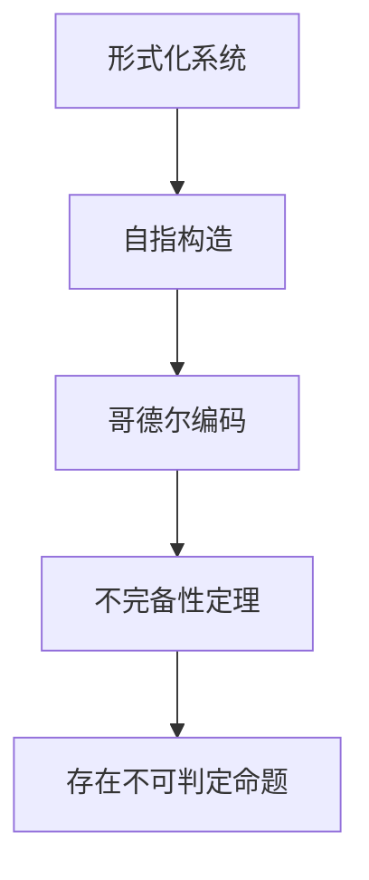
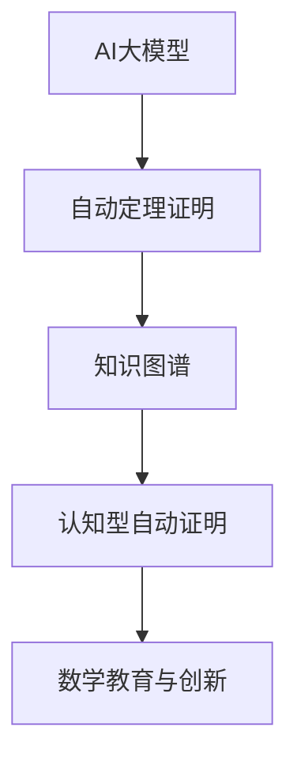

# 3.6.2 形式化系统

> [返回总览](../00-元数学与形式化基础总览.md)

## 目录

- [3.6.2 形式化系统](#362-形式化系统)
  - [目录](#目录)
  - [3.6.2.1 形式化系统的基本结构](#3621-形式化系统的基本结构)
  - [3.6.2.2 典型形式化系统](#3622-典型形式化系统)
  - [3.6.2.3 形式化系统的局限与挑战](#3623-形式化系统的局限与挑战)
  - [3.6.2.4 AI与自动化形式化（现代补充）](#3624-ai与自动化形式化现代补充)
    - [结构图](#结构图)
  - [3.6.2.5 相关主题与本地跳转](#3625-相关主题与本地跳转)
  - [3.6.2.6 参考文献与资源](#3626-参考文献与资源)

---

## 3.6.2.1 形式化系统的基本结构

| 组成部分 | 说明 |
|:--------|:-----|
| 字母表   | 基本符号集合 |
| 语法规则 | 合法表达式的生成规则 |
| 公理     | 无需证明的基本命题 |
| 推理规则 | 从公理和已知命题推出新命题的方法 |

---

## 3.6.2.2 典型形式化系统

| 系统         | 语言特征         | 典型公理/规则         | 适用领域         |
|:------------|:----------------|:----------------------|:----------------|
| 一阶逻辑     | 谓词、量词       | 公理化推理规则         | 数学基础         |
| Peano公理    | 自然数、递归定义 | 五条基本公理           | 算术             |
| ZFC集合论    | 集合、成员关系   | 九条ZFC公理            | 集合论、基础数学 |

---

## 3.6.2.3 形式化系统的局限与挑战



---

## 3.6.2.4 AI与自动化形式化（现代补充）

- AI大模型（如GPT-4、Claude、Minerva）可辅助自动定理证明、生成形式化代码、自动验证复杂定理。
- 知识图谱驱动的自动化形式化：如OpenAI MathGraph、Wikidata等，支持结构化知识推理。
- 认知型自动证明：结合人类认知过程的AI推理系统，模拟数学家的发现与验证过程。
- 典型Rust代码示例：

```rust
struct AutoProofSystem {
    statement: String,
    ai_steps: Vec<String>,
    verified: bool,
}

impl AutoProofSystem {
    fn new(statement: &str) -> Self {
        AutoProofSystem { statement: statement.to_string(), ai_steps: vec![], verified: false }
    }
    fn add_step(&mut self, step: &str) {
        self.ai_steps.push(step.to_string());
    }
    fn verify(&mut self) {
        // 假设AI自动验证
        self.verified = true;
    }
}
```

### 结构图



---

## 3.6.2.5 相关主题与本地跳转

- 详见 [00-元数学与形式化基础总览.md](../00-元数学与形式化基础总览.md) 3.4 形式化系统
- 相关主题：[01-元数学理论.md](01-元数学理论.md)、[03-证明论.md](03-证明论.md)

---

## 3.6.2.6 参考文献与资源

- Hilbert, D. (1931). "Die Grundlagen der Mathematik".
- 数学知识体系重构项目 (2024).
