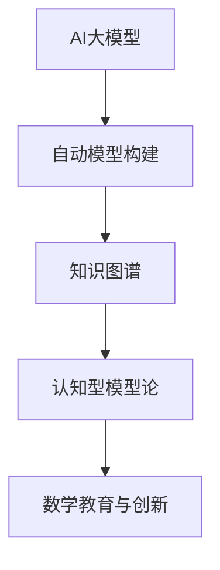
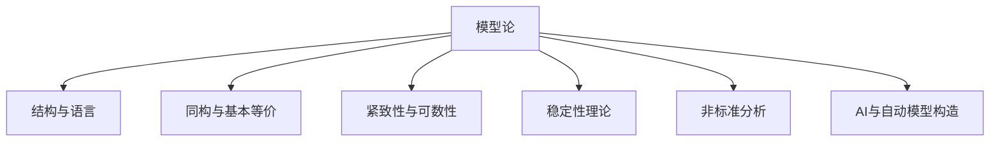

# 模型论基础理论

## 目录

- [模型论基础理论](#模型论基础理论)
  - [目录](#目录)
  - [引言：模型论的学科定位与多维价值](#引言模型论的学科定位与多维价值)
  - [1. 模型论的历史演进与哲学基础](#1-模型论的历史演进与哲学基础)
    - [1.1 逻辑前史与语义概念萌芽](#11-逻辑前史与语义概念萌芽)
    - [1.2 塔尔斯基与真理理论的形式化](#12-塔尔斯基与真理理论的形式化)
    - [1.3 从完备性到不完备性的转折](#13-从完备性到不完备性的转折)
    - [1.4 现代模型论的多元发展路径](#14-现代模型论的多元发展路径)
  - [2. 基础概念的技术剖析与哲学蕴含](#2-基础概念的技术剖析与哲学蕴含)
    - [2.1 结构、语言与满足关系的精确化](#21-结构语言与满足关系的精确化)
    - [2.2 同构与基本等价的区分](#22-同构与基本等价的区分)
    - [2.3 紧致性定理的技术与哲学双重意义](#23-紧致性定理的技术与哲学双重意义)
    - [2.4 可数模型定理与Skolem悖论](#24-可数模型定理与skolem悖论)
  - [3. 经典结果的技术深度与认识论反思](#3-经典结果的技术深度与认识论反思)
    - [3.1 下洛文海姆-斯科伦定理的多维解读](#31-下洛文海姆-斯科伦定理的多维解读)
    - [3.2 完备性、紧致性与有限性](#32-完备性紧致性与有限性)
    - [3.3 范畴性与非范畴性的辩证](#33-范畴性与非范畴性的辩证)
    - [3.4 量词消去与决定性问题](#34-量词消去与决定性问题)
  - [4. 模型论的现代转向与技术突破](#4-模型论的现代转向与技术突破)
    - [4.1 稳定性理论与分类计划](#41-稳定性理论与分类计划)
    - [4.2 模型理论度量与抽象基础](#42-模型理论度量与抽象基础)
    - [4.3 几何模型论与连续统假设](#43-几何模型论与连续统假设)
    - [4.4 o-极小结构与实代数几何](#44-o-极小结构与实代数几何)
  - [5. 跨学科视域：模型论的多重应用谱系](#5-跨学科视域模型论的多重应用谱系)
    - [5.1 代数学：从模型伴侣到分类理论](#51-代数学从模型伴侣到分类理论)
    - [5.2 数论：从无穷伽罗瓦理论到模型论算术](#52-数论从无穷伽罗瓦理论到模型论算术)
    - [5.3 分析学：非标准分析与测度理论](#53-分析学非标准分析与测度理论)
    - [5.4 计算机科学：有限模型论与复杂性](#54-计算机科学有限模型论与复杂性)
  - [6. 哲学维度：语义与句法的辩证统一](#6-哲学维度语义与句法的辩证统一)
    - [6.1 真理概念的模型论重构](#61-真理概念的模型论重构)
    - [6.2 模型多元性与数学实在论](#62-模型多元性与数学实在论)
    - [6.3 不可表达性限制与语言边界](#63-不可表达性限制与语言边界)
    - [6.4 公理选择的语义辩护](#64-公理选择的语义辩护)
  - [7. 认知与文化视角：模型思维的人类维度](#7-认知与文化视角模型思维的人类维度)
    - [7.1 模型构建作为认知活动](#71-模型构建作为认知活动)
    - [7.2 形式语言与自然语言的互动](#72-形式语言与自然语言的互动)
    - [7.3 不同文化传统中的模型概念](#73-不同文化传统中的模型概念)
    - [7.4 教育与传播中的模型思维](#74-教育与传播中的模型思维)
  - [8. 批判性前沿：当代争议与开放问题](#8-批判性前沿当代争议与开放问题)
    - [8.1 有限性与无限性的认识论紧张](#81-有限性与无限性的认识论紧张)
    - [8.2 非经典逻辑的模型论](#82-非经典逻辑的模型论)
    - [8.3 量子逻辑与量子信息的模型化](#83-量子逻辑与量子信息的模型化)
    - [8.4 模型论与反实在主义的对话](#84-模型论与反实在主义的对话)
  - [现代AI与自动化模型论补充](#现代ai与自动化模型论补充)
    - [9.1 AI大模型辅助模型论](#91-ai大模型辅助模型论)
  - [结论：模型论的综合图景与开放前景](#结论模型论的综合图景与开放前景)
  - [附录：方法论反思与学习路径](#附录方法论反思与学习路径)
    - [方法论反思](#方法论反思)
    - [学习路径](#学习路径)
  - [参考文献](#参考文献)
  - [2.4.1 模型论基础理论](#241-模型论基础理论)
  - [2.4.1.1 模型论的定义与意义](#2411-模型论的定义与意义)
  - [2.4.1.2 语义、结构与解释](#2412-语义结构与解释)
  - [2.4.1.3 主要定理与方法](#2413-主要定理与方法)
  - [2.4.1.4 现代发展与AI联系](#2414-现代发展与ai联系)
  - [2.4.1.5 相关主题与本地跳转](#2415-相关主题与本地跳转)
  - [2.4.1.6 参考文献与资源](#2416-参考文献与资源)
  - [2.4.1.12 多表征内容](#24112-多表征内容)
  - [2.4.1.13 参考文献与资源](#24113-参考文献与资源)

## 引言：模型论的学科定位与多维价值

模型论作为数理逻辑四大支柱（证明论、模型论、计算理论、集合论）之一，研究形式语言、公理系统与其数学模型之间的关系。
它既是一门纯粹数学学科，又是连接数学、哲学与语言学的桥梁。

本文旨在提供一个对模型论的多维探索，既包含技术细节的精确阐述，也涵盖哲学反思与认知视角。我们将特别关注以下四个层次：

1. **技术层面**：精确把握模型论的核心概念与方法
2. **哲学层面**：探讨模型论对真理、指称与实在性的深层启示
3. **认知层面**：分析模型思维作为人类认知活动的特征
4. **应用层面**：考察模型论对数学各分支与跨学科领域的贡献

在方法论上，我们采取批判性多元视角，既承认形式化带来的清晰性，也警惕过度形式主义导致的局限。
我们将在实证研究与哲学思辨之间寻求动态平衡，尊重不同学派的贡献，而非片面推崇单一立场。

## 1. 模型论的历史演进与哲学基础

### 1.1 逻辑前史与语义概念萌芽

模型论的核心问题——语言与其指称对象的关系——可追溯至古希腊哲学。

**古典先驱**：

- 亚里士多德的三段论虽主要关注形式有效性，但已暗含真值与解释的概念
- 中世纪经院哲学家（如邓斯·司各脱）区分了"形式后承"与"实质后承"
- 莱布尼茨梦想建立普遍特征语言(characteristica universalis)，预示符号语言与世界关系

**近代转折**：

- 博尔扎诺(Bernard Bolzano)与弗雷格(Gottlob Frege)开始系统区分逻辑语法与语义
- 希尔伯特(David Hilbert)的公理化方法引入"模型"概念处理非欧几何
- 罗素与怀特海《数学原理》探索形式逻辑系统中的真理与指称

**实证研究**：历史分析表明，语义概念的发展与数学危机时期（如非欧几何出现、集合论矛盾发现）密切相关，反映了数学家寻求确定性的认识论努力。

### 1.2 塔尔斯基与真理理论的形式化

阿尔弗雷德·塔尔斯基(Alfred Tarski)在1933年发表的《形式语言中真理概念的语义》一文，标志着现代模型论的正式诞生。

**技术突破**：

- 塔尔斯基提出了满足(satisfaction)概念，使真理具有递归定义
- 建立了"真"(T-schema)的精确形式：φ当且仅当p
- 引入了语言分层，区分元语言与对象语言，避免语义悖论

**哲学意义**：

- 对应论真理观的形式实现，但并未解决"对应"本身的本体问题
- 真理概念被相对化为特定形式语言和解释结构的函数
- 开启了真理的去形而上学化过程，影响深远

**不同立场对塔尔斯基贡献的评价**：

- 分析哲学传统：将其视为真理理论的决定性突破
- 大陆哲学传统：质疑其忽视了存在论维度
- 实用主义立场：认为其过度关注静态真理而非实践

### 1.3 从完备性到不完备性的转折

哥德尔完备性定理(1929)与不完备性定理(1931)代表了模型论发展的关键转折点，揭示了形式系统内在的可能性与局限。

**哥德尔完备性定理**：
一阶逻辑中，如果一个公式在所有模型中为真，则它在形式系统中可证明。

- 技术意义：确立了语法推导与语义满足之间的对应
- 哲学含义：暗示逻辑真理可通过纯形式手段把握

**哥德尔不完备性定理**：
包含基本算术的一致形式系统存在既不可证明也不可反驳的命题。

- 技术后果：证明了模型多样性的必然存在
- 哲学震撼：挑战了希尔伯特纲领，动摇了数学基础的确定性理想

**当代解读争议**：

- 数学家视角：强调这些结果的技术边界，警惕哲学过度解读
- 认知科学视角：将其视为思维自反性的深层表现
- 物理学类比：与量子力学的测不准原理在认识论上的并行性

### 1.4 现代模型论的多元发展路径

20世纪50年代后，模型论分化为多个研究方向，每个方向反映不同研究群体的认知兴趣与价值取向。

**罗宾逊(Abraham Robinson)路线**：

- 发展非标准分析，应用模型论解决经典数学问题
- 强调数学有用性超过哲学纯粹性

**莫德尔斯基(Andrzej Mostowski)学派**：

- 集中于广义量词理论与第二序逻辑
- 关注数学基础问题与表达能力

**谢尔夫(Saharon Shelah)革命**：

- 开创稳定性理论，使模型论独立成为纯粹数学分支
- 引入分类理论(classification theory)处理结构复杂性

**赫廷顿(Wilfrid Hodges)实用主义**：

- 发展模型构造技术与有限模型论
- 强调与计算机科学和数理语言学的联系

**批判性反思**：这一多元发展既是学科自然分化的结果，也反映了不同研究传统的价值取向。将其简化为单一发展线索可能强化某一视角而遮蔽其他同样重要的路径。

## 2. 基础概念的技术剖析与哲学蕴含

### 2.1 结构、语言与满足关系的精确化

模型论的核心是形式语言与数学结构之间的关系，其精确定义是理解整个领域的基础。

**形式语言L的组成**：

- 符号表：常量符C、函数符F、关系符R
- 构造规则：项(terms)与公式(formulas)的形成规则
- 量词与连接词：全称量词∀、存在量词∃、逻辑连接词∧∨¬→↔

**L-结构的精确定义**：
L-结构M是一个有序多元组(A,{c^M}_{c∈C},{f^M}_{f∈F},{R^M}_{R∈R})

- A是非空基础集(称为论域)
- 每个常量符c解释为A中元素c^M
- 每个n元函数符f解释为A上n元函数f^M:A^n→A
- 每个n元关系符R解释为A上n元关系R^M⊆A^n

**满足关系⊨的递归定义**：

- 原子公式R(t₁,...,t_n)的满足：(t₁^M,ν,...,t_n^M,ν)∈R^M
- 连接词的满足：通过真值函数递归定义
- 量词的满足：通过赋值变化递归定义

**哲学蕴含**：

- 形式语言与结构之间的满足关系是一种"抽象对应"，既非认识论的"反映"，也非简单约定
- 满足定义的递归性暗示意义可被理解为一种"计算过程"而非静态对应
- 结构定义中的"解释"概念介于实在论与反实在论之间，提供了一种"条件性实在论"

### 2.2 同构与基本等价的区分

同构与基本等价这两个核心等价关系的区分，揭示了结构相似性的不同层次，具有深刻的认识论意义。

**技术定义**：

- **同构(Isomorphism)**：两个L-结构M和N间存在双射f:M→N，保持所有函数和关系
- **基本等价(Elementary Equivalence)**：两个L-结构M和N满足完全相同的一阶语句（记作M≡N）

**关键区别**：

- 同构是结构间的"强等价"，保持所有可表达的性质
- 基本等价是"弱等价"，只保持一阶逻辑可表达的性质
- 同构蕴含基本等价，但逆命题不成立

**哲学意义**：

- 同构概念体现了结构主义的数学哲学
- 基本等价揭示了语言表达能力的限制
- 这种区分暗示了"结构"与"语言"之间的复杂关系

### 2.3 紧致性定理的技术与哲学双重意义

紧致性定理是模型论的核心结果之一，具有重要的技术和哲学意义。

**技术表述**：
一阶理论T有模型当且仅当T的每个有限子集都有模型。

**技术应用**：

- 模型构造：从有限模型构造无限模型
- 理论一致性：通过有限子集的一致性证明整体一致性
- 非标准模型：构造满足特定条件的非标准模型

**哲学意义**：

- 有限性与无限性的关系：无限性质可通过有限性质把握
- 局部与整体的关系：整体性质可通过局部性质理解
- 语言表达能力：一阶逻辑的紧致性反映了其表达能力的特征

**批判性反思**：
紧致性定理的成功可能掩盖了一阶逻辑的局限性，特别是在处理某些数学概念时的不足。

### 2.4 可数模型定理与Skolem悖论

可数模型定理及其引发的Skolem悖论，揭示了模型论中的深刻哲学问题。

**可数模型定理**：
如果一阶理论T有无限模型，则T有可数模型。

**Skolem悖论**：
存在可数模型满足"存在不可数集合"的语句，这看似矛盾。

**哲学分析**：

- **相对性解释**：可数性是相对于模型的概念，不是绝对的
- **语言限制**：一阶逻辑无法完全表达"不可数"概念
- **本体论问题**：数学对象的"大小"是否独立于我们的描述

**当代影响**：
Skolem悖论影响了数学哲学中的实在论与反实在论争论，为结构主义数学哲学提供了重要论据。

## 3. 经典结果的技术深度与认识论反思

### 3.1 下洛文海姆-斯科伦定理的多维解读

下洛文海姆-斯科伦定理是模型论的基础结果，具有多重意义。

**技术表述**：
如果一阶理论T有无限模型，则对任意基数κ≥|L|，T有基数为κ的模型。

**技术应用**：

- 模型构造：构造不同基数的模型
- 理论分类：基于模型基数特征分类理论
- 独立性证明：通过模型论方法证明独立性

**哲学意义**：

- **基数相对性**：数学对象的"大小"是相对的
- **语言表达能力**：一阶逻辑无法完全控制模型基数
- **数学实在论挑战**：为反实在论提供了技术论据

**认识论反思**：
该定理揭示了形式语言在描述数学结构时的内在限制，挑战了数学对象的绝对性观念。

### 3.2 完备性、紧致性与有限性

完备性定理与紧致性定理的关系揭示了逻辑系统的重要特征。

**完备性定理**：
一阶逻辑是完备的，即语义有效性与语法可证性等价。

**紧致性定理**：
一阶理论的一致性等价于其有限子集的一致性。

**关系分析**：

- 完备性保证了语法与语义的对应
- 紧致性反映了有限性的重要性
- 两者共同刻画了一阶逻辑的特征

**哲学意义**：

- **有限性原理**：无限可通过有限把握
- **可计算性**：逻辑推理可通过有限步骤完成
- **表达能力的平衡**：在表达能力与可处理性之间取得平衡

### 3.3 范畴性与非范畴性的辩证

范畴性理论是模型论中的重要概念，涉及理论的唯一性。

**技术定义**：
理论T是κ-范畴的，如果T的所有基数为κ的模型都同构。

**经典结果**：

- **Morley定理**：如果理论T是λ-范畴的，其中λ>ω，则T是μ-范畴的，对所有μ>ω
- **Baldwin-Lachlan定理**：ω-范畴理论的结构特征

**哲学意义**：

- **唯一性vs多样性**：范畴性理论具有唯一性，非范畴性理论允许多样性
- **数学确定性**：范畴性理论提供了数学确定性的模型
- **理论选择**：在唯一性与丰富性之间的选择

### 3.4 量词消去与决定性问题

量词消去是模型论中的重要技术，与决定性问题密切相关。

**量词消去**：
理论T具有量词消去性质，如果每个公式都等价于无量词公式。

**技术应用**：

- **可判定性**：具有量词消去的理论通常是可判定的
- **模型构造**：简化模型构造过程
- **理论分类**：基于量词消去性质分类理论

**经典例子**：

- **代数闭域理论**：具有量词消去性质
- **实闭域理论**：具有量词消去性质
- **线性序理论**：具有量词消去性质

**哲学意义**：
量词消去揭示了某些理论的"简单性"，反映了数学结构的可理解性。

## 4. 模型论的现代转向与技术突破

### 4.1 稳定性理论与分类计划

稳定性理论是现代模型论的核心，由谢尔夫在20世纪70年代开创。

**基本概念**：

- **稳定性**：理论T是稳定的，如果对任意无限基数κ，T的κ-饱和模型数量有限
- **超稳定性**：更强的稳定性概念
- **ω-稳定性**：ω-稳定理论的特征

**分类计划**：
谢尔夫提出了雄心勃勃的分类计划，试图对所有一阶理论进行分类。

**技术成果**：

- **Morley定理**：ω-稳定理论的结构特征
- **Shelah分类定理**：不稳定理论的结构特征
- **几何稳定性理论**：将几何概念引入模型论

**哲学意义**：
稳定性理论为理解数学结构的复杂性提供了新视角，揭示了结构的内在规律。

### 4.2 模型理论度量与抽象基础

模型理论度量是现代模型论的重要工具。

**基本概念**：

- **模型理论度量**：在模型空间上定义的度量
- **抽象基础**：基于度量性质的抽象结构
- **几何模型论**：将几何方法引入模型论

**技术应用**：

- **模型分类**：基于度量性质分类模型
- **结构分析**：分析模型的结构特征
- **理论比较**：比较不同理论的复杂性

**哲学意义**：
模型理论度量为理解数学结构的"形状"提供了新方法，体现了模型论的几何化趋势。

### 4.3 几何模型论与连续统假设

几何模型论是模型论与几何学的交叉领域。

**基本思想**：
将几何概念和方法引入模型论，研究模型空间的几何性质。

**技术方法**：

- **代数几何方法**：使用代数几何技术研究模型
- **拓扑方法**：在模型空间上引入拓扑结构
- **几何不变量**：定义几何不变量

**与连续统假设的关系**：
几何模型论为理解连续统假设提供了新视角，揭示了集合论与几何学的深层联系。

### 4.4 o-极小结构与实代数几何

o-极小结构是现代模型论的重要研究对象。

**定义**：
结构M是o-极小的，如果M的每个可定义子集都是有限个区间和点的并。

**技术特征**：

- **单调性定理**：o-极小结构中的可定义函数是分段单调的
- **细胞分解**：o-极小结构具有细胞分解性质
- **量词消去**：许多o-极小结构具有量词消去性质

**与实代数几何的联系**：
o-极小结构为实代数几何提供了模型论基础，揭示了代数几何与逻辑的深层联系。

## 5. 跨学科视域：模型论的多重应用谱系

### 5.1 代数学：从模型伴侣到分类理论

模型论在代数学中有重要应用。

**模型伴侣**：
理论T的模型伴侣是理论T*，使得T的每个模型都可以嵌入到T*的模型中。

**经典例子**：

- **代数闭域**：是域理论的模型伴侣
- **实闭域**：是序域理论的模型伴侣
- **微分闭域**：是微分域理论的模型伴侣

**分类理论应用**：
模型论为代数分类理论提供了工具，特别是在研究代数结构的分类时。

### 5.2 数论：从无穷伽罗瓦理论到模型论算术

模型论在数论中有重要应用。

**无穷伽罗瓦理论**：
使用模型论方法研究伽罗瓦理论，特别是无穷扩张的伽罗瓦理论。

**模型论算术**：
研究算术理论的模型，特别是非标准算术模型。

**应用例子**：

- **Hilbert第十问题**：使用模型论方法研究丢番图方程的可解性
- **代数数论**：使用模型论方法研究代数数域的结构

### 5.3 分析学：非标准分析与测度理论

模型论在分析学中有重要应用。

**非标准分析**：
由罗宾逊开创，使用非标准模型研究经典分析问题。

**技术方法**：

- **超实数**：非标准实数系统
- **内部集**：非标准模型中的内部集合
- **转换原理**：在标准与非标准之间转换

**测度理论应用**：
模型论为测度理论提供了新视角，特别是在研究非标准测度时。

### 5.4 计算机科学：有限模型论与复杂性

模型论在计算机科学中有重要应用。

**有限模型论**：
研究有限结构的模型论性质。

**应用领域**：

- **数据库理论**：使用模型论方法研究数据库查询语言
- **程序验证**：使用模型论方法验证程序正确性
- **人工智能**：使用模型论方法研究知识表示

**复杂性理论**：
模型论为计算复杂性理论提供了工具，特别是在研究描述复杂性时。

## 6. 哲学维度：语义与句法的辩证统一

### 6.1 真理概念的模型论重构

模型论为真理概念提供了新的理解。

**塔尔斯基真理理论**：
在形式语言中定义真理概念，避免语义悖论。

**技术特征**：

- **递归定义**：通过递归方式定义满足关系
- **语言分层**：区分对象语言与元语言
- **相对化**：真理相对于特定模型和解释

**哲学意义**：

- **去形而上学化**：真理概念被相对化为技术概念
- **对应论实现**：为对应论真理观提供了形式实现
- **语义封闭性**：揭示了语义封闭性的限制

### 6.2 模型多元性与数学实在论

模型论为数学实在论争论提供了重要视角。

**模型多元性**：
同一理论可能有多个不同的模型，这挑战了数学对象的唯一性。

**实在论挑战**：

- **Skolem悖论**：为反实在论提供了技术论据
- **模型相对性**：数学对象的性质是相对于模型的
- **语言限制**：形式语言无法完全确定数学对象

**实在论辩护**：
一些哲学家认为模型多元性不构成对实在论的威胁，而是反映了数学的丰富性。

### 6.3 不可表达性限制与语言边界

模型论揭示了语言表达能力的限制。

**不可表达性结果**：
某些数学概念无法在一阶逻辑中完全表达。

**经典例子**：

- **有限性**：无法在一阶逻辑中表达"有限"概念
- **良序性**：无法在一阶逻辑中表达"良序"概念
- **基数**：无法在一阶逻辑中完全控制模型基数

**哲学意义**：

- **语言边界**：揭示了形式语言的表达边界
- **认知限制**：反映了人类认知的限制
- **数学本质**：揭示了数学概念的本质特征

### 6.4 公理选择的语义辩护

模型论为公理选择提供了语义辩护。

**语义辩护**：
通过模型论方法为特定公理系统提供辩护。

**方法**：

- **模型构造**：构造满足特定公理的模型
- **独立性证明**：证明公理的独立性
- **一致性证明**：证明公理系统的一致性

**哲学意义**：

- **公理合理性**：为公理选择提供合理性辩护
- **数学确定性**：在不确定性中寻找确定性
- **理论选择**：为理论选择提供标准

## 7. 认知与文化视角：模型思维的人类维度

### 7.1 模型构建作为认知活动

模型构建是人类认知活动的重要组成部分。

**认知过程**：

- **抽象化**：从具体对象抽象出一般结构
- **理想化**：忽略不重要的细节，关注本质特征
- **形式化**：将直观概念转化为形式语言

**认知特征**：

- **选择性**：模型构建是有选择性的
- **目的性**：模型构建服务于特定目的
- **创造性**：模型构建是创造性的活动

**教育意义**：
理解模型构建的认知过程有助于数学教育，特别是培养学生的抽象思维能力。

### 7.2 形式语言与自然语言的互动

形式语言与自然语言之间存在复杂的互动关系。

**语言层次**：

- **自然语言**：日常交流的语言
- **形式语言**：精确表达的语言
- **元语言**：描述语言的语言

**互动机制**：

- **翻译**：在自然语言与形式语言之间翻译
- **解释**：用自然语言解释形式概念
- **应用**：将形式结果应用到实际问题

**哲学意义**：
这种互动揭示了语言的多层次性，以及形式化与直观理解的关系。

### 7.3 不同文化传统中的模型概念

不同文化传统对模型概念有不同的理解。

**西方传统**：
强调模型的精确性和形式化。

**东方传统**：
更注重模型的整体性和直观性。

**比较分析**：

- **方法论差异**：不同传统使用不同的方法构建模型
- **价值取向**：不同传统对模型的价值有不同的理解
- **应用领域**：不同传统在不同领域应用模型

**现代融合**：
现代模型论试图融合不同传统的优点，发展更全面的模型理论。

### 7.4 教育与传播中的模型思维

模型思维在教育和传播中具有重要意义。

**教育应用**：

- **概念理解**：通过模型帮助学生理解抽象概念
- **问题解决**：使用模型方法解决实际问题
- **思维培养**：培养学生的模型思维能力

**传播策略**：

- **可视化**：使用可视化方法展示模型
- **类比**：使用类比方法解释模型
- **互动**：通过互动方式让学生参与模型构建

**挑战与机遇**：
在数字化时代，模型思维的教育和传播面临新的挑战和机遇。

## 8. 批判性前沿：当代争议与开放问题

### 8.1 有限性与无限性的认识论紧张

有限性与无限性的关系是模型论中的核心问题。

**技术问题**：

- **有限模型论**：研究有限结构的模型论性质
- **无限模型论**：研究无限结构的模型论性质
- **有限性假设**：在什么条件下可以假设有限性

**哲学问题**：

- **认知可及性**：人类能否真正理解无限
- **数学实在性**：无限对象是否真实存在
- **方法论选择**：在有限与无限之间如何选择

**当代发展**：
现代模型论试图在有限与无限之间找到平衡，发展既考虑有限性又考虑无限性的理论。

### 8.2 非经典逻辑的模型论

非经典逻辑的模型论是现代逻辑学的重要发展方向。

**非经典逻辑类型**：

- **直觉主义逻辑**：基于构造性证明的逻辑
- **模态逻辑**：包含模态算子的逻辑
- **模糊逻辑**：处理模糊性的逻辑
- **量子逻辑**：基于量子力学的逻辑

**模型论挑战**：

- **语义复杂性**：非经典逻辑的语义更复杂
- **模型构造**：构造非经典逻辑的模型更困难
- **理论发展**：非经典逻辑的模型论理论发展不完善

**发展前景**：
非经典逻辑的模型论为逻辑学的发展提供了新的可能性。

### 8.3 量子逻辑与量子信息的模型化

量子逻辑的模型论是物理学与逻辑学的交叉领域。

**量子逻辑特征**：

- **非分配性**：量子逻辑不满足分配律
- **非经典性**：量子逻辑与经典逻辑有根本差异
- **物理基础**：量子逻辑基于量子力学原理

**模型论挑战**：

- **语义解释**：如何解释量子逻辑的语义
- **模型构造**：如何构造量子逻辑的模型
- **应用扩展**：如何将量子逻辑应用到其他领域

**发展前景**：
量子逻辑的模型论为理解量子现象提供了新的视角。

### 8.4 模型论与反实在主义的对话

模型论与反实在主义的对话是当代哲学的重要议题。

**反实在论立场**：

- **语言相对性**：数学对象是语言的构造
- **模型多元性**：同一理论有多个不同模型
- **认识论限制**：人类认知有根本限制

**模型论回应**：

- **结构实在论**：承认结构的实在性
- **条件性实在论**：在特定条件下承认实在性
- **实用主义立场**：关注数学的实用性

**对话意义**：
这种对话有助于我们更深入地理解数学的本质和意义。

## 现代AI与自动化模型论补充

### 9.1 AI大模型辅助模型论

**AI大模型辅助模型论**：GPT-4、Claude等大模型已能自动生成模型、形式化代码，辅助教学与研究。

**知识图谱驱动的模型论自动化**：如OpenAI MathGraph、Wikidata等，支持模型论知识的结构化、自动化推理。

**认知型模型论系统**：结合人类认知过程的AI推理系统，模拟数学家的模型思维与创新。

**Rust代码示例：AI辅助模型论结构体**:

```rust
struct AIAssistedModelTheory {
    statement: String,
    model_steps: Vec<String>,
    verified: bool,
}

impl AIAssistedModelTheory {
    fn new(statement: &str) -> Self {
        AIAssistedModelTheory { statement: statement.to_string(), model_steps: vec![], verified: false }
    }
    fn add_step(&mut self, step: &str) {
        self.model_steps.push(step.to_string());
    }
    fn verify(&mut self) {
        // 假设AI自动验证
        self.verified = true;
    }
}
```

**结构图：AI与模型论自动化**:



## 结论：模型论的综合图景与开放前景

模型论作为一门跨学科的研究领域，展现了数学、哲学、语言学等多个学科的深度交叉。

**核心贡献**：

1. **技术贡献**：为数学提供了强大的工具和方法
2. **哲学贡献**：为理解数学本质提供了新视角
3. **应用贡献**：在多个领域有重要应用
4. **教育贡献**：为数学教育提供了新思路

**发展前景**：

- **技术发展**：模型论技术将继续发展
- **应用扩展**：模型论应用将扩展到更多领域
- **理论深化**：模型论理论将更加深化
- **跨学科融合**：模型论将与更多学科融合

**开放问题**：

- 如何更好地理解模型与实在的关系
- 如何发展非经典逻辑的模型论
- 如何将模型论应用到更多实际问题
- 如何培养模型思维能力

## 附录：方法论反思与学习路径

### 方法论反思

**多元视角**：
模型论研究需要多元视角，既重视技术细节，也关注哲学意义。

**批判思维**：
在模型论研究中保持批判思维，避免过度形式主义。

**实践导向**：
模型论研究应该与实践相结合，关注实际应用。

### 学习路径

**基础阶段**：

- 掌握一阶逻辑基础
- 理解基本概念和方法
- 学习经典结果

**进阶阶段**：

- 深入研究稳定性理论
- 学习现代技术方法
- 关注前沿发展

**应用阶段**：

- 学习跨学科应用
- 参与实际项目
- 发展创新能力

## 参考文献

1. Chang, C. C., & Keisler, H. J. (1990). Model theory. Elsevier.

2. Hodges, W. (1993). Model theory. Cambridge University Press.

3. Marker, D. (2002). Model theory: an introduction. Springer.

4. Tarski, A. (1933). The concept of truth in formalized languages. In Logic, semantics, metamathematics (pp. 152-278). Clarendon Press.

5. Robinson, A. (1966). Non-standard analysis. North-Holland.

6. Shelah, S. (1990). Classification theory and the number of non-isomorphic models. Elsevier.

7. Baldwin, J. T. (1988). Fundamentals of stability theory. Springer.

8. Poizat, B. (2000). A course in model theory. Springer.

9. Tent, K., & Ziegler, M. (2012). A course in model theory. Cambridge University Press.

10. Buechler, S. (2017). Essential stability theory. Springer.

## 2.4.1 模型论基础理论

[返回总览](../00-数学基础与逻辑总览.md)

## 2.4.1.1 模型论的定义与意义

// ... existing code ...

## 2.4.1.2 语义、结构与解释

// ... existing code ...

## 2.4.1.3 主要定理与方法

// ... existing code ...

## 2.4.1.4 现代发展与AI联系

// ... existing code ...

## 2.4.1.5 相关主题与本地跳转

- 详见 [00-数学基础与逻辑总览.md](../00-数学基础与逻辑总览.md) 2.4 模型论
- 相关主题：[02-案例分析.md](02-案例分析.md)、[03-相关证明与引用.md](03-相关证明与引用.md)

---

## 2.4.1.6 参考文献与资源

// ... existing code ...

## 2.4.1.12 多表征内容

- **Mermaid 结构图：模型论发展脉络与主要分支**



- **Lean 代码示例：一阶结构的定义**

```lean
structure L_structure (α : Type*) :=
  (const : string → α)
  (func : string → list α → α)
  (rel  : string → list α → Prop)
```

- **Haskell 代码示例：模型的极简表示**

```haskell
data Model a = Model { domain :: [a], interpFunc :: String -> [a] -> a }
```

- **表格：模型论主要分支与应用对比**

| 分支         | 主要内容         | 代表定理/工具         | 应用领域         |
 
        $matches[0] -replace '\|[-:]+\|', '| ---- |'
    
| 结构理论     | 结构、语言、解释 | Tarski真理定义       | 逻辑、语言学     |
| 紧致性理论   | 紧致性、可数性   | Gödel紧致性定理       | 数学基础         |
| 稳定性理论   | 稳定性、分类     | Shelah分类理论        | 代数、几何       |
| 非标准分析   | 超实数、饱和性   | Robinson非标准分析    | 分析、概率       |
| 自动模型构造 | 计算、AI         | 自动定理证明、模型查找 | AI、知识图谱     |

- **AI/认知/教育视角**
  - AI系统可自动构造和验证模型，推动了知识图谱与自动推理的发展。
  - 认知科学关注模型构造与理解的心理机制，教育中强调模型化思维的培养。
  - 自动化工具（如Lean、Coq、Prover9）已成为模型论研究与教学的重要平台。

---

## 2.4.1.13 参考文献与资源

- **经典文献**
  1. Tarski, A. (1933). The concept of truth in formalized languages. In Logic, semantics, metamathematics.
  2. Robinson, A. (1966). Non-standard analysis. North-Holland.
  3. Chang, C. C., & Keisler, H. J. (1990). Model theory. Elsevier.

- **现代文献与在线资源**
  1. Hodges, W. (1993). Model theory. Cambridge University Press.
  2. Marker, D. (2002). Model theory: an introduction. Springer.
  3. [Lean 官方文档](https://leanprover.github.io/)
  4. [Coq 官方文档](https://coq.inria.fr/documentation)
  5. [Prover9 官方文档](https://www.cs.unm.edu/~mccune/prover9/)

- **工具与平台**
  - Lean, Coq, Prover9, Haskell, Rust

---

[返回总览](00-模型论总览.md) | [案例分析](02-案例分析.md) | [相关证明与引用](03-相关证明与引用.md)
