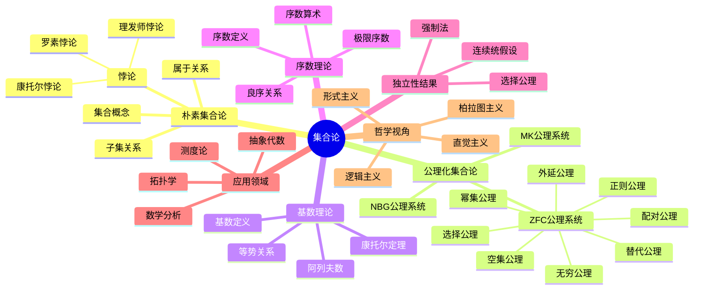

# 集合论：从朴素到公理化的数学基础研究

## 目录

- [集合论：从朴素到公理化的数学基础研究](#集合论从朴素到公理化的数学基础研究)
  - [目录](#目录)
  - [思维导图](#思维导图)
  - [概念图谱](#概念图谱)
  - [表格表征](#表格表征)
  - [1. 引言：集合概念的诞生与演化](#1-引言集合概念的诞生与演化)
  - [2. 朴素集合论与公理化的转向](#2-朴素集合论与公理化的转向)
    - [2.1 朴素集合论的基本理念](#21-朴素集合论的基本理念)
    - [2.2 朴素集合论的局限与悖论](#22-朴素集合论的局限与悖论)
    - [2.3 公理化的必要性](#23-公理化的必要性)
  - [3. 集合论的历史发展脉络](#3-集合论的历史发展脉络)
    - [3.1 康托尔与集合论的诞生](#31-康托尔与集合论的诞生)
    - [3.2 危机时期：悖论的出现](#32-危机时期悖论的出现)
    - [3.3 公理化时期：齐美洛、弗兰克尔与冯·诺依曼](#33-公理化时期齐美洛弗兰克尔与冯诺依曼)
    - [3.4 现代发展：哥德尔、科恩与强制法](#34-现代发展哥德尔科恩与强制法)
  - [4. ZFC公理系统的详细分析](#4-zfc公理系统的详细分析)
    - [4.1 扩展公理与配对公理](#41-扩展公理与配对公理)
    - [4.2 空集公理与幂集公理](#42-空集公理与幂集公理)
    - [4.3 无穷公理与替代公理](#43-无穷公理与替代公理)
    - [4.4 正则公理与选择公理](#44-正则公理与选择公理)
    - [4.5 公理间的关系与层次结构](#45-公理间的关系与层次结构)
  - [5. 基数理论：无限的度量](#5-基数理论无限的度量)
    - [5.1 等势关系与基数概念](#51-等势关系与基数概念)
    - [5.2 可数与不可数集合](#52-可数与不可数集合)
    - [5.3 阿列夫数与基数算术](#53-阿列夫数与基数算术)
    - [5.4 基数的比较与康托尔定理](#54-基数的比较与康托尔定理)
  - [6. 序数理论：有序的无限](#6-序数理论有序的无限)
    - [6.1 良序关系与序数定义](#61-良序关系与序数定义)
    - [6.2 序数的构造与表示](#62-序数的构造与表示)
    - [6.3 序数算术与性质](#63-序数算术与性质)
    - [6.4 序数与基数的关系](#64-序数与基数的关系)
  - [7. 选择公理与连续统假设](#7-选择公理与连续统假设)
    - [7.1 选择公理的等价表述](#71-选择公理的等价表述)
    - [7.2 选择公理的应用与争议](#72-选择公理的应用与争议)
    - [7.3 连续统假设的提出与争论](#73-连续统假设的提出与争论)
    - [7.4 独立性结果：哥德尔与科恩的工作](#74-独立性结果哥德尔与科恩的工作)
  - [8. 集合论的哲学视角](#8-集合论的哲学视角)
    - [8.1 形式主义与集合论](#81-形式主义与集合论)
    - [8.2 逻辑主义的观点](#82-逻辑主义的观点)
    - [8.3 直觉主义的批判](#83-直觉主义的批判)
    - [8.4 本体论问题：集合的存在性质](#84-本体论问题集合的存在性质)
  - [9. 集合论在数学中的应用](#9-集合论在数学中的应用)
    - [9.1 拓扑学中的应用](#91-拓扑学中的应用)
    - [9.2 实分析与测度论](#92-实分析与测度论)
    - [9.3 抽象代数与范畴论](#93-抽象代数与范畴论)
    - [9.4 逻辑学与模型论](#94-逻辑学与模型论)
  - [10. 现代集合论前沿](#10-现代集合论前沿)
    - [10.1 大基数公理](#101-大基数公理)
    - [10.2 强制法与独立性证明](#102-强制法与独立性证明)
    - [10.3 内模型理论](#103-内模型理论)
    - [10.4 与计算机科学的交叉：类型论与集合论](#104-与计算机科学的交叉类型论与集合论)
  - [11. 批判性反思与未来展望](#11-批判性反思与未来展望)
    - [11.1 集合论基础的多元观点](#111-集合论基础的多元观点)
    - [11.2 实践中的集合论：数学家的选择](#112-实践中的集合论数学家的选择)
    - [11.3 未解问题与新方向](#113-未解问题与新方向)
  - [12. 结论](#12-结论)
  - [参考文献](#参考文献)

## 思维导图



## 概念图谱

```mermaid
graph TD
    A[集合论] --> B[朴素集合论]
    A --> C[公理化集合论]
    A --> D[基数理论]
    A --> E[序数理论]
    A --> F[独立性结果]
    A --> G[哲学基础]
    
    B --> B1[集合概念]
    B --> B2[集合关系]
    B --> B3[集合运算]
    B --> B4[悖论]
    
    B4 --> B4a[罗素悖论]
    B4 --> B4b[康托尔悖论]
    B4 --> B4c[布拉利-福尔蒂悖论]
    
    C --> C1[ZF公理系统]
    C --> C2[ZFC公理系统]
    C --> C3[NBG公理系统]
    C --> C4[MK公理系统]
    
    C1 --> C1a[外延公理]
    C1 --> C1b[配对公理]
    C1 --> C1c[分离公理模式]
    C1 --> C1d[并集公理]
    C1 --> C1e[幂集公理]
    C1 --> C1f[无穷公理]
    C1 --> C1g[替代公理模式]
    C1 --> C1h[正则公理]
    
    C2 --> C2a[ZF+选择公理]
    
    D --> D1[等势]
    D --> D2[可数与不可数]
    D --> D3[基数算术]
    D --> D4[阿列夫层级]
    
    E --> E1[良序集]
    E --> E2[序数定义]
    E --> E3[序数算术]
    E --> E4[冯·诺依曼模型]
    
    F --> F1[连续统假设]
    F --> F2[选择公理独立性]
    F --> F3[哥德尔不完备性定理]
    F --> F4[强制法]
    
    G --> G1[形式主义]
    G --> G2[逻辑主义]
    G --> G3[直觉主义]
    G --> G4[本体论问题]
```



## 表格表征

| 主题 | 核心概念 | 关键人物 | 历史阶段 | 哲学视角 |
 
        $matches[0] -replace '\|[-:]+\|', '| ---- |'
    ----|
| 朴素集合论 | 集合、元素、属于关系 | 康托尔 | 1874-1900 | 直观的集合观 |
| 集合论悖论 | 罗素悖论、理发师悖论 | 罗素、布拉利-福尔蒂 | 1897-1908 | 对集合普遍性的反思 |
| 公理化集合论 | ZF、ZFC、NBG公理系统 | 齐美洛、弗兰克尔、冯·诺依曼 | 1908-1930 | 形式主义、集合的限制 |
| 基数理论 | 等势、可数性、连续统 | 康托尔、哈特格斯 | 1874-1897 | "无限"的度量化 |
| 序数理论 | 良序、序数算术 | 冯·诺依曼 | 1923-1930 | 有序无限的结构 |
| 独立性结果 | CH独立性、AC独立性 | 哥德尔、科恩 | 1938-1963 | 数学真理的相对性 |
| 强制法 | 通用集合、筛选 | 科恩 | 1963-1965 | 模型论视角 |
| 大基数理论 | 不可达基数、超紧基数 | 库纳莫托、雷弗林 | 1970至今 | 超越标准公理的探索 |
| 内模型理论 | 可构造集合论L | 哥德尔、詹森 | 1938至今 | 集合论宇宙的内部结构 |

## 1. 引言：集合概念的诞生与演化

集合论是现代数学的基础理论，它为几乎所有数学分支提供了统一的语言和工具。
从直观上讲，集合是"一堆物体的聚集"，这种简单而强大的概念成为了构建整个数学大厦的基石。
本文旨在系统地探讨集合论从其朴素起源到严格的公理化发展的全过程，剖析其内部结构，审视其哲学基础，并展望其未来发展。

集合论的发展可以追溯到19世纪后期，乔治·康托尔(Georg Cantor)通过研究三角级数的收敛性问题，逐渐形成了处理无限集合的基本方法。
这种方法不仅彻底改变了数学家对无限的理解，还建立了一套用于比较不同无限大小的严格理论。
然而，朴素集合论中蕴含的悖论很快被发现，这促使数学家转向公理化方法，最终形成了现代集合论的主流体系——ZFC公理系统。

本文将系统地分析集合论的基本概念、历史发展、公理基础、理论结构和应用扩展，
同时从哲学角度审视集合概念的本质及其争议。
我们既关注理论的严谨性，也注重直观理解的培养；
既探讨历史脉络，也聚焦现代前沿。
通过这种多维度的分析，我们希望读者能够全面把握这一数学基础理论的深刻内涵和广泛影响。

## 2. 朴素集合论与公理化的转向

### 2.1 朴素集合论的基本理念

朴素集合论建立在一个看似简单的直观概念上：
  集合是对象的任意聚集，这些对象（称为元素）可以是具体的事物，也可以是抽象的概念，甚至可以是其他集合。
朴素集合论的核心关系是"属于"关系（用符号∈表示），通过这一关系定义了子集、并集、交集、补集等基本运算。

在朴素集合论中，集合的形成非常自由，只要我们能够清晰地描述某种性质，就可以构造出满足该性质的所有对象组成的集合。
这就是著名的"无限制的理解原则"（Unrestricted Comprehension Principle），可以形式化表述为：

对于任意性质P，存在一个集合S = {x | P(x)}，即所有满足性质P的对象x构成的集合。

这一原则的直观性使朴素集合论易于理解和应用，但也正是这种不受限制的集合形成方式，最终导致了著名的悖论出现。

### 2.2 朴素集合论的局限与悖论

朴素集合论最致命的问题是它允许构造一些"过于庞大"的集合，这些集合因包含了自身或者过于复杂的结构而导致悖论。

最著名的悖论包括：

1. **罗素悖论(Russell's Paradox, 1901)**：
考虑集合R = {x | x ∉ x}，即所有不属于自身的集合构成的集合。
问题：R是否属于自身？
如果R ∈ R，根据R的定义，R应该满足R ∉ R，矛盾；
如果R ∉ R，则R满足不属于自身的条件，根据R的定义，应有R ∈ R，又矛盾。

2. **康托尔悖论(Cantor's Paradox)**：
考虑所有集合构成的集合U，其幂集P(U)的基数应大于U的基数（根据康托尔定理）。
但由于U包含所有集合，P(U)应该是U的子集，这意味着P(U)的基数不可能大于U的基数，矛盾。

3. **理发师悖论(Barber Paradox)**：
这是罗素悖论的一个通俗版本。
一个村庄里的理发师宣称他只给那些不自己理发的人理发。
问题：理发师是否给自己理发？

这些悖论表明，朴素集合论中的无限制理解原则是不自洽的，它允许我们构造一些逻辑上不可能存在的"集合"。
这一发现震动了数学界，引发了数学基础的第三次危机，也促使数学家们寻求更严格的集合论基础。

### 2.3 公理化的必要性

面对朴素集合论的悖论，数学家们认识到，必须通过明确的公理来规范集合的形成，以避免悖论的出现。
这种转向可以看作是数学思维的重大进步：
    从依赖直观到严格的形式化，从不受限制的集合构造到受控的公理系统。

公理化的关键转变在于：

1. **放弃无限制的理解原则**：
  不再允许任意性质定义集合，而是通过明确的公理规定集合的合法构造方式。

2. **引入类型限制**：
  通过公理限制集合的"大小"，避免构造过于庞大的集合。

3. **建立严格的逻辑框架**：
  在形式逻辑的基础上建立集合论，确保推理的严格性。

这种公理化转向不仅解决了悖论问题，还为集合论提供了坚实的逻辑基础，
使得集合论能够作为现代数学的统一语言和工具。

## 3. 集合论的历史发展脉络

### 3.1 康托尔与集合论的诞生

乔治·康托尔(1845-1918)是集合论的创始人，他的工作彻底改变了数学家对无限的理解。
康托尔最初研究的是三角级数的收敛性问题，在研究过程中，他发现需要处理无限集合的性质。

**康托尔的主要贡献**：

1. **无限集合的概念**：
  康托尔首次将无限集合作为数学对象进行系统研究，打破了传统上对无限的恐惧和回避。

2. **基数理论**：
  建立了比较无限集合大小的严格方法，引入了基数概念。

3. **可数性与不可数性**：
  证明了自然数集是可数的，而实数集是不可数的，这震惊了数学界。

4. **连续统假设**：
  提出了著名的连续统假设，即实数集的基数是否等于第二个阿列夫数。

康托尔的工作虽然具有革命性，但也遭到了当时许多数学家的反对，
包括他的老师克罗内克(Kronecker)，后者认为只有有限构造才是合法的数学对象。

### 3.2 危机时期：悖论的出现

19世纪末到20世纪初，随着集合论的广泛应用，各种悖论开始出现：

**主要悖论**：

1. **布拉利-福尔蒂悖论(1897)**：
  涉及序数集合的悖论，表明所有序数的集合会导致矛盾。

2. **罗素悖论(1901)**：
  最著名的集合论悖论，直接挑战了朴素集合论的基础。

3. **康托尔悖论**：
  涉及所有集合的集合，表明存在"最大基数"的概念是矛盾的。

这些悖论的出现引发了数学基础的第三次危机，数学家们开始质疑集合论作为数学基础的地位。

### 3.3 公理化时期：齐美洛、弗兰克尔与冯·诺依曼

为了解决悖论问题，数学家们开始寻求公理化方法：

**齐美洛的工作(1908)**：

- 提出了第一个公理化集合论系统
- 引入了分离公理模式，限制集合的形成
- 建立了集合论的公理基础

**弗兰克尔的改进(1922)**：

- 改进了齐美洛的系统
- 引入了替代公理模式
- 形成了ZF公理系统的基础

**冯·诺依曼的贡献(1925)**：

- 提出了序数的现代定义
- 建立了集合论的形式化基础
- 为现代集合论奠定了基础

### 3.4 现代发展：哥德尔、科恩与强制法

20世纪中期，集合论迎来了重大发展：

**哥德尔的工作(1938)**：

- 证明了选择公理和连续统假设相对于ZF公理系统的一致性
- 建立了可构造宇宙L
- 开创了内模型理论

**科恩的革命性工作(1963)**：

- 发明了强制法(Forcing)
- 证明了选择公理和连续统假设的独立性
- 开创了现代集合论的新纪元

**强制法的影响**：
强制法不仅解决了连续统假设的独立性，还为集合论提供了强大的工具，
使得数学家能够构造各种不同的集合论宇宙，探索不同的数学可能性。

## 4. ZFC公理系统的详细分析

### 4.1 扩展公理与配对公理

**扩展公理(Extensionality Axiom)**：

```text
∀x∀y[∀z(z∈x ↔ z∈y) → x=y]
```

这个公理表达了集合的"外延性"：两个集合相等当且仅当它们包含相同的元素。
这是集合论的基本原理，体现了集合由其元素唯一确定的思想。

**配对公理(Pairing Axiom)**：

```text
∀x∀y∃z∀w(w∈z ↔ w=x ∨ w=y)
```

这个公理确保对于任意两个集合x和y，存在一个集合{z}，其元素恰好是x和y。
这允许我们构造有序对和二元关系。

### 4.2 空集公理与幂集公理

**空集公理(Empty Set Axiom)**：

```text
∃x∀y(y∉x)
```

这个公理断言存在一个不包含任何元素的集合，称为空集，记作∅。
空集是集合论的基础，所有其他集合都可以从空集开始构造。

**幂集公理(Power Set Axiom)**：

```text
∀x∃y∀z(z∈y ↔ z⊆x)
```

这个公理确保对于任意集合x，存在一个集合y，其元素恰好是x的所有子集。
幂集的概念是基数理论的基础，也是康托尔定理的核心。

### 4.3 无穷公理与替代公理

**无穷公理(Infinity Axiom)**：

```text
∃x[∅∈x ∧ ∀y(y∈x → y∪{y}∈x)]
```

这个公理断言存在一个包含空集且在并运算下封闭的集合。
这确保了无限集合的存在，是自然数理论的基础。

**替代公理模式(Replacement Axiom Schema)**：

```text
∀x∀y∀z[φ(x,y)∧φ(x,z) → y=z] → ∀w∃v∀y[y∈v ↔ ∃x(x∈w∧φ(x,y))]
```

这个公理模式允许我们通过函数关系从现有集合构造新集合。
它是构造大集合的重要工具。

### 4.4 正则公理与选择公理

**正则公理(Regularity Axiom)**：

```text
∀x[x≠∅ → ∃y(y∈x ∧ y∩x=∅)]
```

这个公理确保每个非空集合都有一个与自身不相交的元素。
它防止了集合的"循环"定义，是避免悖论的重要工具。

**选择公理(Axiom of Choice)**：

```text
∀x[∀y(y∈x → y≠∅) → ∃f(f:x→∪x ∧ ∀y(y∈x → f(y)∈y))]
```

这个公理断言对于任意非空集合族，存在一个选择函数。
它是现代数学中最重要的公理之一，但也是最受争议的。

### 4.5 公理间的关系与层次结构

ZFC公理系统中的公理不是独立的，它们之间存在复杂的依赖关系：

**基础公理**：

- 扩展公理、空集公理、配对公理
- 这些公理提供了集合论的基本结构

**构造公理**：

- 并集公理、幂集公理、替代公理
- 这些公理允许从现有集合构造新集合

**存在性公理**：

- 无穷公理、选择公理
- 这些公理断言特定类型集合的存在

**限制公理**：

- 正则公理
- 这个公理限制集合的结构，防止悖论

## 5. 基数理论：无限的度量

### 5.1 等势关系与基数概念

**等势关系**：
两个集合A和B称为等势的，记作A≈B，如果存在一个从A到B的双射函数。
等势关系是等价关系，它将所有集合分成等价类。

**基数定义**：
集合A的基数，记作|A|，是A所属的等势等价类。
基数可以看作是集合"大小"的抽象度量。

**基数比较**：
对于基数κ和λ，我们定义κ≤λ，如果存在从κ到λ的单射。
如果κ≤λ且κ≠λ，则记作κ<λ。

### 5.2 可数与不可数集合

**可数集合**：
与自然数集等势的集合称为可数集合。
可数集合的基数记作ℵ₀（阿列夫零）。

**可数集合的性质**：

- 可数集合的子集要么是有限的，要么是可数的
- 有限个可数集合的并集是可数的
- 可数个可数集合的并集是可数的

**不可数集合**：
不与自然数集等势的集合称为不可数集合。
最著名的不可数集合是实数集，其基数记作c（连续统基数）。

### 5.3 阿列夫数与基数算术

**阿列夫数**：
阿列夫数是无限基数的标准表示。

- ℵ₀：自然数集的基数
- ℵ₁：第一个不可数基数
- ℵ₂：第二个不可数基数
- 以此类推...

**基数算术**：
对于基数κ和λ，定义：

- κ+λ：不相交并集的基数
- κ·λ：笛卡尔积的基数
- κ^λ：从λ到κ的函数集的基数

**基数算术的性质**：

- 对于无限基数κ，有κ+κ=κ·κ=κ
- 对于无限基数κ和λ，如果λ≤κ，则κ^λ=2^κ

### 5.4 基数的比较与康托尔定理

**康托尔定理**：
对于任意集合A，有|A|<|P(A)|，其中P(A)是A的幂集。

**证明思路**：

1. 首先证明|A|≤|P(A)|：构造单射f:A→P(A)，f(a)={a}
2. 然后证明|A|≠|P(A)|：假设存在双射g:A→P(A)，考虑集合B={a∈A | a∉g(a)}
3. 如果存在b∈A使得g(b)=B，则b∈B当且仅当b∉B，矛盾

**康托尔定理的意义**：

- 证明了存在不同大小的无限
- 为基数理论奠定了基础
- 导致了连续统假设的提出

## 6. 序数理论：有序的无限

### 6.1 良序关系与序数定义

**良序关系**：
集合A上的关系<称为良序关系，如果：

1. <是严格全序关系
2. A的每个非空子集都有最小元素

**良序集**：
配备良序关系的集合称为良序集。

**序数的冯·诺依曼定义**：
序数是传递的良序集，其中传递性意味着：如果x∈y∈α，则x∈α。

**序数的性质**：

- 每个序数都是其所有前驱的集合
- 序数在∈关系下是良序的
- 序数类构成一个真类

### 6.2 序数的构造与表示

**有限序数**：

- 0 = ∅
- 1 = {0} = {∅}
- 2 = {0,1} = {∅,{∅}}
- 3 = {0,1,2} = {∅,{∅},{∅,{∅}}}
- 以此类推...

**无限序数**：

- ω = {0,1,2,3,...}（自然数集）
- ω+1 = {0,1,2,3,...,ω}
- ω+2 = {0,1,2,3,...,ω,ω+1}
- 以此类推...

**极限序数**：
没有最大元素的序数称为极限序数。
例如：ω, ω·2, ω², ω^ω等。

### 6.3 序数算术与性质

**序数加法**：
对于序数α和β，α+β定义为将β"附加"到α之后得到的序数。

**序数乘法**：
对于序数α和β，α·β定义为将β个α的副本连接起来得到的序数。

**序数幂运算**：
对于序数α和β，α^β定义为β个α的乘积。

**序数算术的性质**：

- 序数加法不满足交换律：1+ω=ω≠ω+1
- 序数乘法不满足交换律：2·ω=ω≠ω·2
- 序数幂运算满足一些指数律

### 6.4 序数与基数的关系

**初始序数**：
与给定基数等势的最小序数称为该基数的初始序数。

**阿列夫数与序数的对应**：

- ℵ₀对应序数ω
- ℵ₁对应序数ω₁
- ℵ₂对应序数ω₂
- 以此类推...

**基数与序数的区别**：

- 基数关注集合的大小
- 序数关注集合的良序结构
- 同一个基数可能对应多个序数

## 7. 选择公理与连续统假设

### 7.1 选择公理的等价表述

选择公理有多种等价表述，体现了其在数学中的广泛影响：

**原始表述**：
对于任意非空集合族，存在一个选择函数。

**佐恩引理**：
每个偏序集都有极大链。

**良序定理**：
每个集合都可以良序化。

**乘积非空性**：
非空集合族的笛卡尔积非空。

**这些等价性表明选择公理在数学中的基础地位**。

### 7.2 选择公理的应用与争议

**选择公理的应用**：

- 证明许多重要的数学定理
- 在分析学、拓扑学、代数等领域广泛应用
- 为数学提供统一的框架

**选择公理的争议**：

- 缺乏构造性，不能给出具体的选择函数
- 导致一些反直觉的结果（如巴拿赫-塔斯基悖论）
- 在直觉主义数学中被拒绝

**数学家的态度**：

- 大多数数学家接受选择公理
- 一些数学家（如直觉主义者）拒绝选择公理
- 一些数学家采用"谨慎使用"的态度

### 7.3 连续统假设的提出与争论

**连续统假设(Continuum Hypothesis, CH)**：
断言2^ℵ₀ = ℵ₁，即实数集的基数等于第一个不可数基数。

**广义连续统假设(Generalized Continuum Hypothesis, GCH)**：
断言对于所有序数α，有2^ℵ_α = ℵ_{α+1}。

**连续统假设的历史**：

- 1878年由康托尔提出
- 1900年被希尔伯特列为23个问题之首
- 1963年被科恩证明独立于ZFC

**连续统假设的意义**：

- 涉及无限集合的基本性质
- 与数学分析、拓扑学等领域密切相关
- 体现了数学真理的相对性

### 7.4 独立性结果：哥德尔与科恩的工作

**哥德尔的一致性结果(1938)**：

- 证明了CH和GCH相对于ZF的一致性
- 建立了可构造宇宙L
- 开创了内模型理论

**科恩的独立性结果(1963)**：

- 发明了强制法
- 证明了CH和GCH相对于ZFC的独立性
- 开创了现代集合论的新纪元

**独立性结果的意义**：

- 表明CH是一个独立的数学命题
- 数学家可以自由选择接受或拒绝CH
- 导致了集合论宇宙的多元化

## 8. 集合论的哲学视角

### 8.1 形式主义与集合论

**形式主义的基本观点**：

- 数学是符号游戏
- 数学对象没有独立的存在性
- 数学真理是形式系统内的可证明性

**形式主义对集合论的看法**：

- 集合论公理是任意的约定
- 集合没有独立的本体论地位
- 数学的严格性来自形式推理

**形式主义的优势**：

- 避免了本体论问题
- 强调数学的严格性
- 与现代逻辑学发展一致

**形式主义的局限**：

- 无法解释数学的应用性
- 忽视了数学的直觉和创造性
- 难以解释数学的客观性

### 8.2 逻辑主义的观点

**逻辑主义的基本观点**：

- 数学可以还原为逻辑
- 数学真理是逻辑真理
- 数学对象是逻辑构造

**逻辑主义对集合论的看法**：

- 集合论是逻辑的自然延伸
- 集合是逻辑概念的具体化
- 数学基础问题本质上是逻辑问题

**逻辑主义的贡献**：

- 为数学提供了逻辑基础
- 促进了现代逻辑学的发展
- 影响了公理化方法

**逻辑主义的困难**：

- 无法处理无限集合
- 需要非逻辑公理（如无穷公理）
- 面临悖论问题

### 8.3 直觉主义的批判

**直觉主义的基本观点**：

- 数学是心智构造
- 数学对象存在于心智中
- 数学真理需要构造性证明

**直觉主义对集合论的批判**：

- 拒绝非构造性的存在性证明
- 反对选择公理
- 质疑无限集合的合法性

**直觉主义的贡献**：

- 强调构造性方法
- 发展了直觉主义逻辑
- 影响了计算机科学

**直觉主义的局限**：

- 限制了数学的发展
- 与经典数学有根本分歧
- 难以处理现代数学的复杂性

### 8.4 本体论问题：集合的存在性质

**柏拉图主义观点**：

- 集合是独立存在的抽象对象
- 数学真理是客观的
- 数学发现是发现而非创造

**概念主义观点**：

- 集合是概念构造
- 数学对象依赖于心智
- 数学真理是概念真理

**唯名论观点**：

- 集合只是名称
- 没有独立的数学对象
- 数学是语言游戏

**多元主义观点**：

- 不同数学领域可能有不同的本体论
- 数学对象的存在性是相对的
- 实用主义地选择数学基础

## 9. 集合论在数学中的应用

### 9.1 拓扑学中的应用

**拓扑空间的定义**：
拓扑空间是一个集合X配备一个拓扑结构，即X的子集族τ，满足：

1. ∅, X ∈ τ
2. τ中任意子族的并集属于τ
3. τ中有限子族的交集属于τ

**集合论在拓扑学中的作用**：

- 提供基本的概念框架
- 处理无限集合的性质
- 建立拓扑空间的分类

**重要应用**：

- 紧致性理论
- 连通性理论
- 分离公理
- 度量空间理论

### 9.2 实分析与测度论

**测度论的基础**：
测度论建立在集合论的基础上，研究集合的"大小"概念。

**σ-代数**：
集合X上的σ-代数是X的子集族，满足：

1. X属于该族
2. 对补运算封闭
3. 对可数并运算封闭

**测度**：
σ-代数上的测度是一个函数μ，满足：

1. 非负性
2. 可数可加性
3. 空集测度为零

**集合论的应用**：

- 勒贝格测度的构造
- 可测集合的分类
- 积分理论的基础

### 9.3 抽象代数与范畴论

**群论中的应用**：

- 群的子群结构
- 陪集分解
- 群的分类

**环论中的应用**：

- 理想的构造
- 商环的定义
- 环的分解

**范畴论中的集合论**：

- 对象和态射的集合
- 函子的定义
- 极限和余极限的构造

**集合论与范畴论的关系**：

- 范畴论可以看作是集合论的推广
- 集合论为范畴论提供基础
- 两者相互影响和发展

### 9.4 逻辑学与模型论

**模型论的基础**：
模型论研究数学结构与其理论之间的关系，集合论为其提供基础。

**模型的定义**：
语言L的模型是一个结构M，包含：

1. 非空集合|M|（论域）
2. 对每个常元符号的解释
3. 对每个函数符号的解释
4. 对每个关系符号的解释

**集合论在模型论中的作用**：

- 提供模型构造的工具
- 处理无限模型的性质
- 建立模型论的基本定理

**重要应用**：

- 紧致性定理
- 勒文海姆-斯科伦定理
- 模型完备性理论

## 10. 现代集合论前沿

### 10.1 大基数公理

**大基数的概念**：
大基数是比标准集合论公理更强的存在性假设，断言某些特殊基数的存在。

**不可达基数**：
基数κ称为不可达的，如果：

1. κ是正则的
2. κ是强极限的（对任意λ<κ，有2^λ<κ）

**马洛基数**：
基数κ称为马洛基数，如果对于任意无界闭子集C⊆κ，存在不可达基数λ∈C。

**超紧基数**：
基数κ称为超紧的，如果对于任意λ≥κ，存在初等嵌入j:V→M，其中M是传递类，且j(κ)>λ。

**大基数公理的意义**：

- 提供更强的数学工具
- 解决一些独立性问题
- 探索数学宇宙的结构

### 10.2 强制法与独立性证明

**强制法的基本思想**：
强制法是一种构造集合论模型的技术，通过添加"通用集合"来改变集合论宇宙。

**强制偏序**：
强制偏序是一个偏序集(P,≤)，用于表示"条件"或"信息"。

**通用集合**：
对于强制偏序P，通用集合G是P的子集，满足某些"通用性"条件。

**强制扩展**：
通过通用集合G，可以构造原宇宙V的扩展V[G]。

**强制法的应用**：

- 证明独立性结果
- 构造不同的集合论宇宙
- 研究集合论公理的相对一致性

### 10.3 内模型理论

**内模型的概念**：
内模型是集合论宇宙V的传递子类，满足ZFC公理。

**可构造宇宙L**：
可构造宇宙L是包含所有序数的最小内模型，由哥德尔在1938年引入。

**L的性质**：

- L满足ZFC+CH+GCH
- L是"最小"的内模型
- L与V的关系反映了集合论宇宙的结构

**内模型理论的发展**：

- 核心模型理论
- 精细结构理论
- 描述集合论

**内模型理论的意义**：

- 理解集合论宇宙的结构
- 提供一致性证明的工具
- 探索集合论公理的关系

### 10.4 与计算机科学的交叉：类型论与集合论

**类型论的基本思想**：
类型论是一种基于类型而非集合的数学基础理论。

**类型论与集合论的关系**：

- 类型论可以看作是集合论的替代
- 两者有不同的哲学基础
- 在计算机科学中有重要应用

**依值类型论**：
依值类型论允许类型依赖于值，提供了比简单类型论更强的表达能力。

**同伦类型论**：
同伦类型论将类型论与同伦论结合，提供了新的数学基础视角。

**计算机科学中的应用**：

- 程序验证
- 定理证明
- 形式化数学

**集合论与类型论的比较**：

| 方面 | 集合论 | 类型论 |
| ---- |----| ---- |
| 基本概念 | 集合、元素 | 类型、项 |
| 哲学基础 | 柏拉图主义 | 构造主义 |
| 计算性质 | 非构造性 | 构造性 |
| 应用领域 | 经典数学 | 计算机科学 |

## 11. 批判性反思与未来展望

### 11.1 集合论基础的多元观点

**基础多元主义**：
现代数学基础研究呈现出多元化的趋势，不同的基础理论各有其优势和局限。

**集合论的优势**：

- 为经典数学提供统一基础
- 具有丰富的理论结构
- 与逻辑学发展一致

**集合论的局限**：

- 面临独立性结果
- 缺乏构造性
- 哲学基础有争议

**其他基础理论**：

- 范畴论：强调关系和结构
- 类型论：强调构造和计算
- 同伦类型论：结合几何直觉

**多元基础的意义**：

- 避免单一视角的局限
- 促进不同传统的对话
- 丰富数学的哲学理解

### 11.2 实践中的集合论：数学家的选择

**数学家的实际使用**：
大多数数学家在实际工作中并不深入关注集合论的基础问题，而是采用"实用主义"的态度。

**集合论的工具性**：

- 提供统一的数学语言
- 处理无限集合的性质
- 建立严格的证明框架

**公理选择的考虑**：

- 选择公理：大多数数学家接受
- 连续统假设：根据具体问题选择
- 大基数公理：在需要时采用

**数学实践的特点**：

- 关注具体问题的解决
- 采用有效的证明方法
- 重视直觉和创造性

**理论与实践的关系**：

- 理论为实践提供基础
- 实践推动理论发展
- 两者相互影响

### 11.3 未解问题与新方向

**集合论中的未解问题**：

1. **连续统假设的最终地位**：
   - 是否存在更强的公理系统解决CH？
   - CH是否具有客观的真值？

2. **大基数公理的合理性**：
   - 大基数公理的哲学基础
   - 大基数公理的数学意义

3. **集合论宇宙的结构**：
   - 集合论宇宙的"真实"结构
   - 不同集合论宇宙的关系

**新研究方向**：

1. **描述集合论**：
   - 研究可定义集合的性质
   - 与递归论和模型论的交叉

2. **集合论与物理学的交叉**：
   - 集合论在量子力学中的应用
   - 无限在物理学中的意义

3. **集合论与认知科学**：
   - 人类对无限概念的理解
   - 数学直觉的认知基础

**未来发展的可能方向**：

1. **技术发展**：
   - 新的证明技术
   - 计算机辅助证明
   - 形式化验证

2. **理论整合**：
   - 不同基础理论的融合
   - 跨学科的应用
   - 新的数学哲学

3. **教育应用**：
   - 集合论的教学改革
   - 数学思维的培养
   - 逻辑推理的训练

## 12. 结论

集合论作为现代数学的基础理论，经历了从朴素直观到严格公理化的漫长发展过程。
从康托尔的革命性工作开始，集合论不仅解决了数学基础的危机，还为整个数学提供了统一的语言和工具。

**集合论的主要成就**：

1. **建立了严格的数学基础**：
   - 解决了朴素集合论的悖论
   - 建立了ZFC公理系统
   - 为数学提供了逻辑基础

2. **发展了丰富的理论结构**：
   - 基数理论和序数理论
   - 强制法和内模型理论
   - 大基数理论

3. **在数学各领域广泛应用**：
   - 拓扑学和分析学
   - 代数和几何
   - 逻辑学和计算机科学

**集合论的哲学意义**：

集合论的发展不仅是一个技术问题，更涉及深刻的哲学问题：

- 数学对象的本质
- 无限概念的理解
- 数学真理的性质
- 形式化与直觉的关系

**集合论的现代地位**：

尽管面临独立性结果和哲学争议，集合论仍然是现代数学的主流基础理论：

- 为大多数数学家提供工作框架
- 与逻辑学和计算机科学紧密联系
- 继续在数学前沿发挥重要作用

**未来展望**：

集合论的未来发展可能包括：

- 与其他基础理论的对话和融合
- 在新技术领域的应用
- 对数学哲学的新贡献
- 教育实践的改进

集合论的故事远未结束，它将继续作为数学思维的重要工具和哲学反思的丰富源泉，
在数学的过去、现在和未来中发挥其独特而重要的作用。

## 参考文献

1. Cantor, G. (1874). "Über eine Eigenschaft des Inbegriffes aller reellen algebraischen Zahlen." Journal für die reine und angewandte Mathematik, 77, 258-262.

2. Zermelo, E. (1908). "Untersuchungen über die Grundlagen der Mengenlehre I." Mathematische Annalen, 65, 261-281.

3. Fraenkel, A. A. (1922). "Zu den Grundlagen der Cantor-Zermeloschen Mengenlehre." Mathematische Annalen, 86, 230-237.

4. von Neumann, J. (1923). "Zur Einführung der transfiniten Zahlen." Acta Litterarum ac Scientiarum Regiae Universitatis Hungaricae Francisco-Josephinae, 1, 199-208.

5. Gödel, K. (1938). "The Consistency of the Axiom of Choice and of the Generalized Continuum-Hypothesis." Proceedings of the National Academy of Sciences, 24, 556-557.

6. Cohen, P. J. (1963). "The Independence of the Continuum Hypothesis." Proceedings of the National Academy of Sciences, 50, 1143-1148.

7. Jech, T. (2003). Set Theory: The Third Millennium Edition, Revised and Expanded. Springer.

8. Kunen, K. (2011). Set Theory: An Introduction to Independence Proofs. Elsevier.

9. Enderton, H. B. (1977). Elements of Set Theory. Academic Press.

10. Halmos, P. R. (1960). Naive Set Theory. Van Nostrand.

11. Russell, B. (1903). The Principles of Mathematics. Cambridge University Press.

12. Fraenkel, A. A., Bar-Hillel, Y., & Levy, A. (1973). Foundations of Set Theory. North-Holland.

13. Potter, M. (2004). Set Theory and Its Philosophy: A Critical Introduction. Oxford University Press.

14. Maddy, P. (1997). Naturalism in Mathematics. Oxford University Press.

15. Kanamori, A. (2003). The Higher Infinite: Large Cardinals in Set Theory from Their Beginnings. Springer.
