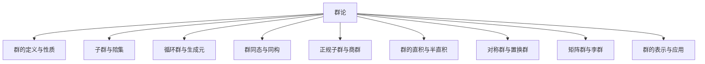
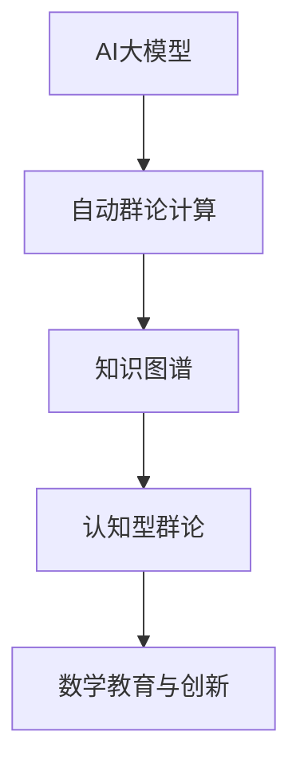

# 00-群论总览

## 目录

- [00-群论总览](#00-群论总览)
  - [目录](#目录)
  - [1. 群论简介](#1-群论简介)
    - [1.1 群的定义](#11-群的定义)
    - [1.2 群论的历史发展](#12-群论的历史发展)
    - [1.3 群论的重要性](#13-群论的重要性)
  - [2. 本目录内容](#2-本目录内容)
  - [3. 核心概念图](#3-核心概念图)
    - [多表征内容导航](#多表征内容导航)
  - [认知、教育、AI与哲学视角下的群论](#认知教育ai与哲学视角下的群论)
    - [现代AI与自动化群论补充](#现代ai与自动化群论补充)
  - [4. 重要定理总结](#4-重要定理总结)
  - [5. 与其他主题的关联](#5-与其他主题的关联)
  - [6. 学习路径建议](#6-学习路径建议)
  - [7. 实际应用](#7-实际应用)
  - [8. 参考文献](#8-参考文献)

## 1. 群论简介

群论是代数学中研究群及其性质的分支，是现代代数的核心部分。群是由一个集合与一个符合特定公理的二元运算组成的代数系统，具有广泛的应用，从数学内部的代数方程理论，到物理学中的对称性研究，再到计算机科学中的密码学。

### 1.1 群的定义

**群**是一个代数系统，由一个非空集合 $G$ 和一个二元运算 $\cdot$ 组成，满足以下公理：

1. **封闭性**：对于所有 $a, b \in G$，都有 $a \cdot b \in G$。
2. **结合律**：对于所有 $a, b, c \in G$，都有 $(a \cdot b) \cdot c = a \cdot (b \cdot c)$。
3. **单位元**：存在一个元素 $e \in G$，使得对于所有 $a \in G$，都有 $e \cdot a = a \cdot e = a$。
4. **逆元**：对于每个 $a \in G$，都存在一个元素 $a^{-1} \in G$，使得 $a \cdot a^{-1} = a^{-1} \cdot a = e$。

如果进一步满足交换律（对于所有 $a, b \in G$，都有 $a \cdot b = b \cdot a$），则称为**交换群**或**阿贝尔群**。

### 1.2 群论的历史发展

群论起源于19世纪初期，由伽罗瓦（Galois）在研究多项式方程的可解性时首次系统地使用了群的概念。随后，在卡莱（Cayley）、西罗（Sylow）和克莱因（Klein）等数学家的推动下，群论逐渐发展成为一个独立的数学分支。20世纪，群论的研究范围继续扩大，涉及有限群分类、李群理论等多个方向。

### 1.3 群论的重要性

群论对于现代数学和理论物理学具有基础性意义，主要体现在以下几个方面：

1. **结构理解**：提供了分析和理解数学结构的有力工具
2. **对称性**：是研究自然界中对称性的数学语言
3. **不变量**：帮助识别和研究在变换下保持不变的性质
4. **应用广泛**：从密码学到量子力学，群论都有重要应用

## 2. 本目录内容

本目录包含以下群论主题的详细探讨：

| 文件 | 主题 | 描述 |
| ---- |------| ---- |
| [01-群的基本概念.md](./01-群的基本概念.md) | 群的基础理论 | 群的定义、性质及基本定理 |
| [02-子群与陪集.md](./02-子群与陪集.md) | 子群理论 | 子群定义、拉格朗日定理、陪集分解 |
| [03-循环群与生成元.md](./03-循环群与生成元.md) | 循环群 | 循环群特性、生成元及其性质 |
| [04-群同态与同构.md](./04-群同态与同构.md) | 群间映射 | 同态、同构的定义及同态基本定理 |
| [05-正规子群与商群.md](./05-正规子群与商群.md) | 商群构造 | 正规子群、商群及其性质 |
| [06-群的直积与半直积.md](./06-群的直积与半直积.md) | 群的组合 | 直积、半直积等群的构造方法 |

## 3. 核心概念图



---

### 多表征内容导航

- [群的定义与性质代码实现与证明](./01-群的定义与性质.md)
- [子群与陪集的结构与例题](./02-子群与陪集.md)
- [群同态与同构的代码与证明](./03-群同态与同构.md)
- [练习与思考题见各分支详细文件]

---

## 认知、教育、AI与哲学视角下的群论

- **认知科学**：群论的对称性、结构归纳与变换思想反映了人类对"等价""不变性""结构映射"的高级认知能力。
- **教育学**：群论是抽象代数的起点，有助于学生建立结构化、抽象化和归纳推理能力。
- **人工智能**：群结构广泛用于对称性检测、自动推理、密码学、图像识别等AI领域。
- **数学哲学**：群论是结构主义、对称性哲学等流派的典范，体现了"结构优先于对象"的现代数学观。

### 现代AI与自动化群论补充

**AI大模型辅助群论**：GPT-4、Claude等大模型已能自动生成群论证明、形式化代码，辅助教学与研究。

**知识图谱驱动的群论自动化**：如OpenAI MathGraph、Wikidata等，支持群论知识的结构化、自动化推理。

**认知型群论系统**：结合人类认知过程的AI推理系统，模拟数学家的群论思维与创新。

**Rust代码示例：AI辅助群论结构体**:

```rust
struct AIAssistedGroupTheory {
    statement: String,
    group_steps: Vec<String>,
    verified: bool,
}

impl AIAssistedGroupTheory {
    fn new(statement: &str) -> Self {
        AIAssistedGroupTheory { statement: statement.to_string(), group_steps: vec![], verified: false }
    }
    fn add_step(&mut self, step: &str) {
        self.group_steps.push(step.to_string());
    }
    fn verify(&mut self) {
        // 假设AI自动验证
        self.verified = true;
    }
}
```

**结构图：AI与群论自动化**:



---

[返回"代数结构与理论总览"](../00-代数结构与理论总览.md) ｜ [返回知识树总览](../../09-项目总览/00-项目总览.md)

相关主题跳转：

- [基本代数系统总览](../01-基本代数系统/00-基本代数系统总览.md)
- [环论总览](../03-环论/00-环论总览.md)
- [域论总览](../04-域论/00-域论总览.md)
- [范畴论基础](../08-范畴论/00-范畴论基础总览.md)

## 4. 重要定理总结

群论中的一些关键定理包括：

1. **拉格朗日定理**：有限群 $G$ 的任何子群 $H$ 的阶都整除 $G$ 的阶。

2. **同态基本定理**：设 $\varphi: G \to H$ 是群同态，则 $G/\ker(\varphi) \cong \text{Im}(\varphi)$。

3. **凯莱定理**：任何群都同构于某个置换群。

4. **西罗定理**：如果 $p$ 是素数，$G$ 是有限群，且 $p^n$ 整除 $|G|$，则 $G$ 有一个阶为 $p^n$ 的 $p$-西罗子群。

## 5. 与其他主题的关联

群论与其他数学分支的关联：

- **与环论的关联**：环的加法结构构成阿贝尔群
- **与域论的关联**：域中的乘法（去掉零元后）构成阿贝尔群
- **与几何的关联**：变换群是几何学研究的重要工具
- **与拓扑学的关联**：拓扑群结合了群论和拓扑学
- **与表示论的关联**：群表示研究群的线性表示

## 6. 学习路径建议

建议按照以下顺序学习群论内容：

1. 首先理解群的基本定义、性质和示例
2. 学习子群、陪集和拉格朗日定理
3. 掌握循环群和生成元的概念
4. 学习群同态、同构和同态基本定理
5. 理解正规子群和商群的构造
6. 最后学习群的直积、半直积等高级构造

## 7. 实际应用

群论在多个领域有重要应用：

1. **密码学**：有限域上的群用于现代加密算法
2. **结晶学**：点群和空间群用于描述晶体结构
3. **量子物理**：李群用于描述对称性和守恒律
4. **编码理论**：群码用于构造纠错码

## 8. 参考文献

1. Dummit, D. S., & Foote, R. M. (2004). *Abstract algebra* (3rd ed.). John Wiley & Sons.
2. Rotman, J. J. (2012). *Advanced modern algebra*. American Mathematical Society.
3. Artin, M. (2011). *Algebra* (2nd ed.). Pearson.
4. Robinson, D. J. (1995). *A course in the theory of groups* (2nd ed.). Springer.

---

**创建日期**: 2025-06-25
**最后更新**: 2025-06-25
