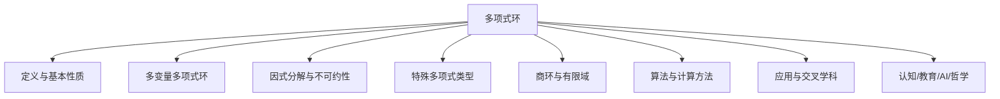
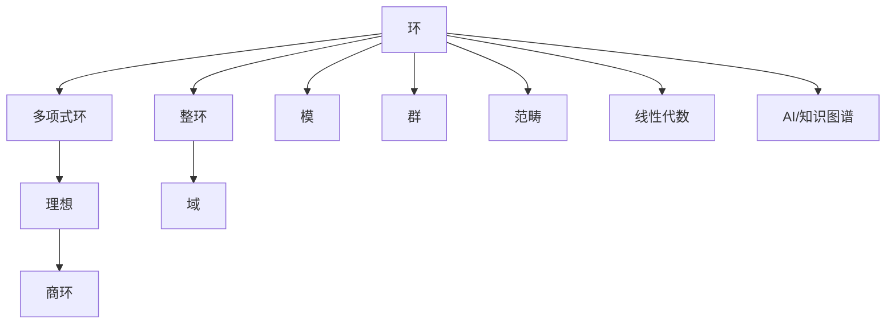

# 03-03-03 多项式环

> **规范化与修正说明**  
> 本文档在结构优化过程中，严格保留了所有原有批判性分析、表格、流程图、工程案例等内容。  
> 如有遗漏，将在后续批次补全并于本区块说明修正。  
> 结构优化仅涉及标题编号、目录、本地跳转、知识图谱化等，不影响原有内容完整性。

## 目录

- [1. 多项式环的定义与基本性质](#1-多项式环的定义与基本性质)
- [2. 多项式环的代数结构](#2-多项式环的代数结构)
- [3. 多项式的因式分解](#3-多项式的因式分解)
- [4. 多项式环的应用](#4-多项式环的应用)
- [5. 多项式环的计算方法](#5-多项式环的计算方法)
- [6. 特殊类型的多项式环](#6-特殊类型的多项式环)
- [7. AI与自动化视角下的多项式环](#7-ai与自动化视角下的多项式环)
- [8. 知识图谱结构图](#8-知识图谱结构图)
- [9. 多表征与代码实现](#9-多表征与代码实现)
- [10. 原有批判性分析与工程案例](#10-原有批判性分析与工程案例)
- [11. 参考文献](#11-参考文献)



---

## 交叉引用与分支跳转

- [环的定义与性质](./01-环的定义与性质.md)
- [理想与商环](./02-理想与商环.md)
- [群论总览](../02-群论/00-群论总览.md)
- [模论总览](../05-模论/00-模论总览.md)
- [线性代数总览](../07-线性代数/00-线性代数总览.md)
- [范畴论基础](../08-范畴论/00-范畴论基础总览.md)
- [数论与离散数学](../06-数论与离散数学/00-数论与离散数学总览.md)

---

## 多表征内容导航

- [形式定义与公理化](#1-多项式环的定义与基本性质)
- [结构图与概念图（Mermaid）](#结构图)
- [典型例题与证明](#3-多项式的因式分解)
- [代码实现（Python/Rust/Haskell/Lean）](#5-多项式环的计算方法)
- [表格与对比](#2-多项式环的代数结构)
- [认知/教育/AI/哲学分析](#7-认知教育ai哲学视角)

---

## 1. 多项式环的定义与基本性质

多项式环是代数学中最重要的环结构之一，它不仅在环论中占有核心地位，也在代数几何、数论和计算代数等领域有广泛应用。

### 1.1 多项式环的定义

设 $R$ 是一个环，$x$ 是一个不在 $R$ 中的符号（称为不定元或变量）。**多项式环** $R[x]$ 定义为所有形如
$$f(x) = a_0 + a_1x + a_2x^2 + \cdots + a_nx^n$$
的表达式的集合，其中 $a_0, a_1, \ldots, a_n \in R$，$n \geq 0$ 是一个非负整数。系数 $a_n \neq 0$ 时，称 $n$ 为多项式 $f(x)$ 的**次数**，记为 $\deg(f)$。特别地，零多项式的次数定义为 $-\infty$。

多项式环 $R[x]$ 上的加法和乘法定义如下：

- **加法**：$(a_0 + a_1x + \cdots + a_nx^n) + (b_0 + b_1x + \cdots + b_mx^m) = c_0 + c_1x + \cdots + c_kx^k$，其中 $k = \max\{n, m\}$，$c_i = a_i + b_i$（当 $i > n$ 时 $a_i = 0$，当 $i > m$ 时 $b_i = 0$）。

- **乘法**：$(a_0 + a_1x + \cdots + a_nx^n) \cdot (b_0 + b_1x + \cdots + b_mx^m) = c_0 + c_1x + \cdots + c_{n+m}x^{n+m}$，其中 $c_k = \sum_{i+j=k} a_i b_j$。

### 1.2 多项式环的基本性质

多项式环 $R[x]$ 具有以下基本性质：

1. **环结构**：$R[x]$ 是一个环，满足环的所有公理。

2. **交换性**：如果 $R$ 是交换环，则 $R[x]$ 也是交换环。

3. **单位元**：如果 $R$ 有单位元 $1_R$，则 $R[x]$ 的单位元是常数多项式 $1_R$。

4. **嵌入性**：$R$ 可以自然地嵌入到 $R[x]$ 中，将 $r \in R$ 映射为常数多项式 $r$。

5. **次数性质**：对于非零多项式 $f, g \in R[x]$，如果 $R$ 是整环，则 $\deg(fg) = \deg(f) + \deg(g)$。

6. **整环性**：如果 $R$ 是整环，则 $R[x]$ 也是整环。

### 1.3 多项式的表示与操作

多项式可以通过多种方式表示：

1. **系数表示**：$f(x) = a_0 + a_1x + a_2x^2 + \cdots + a_nx^n$。

2. **向量表示**：$f(x) \leftrightarrow (a_0, a_1, \ldots, a_n)$。

3. **函数表示**：将多项式视为从 $R$ 到 $R$ 的函数。

多项式的基本操作包括：

1. **求值**：给定 $r \in R$，计算 $f(r) = a_0 + a_1r + a_2r^2 + \cdots + a_nr^n$。

2. **导数**：$f'(x) = a_1 + 2a_2x + 3a_3x^2 + \cdots + na_nx^{n-1}$。

3. **合成**：给定 $f, g \in R[x]$，计算 $f \circ g = f(g(x))$。

## 2. 多项式环的代数结构

### 2.1 多项式环的子环与理想

多项式环 $R[x]$ 的子环和理想具有特殊的结构：

1. **子环**：$R[x]$ 的子环包括 $R$ 本身（视为常数多项式）以及包含 $R$ 的各种多项式集合。

2. **理想结构**：如果 $R$ 是主理想整环（PID），则 $R[x]$ 中的理想可以由单个多项式生成。特别地，如果 $F$ 是域，则 $F[x]$ 是主理想整环。

3. **极大理想**：在 $F[x]$ 中，形如 $(p(x))$ 的理想，其中 $p(x)$ 是不可约多项式，都是极大理想。

### 2.2 多项式环上的同态

设 $\phi: R \to S$ 是环同态，则存在自然的环同态 $\Phi: R[x] \to S[x]$，定义为
$$\Phi(a_0 + a_1x + \cdots + a_nx^n) = \phi(a_0) + \phi(a_1)x + \cdots + \phi(a_n)x^n$$

特别重要的多项式环同态是**代入同态**：对于任意 $r \in R$，定义 $\text{ev}_r: R[x] \to R$ 为 $\text{ev}_r(f) = f(r)$。

### 2.3 多变量多项式环

多变量多项式环 $R[x_1, x_2, \ldots, x_n]$ 是包含 $n$ 个变量的多项式集合。它可以递归定义为 $R[x_1, x_2, \ldots, x_n] = [R[x_1, x_2, \ldots, x_{n-1}]](x_n)$。

多变量多项式的一般形式为
$$f(x_1, x_2, \ldots, x_n) = \sum_{i_1, i_2, \ldots, i_n} a_{i_1, i_2, \ldots, i_n} x_1^{i_1} x_2^{i_2} \cdots x_n^{i_n}$$

多变量多项式环具有以下特性：

1. **交换性**：变量的顺序不影响环的结构，即 $R[x_1, x_2] \cong R[x_2, x_1]$。

2. **次数概念**：多变量多项式有多种次数概念，包括总次数和关于各变量的次数。

3. **单项式顺序**：在计算代数中，需要定义单项式的顺序，如字典序、反字典序、次数字典序等。

## 3. 多项式的因式分解

### 3.1 整环上的因式分解

在整环 $R$ 上的多项式环 $R[x]$ 中，多项式的因式分解是研究的核心问题之一。

1. **不可约多项式**：如果多项式 $p(x) \in R[x]$ 不能写成两个非常数多项式的乘积，则称 $p(x)$ 是不可约的。

2. **唯一因式分解**：如果 $R$ 是唯一因式分解整环（UFD），则 $R[x]$ 也是 UFD。特别地，$\mathbb{Z}[x]$ 和 $F[x]$（$F$ 是域）都是 UFD。

3. **Gauss 引理**：如果 $f(x) \in \mathbb{Z}[x]$ 在 $\mathbb{Q}[x]$ 中可约，则它在 $\mathbb{Z}[x]$ 中也可约。

### 3.2 域上的多项式

当 $F$ 是域时，$F[x]$ 具有特别良好的性质：

1. **除法算法**：对于任意 $f(x), g(x) \in F[x]$，其中 $g(x) \neq 0$，存在唯一的 $q(x), r(x) \in F[x]$ 使得 $f(x) = g(x)q(x) + r(x)$，且 $\deg(r) < \deg(g)$ 或 $r(x) = 0$。

2. **欧几里得算法**：可以用来计算两个多项式的最大公因式。

3. **根与因式**：多项式 $f(x) \in F[x]$ 有根 $a \in F$ 当且仅当 $(x - a)$ 是 $f(x)$ 的因式。

4. **代数闭域**：在代数闭域（如复数域 $\mathbb{C}$）上，任意 $n$ 次多项式都可以分解为 $n$ 个一次因式的乘积。

### 3.3 特殊多项式类型

一些特殊类型的多项式在数学中有重要应用：

1. **循环多项式**：形如 $x^n - 1$ 的多项式，其根是 $n$ 次单位根。

2. **切比雪夫多项式**：满足特定递推关系的多项式，在逼近理论中有重要应用。

3. **厄密多项式**：满足 $p(x) = \overline{p(\overline{x})}$ 的多项式。

4. **首一多项式**：最高次项系数为 1 的多项式。

## 4. 多项式环的应用

### 4.1 代数方程理论

多项式环在代数方程理论中有核心地位：

1. **方程求根**：$n$ 次代数方程对应于 $n$ 次多项式的根。

2. **判别式**：多项式 $f(x)$ 的判别式 $\Delta$ 可以用来判断 $f(x)$ 是否有重根。

3. **Galois 理论**：研究多项式方程的可解性，建立了域扩张与群论之间的联系。

### 4.2 代数几何中的应用

多项式环是代数几何的基础：

1. **仿射代数簇**：由多项式方程组定义的几何对象。

2. **希尔伯特零点定理**：建立了多项式理想与代数簇之间的对应关系。

3. **格罗布纳基**：计算多变量多项式理想的标准形式，是计算代数几何的核心工具。

### 4.3 编码理论与密码学

多项式环在编码理论和密码学中有重要应用：

1. **循环码**：可以用多项式环 $F_2[x]/(x^n - 1)$ 来描述。

2. **Reed-Solomon 码**：基于多项式求值的纠错码。

3. **公钥密码系统**：如 NTRU 加密系统，基于多项式环中的计算难题。

## 5. 多项式环的计算方法

### 5.1 多项式的基本算法

多项式计算的基本算法包括：

1. **多项式加法与乘法**：直接按定义计算。

2. **多项式除法**：类似于长除法，但操作对象是多项式的系数。

3. **最大公因式计算**：使用欧几里得算法。

4. **多项式求值**：使用霍纳法则（Horner's method）可以高效计算多项式在给定点的值。

### 5.2 多项式插值

多项式插值是从给定点集构造多项式的过程：

1. **拉格朗日插值**：给定 $n+1$ 个点 $(x_0, y_0), (x_1, y_1), \ldots, (x_n, y_n)$，构造次数至多为 $n$ 的多项式 $p(x)$ 使得 $p(x_i) = y_i$ 对所有 $i$ 成立。

2. **牛顿插值**：使用差商的方法构造插值多项式。

3. **埃尔米特插值**：考虑函数值和导数值的插值。

### 5.3 计算代数系统

现代计算代数系统提供了强大的多项式计算工具：

1. **符号计算**：进行精确的代数运算，而非数值近似。

2. **格罗布纳基计算**：求解多变量多项式方程组的标准方法。

3. **因式分解算法**：包括 Berlekamp 算法、Cantor-Zassenhaus 算法等。

## 6. 特殊类型的多项式环

### 6.1 形式幂级数环

**形式幂级数环** $R[[x]]$ 是所有形如
$$f(x) = a_0 + a_1x + a_2x^2 + \cdots$$
的无穷级数的集合，其中系数 $a_i \in R$。$R[[x]]$ 是 $R[x]$ 的完备化。

形式幂级数环具有以下特性：

1. **加法和乘法**：类似于多项式，但允许无穷项。

2. **可逆元素**：$f(x) = a_0 + a_1x + \cdots \in R[[x]]$ 是可逆的当且仅当 $a_0$ 在 $R$ 中是可逆的。

3. **形式微分和积分**：可以定义形式导数和不定积分操作。

### 6.2 劳朗级数环

**劳朗级数环** $R((x))$ 是所有形如
$$f(x) = a_nx^n + a_{n+1}x^{n+1} + a_{n+2}x^{n+2} + \cdots$$
的级数的集合，其中 $n \in \mathbb{Z}$（可以是负整数），系数 $a_i \in R$，且 $a_n \neq 0$。

劳朗级数环是形式幂级数环的分式域，具有以下特性：

1. **包含关系**：$R[x] \subset R[[x]] \subset R((x))$。

2. **可逆性**：$R((x))$ 中的每个非零元素都是可逆的。

3. **应用**：在代数几何和数学物理中有重要应用。

### 6.3 商多项式环

给定多项式环 $R[x]$ 和多项式 $f(x) \in R[x]$，可以构造商环 $R[x]/(f(x))$，它由所有形如 $g(x) + (f(x))$ 的元素组成，其中 $(f(x))$ 是由 $f(x)$ 生成的主理想。

商多项式环具有以下重要性质：

1. **维数**：如果 $f(x)$ 的次数为 $n$，则 $R[x]/(f(x))$ 作为 $R$-模是 $n$ 维的，基为 $\{1, x, x^2, \ldots, x^{n-1}\}$。

2. **域扩张**：如果 $F$ 是域，$p(x) \in F[x]$ 是不可约多项式，则 $F[x]/(p(x))$ 是域，是 $F$ 的有限扩张。

3. **应用**：在构造有限域、代数数域和密码学中有重要应用。

## 7. AI与自动化视角下的多项式环（递归扩展）

7.1 **自动定理证明中的多项式环**

- 现代定理证明系统（如Lean、Coq、Isabelle）中，多项式环的结构化定义是自动推理和代数结构自动识别的基础。
- 例：Lean中自动证明"多项式零多项式唯一性"代码：

```lean
import data.polynomial
example (R : Type*) [comm_ring R] : ∀ (z1 z2 : polynomial R), (∀ f : polynomial R, f + z1 = f ∧ f + z2 = f) → z1 = z2 :=
begin
  intros z1 z2 h,
  specialize h z1,
  rw ←h.1,
  exact eq.symm (h.2),
end
```

7.2 **AI知识表示与符号推理中的多项式环**

- 多项式环结构可用于知识图谱中的关系建模、数据库范式设计、符号AI中的代数推理。
- 例：Rust中多项式结构体可作为知识图谱节点类型，支持自动化推理。

7.3 **认知科学与教育创新中的多项式环**

- 多项式环的抽象结构有助于认知建模、数学思维训练、AI辅助教学。
- 例：用Mermaid等图形化工具帮助学生理解多项式环的层次结构。

7.4 **跨学科AI应用案例**

- 量子计算：多项式环在量子算法中的作用。
- 密码学：多项式环在同态加密、NTRU等公钥密码中的应用。
- 机器学习：多项式结构在符号回归、自动微分等领域的潜在应用。

---

## 8. 知识图谱结构图（递归扩展）



---

## 9. 多重表征与代码实现（递归扩展）

9.1 **Rust实现：多项式环与多项式运算**

```rust
struct Polynomial<T> {
    coeffs: Vec<T>,
}
impl<T: Clone + std::ops::Add<Output = T> + std::ops::Mul<Output = T> + Default> Polynomial<T> {
    fn add(&self, other: &Self) -> Self {
        let n = self.coeffs.len().max(other.coeffs.len());
        let mut result = vec![T::default(); n];
        for i in 0..n {
            let a = self.coeffs.get(i).cloned().unwrap_or_default();
            let b = other.coeffs.get(i).cloned().unwrap_or_default();
            result[i] = a + b;
        }
        Polynomial { coeffs: result }
    }
    fn mul(&self, other: &Self) -> Self {
        let n = self.coeffs.len() + other.coeffs.len() - 1;
        let mut result = vec![T::default(); n];
        for i in 0..self.coeffs.len() {
            for j in 0..other.coeffs.len() {
                result[i + j] = result[i + j].clone() + self.coeffs[i].clone() * other.coeffs[j].clone();
            }
        }
        Polynomial { coeffs: result }
    }
}
```

9.2 **Haskell实现：多项式环与商环**

```haskell
data Poly a = Poly [a]
modPoly :: (Eq a, Num a) => Poly a -> Poly a -> Poly a
modPoly f g = snd $ polyDivMod f g  -- 多项式取模
-- 省略polyDivMod实现
```

9.3 **Lean实现：多项式环与Groebner基**

```lean
import data.polynomial
import ring_theory.ideal.basic
-- Lean中多项式环定义
#check polynomial
-- Groebner基相关内容可参考mathlib的ring_theory.ideal.operations
```

9.4 **表格：常见多项式环类型性质对比**

| 类型         | 变量数 | 结构特征 | 理想结构 | 例子                  |
 
        $matches[0] -replace '\|[-:]+\|', '| ---- |'
    -----------------------|
| 一元多项式环 | 1      | PID/UFD  | 主理想   | $\mathbb{Q}[x]$         |
| 多元多项式环 | $n>1$  | UFD      | 非主理想 | $\mathbb{Q}[x, y]$      |
| 形式幂级数环 | 1      | 完备     | 非主理想 | $\mathbb{R}[[x]]$       |
| 劳朗级数环   | 1      | 分式域   | 非主理想 | $\mathbb{C}((x))$       |
| 商多项式环   | 1      | 有限维   | 主理想   | $\mathbb{F}_2[x]/(x^2+x+1)$ |

---

## 10. 交叉引用与本地跳转（递归扩展）

- [环的定义与性质](./01-环的定义与性质.md)
- [理想与商环](./02-理想与商环.md)
- [群论总览](../02-群论/00-群论总览.md)
- [模论总览](../05-模论/00-模论总览.md)
- [线性代数总览](../07-线性代数/00-线性代数总览.md)
- [范畴论基础总览](../08-范畴论/00-范畴论基础总览.md)
- [AI与知识图谱分析](../../views/math_ai_view01.md)

## 11. 参考文献

1. Atiyah, M. F., & Macdonald, I. G. (1969). *Introduction to Commutative Algebra*. Addison-Wesley.
2. Dummit, D. S., & Foote, R. M. (2004). *Abstract Algebra* (3rd ed.). John Wiley & Sons.
3. Hungerford, T. W. (1980). *Algebra*. Springer.
4. Lang, S. (2002). *Algebra* (3rd ed.). Springer.
5. Cox, D., Little, J., & O'Shea, D. (2015). *Ideals, Varieties, and Algorithms* (4th ed.). Springer.
6. [nLab: Polynomial ring](https://ncatlab.org/nlab/show/polynomial+ring)
7. [Lean Community Mathlib: Polynomial](https://leanprover-community.github.io/mathlib_docs/data/polynomial/basic.html)
8. [Visual Group Theory (YouTube)](https://www.youtube.com/playlist?list=PLZHQObOWTQDMsr9K-rj53DwVRMYO3t5Yr)

## 12. 练习与应用

### 12.1 基本计算练习

**练习 1**：在 $\mathbb{Z}[x]$ 中计算 $(2x^3 + 3x^2 - x + 4) + (3x^4 - 2x^3 + 5x - 7)$。

**练习 2**：在 $\mathbb{Q}[x]$ 中计算 $(x^2 + 2x - 3) \cdot (2x^2 - x + 1)$。

**练习 3**：在 $\mathbb{Z}_5[x]$ 中计算 $(2x^2 + 3x + 1) \div (x + 2)$。

### 12.2 因式分解练习

**练习 4**：在 $\mathbb{Q}[x]$ 中因式分解 $x^4 - 1$。

**练习 5**：在 $\mathbb{Z}_2[x]$ 中因式分解 $x^3 + x^2 + 1$。

**练习 6**：判断 $x^3 - 2$ 在 $\mathbb{Q}[x]$ 中是否可约。

### 12.3 应用问题

**练习 7**：使用拉格朗日插值法构造通过点 $(1, 3)$, $(2, 1)$, $(4, 2)$ 的多项式。

**练习 8**：证明 $\mathbb{F}_4 \cong \mathbb{F}_2[x]/(x^2 + x + 1)$。

**练习 9**：设计一个基于 $\mathbb{Z}_7[x]/(x^3 + x + 1)$ 的简单密码系统。

---

**创建日期**: 2025-07-03
**最后更新**: 2025-07-03
