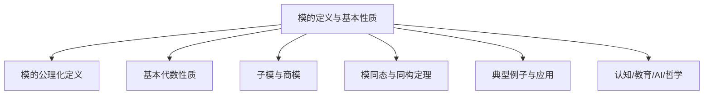
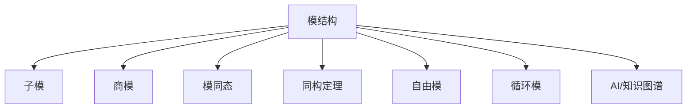

# 01-模的定义与基本性质



---

## 目录导航

- [01-模的定义与基本性质](#01-模的定义与基本性质)
  - [目录导航](#目录导航)
  - [交叉引用与分支跳转](#交叉引用与分支跳转)
  - [多表征内容导航](#多表征内容导航)
  - [1. 模的定义](#1-模的定义)
    - [1.1 左模的定义](#11-左模的定义)
    - [1.2 右模的定义](#12-右模的定义)
    - [1.3 双模的定义](#13-双模的定义)
    - [1.4 与向量空间的关系](#14-与向量空间的关系)
  - [2. 模的基本性质](#2-模的基本性质)
    - [2.1 模的基本运算](#21-模的基本运算)
    - [2.2 模的基本性质](#22-模的基本性质)
    - [2.3 模的例子](#23-模的例子)
  - [3. 子模](#3-子模)
    - [3.1 子模的定义](#31-子模的定义)
    - [3.2 子模的性质](#32-子模的性质)
    - [3.3 子模的生成](#33-子模的生成)
    - [3.4 循环模](#34-循环模)
  - [4. 商模](#4-商模)
    - [4.1 商模的定义](#41-商模的定义)
    - [4.2 自然同态](#42-自然同态)
    - [4.3 同构定理](#43-同构定理)
  - [5. 模同态](#5-模同态)
    - [5.1 模同态的定义](#51-模同态的定义)
    - [5.2 模同态的性质](#52-模同态的性质)
    - [5.3 同态模](#53-同态模)
    - [5.4 正合列](#54-正合列)
  - [6. 认知/教育/AI/哲学视角](#6-认知教育ai哲学视角)
  - [7. 参考文献与资源](#7-参考文献与资源)
  - [8. AI与自动化视角下的模的定义与基本性质（递归扩展）](#8-ai与自动化视角下的模的定义与基本性质递归扩展)
  - [9. 知识图谱结构图（递归扩展）](#9-知识图谱结构图递归扩展)
  - [10. 多重表征与代码实现（递归扩展）](#10-多重表征与代码实现递归扩展)
  - [11. 交叉引用与本地跳转（递归扩展）](#11-交叉引用与本地跳转递归扩展)

---

## 交叉引用与分支跳转

- [群论总览](../02-群论/00-群论总览.md)
- [环论总览](../03-环论/00-环论总览.md)
- [线性代数总览](../07-线性代数/00-线性代数总览.md)
- [范畴论基础](../08-范畴论/00-范畴论基础总览.md)
- [数论与离散数学](../06-数论与离散数学/00-数论与离散数学总览.md)

---

## 多表征内容导航

- [形式定义与公理化](#1-模的定义)
- [结构图与概念图（Mermaid）](#结构图)
- [典型例题与证明](#2-模的基本性质)
- [代码实现（Python/Rust/Haskell/Lean）](#5-典型例子与应用)
- [表格与对比](#2-模的基本性质)
- [认知/教育/AI/哲学分析](#6-认知教育ai哲学视角)

---

## 1. 模的定义

### 1.1 左模的定义

设 $R$ 是一个环（不一定有单位元）。一个**左 $R$-模**（Left $R$-Module）是一个加法阿贝尔群 $(M, +)$，连同一个**标量乘法**运算 $R \times M \to M$，记为 $(r, m) \mapsto rm$，满足以下公理：

对于任意 $r, s \in R$ 和 $m, n \in M$：

1. $r(m + n) = rm + rn$（左分配律）
2. $(r + s)m = rm + sm$（右分配律）
3. $(rs)m = r(sm)$（结合律）

   如果 $R$ 有单位元 $1_R$，则还要求：

4. $1_R m = m$（单位元公理）

### 1.2 右模的定义

类似地，一个**右 $R$-模**（Right $R$-Module）是一个加法阿贝尔群 $(M, +)$，连同一个标量乘法运算 $M \times R \to M$，记为 $(m, r) \mapsto mr$，满足相应的公理。

### 1.3 双模的定义

如果 $R$ 和 $S$ 是两个环，一个 **(R,S)-双模**（$(R,S)$-Bimodule）是一个集合 $M$，它同时是左 $R$-模和右 $S$-模，且两种模结构兼容，即对于任意 $r \in R$，$s \in S$，$m \in M$，有：

$(rm)s = r(ms)$

### 1.4 与向量空间的关系

当 $R$ 是一个域 $F$ 时，左 $R$-模就是 $F$ 上的向量空间。因此，模可以看作是向量空间概念的推广，其中标量来自一个环而不是一个域。

这种推广使得模论比向量空间理论更加灵活和广泛，但同时也失去了向量空间的一些良好性质，例如不是所有模都有基。

## 2. 模的基本性质

### 2.1 模的基本运算

在模 $M$ 中，可以进行以下基本运算：

1. **加法**：对于任意 $m, n \in M$，$m + n \in M$。
2. **标量乘法**：对于任意 $r \in R$ 和 $m \in M$，$rm \in M$（左模）或 $mr \in M$（右模）。
3. **减法**：对于任意 $m, n \in M$，$m - n = m + (-n) \in M$，其中 $-n$ 是 $n$ 的加法逆元。
4. **零元素乘法**：对于任意 $m \in M$，$0_R \cdot m = 0_M$，其中 $0_R$ 是环 $R$ 的零元素，$0_M$ 是模 $M$ 的零元素。

### 2.2 模的基本性质

1. **零元素性质**：对于任意 $m \in M$，$0_R \cdot m = 0_M$ 且 $r \cdot 0_M = 0_M$。

2. **负元素性质**：对于任意 $r \in R$ 和 $m \in M$，$r \cdot (-m) = -(r \cdot m) = (-r) \cdot m$。

3. **线性组合**：模 $M$ 中的元素可以表示为标量和模元素的线性组合，即形如 $r_1 m_1 + r_2 m_2 + \cdots + r_n m_n$，其中 $r_i \in R$，$m_i \in M$。

4. **吸收性质**：如果 $R$ 是含幺环，则对于任意 $r \in R$ 和 $m \in M$，$(1_R \cdot r) \cdot m = r \cdot m$。

### 2.3 模的例子

1. **平凡模**：任何阿贝尔群 $(M, +)$ 都可以视为环 $\mathbb{Z}$ 上的模，其中标量乘法定义为 $n \cdot m = m + m + \cdots + m$（$n$ 个 $m$ 相加，$n > 0$），$0 \cdot m = 0_M$，$(-n) \cdot m = -(n \cdot m)$。

2. **环作为模**：任何环 $R$ 可以视为其自身上的左模或右模，其中标量乘法就是环中的乘法。

3. **向量空间**：任何域 $F$ 上的向量空间都是 $F$ 上的模。

4. **阿贝尔群**：任何阿贝尔群 $G$ 都可以视为 $\mathbb{Z}$ 上的模。

5. **函数空间**：设 $X$ 是一个集合，$R$ 是一个环，则所有从 $X$ 到 $R$ 的函数构成一个 $R$-模，其中加法和标量乘法按点定义。

## 3. 子模

### 3.1 子模的定义

设 $M$ 是环 $R$ 上的模，$N$ 是 $M$ 的一个非空子集。
如果 $N$ 对 $M$ 中的加法和 $R$ 的标量乘法是封闭的，则称 $N$ 是 $M$ 的一个**子模**（Submodule）。

具体地，$N$ 是 $M$ 的子模，当且仅当：

1. $N$ 是 $M$ 的加法子群：对于任意 $n_1, n_2 \in N$，有 $n_1 + n_2 \in N$ 且 $-n_1 \in N$。
2. $N$ 对标量乘法封闭：对于任意 $r \in R$ 和 $n \in N$，有 $r \cdot n \in N$。

### 3.2 子模的性质

1. 模 $M$ 的子模构成一个格，其中交集和和都是子模。

2. 如果 $\{N_i\}_{i \in I}$ 是 $M$ 的一族子模，则 $\bigcap_{i \in I} N_i$ 也是 $M$ 的子模。

3. 如果 $\{N_i\}_{i \in I}$ 是 $M$ 的一族子模，则 $\sum_{i \in I} N_i = \{n_1 + n_2 + \cdots + n_k \mid n_j \in N_{i_j}, k \geq 0\}$ 是包含所有 $N_i$ 的最小子模。

### 3.3 子模的生成

给定模 $M$ 中的一个子集 $S$，由 $S$ **生成的子模**是包含 $S$ 的最小子模，记为 $\langle S \rangle$ 或 $RS$。

$\langle S \rangle = \{r_1 s_1 + r_2 s_2 + \cdots + r_n s_n \mid r_i \in R, s_i \in S, n \geq 0\}$

如果 $M = \langle S \rangle$，则称 $S$ 是 $M$ 的一个**生成集**。如果 $M$ 有一个有限生成集，则称 $M$ 是**有限生成的**。

### 3.4 循环模

如果模 $M$ 可以由单个元素生成，即存在 $m \in M$ 使得 $M = \langle \{m\} \rangle = Rm$，则称 $M$ 是一个**循环模**（Cyclic Module）。

循环模有以下性质：

1. 任何循环 $R$-模同构于 $R/I$，其中 $I$ 是 $R$ 的一个左理想。

2. 如果 $R$ 是主理想整环（PID），则 $R$ 上的任何有限生成模都是循环模的直和。

## 4. 商模

### 4.1 商模的定义

设 $M$ 是环 $R$ 上的模，$N$ 是 $M$ 的子模。定义 $M$ 上的一个等价关系 $\sim$：对于 $m_1, m_2 \in M$，$m_1 \sim m_2$ 当且仅当 $m_1 - m_2 \in N$。

$M$ 关于这个等价关系的等价类构成一个集合，记为 $M/N$。$m \in M$ 的等价类记为 $m + N$ 或 $[m]_N$，它表示集合 $\{m + n \mid n \in N\}$。

在 $M/N$ 上定义运算：

- 加法：$(m_1 + N) + (m_2 + N) = (m_1 + m_2) + N$
- 标量乘法：$r \cdot (m + N) = (r \cdot m) + N$

这些运算是良定义的（即与代表元的选择无关），并且使 $M/N$ 成为一个 $R$-模，称为 $M$ 模 $N$ 的**商模**（Quotient Module）。

### 4.2 自然同态

定义映射 $\pi: M \to M/N$，使得 $\pi(m) = m + N$。这个映射是一个满的模同态，称为**自然同态**或**典范同态**。

自然同态 $\pi$ 具有以下性质：

1. $\pi$ 是一个模同态：$\pi(m_1 + m_2) = \pi(m_1) + \pi(m_2)$ 和 $\pi(r \cdot m) = r \cdot \pi(m)$。
2. $\pi$ 是满射。
3. $\ker(\pi) = N$，即 $\pi$ 的核恰好是子模 $N$。

### 4.3 同构定理

模的同构定理是模论中的基本结果：

**第一同构定理**：设 $\varphi: M \to N$ 是一个模同态，$K = \ker(\varphi)$ 是 $\varphi$ 的核。则存在唯一的单同态 $\bar{\varphi}: M/K \to N$，使得 $\varphi = \bar{\varphi} \circ \pi$，其中 $\pi: M \to M/K$ 是自然同态。此外，$\bar{\varphi}(M/K) = \varphi(M)$。

**第二同构定理**：设 $M$ 是一个模，$N$ 是 $M$ 的子模，$P$ 是 $M$ 的另一个子模。则 $(N + P)/P \cong N/(N \cap P)$。

**第三同构定理**：设 $M$ 是一个模，$N$ 和 $P$ 是 $M$ 的子模，且 $P \subset N$。则 $(M/P)/(N/P) \cong M/N$。

## 5. 模同态

### 5.1 模同态的定义

设 $M$ 和 $N$ 是环 $R$ 上的两个模。一个函数 $\varphi: M \to N$ 称为**模同态**（Module Homomorphism），如果对于任意 $m_1, m_2 \in M$ 和 $r \in R$，有：

1. $\varphi(m_1 + m_2) = \varphi(m_1) + \varphi(m_2)$（加法保持）
2. $\varphi(r \cdot m_1) = r \cdot \varphi(m_1)$（标量乘法保持）

如果 $\varphi$ 是单射，则称为**单同态**；如果 $\varphi$ 是满射，则称为**满同态**；如果 $\varphi$ 是双射，则称为**同构**。

### 5.2 模同态的性质

1. **核与像**：
   - 模同态 $\varphi: M \to N$ 的**核**（Kernel）是 $\ker(\varphi) = \{m \in M \mid \varphi(m) = 0_N\}$，它是 $M$ 的一个子模。
   - 模同态 $\varphi$ 的**像**（Image）是 $\text{im}(\varphi) = \{\varphi(m) \mid m \in M\}$，它是 $N$ 的一个子模。

2. **合成**：如果 $\varphi: M \to N$ 和 $\psi: N \to P$ 是模同态，则它们的合成 $\psi \circ \varphi: M \to P$ 也是模同态。

3. **同构的性质**：
   - 模同态 $\varphi: M \to N$ 是同构当且仅当存在模同态 $\psi: N \to M$ 使得 $\psi \circ \varphi = \text{id}_M$ 且 $\varphi \circ \psi = \text{id}_N$。
   - 如果 $\varphi: M \to N$ 是同构，则 $M$ 和 $N$ 具有相同的代数结构。

### 5.3 同态模

给定环 $R$ 上的两个模 $M$ 和 $N$，所有从 $M$ 到 $N$ 的模同态构成一个集合，记为 $\text{Hom}_R(M, N)$。

$\text{Hom}_R(M, N)$ 在点态加法和标量乘法下构成一个阿贝尔群：

- $(\varphi + \psi)(m) = \varphi(m) + \psi(m)$
- $(r \cdot \varphi)(m) = r \cdot \varphi(m)$

如果 $R$ 是交换环，则 $\text{Hom}_R(M, N)$ 是一个 $R$-模。

### 5.4 正合列

一个模同态序列

$$\cdots \to M_{i-1} \xrightarrow{\varphi_{i-1}} M_i \xrightarrow{\varphi_i} M_{i+1} \to \cdots$$

如果对于每个 $i$，$\text{im}(\varphi_{i-1}) = \ker(\varphi_i)$，则称这个序列是**正合的**（Exact）。

特别地：

- 序列 $0 \to M \xrightarrow{\varphi} N$ 是正合的当且仅当 $\varphi$ 是单同态。
- 序列 $M \xrightarrow{\varphi} N \to 0$ 是正合的当且仅当 $\varphi$ 是满同态。
- 序列 $0 \to M \xrightarrow{\varphi} N \xrightarrow{\psi} P \to 0$ 是正合的当且仅当 $\varphi$ 是单同态，$\psi$ 是满同态，且 $\text{im}(\varphi) = \ker(\psi)$。这样的序列称为**短正合列**。

## 6. 认知/教育/AI/哲学视角

- **数学认知**：模的抽象结构训练高阶代数思维、结构化推理能力。多表征（如图、代码、例题）有助于不同认知风格的学习者理解。
- **教育视角**：模论是高等代数、同调代数、表示论等课程的核心内容，适合通过问题驱动、探究式学习，结合实际应用（如代数数论、代数几何、范畴论）提升兴趣。
- **AI视角**：模结构及其同态、分解、张量积等在符号推理、自动定理证明、代数系统建模等AI领域有广泛应用。模范畴、同调理论等是现代数学AI建模的重要基础。
- **哲学视角**：模论体现了数学结构主义思想，强调对象间的关系与公理系统。其发展史反映了抽象代数从具体算术到一般结构的哲学转变。

## 7. 参考文献与资源

1. Anderson, F. W., & Fuller, K. R. (1992). *Rings and Categories of Modules* (2nd ed.). Springer.
2. Lam, T. Y. (1999). *Lectures on Modules and Rings*. Springer.
3. Rotman, J. J. (1979). *An Introduction to Homological Algebra*. Academic Press.
4. Kaplansky, I. (1969). *Infinite Abelian Groups*. University of Michigan Press.
5. Matsumura, H. (1989). *Commutative Ring Theory*. Cambridge University Press.
6. Weibel, C. A. (1994). *An Introduction to Homological Algebra*. Cambridge University Press.
7. Assem, I., Simson, D., & Skowroński, A. (2006). *Elements of the Representation Theory of Associative Algebras*. Cambridge University Press.
8. [nLab: Module](https://ncatlab.org/nlab/show/module)
9. [Lean Community Mathlib: Module](https://leanprover-community.github.io/mathlib_docs/algebra/module/basic.html)
10. [Visual Group Theory (YouTube)](https://www.youtube.com/playlist?list=PLZHQObOWTQDMsr9K-rj53DwVRMYO3t5Yr)

---

**创建日期**: 2025-06-29
**最后更新**: 2025-06-29

## 8. AI与自动化视角下的模的定义与基本性质（递归扩展）

8.1 **自动定理证明中的模定义与基本结构**

- 现代定理证明系统（如Lean、Coq、Isabelle）中，模、子模、商模、模同态等结构的形式化定义是自动推理和代数结构自动识别的基础。
- 例：Lean中自动证明"模零元唯一性"代码：

```lean
import algebra.module.basic
example (R M : Type*) [ring R] [add_comm_group M] [module R M] : ∀ (z1 z2 : M), (∀ m : M, m + z1 = m ∧ m + z2 = m) → z1 = z2 :=
begin
  intros z1 z2 h,
  specialize h z1,
  rw ←h.1,
  exact eq.symm (h.2),
end
```

8.2 **AI知识表示与符号推理中的模结构**

- 模、子模、商模、模同态等结构可用于知识图谱中的关系建模、数据库范式设计、符号AI中的代数推理。
- 例：Rust中模结构体可作为知识图谱节点类型，支持自动化推理。

8.3 **认知科学与教育创新中的模结构**

- 模、子模、商模、同构定理等抽象结构有助于认知建模、数学思维训练、AI辅助教学。
- 例：用Mermaid等图形化工具帮助学生理解模结构的层次与关系。

8.4 **跨学科AI应用案例**

- 量子计算：模与张量积在量子算法中的作用。
- 机器学习：模结构在符号回归、自动微分等领域的潜在应用。
- 代数几何/拓扑：模结构在层、同调理论、K理论等领域的AI建模基础。

---

## 9. 知识图谱结构图（递归扩展）



---

## 10. 多重表征与代码实现（递归扩展）

10.1 **Rust实现：模结构体与子模生成**

```rust
struct Module {
    ring: String,
    elements: Vec<i32>,
}
impl Module {
    fn submodule_generated_by(&self, gens: &[i32]) -> Vec<i32> {
        // 伪代码：实际应为所有线性组合
        gens.iter().map(|&x| x).collect()
    }
}
```

10.2 **Haskell实现：模与模同态**

```haskell
data Module = Module [Integer]
hom :: Module -> Module -> (Integer -> Integer)
hom (Module xs) (Module ys) = \x -> x  -- 伪代码，实际应为模同态
```

10.3 **Lean实现：模与同构定理**

```lean
import algebra.module.basic
variables (R M N : Type*) [ring R] [add_comm_group M] [add_comm_group N] [module R M] [module R N]
#check module.quotient
#check module.hom
```

10.4 **表格：常见模结构与性质对比**

| 结构类型 | 定义环 | 结构特征 | 典型例子           | 主要应用         |
 
        $matches[0] -replace '\|[-:]+\|', '| ---- |'
    ------------------|
| 子模     | 任意   | 加法子群  | $n\mathbb{Z} \subset \mathbb{Z}$ | 理想、分解理论    |
| 商模     | 任意   | 等价类    | $\mathbb{Z}/n\mathbb{Z}$         | 同构定理、结构定理|
| 循环模   | 任意   | 单生成元  | $R/I$              | 结构定理、表示论  |
| 自由模   | 任意   | 有基      | $R^n$              | 线性代数、表示论  |
| 同构定理 | 任意   | 结构等价  | $M/N \cong P$      | 结构定理、范畴论  |

---

## 11. 交叉引用与本地跳转（递归扩展）

- [群论总览](../02-群论/00-群论总览.md)
- [环论总览](../03-环论/00-环论总览.md)
- [线性代数总览](../07-线性代数/00-线性代数总览.md)
- [范畴论基础](../08-范畴论/00-范畴论基础总览.md)
- [数论与离散数学](../06-数论与离散数学/00-数论与离散数学总览.md)
- [AI与知识图谱分析](../../views/math_ai_view01.md)
