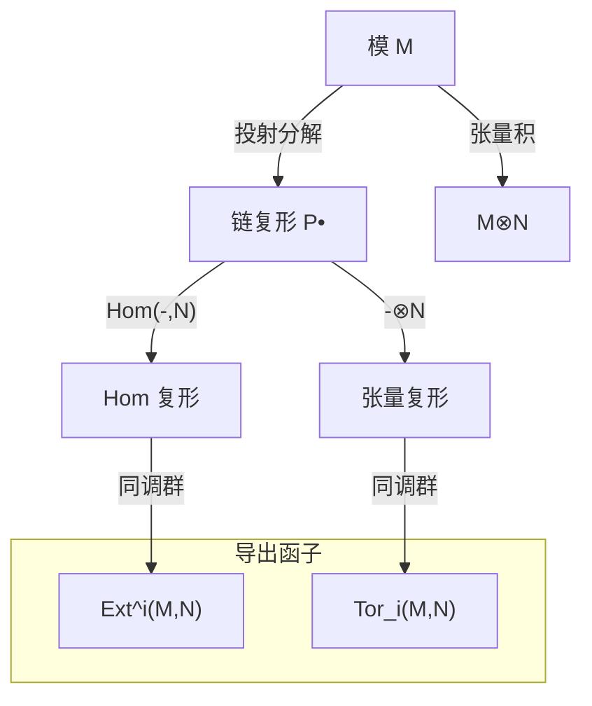

# 04-模的同调理论

## 1. 正合列与正合函子

### 1.1 正合列的定义

**定义**：一个模同态序列

$$\cdots \to M_{i-1} \xrightarrow{f_{i-1}} M_i \xrightarrow{f_i} M_{i+1} \to \cdots$$

如果对于每个 $i$，$\text{im}(f_{i-1}) = \ker(f_i)$，则称这个序列是**正合的**（Exact）。

特别地：

1. **短正合列**：形如 $0 \to A \xrightarrow{f} B \xrightarrow{g} C \to 0$ 的正合列，其中：
   - $f$ 是单同态（即 $\ker(f) = 0$）
   - $g$ 是满同态（即 $\text{im}(g) = C$）
   - $\text{im}(f) = \ker(g)$

2. **分裂短正合列**：如果短正合列 $0 \to A \xrightarrow{f} B \xrightarrow{g} C \to 0$ 满足以下等价条件之一，则称它是**分裂的**：
   - 存在同态 $h: B \to A$ 使得 $h \circ f = \text{id}_A$
   - 存在同态 $j: C \to B$ 使得 $g \circ j = \text{id}_C$
   - $B \cong A \oplus C$

### 1.2 正合函子

**定义**：设 $F$ 是从模范畴 $\mathcal{C}$ 到模范畴 $\mathcal{D}$ 的函子。如果对于任何正合列

$$A \xrightarrow{f} B \xrightarrow{g} C$$

在 $\mathcal{C}$ 中，映射后的序列

$$F(A) \xrightarrow{F(f)} F(B) \xrightarrow{F(g)} F(C)$$

在 $\mathcal{D}$ 中也是正合的，则称 $F$ 是**正合函子**。

**左正合函子**：如果 $F$ 保持正合性，但仅当原序列的形式是 $0 \to A \xrightarrow{f} B \xrightarrow{g} C$ 时，则称 $F$ 是**左正合函子**。

**右正合函子**：如果 $F$ 保持正合性，但仅当原序列的形式是 $A \xrightarrow{f} B \xrightarrow{g} C \to 0$ 时，则称 $F$ 是**右正合函子**。

### 1.3 重要的函子

1. **Hom 函子**：对于固定的模 $A$，函子 $\text{Hom}_R(A, -)$ 是左正合的，但一般不是右正合的。

2. **Hom 函子的对偶**：对于固定的模 $B$，函子 $\text{Hom}_R(-, B)$ 是左正合的，但一般不是右正合的。这里需要注意，由于 $\text{Hom}_R(-, B)$ 是反变函子，所以它将正合列 $A \xrightarrow{f} B \xrightarrow{g} C$ 变为 $\text{Hom}_R(C, B) \xrightarrow{g^*} \text{Hom}_R(B, B) \xrightarrow{f^*} \text{Hom}_R(A, B)$。

3. **张量函子**：对于固定的模 $A$，函子 $A \otimes_R -$ 是右正合的，但一般不是左正合的。

## 2. 投射分解与内射分解

### 2.1 投射分解

**定义**：一个模 $M$ 的**投射分解**是一个正合列

$$\cdots \to P_2 \xrightarrow{d_2} P_1 \xrightarrow{d_1} P_0 \xrightarrow{d_0} M \to 0$$

其中每个 $P_i$ 都是投射模。

如果这个序列是有限的，即存在 $n$ 使得 $P_i = 0$ 对所有 $i > n$，则称 $M$ 有**有限投射维数**，记为 $\text{pd}(M) = n$。

### 2.2 内射分解

**定义**：一个模 $M$ 的**内射分解**是一个正合列

$$0 \to M \xrightarrow{d^0} I^0 \xrightarrow{d^1} I^1 \xrightarrow{d^2} I^2 \to \cdots$$

其中每个 $I^i$ 都是内射模。

如果这个序列是有限的，即存在 $n$ 使得 $I^i = 0$ 对所有 $i > n$，则称 $M$ 有**有限内射维数**，记为 $\text{id}(M) = n$。

### 2.3 平坦分解

**定义**：一个模 $M$ 的**平坦分解**是一个正合列

$$\cdots \to F_2 \xrightarrow{d_2} F_1 \xrightarrow{d_1} F_0 \xrightarrow{d_0} M \to 0$$

其中每个 $F_i$ 都是平坦模。

如果这个序列是有限的，即存在 $n$ 使得 $F_i = 0$ 对所有 $i > n$，则称 $M$ 有**有限平坦维数**，记为 $\text{fd}(M) = n$。

### 2.4 分解的存在性

**定理**：

1. 任何模都有投射分解。
2. 任何模都有内射分解。
3. 任何模都有平坦分解。

这些结果是同调代数的基础，它们保证了导出函子的存在。

## 3. 导出函子

### 3.1 导出函子的定义

**定义**：设 $F$ 是一个加法函子。$F$ 的**右导出函子** $R^i F$ 定义如下：

对于模 $M$，取 $M$ 的内射分解

$$0 \to M \xrightarrow{d^0} I^0 \xrightarrow{d^1} I^1 \xrightarrow{d^2} I^2 \to \cdots$$

应用函子 $F$ 得到链复形

$$0 \to F(I^0) \xrightarrow{F(d^1)} F(I^1) \xrightarrow{F(d^2)} F(I^2) \to \cdots$$

则 $R^i F(M)$ 定义为这个链复形的第 $i$ 个同调群：

$$R^i F(M) = \ker(F(d^{i+1})) / \text{im}(F(d^i))$$

类似地，$F$ 的**左导出函子** $L_i F$ 定义如下：

对于模 $M$，取 $M$ 的投射分解

$$\cdots \to P_2 \xrightarrow{d_2} P_1 \xrightarrow{d_1} P_0 \xrightarrow{d_0} M \to 0$$

应用函子 $F$ 得到链复形

$$\cdots \to F(P_2) \xrightarrow{F(d_2)} F(P_1) \xrightarrow{F(d_1)} F(P_0) \to 0$$

则 $L_i F(M)$ 定义为这个链复形的第 $i$ 个同调群：

$$L_i F(M) = \ker(F(d_{i-1})) / \text{im}(F(d_i))$$

### 3.2 导出函子的性质

1. **零次导出函子**：对于任何加法函子 $F$，有 $R^0 F \cong F$ 和 $L_0 F \cong F$。

2. **长正合列**：如果 $0 \to A \to B \to C \to 0$ 是短正合列，则存在连接同态 $\delta$，使得以下序列是正合的：

   对于右导出函子：
   $$\cdots \to R^i F(A) \to R^i F(B) \to R^i F(C) \xrightarrow{\delta} R^{i+1} F(A) \to \cdots$$

   对于左导出函子：
   $$\cdots \to L_{i+1} F(C) \xrightarrow{\delta} L_i F(A) \to L_i F(B) \to L_i F(C) \to \cdots$$

3. **消失性质**：
   - 如果 $F$ 是正合函子，则对所有 $i > 0$，$R^i F = 0$ 和 $L_i F = 0$。
   - 如果 $P$ 是投射模，则对所有 $i > 0$ 和任何左正合函子 $F$，$L_i F(P) = 0$。
   - 如果 $I$ 是内射模，则对所有 $i > 0$ 和任何左正合函子 $F$，$R^i F(I) = 0$。

## 4. Ext 函子

### 4.1 Ext 函子的定义

**定义**：对于模 $A$ 和 $B$，$\text{Ext}_R^i(A, B)$ 定义为函子 $\text{Hom}_R(A, -)$ 在 $B$ 处的第 $i$ 个右导出函子：

$$\text{Ext}_R^i(A, B) = R^i \text{Hom}_R(A, -)(B)$$

等价地，$\text{Ext}_R^i(A, B)$ 也可以定义为函子 $\text{Hom}_R(-, B)$ 在 $A$ 处的第 $i$ 个右导出函子：

$$\text{Ext}_R^i(A, B) = R^i \text{Hom}_R(-, B)(A)$$

### 4.2 计算 Ext 的方法

1. **使用投射分解**：取 $A$ 的投射分解

   $$\cdots \to P_2 \xrightarrow{d_2} P_1 \xrightarrow{d_1} P_0 \xrightarrow{d_0} A \to 0$$

   应用函子 $\text{Hom}_R(-, B)$ 得到链复形

   $$0 \to \text{Hom}_R(A, B) \xrightarrow{d_0^*} \text{Hom}_R(P_0, B) \xrightarrow{d_1^*} \text{Hom}_R(P_1, B) \xrightarrow{d_2^*} \cdots$$

   则 $\text{Ext}_R^i(A, B)$ 是这个链复形的第 $i$ 个同调群。

2. **使用内射分解**：取 $B$ 的内射分解

   $$0 \to B \xrightarrow{d^0} I^0 \xrightarrow{d^1} I^1 \xrightarrow{d^2} I^2 \to \cdots$$

   应用函子 $\text{Hom}_R(A, -)$ 得到链复形

   $$0 \to \text{Hom}_R(A, B) \xrightarrow{\text{Hom}_R(A, d^0)} \text{Hom}_R(A, I^0) \xrightarrow{\text{Hom}_R(A, d^1)} \text{Hom}_R(A, I^1) \to \cdots$$

   则 $\text{Ext}_R^i(A, B)$ 是这个链复形的第 $i$ 个同调群。

### 4.3 Ext 函子的性质

1. **零次 Ext**：$\text{Ext}_R^0(A, B) \cong \text{Hom}_R(A, B)$。

2. **长正合列**：如果 $0 \to A' \to A \to A'' \to 0$ 是短正合列，则对于任意模 $B$，存在长正合列：

   $$0 \to \text{Hom}_R(A'', B) \to \text{Hom}_R(A, B) \to \text{Hom}_R(A', B) \to \text{Ext}_R^1(A'', B) \to \cdots$$

   类似地，如果 $0 \to B' \to B \to B'' \to 0$ 是短正合列，则对于任意模 $A$，存在长正合列：

   $$0 \to \text{Hom}_R(A, B') \to \text{Hom}_R(A, B) \to \text{Hom}_R(A, B'') \to \text{Ext}_R^1(A, B') \to \cdots$$

3. **消失性质**：
   - 如果 $P$ 是投射模，则对所有 $i > 0$ 和任意模 $B$，$\text{Ext}_R^i(P, B) = 0$。
   - 如果 $I$ 是内射模，则对所有 $i > 0$ 和任意模 $A$，$\text{Ext}_R^i(A, I) = 0$。

4. **维数关系**：对于模 $A$，$\text{pd}(A) = \sup\{i \mid \text{Ext}_R^i(A, -) \neq 0\}$。

### 4.4 Ext 的应用

1. **扩张问题**：$\text{Ext}_R^1(A, B)$ 对应于模 $B$ 通过 $A$ 的扩张的同构类。具体地，$\text{Ext}_R^1(A, B)$ 的元素对应于形如 $0 \to B \to E \to A \to 0$ 的短正合列的同构类。

2. **同调维数**：$\text{Ext}$ 函子用于定义投射维数、内射维数和全局维数。

3. **代数扩张**：在代数几何和数论中，$\text{Ext}$ 用于研究代数簇的形变和扩张。

## 5. Tor 函子

### 5.1 Tor 函子的定义

**定义**：对于模 $A$ 和 $B$，$\text{Tor}_i^R(A, B)$ 定义为函子 $A \otimes_R -$ 在 $B$ 处的第 $i$ 个左导出函子：

$$\text{Tor}_i^R(A, B) = L_i (A \otimes_R -)(B)$$

等价地，$\text{Tor}_i^R(A, B)$ 也可以定义为函子 $- \otimes_R B$ 在 $A$ 处的第 $i$ 个左导出函子：

$$\text{Tor}_i^R(A, B) = L_i (- \otimes_R B)(A)$$

### 5.2 计算 Tor 的方法

1. **使用投射分解**：取 $A$ 的投射分解

   $$\cdots \to P_2 \xrightarrow{d_2} P_1 \xrightarrow{d_1} P_0 \xrightarrow{d_0} A \to 0$$

   应用函子 $- \otimes_R B$ 得到链复形

   $$\cdots \to P_2 \otimes_R B \xrightarrow{d_2 \otimes \text{id}_B} P_1 \otimes_R B \xrightarrow{d_1 \otimes \text{id}_B} P_0 \otimes_R B \to 0$$

   则 $\text{Tor}_i^R(A, B)$ 是这个链复形的第 $i$ 个同调群。

2. **使用平坦分解**：取 $B$ 的平坦分解

   $$\cdots \to F_2 \xrightarrow{d_2} F_1 \xrightarrow{d_1} F_0 \xrightarrow{d_0} B \to 0$$

   应用函子 $A \otimes_R -$ 得到链复形

   $$\cdots \to A \otimes_R F_2 \xrightarrow{\text{id}_A \otimes d_2} A \otimes_R F_1 \xrightarrow{\text{id}_A \otimes d_1} A \otimes_R F_0 \to 0$$

   则 $\text{Tor}_i^R(A, B)$ 是这个链复形的第 $i$ 个同调群。

### 5.3 Tor 函子的性质

1. **零次 Tor**：$\text{Tor}_0^R(A, B) \cong A \otimes_R B$。

2. **长正合列**：如果 $0 \to A' \to A \to A'' \to 0$ 是短正合列，则对于任意模 $B$，存在长正合列：

   $$\cdots \to \text{Tor}_1^R(A', B) \to \text{Tor}_1^R(A, B) \to \text{Tor}_1^R(A'', B) \to A' \otimes_R B \to A \otimes_R B \to A'' \otimes_R B \to 0$$

   类似地，如果 $0 \to B' \to B \to B'' \to 0$ 是短正合列，则对于任意模 $A$，存在长正合列：

   $$\cdots \to \text{Tor}_1^R(A, B') \to \text{Tor}_1^R(A, B) \to \text{Tor}_1^R(A, B'') \to A \otimes_R B' \to A \otimes_R B \to A \otimes_R B'' \to 0$$

3. **消失性质**：
   - 如果 $P$ 是投射模，则对所有 $i > 0$ 和任意模 $B$，$\text{Tor}_i^R(P, B) = 0$。
   - 如果 $F$ 是平坦模，则对所有 $i > 0$ 和任意模 $A$，$\text{Tor}_i^R(A, F) = 0$。

4. **维数关系**：对于模 $A$，$\text{fd}(A) = \sup\{i \mid \text{Tor}_i^R(A, -) \neq 0\}$。

### 5.4 Tor 的应用

1. **平坦性判定**：模 $M$ 是平坦的当且仅当对所有 $i > 0$ 和任意模 $A$，$\text{Tor}_i^R(A, M) = 0$。

2. **张量积的精确性**：$\text{Tor}$ 函子用于研究张量积的精确性问题。

3. **代数拓扑**：在代数拓扑中，$\text{Tor}$ 函子用于计算空间的同调群。

## 6. 同调维数

### 6.1 模的同调维数

1. **投射维数**：模 $M$ 的投射维数 $\text{pd}(M)$ 是满足以下条件的最小整数 $n$（如果不存在这样的 $n$，则 $\text{pd}(M) = \infty$）：
   - 存在投射分解 $0 \to P_n \to \cdots \to P_1 \to P_0 \to M \to 0$。
   - 等价地，对所有 $i > n$ 和任意模 $N$，$\text{Ext}_R^i(M, N) = 0$。

2. **内射维数**：模 $M$ 的内射维数 $\text{id}(M)$ 是满足以下条件的最小整数 $n$（如果不存在这样的 $n$，则 $\text{id}(M) = \infty$）：
   - 存在内射分解 $0 \to M \to I^0 \to I^1 \to \cdots \to I^n \to 0$。
   - 等价地，对所有 $i > n$ 和任意模 $N$，$\text{Ext}_R^i(N, M) = 0$。

3. **平坦维数**：模 $M$ 的平坦维数 $\text{fd}(M)$ 是满足以下条件的最小整数 $n$（如果不存在这样的 $n$，则 $\text{fd}(M) = \infty$）：
   - 存在平坦分解 $0 \to F_n \to \cdots \to F_1 \to F_0 \to M \to 0$。
   - 等价地，对所有 $i > n$ 和任意模 $N$，$\text{Tor}_i^R(M, N) = 0$。

### 6.2 环的同调维数

1. **全局维数**：环 $R$ 的全局维数 $\text{gldim}(R)$ 是所有 $R$-模的投射维数的上确界：
   $$\text{gldim}(R) = \sup\{\text{pd}(M) \mid M \text{ 是 } R\text{-模}\}$$

2. **弱全局维数**：环 $R$ 的弱全局维数 $\text{w.gldim}(R)$ 是所有 $R$-模的平坦维数的上确界：
   $$\text{w.gldim}(R) = \sup\{\text{fd}(M) \mid M \text{ 是 } R\text{-模}\}$$

3. **内射维数**：环 $R$ 的内射维数 $\text{injdim}(R)$ 是 $R$ 作为 $R$-模的内射维数。

### 6.3 特殊环的同调维数

1. **正则环**：环 $R$ 是正则的当且仅当 $\text{gldim}(R) = 0$，即当且仅当每个 $R$-模都是投射的。

2. **遗传环**：环 $R$ 是遗传的当且仅当 $\text{gldim}(R) \leq 1$，即当且仅当每个 $R$-模的投射维数不超过 1。

3. **Gorenstein 环**：环 $R$ 是 Gorenstein 的当且仅当 $R$ 作为 $R$-模有有限内射维数，且 $\text{injdim}(R) = \text{injdim}(R^{op})$。

4. **Cohen-Macaulay 环**：在交换代数中，Cohen-Macaulay 环是满足特定深度条件的环，它们在同调维数理论中有重要应用。

## 7. 习题与思考

1. 证明：如果 $0 \to A \to B \to C \to 0$ 是短正合列，且 $C$ 是投射模，则这个短正合列是分裂的。

2. 证明：如果 $0 \to A \to B \to C \to 0$ 是短正合列，且 $A$ 是内射模，则这个短正合列是分裂的。

3. 计算 $\text{Ext}_{\mathbb{Z}}^i(\mathbb{Z}/n\mathbb{Z}, \mathbb{Z})$ 和 $\text{Ext}_{\mathbb{Z}}^i(\mathbb{Z}, \mathbb{Z}/n\mathbb{Z})$ 对所有 $i \geq 0$。

4. 计算 $\text{Tor}_i^{\mathbb{Z}}(\mathbb{Z}/m\mathbb{Z}, \mathbb{Z}/n\mathbb{Z})$ 对所有 $i \geq 0$，其中 $m$ 和 $n$ 是正整数。

5. 证明：环 $R$ 是诺特环当且仅当任何 $R$-模的直和是平坦的蕴含它是投射的。

## 参考文献

1. Weibel, C. A. (1994). *An Introduction to Homological Algebra*. Cambridge University Press.
2. Rotman, J. J. (2009). *An Introduction to Homological Algebra* (2nd ed.). Springer.
3. Cartan, H., & Eilenberg, S. (1956). *Homological Algebra*. Princeton University Press.
4. Mac Lane, S. (1995). *Homology*. Springer.
5. Hilton, P. J., & Stammbach, U. (1997). *A Course in Homological Algebra* (2nd ed.). Springer.
6. Osborne, M. S. (2000). *Basic Homological Algebra*. Springer.

---

**创建日期**: 2025-06-29
**最后更新**: 2025-06-29

## 8. 现代视角与多重表征

### 8.1 AI与自动化视角下的同调理论

- **自动定理证明**：同调代数的许多基本结论（如长正合列、Ext/Tor消失判据等）可在 Lean/Coq 等自动定理证明系统中形式化与自动验证。
- **AI知识表示**：同调理论为知识图谱中的"关系高阶结构"建模提供了范式，链复形可用于推理路径、因果链等的结构化表达。
- **认知科学**：同调理论的"分解-重组"思想与人类认知中的"模块化理解"高度契合。

#### 8.1.1 Lean 代码示例：链复形与同调群

```lean
import algebra.homology.homological_complex
import algebra.homology.homology

-- 定义链复形与同调群
variables {R : Type*} [ring R]
open category_theory

def my_complex : homological_complex (Module R) (complex_shape.up ℤ) := sorry

def H_n : Module R := homology my_complex n
```

#### 8.1.2 Rust 伪代码：链复形自动化

```rust
struct ChainComplex {
    differentials: Vec<Box<dyn Fn(&Vec<i32>) -> Vec<i32>>>,
}

fn homology(complex: &ChainComplex, n: usize) -> Vec<i32> {
    // 计算ker(d_n)/im(d_{n+1})
    todo!()
}
```

### 8.2 Mermaid 知识图谱：模的同调理论核心结构



### 8.3 表格对比：Ext、Tor、导出函子

| 性质/对象         | `Ext<sup>i</sup>(M,N)`         | `Tor<sub>i</sub>(M,N)`         | 导出函子 (`R<sup>i</sup>F`, `L<sub>i</sub>F`) |
|------------------|------------------------------|------------------------------|-------------------------------------------|
| 类型             | 右导出函子                   | 左导出函子                   | 右/左导出函子                             |
| 计算方式         | 投射/内射分解+Hom            | 投射/平坦分解+张量积          | 投射/内射/平坦分解+F                      |
| 零次同构         | Hom(M,N)                     | M⊗N                         | F                                         |
| 精确性反映       | Hom的非完全正合性            | 张量积的非完全正合性          | F的非完全正合性                           |
| 典型应用         | 模扩张、维数、形变            | 平坦性、拓扑同调、Künneth公式 | 代数、拓扑、范畴论                        |

### 8.4 现代应用案例

- **AI知识推理**：链复形和同调群可用于推理路径的高阶结构建模，提升AI系统的因果推理能力。
- **密码学**：同调代数在同源密码学、同调编码理论等领域有实际应用。
- **量子计算**：量子纠错码（如表面码）本质上利用了同调代数的链复形与同调群结构。
- **跨学科**：同调理论与拓扑数据分析（TDA）、复杂网络、认知科学等领域深度融合。

### 8.5 交叉引用与本地跳转

- 详见：[03-代数结构与理论/05-模论/01-模的定义与基本性质](01-模的定义与基本性质.md)
- 相关内容：[03-代数结构与理论/08-范畴论/01-范畴与态射](../../08-范畴论/01-范畴与态射.md)
- 相关内容：[03-代数结构与理论/03-环论/00-环论总览](../../03-环论/00-环论总览.md)
- 相关内容：[03-代数结构与理论/07-线性代数/01-向量空间基础](../../07-线性代数/01-向量空间基础.md)

---

**本节已递归扩展并补充现代内容。建议下一步递归扩展"特殊类型的模"或"模的张量积与直和"等分支，或根据需要继续深入同调理论的具体专题（如谱序、同调代数在拓扑/AI中的应用等）。**
