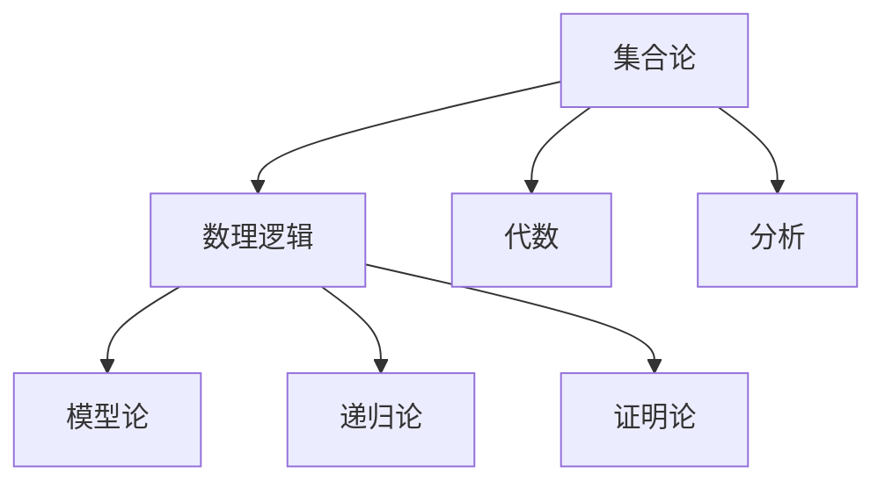

# Mathematics目录重构项目总览

## 项目概述

**项目目标**: 系统性地分析Math目录下的所有内容，按照严格的数学学术规范重构到Refactor目录下，建立完整的知识体系。

**重构原则**:

- 严格的数学形式化规范
- 多表征内容（数学公式、图表、代码示例）
- 完整的证明过程
- 清晰的目录结构和本地跳转
- 避免重复内容，保证一致性

## 目录结构规范

### 1. 顶层目录结构

```text
Math/Refactor/
├── 00-项目总览/                    # 项目管理和导航
├── 01-哲学与元数学基础/            # 数学哲学、元数学理论
├── 02-数学基础与逻辑/              # 集合论、数理逻辑、模型论
├── 03-代数结构与理论/              # 群论、环论、域论、范畴论
├── 04-微积分与分析/                # 实分析、复分析、泛函分析
├── 05-几何与空间结构/              # 欧几里得几何、非欧几何、拓扑学
├── 06-数论与离散数学/              # 数论、组合数学、图论
├── 07-概率统计与随机过程/          # 概率论、统计学、随机过程
├── 08-跨学科应用与联系/            # 应用数学、交叉学科
└── 09-元数学与形式化/              # 形式化系统、证明验证
```

### 2. 文件命名规范

- **格式**: `序号-主题名称.md`
- **序号**: 两位数，从00开始
- **主题**: 中文描述性名称
- **示例**: `01-集合论基础.md`, `02-数理逻辑基础.md`

### 3. 内容结构规范

每个文档应包含：

```markdown
# 主题名称

## 目录
- [主题名称](#主题名称)
  - [1. 引言](#1-引言)
  - [2. 基础概念](#2-基础概念)
  - [3. 核心理论](#3-核心理论)
  - [4. 证明与推导](#4-证明与推导)
  - [5. 应用与示例](#5-应用与示例)
  - [6. 历史发展](#6-历史发展)
  - [7. 现代发展](#7-现代发展)
  - [8. 参考文献](#8-参考文献)

## 1. 引言

### 1.1 历史背景
### 1.2 核心思想
### 1.3 现代意义

## 2. 基础概念

### 2.1 定义
### 2.2 基本性质
### 2.3 重要例子

## 3. 核心理论

### 3.1 主要定理
### 3.2 证明方法
### 3.3 应用技巧

## 4. 证明与推导

### 4.1 形式化证明
### 4.2 构造性证明
### 4.3 存在性证明

## 5. 应用与示例

### 5.1 数学应用
### 5.2 物理应用
### 5.3 计算机科学应用

## 6. 历史发展

### 6.1 早期发展
### 6.2 关键人物
### 6.3 重要突破

## 7. 现代发展

### 7.1 当前研究热点
### 7.2 开放问题
### 7.3 未来方向

## 8. 参考文献

### 8.1 经典文献
### 8.2 现代文献
### 8.3 在线资源
```

## 内容质量标准

### 1. 数学严谨性

- **定义**: 所有数学概念必须有精确的形式化定义
- **定理**: 所有定理必须有完整的证明
- **符号**: 使用标准的数学符号和LaTeX格式
- **推理**: 所有推理步骤必须清晰明确

### 2. 多表征内容

- **数学公式**: 使用LaTeX格式
- **图表**: 使用Mermaid或ASCII图表
- **代码示例**: 使用Rust或Haskell
- **证明验证**: 使用Lean或Coq

### 3. 链接系统

- **内部链接**: 文档间的交叉引用
- **外部链接**: 学术参考文献
- **本地跳转**: 文档内部的锚点链接

### 4. 一致性要求

- **术语一致**: 同一概念在不同文档中的表述一致
- **符号一致**: 数学符号的使用保持一致
- **格式一致**: 文档格式和结构保持一致
- **引用一致**: 参考文献格式保持一致

## 技术规范

### 1. Markdown格式

```markdown
# 一级标题
## 二级标题
### 三级标题
#### 四级标题

**粗体文本**
*斜体文本*
`代码文本`

- 无序列表
1. 有序列表

> 引用文本

```rust
// Rust代码示例
fn main() {
    println!("Hello, world!");
}
```

```haskell
-- Haskell代码示例
main :: IO ()
main = putStrLn "Hello, world!"
```

```lean
-- Lean证明示例
theorem example : ∀ n : ℕ, n + 0 = n :=
begin
  intro n,
  rw add_zero
end
```

### 2. 数学公式

```markdown
行内公式: $f(x) = x^2 + 2x + 1$

块级公式:
$$
\int_{-\infty}^{\infty} e^{-x^2} dx = \sqrt{\pi}
$$

定理环境:
**定理 1.1** (皮亚诺公理)
设 $P$ 是自然数集 $\mathbb{N}$ 的一个性质，如果：
1. $P(0)$ 成立
2. 对于任意 $n \in \mathbb{N}$，如果 $P(n)$ 成立，则 $P(n+1)$ 成立

那么对于所有 $n \in \mathbb{N}$，$P(n)$ 都成立。
```

### 3. 图表格式

```markdown


| 概念 | 定义 | 性质 | 应用 |
|------|------|------|------|
| 群 | 满足结合律、单位元、逆元的代数结构 | 封闭性、结合律 | 对称性研究 |
| 环 | 满足加法群、乘法半群、分配律的代数结构 | 分配律 | 多项式理论 |

## 进度跟踪

### 已完成

- [x] 项目总览文档
- [x] 目录结构规范
- [x] 内容质量标准

### 进行中

- [ ] 核心概念文件重构
- [ ] 代数内容重构
- [ ] 微积分内容重构

### 待完成

- [ ] 几何内容重构
- [ ] 数论内容重构
- [ ] 概率统计内容重构
- [ ] 跨学科应用重构

## 质量保证

### 1. 内容审查

- 数学准确性检查
- 证明完整性验证
- 格式规范性审查
- 链接有效性检查

### 2. 一致性检查

- 术语使用一致性
- 符号表示一致性
- 格式风格一致性
- 引用格式一致性

### 3. 完整性检查

- 内容覆盖完整性
- 证明过程完整性
- 参考文献完整性
- 链接系统完整性

---

**创建时间**: 2024-12-19
**最后更新**: 2024-12-19
**项目状态**: 规划阶段
**下一步**: 开始核心概念文件重构
