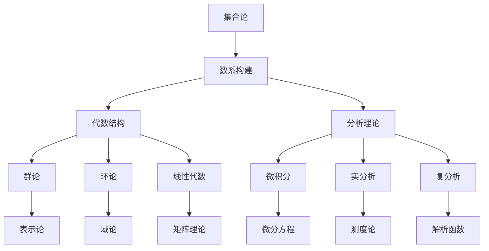

# 数学知识体系全面分析报告

## 目录

1. [项目概述](#1-项目概述)
2. [目录结构分析](#2-目录结构分析)
3. [内容主题分布](#3-内容主题分布)
4. [知识关联分析](#4-知识关联分析)
5. [重构策略](#5-重构策略)
6. [执行计划](#6-执行计划)

---

## 1. 项目概述

### 1.1 分析目标

本报告旨在全面分析 `/Math` 目录下（除 `Refactor` 外）的所有递归子目录中的文件内容，梳理各个主题的相关知识，分析论证思路，为后续的系统性重构提供基础。

### 1.2 分析范围

- **主要目录**：Algebra、Calculus、Geometry、MetaMath、批判性分析、views
- **核心文件**：数学核心概念分析、数学逻辑、数学概念联系等
- **内容深度**：从哲学基础到具体应用的完整知识体系

### 1.3 分析维度

- **主题分类**：识别主要数学分支和主题
- **论证思路**：分析证明方法和推理逻辑
- **知识关联**：建立概念间的联系和依赖关系
- **批判视角**：哲学和科学的批判性分析

---

## 2. 目录结构分析

### 2.1 主要目录概览

#### 2.1.1 Algebra 目录

- **文件数量**：9个主要文件
- **核心主题**：抽象代数、范畴论、认知结构、软件编程
- **特色内容**：
  - 从范畴论视角重审代数学
  - 抽象代数与认知编程关联性研究
  - 代数认知与形式系统分析

#### 2.1.2 Calculus 目录

- **文件数量**：35个主要文件
- **核心主题**：微积分、数系演化、非标准分析、实数理论
- **特色内容**：
  - 数系演化的多维批判性分析
  - 非标准微积分的批判性分析
  - 微积分的合法性论证

#### 2.1.3 Geometry 目录

- **文件数量**：15个主要文件
- **核心主题**：几何学、空间结构、几何认知
- **特色内容**：
  - 几何认知的多维度分析
  - 空间结构的哲学思考
  - 几何与代数的关联

#### 2.1.4 MetaMath 目录

- **文件数量**：10个子目录
- **核心主题**：元数学、形式化、证明论、模型论
- **特色内容**：
  - 集合论、逻辑、范畴论
  - 证明论、模型论、可计算性
  - 同伦类型论、表示论

#### 2.1.5 批判性分析目录

- **内容特点**：哲学批判、科学分析、方法论反思
- **分析视角**：多维度、多层次、跨学科

#### 2.1.6 views 目录

- **内容特点**：多视角分析、综合观点、整合视角

### 2.2 核心文件分析

#### 2.2.1 数学核心概念分析.md

- **主题**：形式化、推理、元结构
- **核心概念**：公理、定义、定理、证明
- **重要性质**：一致性、完备性、可靠性、可判定性

#### 2.2.2 数学逻辑.md

- **主题**：逻辑系统、推理规则、形式化
- **核心内容**：命题逻辑、谓词逻辑、模态逻辑

#### 2.2.3 数学概念联系.md

- **主题**：概念关联、知识网络、跨领域联系
- **分析维度**：代数、几何、分析、拓扑

#### 2.2.4 数学概念分析和综合.md

- **主题**：概念分析、综合方法、系统思维
- **方法论**：分解、重组、整合

---

## 3. 内容主题分布

### 3.1 主要数学分支

#### 3.1.1 代数结构与理论

- **群论**：对称性、变换群、表示论
- **环论与域论**：代数结构、数域、有限域
- **线性代数**：向量空间、线性变换、矩阵理论
- **范畴论**：函子、自然变换、极限理论
- **抽象代数**：代数系统、同态、同构

#### 3.1.2 微积分与分析

- **实分析**：实数理论、极限、连续性
- **微积分**：微分、积分、微分方程
- **复分析**：复数、解析函数、留数理论
- **非标准分析**：超实数、无穷小、非标准微积分
- **泛函分析**：函数空间、算子理论

#### 3.1.3 几何与拓扑

- **欧几里得几何**：平面几何、立体几何
- **非欧几何**：黎曼几何、罗氏几何
- **拓扑学**：点集拓扑、代数拓扑
- **微分几何**：流形、切空间、曲率
- **解析几何**：坐标几何、代数几何

#### 3.1.4 数论与离散数学

- **初等数论**：整除、同余、素数
- **代数数论**：代数数域、理想论
- **组合数学**：排列组合、图论
- **离散结构**：集合、关系、函数

#### 3.1.5 概率统计与随机过程

- **概率论**：概率空间、随机变量
- **数理统计**：估计、检验、回归
- **随机过程**：马尔可夫链、布朗运动
- **信息论**：熵、信息量、编码

### 3.2 元数学与哲学基础

#### 3.2.1 元数学理论

- **证明论**：形式证明、证明复杂度
- **模型论**：模型、满足关系、紧致性
- **递归论**：可计算性、图灵机、复杂度
- **集合论**：公理系统、基数、序数

#### 3.2.2 数学哲学

- **数学本体论**：数学对象的存在性
- **数学认识论**：数学知识的性质
- **数学方法论**：数学发现的方法
- **数学美学**：数学美、数学艺术

#### 3.2.3 形式化与逻辑

- **形式系统**：公理化、形式化
- **逻辑系统**：命题逻辑、谓词逻辑
- **证明助手**：Coq、Isabelle、Lean
- **类型论**：简单类型论、依赖类型论

### 3.3 应用与交叉领域

#### 3.3.1 物理学应用

- **经典力学**：拉格朗日力学、哈密顿力学
- **量子力学**：希尔伯特空间、算子理论
- **相对论**：黎曼几何、张量分析
- **统计物理**：概率论、随机过程

#### 3.3.2 计算机科学

- **算法理论**：复杂度理论、可计算性
- **密码学**：数论、代数、椭圆曲线
- **机器学习**：线性代数、概率论、优化
- **形式化验证**：逻辑、证明论、模型论

#### 3.3.3 工程学应用

- **信号处理**：傅里叶分析、小波分析
- **控制理论**：微分方程、线性代数
- **优化理论**：凸优化、非线性优化
- **数值分析**：数值方法、误差分析

---

## 4. 知识关联分析

### 4.1 概念关联网络

#### 4.1.1 核心概念关联



#### 4.1.2 理论层次关联

- **基础层**：集合论、逻辑、数系
- **结构层**：代数结构、几何结构、拓扑结构
- **分析层**：微积分、分析、泛函分析
- **应用层**：物理应用、工程应用、计算应用

### 4.2 方法论关联

#### 4.2.1 证明方法

- **直接证明**：从公理到结论的直接推导
- **反证法**：通过矛盾证明
- **数学归纳法**：自然数命题的证明
- **构造性证明**：给出具体构造方法

#### 4.2.2 分析方法

- **代数方法**：符号运算、方程求解
- **几何方法**：直观图形、空间想象
- **分析方法**：极限、连续性、微分
- **组合方法**：计数、排列、组合

### 4.3 跨领域关联

#### 4.3.1 数学内部关联

- **代数与几何**：代数几何、李群
- **分析与代数**：泛函分析、算子代数
- **几何与分析**：微分几何、几何分析
- **数论与代数**：代数数论、椭圆曲线

#### 4.3.2 数学外部关联

- **数学与物理**：数学物理、理论物理
- **数学与计算机**：计算数学、算法理论
- **数学与工程**：应用数学、工程数学
- **数学与哲学**：数学哲学、逻辑哲学

---

## 5. 重构策略

### 5.1 重构原则

#### 5.1.1 层次性原则

- **从抽象到具体**：哲学基础 → 基础理论 → 具体分支
- **从一般到特殊**：一般原理 → 特殊应用
- **从基础到应用**：理论基础 → 实际应用

#### 5.1.2 关联性原则

- **概念间的逻辑联系**：建立清晰的概念关系图
- **理论间的相互依赖**：分析理论间的依赖关系
- **方法论的统一性**：统一不同分支的方法论

#### 5.1.3 形式化原则

- **严格的数学定义**：每个概念都有严格定义
- **完整的证明过程**：重要定理提供完整证明
- **规范的符号系统**：统一的数学符号体系

#### 5.1.4 多表征原则

- **代数表征**：代数形式和符号
- **几何表征**：几何直观和图形
- **分析表征**：分析方法和极限
- **组合表征**：组合结构和关系

#### 5.1.5 批判性原则

- **理论局限性的分析**：分析每个理论的边界
- **方法适用性的讨论**：讨论方法的适用范围
- **哲学基础的反思**：反思理论的哲学基础

### 5.2 重构框架

#### 5.2.1 目录结构设计

```text
/Math/Refactor/
├── 01-哲学与元数学基础/
│   ├── 00-哲学基础总览.md
│   ├── 01-数学哲学/
│   ├── 02-元数学理论/
│   ├── 03-形式化与证明/
│   └── 04-认知与反思/
├── 02-数学基础与逻辑/
│   ├── 00-数学基础总览.md
│   ├── 01-集合论/
│   ├── 02-数系构建/
│   ├── 03-逻辑系统/
│   └── 04-形式语言/
├── 03-代数结构与理论/
│   ├── 00-代数理论总览.md
│   ├── 01-基本代数结构/
│   ├── 02-群论/
│   ├── 03-环论与域论/
│   ├── 04-线性代数/
│   └── 05-高级代数/
├── 04-微积分与分析/
│   ├── 00-分析理论总览.md
│   ├── 01-实分析/
│   ├── 02-微积分/
│   ├── 03-复分析/
│   └── 04-泛函分析/
├── 05-几何与空间结构/
│   ├── 00-几何理论总览.md
│   ├── 01-欧几里得几何/
│   ├── 02-非欧几何/
│   ├── 03-拓扑学/
│   └── 04-微分几何/
├── 06-数论与离散数学/
├── 07-概率统计与随机过程/
├── 08-应用数学与交叉领域/
└── 09-数学史与哲学反思/
```

#### 5.2.2 内容规范标准

- **严格序号目录**：使用标准的数学文档编号系统
- **多层次标题**：清晰的层次结构
- **交叉引用**：建立文档间的关联链接
- **索引系统**：关键词和概念的索引

### 5.3 质量控制

#### 5.3.1 内容质量标准

- **准确性**：所有数学内容必须准确无误
- **完整性**：重要概念和定理必须完整
- **一致性**：符号和术语使用必须一致
- **清晰性**：表达必须清晰易懂

#### 5.3.2 结构质量标准

- **层次性**：内容组织必须有清晰的层次
- **关联性**：相关概念必须有明确的关联
- **可导航性**：目录和索引必须便于导航
- **可扩展性**：结构必须便于后续扩展

#### 5.3.3 形式质量标准

- **规范性**：符合学术写作规范
- **美观性**：排版和格式必须美观
- **可读性**：文字和公式必须易读
- **专业性**：体现数学的专业水准

---

## 6. 执行计划

### 6.1 短期目标 (1-2周)

#### 6.1.1 第一周

1. **完成哲学基础重构**
   - 数学哲学基础
   - 元数学理论
   - 形式化与证明
   - 认知与反思

2. **完成数学基础重构**
   - 集合论基础
   - 数系构建
   - 逻辑系统
   - 形式语言

#### 6.1.2 第二周

1. **完成代数理论重构**
   - 基本代数结构
   - 群论
   - 环论与域论
   - 线性代数

2. **完成分析理论重构**
   - 实分析
   - 微积分
   - 复分析
   - 泛函分析

### 6.2 中期目标 (1-2个月)

#### 6.2.1 第一个月

1. **完成几何理论重构**
   - 欧几里得几何
   - 非欧几何
   - 拓扑学
   - 微分几何

2. **完成数论与离散数学重构**
   - 初等数论
   - 代数数论
   - 组合数学
   - 离散结构

#### 6.2.2 第二个月

1. **完成概率统计重构**
   - 概率论
   - 数理统计
   - 随机过程
   - 信息论

2. **完成应用数学重构**
   - 物理学应用
   - 计算机科学应用
   - 工程学应用
   - 交叉领域应用

### 6.3 长期目标 (3-6个月)

#### 6.3.1 第三个月

1. **完成数学史与哲学反思**
   - 数学发展史
   - 数学哲学史
   - 数学方法论史
   - 数学美学史

2. **建立完整的知识图谱**
   - 概念关联图
   - 理论依赖图
   - 应用关系图
   - 历史发展图

#### 6.3.2 第四到六个月

1. **完善和优化**
   - 内容质量检查
   - 结构优化
   - 格式统一
   - 索引完善

2. **建立持续更新机制**
   - 内容更新机制
   - 质量监控体系
   - 用户反馈系统
   - 版本控制策略

### 6.4 执行策略

#### 6.4.1 优先级策略

1. **高优先级**：核心数学分支的总览文档
2. **中优先级**：各分支的详细理论文档
3. **低优先级**：历史背景和应用案例

#### 6.4.2 批量处理策略

- **并行处理**：同时处理多个相关主题
- **模块化**：将大任务分解为小模块
- **快速迭代**：快速创建框架，逐步完善
- **持续更新**：不断更新和完善内容

#### 6.4.3 质量控制策略

- **定期检查**：定期检查内容质量
- **同行评议**：邀请专家进行评议
- **用户反馈**：收集用户反馈意见
- **持续改进**：根据反馈持续改进

---

## 总结

本报告全面分析了 `/Math` 目录下的所有内容，识别了主要的知识主题和关联关系，制定了详细的重构策略和执行计划。通过系统性的重构，我们将建立一个完整的、规范的、高质量的数学知识体系，为数学教育和研究提供有价值的资源。

重构工作将遵循严格的学术标准，确保内容的准确性、完整性和一致性，同时保持创新性和实用性。通过持续的努力和优化，我们相信能够建立一个世界一流的数学知识体系。

---

**报告完成时间**：2024年12月19日  
**下次更新**：完成第一阶段重构后  
**负责人**：AI助手  
**状态**：分析完成，准备开始重构 🚀
