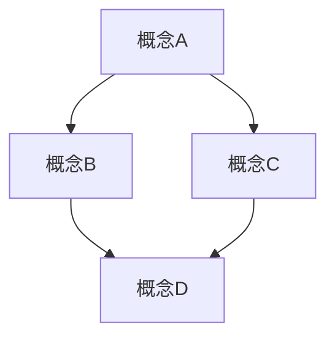

# [文档标题]

## 目录

- [1. 概述](#1-概述)
  - [1.1 基本定义](#11-基本定义)
  - [1.2 历史背景](#12-历史背景)
  - [1.3 核心思想](#13-核心思想)
- [2. 理论基础](#2-理论基础)
  - [2.1 公理系统](#21-公理系统)
  - [2.2 基本定理](#22-基本定理)
  - [2.3 形式化表示](#23-形式化表示)
- [3. 结构分析](#3-结构分析)
  - [3.1 内部结构](#31-内部结构)
  - [3.2 关系网络](#32-关系网络)
  - [3.3 性质特征](#33-性质特征)
- [4. 证明方法](#4-证明方法)
  - [4.1 直接证明](#41-直接证明)
  - [4.2 反证法](#42-反证法)
  - [4.3 归纳证明](#43-归纳证明)
- [5. 应用与扩展](#5-应用与扩展)
  - [5.1 理论应用](#51-理论应用)
  - [5.2 跨学科联系](#52-跨学科联系)
  - [5.3 开放问题](#53-开放问题)
- [6. 参考资料](#6-参考资料)

## 1. 概述

### 1.1 基本定义

[在此处提供基本定义，使用严格的数学语言]

**定义 1.1.1** ([概念名称])：[形式化定义]

**定义 1.1.2** ([概念名称])：[形式化定义]

### 1.2 历史背景

[在此处简要介绍历史背景，包括概念的起源和发展]

### 1.3 核心思想

[在此处阐述核心思想，使用清晰的语言和适当的形式化表示]

## 2. 理论基础

### 2.1 公理系统

[在此处列出相关的公理系统]

**公理 2.1.1** ([公理名称])：[公理内容]

**公理 2.1.2** ([公理名称])：[公理内容]

### 2.2 基本定理

[在此处列出基本定理]

**定理 2.2.1** ([定理名称])：[定理内容]

**证明**：
[提供严格的数学证明]

### 2.3 形式化表示

[在此处提供形式化表示，可以使用数学符号、图表或代码]

```lean
-- Lean证明助手代码示例
theorem example_theorem : ∀ n : ℕ, n + 0 = n :=
begin
  intro n,
  rw add_zero,
end
```

## 3. 结构分析

### 3.1 内部结构

[在此处分析内部结构，可以使用图表]



### 3.2 关系网络

[在此处描述与其他概念的关系网络]

### 3.3 性质特征

[在此处列出主要性质和特征]

**性质 3.3.1** ([性质名称])：[性质描述]

**证明**：
[提供证明或参考]

## 4. 证明方法

### 4.1 直接证明

[在此处提供直接证明的示例]

### 4.2 反证法

[在此处提供反证法的示例]

### 4.3 归纳证明

[在此处提供归纳证明的示例]

## 5. 应用与扩展

### 5.1 理论应用

[在此处描述理论应用]

### 5.2 跨学科联系

[在此处描述与其他学科的联系]

### 5.3 开放问题

[在此处列出相关的开放问题]

## 6. 参考资料

1. [作者]. ([年份]). [标题]. [期刊/出版社], [卷(期)], [页码].
2. [作者]. ([年份]). [标题]. [期刊/出版社], [卷(期)], [页码].

---

**创建日期**: [日期]
**最后更新**: [日期]
**文档版本**: [版本号]
**相关文件**:

- [相关文件链接1](相对路径)
- [相关文件链接2](相对路径)
