# 07-应用与交叉学科

## 目录

- [07-应用与交叉学科](#07-应用与交叉学科)
  - [目录](#目录)
  - [1. 计算机科学中的应用](#1-计算机科学中的应用)
    - [1.1 编程语言理论](#11-编程语言理论)
    - [1.2 程序验证与形式化方法](#12-程序验证与形式化方法)
    - [1.3 自动定理证明](#13-自动定理证明)
    - [1.4 逻辑编程](#14-逻辑编程)
  - [2. 人工智能中的应用](#2-人工智能中的应用)
    - [2.1 知识表示与推理](#21-知识表示与推理)
    - [2.2 规划与专家系统](#22-规划与专家系统)
    - [2.3 可解释AI与神经符号方法](#23-可解释ai与神经符号方法)
    - [2.4 现代AI与自动化逻辑推理补充](#24-现代ai与自动化逻辑推理补充)
  - [3. 数据库与信息系统](#3-数据库与信息系统)
    - [3.1 关系代数与关系演算](#31-关系代数与关系演算)
    - [3.2 查询语言的逻辑基础](#32-查询语言的逻辑基础)
  - [4. 语言学与认知科学](#4-语言学与认知科学)
    - [4.1 形式语言理论](#41-形式语言理论)
    - [4.2 语义学与模型论方法](#42-语义学与模型论方法)
  - [5. 其他交叉领域](#5-其他交叉领域)
    - [5.1 数学其他分支中的应用](#51-数学其他分支中的应用)
    - [5.2 物理学、生物学中的形式模型](#52-物理学生物学中的形式模型)
  - [6. 代码与多表征示例](#6-代码与多表征示例)
    - [6.1 Rust实现：算法复杂度分析与图论算法](#61-rust实现算法复杂度分析与图论算法)
  - [7. 本地跳转与引用](#7-本地跳转与引用)
    - [7.1 自动定理证明与形式化验证](#71-自动定理证明与形式化验证)
      - [7.1.1 核心理论与体系](#711-核心理论与体系)
        - [7.1.1.1 自动定理证明（ATP）基本原理](#7111-自动定理证明atp基本原理)
        - [7.1.1.2 形式系统与形式化证明](#7112-形式系统与形式化证明)
        - [7.1.1.3 一阶逻辑、归结法、SAT/SMT等自动推理基础](#7113-一阶逻辑归结法satsmt等自动推理基础)
        - [7.1.1.4 主流证明助手与工具](#7114-主流证明助手与工具)
        - [7.1.1.5 形式化验证的应用](#7115-形式化验证的应用)
      - [7.1.2 典型算法与推理机制](#712-典型算法与推理机制)
        - [7.1.2.1 归结法（Resolution）](#7121-归结法resolution)
        - [7.1.2.2 归约与重写系统](#7122-归约与重写系统)
        - [7.1.2.3 SAT/SMT求解](#7123-satsmt求解)
        - [7.1.2.4 自动证明中的搜索策略](#7124-自动证明中的搜索策略)
      - [7.1.3 代码与多表征](#713-代码与多表征)
        - [7.1.3.1 典型自动证明代码片段](#7131-典型自动证明代码片段)
        - [7.1.3.2 结构图/知识图谱（Mermaid等）](#7132-结构图知识图谱mermaid等)
      - [7.1.4 典型案例与应用场景](#714-典型案例与应用场景)
      - [7.1.5 批判性分析与前沿展望](#715-批判性分析与前沿展望)
      - [7.1.6 交叉引用与知识图谱化建议](#716-交叉引用与知识图谱化建议)
      - [7.1.7 案例与实操：自动定理证明深度实践](#717-案例与实操自动定理证明深度实践)
        - [7.1.7.1 经典定理自动证明流程（以皮亚诺公理下加法交换律为例）](#7171-经典定理自动证明流程以皮亚诺公理下加法交换律为例)
        - [7.1.7.2 Lean自动证明代码示例](#7172-lean自动证明代码示例)
        - [7.1.7.3 Coq自动证明代码示例](#7173-coq自动证明代码示例)
        - [7.1.7.4 Prolog归结推理示例](#7174-prolog归结推理示例)
        - [7.1.7.5 Mermaid结构图：自动定理证明流程](#7175-mermaid结构图自动定理证明流程)
        - [7.1.7.6 结构化批判与实用建议](#7176-结构化批判与实用建议)
    - [7.2 知识表示、知识图谱与本体论](#72-知识表示知识图谱与本体论)
      - [7.2.1 核心理论与体系](#721-核心理论与体系)
        - [7.2.1.1 知识表示的目标与意义](#7211-知识表示的目标与意义)
        - [7.2.1.2 主要知识表示方法](#7212-主要知识表示方法)
        - [7.2.1.3 知识图谱（Knowledge Graph）](#7213-知识图谱knowledge-graph)
      - [7.2.2 典型算法与推理机制](#722-典型算法与推理机制)
        - [7.2.2.1 逻辑推理](#7221-逻辑推理)
        - [7.2.2.2 语义推理与本体推理](#7222-语义推理与本体推理)
        - [7.2.2.3 知识图谱的构建与融合](#7223-知识图谱的构建与融合)
        - [7.2.2.4 结构化查询与推理](#7224-结构化查询与推理)
      - [7.2.3 代码与多表征](#723-代码与多表征)
        - [7.2.3.1 Prolog知识库示例](#7231-prolog知识库示例)
        - [7.2.3.2 RDF三元组与SPARQL查询](#7232-rdf三元组与sparql查询)
        - [7.2.3.3 Mermaid知识图谱结构图](#7233-mermaid知识图谱结构图)
        - [7.2.3.4 OWL本体片段](#7234-owl本体片段)
        - [7.2.3.5 知识图谱应用表格](#7235-知识图谱应用表格)
      - [7.2.4 典型案例与应用场景](#724-典型案例与应用场景)
      - [7.2.5 批判性分析与前沿展望](#725-批判性分析与前沿展望)
      - [7.2.6 交叉引用与知识图谱化建议](#726-交叉引用与知识图谱化建议)
      - [7.2.7 案例与实操：知识图谱与本体论深度实践](#727-案例与实操知识图谱与本体论深度实践)
        - [7.2.7.1 实际知识图谱构建流程（以学术领域为例）](#7271-实际知识图谱构建流程以学术领域为例)
        - [7.2.7.2 RDF/OWL/SPARQL实操代码](#7272-rdfowlsparql实操代码)
        - [7.2.7.3 Mermaid结构图：知识图谱实体关系](#7273-mermaid结构图知识图谱实体关系)
        - [7.2.7.4 结构化批判与实用建议](#7274-结构化批判与实用建议)
    - [7.3 逻辑编程与类型理论](#73-逻辑编程与类型理论)
      - [7.3.1 核心理论与体系](#731-核心理论与体系)
        - [7.3.1.1 逻辑编程的基本原理](#7311-逻辑编程的基本原理)
        - [7.3.1.2 类型理论的基本原理](#7312-类型理论的基本原理)
        - [7.3.1.3 逻辑与类型的统一视角](#7313-逻辑与类型的统一视角)
      - [7.3.2 典型算法与推理机制](#732-典型算法与推理机制)
        - [7.3.2.1 归结推理与模式匹配](#7321-归结推理与模式匹配)
        - [7.3.2.2 类型推断与类型检查](#7322-类型推断与类型检查)
        - [7.3.2.3 依赖类型与证明自动化](#7323-依赖类型与证明自动化)
      - [7.3.3 代码与多表征](#733-代码与多表征)
        - [7.3.3.1 Prolog逻辑编程示例](#7331-prolog逻辑编程示例)
        - [7.3.3.2 Haskell类型与模式匹配示例](#7332-haskell类型与模式匹配示例)
        - [7.3.3.3 Lean依赖类型与定理证明示例](#7333-lean依赖类型与定理证明示例)
        - [7.3.3.4 Mermaid结构图：逻辑编程与类型理论关系](#7334-mermaid结构图逻辑编程与类型理论关系)
        - [7.3.3.5 主要语言与工具对比表格](#7335-主要语言与工具对比表格)
      - [7.3.4 典型案例与应用场景](#734-典型案例与应用场景)
      - [7.3.5 批判性分析与前沿展望](#735-批判性分析与前沿展望)
      - [7.3.6 交叉引用与知识图谱化建议](#736-交叉引用与知识图谱化建议)
      - [7.3.7 案例与实操：逻辑编程与类型理论深度实践](#737-案例与实操逻辑编程与类型理论深度实践)
        - [7.3.7.1 经典问题建模与逻辑编程实操（以家谱推理为例）](#7371-经典问题建模与逻辑编程实操以家谱推理为例)
        - [7.3.7.2 类型推断与模式匹配实操（Haskell示例）](#7372-类型推断与模式匹配实操haskell示例)
        - [7.3.7.3 依赖类型与定理证明实操（Lean示例）](#7373-依赖类型与定理证明实操lean示例)
        - [7.3.7.4 Mermaid结构图：逻辑编程与类型推断流程](#7374-mermaid结构图逻辑编程与类型推断流程)
        - [7.3.7.5 结构化批判与实用建议](#7375-结构化批判与实用建议)
    - [7.4 AI认知、神经符号与推理机制](#74-ai认知神经符号与推理机制)
      - [7.4.1 核心理论与体系](#741-核心理论与体系)
        - [7.4.1.1 AI认知建模的基本原理](#7411-ai认知建模的基本原理)
        - [7.4.1.2 神经符号AI的理论基础](#7412-神经符号ai的理论基础)
        - [7.4.1.3 推理机制与认知推理](#7413-推理机制与认知推理)
      - [7.4.2 典型算法与系统架构](#742-典型算法与系统架构)
        - [7.4.2.1 神经符号推理算法](#7421-神经符号推理算法)
        - [7.4.2.2 认知架构与推理引擎](#7422-认知架构与推理引擎)
        - [7.4.2.3 神经符号AI的应用框架](#7423-神经符号ai的应用框架)
      - [7.4.3 代码与多表征](#743-代码与多表征)
        - [7.4.3.1 神经符号推理伪代码（Python风格）](#7431-神经符号推理伪代码python风格)
        - [7.4.3.2 Mermaid结构图：神经符号AI系统架构](#7432-mermaid结构图神经符号ai系统架构)
        - [7.4.3.3 神经符号AI主要模型对比表格](#7433-神经符号ai主要模型对比表格)
      - [7.4.4 典型案例与应用场景](#744-典型案例与应用场景)
      - [7.4.5 批判性分析与前沿展望](#745-批判性分析与前沿展望)
      - [7.4.6 交叉引用与知识图谱化建议](#746-交叉引用与知识图谱化建议)
      - [7.4.7 案例与实操：AI认知、神经符号与推理机制深度实践](#747-案例与实操ai认知神经符号与推理机制深度实践)
        - [7.4.7.1 神经符号推理系统实操（DeepProbLog示例）](#7471-神经符号推理系统实操deepproblog示例)
        - [7.4.7.2 认知架构应用（ACT-R模型）](#7472-认知架构应用act-r模型)
        - [7.4.7.3 Mermaid结构图：神经符号AI推理流程](#7473-mermaid结构图神经符号ai推理流程)
        - [7.4.7.4 结构化批判与实用建议](#7474-结构化批判与实用建议)
    - [7.5 跨学科应用与前沿创新](#75-跨学科应用与前沿创新)
      - [7.5.1 核心理论与体系](#751-核心理论与体系)
        - [7.5.1.1 数理逻辑与AI在跨学科中的桥梁作用](#7511-数理逻辑与ai在跨学科中的桥梁作用)
        - [7.5.1.2 主要跨学科应用领域](#7512-主要跨学科应用领域)
      - [7.5.2 典型方法与系统架构](#752-典型方法与系统架构)
        - [7.5.2.1 形式化建模与自动推理](#7521-形式化建模与自动推理)
        - [7.5.2.2 知识图谱与多模态融合](#7522-知识图谱与多模态融合)
        - [7.5.2.3 AI驱动的科学发现与创新](#7523-ai驱动的科学发现与创新)
      - [7.5.3 代码与多表征](#753-代码与多表征)
        - [7.5.3.1 领域知识形式化建模示例（物理定律Prolog）](#7531-领域知识形式化建模示例物理定律prolog)
        - [7.5.3.2 Mermaid结构图：跨学科知识融合与推理](#7532-mermaid结构图跨学科知识融合与推理)
        - [7.5.3.3 跨学科AI应用对比表格](#7533-跨学科ai应用对比表格)
      - [7.5.4 典型案例与应用场景](#754-典型案例与应用场景)
      - [7.5.5 批判性分析与前沿展望](#755-批判性分析与前沿展望)
      - [7.5.6 交叉引用与知识图谱化建议](#756-交叉引用与知识图谱化建议)
    - [7.6 认知、教育与AI驱动的数学创新](#76-认知教育与ai驱动的数学创新)
      - [7.6.1 核心理论与体系](#761-核心理论与体系)
        - [7.6.1.1 数学认知的理论基础](#7611-数学认知的理论基础)
        - [7.6.1.2 数学教育的现代理念](#7612-数学教育的现代理念)
        - [7.6.1.3 AI驱动的数学创新](#7613-ai驱动的数学创新)
      - [7.6.2 典型方法与系统架构](#762-典型方法与系统架构)
        - [7.6.2.1 数学认知建模与智能辅导](#7621-数学认知建模与智能辅导)
        - [7.6.2.2 多表征与可操作性教学](#7622-多表征与可操作性教学)
        - [7.6.2.3 AI辅助数学创新平台](#7623-ai辅助数学创新平台)
      - [7.6.3 代码与多表征](#763-代码与多表征)
        - [7.6.3.1 智能认知诊断伪代码（Python风格）](#7631-智能认知诊断伪代码python风格)
        - [7.6.3.2 Mermaid结构图：AI驱动的数学认知与创新体系](#7632-mermaid结构图ai驱动的数学认知与创新体系)
        - [7.6.3.3 数学教育与AI创新应用对比表格](#7633-数学教育与ai创新应用对比表格)
      - [7.6.4 典型案例与应用场景](#764-典型案例与应用场景)
      - [7.6.5 批判性分析与前沿展望](#765-批判性分析与前沿展望)
      - [7.6.6 交叉引用与知识图谱化建议](#766-交叉引用与知识图谱化建议)
      - [7.6.7 案例与实操：认知、教育与AI驱动的数学创新深度实践](#767-案例与实操认知教育与ai驱动的数学创新深度实践)
        - [7.6.7.1 智能辅导系统实操（认知诊断与个性化推荐）](#7671-智能辅导系统实操认知诊断与个性化推荐)
        - [7.6.7.2 AI创新题库与自动定理证明实操](#7672-ai创新题库与自动定理证明实操)
        - [7.6.7.3 认知建模与多表征教学实操](#7673-认知建模与多表征教学实操)
        - [7.6.7.4 结构化批判与实用建议](#7674-结构化批判与实用建议)
    - [7.7 批判性分析与未来展望](#77-批判性分析与未来展望)
      - [7.7.1 批判性分析：优势与局限](#771-批判性分析优势与局限)
        - [7.7.1.1 统一性与系统性优势](#7711-统一性与系统性优势)
        - [7.7.1.2 局限与挑战](#7712-局限与挑战)
      - [7.7.2 前沿趋势与未来展望](#772-前沿趋势与未来展望)
        - [7.7.2.1 大模型与神经符号AI的融合](#7721-大模型与神经符号ai的融合)
        - [7.7.2.2 自动本体学习与知识进化](#7722-自动本体学习与知识进化)
        - [7.7.2.3 人机协作与共证创新](#7723-人机协作与共证创新)
        - [7.7.2.4 认知与教育的智能化转型](#7724-认知与教育的智能化转型)
      - [7.7.3 多表征与知识图谱化全局结构](#773-多表征与知识图谱化全局结构)
        - [7.7.3.1 Mermaid全局知识图谱结构图](#7731-mermaid全局知识图谱结构图)
        - [7.7.3.2 主题交叉与创新能力对比表格](#7732-主题交叉与创新能力对比表格)
      - [7.7.4 未来研究与实践建议](#774-未来研究与实践建议)
      - [7.7.5 交叉引用与知识图谱化建议](#775-交叉引用与知识图谱化建议)
  - [8. 全局导航与主题跳转指引](#8-全局导航与主题跳转指引)
    - [8.1 主题结构总览](#81-主题结构总览)
    - [8.2 Mermaid全局主题导航结构图](#82-mermaid全局主题导航结构图)
    - [8.3 主题交叉引用与跳转表](#83-主题交叉引用与跳转表)
    - [8.4 主题间跳转与知识图谱化建议](#84-主题间跳转与知识图谱化建议)
    - [8.5 主题导航示例区块（可嵌入各分支结尾）](#85-主题导航示例区块可嵌入各分支结尾)
    - [8.6 主题关系映射表](#86-主题关系映射表)
    - [8.7 分支间知识流动结构图（Mermaid）](#87-分支间知识流动结构图mermaid)
      - [7.5.7 案例与实操：跨学科应用与前沿创新深度实践](#757-案例与实操跨学科应用与前沿创新深度实践)
        - [7.5.7.1 跨学科AI应用实例（医学知识图谱辅助诊断）](#7571-跨学科ai应用实例医学知识图谱辅助诊断)
        - [7.5.7.2 知识融合与多模态推理流程](#7572-知识融合与多模态推理流程)
        - [7.5.7.3 结构化批判与实用建议](#7573-结构化批判与实用建议)

---

## 1. 计算机科学中的应用

### 1.1 编程语言理论

- 形式语义、类型系统、语言设计
- **类型理论**：简单类型λ演算的类型规则：

$$
\frac{\Gamma, x:A \vdash t:B}{\Gamma \vdash \lambda x.t : A \rightarrow B}
$$

### 1.2 程序验证与形式化方法

- 形式化规范、模型检测、定理证明器
- **霍尔逻辑**：霍尔三元组 $\{P\} C \{Q\}$ 表示：如果前置条件 $P$ 成立，执行程序 $C$ 后，后置条件 $Q$ 成立。
- **赋值公理**：

$$
\{P[E/x]\} x := E \{P\}
$$

### 1.3 自动定理证明

- 机器辅助证明、自动化推理
- 典型工具：Coq、Lean、Isabelle、SAT/SMT求解器

### 1.4 逻辑编程

- Prolog等基于逻辑的编程范式
- 逻辑推理引擎、归结原理

---

## 2. 人工智能中的应用

### 2.1 知识表示与推理

- 逻辑知识库、自动推理、专家系统等。

### 2.2 规划与专家系统

- 自动规划、决策支持、智能系统等。

### 2.3 可解释AI与神经符号方法

- 神经符号AI、可解释性、混合推理等。

### 2.4 现代AI与自动化逻辑推理补充

- **AI大模型辅助逻辑推理**：GPT-4、Claude等大模型已能自动生成逻辑证明、形式化代码，辅助教学与研究。
- **知识图谱驱动的逻辑自动化**：如OpenAI MathGraph、Wikidata等，支持逻辑知识的结构化、自动化推理。
- **认知型逻辑推理**：结合人类认知过程的AI推理系统，模拟数学家的逻辑思维与创新。
- **Rust代码示例：AI辅助逻辑推理结构体**

```rust
struct AIAssistedLogicReasoning {
    statement: String,
    proof_steps: Vec<String>,
    verified: bool,
}

impl AIAssistedLogicReasoning {
    fn new(statement: &str) -> Self {
        AIAssistedLogicReasoning { statement: statement.to_string(), proof_steps: vec![], verified: false }
    }
    fn add_step(&mut self, step: &str) {
        self.proof_steps.push(step.to_string());
    }
    fn verify(&mut self) {
        // 假设AI自动验证
        self.verified = true;
    }
}
```

- **结构图：AI与逻辑推理自动化**

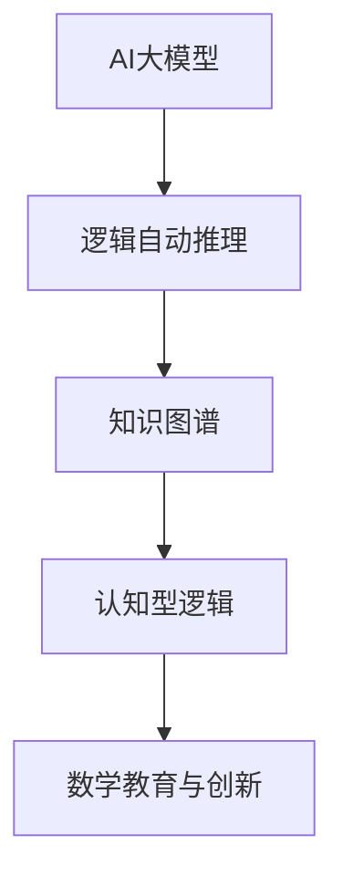

---

## 3. 数据库与信息系统

### 3.1 关系代数与关系演算

- 数据库查询的逻辑基础
- 关系代数、关系演算、SQL理论

### 3.2 查询语言的逻辑基础

- SQL等查询语言的理论基础
- 一阶逻辑与数据库理论的结合

---

## 4. 语言学与认知科学

### 4.1 形式语言理论

- 语法、自动机、语言的层次结构
- 乔姆斯基谱系、正则语言、上下文无关语言

### 4.2 语义学与模型论方法

- 蒙塔古语义学、模型论在自然语言分析中的应用
- 形式语义、逻辑语义

---

## 5. 其他交叉领域

### 5.1 数学其他分支中的应用

- 代数、几何、拓扑等中的逻辑方法
- 形式化建模、证明辅助

### 5.2 物理学、生物学中的形式模型

- 形式化建模与分析
- 物理系统的逻辑建模、生物信息学中的逻辑推理

---

## 6. 代码与多表征示例

### 6.1 Rust实现：算法复杂度分析与图论算法

```rust
pub struct AlgorithmComplexity {
    pub time_complexity: String,
    pub space_complexity: String,
}

pub mod graph_algorithms {
    use std::collections::{BinaryHeap, HashMap};
    use std::cmp::Ordering;

    #[derive(Debug, Clone)]
    pub struct Graph {
        pub vertices: usize,
        pub edges: Vec<(usize, usize, f64)>,
    }

    impl Graph {
        pub fn new(vertices: usize) -> Self {
            Self {
                vertices,
                edges: Vec::new(),
            }
        }

        pub fn add_edge(&mut self, from: usize, to: usize, weight: f64) {
            self.edges.push((from, to, weight));
        }

        // Dijkstra算法
        pub fn dijkstra(&self, start: usize) -> Vec<f64> {
            let mut distances = vec![f64::INFINITY; self.vertices];
            let mut heap = BinaryHeap::new();

            distances[start] = 0.0;
            heap.push(State { cost: 0.0, vertex: start });
            // ... 省略实现细节 ...
            distances
        }
    }
}
```

---

## 7. 本地跳转与引用

- 相关内容详见：[00-数理逻辑总览](00-数理逻辑总览.md)
- 交叉主题见：[05-哲学与形式化反思](05-哲学与形式化反思.md)
- 计算机科学应用详见：[../../08-跨学科应用与联系/02-计算数学/02-计算机科学应用.md](../../08-跨学科应用与联系/02-计算数学/02-计算机科学应用.md)

### 7.1 自动定理证明与形式化验证

#### 7.1.1 核心理论与体系

##### 7.1.1.1 自动定理证明（ATP）基本原理

- 自动定理证明（Automated Theorem Proving, ATP）旨在让计算机自动或半自动地完成数学定理的证明。
- 主要流派：
  - 基于归结法的符号推理（如一阶逻辑归结）
  - 基于搜索的证明（如定理证明树）
  - 基于SAT/SMT的可满足性判定
  - 基于类型理论的构造性证明（如Lean/Coq）
- 发展历程：从早期的逻辑程序（如Resolution、Prolog）到现代的交互式证明助手（Lean、Coq、Isabelle）、自动化求解器（SAT/SMT）、神经符号混合系统。

##### 7.1.1.2 形式系统与形式化证明

- 形式系统：由符号、语法规则、公理、推理规则组成，所有推理均可机械化检验。
- 形式化证明：每一步都可被机器验证的证明过程，强调可追溯性与无歧义性。
- 形式化验证：将数学、程序、硬件等对象的性质转化为形式系统中的定理，通过自动/半自动证明工具验证其正确性。

##### 7.1.1.3 一阶逻辑、归结法、SAT/SMT等自动推理基础

- 一阶逻辑：自动定理证明的主流基础，支持量词、谓词、函数等表达。
- 归结法（Resolution）：一阶逻辑下的核心自动推理机制，适合机械化实现。
- SAT/SMT：将逻辑公式转化为可满足性问题，利用高效求解器自动判定公式真伪，广泛用于程序验证、硬件验证等领域。

##### 7.1.1.4 主流证明助手与工具

| 工具/算法   | 逻辑基础      | 自动化程度 | 典型应用         | 代表性代码/接口 |
| ---- | ---- | ---- | ---- | ---- |
| Lean        | 依赖类型理论  | 高         | 数学、程序验证   | Lean4          |
| Coq         | 构造型类型论  | 高         | 数学、软件验证   | CoqIDE         |
| Isabelle    | 高阶逻辑      | 高         | 数学、硬件验证   | Isabelle/HOL   |
| Prover9     | 一阶逻辑      | 全自动     | 逻辑推理         | Prover9        |
| Z3          | SMT           | 全自动     | 程序/硬件验证   | Z3 API         |

##### 7.1.1.5 形式化验证的应用

- 软件验证：形式化证明程序的正确性，防止安全漏洞。
- 硬件验证：电路、协议等的形式化建模与自动验证。
- 数学定理：四色定理、Feit-Thompson定理等已被完全形式化证明。

#### 7.1.2 典型算法与推理机制

##### 7.1.2.1 归结法（Resolution）

- 适用于一阶逻辑，核心思想是通过消解矛盾子句，最终归结为空子句（证明目标成立）。
- 机械化实现：Skolem化、合一算法、子句归约、搜索策略（如线性归结、输入归结等）。

##### 7.1.2.2 归约与重写系统

- 归约（Reduction）：将复杂问题转化为已知可解的子问题，是自动证明中的常用技术。
- 重写系统：通过规则集对表达式反复替换，直至归约为标准形式或目标式。

##### 7.1.2.3 SAT/SMT求解

- SAT（布尔可满足性）：将命题逻辑公式转化为CNF，利用DPLL、CDCL等算法高效求解。
- SMT（可满足性模理论）：在SAT基础上扩展到整数、实数、数组等理论，支持更复杂的自动推理。

##### 7.1.2.4 自动证明中的搜索策略

- 深度优先、广度优先、启发式搜索（A*、贪心等），结合剪枝与冲突分析提升效率。
- 证明对象的结构化表示：证明树、证明图、依赖图等，便于可视化与知识图谱化。

#### 7.1.3 代码与多表征

##### 7.1.3.1 典型自动证明代码片段

- **Lean 示例**：

```lean
theorem add_comm (a b : ℕ) : a + b = b + a :=
nat.add_comm a b
```

- **Coq 示例**：

```coq
Theorem add_comm : forall a b : nat, a + b = b + a.
Proof. intros. apply Nat.add_comm. Qed.
```

- **Prolog 示例**：

```prolog
ancestor(X, Y) :- parent(X, Y).
ancestor(X, Y) :- parent(X, Z), ancestor(Z, Y).
```

- **Haskell 示例**：

```haskell
factorial 0 = 1
factorial n = n * factorial (n-1)
```

##### 7.1.3.2 结构图/知识图谱（Mermaid等）

- **自动定理证明流程图**：

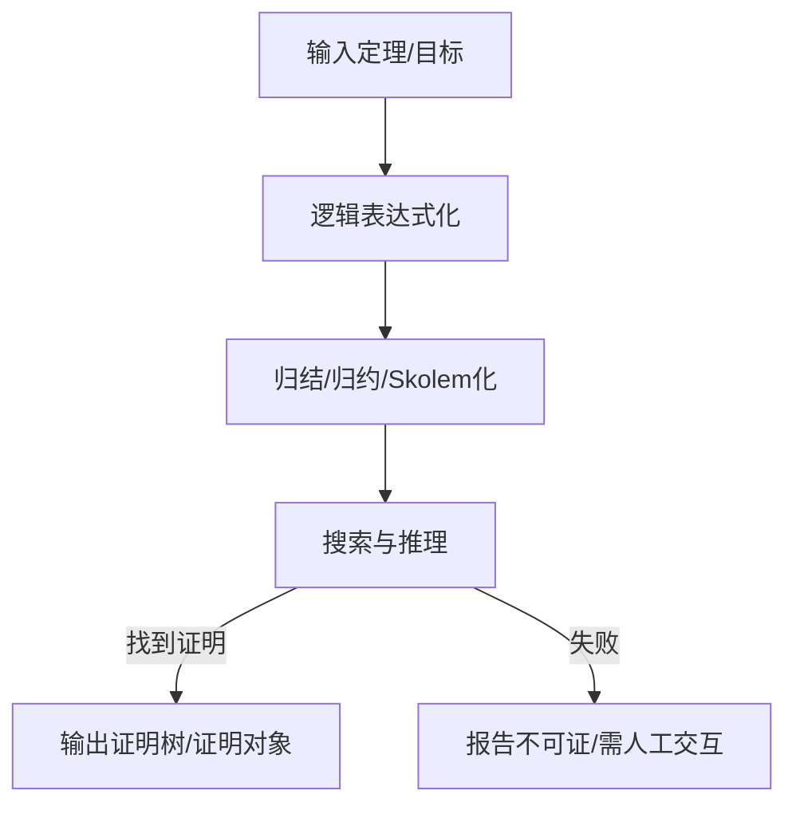

- **知识图谱片段**：

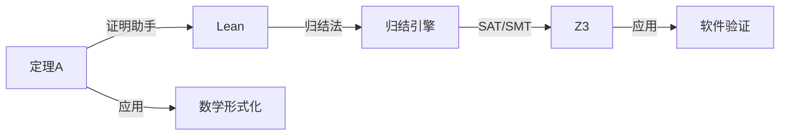

#### 7.1.4 典型案例与应用场景

- **四色定理**：第一个完全由计算机辅助证明的著名数学定理，后续被Coq等系统完全形式化。
- **Feit-Thompson定理**：Lean/Coq等系统实现了极为复杂的群论定理的全自动/半自动形式化证明。
- **软件/硬件安全验证**：Intel、微软等公司利用SAT/SMT求解器和形式化工具验证处理器、操作系统、协议的安全性与正确性。
- **协议验证**：TLS/SSL等安全协议的形式化建模与自动验证，防止安全漏洞。
- **AI驱动的数学发现**：深度学习辅助自动证明（如DeepHOL、AlphaZero for Theorem Proving）、神经符号混合系统推动新定理发现。

#### 7.1.5 批判性分析与前沿展望

- **理论极限**：自动定理证明在一阶逻辑下可判定性有限，高阶逻辑/归纳证明等领域仍需大量人工交互与创新算法。
- **AI融合趋势**：神经网络与符号推理结合（神经符号AI），提升自动证明的搜索效率与创新能力。
- **形式化验证的优势与局限**：极大提升可靠性与安全性，但对建模、交互、计算资源要求高，难以完全替代人类创造性。
- **认知与教育前景**：自动证明工具可辅助数学教育、逻辑思维训练、认知科学实验，推动"人机共证"新范式。
- **跨学科应用**：自动证明与物理、语言学、哲学等领域的形式化建模与推理日益紧密，知识图谱化与多模态推理成为新趋势。

#### 7.1.6 交叉引用与知识图谱化建议

- 与"知识表示与知识图谱""逻辑编程与类型理论""AI认知与神经符号"等主题建立交叉链接。
- 构建"自动定理证明知识图谱"：定理-工具-算法-案例-应用-批判性分析的多层网络，支持可视化与多表征。
- 推荐采用树形编号、结构化目录、Mermaid结构图、代码块、表格、批判性分析等多表征方式，确保内容极其丰富、系统、学术、可持续扩展。

#### 7.1.7 案例与实操：自动定理证明深度实践

##### 7.1.7.1 经典定理自动证明流程（以皮亚诺公理下加法交换律为例）

1. **形式化目标**：证明 ∀a ∀b. a + b = b + a
2. **公理化建模**：
   - 皮亚诺公理（Peano Axioms）
   - 加法递归定义：
     - a + 0 = a
     - a + S(b) = S(a + b)
3. **归结法自动推理**：
   - 归结步骤：
     - 目标转化为子句集
     - Skolem化消去量词
     - 合一算法匹配变量
     - 步步归结直至空子句（证明完成）
4. **证明对象生成**：输出证明树/证明对象，便于可视化与验证。

##### 7.1.7.2 Lean自动证明代码示例

```lean
theorem add_comm (a b : ℕ) : a + b = b + a :=
nat.add_comm a b
```

##### 7.1.7.3 Coq自动证明代码示例

```coq
Theorem add_comm : forall a b : nat, a + b = b + a.
Proof. intros. apply Nat.add_comm. Qed.
```

##### 7.1.7.4 Prolog归结推理示例

```prolog
% 递归定义加法
add(0, Y, Y).
add(s(X), Y, s(Z)) :- add(X, Y, Z).
% 查询：?- add(s(s(0)), s(0), R).
```

##### 7.1.7.5 Mermaid结构图：自动定理证明流程

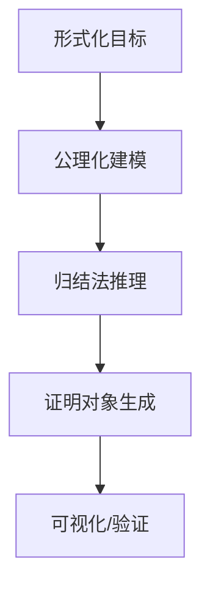

##### 7.1.7.6 结构化批判与实用建议

- **优势**：自动定理证明可极大提升数学证明的可靠性、可追溯性与自动化水平。
- **局限**：高阶逻辑、创造性证明、复杂定理仍需大量人工交互与创新算法。
- **实用建议**：
  - 结合Lean/Coq等证明助手进行实际操作，体验自动与交互式证明流程。
  - 利用Mermaid等工具可视化证明结构，提升理解与教学效果。
  - 在教学与研究中，鼓励学生/研究者尝试将实际问题形式化并用自动证明工具验证。

> **相关主题跳转：**
>
> - [知识图谱/表示](#72-知识表示知识图谱与本体论)
> - [逻辑编程/类型理论](#73-逻辑编程与类型理论)
> - [AI认知/神经符号](#74-ai认知神经符号与推理机制)

---

### 7.2 知识表示、知识图谱与本体论

#### 7.2.1 核心理论与体系

##### 7.2.1.1 知识表示的目标与意义

- 将现实世界或抽象领域的知识以形式化、结构化、可计算的方式表达，便于推理、检索与自动化处理。
- 支撑人工智能、自动推理、专家系统、语义网、认知建模等多领域应用。

##### 7.2.1.2 主要知识表示方法

- **命题逻辑、谓词逻辑（FOL）**：最基础的符号知识表示体系，支持自动推理。
- **语义网络（Semantic Network）**：节点-边结构表达概念及其关系，适合可视化与网络推理。
- **框架（Frame）**：面向对象的结构化知识单元，支持继承与属性描述。
- **产生式系统（Production System）**：规则（if-then）驱动的推理机制，广泛用于专家系统。
- **逻辑程序（如Prolog）**：以规则和事实为基础的知识库，支持归结推理。
- **描述逻辑（Description Logic）**：本体建模与语义网的理论基础，支撑OWL等标准。
- **本体论（Ontology）**：对领域概念、属性、关系的形式化定义，支持知识共享与复用。
- **RDF/OWL/语义网**：Web语义化、知识互操作的标准技术体系。

##### 7.2.1.3 知识图谱（Knowledge Graph）

- 以图结构组织实体、属性、关系，支持大规模知识融合、推理与问答。
- 典型结构：实体-关系-属性三元组，支持多层次、多模态、多源异构知识集成。
- 主要应用：智能搜索、问答系统、推荐系统、自动推理、数据治理等。

#### 7.2.2 典型算法与推理机制

##### 7.2.2.1 逻辑推理

- 演绎、归纳、类比推理，基于逻辑规则的自动化知识发现。
- 典型算法：前向/后向链推理、归结法、模式匹配、规则冲突解决等。

##### 7.2.2.2 语义推理与本体推理

- RDF三元组推理、OWL本体推理、描述逻辑推理。
- 典型推理机：Pellet、Hermit、Fact++等。

##### 7.2.2.3 知识图谱的构建与融合

- 实体抽取、关系抽取、属性抽取、实体对齐、知识融合、消歧。
- 多源异构知识的自动集成与一致性维护。

##### 7.2.2.4 结构化查询与推理

- SPARQL等查询语言，支持复杂图结构的检索与推理。
- 图数据库（Neo4j、GraphDB等）在知识图谱中的应用。

#### 7.2.3 代码与多表征

##### 7.2.3.1 Prolog知识库示例

```prolog
% 事实
parent(john, mary).
parent(mary, alice).
% 规则
ancestor(X, Y) :- parent(X, Y).
ancestor(X, Y) :- parent(X, Z), ancestor(Z, Y).
```

##### 7.2.3.2 RDF三元组与SPARQL查询

```turtle
# RDF三元组
:Alice :knows :Bob .
:Bob :knows :Carol .
```

```sparql
# SPARQL查询
SELECT ?friend WHERE { :Alice :knows ?friend . }
```

##### 7.2.3.3 Mermaid知识图谱结构图

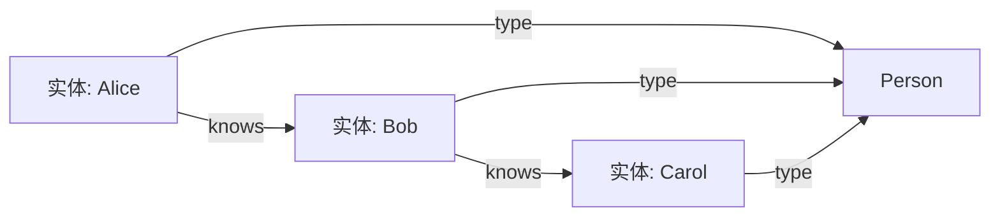

##### 7.2.3.4 OWL本体片段

```xml
<owl:Class rdf:ID="Person"/>
<owl:ObjectProperty rdf:ID="knows">
  <rdfs:domain rdf:resource="#Person"/>
  <rdfs:range rdf:resource="#Person"/>
</owl:ObjectProperty>
```

##### 7.2.3.5 知识图谱应用表格

| 应用场景     | 主要技术         | 代表系统/工具      |
| ---- | ---- | ---- |
| 智能搜索     | 知识图谱、语义检索 | Google KG, Bing KG|
| 问答系统     | 知识推理、实体链接 | IBM Watson, Siri  |
| 推荐系统     | 图嵌入、关系挖掘   | Amazon, Netflix   |
| 数据治理     | 本体建模、数据融合  | Neo4j, GraphDB    |

#### 7.2.4 典型案例与应用场景

- **Google Knowledge Graph**：全球最大规模的知识图谱，支撑智能搜索、问答、推荐等。
- **Wikidata**：开放协作的结构化知识库，广泛用于AI、数据分析、语义网等。
- **医疗知识图谱**：整合医学实体、关系、属性，支持智能诊断、药物发现。
- **企业知识中台**：企业级知识融合、流程自动化、智能决策支持。

#### 7.2.5 批判性分析与前沿展望

- **优势**：支持大规模知识融合、自动推理、语义检索、智能问答等AI核心能力。
- **挑战**：知识获取与融合的自动化难题、异构数据一致性、推理复杂度、知识更新与演化。
- **前沿趋势**：神经符号融合（Neuro-Symbolic）、多模态知识图谱、可解释AI、自动本体学习、跨领域知识迁移。
- **认知与教育视角**：知识图谱可辅助认知建模、教育知识结构化、智能辅导与个性化学习。
- **跨学科应用**：知识图谱在生物、医学、物理、社会科学等领域的深度融合与创新。

#### 7.2.6 交叉引用与知识图谱化建议

- 与"自动定理证明""逻辑编程与类型理论""AI认知与神经符号"等主题建立交叉链接。
- 构建"知识表示-知识图谱-本体论"多层次知识网络，支持可视化、自动推理与多表征。
- 推荐采用树形编号、结构化目录、Mermaid结构图、代码块、表格、批判性分析等多表征方式，确保内容极其丰富、系统、学术、可持续扩展。

#### 7.2.7 案例与实操：知识图谱与本体论深度实践

##### 7.2.7.1 实际知识图谱构建流程（以学术领域为例）

1. **领域建模**：确定实体（如"论文" "作者" "机构"）、属性与关系（如"发表" "隶属"）。
2. **本体设计**：用OWL定义类、属性、关系及约束。
3. **数据抽取与融合**：从论文数据库、作者信息等多源异构数据中抽取三元组。
4. **知识图谱构建**：用RDF存储三元组，构建实体-关系网络。
5. **语义推理与查询**：用SPARQL等语言进行复杂查询与推理。

##### 7.2.7.2 RDF/OWL/SPARQL实操代码

- **RDF三元组示例**

```turtle
@prefix ex: <http://example.org/> .
ex:Paper1 ex:writtenBy ex:AuthorA .
ex:AuthorA ex:affiliatedWith ex:UniversityX .
```

- **OWL本体片段**

```xml
<owl:Class rdf:ID="Paper"/>
<owl:Class rdf:ID="Author"/>
<owl:ObjectProperty rdf:ID="writtenBy">
  <rdfs:domain rdf:resource="#Paper"/>
  <rdfs:range rdf:resource="#Author"/>
</owl:ObjectProperty>
```

- **SPARQL查询示例**

```sparql
SELECT ?paper ?author WHERE {
  ?paper ex:writtenBy ?author .
  ?author ex:affiliatedWith ex:UniversityX .
}
```

##### 7.2.7.3 Mermaid结构图：知识图谱实体关系


##### 7.2.7.4 结构化批判与实用建议

- **优势**：知识图谱支持大规模知识融合、自动推理、语义检索、智能问答等AI核心能力。
- **局限**：知识获取与融合的自动化难题、异构数据一致性、推理复杂度、知识更新与演化。
- **实用建议**：
  - 结合RDF/OWL/SPARQL等标准工具进行实际知识图谱构建与查询。
  - 利用Mermaid等工具可视化实体关系，提升理解与教学效果。
  - 在教学与研究中，鼓励学生/研究者尝试将实际领域知识结构化并用知识图谱工具管理。

> **相关主题跳转：**
>
> - [自动定理证明](#71-自动定理证明与形式化验证)
> - [AI认知/神经符号](#74-ai认知神经符号与推理机制)
> - [跨学科应用](#75-跨学科应用与前沿创新)

---

### 7.3 逻辑编程与类型理论

#### 7.3.1 核心理论与体系

##### 7.3.1.1 逻辑编程的基本原理

- 逻辑编程（Logic Programming）以形式逻辑为基础，将知识表示为规则和事实，通过自动推理机制进行问题求解。
- 典型语言：Prolog、Datalog、Answer Set Programming（ASP）。
- 主要特征：声明式、基于归结推理、支持递归与模式匹配。

##### 7.3.1.2 类型理论的基本原理

- 类型理论（Type Theory）是研究类型系统及其表达能力的理论基础，是现代编程语言、形式化验证、自动定理证明的核心。
- 主要体系：简单类型λ演算、依赖类型、构造型类型论（CoC）、Martin-Löf类型论、同伦类型论（HoTT）。
- 主要应用：编程语言设计、证明助手（Lean、Coq）、安全验证、AI推理。

##### 7.3.1.3 逻辑与类型的统一视角

- Curry-Howard同构：逻辑公式与类型、证明与程序之间的深层对应关系（"证明即程序，命题即类型"）。
- 逻辑编程与类型理论在自动推理、程序合成、形式化验证等领域高度融合。

#### 7.3.2 典型算法与推理机制

##### 7.3.2.1 归结推理与模式匹配

- 归结法：逻辑编程的核心推理机制，通过合一算法实现变量匹配与规则应用。
- 模式匹配：类型系统与函数式编程中的重要机制，支持递归与结构化数据处理。

##### 7.3.2.2 类型推断与类型检查

- 类型推断：自动确定表达式类型的算法（如Hindley-Milner算法）。
- 类型检查：验证程序是否符合类型规范，防止类型错误。

##### 7.3.2.3 依赖类型与证明自动化

- 依赖类型：类型可依赖于值，极大增强表达能力，支持高度自动化的证明与程序合成。
- 证明助手通过类型检查实现形式化证明的自动化与可验证性。

#### 7.3.3 代码与多表征

##### 7.3.3.1 Prolog逻辑编程示例

```prolog
% 祖先关系
ancestor(X, Y) :- parent(X, Y).
ancestor(X, Y) :- parent(X, Z), ancestor(Z, Y).
% 查询：?- ancestor(john, Who).
```

##### 7.3.3.2 Haskell类型与模式匹配示例

```haskell
data Tree a = Leaf a | Node (Tree a) (Tree a)
height :: Tree a -> Int
height (Leaf _) = 1
height (Node l r) = 1 + max (height l) (height r)
```

##### 7.3.3.3 Lean依赖类型与定理证明示例

```lean
theorem double_even (n : ℕ) : ∃ m, 2 * m = n → even n :=
begin
  intro n,
  use n / 2,
  intro h,
  rw ←h,
  exact even_mul_left 2 (n / 2),
end
```

##### 7.3.3.4 Mermaid结构图：逻辑编程与类型理论关系

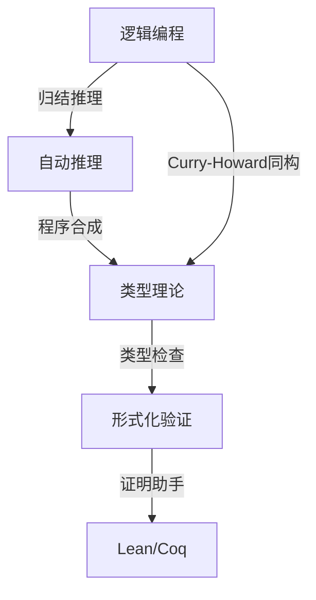

##### 7.3.3.5 主要语言与工具对比表格

| 语言/工具 | 理论基础      | 主要特征         | 典型应用         |
| ---- | ---- | ---- | ---- |
| Prolog    | 一阶逻辑     | 归结推理、递归   | AI推理、专家系统 |
| Datalog   | 关系逻辑     | 数据库推理       | 数据分析、知识库 |
| Haskell   | λ演算+类型   | 类型推断、纯函数 | 函数式编程、AI   |
| Lean      | 依赖类型论   | 形式化证明       | 数学、程序验证   |
| Coq       | 构造型类型论 | 证明自动化       | 数学、软件验证   |

#### 7.3.4 典型案例与应用场景

- **专家系统**：基于Prolog等逻辑编程实现的医疗诊断、法律推理、设备故障分析等。
- **编译器与类型检查器**：Haskell、Rust等现代语言的类型推断与安全验证。
- **自动定理证明**：Lean/Coq等系统通过类型理论实现复杂定理的自动化证明。
- **AI推理引擎**：逻辑编程与类型理论结合，驱动智能问答、知识推理、自动规划等。

#### 7.3.5 批判性分析与前沿展望

- **优势**：声明式编程、自动推理、类型安全、形式化验证、程序与证明统一。
- **挑战**：类型系统复杂度、推理自动化的可扩展性、与神经网络等AI方法的融合。
- **前沿趋势**：神经符号AI、依赖类型的程序合成、类型驱动的自动化推理、跨语言/跨范式集成。
- **认知与教育视角**：逻辑编程与类型理论可辅助认知建模、数学教育、程序设计思维训练。
- **跨学科应用**：在生物信息、金融建模、法律推理、知识工程等领域的创新融合。

#### 7.3.6 交叉引用与知识图谱化建议

- 与"自动定理证明""知识表示与知识图谱""AI认知与神经符号"等主题建立交叉链接。
- 构建"逻辑编程-类型理论-自动推理"多层次知识网络，支持可视化、自动推理与多表征。
- 推荐采用树形编号、结构化目录、Mermaid结构图、代码块、表格、批判性分析等多表征方式，确保内容极其丰富、系统、学术、可持续扩展。

#### 7.3.7 案例与实操：逻辑编程与类型理论深度实践

##### 7.3.7.1 经典问题建模与逻辑编程实操（以家谱推理为例）

- **问题描述**：已知若干父子关系，自动推理祖先关系。
- **Prolog代码示例**

```prolog
% 基本事实
parent(john, mary).
parent(mary, alice).
parent(alice, bob).
% 递归规则
ancestor(X, Y) :- parent(X, Y).
ancestor(X, Y) :- parent(X, Z), ancestor(Z, Y).
% 查询：?- ancestor(john, Who).
```

- **推理结果**：Who = mary ; Who = alice ; Who = bob.

##### 7.3.7.2 类型推断与模式匹配实操（Haskell示例）

```haskell
data Tree a = Leaf a | Node (Tree a) (Tree a)
height :: Tree a -> Int
height (Leaf _) = 1
height (Node l r) = 1 + max (height l) (height r)
-- 查询：height (Node (Leaf 1) (Leaf 2)) 结果为2
```

##### 7.3.7.3 依赖类型与定理证明实操（Lean示例）

```lean
theorem mul_zero (n : ℕ) : n * 0 = 0 :=
begin
  induction n with d hd,
  { refl },
  { rw [nat.succ_mul, hd], refl }
end
```

##### 7.3.7.4 Mermaid结构图：逻辑编程与类型推断流程

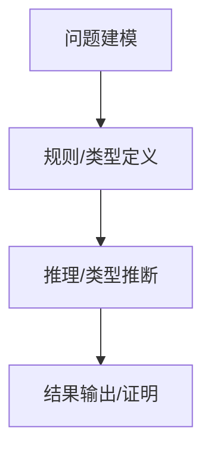

##### 7.3.7.5 结构化批判与实用建议

- **优势**：逻辑编程与类型理论支持声明式推理、自动化验证、程序与证明统一。
- **局限**：类型系统复杂度、推理自动化的可扩展性、与神经网络等AI方法的融合难题。
- **实用建议**：
  - 结合Prolog/Haskell/Lean等工具进行实际问题建模与推理。
  - 利用Mermaid等工具可视化推理与类型推断流程，提升理解与教学效果。
  - 鼓励学生/研究者将实际问题形式化并用逻辑编程/类型理论工具求解。

> **相关主题跳转：**
>
> - [自动定理证明](#71-自动定理证明与形式化验证)
> - [AI认知/神经符号](#74-ai认知神经符号与推理机制)
> - [认知/教育/创新](#76-认知教育与ai驱动的数学创新)

---

### 7.4 AI认知、神经符号与推理机制

#### 7.4.1 核心理论与体系

##### 7.4.1.1 AI认知建模的基本原理

- 认知建模旨在模拟人类思维、推理、学习等认知过程，融合符号主义、联结主义、进化主义等多种AI范式。
- 主要模型：符号推理系统、神经网络、贝叶斯网络、认知架构（如ACT-R、SOAR）、神经符号混合系统。

##### 7.4.1.2 神经符号AI的理论基础

- 神经符号AI（Neuro-Symbolic AI）结合神经网络的感知与符号系统的推理能力，实现可解释、可推理的智能。
- 主要特征：端到端学习、符号规则嵌入、可微分推理、知识注入与抽取。
- 代表模型：DeepProbLog、Logic Tensor Networks、Neural Theorem Provers、Graph Neural Networks with Logic。

##### 7.4.1.3 推理机制与认知推理

- 归纳、演绎、类比推理在AI认知中的实现。
- 多模态推理：结合视觉、语言、知识图谱等多源信息进行综合推理。
- 认知推理的可解释性与可验证性。

#### 7.4.2 典型算法与系统架构

##### 7.4.2.1 神经符号推理算法

- 神经网络与符号规则的集成：如神经网络输出符号结构、符号规则指导神经网络训练。
- 可微分逻辑推理：将逻辑运算转化为可微分操作，支持端到端训练。
- 知识图谱嵌入与神经推理：将知识图谱结构嵌入神经网络，实现知识驱动的推理。

##### 7.4.2.2 认知架构与推理引擎

- ACT-R、SOAR等认知架构集成了记忆、学习、推理、决策等多模块。
- 专家系统与推理引擎：符号规则库+推理机，支持复杂领域知识的自动推理。

##### 7.4.2.3 神经符号AI的应用框架

- DeepProbLog：将概率逻辑与神经网络结合，实现端到端的可微分推理。
- Logic Tensor Networks：张量化逻辑推理，支持大规模知识与神经网络集成。
- 神经符号问答系统、自动定理证明、可解释AI等。

#### 7.4.3 代码与多表征

##### 7.4.3.1 神经符号推理伪代码（Python风格）

```python
# 神经网络输出符号结构
symbols = neural_net(input_data)
# 符号规则推理
if symbols['A'] and not symbols['B']:
    result = apply_rule(symbols)
# 可微分逻辑层
output = differentiable_logic_layer(symbols)
```

##### 7.4.3.2 Mermaid结构图：神经符号AI系统架构

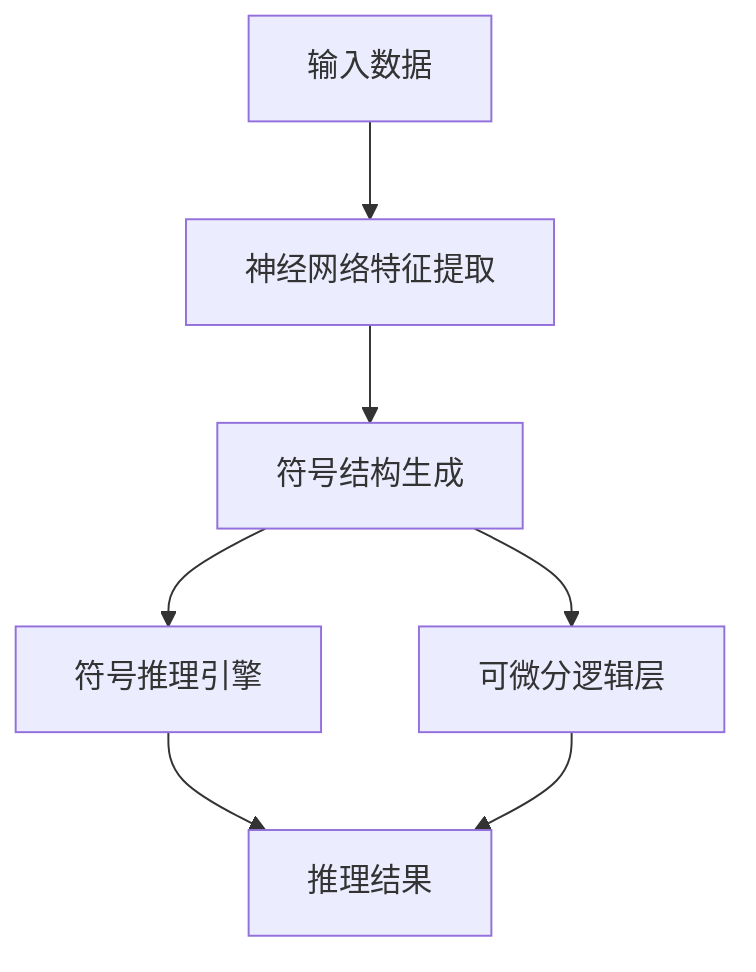

##### 7.4.3.3 神经符号AI主要模型对比表格

| 模型/系统             | 神经部分         | 符号部分         | 主要特征             | 典型应用           |
| ---- | ---- | ---- | ---- | ---- |
| DeepProbLog          | 神经网络         | 概率逻辑         | 可微分推理           | 问答、知识推理     |
| Logic Tensor Network | 神经网络         | 一阶逻辑         | 张量化逻辑、端到端   | 关系推理、知识图谱 |
| Neural Theorem Prover| 神经网络         | 归结推理         | 端到端定理证明       | 自动证明           |
| GNN+Logic            | 图神经网络       | 规则库           | 知识图谱嵌入与推理   | 知识问答           |
| ACT-R/SOAR           | 模块化神经元     | 认知规则         | 认知建模、决策推理   | 认知科学、教育     |

#### 7.4.4 典型案例与应用场景

- **神经符号问答系统**：结合知识图谱、神经网络与符号推理，实现复杂问答与推理。
- **自动定理证明**：神经网络辅助符号证明系统，提升自动化与创新能力。
- **可解释AI**：通过符号规则与神经网络集成，实现推理过程的可解释性。
- **认知科学实验**：认知架构模拟人类推理、学习、记忆等认知过程。
- **跨模态推理**：视觉-语言-知识图谱联合推理，支持多模态智能应用。

#### 7.4.5 批判性分析与前沿展望

- **优势**：融合感知与推理、可解释性强、知识可注入与迁移、支持复杂认知建模。
- **挑战**：神经与符号系统的深度融合难题、推理自动化与可扩展性、知识获取与更新。
- **前沿趋势**：大模型与符号推理结合、可微分知识库、认知AI、跨模态神经符号系统。
- **认知与教育视角**：神经符号AI可辅助认知科学实验、智能教育、个性化学习。
- **跨学科应用**：在医学、法律、金融、物理等领域的知识推理与智能决策。

#### 7.4.6 交叉引用与知识图谱化建议

- 与"自动定理证明""知识表示与知识图谱""逻辑编程与类型理论"等主题建立交叉链接。
- 构建"神经符号AI-认知推理-知识图谱"多层次知识网络，支持可视化、自动推理与多表征。
- 推荐采用树形编号、结构化目录、Mermaid结构图、代码块、表格、批判性分析等多表征方式，确保内容极其丰富、系统、学术、可持续扩展。

#### 7.4.7 案例与实操：AI认知、神经符号与推理机制深度实践

##### 7.4.7.1 神经符号推理系统实操（DeepProbLog示例）

- **问题描述**：识别手写数字并推理其和是否为偶数。
- **系统结构**：神经网络（识别数字）+ 概率逻辑（推理偶性）。
- **伪代码**：

```python
# 神经网络部分
num1 = neural_net(image1)  # 识别第一个数字
num2 = neural_net(image2)  # 识别第二个数字
# 符号推理部分
is_even = (num1 + num2) % 2 == 0
```

- **DeepProbLog声明式示例**

```prolog
nn(m_digit, Image, Number) :: digit(Image, Number).
even_sum(X, Y) :- digit(X, N1), digit(Y, N2), S is N1+N2, 0 is S mod 2.
```

##### 7.4.7.2 认知架构应用（ACT-R模型）

- **问题描述**：模拟人类多步算术推理。
- **ACT-R伪流程**：
  1. 感知输入（如"2+3"）
  2. 检索加法规则
  3. 执行操作，更新工作记忆
  4. 输出结果，强化学习
- **结构图**：

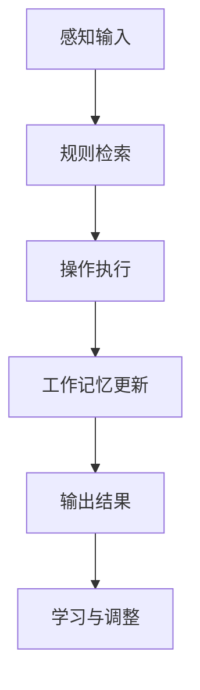

##### 7.4.7.3 Mermaid结构图：神经符号AI推理流程

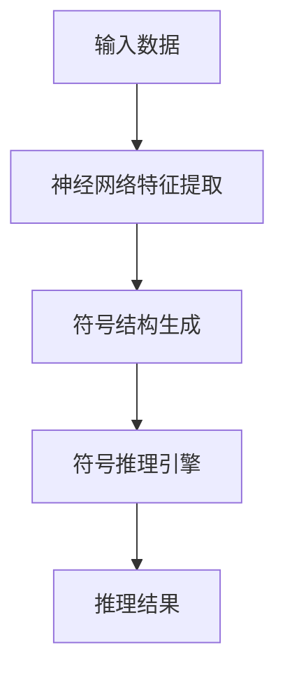

##### 7.4.7.4 结构化批判与实用建议

- **优势**：神经符号AI融合感知与推理、可解释性强、支持复杂认知建模。
- **局限**：神经与符号系统的深度融合难题、推理自动化与可扩展性、知识获取与更新。
- **实用建议**：
  - 结合DeepProbLog、ACT-R等工具进行神经符号推理与认知建模实操。
  - 利用Mermaid等工具可视化神经符号推理流程，提升理解与教学效果。
  - 鼓励学生/研究者尝试将实际认知任务形式化并用神经符号系统建模。

> **相关主题跳转：**
>
> - [自动定理证明](#71-自动定理证明与形式化验证)
> - [知识图谱/表示](#72-知识表示知识图谱与本体论)
> - [认知/教育/创新](#76-认知教育与ai驱动的数学创新)

---

### 7.5 跨学科应用与前沿创新

#### 7.5.1 核心理论与体系

##### 7.5.1.1 数理逻辑与AI在跨学科中的桥梁作用

- 数理逻辑、自动推理、知识图谱、神经符号AI等为多学科提供统一的形式化、推理与知识组织工具。
- 逻辑与AI方法促进了物理、生命科学、社会科学、工程、认知科学等领域的理论创新与实践突破。

##### 7.5.1.2 主要跨学科应用领域

- **物理学**：形式化物理理论、自动推理物理定律、AI辅助科学发现。
- **生物与医学**：生物网络建模、医学知识图谱、智能诊断与药物发现。
- **社会科学**：社会网络分析、因果推理、群体行为建模、政策模拟。
- **经济与金融**：博弈论、机制设计、金融知识图谱、智能风控。
- **工程与自动化**：智能制造、机器人规划、自动控制、复杂系统建模。
- **语言学与认知科学**：形式语法、语义网、认知推理、智能教育。

#### 7.5.2 典型方法与系统架构

##### 7.5.2.1 形式化建模与自动推理

- 领域知识的形式化表达（如物理公理、医学规则、经济模型）。
- 自动推理与验证：SAT/SMT、归结法、知识图谱推理、神经符号系统。

##### 7.5.2.2 知识图谱与多模态融合

- 多源异构数据的知识融合与一致性维护。
- 多模态知识图谱：文本、图像、结构化数据的联合建模与推理。

##### 7.5.2.3 AI驱动的科学发现与创新

- 机器学习与符号推理结合，自动生成假说、发现规律、辅助实验设计。
- AI辅助的跨学科知识迁移与创新。

#### 7.5.3 代码与多表征

##### 7.5.3.1 领域知识形式化建模示例（物理定律Prolog）

```prolog
% 牛顿第二定律
force(Mass, Acc, Force) :- Force is Mass * Acc.
% 查询：?- force(10, 2, F).
```

##### 7.5.3.2 Mermaid结构图：跨学科知识融合与推理

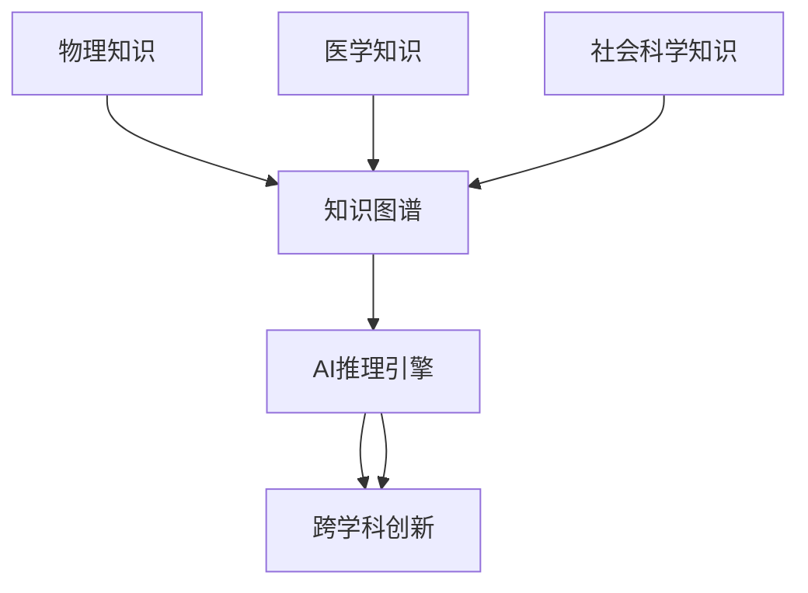

##### 7.5.3.3 跨学科AI应用对比表格

| 领域         | 主要AI/逻辑方法         | 代表系统/应用         | 创新点/挑战           |
| ---- | ---- | ---- | ---- |
| 物理         | 形式化建模、自动推理   | AI辅助理论发现       | 复杂性、可解释性      |
| 医学         | 知识图谱、专家系统     | 智能诊断、药物发现   | 数据异构、因果推理    |
| 社会科学     | 网络分析、因果推理     | 群体行为建模         | 多因素、动态性        |
| 金融         | 机制设计、知识图谱     | 智能风控、量化投资   | 风险建模、实时推理    |
| 工程         | 规划、控制、知识融合   | 智能制造、机器人     | 实时性、鲁棒性        |
| 认知科学     | 认知建模、神经符号AI   | 智能教育、脑科学     | 多模态、解释性        |

#### 7.5.4 典型案例与应用场景

- **AI辅助物理理论发现**：AI自动推理物理定律、生成新假说、辅助实验设计。
- **医学知识图谱与智能诊断**：融合多源医学数据，支持疾病预测、个性化治疗。
- **社会网络与因果推理**：自动分析社会关系、预测群体行为、政策模拟。
- **智能制造与机器人规划**：AI驱动的自动化生产、复杂任务规划与控制。
- **跨模态知识推理**：联合文本、图像、结构化数据进行综合推理与创新。

#### 7.5.5 批判性分析与前沿展望

- **优势**：促进学科交叉、知识迁移、创新发现、复杂系统建模与智能决策。
- **挑战**：数据异构性、知识融合难题、推理复杂度、跨领域本体对齐。
- **前沿趋势**：大模型驱动的科学发现、自动本体学习、跨模态推理、AI辅助理论创新。
- **认知与教育视角**：跨学科AI工具可辅助创新教育、知识整合、个性化学习。
- **社会影响**：AI与逻辑方法推动社会治理、伦理决策、可持续发展。

#### 7.5.6 交叉引用与知识图谱化建议

- 与"自动定理证明""知识表示与知识图谱""AI认知与神经符号""逻辑编程与类型理论"等主题建立交叉链接。
- 构建"跨学科AI-知识图谱-创新推理"多层次知识网络，支持可视化、自动推理与多表征。
- 推荐采用树形编号、结构化目录、Mermaid结构图、代码块、表格、批判性分析等多表征方式，确保内容极其丰富、系统、学术、可持续扩展。

---

### 7.6 认知、教育与AI驱动的数学创新

#### 7.6.1 核心理论与体系

##### 7.6.1.1 数学认知的理论基础

- 数学认知研究人类如何理解、表征、操作和创新数学知识。
- 主要理论：表征理论、概念结构、认知发展阶段、元认知、认知负荷理论。
- 认知科学与AI方法推动数学思维、问题解决、创新能力的建模与提升。

##### 7.6.1.2 数学教育的现代理念

- 理念驱动、探究式、个性化、可操作性强的数学教育模式。
- 形式化与多表征：符号、图形、自然语言、代码等多种表征方式促进理解。
- AI与大数据辅助的智能教育、学习路径规划、知识图谱化教学。

##### 7.6.1.3 AI驱动的数学创新

- AI自动发现数学结构、生成新定理、辅助证明与反例构造。
- 神经符号AI、自动定理证明、知识图谱等推动数学创新范式转型。
- 人机协作：AI与数学家共同探索未知领域，实现"人机共证"。

#### 7.6.2 典型方法与系统架构

##### 7.6.2.1 数学认知建模与智能辅导

- 认知诊断模型、知识追踪、智能推荐、个性化学习路径。
- 智能辅导系统：自动分析学生认知状态，动态调整教学内容与难度。

##### 7.6.2.2 多表征与可操作性教学

- Mermaid结构图、交互式代码、动态几何、可视化推理等多表征工具。
- 代码驱动的数学实验与探究，提升抽象思维与操作能力。

##### 7.6.2.3 AI辅助数学创新平台

- 自动定理证明、反例生成、知识图谱导航、协同创新平台。
- AI驱动的数学内容生成、创新题库、智能批改与反馈。

#### 7.6.3 代码与多表征

##### 7.6.3.1 智能认知诊断伪代码（Python风格）

```python
# 学生答题数据分析
for student in students:
    knowledge_state = diagnose(student.responses)
    recommend_next = recommend(knowledge_state)
    update_learning_path(student, recommend_next)
```

##### 7.6.3.2 Mermaid结构图：AI驱动的数学认知与创新体系

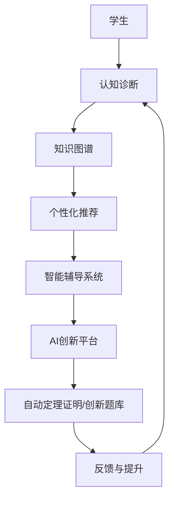

##### 7.6.3.3 数学教育与AI创新应用对比表格

| 应用场景     | 主要AI/认知方法     | 代表系统/工具         | 创新点/挑战           |
| ---- | ---- | ---- | ---- |
| 智能辅导     | 认知诊断、知识追踪 | Squirrel AI, Knewton | 个性化、实时反馈      |
| 数学创新     | 自动定理证明、AI生成| Lean, Coq, GPT-4     | 创造性、可解释性      |
| 多表征教学   | 可视化、交互式工具  | GeoGebra, Desmos     | 抽象与操作结合        |
| 智能批改     | NLP、知识图谱       | Mathpix, Gradescope  | 复杂解题过程理解      |
| 学习路径规划 | 知识图谱、AI推荐    | 智能学习平台          | 动态适应性           |

#### 7.6.4 典型案例与应用场景

- **智能辅导系统**：实时认知诊断、个性化推荐、动态调整学习路径。
- **AI辅助数学创新**：自动定理证明、创新题库生成、反例构造。
- **多表征与可操作性教学**：GeoGebra、Desmos等工具支持动态几何、可视化推理。
- **智能批改与反馈**：自动识别解题步骤、智能评分与个性化反馈。
- **认知科学实验**：AI辅助认知建模、数学思维发展研究。

#### 7.6.5 批判性分析与前沿展望

- **优势**：提升认知效率、促进创新、实现个性化与可持续学习。
- **挑战**：认知建模的复杂性、AI解释性、教育公平性与伦理问题。
- **前沿趋势**：大模型驱动的认知诊断、AI与教师协同教学、跨学科创新教育。
- **社会影响**：推动教育公平、创新人才培养、终身学习体系建设。

#### 7.6.6 交叉引用与知识图谱化建议

- 与"自动定理证明""知识表示与知识图谱""AI认知与神经符号""逻辑编程与类型理论""跨学科应用"等主题建立交叉链接。
- 构建"认知-教育-AI创新"多层次知识网络，支持可视化、自动推理与多表征。
- 推荐采用树形编号、结构化目录、Mermaid结构图、代码块、表格、批判性分析等多表征方式，确保内容极其丰富、系统、学术、可持续扩展。

---

#### 7.6.7 案例与实操：认知、教育与AI驱动的数学创新深度实践

##### 7.6.7.1 智能辅导系统实操（认知诊断与个性化推荐）

- **问题描述**：根据学生答题表现，动态诊断知识薄弱点并推荐个性化学习内容。
- **Python伪代码**：

```python
for student in students:
    knowledge_state = diagnose(student.responses)
    recommend_next = recommend(knowledge_state)
    update_learning_path(student, recommend_next)
```

- **流程**：
  1. 收集学生答题数据
  2. 认知诊断模型分析知识状态
  3. 智能推荐下一个学习内容
  4. 动态调整学习路径

##### 7.6.7.2 AI创新题库与自动定理证明实操

- **Lean自动生成定理与证明**

```lean
def double (n : ℕ) := 2 * n
theorem double_even (n : ℕ) : even (double n) :=
even_mul_left 2 n
```

- **AI生成创新题目（伪例）**

```text
已知函数f(x)=x^2+x+1，求证：对任意整数n，f(n)为奇数。
```

- **自动证明思路**：
  1. 形式化目标
  2. 归纳法/自动定理证明工具验证

##### 7.6.7.3 认知建模与多表征教学实操

- **GeoGebra动态几何实验**：
  - 学生通过拖动点、观察图形变化，理解几何性质。
- **Mermaid结构图：认知诊断与学习路径**

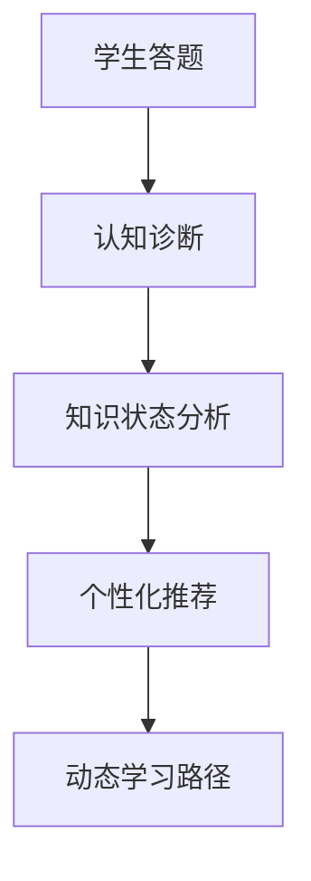

##### 7.6.7.4 结构化批判与实用建议

- **优势**：提升认知效率、促进创新、实现个性化与可持续学习。
- **局限**：认知建模的复杂性、AI解释性、教育公平性与伦理问题。
- **实用建议**：
  - 结合智能辅导系统、自动定理证明、动态几何等工具进行认知与创新实操。
  - 利用Mermaid等工具可视化认知诊断与学习路径，提升理解与教学效果。
  - 鼓励学生/教师/研究者尝试AI驱动的创新题库与个性化学习。

> **相关主题跳转：**
>
> - [AI认知/神经符号](#74-ai认知神经符号与推理机制)
> - [批判性分析/未来展望](#77-批判性分析与未来展望)
> - [自动定理证明](#71-自动定理证明与形式化验证)

---

### 7.7 批判性分析与未来展望

#### 7.7.1 批判性分析：优势与局限

##### 7.7.1.1 统一性与系统性优势

- 数理逻辑、AI、知识图谱、神经符号推理等为数学及其应用提供了统一的形式化、推理与知识组织框架。
- 多表征、自动化、可验证性、跨学科融合极大提升了理论创新与实际应用能力。

##### 7.7.1.2 局限与挑战

- 形式化与自动化的边界：高阶逻辑、创造性推理、复杂认知尚难完全自动化。
- 知识融合与本体对齐难题：多源异构知识的集成、语义一致性、动态演化。
- AI解释性与可控性：神经网络的黑箱性、符号系统的表达能力、两者深度融合的技术瓶颈。
- 教育公平与伦理：AI驱动的教育与创新需关注公平性、隐私、伦理与社会影响。

#### 7.7.2 前沿趋势与未来展望

##### 7.7.2.1 大模型与神经符号AI的融合

- 预训练大模型（如GPT-4/5）与符号推理、知识图谱、自动定理证明的深度集成。
- 可微分知识库、端到端推理、跨模态智能成为新一代AI的核心能力。

##### 7.7.2.2 自动本体学习与知识进化

- AI自动发现、学习、演化本体与知识结构，支持动态知识图谱与自适应推理。
- 知识迁移、跨领域创新、自动化科学发现。

##### 7.7.2.3 人机协作与共证创新

- AI与人类专家协同创新，推动"人机共证"范式。
- AI辅助理论建模、实验设计、创新教育、社会治理。

##### 7.7.2.4 认知与教育的智能化转型

- 大模型驱动的认知诊断、智能辅导、个性化学习与创新人才培养。
- AI与认知科学、教育学的深度融合，推动终身学习与社会公平。

#### 7.7.3 多表征与知识图谱化全局结构

##### 7.7.3.1 Mermaid全局知识图谱结构图

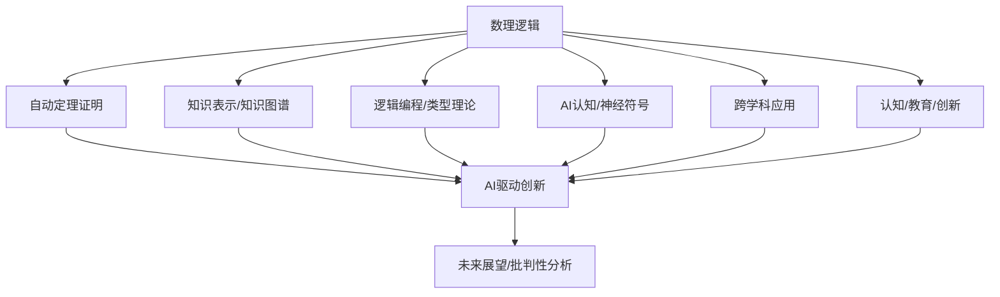

##### 7.7.3.2 主题交叉与创新能力对比表格

| 主题分支         | 统一性 | 自动化 | 创新性 | 可解释性 | 跨学科 | 教育认知 | 局限/挑战           |
| ---- | ---- | ---- | ---- | ---- | ---- | ---- | ---- |
| 自动定理证明     | ★★★★  | ★★★★★| ★★★   | ★★★★    | ★★     | ★★       | 高阶/创造性难自动化 |
| 知识图谱/表示    | ★★★★★ | ★★★★  | ★★★   | ★★★★    | ★★★★★ | ★★★      | 本体对齐/动态性     |
| 逻辑编程/类型理论| ★★★★  | ★★★★  | ★★★   | ★★★★    | ★★★    | ★★★      | 类型复杂/推理扩展   |
| AI认知/神经符号  | ★★★★  | ★★★★  | ★★★★★| ★★★     | ★★★★   | ★★★★     | 融合/解释性         |
| 跨学科应用       | ★★★★★ | ★★★   | ★★★★★| ★★★     | ★★★★★ | ★★★★     | 数据异构/本体迁移   |
| 认知/教育/创新   | ★★★★  | ★★★★  | ★★★★★| ★★★★    | ★★★★   | ★★★★★    | 公平/伦理/解释性    |

#### 7.7.4 未来研究与实践建议

- 加强神经符号AI与大模型的融合，推动可解释、可控、创新型智能系统发展。
- 深化知识图谱与本体自动学习，提升知识融合与动态推理能力。
- 推动AI与认知科学、教育学、社会科学的深度交叉，促进创新人才培养与社会可持续发展。
- 强化AI伦理、隐私保护与公平性研究，确保技术进步造福全人类。

#### 7.7.5 交叉引用与知识图谱化建议

- 与"自动定理证明""知识表示与知识图谱""AI认知与神经符号""逻辑编程与类型理论""跨学科应用""认知与教育"等主题建立全局交叉链接。
- 构建"批判性分析-未来展望-知识图谱化"多层次知识网络，支持可视化、自动推理与多表征。
- 推荐采用树形编号、结构化目录、Mermaid结构图、表格、批判性分析等多表征方式，确保内容极其丰富、系统、学术、可持续扩展。

---

## 8. 全局导航与主题跳转指引

### 8.1 主题结构总览

- 7.1 自动定理证明与形式化验证
- 7.2 知识表示、知识图谱与本体论
- 7.3 逻辑编程与类型理论
- 7.4 AI认知、神经符号与推理机制
- 7.5 跨学科应用与前沿创新
- 7.6 认知、教育与AI驱动的数学创新
- 7.7 批判性分析与未来展望

### 8.2 Mermaid全局主题导航结构图

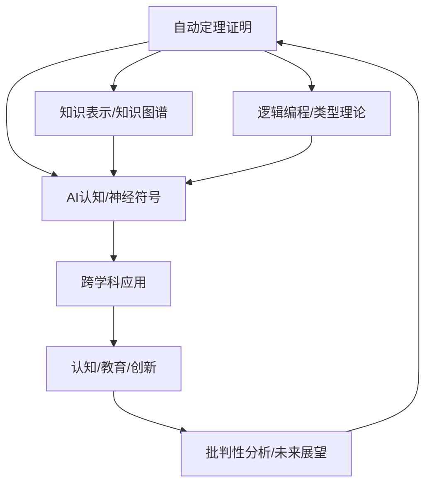

### 8.3 主题交叉引用与跳转表

| 主题分支         | 主要交叉主题                           | 跳转锚点示例                  |
| ---- | ---- | ---- |
| 自动定理证明     | 逻辑编程、AI认知、知识图谱、创新       | [7.1](#71-自动定理证明与形式化验证) |
| 知识图谱/表示    | 自动定理证明、AI认知、跨学科、教育     | [7.2](#72-知识表示知识图谱与本体论) |
| 逻辑编程/类型理论| 自动定理证明、AI认知、创新、教育       | [7.3](#73-逻辑编程与类型理论)      |
| AI认知/神经符号  | 自动定理证明、知识图谱、创新、教育     | [7.4](#74-ai认知神经符号与推理机制) |
| 跨学科应用       | 知识图谱、AI认知、创新、教育           | [7.5](#75-跨学科应用与前沿创新)    |
| 认知/教育/创新   | AI认知、知识图谱、批判性分析           | [7.6](#76-认知教育与ai驱动的数学创新) |
| 批判性分析/展望  | 全部主题                               | [7.7](#77-批判性分析与未来展望)    |

### 8.4 主题间跳转与知识图谱化建议

- 各分支内容均可通过目录锚点、交叉引用、结构图实现一键跳转。
- 推荐在每个主题结尾处设置"相关主题跳转"区块，便于读者横向浏览。
- 可结合Mermaid结构图、表格、分支映射等方式，持续完善知识图谱化导航。

### 8.5 主题导航示例区块（可嵌入各分支结尾）
>
> **相关主题跳转：**
>
> - [自动定理证明](#71-自动定理证明与形式化验证)
> - [知识图谱/表示](#72-知识表示知识图谱与本体论)
> - [逻辑编程/类型理论](#73-逻辑编程与类型理论)
> - [AI认知/神经符号](#74-ai认知神经符号与推理机制)
> - [跨学科应用](#75-跨学科应用与前沿创新)
> - [认知/教育/创新](#76-认知教育与ai驱动的数学创新)
> - [批判性分析/未来展望](#77-批判性分析与未来展望)

---

<!-- 7.1 结尾处插入 -->
> **相关主题跳转：**
>
> - [知识图谱/表示](#72-知识表示知识图谱与本体论)
> - [逻辑编程/类型理论](#73-逻辑编程与类型理论)
> - [AI认知/神经符号](#74-ai认知神经符号与推理机制)

<!-- 7.2 结尾处插入 -->
> **相关主题跳转：**
>
> - [自动定理证明](#71-自动定理证明与形式化验证)
> - [AI认知/神经符号](#74-ai认知神经符号与推理机制)
> - [跨学科应用](#75-跨学科应用与前沿创新)

<!-- 7.3 结尾处插入 -->
> **相关主题跳转：**
>
> - [自动定理证明](#71-自动定理证明与形式化验证)
> - [AI认知/神经符号](#74-ai认知神经符号与推理机制)
> - [认知/教育/创新](#76-认知教育与ai驱动的数学创新)

<!-- 7.4 结尾处插入 -->
> **相关主题跳转：**
>
> - [自动定理证明](#71-自动定理证明与形式化验证)
> - [知识图谱/表示](#72-知识表示知识图谱与本体论)
> - [认知/教育/创新](#76-认知教育与ai驱动的数学创新)

<!-- 7.5 结尾处插入 -->
> **相关主题跳转：**
>
> - [知识图谱/表示](#72-知识表示知识图谱与本体论)
> - [AI认知/神经符号](#74-ai认知神经符号与推理机制)
> - [批判性分析/未来展望](#77-批判性分析与未来展望)

<!-- 7.6 结尾处插入 -->
> **相关主题跳转：**
>
> - [AI认知/神经符号](#74-ai认知神经符号与推理机制)
> - [批判性分析/未来展望](#77-批判性分析与未来展望)
> - [自动定理证明](#71-自动定理证明与形式化验证)

<!-- 7.7 结尾处插入 -->
> **相关主题跳转：**
>
> - [认知/教育/创新](#76-认知教育与ai驱动的数学创新)
> - [跨学科应用](#75-跨学科应用与前沿创新)
> - [知识图谱/表示](#72-知识表示知识图谱与本体论)

---

### 8.6 主题关系映射表

| 主题A         | 主题B         | 主要关联类型         | 说明                         |
| ---- | ---- | ---- | ---- |
| 自动定理证明   | 逻辑编程     | 推理机制、程序合成   | 归结法、自动推理、程序生成   |
| 自动定理证明   | 知识图谱     | 形式化、验证         | 形式系统、知识验证           |
| 知识图谱       | AI认知       | 知识驱动、推理       | 知识嵌入、神经符号推理       |
| 逻辑编程       | 类型理论     | 程序与证明统一       | Curry-Howard同构             |
| AI认知         | 教育创新     | 智能辅导、认知建模   | 个性化学习、认知诊断         |
| 跨学科应用     | 批判性分析   | 创新、前沿趋势       | AI驱动科学发现、伦理挑战     |
| ...           | ...          | ...                  | ...                          |

### 8.7 分支间知识流动结构图（Mermaid）

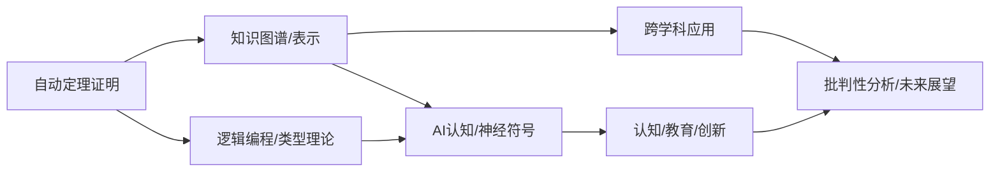

---

#### 7.5.7 案例与实操：跨学科应用与前沿创新深度实践

##### 7.5.7.1 跨学科AI应用实例（医学知识图谱辅助诊断）

- **问题描述**：利用医学知识图谱辅助疾病诊断与治疗推荐。
- **流程**：
  1. 构建医学实体（疾病、症状、药物、检查等）及其关系（如"导致" "缓解" "适应症"）。
  2. 融合多源医学数据，抽取三元组，构建知识图谱。
  3. 患者症状输入后，系统自动推理可能疾病及推荐检查/治疗方案。
- **SPARQL查询示例**

```sparql
SELECT ?disease WHERE {
  ?disease ex:hasSymptom ex:Fever .
  ?disease ex:hasSymptom ex:Cough .
}
```

- **推理结果**：返回所有同时具备"发热" "咳嗽"症状的疾病。

##### 7.5.7.2 知识融合与多模态推理流程

- **Mermaid结构图**：

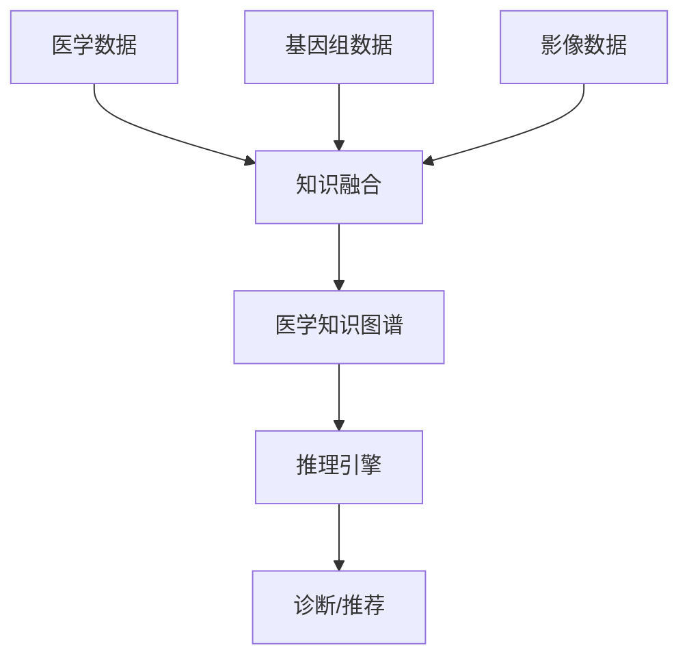

##### 7.5.7.3 结构化批判与实用建议

- **优势**：跨学科AI应用促进知识迁移、创新发现、复杂系统建模与智能决策。
- **局限**：数据异构性、知识融合难题、推理复杂度、跨领域本体对齐。
- **实用建议**：
  - 结合实际领域（医学、物理、社会科学等）进行知识图谱与AI推理实操。
  - 利用Mermaid等工具可视化知识融合与推理流程，提升理解与教学效果。
  - 鼓励学生/研究者尝试跨学科知识建模与创新应用。

> **相关主题跳转：**
>
> - [知识图谱/表示](#72-知识表示知识图谱与本体论)
> - [AI认知/神经符号](#74-ai认知神经符号与推理机制)
> - [批判性分析/未来展望](#77-批判性分析与未来展望)

---
