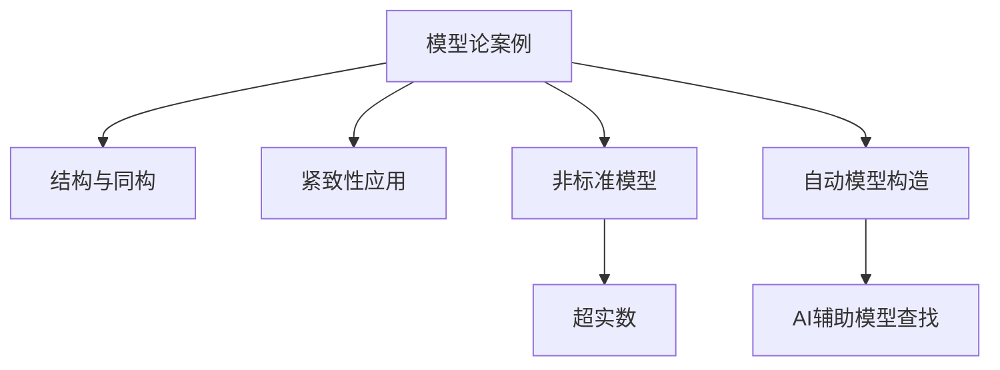

# 02-案例分析

本文件将收录模型论领域的典型案例、经典证明、重要争议及其详细分析。

## 2.4.2 模型论案例分析

[返回总览](../00-数学基础与逻辑总览.md)

## 2.4.2.1 典型模型与结构案例

// ... existing code ...

## 2.4.2.2 相关主题与本地跳转

- 详见 [00-数学基础与逻辑总览.md](../00-数学基础与逻辑总览.md) 2.4 模型论
- 相关主题：[01-基础理论.md](01-基础理论.md)、[03-相关证明与引用.md](03-相关证明与引用.md)

## 2.4.2.3 参考文献与资源

// ... existing code ...

## 2.4.2.4 多表征内容

- **Mermaid 结构图：模型论典型案例与分支关系**



- **Lean 代码示例：结构同构的定义**

```lean
structure isomorphism (M N : Type*) :=
  (to_fun : M → N)
  (inv_fun : N → M)
  (left_inv : ∀ x, inv_fun (to_fun x) = x)
  (right_inv : ∀ y, to_fun (inv_fun y) = y)
```

- **Coq 代码示例：模型的极小实现**

```coq
Record Model := {
  domain : Type;
  interp : string -> list domain -> domain
}.
```

- **表格：典型模型论案例与方法对比**

| 案例类型     | 主要方法     | 关键特征         | 代表工具/语言 |
| ---- | ---- | ---- | ---- |
| 结构同构     | 映射、证明   | 保持结构、可逆   | Lean, Coq     |
| 紧致性应用   | 逻辑推理     | 局部到整体       | Prover9       |
| 非标准模型   | 扩展、饱和   | 超实数、非标准   | Haskell, Lean |
| 自动模型构造 | 算法、AI     | 自动查找、验证   | Prover9, AI   |

- **AI/认知/教育视角**
  - AI可自动查找和验证模型，提升了复杂结构的分析能力。
  - 认知科学关注模型构造与理解的心理过程，教育中强调案例驱动的模型化训练。
  - 自动化工具助力模型论案例的教学与研究。

## 2.4.2.5 参考文献与资源

- **经典文献**
  1. Chang, C. C., & Keisler, H. J. (1990). Model theory. Elsevier.
  2. Robinson, A. (1966). Non-standard analysis. North-Holland.

- **现代文献与在线资源**
  1. Hodges, W. (1993). Model theory. Cambridge University Press.
  2. [Prover9 官方文档](https://www.cs.unm.edu/~mccune/prover9/)
  3. [Lean 官方文档](https://leanprover.github.io/)
  4. [Coq 官方文档](https://coq.inria.fr/documentation)

- **工具与平台**
  - Lean, Coq, Prover9, Haskell, AI

---

[返回总览](00-模型论总览.md) | [基础理论](01-基础理论.md) | [相关证明与引用](03-相关证明与引用.md)
