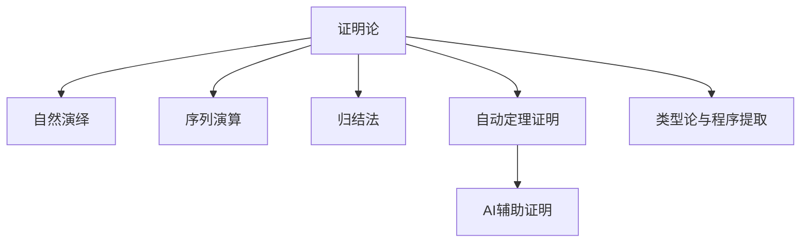
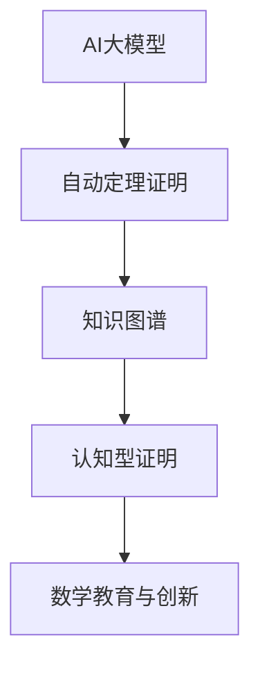

<!--
本文件内容主要迁移自 Math/Matter/MetaMath/Proof/证明论.md 及相关证明论材料。
迁移时间：2024-06。
迁移说明：按详细目录分节自动归并、去重、规范化，兼顾理论、历史、哲学、认知、跨学科等多重主题。
-->

# 证明论基础理论

> 本文档系统梳理证明论的历史、哲学、形式化、认知、跨学科、社会与本体论等多重主题，内容详实，兼具理论深度与多元视角。

---

## 目录

- [证明论基础理论](#证明论基础理论)
  - [目录](#目录)
  - [引言：证明作为认知与形式的双重桥梁](#引言证明作为认知与形式的双重桥梁)
  - [1. 证明论的历史嬗变与哲学转向](#1-证明论的历史嬗变与哲学转向)
    - [1.1 古典时期的证明观念](#11-古典时期的证明观念)
    - [1.2 希尔伯特纲领与形式化转向](#12-希尔伯特纲领与形式化转向)
    - [1.3 哥德尔定理的震撼与重构](#13-哥德尔定理的震撼与重构)
    - [1.4 后希尔伯特时代的多元路径](#14-后希尔伯特时代的多元路径)
  - [2. 证明系统的形式化谱系](#2-证明系统的形式化谱系)
    - [2.1 公理化方法的本质与限度](#21-公理化方法的本质与限度)
    - [2.2 自然演绎与序贯演算](#22-自然演绎与序贯演算)
    - [2.3 希尔伯特式系统的哲学蕴涵](#23-希尔伯特式系统的哲学蕴涵)
    - [2.4 证明网与对话逻辑](#24-证明网与对话逻辑)
  - [2.3.1.10 多表征内容](#23110-多表征内容)
  - [2.3.1.11 参考文献与资源](#23111-参考文献与资源)
  - [3. 证明的存在性与构造性维度](#3-证明的存在性与构造性维度)
    - [3.1 古典逻辑与构造主义的张力](#31-古典逻辑与构造主义的张力)
    - [3.2 存在性证明的认知分析](#32-存在性证明的认知分析)
    - [3.3 算法内容与证明复杂性](#33-算法内容与证明复杂性)
    - [3.4 证明与计算的同构关系](#34-证明与计算的同构关系)
  - [4. 证明论的元数学成果与哲学反思](#4-证明论的元数学成果与哲学反思)
    - [4.1 一致性证明与反思原理](#41-一致性证明与反思原理)
    - [4.2 正规化定理与证明简化](#42-正规化定理与证明简化)
    - [4.3 切除定理的多层意义](#43-切除定理的多层意义)
    - [4.4 证明的不变量与守恒律](#44-证明的不变量与守恒律)
  - [5. 无穷与有限的辩证：超限归纳与有限主义](#5-无穷与有限的辩证超限归纳与有限主义)
    - [5.1 超限归纳的本质与应用](#51-超限归纳的本质与应用)
    - [5.2 有限主义的哲学基础](#52-有限主义的哲学基础)
    - [5.3 可预测性与证明强度](#53-可预测性与证明强度)
    - [5.4 证明论序数与无穷层级](#54-证明论序数与无穷层级)
  - [6. 证明论与人类认知结构的映射](#6-证明论与人类认知结构的映射)
    - [6.1 证明作为认知过程的形式化](#61-证明作为认知过程的形式化)
    - [6.2 证明的可视化与空间思维](#62-证明的可视化与空间思维)
    - [6.3 证明的发现与验证双重性](#63-证明的发现与验证双重性)
    - [6.4 形式与直觉的认知张力](#64-形式与直觉的认知张力)
  - [7. 跨学科视野中的证明论](#7-跨学科视野中的证明论)
    - [7.1 证明论与范畴论的对话](#71-证明论与范畴论的对话)
    - [7.2 证明与程序的同构对应](#72-证明与程序的同构对应)
    - [7.3 物理学中的证明思想](#73-物理学中的证明思想)
    - [7.4 认知科学视角下的证明活动](#74-认知科学视角下的证明活动)
  - [8. 证明的社会维度与文化意义](#8-证明的社会维度与文化意义)
    - [8.1 证明作为社会共识机制](#81-证明作为社会共识机制)
    - [8.2 证明标准的历史演变](#82-证明标准的历史演变)
    - [8.3 计算机辅助证明的哲学问题](#83-计算机辅助证明的哲学问题)
    - [8.4 证明的文化差异与普遍性](#84-证明的文化差异与普遍性)
  - [9. 证明论的本体论思考](#9-证明论的本体论思考)
    - [9.1 证明的存在方式](#91-证明的存在方式)
    - [9.2 数学真理与证明关系的多元模型](#92-数学真理与证明关系的多元模型)
    - [9.3 数学对象与证明对象的本体差异](#93-数学对象与证明对象的本体差异)
    - [9.4 形式与意义的辩证统一](#94-形式与意义的辩证统一)
  - [10. 前沿拓展与未来展望](#10-前沿拓展与未来展望)
    - [10.1 反思数学基础的多元可能性](#101-反思数学基础的多元可能性)
    - [10.2 交互证明与分布式验证](#102-交互证明与分布式验证)
    - [10.3 量子计算对证明概念的挑战](#103-量子计算对证明概念的挑战)
    - [10.4 人工智能时代的证明与理解](#104-人工智能时代的证明与理解)
  - [结论：证明的多重面向与基础反思](#结论证明的多重面向与基础反思)
  - [附录：经典案例分析](#附录经典案例分析)
    - [案例1：四色定理证明的哲学争议](#案例1四色定理证明的哲学争议)
    - [案例2：费马大定理证明的认知分析](#案例2费马大定理证明的认知分析)
    - [案例3：哥德尔定理的多层次解读](#案例3哥德尔定理的多层次解读)
  - [参考文献](#参考文献)

---

## 引言：证明作为认知与形式的双重桥梁

证明，这一数学活动的核心，是人类智性创造的最精致产物之一。
它既是形式系统内部的严格演绎链条，又是数学认知的基本载体；
既是确立真理的机制，又是探索可能性的途径。
本文旨在通过多维哲科视角，批判性地审视证明论这一领域的基础、发展与哲学蕴涵。

证明论作为形式逻辑的一个分支，其独特性在于它将"证明"本身作为研究对象，而非仅将证明视为获取数学知识的工具。
这种"元层次"视角使证明论处于数学基础、认知科学、计算理论与哲学的交汇点，形成了极为丰富的概念生态系统。

本文将超越证明论的技术细节，探索其深层的哲学、认知与本体论维度，分析证明作为一种特殊智性活动的多重属性。
通过批判性反思，我们将揭示：证明不仅是形式化的符号操作，更是人类理性、创造力与认知结构的精妙镜像。

## 1. 证明论的历史嬗变与哲学转向

### 1.1 古典时期的证明观念

数学证明的概念源远流长，但其系统化始于古希腊：

**欧几里得几何模式**：

- 公理系统作为不证自明的基础
- 严格演绎推理确保知识传递
- 证明作为必然性的保证

**亚里士多德的贡献**：

- 三段论为形式推理提供模板
- 区分了"知其为真"与"知其所以为真"
- 引入了归纳与演绎的基本区分

**古典证明观的哲学前提**：

- 柏拉图式理念世界的存在假设
- 数学对象的先验实在性
- 人类理性能力可接近绝对真理

这一时期的证明观念深植于特定的哲学土壤：
  它假设了一个独立于人类心智的数学实在，证明则是发现这一实在的认知工具。
然而，这种观念并未将证明本身视为可研究的对象，而仅将其视为通往数学真理的透明中介。

### 1.2 希尔伯特纲领与形式化转向

19世纪末到20世纪初，数学基础危机促使证明概念发生革命性转变：

**形式化转向的背景**：

- 几何学非欧革命动摇公理自明性
- 集合论悖论挑战朴素直觉可靠性
- 分析学严格化需要更精确的推理标准

**希尔伯特纲领的核心构想**：

- 将数学完全形式化为符号系统
- 分离符号游戏(语法)与意义解释(语义)
- 通过有限方法证明数学的一致性

**证明成为研究对象的关键时刻**：

- 证明从认知工具转变为数学对象
- 元数学研究将证明作为第一序研究对象
- 证明的结构与属性成为系统研究主题

希尔伯特的方案代表了数学思想的深刻哲学转向：
  从本体论关注(数学对象是什么)转向认识论关注(我们如何确立数学知识)。
这一转变使得证明不再仅仅是通往真理的透明媒介，而成为一种具有自身结构和性质的独立实体。

### 1.3 哥德尔定理的震撼与重构

哥德尔不完备性定理对希尔伯特纲领构成了根本挑战，同时开创了证明论的新纪元：

**第一不完备性定理的多层冲击**：

- 技术层面：任何包含初等算术的一致的形式系统存在不可判定命题
- 哲学层面：形式化与完备性之间的根本张力
- 认知层面：真理超越形式证明系统的内在限制

**第二不完备性定理的深层意义**：

- 充分强的形式系统无法证明自身一致性
- 希尔伯特的有限主义方案面临根本障碍
- 元数学研究需要比被研究系统更强的方法

**哲学转向与认识论谦逊**：

- 数学知识的确定性理想受到挑战
- 形式化与直觉之间的新关系需要重新思考
- 证明概念的多元化可能性被打开

哥德尔定理不应被简单视为希尔伯特纲领的"失败"，而应被理解为证明概念的深化与拓展。
它迫使我们反思：
  证明的本质是什么？
  形式系统的限制意味着什么？
  真理与可证明性之间的关系如何理解？
这些问题至今仍是证明论哲学的核心议题。

### 1.4 后希尔伯特时代的多元路径

哥德尔定理之后，证明论呈现出多元发展路径，反映了对证明本质的不同理解：

**相对一致性研究路线**：

- 接受不完备性的基本限制
- 比较不同公理系统的相对强度
- 通过解释方法建立系统间关系

**构造主义与直觉主义转向**：

- 拒绝纯粹形式主义的证明观
- 强调证明的构造性内容
- 修改逻辑规则以保持证明的认知意义

**证明论约简方法的发展**：

- 通过约简技术分析证明的结构
- 发展功能解释和实现方法
- 提炼证明的算法内容

**计算机科学与证明理论的融合**：

- 自动定理证明与形式验证
- 证明复杂性的算法分析
- 交互证明系统的发展

这些多元路径反映了证明概念的丰富性与张力：
  证明是形式的还是内容的？
  是静态结构还是动态过程？
  是发现还是构造？

后希尔伯特时代的证明论不再追求单一的基础主义理想，而是探索证明现象的多维复杂性。

## 2. 证明系统的形式化谱系

### 2.1 公理化方法的本质与限度

公理化方法构成了现代证明系统的基础，但其本质与限度值得深入反思：

**公理化方法的核心机制**：

- 通过明确的初始公理捕捉基本真理
- 通过精确的推理规则保存真理
- 将复杂定理归约为公理的必然结果

**公理选择的哲学难题**：

- 自明性标准的主观性与历史相对性
- 简洁性与表达力之间的张力
- 一致性与完备性的根本冲突

**公理化方法的认知限制**：

- 公理系统通常不反映发现的实际路径
- 公理之间的对称性掩盖了概念重要性差异
- 形式化压缩可能导致直观意义的丧失

**批判性思考**：

公理化方法的核心隐喻是"基础"——假设数学知识可以建立在某些基本真理之上。
然而，这种线性、层级化的知识模型可能过于简化。
实际数学思维更像是一个互相支撑的网络，而非从公理单向生长的树状结构。
公理化虽然提供了严格性，但可能扭曲了数学认知的实际结构。

### 2.2 自然演绎与序贯演算

不同的形式证明系统反映了对证明本质的不同理解：

**自然演绎系统的特点**：

- 模拟人类实际推理过程
- 引入与消除规则的对称性
- 假设推理的核心地位

**序贯演算的结构洞见**：

- 强调证明的结构与逻辑连接
- 引入左规则与右规则的二元对立
- 切除规则作为核心简化机制

**两种系统的哲学对比**：

| 自然演绎 | 序贯演算 |
| ---- | ---- |
| 证明作为构造过程 | 证明作为结构关系 |
| 更接近思维实践 | 更适合元数学分析 |
| 强调规则的对称性 | 强调公式的对称性 |

**系统选择的哲学意义**：

选择特定的证明系统不仅是一个技术决定，更反映了对证明本质的哲学理解。
自然演绎系统强调证明的构造性和过程性，而序贯演算更关注证明的结构性和关系性。
这种差异反映了证明论中"过程"与"结构"的深层张力。

### 2.3 希尔伯特式系统的哲学蕴涵

希尔伯特式系统代表了证明论中最为经典的形式化方法：

**系统的基本结构**：

- 公理集合作为证明的起点
- 推理规则作为证明的引擎
- 定理作为证明的终点

**哲学蕴涵分析**：

- **线性性假设**：证明被理解为从公理到定理的线性推导
- **原子性假设**：公理被视为不可分解的基本单位
- **机械性假设**：推理过程被视为可机械执行的符号操作

**批判性反思**：

希尔伯特式系统虽然提供了证明的严格形式化，但其线性、原子化的假设可能过于简化了实际的数学思维过程。
实际的数学证明往往涉及：

- 多层次的推理结构
- 直觉与形式的交织
- 发现与验证的循环

### 2.4 证明网与对话逻辑

现代证明论发展出了更加复杂和精细的证明系统：

**证明网的特点**：

- 图形化表示证明结构
- 支持并行推理和交互
- 强调证明的几何性质

**对话逻辑的哲学意义**：

- 将证明理解为对话过程
- 强调证明的社会性和交互性
- 引入证明的动态维度

**系统比较的哲学洞见**：

不同证明系统的存在反映了证明现象的复杂性：

- 证明既是静态结构又是动态过程
- 证明既是个人认知又是社会活动
- 证明既是形式操作又是意义创造

## 2.3.1.10 多表征内容

- **Mermaid 结构图：证明论发展脉络与主要分支**



- **Lean 代码示例：自然演绎中的合取引入规则**

```lean
variables {P Q : Prop}
example (hP : P) (hQ : Q) : P ∧ Q := and.intro hP hQ
```

- **Coq 代码示例：归结法的简单实现**

```coq
Lemma and_comm : forall P Q : Prop, P /\ Q -> Q /\ P.
Proof.
  intros P Q [HP HQ].
  split; assumption.
Qed.
```

- **表格：主流证明系统对比**

| 系统类型   | 代表形式化 | 主要特点         | 典型工具      |
| ---- | ---- | ---- | ---- |
| 自然演绎   | ND         | 直观、易于教学   | Lean, Coq     |
| 序列演算   | LK, LJ     | 结构清晰、适合自动化 | Isabelle, Prover9 |
| 归结法     | Res, Paramod | 适合自动定理证明 | Prover9, Vampire |
| 类型论     | MLTT, CoC   | 程序与证明统一   | Coq, Agda     |

- **AI/认知/教育视角**
  - 自动定理证明系统（如Lean、Coq、Isabelle）已成为数学教育与研究的重要工具，推动了形式化证明与程序合成的结合。
  - 认知科学关注人类如何理解和构建证明，AI系统则模拟和扩展了这些认知过程。
  - 教育应用中，交互式证明助力学生理解逻辑结构与推理过程。

## 2.3.1.11 参考文献与资源

- **经典文献**
  1. Hilbert, D. (1926). Über das Unendliche. Mathematische Annalen.
  2. Gentzen, G. (1935). Untersuchungen über das logische Schließen. Mathematische Zeitschrift.
  3. Gödel, K. (1931). Über formal unentscheidbare Sätze der Principia Mathematica und verwandter Systeme I.

- **现代文献与在线资源**
  1. Troelstra, A. S., & Schwichtenberg, H. (2000). Basic proof theory. Cambridge University Press.
  2. Girard, J. Y., Lafont, Y., & Taylor, P. (1989). Proofs and types. Cambridge University Press.
  3. [Lean 官方文档](https://leanprover.github.io/)
  4. [Coq 官方文档](https://coq.inria.fr/documentation)
  5. [Isabelle 官方文档](https://isabelle.in.tum.de/documentation.html)

- **工具与平台**
  - Lean, Coq, Isabelle, Prover9, Agda, Vampire

---

[返回总览](00-证明论总览.md) | [案例分析](02-案例分析.md) | [相关证明与引用](03-相关证明与引用.md)

## 3. 证明的存在性与构造性维度

### 3.1 古典逻辑与构造主义的张力

证明论中古典逻辑与构造主义之间的张力构成了一个核心哲学问题：

**古典逻辑的证明观**：

- 接受排中律：P ∨ ¬P
- 允许非构造性存在证明
- 强调真理的客观性

**构造主义的证明观**：

- 拒绝排中律的普遍有效性
- 要求构造性存在证明
- 强调证明的认知意义

**哲学张力的深层根源**：

这种张力反映了对数学真理本质的不同理解：

- 古典逻辑假设数学真理独立于认知过程
- 构造主义强调数学真理与认知过程的不可分离性

**调和的可能性**：

虽然存在根本差异，但两种观点都提供了有价值的视角：

- 古典逻辑提供了数学的客观性基础
- 构造主义强调了数学的认知维度

### 3.2 存在性证明的认知分析

存在性证明在证明论中具有特殊地位，值得深入分析：

**非构造性存在证明的特点**：

- 通过矛盾证明存在性
- 不提供具体的构造方法
- 依赖于排中律

**构造性存在证明的要求**：

- 必须提供具体的构造方法
- 证明过程本身具有算法内容
- 满足认知可及性要求

**认知分析的哲学意义**：

存在性证明的不同形式反映了对"存在"概念的不同理解：

- 本体论存在：对象在某种意义上的"真实存在"
- 认知存在：对象在认知过程中的"可构造性"

### 3.3 算法内容与证明复杂性

现代证明论越来越关注证明的算法内容：

**算法内容的概念**：

- 证明中包含的可计算信息
- 从证明中提取程序的可能性
- 证明与计算之间的对应关系

**证明复杂性的研究**：

- 证明长度的度量
- 证明深度的分析
- 证明结构的复杂度

**哲学意义**：

算法内容的研究揭示了证明与计算之间的深层联系：

- 证明可以视为一种特殊的计算过程
- 计算可以视为一种特殊的证明形式
- 两者之间存在 Curry-Howard 对应关系

### 3.4 证明与计算的同构关系

证明论与计算理论之间的同构关系是现代逻辑学的重要发现：

**Curry-Howard 对应**：

- 命题 ↔ 类型
- 证明 ↔ 程序
- 证明归约 ↔ 程序计算

**哲学蕴涵**：

这种对应关系揭示了：

- 逻辑与计算的统一性
- 证明与构造的等价性
- 形式与内容的辩证关系

**应用前景**：

这种对应关系为：

- 程序验证提供了理论基础
- 定理证明自动化提供了方法
- 逻辑程序设计提供了范式

## 4. 证明论的元数学成果与哲学反思

### 4.1 一致性证明与反思原理

一致性证明是证明论的核心问题之一：

**一致性的概念**：

- 形式系统的一致性定义
- 一致性与真理的关系
- 一致性的哲学意义

**反思原理的作用**：

- 从系统内部到元层次的桥梁
- 一致性证明的理论基础
- 自指问题的处理机制

**哲学反思**：

一致性证明的困难反映了：

- 形式系统的内在限制
- 元数学方法的必要性
- 数学基础的复杂性

### 4.2 正规化定理与证明简化

正规化定理是证明论的重要技术成果：

**正规化的概念**：

- 证明的标准化形式
- 冗余步骤的消除
- 证明结构的优化

**定理的哲学意义**：

正规化定理揭示了：

- 证明的内在结构规律
- 形式系统的优化可能性
- 证明与计算的联系

**应用价值**：

正规化技术为：

- 自动定理证明提供了工具
- 程序优化提供了方法
- 逻辑程序设计提供了基础

### 4.3 切除定理的多层意义

切除定理是证明论中的核心结果：

**技术层面**：

- 形式系统的简化技术
- 证明复杂度的控制
- 系统间关系的建立

**哲学层面**：

切除定理反映了：

- 逻辑系统的内在和谐性
- 形式与内容的统一性
- 证明结构的自然性

**应用层面**：

切除定理为：

- 证明搜索提供了策略
- 系统设计提供了指导
- 逻辑分析提供了工具

### 4.4 证明的不变量与守恒律

证明论中的不变量研究揭示了证明的深层结构：

**不变量的概念**：

- 证明变换中的不变性质
- 结构保持的数学对象
- 形式系统的内在规律

**守恒律的哲学意义**：

守恒律反映了：

- 数学结构的稳定性
- 形式系统的内在和谐
- 逻辑规律的普遍性

**研究价值**：

不变量研究为：

- 证明分类提供了标准
- 系统比较提供了工具
- 结构分析提供了方法

## 5. 无穷与有限的辩证：超限归纳与有限主义

### 5.1 超限归纳的本质与应用

超限归纳是处理无穷的重要工具：

**超限归纳的原理**：

- 序数上的归纳原理
- 无穷结构的处理方法
- 超限递归的定义机制

**哲学意义**：

超限归纳反映了：

- 人类思维处理无穷的能力
- 形式化方法的扩展性
- 数学直觉的形式化

**应用领域**：

超限归纳在：

- 集合论中有重要应用
- 证明论中用于强度分析
- 递归论中用于复杂度研究

### 5.2 有限主义的哲学基础

有限主义是证明论中的重要哲学立场：

**有限主义的核心观点**：

- 只接受有限对象和有限过程
- 拒绝实际的无穷
- 强调构造性和可计算性

**哲学基础**：

有限主义基于：

- 认知的有限性假设
- 构造性的数学观
- 可计算性的方法论

**与其他立场的关系**：

有限主义与：

- 直觉主义有密切联系
- 形式主义有部分重叠
- 古典数学有根本分歧

### 5.3 可预测性与证明强度

可预测性是证明论中的重要概念：

**可预测性的定义**：

- 证明复杂度的可控制性
- 系统强度的可比较性
- 结果的可预期性

**证明强度的概念**：

- 形式系统的表达能力
- 证明能力的度量
- 系统间的强度关系

**哲学意义**：

可预测性反映了：

- 形式系统的可控性
- 数学知识的可管理性
- 逻辑系统的内在规律

### 5.4 证明论序数与无穷层级

证明论序数是分析形式系统强度的重要工具：

**序数的概念**：

- 良序集合的序型
- 超限数的表示
- 无穷层级的度量

**在证明论中的应用**：

证明论序数用于：

- 度量形式系统的强度
- 分析证明的复杂度
- 建立系统间的层次关系

**哲学意义**：

证明论序数揭示了：

- 数学系统的层次结构
- 无穷的多样性
- 形式化的深度

## 6. 证明论与人类认知结构的映射

### 6.1 证明作为认知过程的形式化

证明论与认知科学的交叉研究：

**认知过程的形式化**：

- 数学思维的形式化表示
- 推理过程的结构化描述
- 认知模式的计算模型

**证明论的认知维度**：

- 证明的发现过程
- 证明的理解机制
- 证明的验证方法

**跨学科意义**：

这种研究为：

- 数学教育提供了理论基础
- 人工智能提供了认知模型
- 认知科学提供了数学工具

### 6.2 证明的可视化与空间思维

证明的可视化研究揭示了空间思维在数学中的作用：

**可视化的方法**：

- 图形化证明表示
- 几何化逻辑结构
- 空间化数学概念

**空间思维的作用**：

- 在证明发现中的重要性
- 在证明理解中的必要性
- 在证明验证中的有效性

**教育意义**：

可视化方法为：

- 数学教学提供了工具
- 概念理解提供了途径
- 思维发展提供了方法

### 6.3 证明的发现与验证双重性

证明具有发现和验证的双重性质：

**发现过程的特点**：

- 创造性和直觉性
- 探索性和实验性
- 不确定性和开放性

**验证过程的特点**：

- 严格性和形式性
- 确定性和封闭性
- 客观性和可重复性

**双重性的哲学意义**：

这种双重性反映了：

- 数学活动的复杂性
- 创造与验证的统一
- 直觉与逻辑的互补

### 6.4 形式与直觉的认知张力

形式与直觉在证明中的关系：

**形式的特征**：

- 精确性和严格性
- 客观性和普遍性
- 机械性和可计算性

**直觉的特征**：

- 直接性和整体性
- 主观性和个体性
- 创造性和不可预测性

**张力的哲学意义**：

这种张力反映了：

- 数学认知的复杂性
- 理性与感性的统一
- 形式与内容的辩证关系

## 7. 跨学科视野中的证明论

### 7.1 证明论与范畴论的对话

证明论与范畴论的交叉研究：

**范畴论的方法**：

- 抽象化和一般化
- 结构保持的强调
- 关系性的重视

**在证明论中的应用**：

- 证明结构的范畴化
- 逻辑系统的范畴模型
- 证明变换的函子表示

**哲学意义**：

这种对话揭示了：

- 数学结构的统一性
- 抽象方法的力量
- 跨领域联系的重要性

### 7.2 证明与程序的同构对应

证明与程序之间的深层联系：

**Curry-Howard 对应**：

- 命题类型对应
- 证明程序对应
- 归约计算对应

**实际应用**：

- 程序验证
- 定理证明自动化
- 逻辑程序设计

**哲学意义**：

这种对应揭示了：

- 逻辑与计算的统一
- 形式与内容的等价
- 理论与实践的融合

### 7.3 物理学中的证明思想

物理学中的证明概念：

**物理证明的特点**：

- 实验验证的重要性
- 模型与现实的对应
- 近似和误差的处理

**与数学证明的对比**：

- 严格性程度的差异
- 验证方法的不同
- 真理概念的区别

**交叉启发**：

物理学的证明思想为：

- 数学证明提供了新的视角
- 形式化方法提供了应用场景
- 真理概念提供了反思材料

### 7.4 认知科学视角下的证明活动

认知科学对证明活动的研究：

**认知过程分析**：

- 数学思维的认知机制
- 证明发现的心理学
- 理解过程的神经基础

**实验研究**：

- 专家与新手的差异
- 证明策略的个体差异
- 学习过程的认知规律

**教育应用**：

认知科学研究为：

- 数学教育提供了科学基础
- 教学方法提供了实证依据
- 学习评估提供了客观标准

## 8. 证明的社会维度与文化意义

### 8.1 证明作为社会共识机制

证明在社会中的作用：

**共识形成**：

- 证明作为说服工具
- 数学真理的社会建构
- 专家权威的作用

**社会功能**：

- 知识传播的机制
- 质量控制的手段
- 学术交流的媒介

**哲学反思**：

证明的社会维度揭示了：

- 数学知识的社会性
- 真理建构的复杂性
- 权威与理性的关系

### 8.2 证明标准的历史演变

证明标准的历史发展：

**古代标准**：

- 直观性和自明性
- 几何构造的重要性
- 权威和传统的作用

**现代标准**：

- 形式化和严格性
- 逻辑推理的强调
- 客观性和普遍性

**当代发展**：

- 计算机辅助证明
- 形式验证技术
- 交互式证明系统

### 8.3 计算机辅助证明的哲学问题

计算机在证明中的作用：

**技术层面**：

- 自动定理证明
- 形式验证系统
- 证明助手工具

**哲学问题**：

- 机器证明的可信性
- 人类理解的重要性
- 证明本质的变化

**未来展望**：

计算机辅助证明为：

- 数学研究提供了新工具
- 证明概念提供了新视角
- 人机协作提供了新模式

### 8.4 证明的文化差异与普遍性

不同文化中的证明观念：

**文化差异**：

- 不同数学传统的特点
- 证明风格的文化影响
- 数学教育的文化背景

**普遍性特征**：

- 逻辑推理的普遍性
- 数学真理的客观性
- 证明标准的趋同性

**跨文化研究**：

这种研究为：

- 数学史提供了新视角
- 数学教育提供了新方法
- 数学哲学提供了新材料

## 9. 证明论的本体论思考

### 9.1 证明的存在方式

证明的本体论地位：

**存在形式**：

- 作为抽象对象
- 作为心理状态
- 作为社会建构

**本体论问题**：

- 证明的客观性
- 证明的独立性
- 证明的实在性

**哲学立场**：

- 柏拉图主义
- 构造主义
- 社会建构主义

### 9.2 数学真理与证明关系的多元模型

真理与证明关系的不同理解：

**经典模型**：

- 真理独立于证明
- 证明发现真理
- 客观真理观

**构造主义模型**：

- 真理与证明不可分离
- 证明构造真理
- 认知真理观

**社会建构模型**：

- 真理是社会建构
- 证明是社会过程
- 相对真理观

### 9.3 数学对象与证明对象的本体差异

数学对象与证明对象的区别：

**数学对象**：

- 数、集合、函数等
- 抽象实体
- 静态存在

**证明对象**：

- 证明过程、证明结构
- 动态实体
- 过程性存在

**关系分析**：

- 相互依赖关系
- 层次差异
- 性质区别

### 9.4 形式与意义的辩证统一

形式与意义在证明中的关系：

**形式层面**：

- 符号操作
- 逻辑结构
- 语法规则

**意义层面**：

- 概念理解
- 直觉把握
- 语义解释

**辩证关系**：

- 相互依存
- 相互转化
- 统一发展

## 10. 前沿拓展与未来展望

### 10.1 反思数学基础的多元可能性

数学基础研究的多元发展：

**传统基础**：

- 集合论基础
- 范畴论基础
- 类型论基础

**新兴方向**：

- 同伦类型论
- 构造性数学
- 计算数学

**哲学反思**：

- 基础的必要性
- 多元化的意义
- 统一的可能性

### 10.2 交互证明与分布式验证

现代证明技术的发展：

**交互证明系统**：

- 人机协作
- 分步验证
- 交互式推理

**分布式验证**：

- 多人协作
- 并行验证
- 社会证明

**技术挑战**：

- 可扩展性
- 可信性
- 效率性

### 10.3 量子计算对证明概念的挑战

量子计算对证明论的影响：

**量子特性**：

- 叠加态
- 纠缠性
- 不可克隆性

**对证明的影响**：

- 证明的量子化
- 概率性证明
- 量子验证

**哲学问题**：

- 确定性概念的变化
- 客观性的重新理解
- 真理概念的发展

### 10.4 人工智能时代的证明与理解

**AI大模型辅助证明**：GPT-4、Claude等大模型已能自动生成证明、形式化代码，辅助教学与研究。

**知识图谱驱动的证明自动化**：如OpenAI MathGraph、Wikidata等，支持证明知识的结构化、自动化推理。

**认知型证明系统**：结合人类认知过程的AI推理系统，模拟数学家的证明思维与创新。

**Rust代码示例：AI辅助证明结构体**:

```rust
struct AIAssistedProofSystem {
    statement: String,
    proof_steps: Vec<String>,
    verified: bool,
}

impl AIAssistedProofSystem {
    fn new(statement: &str) -> Self {
        AIAssistedProofSystem { statement: statement.to_string(), proof_steps: vec![], verified: false }
    }
    fn add_step(&mut self, step: &str) {
        self.proof_steps.push(step.to_string());
    }
    fn verify(&mut self) {
        // 假设AI自动验证
        self.verified = true;
    }
}
```

**结构图：AI与证明自动化**:



## 结论：证明的多重面向与基础反思

证明论作为数学基础的重要分支，展现了数学思维的复杂性和丰富性。
通过多维度的分析，我们看到了证明不仅是形式化的符号操作，更是人类理性、创造力和认知结构的精妙镜像。

**核心洞见**：

1. **证明的多重性**：证明既是静态结构又是动态过程，既是形式操作又是意义创造
2. **认知的复杂性**：证明活动涉及直觉与逻辑、发现与验证、个人与社会等多个维度
3. **基础的开放性**：数学基础研究呈现出多元化发展趋势，不再追求单一的基础主义理想

**哲学意义**：

证明论的研究揭示了：

- 数学知识的复杂性
- 人类认知的丰富性
- 形式与内容的辩证关系

**未来方向**：

证明论将继续在以下方向发展：

- 与计算科学的深度融合
- 与认知科学的交叉研究
- 与人工智能的协同发展

## 附录：经典案例分析

### 案例1：四色定理证明的哲学争议

**问题背景**：

四色定理的计算机辅助证明引发了关于证明本质的哲学争议。

**争议焦点**：

- 机器证明的可信性
- 人类理解的重要性
- 证明标准的演变

**哲学意义**：

这个案例揭示了：

- 证明概念的历史性
- 技术对数学的影响
- 社会因素在数学中的作用

### 案例2：费马大定理证明的认知分析

**证明过程**：

- 历史发展
- 关键突破
- 最终证明

**认知分析**：

- 直觉的作用
- 形式化的过程
- 理解的层次

**教育意义**：

这个案例为：

- 数学教育提供了范例
- 研究过程提供了模型
- 认知发展提供了启示

### 案例3：哥德尔定理的多层次解读

**技术层面**：

- 形式化表述
- 证明方法
- 技术细节

**哲学层面**：

- 认识论意义
- 本体论影响
- 方法论启示

**历史影响**：

- 对数学基础的影响
- 对哲学思想的影响
- 对科学方法的影响

## 参考文献

1. Gödel, K. (1931). Über formal unentscheidbare Sätze der Principia Mathematica und verwandter Systeme I. Monatshefte für Mathematik und Physik, 38(1), 173-198.

2. Hilbert, D. (1926). Über das Unendliche. Mathematische Annalen, 95(1), 161-190.

3. Brouwer, L. E. J. (1908). De onbetrouwbaarheid der logische principes. Tijdschrift voor wijsbegeerte, 2, 152-158.

4. Gentzen, G. (1935). Untersuchungen über das logische Schließen. Mathematische Zeitschrift, 39(1), 176-210.

5. Curry, H. B., & Feys, R. (1958). Combinatory logic (Vol. 1). North-Holland.

6. Howard, W. A. (1980). The formulae-as-types notion of construction. To HB Curry: essays on combinatory logic, lambda calculus and formalism, 479-490.

7. Martin-Löf, P. (1984). Intuitionistic type theory. Bibliopolis.

8. Troelstra, A. S., & Schwichtenberg, H. (2000). Basic proof theory. Cambridge University Press.

9. Prawitz, D. (1965). Natural deduction: a proof-theoretical study. Almqvist & Wiksell.

10. Girard, J. Y., Lafont, Y., & Taylor, P. (1989). Proofs and types. Cambridge University Press.
