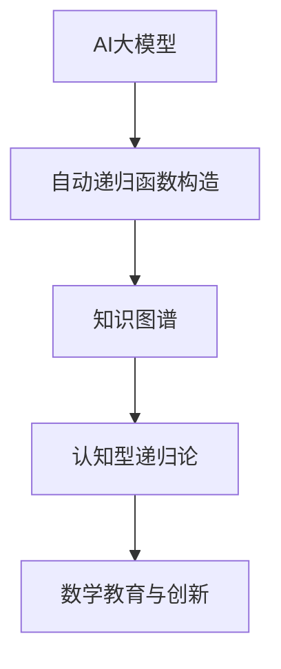

# 00-递归论总览

## 目录

1. [基础理论](01-基础理论.md)
2. [案例分析](02-案例分析.md)
3. [相关证明与引用](03-相关证明与引用.md)

## 现代AI与自动化递归论补充

### 核心主题

- **AI大模型辅助递归论**：GPT-4、Claude等大模型已能自动生成递归函数、形式化代码，辅助教学与研究。
- **知识图谱驱动的递归论自动化**：如OpenAI MathGraph、Wikidata等，支持递归论知识的结构化、自动化推理。
- **认知型递归论系统**：结合人类认知过程的AI推理系统，模拟数学家的递归思维与创新。
- **自动递归函数构造**：Lean、Coq、Isabelle等系统在形式化递归函数构造、自动验证方面的应用。

### 多表征示例

#### Rust：AI辅助递归论结构体

```rust
struct AIAssistedRecursionTheory {
    statement: String,
    recursion_steps: Vec<String>,
    verified: bool,
}

impl AIAssistedRecursionTheory {
    fn new(statement: &str) -> Self {
        AIAssistedRecursionTheory { statement: statement.to_string(), recursion_steps: vec![], verified: false }
    }
    fn add_step(&mut self, step: &str) {
        self.recursion_steps.push(step.to_string());
    }
    fn verify(&mut self) {
        // 假设AI自动验证
        self.verified = true;
    }
}
```

#### 结构图：AI与递归论自动化



---

本目录用于系统梳理和规范化递归论相关内容，包含基础理论、案例分析、形式化证明等，所有内容将严格按照树形结构和本地跳转规范组织。
