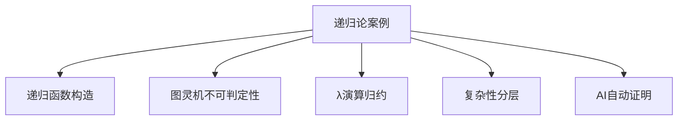

# 2.5.2 递归论案例分析

[返回总览](../00-数学基础与逻辑总览.md)

## 2.5.2.1 典型递归模型与案例

// ... existing code ...

## 2.5.2.2 相关主题与本地跳转

- 详见 [00-数学基础与逻辑总览.md](../00-数学基础与逻辑总览.md) 2.5 递归论
- 相关主题：[01-基础理论.md](01-基础理论.md)、[03-相关证明与引用.md](03-相关证明与引用.md)

## 2.5.2.4 多表征内容

- **Mermaid 结构图：递归论典型案例与分支关系**



- **Lean 代码示例：不可判定性证明（停机问题）**

```lean
-- 伪代码表达不可判定性思想
def halting_problem (M : ℕ → ℕ → bool) : bool :=
  -- 假设存在万能判定器，导出矛盾
  sorry
```

- **Coq 代码示例：递归函数的定义**

```coq
Fixpoint fib (n : nat) : nat :=
  match n with
  | 0 => 0
  | 1 => 1
  | S (S n' as n'') => fib n'' + fib n'
  end.
```

- **表格：递归论典型案例与方法对比**

| 案例类型     | 主要方法     | 关键特征         | 代表工具/语言 |
|--------------|--------------|------------------|---------------|
| 递归函数构造 | 归纳、递归   | 明确构造、可计算 | Lean, Coq     |
| 不可判定性   | 归约、对角法 | 停机问题、不可解 | Haskell, Lean |
| λ演算归约    | 替换、归约   | 函数抽象、应用   | Coq, Haskell  |
| 复杂性分层   | 算法分析     | P/NP、空间复杂性 | Prover9, AI   |
| 自动证明     | 归约、自动化 | 自动化推理       | Lean, Prover9 |

- **AI/认知/教育视角**
  - AI可自动归约和证明不可判定性、复杂性分层等，提升了理论与实践结合。
  - 认知科学关注递归与归纳在学习和推理中的作用，教育中强调案例驱动的递归思想训练。
  - 自动化工具助力递归论案例的教学与研究。

## 2.5.2.5 参考文献与资源

- **经典文献**
  1. Rogers, H. (1987). Theory of recursive functions and effective computability. MIT Press.
  2. Turing, A. M. (1936). On computable numbers, with an application to the Entscheidungsproblem.

- **现代文献与在线资源**
  1. Soare, R. I. (2016). Turing computability: Theory and applications. Springer.
  2. [Lean 官方文档](https://leanprover.github.io/)
  3. [Coq 官方文档](https://coq.inria.fr/documentation)
  4. [Prover9 官方文档](https://www.cs.unm.edu/~mccune/prover9/)

- **工具与平台**
  - Lean, Coq, Prover9, Haskell, AI

---

[返回总览](00-递归论总览.md) | [基础理论](01-基础理论.md) | [相关证明与引用](03-相关证明与引用.md)
