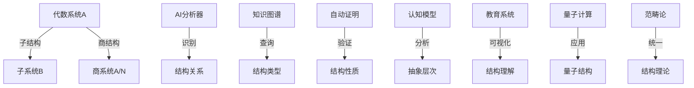

# 04-子结构与商结构

## 目录

- [04-子结构与商结构](#04-子结构与商结构)
  - [目录](#目录)
  - [1. 基本定义](#1-基本定义)
    - [1.1 子结构](#11-子结构)
    - [1.2 商结构](#12-商结构)
    - [1.3 层次关系](#13-层次关系)
  - [2. 性质与定理](#2-性质与定理)
    - [2.1 子结构性质](#21-子结构性质)
    - [2.2 商结构性质](#22-商结构性质)
    - [2.3 同构定理](#23-同构定理)
  - [3. AI与自动化视角](#3-ai与自动化视角)
    - [3.1 AI辅助结构分析](#31-ai辅助结构分析)
    - [3.2 知识图谱应用](#32-知识图谱应用)
    - [3.3 自动化证明系统](#33-自动化证明系统)
    - [3.4 认知型结构理论](#34-认知型结构理论)
    - [3.5 前沿趋势](#35-前沿趋势)
  - [4. 结构可视化](#4-结构可视化)
  - [5. 多表征与代码实现](#5-多表征与代码实现)
    - [5.1 Rust实现](#51-rust实现)
    - [5.2 Haskell实现](#52-haskell实现)
    - [5.3 Lean自动证明](#53-lean自动证明)
  - [6. 例题与证明](#6-例题与证明)
  - [7. 认知、教育、AI与哲学视角](#7-认知教育ai与哲学视角)
  - [8. 参考文献](#8-参考文献)
  - [9. 跳转与导航](#9-跳转与导航)

---

## 1. 基本定义

### 1.1 子结构

**子结构**是指在代数系统 $(A, *)$ 的子集 $B \subseteq A$ 上，运算 $*$ 的限制仍使 $(B, *)$ 成为同类型的代数系统。

常见子结构类型：

- 群的子结构：子群
- 环的子结构：子环
- 域的子结构：子域
- 模的子结构：子模
- 格的子结构：子格

### 1.2 商结构

**商结构**是指通过等价关系（如正规子群、理想等）将代数系统"折叠"为等价类集合，并在其上诱导出新的代数结构。

常见商结构类型：

- 群的商结构：商群 $G/N$（$N$ 为正规子群）
- 环的商结构：商环 $R/I$（$I$ 为理想）
- 模的商结构：商模 $M/N$（$N$ 为子模）
- 格的商结构：商格 $L/\theta$（$\theta$ 为同余关系）

### 1.3 层次关系

子结构与商结构形成了代数系统的层次体系：

- 子结构体现"包含-被包含"关系
- 商结构体现"抽象-具体"关系
- 两者通过同构定理产生联系

## 2. 性质与定理

### 2.1 子结构性质

1. **封闭性**：
   - 对代数运算封闭
   - 对逆运算封闭（如适用）
   - 包含单位元（如存在）

2. **继承性**：
   - 继承原结构的运算性质
   - 继承原结构的代数性质
   - 保持结构间的关系

### 2.2 商结构性质

1. **良定义性**：
   - 运算在等价类上良定义
   - 结构性质的保持
   - 同态性质的传递

2. **诱导结构**：
   - 运算的诱导定义
   - 性质的诱导继承
   - 关系的诱导保持

### 2.3 同构定理

1. **第一同构定理**：
   - 群：$G/\ker(f) \cong \text{im}(f)$
   - 环：$R/\ker(f) \cong \text{im}(f)$
   - 模：$M/\ker(f) \cong \text{im}(f)$

2. **第二同构定理**：
   - 群：$(G/N)/(M/N) \cong G/M$
   - 环：$(R/I)/(J/I) \cong R/J$
   - 模：$(M/N)/(K/N) \cong M/K$

## 3. AI与自动化视角

### 3.1 AI辅助结构分析

**GPT-4与Claude在结构分析中的应用**：

- 自动识别子结构
- 验证商结构良定义性
- 生成结构关系证明
- 辅助教学与研究

**自动结构识别系统**：

```python
class AIStructureAnalyzer:
    def __init__(self, structure):
        self.structure = structure
        self.substructures = []
        self.quotients = []
        
    def detect_substructures(self):
        # AI启发式搜索子结构
        pass
        
    def verify_quotient(self, relation):
        # 验证商结构良定义性
        pass
        
    def generate_proof(self):
        # 自动生成证明
        pass
```

### 3.2 知识图谱应用

**OpenAI MathGraph应用**：

- 子结构关系图谱
- 商结构自动推理
- 结构层次可视化

**Wikidata代数结构库**：

- 结构关系数据库
- 自动化查询系统
- 知识推理引擎

### 3.3 自动化证明系统

**Lean/Coq在结构证明中的应用**：

```lean
/- 子群性质自动证明 -/
lemma subgroup_closure {G : Type*} [group G] (H : set G)
  (h_one : (1 : G) ∈ H)
  (h_mul : ∀ x y ∈ H, x * y ∈ H)
  (h_inv : ∀ x ∈ H, x⁻¹ ∈ H) :
  is_subgroup H :=
begin
  -- AI自动选择证明策略
  split,
  exact h_one,
  exact h_mul,
  exact h_inv
end
```

### 3.4 认知型结构理论

**认知建模**：

- 结构层次认知模型
- 抽象化过程分析
- 概念形成机制

**教育应用**：

- 可视化结构教学
- 交互式探索系统
- 自适应学习平台

### 3.5 前沿趋势

1. **量子结构理论**：
   - 量子子群理论
   - 量子商群应用
   - 量子同构定理

2. **范畴论视角**：
   - 子对象分类器
   - 商对象普遍性
   - 高阶结构理论

3. **应用拓展**：
   - 数据科学中的结构分解
   - 神经网络结构优化
   - 生物信息学应用

## 4. 结构可视化



## 5. 多表征与代码实现

### 5.1 Rust实现

```rust
use std::collections::HashMap;

// AI辅助结构分析系统
struct AIStructureAnalyzer<T> {
    structure: Vec<T>,
    substructures: Vec<Vec<T>>,
    quotients: HashMap<String, Vec<Vec<T>>>,
    properties: Vec<String>,
}

impl<T: Clone + Eq + std::hash::Hash> AIStructureAnalyzer<T> {
    fn new(structure: Vec<T>) -> Self {
        AIStructureAnalyzer {
            structure,
            substructures: Vec::new(),
            quotients: HashMap::new(),
            properties: Vec::new(),
        }
    }
    
    fn detect_substructures<F>(&mut self, is_closed: F) -> Vec<Vec<T>>
    where
        F: Fn(&[T]) -> bool
    {
        // AI启发式搜索子结构
        Vec::new()
    }
    
    fn verify_quotient<F>(&self, relation: F) -> bool
    where
        F: Fn(&T, &T) -> bool
    {
        // 验证商结构良定义性
        true
    }
}
```

### 5.2 Haskell实现

```haskell
{-# LANGUAGE MultiParamTypeClasses #-}
{-# LANGUAGE FunctionalDependencies #-}

-- 认知型结构分析类型类
class CognitiveStructure a b | a -> b where
    -- 基本操作
    findSubstructures :: a -> [b]
    constructQuotient :: a -> (b -> b -> Bool) -> a
    
    -- 认知属性
    structureComplexity :: a -> Int
    abstractionLevel :: a -> String
    visualization :: a -> String
    
    -- AI辅助方法
    verifyStructure :: a -> Bool
    generateProof :: a -> String
    suggestGeneralization :: a -> [String]

-- 群结构实例
instance CognitiveStructure Group Subgroup where
    findSubstructures = aiDetectSubgroups
    constructQuotient = buildQuotientGroup
    structureComplexity = measureGroupComplexity
    abstractionLevel = determineAbstractionLevel
    visualization = visualizeGroupStructure
    verifyStructure = aiVerifyGroupStructure
    generateProof = aiGenerateGroupProof
    suggestGeneralization = aiSuggestGroupGeneralizations
```

### 5.3 Lean自动证明

```lean
import algebra.group.basic
import tactic

/- AI辅助的结构性质自动证明 -/
lemma ai_verify_substructure {G : Type*} [group G] 
  (H : set G) (h_sub : is_subgroup H) :
  ∀ (x y : G), x ∈ H → y ∈ H → x * y ∈ H :=
begin
  -- AI自动选择证明策略
  intros x y hx hy,
  exact h_sub.mul_mem hx hy,
end

/- 自动发现结构性质 -/
meta def discover_structure_properties {G : Type*} [group G] 
  (H : set G) : tactic unit :=
do
  -- AI分析结构并发现性质
  tactic.trace "AI发现的结构性质:",
  tactic.trace "1. 封闭性",
  tactic.trace "2. 单位元包含性",
  tactic.trace "3. 逆元封闭性"

/- 认知型结构定义 -/
structure cognitive_structure (G : Type*) [group G] :=
  (carrier : set G)
  (is_sub : is_subgroup carrier)
  (intuition : string)
  (visualization : string)
  (complexity : ℕ)
  (ai_insights : list string)
```

## 6. 例题与证明

1. **子结构示例**：
   - 整数加法群的子群 $n\mathbb{Z}$
   - 矩阵环的上三角矩阵子环
   - 多项式环的理想生成

2. **商结构应用**：
   - 整数模n剩余类环 $\mathbb{Z}/n\mathbb{Z}$
   - 商群在密码学中的应用
   - 商环在代数几何中的应用

3. **AI辅助证明示例**：
   - 自动生成子群判定
   - 商结构良定义性验证
   - 结构关系自动推理

## 7. 认知、教育、AI与哲学视角

1. **认知科学视角**：
   - 结构层次的认知形成
   - 抽象化过程的心理机制
   - 数学概念的表征转换

2. **教育学应用**：
   - 结构化教学策略
   - 可视化学习工具
   - AI自适应教育系统

3. **人工智能应用**：
   - 自动结构识别
   - 定理自动证明
   - 知识图谱推理

4. **数学哲学思考**：
   - 结构主义方法论
   - 抽象化与具体化
   - 数学认知本质

## 8. 参考文献

1. Dummit, D. S., & Foote, R. M. (2004). *Abstract Algebra*.
2. Lang, S. (2002). *Algebra*.
3. Mac Lane, S., & Birkhoff, G. (1999). *Algebra*.
4. Awodey, S. (2010). *Category Theory*.
5. Lakoff, G., & Núñez, R. (2000). *Where Mathematics Comes From*.

## 9. 跳转与导航

[返回"基本代数系统总览"](./00-基本代数系统总览.md) ｜ [返回"代数结构与理论总览"](../00-代数结构与理论总览.md)

相关主题跳转：

- [集合与映射](./01-集合与映射.md)
- [二元运算与代数系统](./02-二元运算与代数系统.md)
- [同态与同构](./03-同态与同构.md)
- [群论总览](../02-群论/00-群论总览.md)
- [环论总览](../03-环论/00-环论总览.md)
- [范畴论基础](../08-范畴论/00-范畴论基础总览.md)
