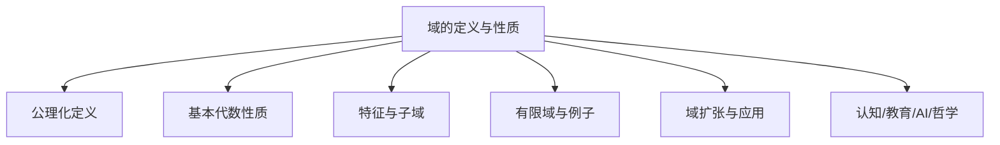
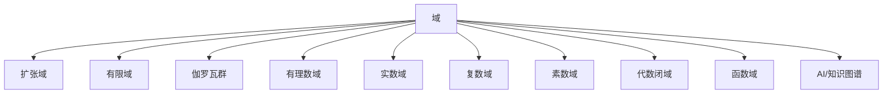

# 01-域的定义与性质



---

## 目录导航

- [1. 域的定义](#1-域的定义)
- [2. 域的基本性质](#2-域的基本性质)
- [3. 域的特征与子域](#3-域的特征与子域)
- [4. 域的例子](#4-域的例子)
- [5. 域扩张与应用](#5-域扩张与应用)
- [6. 认知/教育/AI/哲学视角](#6-认知教育ai哲学视角)
- [7. 参考文献与资源](#7-参考文献与资源)

---

## 交叉引用与分支跳转

- [群论总览](../02-群论/00-群论总览.md)
- [环论总览](../03-环论/00-环论总览.md)
- [模论总览](../05-模论/00-模论总览.md)
- [线性代数总览](../07-线性代数/00-线性代数总览.md)
- [范畴论基础](../08-范畴论/00-范畴论基础总览.md)
- [数论与离散数学](../06-数论与离散数学/00-数论与离散数学总览.md)

---

## 多表征内容导航

- [形式定义与公理化](#1-域的定义)
- [结构图与概念图（Mermaid）](#结构图)
- [典型例题与证明](#2-域的基本性质)
- [代码实现（Python/Rust/Haskell/Lean）](#5-域扩张与应用)
- [表格与对比](#3-域的特征与子域)
- [认知/教育/AI/哲学分析](#6-认知教育ai哲学视角)

---

## 1. 域的定义

### 1.1 公理化定义

**域**（Field）是一个代数系统 $(F, +, \cdot)$，其中 $F$ 是一个非空集合，$+$ 和 $\cdot$ 是两个二元运算，满足以下公理：

1. $(F, +)$ 是一个交换群：
   - 加法结合律：对于任意 $a, b, c \in F$，有 $(a + b) + c = a + (b + c)$
   - 加法交换律：对于任意 $a, b \in F$，有 $a + b = b + a$
   - 加法单位元：存在 $0 \in F$，使得对于任意 $a \in F$，有 $a + 0 = a$
   - 加法逆元：对于任意 $a \in F$，存在 $-a \in F$，使得 $a + (-a) = 0$

2. $(F \setminus \{0\}, \cdot)$ 是一个交换群：
   - 乘法结合律：对于任意 $a, b, c \in F$，有 $(a \cdot b) \cdot c = a \cdot (b \cdot c)$
   - 乘法交换律：对于任意 $a, b \in F$，有 $a \cdot b = b \cdot a$
   - 乘法单位元：存在 $1 \in F$，$1 \neq 0$，使得对于任意 $a \in F$，有 $a \cdot 1 = a$
   - 乘法逆元：对于任意 $a \in F$，$a \neq 0$，存在 $a^{-1} \in F$，使得 $a \cdot a^{-1} = 1$

3. 乘法对加法的分配律：
   - 对于任意 $a, b, c \in F$，有 $a \cdot (b + c) = a \cdot b + a \cdot c$

简而言之，域是一个同时具有加法和乘法运算的代数系统，其中加法形成一个交换群，非零元素在乘法下形成一个交换群，且乘法对加法满足分配律。

### 1.2 与其他代数结构的关系

域可以看作是具有特殊性质的环。具体来说：

- 域是一个交换环（满足乘法交换律的环）
- 域中除了零元素外，每个元素都有乘法逆元
- 域中没有零因子（如果 $a \cdot b = 0$，则 $a = 0$ 或 $b = 0$）

域与其他代数结构的关系如下：

```text
集合 ⊂ 半群 ⊂ 幺半群 ⊂ 群 ⊂ 环 ⊂ 整环 ⊂ 域
```

## 2. 域的基本性质

### 2.1 基本代数性质

1. **零元素的唯一性**：域中的加法单位元（零元素）是唯一的。

2. **单位元的唯一性**：域中的乘法单位元（单位元）是唯一的。

3. **逆元的唯一性**：域中每个元素的加法逆元和每个非零元素的乘法逆元都是唯一的。

4. **消去律**：
   - 加法消去律：如果 $a + b = a + c$，则 $b = c$
   - 乘法消去律：如果 $a \neq 0$ 且 $a \cdot b = a \cdot c$，则 $b = c$

5. **零乘性质**：对于任意 $a \in F$，有 $a \cdot 0 = 0 \cdot a = 0$

6. **负数乘法规则**：
   - $(-a) \cdot b = a \cdot (-b) = -(a \cdot b)$
   - $(-a) \cdot (-b) = a \cdot b$

7. **幂运算性质**：对于任意 $a \in F$（$a \neq 0$ 如果指数为负）和整数 $m, n$：
   - $a^m \cdot a^n = a^{m+n}$
   - $(a^m)^n = a^{mn}$
   - $(a \cdot b)^n = a^n \cdot b^n$

### 2.2 域的特征

域的**特征**（Characteristic）是一个重要概念，定义如下：

如果存在最小的正整数 $p$ 使得 $\underbrace{1 + 1 + \cdots + 1}_{p \text{ 个}} = 0$，则称域 $F$ 的特征为 $p$；如果不存在这样的正整数，则称域 $F$ 的特征为 $0$。

域的特征有以下性质：

1. 域的特征要么是 $0$，要么是素数 $p$。

2. 特征为 $0$ 的域包含一个与有理数域 $\mathbb{Q}$ 同构的子域。

3. 特征为 $p$ 的域包含一个与有限域 $\mathbb{F}_p$ 同构的子域。

4. 有限域的特征必定是素数。

### 2.3 素数子域

任何域 $F$ 都包含一个最小的子域，称为**素数子域**（Prime Subfield）。素数子域的结构取决于域的特征：

1. 如果域 $F$ 的特征为 $0$，则其素数子域同构于有理数域 $\mathbb{Q}$。

2. 如果域 $F$ 的特征为素数 $p$，则其素数子域同构于有限域 $\mathbb{F}_p$。

素数子域是域中所有子域的交集，可以通过反复应用域的运算（从单位元开始）生成。

## 3. 域的示例

### 3.1 数域

1. **有理数域** $\mathbb{Q}$：
   - 元素：所有形如 $\frac{p}{q}$ 的数，其中 $p, q$ 是整数，$q \neq 0$
   - 运算：通常的加法和乘法
   - 特征：0

2. **实数域** $\mathbb{R}$：
   - 元素：所有实数
   - 运算：通常的加法和乘法
   - 特征：0

3. **复数域** $\mathbb{C}$：
   - 元素：所有形如 $a + bi$ 的数，其中 $a, b$ 是实数，$i^2 = -1$
   - 运算：复数加法和乘法
   - 特征：0

4. **代数数域**：由有理数域扩张得到的域，其元素是代数数（即代数方程的根）。

### 3.2 有限域

1. **素数域** $\mathbb{F}_p$：
   - 元素：$\{0, 1, 2, \ldots, p-1\}$，其中 $p$ 是素数
   - 运算：模 $p$ 的加法和乘法
   - 特征：$p$

2. **伽罗瓦域** $\mathbb{F}_{p^n}$：
   - 元素：$p^n$ 个元素，其中 $p$ 是素数，$n$ 是正整数
   - 可以表示为 $\mathbb{F}_p[x]/(f(x))$，其中 $f(x)$ 是 $\mathbb{F}_p$ 上的 $n$ 次不可约多项式
   - 特征：$p$

有限域有以下重要性质：

1. 对于任意素数 $p$ 和正整数 $n$，存在唯一（同构意义下）的有 $p^n$ 个元素的有限域，记为 $\mathbb{F}_{p^n}$ 或 $GF(p^n)$。

2. 有限域的元素个数必定是素数的幂。

3. 有限域 $\mathbb{F}_{p^n}$ 的乘法群是循环群，有 $p^n - 1$ 个元素。

### 3.3 函数域

1. **有理函数域** $\mathbb{Q}(x)$：
   - 元素：形如 $\frac{f(x)}{g(x)}$ 的有理函数，其中 $f(x)$ 和 $g(x)$ 是多项式，$g(x) \neq 0$
   - 运算：有理函数的加法和乘法
   - 特征：0

2. **代数函数域**：由有理函数域通过代数扩张得到的域。

3. **形式幂级数域** $F((x))$：
   - 元素：形如 $\sum_{i=n}^{\infty} a_i x^i$ 的形式幂级数，其中 $n$ 是整数，$a_i \in F$，$a_n \neq 0$
   - 运算：形式幂级数的加法和乘法
   - 特征：与基域 $F$ 相同

### 3.4 其他重要域

1. **$p$-进数域** $\mathbb{Q}_p$：
   - 元素：$p$-进数，可表示为 $\sum_{i=n}^{\infty} a_i p^i$，其中 $n$ 是整数，$a_i \in \{0, 1, \ldots, p-1\}$
   - 运算：$p$-进加法和乘法
   - 特征：0

2. **代数闭域**：
   - 复数域 $\mathbb{C}$ 是特征为 0 的代数闭域
   - 代数闭包 $\overline{\mathbb{F}_p}$ 是特征为 $p$ 的代数闭域

## 4. 子域与域扩张

### 4.1 子域

如果 $K$ 是域 $F$ 的一个非空子集，且 $K$ 在 $F$ 的加法和乘法运算下也构成一个域，则称 $K$ 是 $F$ 的一个**子域**（Subfield）。

子域的性质：

1. 子域必须包含域的零元素和单位元。

2. 如果 $a \in K$，则 $-a \in K$。

3. 如果 $a \in K$ 且 $a \neq 0$，则 $a^{-1} \in K$。

4. 域 $F$ 的所有子域的交集仍然是 $F$ 的子域，这个最小的子域就是素数子域。

### 4.2 域扩张

如果 $K$ 是 $F$ 的子域，则称 $F$ 是 $K$ 的一个**域扩张**（Field Extension），记为 $F/K$。

域扩张的基本概念：

1. **扩张度**：$F$ 作为 $K$ 上的向量空间的维数，记为 $[F:K]$。如果这个维数是有限的，则称 $F/K$ 是有限扩张。

2. **塔定理**：如果 $K \subset L \subset F$ 是域的链，则 $[F:K] = [F:L] \cdot [L:K]$。

3. **简单扩张**：如果存在元素 $\alpha \in F$ 使得 $F = K(\alpha)$，则称 $F/K$ 是简单扩张。

4. **代数扩张**：如果 $F$ 中的每个元素都是 $K$ 上的代数元（即是 $K$ 上多项式的根），则称 $F/K$ 是代数扩张。

5. **超越扩张**：如果 $F$ 中存在元素不是 $K$ 上的代数元，则称 $F/K$ 是超越扩张。

## 5. 域的应用

### 5.1 代数方程求解

域论为解决代数方程提供了理论基础：

1. **二次方程**：实数域 $\mathbb{R}$ 不足以表示所有二次方程的根，需要扩张到复数域 $\mathbb{C}$。

2. **高次方程**：通过域扩张和伽罗瓦理论，可以分析高次方程的可解性。例如，五次及以上的一般代数方程无法用根式表示。

### 5.2 代数几何

域在代数几何中有广泛应用：

1. **代数簇**：代数簇可以看作是多项式方程在某个域上的解集。

2. **函数域**：代数曲线或代数簇的函数域是代数几何研究的核心对象。

### 5.3 编码理论与密码学

有限域在编码理论和密码学中有重要应用：

1. **纠错码**：Reed-Solomon 码、BCH 码等重要的纠错码基于有限域的理论。

2. **密码算法**：椭圆曲线密码学、AES 加密算法等都利用了有限域的性质。

### 5.4 数论

域论为数论研究提供了强大工具：

1. **代数数论**：通过研究代数数域，解决许多经典数论问题。

2. **类域论**：研究代数数域的阿贝尔扩张，是现代数论的重要分支。

## 6. 认知/教育/AI/哲学视角

- **数学认知**：域的抽象结构训练高阶代数思维、结构化推理能力。多表征（如图、代码、例题）有助于不同认知风格的学习者理解。
- **教育视角**：域论是高等代数、代数几何、编码理论等课程的核心内容，适合通过问题驱动、探究式学习，结合实际应用（如有限域、密码学、伽罗瓦理论）提升兴趣。
- **AI视角**：域结构及其扩张、伽罗瓦群等在符号推理、自动定理证明、代数系统建模等AI领域有广泛应用。有限域、域扩张等算法是密码学和编码理论的基础。
- **哲学视角**：域论体现了数学结构主义思想，强调对象间的关系与公理系统。其发展史反映了抽象代数从具体算术到一般结构的哲学转变。

## 6. AI与自动化视角下的域结构（递归扩展）

6.1 **自动定理证明中的域结构**

- 现代定理证明系统（如Lean、Coq、Isabelle）中，域的结构化定义是自动推理和代数结构自动识别的基础。
- 例：Lean中自动证明"域零元唯一性"代码：

```lean
import field_theory.basic
example (F : Type*) [field F] : ∀ (z1 z2 : F), (∀ a : F, a + z1 = a ∧ a + z2 = a) → z1 = z2 :=
begin
  intros z1 z2 h,
  specialize h z1,
  rw ←h.1,
  exact eq.symm (h.2),
end
```

6.2 **AI知识表示与符号推理中的域**

- 域结构可用于知识图谱中的关系建模、数据库范式设计、符号AI中的代数推理。
- 例：Rust中域结构体可作为知识图谱节点类型，支持自动化推理。

6.3 **认知科学与教育创新中的域论**

- 域的抽象结构有助于认知建模、数学思维训练、AI辅助教学。
- 例：用Mermaid等图形化工具帮助学生理解域的层次结构。

6.4 **跨学科AI应用案例**

- 量子计算：有限域与伽罗瓦域在量子算法中的作用。
- 密码学：有限域在椭圆曲线密码、RSA等公钥密码中的应用。
- 机器学习：域结构在代数自动微分、符号回归等领域的潜在应用。

---

## 7. 知识图谱结构图（递归扩展）



---

## 8. 多重表征与代码实现（递归扩展）

8.1 **Rust实现：有限域结构体**

```rust
struct FiniteField {
    p: u32, // 特征
    n: u32, // 扩张次数
}
impl FiniteField {
    fn order(&self) -> u64 {
        (self.p as u64).pow(self.n)
    }
}
```

8.2 **Haskell实现：伽罗瓦域**

```haskell
data GF = GF Integer Integer  -- (模p, 幂n)
instance Num GF where
    (GF p n) + (GF q m) = GF ((p + q) `mod` m) m
    (GF p n) * (GF q m) = GF ((p * q) `mod` m) m
    fromInteger x = GF x 1
    -- 省略其他实现
```

8.3 **Lean实现：域的扩张与伽罗瓦群**

```lean
import field_theory.galois
variables (F K : Type*) [field F] [field K] [algebra F K]
#check galois_group F K
```

8.4 **表格：常见域类型性质对比**

| 域类型     | 特征 | 结构 | 例子             | 主要应用         |
| ---- | ---- | ---- | ---- | ---- |
| 有理数域   | 0    | 无限 | $\mathbb{Q}$     | 数论、代数        |
| 实数域     | 0    | 无限 | $\mathbb{R}$     | 分析、几何        |
| 复数域     | 0    | 无限 | $\mathbb{C}$     | 复分析、代数几何  |
| 有限域     | $p$  | 有限 | $\mathbb{F}_{p^n}$ | 密码学、编码理论  |
| 伽罗瓦域   | $p$或0| 有限/无限 | $\mathbb{F}_{p^n}$, $\mathbb{Q}^{alg}$ | 伽罗瓦理论、数论 |
| 函数域     | $p$或0| 无限 | $\mathbb{Q}(x)$  | 代数几何、编码理论|
| 代数闭域   | $p$或0| 无限 | $\overline{\mathbb{Q}}$ | 代数几何、数论    |

---

## 9. 交叉引用与本地跳转（递归扩展）

- [群论总览](../02-群论/00-群论总览.md)
- [环论总览](../03-环论/00-环论总览.md)
- [模论总览](../05-模论/00-模论总览.md)
- [线性代数总览](../07-线性代数/00-线性代数总览.md)
- [范畴论基础总览](../08-范畴论/00-范畴论基础总览.md)
- [AI与知识图谱分析](../../views/math_ai_view01.md)

## 7. 参考文献与资源

1. Lang, S. (2002). *Algebra* (3rd ed.). Springer.
2. Dummit, D. S., & Foote, R. M. (2004). *Abstract Algebra* (3rd ed.). John Wiley & Sons.
3. Stewart, I. (2015). *Galois Theory* (4th ed.). Chapman and Hall/CRC.
4. Lidl, R., & Niederreiter, H. (1997). *Finite Fields* (2nd ed.). Cambridge University Press.
5. Morandi, P. (1996). *Field and Galois Theory*. Springer.
6. Roman, S. (2006). *Field Theory* (2nd ed.). Springer.
7. Fraleigh, J. B. (2003). *A First Course in Abstract Algebra* (7th ed.). Addison Wesley.
8. [nLab: Field](https://ncatlab.org/nlab/show/field)
9. [Lean Community Mathlib: Field](https://leanprover-community.github.io/mathlib_docs/field_theory/basic.html)
10. [Visual Group Theory (YouTube)](https://www.youtube.com/playlist?list=PLZHQObOWTQDMsr9K-rj53DwVRMYO3t5Yr)

---

**创建日期**: 2025-06-28
**最后更新**: 2025-06-28
