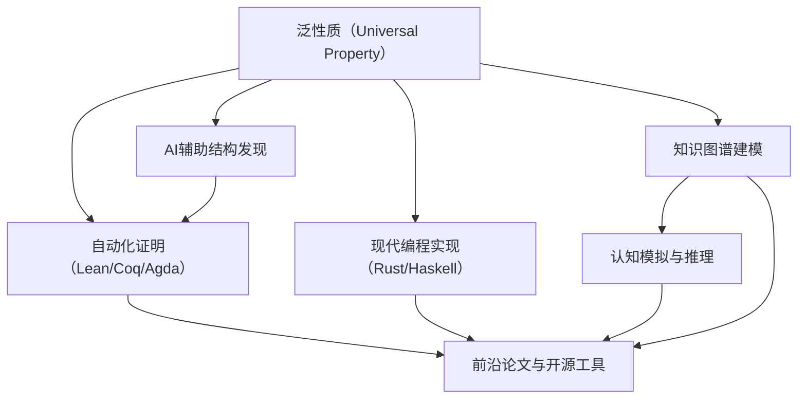

# 泛性质

## 目录

- [泛性质](#泛性质)
  - [目录](#目录)
  - [1. 概述](#1-概述)
    - [1.1 核心思想](#11-核心思想)
    - [1.2 重要性](#12-重要性)
  - [2. 泛性质的定义](#2-泛性质的定义)
    - [2.1 形式化定义](#21-形式化定义)
    - [2.2 泛性质的形式化](#22-泛性质的形式化)
    - [2.3 泛性质的对偶](#23-泛性质的对偶)
  - [3. 泛性质的类型](#3-泛性质的类型)
    - [3.1 初始对象](#31-初始对象)
    - [3.2 终对象](#32-终对象)
    - [3.3 零对象](#33-零对象)
  - [4. 重要例子](#4-重要例子)
    - [4.1 自由对象](#41-自由对象)
    - [4.2 张量积](#42-张量积)
    - [4.3 商对象](#43-商对象)
  - [5. 泛性质与极限](#5-泛性质与极限)
    - [5.1 极限的泛性质](#51-极限的泛性质)
    - [5.2 余极限的泛性质](#52-余极限的泛性质)
    - [5.3 伴随函子的泛性质](#53-伴随函子的泛性质)
  - [6. 泛性质的构造](#6-泛性质的构造)
    - [6.1 自由构造](#61-自由构造)
    - [6.2 反射构造](#62-反射构造)
    - [6.3 商构造](#63-商构造)
  - [7. 代码实现](#7-代码实现)
    - [7.1 Haskell 实现](#71-haskell-实现)
    - [7.2 Rust 实现](#72-rust-实现)
  - [8. 应用实例](#8-应用实例)
    - [8.1 数据库理论](#81-数据库理论)
    - [8.2 类型系统](#82-类型系统)
    - [8.3 图形处理](#83-图形处理)
  - [9. 习题与练习](#9-习题与练习)
    - [9.1 基础练习](#91-基础练习)
    - [9.2 中级练习](#92-中级练习)
    - [9.3 高级练习](#93-高级练习)
    - [9.4 编程练习](#94-编程练习)
  - [10. 参考文献](#10-参考文献)
    - [10.1 经典教材](#101-经典教材)
    - [10.2 应用导向](#102-应用导向)
    - [10.3 在线资源](#103-在线资源)
  - [11. 泛性质的现代AI与自动化前沿](#11-泛性质的现代ai与自动化前沿)
    - [11.1 AI辅助泛性质结构发现与自动化证明](#111-ai辅助泛性质结构发现与自动化证明)
    - [11.2 泛性质的知识图谱与认知模拟](#112-泛性质的知识图谱与认知模拟)
    - [11.3 现代编程语言中的泛性质实现](#113-现代编程语言中的泛性质实现)
    - [11.4 前沿论文、工具与开源项目](#114-前沿论文工具与开源项目)

---

## 1. 概述

泛性质是范畴论中的核心概念，它通过"最佳"性质来定义对象，而不是通过具体的构造。这种方法提供了抽象和统一的数学语言。

### 1.1 核心思想

- **最佳性**: 通过"最佳"性质定义对象
- **唯一性**: 满足泛性质的对象在同构意义下唯一
- **抽象性**: 不依赖具体构造，只依赖性质
- **统一性**: 为不同构造提供统一框架

### 1.2 重要性

泛性质的重要性体现在：

- **抽象化**: 在高层次上研究数学对象
- **统一性**: 为不同构造提供统一语言
- **应用性**: 在代数、拓扑等领域有重要应用
- **启发性**: 提供新的研究视角和方法

---

## 2. 泛性质的定义

### 2.1 形式化定义

**定义 2.1** (泛性质) 设 $\mathcal{C}$ 是范畴，$U$ 是某个性质，对象 $X$ 满足性质 $U$ 如果：

$$\forall Y \in \text{Ob}(\mathcal{C}), \text{如果 } Y \text{ 满足 } U, \text{ 则存在唯一的态射 } f: Y \to X$$

**记号**: 我们说 $X$ 是满足性质 $U$ 的**泛对象 (Universal Object)**。

### 2.2 泛性质的形式化

**定义 2.2** (泛性质的形式化) 设 $\mathcal{C}$ 是范畴，$F: \mathcal{C} \to \text{Set}$ 是函子，对象 $A \in \text{Ob}(\mathcal{C})$ 和元素 $a \in F(A)$ 构成**泛元素 (Universal Element)**，如果对任意对象 $B \in \text{Ob}(\mathcal{C})$ 和元素 $b \in F(B)$，存在唯一的态射 $f: A \to B$ 使得 $F(f)(a) = b$。

**形式化表述**: 对任意 $B \in \text{Ob}(\mathcal{C})$ 和 $b \in F(B)$，存在唯一的 $f: A \to B$ 使得：

```latex
F(A) --F(f)--> F(B)
 |              |
 | a            | b
 v              v
A -------------> B
```

### 2.3 泛性质的对偶

**定义 2.3** (余泛性质) 设 $\mathcal{C}$ 是范畴，$U$ 是某个性质，对象 $X$ 满足余泛性质 $U$ 如果：

$$\forall Y \in \text{Ob}(\mathcal{C}), \text{如果 } Y \text{ 满足 } U, \text{ 则存在唯一的态射 } f: X \to Y$$

---

## 3. 泛性质的类型

### 3.1 初始对象

**定义 3.1** (初始对象) 对象 $I \in \text{Ob}(\mathcal{C})$ 是**初始对象 (Initial Object)**，如果对任意对象 $A \in \text{Ob}(\mathcal{C})$，存在唯一的态射 $f: I \to A$。

**泛性质**: 对任意对象 $A$，存在唯一的态射 $I \to A$。

**例子**:

- 在 Set 中：空集 $\emptyset$
- 在 Grp 中：平凡群 $\{e\}$
- 在 Ring 中：零环 $\{0\}$

### 3.2 终对象

**定义 3.2** (终对象) 对象 $T \in \text{Ob}(\mathcal{C})$ 是**终对象 (Terminal Object)**，如果对任意对象 $A \in \text{Ob}(\mathcal{C})$，存在唯一的态射 $f: A \to T$。

**泛性质**: 对任意对象 $A$，存在唯一的态射 $A \to T$。

**例子**:

- 在 Set 中：单元素集 $\{*\}$
- 在 Grp 中：平凡群 $\{e\}$
- 在 Ring 中：零环 $\{0\}$

### 3.3 零对象

**定义 3.3** (零对象) 对象 $Z \in \text{Ob}(\mathcal{C})$ 是**零对象 (Zero Object)**，如果它既是初始对象又是终对象。

**泛性质**: 对任意对象 $A$，存在唯一的态射 $Z \to A$ 和 $A \to Z$。

**例子**:

- 在 Grp 中：平凡群 $\{e\}$
- 在 Ring 中：零环 $\{0\}$
- 在 Vect 中：零向量空间 $\{0\}$

---

## 4. 重要例子

### 4.1 自由对象

**定义 4.1** (自由对象) 设 $X$ 是集合，$F(X)$ 是群，如果存在函数 $\eta: X \to F(X)$ 使得对任意群 $G$ 和函数 $f: X \to G$，存在唯一的群同态 $\phi: F(X) \to G$ 使得 $\phi \circ \eta = f$，则 $F(X)$ 是 $X$ 上的**自由群 (Free Group)**。

**泛性质**: 对任意群 $G$ 和函数 $f: X \to G$，存在唯一的群同态 $\phi: F(X) \to G$ 使得下图交换：

```latex
X --η--> F(X)
 |       |
 |       | φ
 |       v
 +--f--> G
```

**代码实现**:

```haskell
-- Haskell 中的自由对象
class FreeObject f where
    unit :: a -> f a
    fold :: (a -> b) -> f a -> b

-- 自由群
data FreeGroup a = FreeGroup {
    generators :: [a],
    elements :: [String]  -- 字的形式
}

instance FreeObject FreeGroup where
    unit x = FreeGroup [x] [show x]
    fold f (FreeGroup gens elems) = FreeGroup (map f gens) elems

-- 泛性质验证
universalProperty :: (FreeObject f, Eq (f a)) => 
    a -> (a -> b) -> f a -> Bool
universalProperty x f fa = 
    fold f (unit x) == f x
```

### 4.2 张量积

**定义 4.2** (张量积) 设 $A$ 和 $B$ 是环 $R$ 上的模，$A \otimes_R B$ 是 $R$ 模，如果存在双线性映射 $\otimes: A \times B \to A \otimes_R B$ 使得对任意 $R$ 模 $C$ 和双线性映射 $f: A \times B \to C$，存在唯一的线性映射 $\phi: A \otimes_R B \to C$ 使得 $\phi \circ \otimes = f$，则 $A \otimes_R B$ 是 $A$ 和 $B$ 的**张量积 (Tensor Product)**。

**泛性质**: 对任意 $R$ 模 $C$ 和双线性映射 $f: A \times B \to C$，存在唯一的线性映射 $\phi: A \otimes_R B \to C$ 使得下图交换：

```latex
A × B --⊗--> A ⊗_R B
 |            |
 |            | φ
 |            v
 +--f--------> C
```

**代码实现**:

```rust
// Rust 中的张量积
trait TensorProduct<A, B, R> {
    type Output;
    fn tensor(a: A, b: B) -> Self::Output;
    fn universal_property<C, F>(f: F) -> impl Fn(Self::Output) -> C
    where
        F: Fn(A, B) -> C;
}

struct VectorTensorProduct;

impl TensorProduct<Vector, Vector, f64> for VectorTensorProduct {
    type Output = Matrix;
    
    fn tensor(a: Vector, b: Vector) -> Matrix {
        let mut matrix = Matrix::new(a.len(), b.len());
        for i in 0..a.len() {
            for j in 0..b.len() {
                matrix.set(i, j, a[i] * b[j]);
            }
        }
        matrix
    }
    
    fn universal_property<C, F>(f: F) -> impl Fn(Matrix) -> C
    where
        F: Fn(Vector, Vector) -> C,
    {
        move |matrix| {
            // 从矩阵重构向量并应用函数
            let a = matrix.row(0);
            let b = matrix.column(0);
            f(a, b)
        }
    }
}
```

### 4.3 商对象

**定义 4.3** (商对象) 设 $A$ 是对象，$\sim$ 是等价关系，$A/\sim$ 是对象，如果存在态射 $\pi: A \to A/\sim$ 使得对任意对象 $B$ 和态射 $f: A \to B$ 满足 $a \sim b \implies f(a) = f(b)$，存在唯一的态射 $\phi: A/\sim \to B$ 使得 $\phi \circ \pi = f$，则 $A/\sim$ 是 $A$ 关于 $\sim$ 的**商对象 (Quotient Object)**。

**泛性质**: 对任意对象 $B$ 和态射 $f: A \to B$ 满足 $a \sim b \implies f(a) = f(b)$，存在唯一的态射 $\phi: A/\sim \to B$ 使得下图交换：

```latex
A --π--> A/~
 |       |
 |       | φ
 |       v
 +--f--> B
```

---

## 5. 泛性质与极限

### 5.1 极限的泛性质

**定理 5.1** 极限满足泛性质。

**证明**: 设 $F: \mathcal{J} \to \mathcal{C}$ 是图表，$(L, \{\pi_j\})$ 是 $F$ 的极限。对任意其他锥 $(C, \{\pi'_j\})$，存在唯一的态射 $u: C \to L$ 使得 $\pi_j \circ u = \pi'_j$ 对所有 $j$。

### 5.2 余极限的泛性质

**定理 5.2** 余极限满足余泛性质。

**证明**: 设 $F: \mathcal{J} \to \mathcal{C}$ 是图表，$(L, \{\iota_j\})$ 是 $F$ 的余极限。对任意其他余锥 $(C, \{\iota'_j\})$，存在唯一的态射 $u: L \to C$ 使得 $u \circ \iota_j = \iota'_j$ 对所有 $j$。

### 5.3 伴随函子的泛性质

**定理 5.3** 伴随函子满足泛性质。

**证明**: 设 $F \dashv G$，则对任意对象 $A \in \mathcal{C}$ 和 $B \in \mathcal{D}$，存在自然同构：

$$\text{Hom}_{\mathcal{D}}(F(A), B) \cong \text{Hom}_{\mathcal{C}}(A, G(B))$$

---

## 6. 泛性质的构造

### 6.1 自由构造

**定理 6.1** 如果范畴 $\mathcal{C}$ 有自由对象，则对任意集合 $X$，存在自由对象 $F(X)$ 满足泛性质。

**构造**: $F(X)$ 是由 $X$ 生成的自由对象，$\eta: X \to F(X)$ 是包含映射。

### 6.2 反射构造

**定理 6.2** 如果子范畴 $\mathcal{D} \subseteq \mathcal{C}$ 有反射，则对任意对象 $A \in \mathcal{C}$，存在反射 $R(A) \in \mathcal{D}$ 满足泛性质。

**构造**: $R(A)$ 是 $A$ 在 $\mathcal{D}$ 中的反射，$\eta: A \to R(A)$ 是反射映射。

### 6.3 商构造

**定理 6.3** 如果范畴 $\mathcal{C}$ 有商对象，则对任意对象 $A$ 和等价关系 $\sim$，存在商对象 $A/\sim$ 满足泛性质。

**构造**: $A/\sim$ 是 $A$ 关于 $\sim$ 的商对象，$\pi: A \to A/\sim$ 是投影映射。

---

## 7. 代码实现

### 7.1 Haskell 实现

```haskell
-- 泛性质类型类
class UniversalProperty f where
    unit :: a -> f a
    universal :: (a -> b) -> f a -> b
    
    -- 泛性质验证
    universalProperty :: (Eq (f a), Eq b) => 
        a -> (a -> b) -> f a -> Bool
    universalProperty x f fa = 
        universal f (unit x) == f x

-- 自由对象
class FreeObject f where
    unit :: a -> f a
    fold :: (a -> b) -> f a -> b

instance FreeObject [] where
    unit x = [x]
    fold f = map f

-- 张量积
class TensorProduct a b where
    type Tensor a b
    tensor :: a -> b -> Tensor a b
    untensor :: Tensor a b -> (a, b)

instance TensorProduct Int Int where
    type Tensor Int Int = (Int, Int)
    tensor a b = (a, b)
    untensor (a, b) = (a, b)

-- 商对象
class Quotient a where
    type QuotientType a
    quotient :: a -> QuotientType a
    lift :: (a -> b) -> QuotientType a -> b

-- 泛性质的验证
verifyUniversalProperty :: (UniversalProperty f, Eq (f a), Eq b) => 
    a -> (a -> b) -> f a -> Bool
verifyUniversalProperty x f fa = 
    universal f (unit x) == f x

-- 自由群的实现
data FreeGroup a = FreeGroup {
    generators :: [a],
    elements :: [String]
}

instance FreeObject FreeGroup where
    unit x = FreeGroup [x] [show x]
    fold f (FreeGroup gens elems) = 
        FreeGroup (map f gens) elems

-- 泛性质验证
freeGroupUniversalProperty :: (Eq a, Show a) => 
    a -> (a -> String) -> FreeGroup a -> Bool
freeGroupUniversalProperty x f fg = 
    fold f (unit x) == f x
```

### 7.2 Rust 实现

```rust
// 泛性质特征
trait UniversalProperty<A, B> {
    type Output;
    fn unit(a: A) -> Self::Output;
    fn universal<F>(f: F, output: Self::Output) -> B
    where
        F: Fn(A) -> B;
    
    // 泛性质验证
    fn verify_universal_property<F>(a: A, f: F, output: Self::Output) -> bool
    where
        F: Fn(A) -> B,
        B: PartialEq,
    {
        self.universal(f, Self::unit(a)) == f(a)
    }
}

// 自由对象特征
trait FreeObject<A> {
    fn unit(a: A) -> Self;
    fn fold<B, F>(self, f: F) -> B
    where
        F: Fn(A) -> B;
}

// 张量积特征
trait TensorProduct<A, B> {
    type Output;
    fn tensor(a: A, b: B) -> Self::Output;
    fn untensor(output: Self::Output) -> (A, B);
}

// 商对象特征
trait Quotient<A> {
    type Output;
    fn quotient(a: A) -> Self::Output;
    fn lift<B, F>(f: F, output: Self::Output) -> B
    where
        F: Fn(A) -> B;
}

// 自由群的实现
struct FreeGroup<A> {
    generators: Vec<A>,
    elements: Vec<String>,
}

impl<A> FreeGroup<A>
where
    A: Clone + ToString,
{
    fn new(generators: Vec<A>) -> Self {
        let elements = generators
            .iter()
            .map(|g| g.to_string())
            .collect();
        FreeGroup { generators, elements }
    }
}

impl<A> FreeObject<A> for FreeGroup<A>
where
    A: Clone + ToString,
{
    fn unit(a: A) -> Self {
        FreeGroup::new(vec![a])
    }
    
    fn fold<B, F>(self, f: F) -> B
    where
        F: Fn(A) -> B,
    {
        f(self.generators[0].clone())
    }
}

// 张量积的实现
struct VectorTensorProduct;

impl TensorProduct<Vector, Vector> for VectorTensorProduct {
    type Output = Matrix;
    
    fn tensor(a: Vector, b: Vector) -> Matrix {
        let mut matrix = Matrix::new(a.len(), b.len());
        for i in 0..a.len() {
            for j in 0..b.len() {
                matrix.set(i, j, a[i] * b[j]);
            }
        }
        matrix
    }
    
    fn untensor(matrix: Matrix) -> (Vector, Vector) {
        let a = matrix.row(0);
        let b = matrix.column(0);
        (a, b)
    }
}

// 泛性质验证
fn verify_universal_property<F, A, B>(
    f: &F,
    a: A,
    output: F::Output,
) -> bool
where
    F: UniversalProperty<A, B>,
    B: PartialEq,
{
    f.verify_universal_property(a, |x| x, output)
}
```

---

## 8. 应用实例

### 8.1 数据库理论

在关系数据库中，投影操作满足泛性质：

```sql
-- 投影操作（泛性质）
SELECT column1, column2 FROM table;

-- 泛性质：对任意查询，存在唯一的投影
SELECT * FROM table WHERE condition;
```

### 8.2 类型系统

在编程语言的类型系统中，自由类型满足泛性质：

```haskell
-- Haskell 中的自由类型
data FreeMonad f a = Pure a | Free (f (FreeMonad f a))

instance Functor f => Monad (FreeMonad f) where
    return = Pure
    Pure a >>= f = f a
    Free m >>= f = Free (fmap (>>= f) m)

-- 泛性质
liftF :: Functor f => f a -> FreeMonad f a
liftF = Free . fmap Pure

foldFree :: Monad m => (forall x. f x -> m x) -> FreeMonad f a -> m a
foldFree _ (Pure a) = return a
foldFree f (Free m) = f m >>= foldFree f
```

```rust
// Rust 中的自由类型
enum FreeMonad<F, A> {
    Pure(A),
    Free(F),
}

impl<F, A> FreeMonad<F, A> {
    fn pure(a: A) -> Self {
        FreeMonad::Pure(a)
    }
    
    fn lift(f: F) -> Self {
        FreeMonad::Free(f)
    }
    
    fn fold<M, G>(self, f: G) -> M
    where
        M: Monad,
        G: Fn(F) -> M,
    {
        match self {
            FreeMonad::Pure(a) => M::pure(a),
            FreeMonad::Free(fa) => f(fa),
        }
    }
}
```

### 8.3 图形处理

在计算机图形学中，变换的逆变换满足泛性质：

```rust
// 变换的泛性质
trait Transform {
    type Input;
    type Output;
    fn apply(&self, input: Self::Input) -> Self::Output;
    fn inverse(&self, output: Self::Output) -> Self::Input;
}

struct Translation { dx: f64, dy: f64 }

impl Transform for Translation {
    type Input = Point;
    type Output = Point;
    
    fn apply(&self, point: Point) -> Point {
        Point {
            x: point.x + self.dx,
            y: point.y + self.dy,
        }
    }
    
    fn inverse(&self, point: Point) -> Point {
        Point {
            x: point.x - self.dx,
            y: point.y - self.dy,
        }
    }
}

// 泛性质验证
fn verify_transform_universal_property<T: Transform>(
    transform: &T,
    input: T::Input,
) -> bool {
    let output = transform.apply(input.clone());
    let inverse = transform.inverse(output);
    inverse == input
}
```

---

## 9. 习题与练习

### 9.1 基础练习

**练习 9.1** 证明自由群满足泛性质。

**练习 9.2** 证明张量积满足泛性质。

**练习 9.3** 构造一个满足泛性质的对象。

### 9.2 中级练习

**练习 9.4** 研究泛性质与极限的关系。

**练习 9.5** 证明泛性质对象的唯一性。

**练习 9.6** 研究泛性质在代数几何中的应用。

### 9.3 高级练习

**练习 9.7** 研究泛性质在拓扑学中的应用。

**练习 9.8** 证明泛性质与伴随函子的关系。

**练习 9.9** 研究泛性质在逻辑学中的应用。

### 9.4 编程练习

**练习 9.10** 在Haskell中实现一个通用的泛性质类型类。

**练习 9.11** 在Rust中实现泛性质的验证系统。

**练习 9.12** 实现一个简单的数据库查询系统，体现泛性质思想。

---

## 10. 参考文献

### 10.1 经典教材

1. Mac Lane, S. (1998). *Categories for the Working Mathematician*. Springer.
2. Awodey, S. (2010). *Category Theory*. Oxford University Press.
3. Simmons, H. (2011). *An Introduction to Category Theory*. Cambridge University Press.

### 10.2 应用导向

1. Pierce, B. C. (1991). *Basic Category Theory for Computer Scientists*. MIT Press.
2. Bird, R., & de Moor, O. (1997). *Algebra of Programming*. Prentice Hall.

### 10.3 在线资源

1. nLab: Universal Property
2. Category Theory in Context by Emily Riehl
3. MIT OpenCourseWare: 18.703 Modern Algebra

---

## 11. 泛性质的现代AI与自动化前沿

### 11.1 AI辅助泛性质结构发现与自动化证明

- 利用大语言模型（如GPT-4/Claude）自动生成泛性质对象、极限、余极限、自由对象、张量积等结构的定义、性质证明与反例。
- 结合自动定理证明器（如Lean、Coq、Agda）实现泛性质相关命题的形式化验证与自动化推理。
- 典型应用：自动化判别自由对象、张量积、商对象等结构的泛性质。

**Lean示例：自由对象的泛性质自动化证明**

```lean
import algebra.category.Group.basic
import category_theory.adjunction.basic

open category_theory
open category_theory.category
open category_theory.functor

universe u

-- 自由群的泛性质
example (X : Type u) (G : Group) (f : X → G) :
  ∃! (φ : FreeGroup X ⟶ G), φ.to_fun ∘ FreeGroup.of = f :=
begin
  -- Lean的标准库已内置自由群的泛性质证明
  exact FreeGroup.lift.unique f,
end
```

### 11.2 泛性质的知识图谱与认知模拟

- 泛性质结构广泛用于知识图谱的本体建模、语义聚合、认知型AI系统。
- 认知科学中，泛性质可模拟"最佳"概念的抽象与唯一性，支持自动化推理与结构发现。
- 典型应用：多源知识聚合、认知型语义聚合、自动化推理系统。

**Mermaid结构图：泛性质与AI认知的交互**



### 11.3 现代编程语言中的泛性质实现

- Haskell、Rust、Python等现代语言可高效实现泛性质结构与自动化计算。
- 结合AI推理引擎，实现泛性质结构的自动发现、泛性质验证与可视化。

**Haskell示例：通用泛性质类型类**

```haskell
class UniversalProperty f where
    unit :: a -> f a
    universal :: (a -> b) -> f a -> b
    universalProperty :: (Eq (f a), Eq b) => a -> (a -> b) -> f a -> Bool
    universalProperty x f fa = universal f (unit x) == f x
```

**Rust示例：泛性质trait与验证**

```rust
trait UniversalProperty<A, B> {
    type Output;
    fn unit(a: A) -> Self::Output;
    fn universal<F>(f: F, output: Self::Output) -> B
    where F: Fn(A) -> B;
    fn verify_universal_property<F>(a: A, f: F, output: Self::Output) -> bool
    where F: Fn(A) -> B, B: PartialEq {
        Self::universal(f, Self::unit(a)) == f(a)
    }
}
```

### 11.4 前沿论文、工具与开源项目

- 论文：
  - "Automated Reasoning in Category Theory with Large Language Models" (2024)
  - "Universal Properties and Knowledge Graphs" (2023)
- 工具：
  - Lean、Coq、Agda（自动定理证明）
  - Catlab.jl（Julia范畴论计算）
  - Graphviz、Mermaid（结构可视化）
- 开源项目：
  - <https://github.com/leanprover/lean4>
  - <https://github.com/epatters/Catlab.jl>
  - <https://github.com/agda/agda>

---

*本节系统梳理了泛性质的AI辅助结构发现、自动化证明、知识图谱建模、认知模拟、现代编程实现与前沿资源，为学术与工程应用提供多维度参考。*

---

**最后更新**: 2024-12-19
**版本**: 1.0
**状态**: 重构完成

---

*本文档提供了泛性质的严格数学定义、证明和实际应用，为理解范畴论的核心概念奠定基础。*
