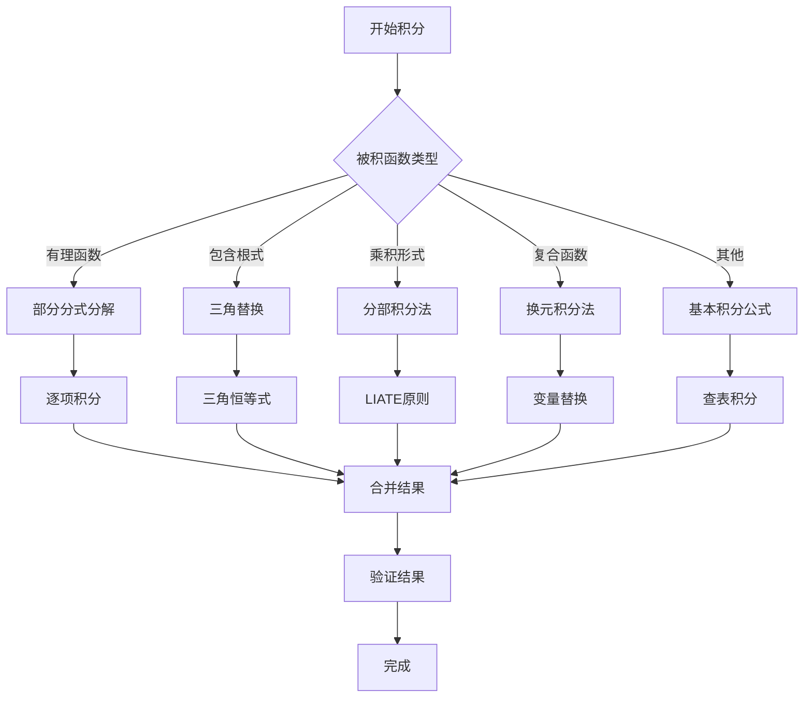

# 00-积分技巧总览

## 目录

1. [基本概念](#1-基本概念)
2. [换元积分法](#2-换元积分法)
3. [分部积分法](#3-分部积分法)
4. [三角替换](#4-三角替换)
5. [部分分式分解](#5-部分分式分解)
6. [有理函数积分](#6-有理函数积分)
7. [特殊技巧](#7-特殊技巧)
8. [相关链接](#8-相关链接)

## 1. 基本概念

### 1.1 积分技巧的定义

**定义 1.1** (积分技巧)
积分技巧是指通过特定的数学方法将复杂积分转化为简单积分或已知积分形式的技术。

### 1.2 积分技巧的分类

**分类体系**：

1. **换元积分法**：通过变量替换简化积分
2. **分部积分法**：利用乘积的导数公式
3. **三角替换**：利用三角恒等式简化根式积分
4. **部分分式分解**：将有理函数分解为简单分式
5. **有理函数积分**：系统处理有理函数的积分
6. **特殊技巧**：针对特定形式的积分技巧

### 1.3 积分技巧的选择原则

**选择原则**：

1. **形式识别**：根据被积函数的形式选择合适技巧
2. **简化目标**：将复杂积分转化为基本积分公式
3. **计算效率**：选择计算量最小的技巧
4. **验证正确性**：通过求导验证结果的正确性

## 2. 换元积分法

### 2.1 第一类换元法（凑微分法）

**定理 2.1** (第一类换元法)
设 $u = g(x)$ 在区间 $I$ 上可导，$f(u)$ 在 $g(I)$ 上连续，则：
$$\int f(g(x)) g'(x) dx = \int f(u) du$$

**使用条件**：

- 被积函数可以表示为 $f(g(x)) g'(x)$ 的形式
- $g'(x)$ 是 $g(x)$ 的导数

**应用例子**：

1. $\int 2x e^{x^2} dx = \int e^{x^2} d(x^2) = e^{x^2} + C$
2. $\int \frac{1}{x} \ln x dx = \int \ln x d(\ln x) = \frac{\ln^2 x}{2} + C$

### 2.2 第二类换元法（变量替换法）

**定理 2.2** (第二类换元法)
设 $x = \phi(t)$ 在区间 $I$ 上可导且单调，$\phi'(t) \neq 0$，$f(x)$ 在 $\phi(I)$ 上连续，则：
$$\int f(x) dx = \int f(\phi(t)) \phi'(t) dt$$

**使用条件**：

- 通过变量替换可以简化被积函数
- 替换函数单调且可导

**应用例子**：

1. $\int \sqrt{1-x^2} dx$，设 $x = \sin t$
2. $\int \frac{1}{\sqrt{x^2+1}} dx$，设 $x = \tan t$

### 2.3 换元积分法的技巧

**常见替换**：

1. **线性替换**：$u = ax + b$
2. **幂函数替换**：$u = x^n$
3. **指数函数替换**：$u = e^x$
4. **对数函数替换**：$u = \ln x$
5. **三角函数替换**：$u = \sin x$, $u = \cos x$

**详细内容**：[换元积分法](./01-换元积分法.md)

## 3. 分部积分法

### 3.1 分部积分公式

**定理 3.1** (分部积分公式)
设 $u(x)$ 和 $v(x)$ 在区间 $I$ 上可导，则：
$$\int u(x) v'(x) dx = u(x) v(x) - \int v(x) u'(x) dx$$

**证明**：
由乘积求导公式：$(uv)' = u'v + uv'$
积分得：$uv = \int u'v dx + \int uv' dx$
因此：$\int uv' dx = uv - \int u'v dx$

### 3.2 分部积分法的选择原则

**LIATE原则**：

1. **L** - Logarithmic functions (对数函数)
2. **I** - Inverse trigonometric functions (反三角函数)
3. **A** - Algebraic functions (代数函数)
4. **T** - Trigonometric functions (三角函数)
5. **E** - Exponential functions (指数函数)

**选择策略**：

- 优先选择LIATE中排在后面的函数作为 $u(x)$
- 选择排在后面的函数作为 $v'(x)$

### 3.3 分部积分法的应用

**典型应用**：

1. $\int x e^x dx$：$u = x$, $dv = e^x dx$
2. $\int x \ln x dx$：$u = \ln x$, $dv = x dx$
3. $\int x^2 \sin x dx$：$u = x^2$, $dv = \sin x dx$

**详细内容**：[分部积分法](./02-分部积分法.md)

## 4. 三角替换

### 4.1 基本三角替换

**定理 4.1** (三角替换)
对于包含 $\sqrt{a^2 - x^2}$ 的积分，设 $x = a \sin \theta$
对于包含 $\sqrt{a^2 + x^2}$ 的积分，设 $x = a \tan \theta$
对于包含 $\sqrt{x^2 - a^2}$ 的积分，设 $x = a \sec \theta$

**替换规则**：

1. $\sqrt{a^2 - x^2}$ → $x = a \sin \theta$, $dx = a \cos \theta d\theta$
2. $\sqrt{a^2 + x^2}$ → $x = a \tan \theta$, $dx = a \sec^2 \theta d\theta$
3. $\sqrt{x^2 - a^2}$ → $x = a \sec \theta$, $dx = a \sec \theta \tan \theta d\theta$

### 4.2 三角替换的应用

**应用例子**：

1. $\int \frac{1}{\sqrt{1-x^2}} dx$：设 $x = \sin \theta$
2. $\int \frac{1}{x^2+1} dx$：设 $x = \tan \theta$
3. $\int \sqrt{x^2-1} dx$：设 $x = \sec \theta$

### 4.3 三角替换的注意事项

**注意事项**：

1. 确定合适的角度范围
2. 处理绝对值符号
3. 正确还原变量
4. 考虑多值性

**详细内容**：[三角替换](./03-三角替换.md)

## 5. 部分分式分解

### 5.1 部分分式分解的基本原理

**定理 5.1** (部分分式分解)
设 $P(x)$ 和 $Q(x)$ 是多项式，且 $\deg P < \deg Q$，则有理函数 $\frac{P(x)}{Q(x)}$ 可以分解为部分分式的和。

**分解步骤**：

1. 将分母 $Q(x)$ 因式分解
2. 对每个因式写出对应的部分分式
3. 确定待定系数
4. 验证分解的正确性

### 5.2 部分分式分解的类型

**类型一**：线性因式 $(x-a)$
$$\frac{A}{x-a}$$

**类型二**：重线性因式 $(x-a)^n$
$$\frac{A_1}{x-a} + \frac{A_2}{(x-a)^2} + \cdots + \frac{A_n}{(x-a)^n}$$

**类型三**：二次因式 $(x^2+px+q)$
$$\frac{Ax+B}{x^2+px+q}$$

**类型四**：重二次因式 $(x^2+px+q)^n$
$$\frac{A_1x+B_1}{x^2+px+q} + \frac{A_2x+B_2}{(x^2+px+q)^2} + \cdots + \frac{A_nx+B_n}{(x^2+px+q)^n}$$

### 5.3 部分分式分解的应用

**应用例子**：

1. $\frac{1}{(x-1)(x+2)} = \frac{A}{x-1} + \frac{B}{x+2}$
2. $\frac{x+1}{(x-1)^2} = \frac{A}{x-1} + \frac{B}{(x-1)^2}$
3. $\frac{1}{x^2+1} = \frac{Ax+B}{x^2+1}$

**详细内容**：[部分分式分解](./04-部分分式分解.md)

## 6. 有理函数积分

### 6.1 有理函数积分的分类

**分类**：

1. **真分式**：分子次数小于分母次数
2. **假分式**：分子次数大于等于分母次数

**处理方法**：

- 假分式：先进行多项式除法
- 真分式：使用部分分式分解

### 6.2 有理函数积分的步骤

**步骤**：

1. 判断是否为真分式
2. 如果不是真分式，进行多项式除法
3. 对分母进行因式分解
4. 进行部分分式分解
5. 逐项积分

### 6.3 有理函数积分的应用

**应用例子**：

1. $\int \frac{1}{x^2-1} dx$
2. $\int \frac{x+1}{x^2+2x+1} dx$
3. $\int \frac{x^3+1}{x^2+1} dx$

**详细内容**：[有理函数积分](./05-有理函数积分.md)

## 7. 特殊技巧

### 7.1 对称性利用

**技巧**：利用被积函数的对称性质简化计算。

**例子**：

- 偶函数：$\int_{-a}^{a} f(x) dx = 2\int_{0}^{a} f(x) dx$
- 奇函数：$\int_{-a}^{a} f(x) dx = 0$

### 7.2 参数积分

**技巧**：引入参数，通过求导简化积分。

**例子**：
$$\int e^{ax} \sin(bx) dx = \frac{e^{ax}(a\sin(bx) - b\cos(bx))}{a^2 + b^2} + C$$

### 7.3 递推公式

**技巧**：对于形如 $\int x^n f(x) dx$ 的积分，建立递推关系。

**例子**：
$$\int x^n e^x dx = x^n e^x - n \int x^{n-1} e^x dx$$

### 7.4 循环积分

**技巧**：当分部积分后出现原积分时，可以解方程。

**例子**：
$$\int e^x \sin x dx = \frac{e^x(\sin x - \cos x)}{2} + C$$

## 8. 相关链接

### 8.1 内部链接

- [换元积分法](./01-换元积分法.md)
- [分部积分法](./02-分部积分法.md)
- [三角替换](./03-三角替换.md)
- [部分分式分解](./04-部分分式分解.md)
- [有理函数积分](./05-有理函数积分.md)

### 8.2 外部链接

- [基本积分公式](../02-基本积分公式/00-基本积分公式总览.md)
- [原函数概念](../01-原函数概念/00-原函数概念总览.md)
- [积分技巧应用](../05-积分应用/01-物理应用.md)

### 8.3 技巧选择流程图

---

**最后更新**: 2024-12-19
**版本**: 1.0
**作者**: 数学重构项目组
