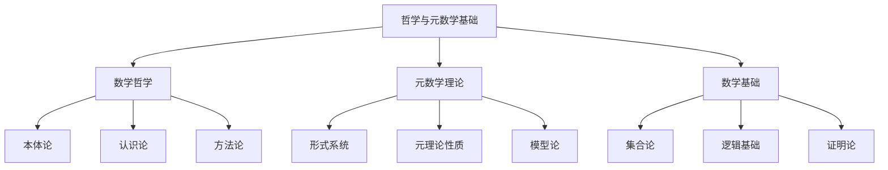

# 哲学与元数学基础总览

## 目录

- [哲学与元数学基础总览](#哲学与元数学基础总览)
  - [目录](#目录)
  - [1. 概述](#1-概述)
    - [1.1 定义与范围](#11-定义与范围)
    - [1.2 重要性](#12-重要性)
  - [2. 核心主题](#2-核心主题)
    - [2.1 数学哲学](#21-数学哲学)
      - [2.1.1 数学本体论](#211-数学本体论)
      - [2.1.2 数学认识论](#212-数学认识论)
      - [2.1.3 数学方法论](#213-数学方法论)
    - [2.2 元数学理论](#22-元数学理论)
      - [2.2.1 形式系统](#221-形式系统)
      - [2.2.2 元理论性质](#222-元理论性质)
      - [2.2.3 模型论](#223-模型论)
    - [2.3 数学基础](#23-数学基础)
      - [2.3.1 集合论基础](#231-集合论基础)
      - [2.3.2 逻辑基础](#232-逻辑基础)
      - [2.3.3 证明论](#233-证明论)
  - [3. 知识体系](#3-知识体系)
    - [3.1 理论层次](#31-理论层次)
    - [3.2 概念关联](#32-概念关联)
  - [4. 方法论](#4-方法论)
    - [4.1 形式化方法](#41-形式化方法)
      - [4.1.1 符号化](#411-符号化)
      - [4.1.2 公理化](#412-公理化)
      - [4.1.3 模型化](#413-模型化)
    - [4.2 分析性方法](#42-分析性方法)
      - [4.2.1 概念分析](#421-概念分析)
      - [4.2.2 逻辑分析](#422-逻辑分析)
      - [4.2.3 历史分析](#423-历史分析)
  - [5. 应用领域](#5-应用领域)
    - [5.1 数学教育](#51-数学教育)
    - [5.2 计算机科学](#52-计算机科学)
    - [5.3 人工智能](#53-人工智能)
    - [5.4 哲学研究](#54-哲学研究)
  - [6. 历史发展](#6-历史发展)
    - [6.1 古代数学哲学](#61-古代数学哲学)
      - [6.1.1 毕达哥拉斯学派](#611-毕达哥拉斯学派)
      - [6.1.2 柏拉图主义](#612-柏拉图主义)
      - [6.1.3 亚里士多德](#613-亚里士多德)
    - [6.2 近代数学哲学](#62-近代数学哲学)
      - [6.2.1 笛卡尔](#621-笛卡尔)
      - [6.2.2 莱布尼茨](#622-莱布尼茨)
      - [6.2.3 康德](#623-康德)
    - [6.3 现代数学哲学](#63-现代数学哲学)
      - [6.3.1 逻辑主义](#631-逻辑主义)
      - [6.3.2 直觉主义](#632-直觉主义)
      - [6.3.3 形式主义](#633-形式主义)
  - [7. 现代发展](#7-现代发展)
    - [7.1 计算理论的影响](#71-计算理论的影响)
      - [7.1.1 可计算性理论](#711-可计算性理论)
      - [7.1.2 复杂性理论](#712-复杂性理论)
    - [7.2 人工智能的发展](#72-人工智能的发展)
      - [7.2.1 自动定理证明](#721-自动定理证明)
      - [7.2.2 机器学习](#722-机器学习)
    - [7.3 跨学科应用](#73-跨学科应用)
      - [7.3.1 认知科学](#731-认知科学)
      - [7.3.2 语言学](#732-语言学)
  - [8. 参考文献](#8-参考文献)
    - [8.1 经典文献](#81-经典文献)
    - [8.2 现代文献](#82-现代文献)
    - [8.3 在线资源](#83-在线资源)

---

## 1. 概述

哲学与元数学基础是数学学科的根基，它研究数学的本质、数学知识的性质、数学推理的有效性以及数学理论的基础。这一领域不仅关注数学对象本身，更重要的是研究数学活动本身的性质和规律。

### 1.1 定义与范围

**哲学与元数学基础**包括：

- **数学哲学**：研究数学的本质、数学知识的性质、数学真理的含义
- **元数学**：使用数学方法研究数学理论本身的形式属性
- **数学基础**：为数学提供逻辑和集合论的基础
- **数学认知论**：研究数学知识的获得和理解过程

### 1.2 重要性

哲学与元数学基础的重要性体现在：

1. **理论严谨性**：为数学提供严格的理论基础
2. **方法可靠性**：确保数学推理方法的有效性
3. **知识系统性**：建立数学知识的系统化理解
4. **应用指导性**：指导数学在其他领域的应用

## 2. 核心主题

### 2.1 数学哲学

#### 2.1.1 数学本体论

- **数学对象的存在性**：数学对象是客观存在还是人类构造？
- **数学真理的性质**：数学真理是发现的还是发明的？
- **数学实在论与反实在论**：数学对象是否独立于人类思维存在？

#### 2.1.2 数学认识论

- **数学知识的来源**：数学知识如何获得？
- **数学直觉的作用**：直觉在数学发现中的作用
- **数学证明的本质**：什么是有效的数学证明？

#### 2.1.3 数学方法论

- **公理化方法**：公理系统的作用和局限
- **构造性方法**：构造性数学的特点
- **形式化方法**：形式化在数学中的作用

### 2.2 元数学理论

#### 2.2.1 形式系统

- **形式语言**：数学符号系统的构建
- **公理系统**：公理的选择和性质
- **推理规则**：形式推理的规则体系

#### 2.2.2 元理论性质

- **一致性**：形式系统的一致性
- **完备性**：形式系统的完备性
- **可判定性**：形式系统的可判定性

#### 2.2.3 模型论

- **模型的概念**：形式理论的语义解释
- **满足关系**：模型与理论的关系
- **模型构造**：模型的存在性和构造方法

### 2.3 数学基础

#### 2.3.1 集合论基础

- **朴素集合论**：集合的基本概念
- **公理集合论**：ZFC公理系统
- **大基数理论**：大基数公理

#### 2.3.2 逻辑基础

- **命题逻辑**：命题演算
- **谓词逻辑**：一阶谓词演算
- **高阶逻辑**：高阶逻辑系统

#### 2.3.3 证明论

- **自然演绎**：自然演绎系统
- **相继式演算**：根岑的相继式演算
- **切消定理**：证明的规范化

## 3. 知识体系

### 3.1 理论层次

### 3.2 概念关联

| 概念 | 数学哲学 | 元数学理论 | 数学基础 |
|------|----------|------------|----------|
| 数学对象 | 本体论问题 | 形式化表示 | 集合论构造 |
| 数学真理 | 认识论问题 | 语义解释 | 逻辑有效性 |
| 数学证明 | 方法论问题 | 形式证明 | 证明论研究 |

## 4. 方法论

### 4.1 形式化方法

#### 4.1.1 符号化

- 使用精确的符号语言
- 建立形式化的语法规则
- 定义语义解释

#### 4.1.2 公理化

- 选择基本公理
- 建立推理规则
- 构造形式系统

#### 4.1.3 模型化

- 构造语义模型
- 建立满足关系
- 验证理论性质

### 4.2 分析性方法

#### 4.2.1 概念分析

- 澄清数学概念的含义
- 分析概念间的逻辑关系
- 建立概念的分类体系

#### 4.2.2 逻辑分析

- 分析数学推理的结构
- 研究推理的有效性
- 建立逻辑系统

#### 4.2.3 历史分析

- 追溯概念的历史发展
- 分析理论的形成过程
- 理解数学思想的演变

## 5. 应用领域

### 5.1 数学教育

- **概念理解**：帮助学生理解数学概念的本质
- **推理训练**：培养学生的逻辑推理能力
- **方法指导**：指导学生掌握数学方法

### 5.2 计算机科学

- **形式化验证**：程序的形式化验证
- **类型理论**：编程语言的类型系统
- **自动定理证明**：计算机辅助证明

### 5.3 人工智能

- **知识表示**：数学知识的机器表示
- **推理系统**：基于逻辑的推理系统
- **学习理论**：数学学习的形式化理论

### 5.4 哲学研究

- **认识论研究**：数学知识的认识论问题
- **本体论研究**：数学对象的本体论地位
- **方法论研究**：数学研究的方法论问题

## 6. 历史发展

### 6.1 古代数学哲学

#### 6.1.1 毕达哥拉斯学派

- **万物皆数**：数的本体论地位
- **数学和谐**：数学与宇宙的和谐关系
- **几何直觉**：几何直觉的重要性

#### 6.1.2 柏拉图主义

- **理念世界**：数学对象的理念性质
- **回忆说**：数学知识的获得方式
- **几何学**：几何学的哲学意义

#### 6.1.3 亚里士多德

- **逻辑学**：形式逻辑的建立
- **证明理论**：数学证明的理论
- **分类学**：数学对象的分类

### 6.2 近代数学哲学

#### 6.2.1 笛卡尔

- **解析几何**：代数与几何的统一
- **方法谈**：数学方法的哲学基础
- **怀疑论**：数学知识的可靠性

#### 6.2.2 莱布尼茨

- **符号逻辑**：符号逻辑的构想
- **无穷小**：无穷小的哲学问题
- **单子论**：数学对象的单子性质

#### 6.2.3 康德

- **先验综合**：数学知识的先验性质
- **时空直观**：时空的直观形式
- **数学判断**：数学判断的性质

### 6.3 现代数学哲学

#### 6.3.1 逻辑主义

- **弗雷格**：数学的逻辑基础
- **罗素**：类型论和逻辑原子论
- **怀特海**：数学原理

#### 6.3.2 直觉主义

- **布劳威尔**：直觉主义数学
- **海廷**：直觉主义逻辑
- **构造性数学**：构造性方法

#### 6.3.3 形式主义

- **希尔伯特**：形式主义纲领
- **公理化方法**：形式系统的建立
- **元数学**：数学的元理论研究

## 7. 现代发展

### 7.1 计算理论的影响

#### 7.1.1 可计算性理论

- **图灵机**：计算的形式化模型
- **丘奇-图灵论题**：可计算性的界限
- **递归论**：递归函数理论

#### 7.1.2 复杂性理论

- **计算复杂性**：算法的复杂性分析
- **P vs NP问题**：计算复杂性的核心问题
- **随机性**：随机计算的理论

### 7.2 人工智能的发展

#### 7.2.1 自动定理证明

- **证明助手**：计算机辅助证明系统
- **形式化验证**：程序的形式化验证
- **类型论**：依赖类型理论

#### 7.2.2 机器学习

- **统计学习理论**：机器学习的基础理论
- **深度学习**：神经网络的数学基础
- **强化学习**：决策过程的数学建模

### 7.3 跨学科应用

#### 7.3.1 认知科学

- **数学认知**：数学思维的心理过程
- **概念形成**：数学概念的形成机制
- **学习理论**：数学学习的认知理论

#### 7.3.2 语言学

- **数学语言**：数学符号的语言学分析
- **语义学**：数学表达式的语义
- **语用学**：数学交流的语用学

## 8. 参考文献

### 8.1 经典文献

1. **Frege, G.** (1884). *Die Grundlagen der Arithmetik*. Breslau: Wilhelm Koebner.
2. **Russell, B.** (1903). *The Principles of Mathematics*. Cambridge: Cambridge University Press.
3. **Hilbert, D.** (1926). "Über das Unendliche". *Mathematische Annalen*, 95, 161-190.
4. **Gödel, K.** (1931). "Über formal unentscheidbare Sätze der Principia Mathematica und verwandter Systeme I". *Monatshefte für Mathematik und Physik*, 38, 173-198.

### 8.2 现代文献

1. **Shapiro, S.** (2000). *Thinking About Mathematics: The Philosophy of Mathematics*. Oxford: Oxford University Press.
2. **Horsten, L.** (2011). *The Tarskian Turn: Deflationism and Axiomatic Truth*. Cambridge, MA: MIT Press.
3. **Avigad, J.** (2018). *Mathematics and its Logics: Philosophical Essays*. Cambridge: Cambridge University Press.

### 8.3 在线资源

1. **Stanford Encyclopedia of Philosophy**: [Philosophy of Mathematics](https://plato.stanford.edu/entries/philosophy-mathematics/)
2. **Internet Encyclopedia of Philosophy**: [Mathematical Platonism](https://iep.utm.edu/mathplat/)
3. **Mathematical Logic and Foundations**: [Contemporary Research](https://mathoverflow.net/questions/tagged/logic)

---

**创建时间**: 2024-12-19
**最后更新**: 2024-12-19
**状态**: 初版完成
**下一步**: 创建具体的子主题文档
