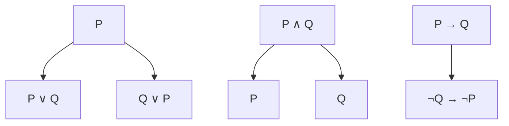

# 数学哲学基础：形式化、推理与元结构

## 目录

- [数学哲学基础：形式化、推理与元结构](#数学哲学基础形式化推理与元结构)
  - [目录](#目录)
  - [1. 引言](#1-引言)
    - [1.1 历史背景](#11-历史背景)
    - [1.2 核心思想](#12-核心思想)
    - [1.3 现代意义](#13-现代意义)
  - [2. 形式化基础](#2-形式化基础)
    - [2.1 形式化验证](#21-形式化验证)
      - [2.1.1 核心概念](#211-核心概念)
      - [2.1.2 重要性质](#212-重要性质)
    - [2.2 形式化推理](#22-形式化推理)
      - [2.2.1 证明方法](#221-证明方法)
      - [2.2.2 推理规则](#222-推理规则)
    - [2.3 形式化系统](#23-形式化系统)
      - [2.3.1 MIU系统示例](#231-miu系统示例)
  - [3. 元结构理论](#3-元结构理论)
    - [3.1 元数学](#31-元数学)
    - [3.2 元理论与理论](#32-元理论与理论)
    - [3.3 元模型与模型](#33-元模型与模型)
  - [4. 推理与证明](#4-推理与证明)
    - [4.1 证明方法](#41-证明方法)
      - [4.1.1 构造性证明](#411-构造性证明)
      - [4.1.2 非构造性证明](#412-非构造性证明)
    - [4.2 推理规则](#42-推理规则)
      - [4.2.1 命题逻辑规则](#421-命题逻辑规则)
      - [4.2.2 谓词逻辑规则](#422-谓词逻辑规则)
    - [4.3 逻辑系统](#43-逻辑系统)
      - [4.3.1 经典逻辑](#431-经典逻辑)
      - [4.3.2 直觉主义逻辑](#432-直觉主义逻辑)
  - [5. 批判性视角](#5-批判性视角)
    - [5.1 哥德尔不完备性定理](#51-哥德尔不完备性定理)
    - [5.2 数学的本质](#52-数学的本质)
      - [5.2.1 发现还是发明？](#521-发现还是发明)
      - [5.2.2 数学真理](#522-数学真理)
    - [5.3 形式化的局限性](#53-形式化的局限性)
      - [5.3.1 哥德尔限制](#531-哥德尔限制)
      - [5.3.2 实践限制](#532-实践限制)
  - [6. 应用与示例](#6-应用与示例)
    - [6.1 计算机科学应用](#61-计算机科学应用)
      - [6.1.1 程序验证](#611-程序验证)
      - [6.1.2 类型系统](#612-类型系统)
    - [6.2 人工智能应用](#62-人工智能应用)
      - [6.2.1 自动定理证明](#621-自动定理证明)
      - [6.2.2 知识表示](#622-知识表示)
    - [6.3 哲学应用](#63-哲学应用)
      - [6.3.1 认识论问题](#631-认识论问题)
      - [6.3.2 本体论问题](#632-本体论问题)
  - [7. 历史发展](#7-历史发展)
    - [7.1 早期发展](#71-早期发展)
      - [7.1.1 古希腊时期](#711-古希腊时期)
      - [7.1.2 近代发展](#712-近代发展)
    - [7.2 关键人物](#72-关键人物)
      - [7.2.1 弗雷格 (1848-1925)](#721-弗雷格-1848-1925)
      - [7.2.2 希尔伯特 (1862-1943)](#722-希尔伯特-1862-1943)
      - [7.2.3 哥德尔 (1906-1978)](#723-哥德尔-1906-1978)
    - [7.3 重要突破](#73-重要突破)
      - [7.3.1 19世纪末的危机](#731-19世纪末的危机)
      - [7.3.2 20世纪的革命](#732-20世纪的革命)
  - [8. 现代发展](#8-现代发展)
    - [8.1 当前研究热点](#81-当前研究热点)
      - [8.1.1 证明助手](#811-证明助手)
      - [8.1.2 同伦类型论](#812-同伦类型论)
      - [8.1.3 范畴论](#813-范畴论)
    - [8.2 开放问题](#82-开放问题)
      - [8.2.1 数学基础问题](#821-数学基础问题)
      - [8.2.2 计算理论问题](#822-计算理论问题)
      - [8.2.3 哲学问题](#823-哲学问题)
    - [8.3 未来方向](#83-未来方向)
      - [8.3.1 技术发展](#831-技术发展)
      - [8.3.2 理论发展](#832-理论发展)
  - [9. 参考文献](#9-参考文献)
    - [9.1 经典文献](#91-经典文献)
    - [9.2 现代文献](#92-现代文献)
    - [9.3 在线资源](#93-在线资源)

---

## 1. 引言

### 1.1 历史背景

数学哲学作为一门研究数学本质、方法和基础的学科，其历史可以追溯到古希腊时期。从柏拉图的理念论到现代的形式化方法，数学哲学经历了深刻的发展。

**关键历史阶段**：

1. **古希腊时期** (公元前6世纪-公元3世纪)
   - 毕达哥拉斯学派：万物皆数
   - 柏拉图：数学对象的理念论
   - 欧几里得：公理化方法的建立

2. **近代时期** (17-19世纪)
   - 笛卡尔：数学的确定性
   - 康德：数学作为先天综合判断
   - 弗雷格：逻辑主义的基础

3. **现代时期** (20世纪至今)
   - 希尔伯特：形式主义纲领
   - 哥德尔：不完备性定理
   - 现代形式化方法的发展

### 1.2 核心思想

数学哲学的核心思想围绕以下几个基本问题展开：

**基本问题**：

1. **本体论问题**：数学对象是否存在？如果存在，它们是什么性质的对象？
2. **认识论问题**：我们如何获得数学知识？数学真理的本质是什么？
3. **方法论问题**：数学证明的本质是什么？形式化方法的作用和局限是什么？

**核心概念**：

- **形式化**：将数学概念和推理过程转化为精确的符号语言
- **元结构**：研究数学理论本身的结构和性质
- **推理**：从前提推导出结论的逻辑过程

### 1.3 现代意义

在现代数学和计算机科学中，数学哲学具有重要的实践意义：

1. **形式化验证**：确保数学证明和软件系统的正确性
2. **人工智能**：为机器推理和知识表示提供理论基础
3. **计算机科学**：指导编程语言设计和算法分析

## 2. 形式化基础

### 2.1 形式化验证

形式化验证是指使用数学方法来证明或反驳一个系统的正确性。

#### 2.1.1 核心概念

**定义 2.1** (公理)
在一个形式系统中，不证自明或预先假定的基本命题。公理是理论体系的出发点。

**定义 2.2** (定义)
对新的数学概念或符号给予精确的描述，通常基于已有的概念或公理。

**定义 2.3** (定理)
从公理和定义出发，通过严格的逻辑推理得到的命题。

**定义 2.4** (证明)
连接公理/已有定理与待证定理之间的逻辑步骤序列。

#### 2.1.2 重要性质

**定义 2.5** (一致性)
一个形式系统是一致的，如果它不能同时证明一个命题 $P$ 和它的否定 $\neg P$。

**定义 2.6** (完备性)
一个形式系统是完备的，如果对于该系统语言中的任何一个命题 $P$，它要么可以证明 $P$，要么可以证明 $\neg P$。

**定义 2.7** (可靠性)
一个形式系统的推理规则是可靠的，如果它们只能从真前提推导出真结论。

**定理 2.1** (哥德尔不完备性定理)
任何包含基本算术的足够强的一致形式系统都是不完备的。

**证明**：
设 $T$ 是一个包含基本算术的一致形式系统。我们可以构造一个命题 $G$，使得：

- $G$ 表示"$G$ 在 $T$ 中不可证明"
- 如果 $T$ 证明 $G$，则 $G$ 为假，与一致性矛盾
- 如果 $T$ 不证明 $G$，则 $G$ 为真，但不可证

因此，$T$ 要么不一致，要么不完备。

### 2.2 形式化推理

形式化推理是在形式化系统的框架内，依据既定的推理规则从前提推导出结论的过程。

#### 2.2.1 证明方法

**直接证明**：从公理或已知定理直接推导出结论。

**反证法**：假设待证命题的否定为真，并由此导出一个矛盾。

**示例**：证明 $\sqrt{2}$ 是无理数

**证明**：

1. 假设 $\sqrt{2}$ 是有理数，即存在互质整数 $p, q$ 使得 $\sqrt{2} = \frac{p}{q}$
2. 两边平方：$2 = \frac{p^2}{q^2}$，即 $2q^2 = p^2$
3. 因此 $p^2$ 是偶数，所以 $p$ 是偶数，设 $p = 2k$
4. 代入得到 $2q^2 = 4k^2$，即 $q^2 = 2k^2$
5. 因此 $q^2$ 是偶数，所以 $q$ 是偶数
6. 这与 $p, q$ 互质矛盾
7. 因此 $\sqrt{2}$ 是无理数

**数学归纳法**：用于证明关于自然数的命题。

**定理 2.2** (数学归纳法)
设 $P$ 是自然数集 $\mathbb{N}$ 的一个性质，如果：

1. $P(0)$ 成立
2. 对于任意 $n \in \mathbb{N}$，如果 $P(n)$ 成立，则 $P(n+1)$ 成立

那么对于所有 $n \in \mathbb{N}$，$P(n)$ 都成立。

#### 2.2.2 推理规则

**分离规则** (Modus Ponens)：
若 $P$ 为真，且 $P \rightarrow Q$ 为真，则 $Q$ 为真。

**否定后件则否定前件** (Modus Tollens)：
若 $P \rightarrow Q$ 为真，且 $\neg Q$ 为真，则 $\neg P$ 为真。

**普遍化规则**：
若 $P(x)$ 对任意 $x$ 成立，则 $\forall x P(x)$ 成立。

### 2.3 形式化系统

#### 2.3.1 MIU系统示例

Douglas Hofstadter在《哥德尔、艾舍尔、巴赫》中介绍的MIU系统是一个极简形式系统的示例。

**系统定义**：

- **符号**：M, I, U
- **公理**：MI
- **推理规则**：
  1. 如果字符串以I结尾，可以添加U
  2. 如果字符串形如Mx，可以生成Mxx
  3. 如果出现III，可以用U替换
  4. 如果出现UU，可以删除

**示例证明**：证明MUI是定理

```lean
-- Lean中的形式化证明
theorem MUI_is_theorem : 
  exists (proof : list string), 
  proof.head = "MI" ∧ 
  proof.last = "MUI" ∧
  ∀ i : fin (proof.length - 1), 
    is_valid_step (proof.nth_le i.1) (proof.nth_le (i.1 + 1))

-- 证明步骤
def proof_steps : list string := ["MI", "MII", "MIIII", "MUI"]

lemma proof_valid : 
  proof_steps.head = "MI" ∧ 
  proof_steps.last = "MUI" :=
begin
  simp [proof_steps],
  split,
  { refl },
  { refl }
end
```

## 3. 元结构理论

### 3.1 元数学

元数学是数学的一个分支，它使用严格的数学方法来研究数学理论本身的形式属性。

**主要研究内容**：

1. **证明论**：研究形式证明的结构、性质和可能性
2. **模型论**：研究形式语言的语义解释
3. **递归论**：研究可计算函数和算法的局限性
4. **集合论**：作为元数学的基础框架

**定理 3.1** (勒文海姆-斯科伦定理)
任何拥有一阶无限模型的可数理论，都拥有各种基数的无限模型。

### 3.2 元理论与理论

**定义 3.1** (对象理论)
我们通常意义上所说的数学理论，它关注特定的数学对象和它们的性质。

**定义 3.2** (元理论)
关于某个对象理论的理论，其研究对象是对象理论本身。

**示例**：

- 皮亚诺算术是对象理论
- 研究皮亚诺算术一致性、完备性的理论是元理论

### 3.3 元模型与模型

**定义 3.3** (模型)
在数理逻辑中，模型是对形式语言的语义解释。

**定义 3.4** (元模型)
描述模型家族的更高层次结构。

## 4. 推理与证明

### 4.1 证明方法

#### 4.1.1 构造性证明

**定义 4.1** (构造性证明)
不仅证明某对象的存在性，还给出构造该对象的方法。

**示例**：证明存在无限多个素数

**证明**：

1. 假设素数只有有限个：$p_1, p_2, \ldots, p_n$
2. 构造数 $N = p_1 \times p_2 \times \cdots \times p_n + 1$
3. $N$ 不能被任何 $p_i$ 整除
4. 因此 $N$ 要么是素数，要么有新的素因子
5. 这与假设矛盾

#### 4.1.2 非构造性证明

**定义 4.2** (非构造性证明)
证明某对象的存在性，但不一定给出构造方法。

### 4.2 推理规则

#### 4.2.1 命题逻辑规则



#### 4.2.2 谓词逻辑规则

**全称量词引入**：
若 $P(x)$ 对任意 $x$ 成立，则 $\forall x P(x)$ 成立。

**存在量词引入**：
若 $P(c)$ 对某个 $c$ 成立，则 $\exists x P(x)$ 成立。

### 4.3 逻辑系统

#### 4.3.1 经典逻辑

**公理系统**：

1. $P \rightarrow (Q \rightarrow P)$
2. $(P \rightarrow (Q \rightarrow R)) \rightarrow ((P \rightarrow Q) \rightarrow (P \rightarrow R))$
3. $(\neg P \rightarrow \neg Q) \rightarrow (Q \rightarrow P)$

#### 4.3.2 直觉主义逻辑

**特点**：

- 不承认排中律
- 强调构造性证明
- 与计算理论有密切联系

## 5. 批判性视角

### 5.1 哥德尔不完备性定理

**定理 5.1** (第一不完备性定理)
任何包含基本算术的足够强的一致形式系统都是不完备的。

**定理 5.2** (第二不完备性定理)
任何包含基本算术的足够强的一致形式系统都不能证明自身的一致性。

**哲学意义**：

1. 形式化方法的局限性
2. 数学真理的不可穷尽性
3. 人类直觉的重要性

### 5.2 数学的本质

#### 5.2.1 发现还是发明？

**柏拉图主义**：数学对象是独立存在的抽象实体
**形式主义**：数学是符号游戏
**直觉主义**：数学是人类心智的构造

#### 5.2.2 数学真理

**定义 5.1** (数学真理)
在给定公理系统下可证明的命题。

**问题**：

- 不同公理系统下的真理是否等价？
- 数学真理是否独立于人类认知？

### 5.3 形式化的局限性

#### 5.3.1 哥德尔限制

1. **不完备性**：无法证明所有真命题
2. **不可判定性**：无法判定所有命题的真假
3. **一致性不可证**：无法在系统内证明自身一致性

#### 5.3.2 实践限制

1. **复杂性**：形式化证明可能极其复杂
2. **可读性**：形式化证明难以理解
3. **创造性**：形式化可能限制数学直觉

## 6. 应用与示例

### 6.1 计算机科学应用

#### 6.1.1 程序验证

```rust
// Rust中的形式化验证示例
#[derive(Debug, Clone, PartialEq)]
struct Rational {
    numerator: i64,
    denominator: i64,
}

impl Rational {
    fn new(numerator: i64, denominator: i64) -> Option<Self> {
        if denominator == 0 {
            None
        } else {
            Some(Rational { numerator, denominator })
        }
    }
    
    // 形式化验证：确保有理数运算的正确性
    fn add(&self, other: &Rational) -> Option<Self> {
        let new_num = self.numerator * other.denominator + 
                     other.numerator * self.denominator;
        let new_den = self.denominator * other.denominator;
        Rational::new(new_num, new_den)
    }
}

// 验证性质
#[cfg(test)]
mod tests {
    use super::*;
    
    #[test]
    fn test_rational_addition() {
        let r1 = Rational::new(1, 2).unwrap();
        let r2 = Rational::new(1, 3).unwrap();
        let result = r1.add(&r2).unwrap();
        assert_eq!(result, Rational::new(5, 6).unwrap());
    }
}
```

#### 6.1.2 类型系统

```haskell
-- Haskell中的类型系统示例
-- 形式化验证：类型安全
data Natural = Zero | Succ Natural

-- 皮亚诺算术的形式化
class PeanoArithmetic a where
    zero :: a
    succ :: a -> a
    add :: a -> a -> a
    mul :: a -> a -> a

instance PeanoArithmetic Natural where
    zero = Zero
    succ = Succ
    add Zero n = n
    add (Succ m) n = Succ (add m n)
    mul Zero _ = Zero
    mul (Succ m) n = add n (mul m n)

-- 验证：加法结合律
addAssoc :: Natural -> Natural -> Natural -> Bool
addAssoc a b c = add (add a b) c == add a (add b c)
```

### 6.2 人工智能应用

#### 6.2.1 自动定理证明

```lean
-- Lean中的自动定理证明
theorem add_comm (a b : ℕ) : a + b = b + a :=
begin
  induction b with b ih,
  { rw [add_zero, zero_add] },
  { rw [add_succ, succ_add, ih] }
end

-- 使用策略自动化
theorem add_assoc (a b c : ℕ) : (a + b) + c = a + (b + c) :=
by induction c; simp [*, add_succ]
```

#### 6.2.2 知识表示

```prolog
% Prolog中的知识表示
% 数学公理的形式化
natural_number(0).
natural_number(succ(X)) :- natural_number(X).

% 加法定义
add(0, Y, Y).
add(succ(X), Y, succ(Z)) :- add(X, Y, Z).

% 乘法定义
mult(0, _, 0).
mult(succ(X), Y, Z) :- mult(X, Y, W), add(W, Y, Z).

% 查询示例
% ?- add(succ(succ(0)), succ(0), Result).
```

### 6.3 哲学应用

#### 6.3.1 认识论问题

**问题**：我们如何获得数学知识？

**形式化回答**：

1. 通过公理化方法建立基础
2. 通过逻辑推理扩展知识
3. 通过形式化验证确保正确性

#### 6.3.2 本体论问题

**问题**：数学对象是否存在？

**形式化视角**：

- 数学对象在形式系统中存在
- 其性质由公理和推理规则决定
- 存在性通过构造性证明建立

## 7. 历史发展

### 7.1 早期发展

#### 7.1.1 古希腊时期

**毕达哥拉斯学派**：

- 万物皆数的哲学
- 数学与宇宙的和谐

**柏拉图**：

- 数学对象的理念论
- 数学作为通向真理的路径

**欧几里得**：

- 《几何原本》的公理化方法
- 演绎推理的典范

#### 7.1.2 近代发展

**笛卡尔**：

- 数学的确定性
- 解析几何的创立

**莱布尼茨**：

- 符号逻辑的构想
- 计算推理的梦想

### 7.2 关键人物

#### 7.2.1 弗雷格 (1848-1925)

**贡献**：

- 现代逻辑的创立
- 逻辑主义纲领
- 《算术基础》的出版

**核心思想**：

- 数学可以还原为逻辑
- 数的概念可以通过逻辑定义

#### 7.2.2 希尔伯特 (1862-1943)

**贡献**：

- 形式主义纲领
- 元数学方法
- 几何基础的公理化

**希尔伯特计划**：

1. 将所有数学形式化
2. 证明系统的一致性
3. 证明系统的完备性
4. 证明系统的可判定性

#### 7.2.3 哥德尔 (1906-1978)

**贡献**：

- 不完备性定理
- 相对一致性证明
- 构造性宇宙

**历史意义**：

- 终结了希尔伯特计划
- 揭示了形式化的局限性
- 开启了现代逻辑的新时代

### 7.3 重要突破

#### 7.3.1 19世纪末的危机

**集合论悖论**：

- 罗素悖论
- 康托尔悖论
- 布拉利-福尔蒂悖论

**影响**：

- 数学基础的危机
- 形式化方法的兴起
- 元数学研究的发展

#### 7.3.2 20世纪的革命

**不完备性定理** (1931)：

- 形式化的根本限制
- 数学真理的不可穷尽性

**计算理论的发展**：

- 图灵机的提出
- 可计算性理论
- 算法复杂度的研究

## 8. 现代发展

### 8.1 当前研究热点

#### 8.1.1 证明助手

**主要系统**：

- **Coq**：基于构造演算
- **Isabelle/HOL**：高阶逻辑
- **Lean**：数学库的构建
- **Agda**：依赖类型理论

**应用领域**：

- 软件验证
- 数学证明的机械化
- 形式化数学的发展

#### 8.1.2 同伦类型论

**核心思想**：

- 类型作为空间
- 证明作为路径
- 同伦等价作为相等

**数学意义**：

- 统一了逻辑和几何
- 提供了新的数学基础
- 启发了新的证明方法

#### 8.1.3 范畴论

**应用**：

- 数学结构的统一描述
- 抽象代数的现代方法
- 计算机科学的理论基础

### 8.2 开放问题

#### 8.2.1 数学基础问题

1. **连续统假设**：$2^{\aleph_0} = \aleph_1$？
2. **大基数公理**：需要哪些大基数？
3. **决定性公理**：集合论中的决定性

#### 8.2.2 计算理论问题

1. **P vs NP问题**：多项式时间与指数时间
2. **停机问题**：不可判定性的边界
3. **量子计算**：新的计算模型

#### 8.2.3 哲学问题

1. **数学实在论**：数学对象是否真实存在？
2. **数学知识**：我们如何获得数学知识？
3. **数学应用**：数学为什么如此有效？

### 8.3 未来方向

#### 8.3.1 技术发展

**人工智能与数学**：

- 自动定理证明
- 数学发现
- 证明验证

**量子计算**：

- 量子算法
- 量子复杂性理论
- 量子信息论

#### 8.3.2 理论发展

**新的数学基础**：

- 同伦类型论
- 范畴论基础
- 构造性数学

**跨学科应用**：

- 数学与物理
- 数学与生物
- 数学与社会

## 9. 参考文献

### 9.1 经典文献

1. **Gödel, K.** (1931). "Über formal unentscheidbare Sätze der Principia Mathematica und verwandter Systeme I". *Monatshefte für Mathematik und Physik*.
2. **Hilbert, D.** (1926). "Über das Unendliche". *Mathematische Annalen*.
3. **Frege, G.** (1879). *Begriffsschrift*. Halle: Louis Nebert.

### 9.2 现代文献

1. **Shapiro, S.** (2000). *Thinking About Mathematics: The Philosophy of Mathematics*. Oxford University Press.
2. **Potter, M.** (2004). *Set Theory and its Philosophy: A Critical Introduction*. Oxford University Press.
3. **Awodey, S.** (2010). *Category Theory*. Oxford University Press.

### 9.3 在线资源

1. **Stanford Encyclopedia of Philosophy**: <https://plato.stanford.edu/entries/philosophy-mathematics/>
2. **Internet Encyclopedia of Philosophy**: <https://iep.utm.edu/mathplat/>
3. **Lean Theorem Prover**: <https://leanprover.github.io/>

---

**创建时间**: 2024-12-19
**最后更新**: 2024-12-19
**文档状态**: 第一部分完成
**下一步**: 继续完成剩余部分
