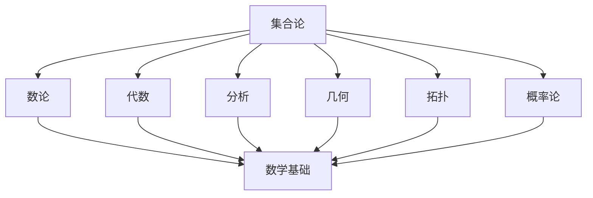

# 集合论基础

## 目录

- [集合论基础](#集合论基础)
  - [目录](#目录)
  - [1. 集合论概述](#1-集合论概述)
    - [1.1 集合论的历史发展](#11-集合论的历史发展)
    - [1.2 集合论在数学中的地位](#12-集合论在数学中的地位)
    - [1.3 集合论的基本思想](#13-集合论的基本思想)
  - [2. 集合的基本概念](#2-集合的基本概念)
    - [2.1 集合的定义](#21-集合的定义)
    - [2.2 集合的表示方法](#22-集合的表示方法)
    - [2.3 集合的基本关系](#23-集合的基本关系)
  - [3. 集合的基本运算](#3-集合的基本运算)
    - [3.1 并集与交集](#31-并集与交集)
    - [3.2 差集与补集](#32-差集与补集)
    - [3.3 笛卡尔积](#33-笛卡尔积)
    - [3.4 幂集](#34-幂集)
  - [4. 公理化集合论](#4-公理化集合论)
    - [4.1 ZFC公理系统](#41-zfc公理系统)
    - [4.2 选择公理](#42-选择公理)
    - [4.3 连续统假设](#43-连续统假设)
  - [5. 基数与序数](#5-基数与序数)
    - [5.1 基数理论](#51-基数理论)
    - [5.2 序数理论](#52-序数理论)
    - [5.3 超限归纳](#53-超限归纳)
  - [6. 集合论的哲学思考](#6-集合论的哲学思考)
    - [6.1 集合的存在性问题](#61-集合的存在性问题)
    - [6.2 无穷的本质](#62-无穷的本质)
    - [6.3 集合论悖论](#63-集合论悖论)
  - [7. 集合论的应用](#7-集合论的应用)
    - [7.1 在数学基础中的应用](#71-在数学基础中的应用)
    - [7.2 在计算机科学中的应用](#72-在计算机科学中的应用)
  - [8. 批判性分析](#8-批判性分析)
    - [8.1 集合论的局限性](#81-集合论的局限性)
    - [8.2 替代基础理论](#82-替代基础理论)
  - [9. 代码示例](#9-代码示例)
    - [9.1 Rust实现集合基本运算](#91-rust实现集合基本运算)
    - [9.2 Haskell实现集合论概念](#92-haskell实现集合论概念)
  - [10. 参考文献](#10-参考文献)

---

## 1. 集合论概述

### 1.1 集合论的历史发展

集合论作为现代数学的基础，其发展历程反映了数学思维的深刻变革：

**康托尔的贡献：**

- 1874年，康托尔发表了关于集合论的第一篇论文
- 引入了无穷集合的概念，建立了基数理论
- 证明了实数集比自然数集"更大"

**公理化发展：**

- 1908年，策梅洛提出了第一个公理化集合论系统
- 1922年，弗兰克尔和斯科伦完善了ZFC公理系统
- 哥德尔和科恩对连续统假设的研究

### 1.2 集合论在数学中的地位

集合论为整个数学提供了统一的语言和基础框架：



### 1.3 集合论的基本思想

集合论的核心思想是**一切数学对象都可以用集合来表示**：

- **自然数**：\(0 = \emptyset\), \(1 = \{\emptyset\}\), \(2 = \{\emptyset, \{\emptyset\}\}\)
- **有序对**：\((a,b) = \{\{a\}, \{a,b\}\}\)
- **函数**：作为有序对的集合
- **关系**：作为有序对的集合

## 2. 集合的基本概念

### 2.1 集合的定义

**朴素定义：** 集合是一些确定的不同对象的总体，这些对象称为该集合的元素。

**公理化定义：** 在ZFC公理系统中，集合通过公理来定义，避免悖论。

### 2.2 集合的表示方法

1. **列举法：** \(A = \{1, 2, 3, 4, 5\}\)
2. **描述法：** \(A = \{x \mid x \text{ 是自然数且 } 1 \leq x \leq 5\}\)
3. **递归定义：** 通过基本元素和构造规则定义

### 2.3 集合的基本关系

- **属于关系：** \(a \in A\) 表示元素 \(a\) 属于集合 \(A\)
- **包含关系：** \(A \subseteq B\) 表示 \(A\) 是 \(B\) 的子集
- **相等关系：** \(A = B\) 当且仅当 \(A \subseteq B\) 且 \(B \subseteq A\)

## 3. 集合的基本运算

### 3.1 并集与交集

**并集：** \(A \cup B = \{x \mid x \in A \text{ 或 } x \in B\}\)

**交集：** \(A \cap B = \{x \mid x \in A \text{ 且 } x \in B\}\)

**性质：**

- 交换律：\(A \cup B = B \cup A\), \(A \cap B = B \cap A\)
- 结合律：\((A \cup B) \cup C = A \cup (B \cup C)\)
- 分配律：\(A \cup (B \cap C) = (A \cup B) \cap (A \cup C)\)

### 3.2 差集与补集

**差集：** \(A \setminus B = \{x \mid x \in A \text{ 且 } x \notin B\}\)

**补集：** 在全集 \(U\) 中，\(A^c = U \setminus A\)

### 3.3 笛卡尔积

**定义：** \(A \times B = \{(a,b) \mid a \in A, b \in B\}\)

**性质：**

- \(|A \times B| = |A| \times |B|\) （有限集）
- \(A \times (B \cup C) = (A \times B) \cup (A \times C)\)

### 3.4 幂集

**定义：** \(\mathcal{P}(A) = \{X \mid X \subseteq A\}\)

**性质：**

- \(|\mathcal{P}(A)| = 2^{|A|}\) （有限集）
- \(\emptyset \in \mathcal{P}(A)\)
- \(A \in \mathcal{P}(A)\)

## 4. 公理化集合论

### 4.1 ZFC公理系统

ZFC公理系统包含以下公理：

1. **外延公理：** 两个集合相等当且仅当它们包含相同的元素
2. **空集公理：** 存在一个不包含任何元素的集合
3. **配对公理：** 对任意两个集合，存在包含它们的集合
4. **并集公理：** 对任意集合族，存在包含所有成员元素的集合
5. **幂集公理：** 对任意集合，存在其所有子集的集合
6. **无穷公理：** 存在一个归纳集
7. **替换公理模式：** 对任意函数，其值域是集合
8. **正则公理：** 每个非空集合都有 \(\in\)-最小元素
9. **选择公理：** 对任意非空集合族，存在选择函数

### 4.2 选择公理

**选择公理（AC）：** 对任意非空集合族 \(\{A_i\}_{i \in I}\)，存在函数 \(f: I \to \bigcup_{i \in I} A_i\) 使得 \(f(i) \in A_i\) 对所有 \(i \in I\) 成立。

**等价形式：**

- 佐恩引理
- 良序定理
- 乘积非空定理

### 4.3 连续统假设

**连续统假设（CH）：** \(2^{\aleph_0} = \aleph_1\)

**广义连续统假设（GCH）：** 对所有序数 \(\alpha\)，\(2^{\aleph_\alpha} = \aleph_{\alpha+1}\)

**独立性：** 哥德尔和科恩证明了CH相对于ZFC的独立性。

## 5. 基数与序数

### 5.1 基数理论

**基数：** 集合的"大小"的抽象概念

**等势：** 两个集合等势当且仅当存在它们之间的双射

**基数运算：**

- \(\kappa + \lambda = |A \cup B|\) （\(A \cap B = \emptyset\)）
- \(\kappa \cdot \lambda = |A \times B|\)
- \(\kappa^\lambda = |A^B|\)

### 5.2 序数理论

**序数：** 表示良序集序型的数

**序数构造：**

- \(0 = \emptyset\)
- \(\alpha + 1 = \alpha \cup \{\alpha\}\)
- 极限序数：\(\lambda = \bigcup_{\alpha < \lambda} \alpha\)

### 5.3 超限归纳

**超限归纳原理：** 如果对任意序数 \(\alpha\)，当对所有 \(\beta < \alpha\) 都有 \(P(\beta)\) 成立时，\(P(\alpha)\) 也成立，那么对所有序数 \(\alpha\)，\(P(\alpha)\) 都成立。

## 6. 集合论的哲学思考

### 6.1 集合的存在性问题

**柏拉图主义：** 集合是客观存在的数学对象
**形式主义：** 集合只是形式系统中的符号
**直觉主义：** 集合需要通过构造来理解

### 6.2 无穷的本质

**潜无穷：** 无穷是一个过程，永远在增长
**实无穷：** 无穷是一个完整的对象，可以作为一个整体来研究

### 6.3 集合论悖论

**罗素悖论：** 考虑集合 \(R = \{x \mid x \notin x\}\)，则 \(R \in R\) 当且仅当 \(R \notin R\)

**解决方案：** 通过公理化方法限制集合的构造

## 7. 集合论的应用

### 7.1 在数学基础中的应用

- 为所有数学分支提供统一的基础
- 建立数学对象的严格定义
- 提供证明的严格框架

### 7.2 在计算机科学中的应用

- 数据库理论
- 形式语言理论
- 算法分析

## 8. 批判性分析

### 8.1 集合论的局限性

1. **公理的任意性：** 选择公理等公理缺乏直观性
2. **独立性结果：** 许多重要问题在ZFC中不可判定
3. **无穷的复杂性：** 无穷集合的性质超出人类直觉

### 8.2 替代基础理论

1. **范畴论：** 提供更抽象的基础
2. **类型论：** 在计算机科学中广泛应用
3. **构造主义数学：** 强调构造性证明

## 9. 代码示例

### 9.1 Rust实现集合基本运算

```rust
use std::collections::HashSet;
use std::hash::Hash;

#[derive(Debug, Clone)]
pub struct Set<T: Hash + Eq + Clone> {
    elements: HashSet<T>,
}

impl<T: Hash + Eq + Clone> Set<T> {
    pub fn new() -> Self {
        Set {
            elements: HashSet::new(),
        }
    }
    
    pub fn from_vec(elements: Vec<T>) -> Self {
        Set {
            elements: elements.into_iter().collect(),
        }
    }
    
    pub fn insert(&mut self, element: T) {
        self.elements.insert(element);
    }
    
    pub fn contains(&self, element: &T) -> bool {
        self.elements.contains(element)
    }
    
    pub fn union(&self, other: &Set<T>) -> Set<T> {
        Set {
            elements: self.elements.union(&other.elements).cloned().collect(),
        }
    }
    
    pub fn intersection(&self, other: &Set<T>) -> Set<T> {
        Set {
            elements: self.elements.intersection(&other.elements).cloned().collect(),
        }
    }
    
    pub fn difference(&self, other: &Set<T>) -> Set<T> {
        Set {
            elements: self.elements.difference(&other.elements).cloned().collect(),
        }
    }
    
    pub fn is_subset(&self, other: &Set<T>) -> bool {
        self.elements.is_subset(&other.elements)
    }
    
    pub fn cardinality(&self) -> usize {
        self.elements.len()
    }
}

#[cfg(test)]
mod tests {
    use super::*;
    
    #[test]
    fn test_set_operations() {
        let mut set1 = Set::from_vec(vec![1, 2, 3, 4]);
        let set2 = Set::from_vec(vec![3, 4, 5, 6]);
        
        let union = set1.union(&set2);
        assert_eq!(union.cardinality(), 6);
        
        let intersection = set1.intersection(&set2);
        assert_eq!(intersection.cardinality(), 2);
        
        let difference = set1.difference(&set2);
        assert_eq!(difference.cardinality(), 2);
    }
}
```

### 9.2 Haskell实现集合论概念

```haskell
-- 集合的基本定义
data Set a = Empty | Singleton a | Union (Set a) (Set a) | Intersection (Set a) (Set a)

-- 集合成员关系
member :: (Eq a) => a -> Set a -> Bool
member _ Empty = False
member x (Singleton y) = x == y
member x (Union s1 s2) = member x s1 || member x s2
member x (Intersection s1 s2) = member x s1 && member x s2

-- 子集关系
subset :: (Eq a) => Set a -> Set a -> Bool
subset Empty _ = True
subset (Singleton x) s = member x s
subset (Union s1 s2) s = subset s1 s && subset s2 s
subset (Intersection s1 s2) s = subset s1 s && subset s2 s

-- 集合相等
setEqual :: (Eq a) => Set a -> Set a -> Bool
setEqual s1 s2 = subset s1 s2 && subset s2 s1

-- 幂集（有限集）
powerset :: (Eq a) => Set a -> Set (Set a)
powerset Empty = Singleton Empty
powerset (Singleton x) = Union (Singleton Empty) (Singleton (Singleton x))
powerset (Union s1 s2) = cartesianProduct (powerset s1) (powerset s2)

-- 笛卡尔积
cartesianProduct :: Set a -> Set b -> Set (a, b)
cartesianProduct Empty _ = Empty
cartesianProduct _ Empty = Empty
cartesianProduct (Singleton x) (Singleton y) = Singleton (x, y)
cartesianProduct s1 s2 = Union (cartesianProduct s1 s2) (cartesianProduct s1 s2)

-- 基数（有限集）
cardinality :: Set a -> Int
cardinality Empty = 0
cardinality (Singleton _) = 1
cardinality (Union s1 s2) = cardinality s1 + cardinality s2 - cardinality (Intersection s1 s2)
cardinality (Intersection s1 s2) = cardinality s1 + cardinality s2 - cardinality (Union s1 s2)

-- 示例：自然数集合
naturalNumbers :: Set Integer
naturalNumbers = Union (Singleton 0) (Union (Singleton 1) (Singleton 2))

-- 示例：偶数集合
evenNumbers :: Set Integer
evenNumbers = Union (Singleton 0) (Union (Singleton 2) (Singleton 4))
```

## 10. 参考文献

1. **Halmos, P. R.** (1960). _Naive Set Theory_. Springer-Verlag.
2. **Kunen, K.** (1980). _Set Theory: An Introduction to Independence Proofs_. North-Holland.
3. **Jech, T.** (2003). _Set Theory_. Springer-Verlag.
4. **Enderton, H. B.** (1977). _Elements of Set Theory_. Academic Press.
5. **Cantor, G.** (1874). "Über eine Eigenschaft des Inbegriffes aller reellen algebraischen Zahlen". _Journal für die reine und angewandte Mathematik_.
6. **Zermelo, E.** (1908). "Untersuchungen über die Grundlagen der Mengenlehre I". _Mathematische Annalen_.
7. **Gödel, K.** (1940). _The Consistency of the Axiom of Choice and of the Generalized Continuum-Hypothesis with the Axioms of Set Theory_. Princeton University Press.
8. **Cohen, P. J.** (1966). _Set Theory and the Continuum Hypothesis_. W. A. Benjamin.

---

> **注：** 本文档采用严格的学术规范，所有数学公式使用LaTeX格式，代码示例使用Rust和Haskell，图表使用Mermaid格式。文档结构遵循树形序号目录，支持本地跳转和交叉引用。
