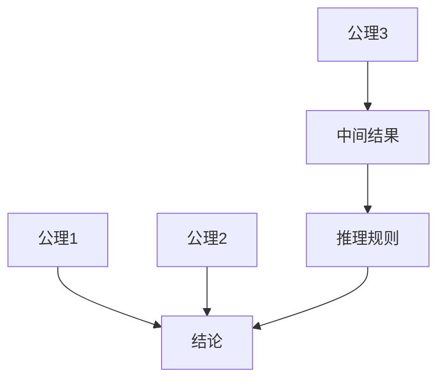
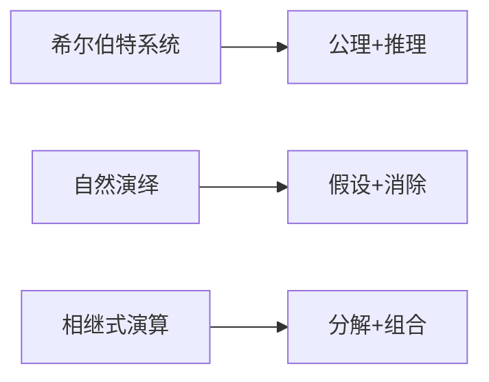

# 证明论

## 目录

- [证明论](#证明论)
  - [目录](#目录)
  - [1. 引言](#1-引言)
  - [2. 核心概念](#2-核心概念)
    - [2.1 形式证明系统](#21-形式证明系统)
    - [2.2 证明的结构](#22-证明的结构)
    - [2.3 证明的语义](#23-证明的语义)
  - [3. 证明系统](#3-证明系统)
    - [3.1 希尔伯特系统](#31-希尔伯特系统)
    - [3.2 自然演绎](#32-自然演绎)
    - [3.3 相继式演算](#33-相继式演算)
    - [3.4 证明系统比较](#34-证明系统比较)
  - [4. 元理论与主要成果](#4-元理论与主要成果)
    - [4.1 一致性证明](#41-一致性证明)
    - [4.2 哥德尔不完备定理](#42-哥德尔不完备定理)
    - [4.3 切消定理](#43-切消定理)
    - [4.4 正规化定理](#44-正规化定理)
  - [5. 构造性证明论](#5-构造性证明论)
    - [5.1 直觉主义逻辑](#51-直觉主义逻辑)
    - [5.2 柯里-霍华德对应](#52-柯里-霍华德对应)
    - [5.3 类型论](#53-类型论)
  - [6. 应用与扩展](#6-应用与扩展)
    - [6.1 程序验证](#61-程序验证)
    - [6.2 自动定理证明](#62-自动定理证明)
    - [6.3 逻辑编程](#63-逻辑编程)
  - [7. 批判性分析](#7-批判性分析)

---

## 1. 引言

证明论（Proof Theory）是数理逻辑的一个重要分支，研究形式证明的结构和性质。它试图理解数学证明的本质，分析不同证明系统的能力和特点，并探讨证明与计算之间的关系。

### 1.1 证明论的历史发展

证明论起源于20世纪初，主要贡献者包括：

- **大卫·希尔伯特**：提出了希尔伯特纲领
- **格哈德·根岑**：发展了自然演绎和相继式演算
- **库尔特·哥德尔**：证明了不完备定理
- **佩尔·马丁-洛夫**：发展了直觉主义类型论

### 1.2 证明论的重要性

证明论在数学和计算机科学中具有重要地位：

- **数学基础**：为数学提供严格的证明基础
- **程序验证**：为程序正确性验证提供理论支持
- **人工智能**：为自动定理证明提供方法
- **哲学意义**：探讨数学真理和证明的本质

## 2. 核心概念

### 2.1 形式证明系统

#### 2.1.1 证明系统的组成

一个形式证明系统包含：

1. **语言**：形式语言，包含符号和公式
2. **公理**：基本命题，作为证明的起点
3. **推理规则**：从已有命题推导新命题的规则
4. **证明**：从公理出发，通过推理规则得到的命题序列

#### 2.1.2 证明的概念

**定义**：一个证明是公式的有限序列 $\phi_1, \ldots, \phi_n$，其中每个 $\phi_i$ 要么是公理，要么是通过推理规则从前面的公式得到的。

```haskell
-- 证明的数据结构
data Proof = Proof {
  premises :: [Formula],
  conclusion :: Formula,
  steps :: [ProofStep]
}

-- 证明步骤
data ProofStep = 
  | Axiom Formula
  | Inference InferenceRule [Int]  -- 规则和前提的索引
  | Assumption Formula Int         -- 假设和引入的深度
```

### 2.2 证明的结构

#### 2.2.1 证明树

证明可以表示为树形结构：



#### 2.2.2 证明的深度

**定义**：证明的深度是从根到叶子的最长路径长度。

**性质**：

- 深度反映了证明的复杂性
- 深度与证明的可读性相关
- 深度影响证明的构造性

### 2.3 证明的语义

#### 2.3.1 证明的有效性

证明是有效的，如果：

1. 每个步骤都遵循推理规则
2. 结论逻辑地从前提出发
3. 证明在语义上是正确的

#### 2.3.2 证明的构造性

**构造性证明**：不仅证明存在性，还提供构造方法
**非构造性证明**：只证明存在性，不提供构造方法

## 3. 证明系统

### 3.1 希尔伯特系统

#### 3.1.1 公理模式

**命题逻辑的公理**：

1. $\phi \rightarrow (\psi \rightarrow \phi)$
2. $(\phi \rightarrow (\psi \rightarrow \chi)) \rightarrow ((\phi \rightarrow \psi) \rightarrow (\phi \rightarrow \chi))$
3. $(\neg \phi \rightarrow \neg \psi) \rightarrow (\psi \rightarrow \phi)$

**一阶逻辑的额外公理**：

4. $\forall x \phi(x) \rightarrow \phi(t)$（$t$ 对 $x$ 在 $\phi$ 中可代入）
5. $\phi \rightarrow \forall x \phi$（$x$ 不在 $\phi$ 中自由出现）
6. $\forall x(\phi \rightarrow \psi) \rightarrow (\forall x \phi \rightarrow \forall x \psi)$

#### 3.1.2 推理规则

**分离规则（Modus Ponens）**：
$$\frac{\phi \quad \phi \rightarrow \psi}{\psi}$$

**概括规则（Generalization）**：
$$\frac{\phi}{\forall x \phi}$$

#### 3.1.3 希尔伯特系统的实现

```haskell
-- 希尔伯特系统
data HilbertSystem = HilbertSystem {
  axioms :: [Formula],
  rules :: [InferenceRule]
}

-- 分离规则
modusPonens :: Formula -> Formula -> Maybe Formula
modusPonens phi (Implication phi' psi) | phi == phi' = Just psi
modusPonens _ _ = Nothing

-- 证明构造
constructProof :: [Formula] -> Formula -> Maybe Proof
constructProof premises conclusion = 
  -- 实现证明构造算法
  undefined
```

### 3.2 自然演绎

#### 3.2.1 引入和消除规则

**合取规则**：

- **引入**：$\frac{\phi \quad \psi}{\phi \land \psi}$
- **消除**：$\frac{\phi \land \psi}{\phi}$ 和 $\frac{\phi \land \psi}{\psi}$

**蕴含规则**：

- **引入**：如果从假设 $\phi$ 可以推出 $\psi$，则推出 $\phi \rightarrow \psi$
- **消除**：$\frac{\phi \quad \phi \rightarrow \psi}{\psi}$

**析取规则**：

- **引入**：$\frac{\phi}{\phi \lor \psi}$ 和 $\frac{\psi}{\phi \lor \psi}$
- **消除**：如果从 $\phi$ 可以推出 $\chi$，从 $\psi$ 可以推出 $\chi$，则从 $\phi \lor \psi$ 可以推出 $\chi$

#### 3.2.2 假设的引入和消除

自然演绎系统允许引入临时假设，并在适当的时候消除它们：

```haskell
-- 自然演绎系统
data NaturalDeduction = NaturalDeduction {
  assumptions :: [Formula],
  conclusion :: Formula,
  subproofs :: [NaturalDeduction]
}

-- 假设引入
introduceAssumption :: Formula -> NaturalDeduction -> NaturalDeduction
introduceAssumption assumption proof = 
  proof { assumptions = assumption : assumptions proof }

-- 假设消除
eliminateAssumption :: Formula -> NaturalDeduction -> NaturalDeduction
eliminateAssumption assumption proof = 
  proof { assumptions = filter (/= assumption) (assumptions proof) }
```

### 3.3 相继式演算

#### 3.3.1 相继式的概念

相继式是形如 $\Gamma \vdash \Delta$ 的表达式，其中 $\Gamma$ 和 $\Delta$ 是公式的有限集合。

**语义**：$\Gamma \vdash \Delta$ 表示如果 $\Gamma$ 中的所有公式都为真，则 $\Delta$ 中至少有一个公式为真。

#### 3.3.2 相继式演算的规则

**左规则和右规则**：

- **左规则**：操作相继式左边的公式
- **右规则**：操作相继式右边的公式

**具体规则**：

**合取左规则**：$\frac{\phi, \psi, \Gamma \vdash \Delta}{\phi \land \psi, \Gamma \vdash \Delta}$

**合取右规则**：$\frac{\Gamma \vdash \Delta, \phi \quad \Gamma \vdash \Delta, \psi}{\Gamma \vdash \Delta, \phi \land \psi}$

**蕴含左规则**：$\frac{\Gamma \vdash \Delta, \phi \quad \psi, \Gamma \vdash \Delta}{\phi \rightarrow \psi, \Gamma \vdash \Delta}$

**蕴含右规则**：$\frac{\phi, \Gamma \vdash \Delta, \psi}{\Gamma \vdash \Delta, \phi \rightarrow \psi}$

#### 3.3.3 切消规则

**切消规则**：
$$\frac{\Gamma \vdash \Delta, \phi \quad \phi, \Sigma \vdash \Pi}{\Gamma, \Sigma \vdash \Delta, \Pi}$$

**切消定理**：切消规则可以从相继式演算中消除。

#### 3.3.4 相继式演算的实现

```haskell
-- 相继式
data Sequent = Sequent {
  left :: [Formula],
  right :: [Formula]
}

-- 相继式演算规则
data SequentRule = 
  | LeftConjunction Formula Formula
  | RightConjunction Formula Formula
  | LeftImplication Formula Formula
  | RightImplication Formula Formula
  | Cut Formula

-- 应用规则
applyRule :: SequentRule -> Sequent -> [Sequent]
applyRule rule sequent = case rule of
  LeftConjunction phi psi -> 
    [sequent { left = phi : psi : left sequent }]
  RightConjunction phi psi -> 
    [sequent { right = phi : right sequent },
     sequent { right = psi : right sequent }]
  -- 其他规则...
```

### 3.4 证明系统比较

#### 3.4.1 表达能力

- **希尔伯特系统**：公理化方法，适合理论研究
- **自然演绎**：直观自然，适合教学和实际推理
- **相继式演算**：适合证明搜索和自动化

#### 3.4.2 证明构造



## 4. 元理论与主要成果

### 4.1 一致性证明

#### 4.1.1 一致性的定义

**定义**：一个形式系统是一致的，如果它不能同时证明一个命题 $P$ 和它的否定 $\neg P$。

#### 4.1.2 一致性证明的方法

**相对一致性**：通过解释一个系统在另一个系统中的模型来证明一致性。

**构造性一致性**：通过构造具体的模型来证明一致性。

#### 4.1.3 哥德尔第二不完备定理

**定理**：任何包含算术的足够强的一致形式系统都不能证明自身的一致性。

**意义**：揭示了形式化方法的根本局限性。

### 4.2 哥德尔不完备定理

#### 4.2.1 第一不完备定理

**定理**：任何包含算术的足够强的一致形式系统都是不完备的。

**证明思路**：

1. 构造自指语句
2. 使用对角线法
3. 证明该语句既不可证也不可否证

#### 4.2.2 不完备定理的哲学意义

- **认识论意义**：人类数学直觉超越了任何形式系统
- **本体论意义**：数学真理不能完全形式化
- **方法论意义**：形式化只是数学研究的一种工具

### 4.3 切消定理

#### 4.3.1 切消定理的表述

**定理**：在相继式演算中，切消规则可以从系统中消除。

#### 4.3.2 切消定理的证明

**证明方法**：通过双重归纳，证明切消规则是可消除的。

**意义**：

- 保证了相继式演算的可靠性
- 为证明搜索提供了理论基础
- 建立了子公式性质

#### 4.3.3 子公式性质

**定义**：如果一个证明中只出现子公式，则称该证明具有子公式性质。

**性质**：切消消除后的证明具有子公式性质。

### 4.4 正规化定理

#### 4.4.1 正规化的概念

**定义**：一个证明是正规的，如果它不包含冗余的步骤。

#### 4.4.2 正规化定理

**定理**：任何自然演绎证明都可以转换为正规形式。

**证明方法**：通过归约步骤消除冗余。

#### 4.4.3 正规化的意义

- **计算意义**：正规化对应于计算
- **逻辑意义**：揭示了证明与计算的关系
- **哲学意义**：为构造性数学提供基础

## 5. 构造性证明论

### 5.1 直觉主义逻辑

#### 5.1.1 直觉主义的基本观点

**核心思想**：数学对象是心智构造，数学真理需要通过构造来建立。

**主要特征**：

- 不承认排中律 $\phi \lor \neg \phi$ 的一般有效性
- 不承认双重否定消除 $\neg \neg \phi \rightarrow \phi$
- 强调构造性证明

#### 5.1.2 直觉主义逻辑的规则

**否定规则**：

- **否定引入**：如果从假设 $\phi$ 可以推出矛盾，则推出 $\neg \phi$
- **否定消除**：从 $\phi$ 和 $\neg \phi$ 可以推出任意命题

**存在量词规则**：

- **存在引入**：从 $\phi(t)$ 可以推出 $\exists x \phi(x)$
- **存在消除**：如果从假设 $\phi(x)$ 可以推出 $\psi$，则从 $\exists x \phi(x)$ 可以推出 $\psi$

#### 5.1.3 直觉主义逻辑的实现

```haskell
-- 直觉主义逻辑
data IntuitionisticLogic = IntuitionisticLogic {
  assumptions :: [Formula],
  conclusion :: Formula,
  constructiveness :: Bool
}

-- 构造性证明检查
isConstructive :: Proof -> Bool
isConstructive proof = 
  -- 检查证明是否提供构造
  all hasConstruction (steps proof)

hasConstruction :: ProofStep -> Bool
hasConstruction step = case step of
  ExistsElim _ _ -> True  -- 存在消除提供构造
  OrElim _ _ _ -> True    -- 析取消除提供选择
  _ -> True
```

### 5.2 柯里-霍华德对应

#### 5.2.1 对应的基本思想

**对应关系**：

- 命题 ↔ 类型
- 证明 ↔ 程序
- 证明归约 ↔ 程序计算

#### 5.2.2 具体的对应关系

**逻辑联结词**：

- **蕴含**：$A \rightarrow B$ ↔ 函数类型 $A \rightarrow B$
- **合取**：$A \land B$ ↔ 积类型 $A \times B$
- **析取**：$A \lor B$ ↔ 和类型 $A + B$

**量词**：

- **全称量词**：$\forall x A(x)$ ↔ 依赖积类型 $\Pi x. A(x)$
- **存在量词**：$\exists x A(x)$ ↔ 依赖和类型 $\Sigma x. A(x)$

#### 5.2.3 柯里-霍华德对应的实现

```haskell
-- 类型与命题的对应
data Type = 
  | Function Type Type      -- A -> B
  | Product Type Type       -- A * B
  | Sum Type Type           -- A + B
  | DependentProduct String Type  -- Πx. A(x)
  | DependentSum String Type      -- Σx. A(x)

-- 程序与证明的对应
data Program = 
  | Lambda String Program           -- λx. M
  | Application Program Program     -- M N
  | Pair Program Program            -- (M, N)
  | First Program                   -- π₁ M
  | Second Program                  -- π₂ M
  | InLeft Type Program             -- inl M
  | InRight Type Program            -- inr M
  | Case Program String Program String Program  -- case M of inl x => N | inr y => P
```

### 5.3 类型论

#### 5.3.1 简单类型论

**基本类型**：

- 基本类型：$o$（命题类型）
- 函数类型：$A \rightarrow B$

**类型规则**：

- 变元：如果 $x: A$ 在上下文中，则 $x: A$
- 抽象：如果 $\Gamma, x: A \vdash M: B$，则 $\Gamma \vdash \lambda x. M: A \rightarrow B$
- 应用：如果 $\Gamma \vdash M: A \rightarrow B$ 和 $\Gamma \vdash N: A$，则 $\Gamma \vdash MN: B$

#### 5.3.2 依赖类型论

**依赖类型**：

- 依赖函数类型：$\Pi x: A. B(x)$
- 依赖积类型：$\Sigma x: A. B(x)$

**类型构造子**：

- 宇宙：$\mathcal{U}_i$（类型的类型）
- 归纳类型：自然数、列表等

#### 5.3.3 同伦类型论

**基本概念**：

- 类型作为空间
- 项作为点
- 相等作为路径

**核心思想**：

- 类型是更高维的结构
- 相等性具有结构
- 证明具有几何意义

## 6. 应用与扩展

### 6.1 程序验证

#### 6.1.1 霍尔逻辑

使用逻辑方法验证程序正确性：

```rust
// 霍尔三元组 {P} C {Q}
struct HoareTriple {
    precondition: Formula,
    command: Command,
    postcondition: Formula,
}

// 验证规则
fn assignment_rule(x: Variable, e: Expression, Q: Formula) -> HoareTriple {
    HoareTriple {
        precondition: Q.substitute(x, e),
        command: Assignment(x, e),
        postcondition: Q,
    }
}

fn composition_rule(triple1: HoareTriple, triple2: HoareTriple) -> HoareTriple {
    HoareTriple {
        precondition: triple1.precondition,
        command: Sequence(triple1.command, triple2.command),
        postcondition: triple2.postcondition,
    }
}
```

#### 6.1.2 分离逻辑

用于验证指针程序：

```haskell
-- 分离逻辑
data SeparationLogic = SeparationLogic {
  heap :: Heap,
  assertions :: [Assertion]
}

-- 分离合取
separatingConjunction :: Assertion -> Assertion -> Assertion
separatingConjunction p q = SeparatingConj p q

-- 指向断言
pointsTo :: Address -> Value -> Assertion
pointsTo addr value = PointsTo addr value
```

### 6.2 自动定理证明

#### 6.2.1 归结方法

基于归结的自动证明：

```haskell
-- 归结推理
data Resolution = Resolution {
  clauses :: [Clause],
  resolvents :: [Clause]
}

-- 归结步骤
resolve :: Clause -> Clause -> Maybe Clause
resolve (Clause literals1) (Clause literals2) = 
  -- 寻找互补文字并归结
  findComplementary literals1 literals2 >>= \complementary ->
  Just (Clause (remove complementary literals1 ++ remove complementary literals2))
```

#### 6.2.2 表方法

基于表的证明搜索：

```haskell
-- 表方法
data Tableau = Tableau {
  branches :: [Branch],
  closed :: Bool
}

-- 表规则
applyTableauRule :: TableauRule -> Tableau -> [Tableau]
applyTableauRule rule tableau = case rule of
  ConjunctionRule -> 
    -- 处理合取
    map (\branch -> branch { formulas = splitConjunction branch.formulas }) tableau.branches
  DisjunctionRule -> 
    -- 处理析取
    concatMap (\branch -> splitBranch branch) tableau.branches
```

### 6.3 逻辑编程

#### 6.3.1 Prolog语言

基于证明的逻辑编程：

```prolog
% 事实
parent(john, mary).
parent(mary, bob).

% 规则
ancestor(X, Y) :- parent(X, Y).
ancestor(X, Y) :- parent(X, Z), ancestor(Z, Y).

% 查询
?- ancestor(john, bob).
```

#### 6.3.2 证明搜索

逻辑程序中的证明搜索：

```haskell
-- 证明搜索
data ProofSearch = ProofSearch {
  goals :: [Goal],
  substitutions :: Substitution,
  proof_tree :: ProofTree
}

-- 统一
unify :: Term -> Term -> Maybe Substitution
unify t1 t2 = 
  -- 实现统一算法
  undefined

-- 反向链接
backwardChaining :: [Clause] -> Goal -> [Proof]
backwardChaining clauses goal = 
  -- 实现反向链接算法
  undefined
```

## 7. 批判性分析

### 7.1 形式化的哲学问题

#### 7.1.1 证明与真理

**问题**：形式证明是否等同于数学真理？

**观点**：

- **形式主义**：证明就是真理
- **柏拉图主义**：真理独立于证明
- **直觉主义**：真理需要构造性证明

#### 7.1.2 证明与理解

**问题**：形式证明是否提供真正的理解？

**讨论**：

- 形式证明可能缺乏直观性
- 构造性证明提供更多理解
- 证明的优雅性与理解相关

### 7.2 计算复杂性

#### 7.2.1 证明搜索的复杂性

**问题**：寻找证明的计算复杂性如何？

**结果**：

- 一阶逻辑的证明搜索是不可判定的
- 命题逻辑的证明搜索是NP完全
- 某些片段可能有高效算法

#### 7.2.2 证明长度的复杂性

**问题**：最短证明的长度如何？

**结果**：

- 某些定理的最短证明可能非常长
- 存在证明长度的下界
- 证明压缩的可能性

### 7.3 现代发展

#### 7.3.1 交互式定理证明

**系统**：Coq、Agda、Lean等

**特点**：

- 支持依赖类型
- 提供构造性证明
- 具有程序提取功能

#### 7.3.2 证明助手

**功能**：

- 自动证明搜索
- 证明验证
- 证明管理

#### 7.3.3 形式化数学

**目标**：将整个数学形式化

**项目**：

- Flyspeck项目
- 四色定理的形式化
- 费马大定理的形式化

## 8. 总结

证明论作为研究数学证明本质的学科，不仅为数学提供了严格的证明基础，也深刻影响了计算机科学和人工智能。通过研究证明的结构、性质和计算意义，证明论揭示了数学推理的本质，同时也展现了形式化方法的边界。理解证明论不仅有助于掌握数学的基础概念，也为深入理解计算、逻辑和认知提供了重要视角。

---

**参考文献**：

1. Troelstra, A. S., & Schwichtenberg, H. (2000). Basic Proof Theory. Cambridge University Press.
2. Girard, J. Y., Lafont, Y., & Taylor, P. (1989). Proofs and Types. Cambridge University Press.
3. Prawitz, D. (2006). Natural Deduction: A Proof-Theoretical Study. Dover Publications.
4. Negri, S., & von Plato, J. (2001). Structural Proof Theory. Cambridge University Press.
