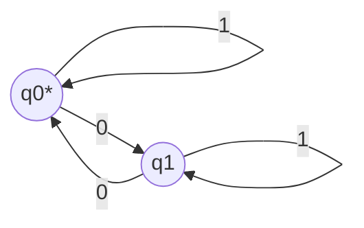

# MWE｜BNF 与 DFA（最小例）

## 1. BNF（算术表达式原型）

```bnf
<expr> ::= <expr> "+" <term> | <term>
<term> ::= <term> "*" <factor> | <factor>
<factor> ::= "(" <expr> ")" | <number>
```

- 要点：上下文无关文法（CFG）定义合法串集合。

## 2. DFA：识别偶数个 0 的二进制串

- 状态：{q0, q1}；初态/接受态：q0
- 转移：读到“0”时在 q0↔q1 间切换；读到“1”时自环



## 3. 术语对照

- BNF / CFG / DFA / 接受态 accepting state

## 4. 参考

- ISO/IEC 14977 (BNF)
- Hopcroft & Ullman, Automata Theory
