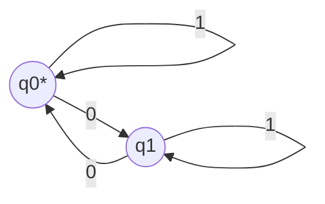

# MWE｜DFA 最小化（最小例）

## 1. 语言与DFA

- 语言：含偶数个 0 的二进制串
- 初始DFA：两状态 q0（初/受），q1；读“0”在 q0↔q1 切换，读“1”自环

## 2. 等价状态划分（Myhill–Nerode 直觉）

- 将不可区分的状态合并：
  - 等价关系：x ~ y 若对任意后缀 w，有 δ*(x,w) 与 δ*(y,w) 同为接受或同为拒绝
- 本例：q0 与 q1 在任意后缀下都能被后缀是否含偶/奇个0区分，故不可合并

## 3. 分割法最小化步骤（轮廓）

- 初始分割：F={q0} 与 Q\F={q1}
- 细化：检查读入0/1后落入的分割是否一致；若不一致则再细分
- 结果：两状态已最小

## 4. 参考

- Hopcroft DFA 最小化算法；Myhill–Nerode 定理（判定正则与最小DFA唯一性）
