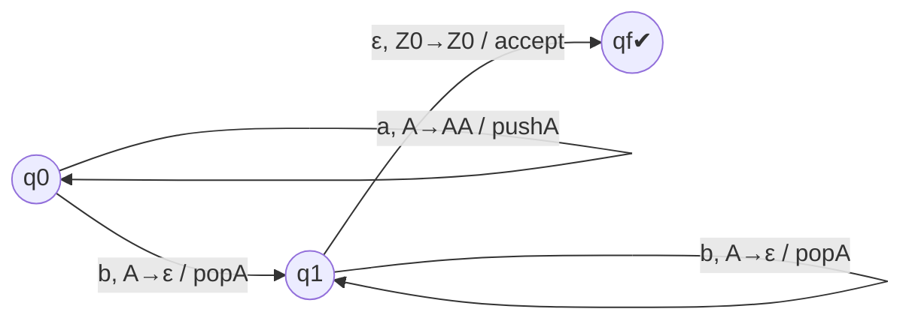

# MWE｜下推自动机（PDA）构造（最小例）

## 1. 目标

- 给出从语言描述到 PDA 的标准构造最小例，并与 CFG/闭包/泵引理方法建立交叉链接。

## 2. 语言：L = { a^n b^n | n≥0 }

- 思路：用栈记录 a 的数量，读到 b 时逐一弹栈；最终栈回到初始符号并且输入耗尽则接受。

注：仅示意转移，实际可用三元组 δ(q, a/ε, 栈顶)=(q', 栈操作)。

## 3. 形式化三元组表示（骨架）

- 状态集 Q={q0,q1,qf}；输入字母 {a,b}；栈符号 {Z0,A}；初态 q0；初栈符号 Z0；接受态 {qf}。
- 关键转移：
  - δ(q0, a, Z0) ⊇ {(q0, AZ0)}；δ(q0, a, A) ⊇ {(q0, AA)}
  - δ(q0, b, A) ⊇ {(q1, ε)}；δ(q1, b, A) ⊇ {(q1, ε)}
  - δ(q1, ε, Z0) ⊇ {(qf, Z0)}（空转接受）

## 4. 正确性要点

- 声明：该 PDA 仅当输入形如 a^n b^n 时接受；若在读 b 时栈顶不是 A 或读完后栈未回到 Z0，则拒绝。
- 与 CFG 对应：S→aSb | ε；可由标准“从 CFG 到 PDA”构造得到等价 PDA。

## 5. 练习（3）

1) 将接受方式改为“空栈接受”，给出等价修改（添加/替换终态）。
2) 将语言改为 L'={ a^n b^n c^m | n,m≥0 }，给出 PDA 设计要点（提示：读 c 时不操作栈）。
3) 证明：对正规语言也能构造等价 PDA，并说明为何 PDA 与 NFA 在正规语言上等价。

## 6. 交叉链接

- `MWE-CFL闭包性质-最小表.md`：与正则交的用法与构造套路
- `MWE-CFG最小解析-最小例.md`：自顶向下/自底向上解析的最小示例（见下一文）
- `MWE-CFG泵引理-最小例.md`：泵引理与 Ogden 引理在非CFL判定中的对照
