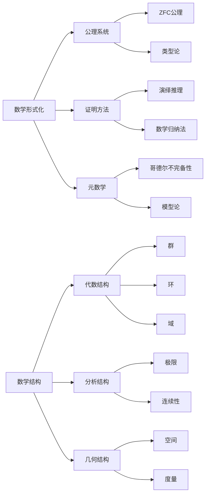

# 数学知识体系重构总览

## 1. 项目简介

本项目旨在对"数学"知识体系进行全面的重构与形式化，以建立一个严谨、系统化的数学知识库。项目特点包括：

1. **学术严谨性**：遵循严格的数学学术规范
2. **形式化实现**：提供Rust、Haskell或Lean的代码实现
3. **多维表征**：结合文本、公式、图表等多种表现形式
4. **哲学深度**：包含对数学概念的哲学和认知分析
5. **逻辑连贯性**：确保概念之间的逻辑关联清晰可见

## 2. 知识体系结构

```mermaid
graph TD
    A[数学知识体系] --> B[01-哲学与元数学基础]
    A --> C[02-数学基础与逻辑]
    A --> D[03-代数结构与理论]
    A --> E[04-微积分与分析]
    A --> F[05-几何与拓扑]
    A --> G[06-数论与离散数学]
    A --> H[07-概率统计与随机过程]
    A --> I[08-跨学科应用与联系]
    A --> J[09-元数学与形式化]
    
    B --> B1[数学哲学]
    B --> B2[认识论]
    B --> B3[方法论]
    
    C --> C1[集合论]
    C --> C2[数理逻辑]
    C --> C3[证明论]
    
    D --> D1[群论]
    D --> D2[环论]
    D --> D3[域论]
    D --> D4[范畴论]
    
    E --> E1[数系演化]
    E --> E2[微分学]
    E --> E3[积分学]
    
    F --> F1[欧几里得几何]
    F --> F2[非欧几何]
    F --> F3[拓扑学]
    
    G --> G1[数论]
    G --> G2[离散数学]
    
    H --> H1[概率论]
    H --> H2[统计学]
    
    I --> I1[数学物理]
    I --> I2[计算数学]
    
    J --> J1[形式化证明]
    J --> J2[类型论]
```



## 3. 目录结构

### 3.1 标准目录结构

```text
Math/Refactor/
├── 00-项目总览/                    # 项目管理、进度跟踪、知识图谱
├── 01-哲学与元数学基础/            # 数学哲学、元数学、认识论
├── 02-数学基础与逻辑/              # 集合论、数理逻辑、证明论
├── 03-代数结构与理论/              # 群论、环论、域论、范畴论
├── 04-微积分与分析/                # 实分析、复分析、泛函分析
├── 05-几何与拓扑/                  # 欧几里得几何、微分几何、拓扑学
├── 06-数论与离散数学/              # 初等数论、代数数论、组合学、图论
├── 07-概率统计与随机过程/          # 概率论、统计推断、随机过程
├── 08-跨学科应用与联系/            # 数学物理、计算数学、金融数学
└── 09-元数学与形式化/              # 形式化数学、证明辅助系统
```

### 3.2 各部分总览文档

| 目录 | 总览文档 | 状态 |
|------|----------|------|
| 01-哲学与元数学基础 | [00-哲学与元数学基础总览.md](../01-哲学与元数学基础/00-哲学与元数学基础总览.md) | ✅ 已完成 |
| 02-数学基础与逻辑 | [00-数学基础与逻辑总览.md](../02-数学基础与逻辑/00-数学基础与逻辑总览.md) | ⏳ 待创建 |
| 03-代数结构与理论 | [00-代数结构与理论总览.md](../03-代数结构与理论/00-代数结构与理论总览.md) | ✅ 已完成 |
| 04-微积分与分析 | [00-微积分与分析总览.md](../04-微积分与分析/00-微积分与分析总览.md) | ✅ 已完成 |
| 05-几何与拓扑 | [00-几何与拓扑总览.md](../05-几何与拓扑/00-几何与拓扑总览.md) | ✅ 已完成 |
| 06-数论与离散数学 | [00-数论与离散数学总览.md](../06-数论与离散数学/00-数论与离散数学总览.md) | ✅ 已完成 |
| 07-概率统计与随机过程 | [00-概率统计与随机过程总览.md](../07-概率统计与随机过程/00-概率统计与随机过程总览.md) | ⏳ 待创建 |
| 08-跨学科应用与联系 | [00-跨学科应用与联系总览.md](../08-跨学科应用与联系/00-跨学科应用与联系总览.md) | ⏳ 待创建 |
| 09-元数学与形式化 | [00-元数学与形式化总览.md](../09-元数学与形式化/00-元数学与形式化总览.md) | ⏳ 待创建 |

## 4. 项目进度

当前项目总体完成度：**70%**

详细进度请参见：[02-进度跟踪.md](./02-进度跟踪.md)

## 5. 技术规范

### 5.1 文件命名规范

- 目录统一使用"xx-目录名"的格式
- 文件统一使用"xx-文件名.md"的格式
- 序号保持顺序递增，不留空号

### 5.2 内容格式规范

- **文档头部**：标题、简介、目录
- **正文部分**：层次化编号，最多三级（如1.1.1）
- **公式格式**：LaTeX格式，如 $E = mc^2$
- **图表格式**：使用Mermaid绘制，如流程图、关系图等
- **代码示例**：使用代码块，优先使用Rust/Haskell
- **参考资料**：文末APA格式引用

### 5.3 交叉引用规范

- 使用相对路径引用其他文档
- 使用锚点链接引用文档内部章节
- 概念首次出现时链接到其定义文档

## 6. 核心概念图谱



## 7. 文档质量标准

### 7.1 数学严谨性

- 定义必须精确且完整
- 定理必须有严格的证明或证明思路
- 符号使用必须一致

### 7.2 内容完整性

- 历史背景与发展脉络
- 核心概念与定义
- 重要定理与证明
- 应用与扩展
- 哲学思考与批判
- 代码实现与示例

### 7.3 形式化代码

- Rust实现示例
- Haskell函数式实现
- Lean形式化证明（可选）

## 8. 后续计划

1. 完成06-数论与离散数学部分剩余文档
2. 创建02-数学基础与逻辑部分的基础结构
3. 建立全局知识图谱和概念索引
4. 为已完成部分添加内部交叉引用
5. 开始07-概率统计与随机过程部分

## 9. 项目文档导航

- [01-知识图谱分析.md](./01-知识图谱分析.md)：数学知识体系的图谱分析
- [02-进度跟踪.md](./02-进度跟踪.md)：项目进度和计划
- [03-待办任务清单.md](./03-待办任务清单.md)：详细任务列表和优先级

---

**最后更新**: 2025-06-24  
**当前状态**: 持续开发中
