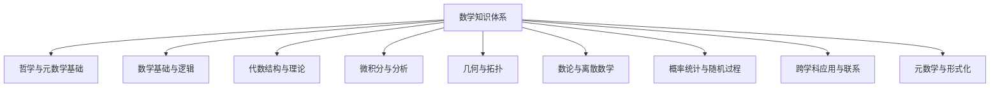

# 数学知识体系重构总览

## 1. 项目背景与目标

### 1.1 项目背景

数学知识体系是人类智慧的结晶，其内部结构复杂而精妙。然而，在长期的知识积累过程中，许多数学内容分散在不同文件中，存在重复、不一致和结构混乱等问题。本项目旨在对Math目录下的所有数学内容进行系统性梳理、分析和重构，形成一个结构清晰、内容连贯、形式规范的数学知识体系。

### 1.2 项目目标

1. **内容整合**：合并重复内容，消除冗余，保留最完整、最准确的版本
2. **结构优化**：建立清晰的目录结构和文件组织，便于导航和学习
3. **形式规范化**：统一格式，包括数学公式、图表、代码示例等
4. **知识关联**：建立概念间的关联网络和知识图谱，展示数学内部联系
5. **学术标准化**：确保内容符合数学学术规范，包括严格的证明和引用

## 2. 整体架构

### 2.1 目录结构

数学知识体系按照以下主要目录组织：

```text
Math/Refactor/
├── 00-项目总览/                    # 项目管理、进度跟踪、知识图谱
├── 01-哲学与元数学基础/            # 数学哲学、元数学、认识论
├── 02-数学基础与逻辑/              # 集合论、数理逻辑、证明论
├── 03-代数结构与理论/              # 群论、环论、域论、范畴论
├── 04-微积分与分析/                # 实分析、复分析、泛函分析
├── 05-几何与拓扑/                  # 欧几里得几何、微分几何、拓扑学
├── 06-数论与离散数学/              # 初等数论、代数数论、组合学、图论
├── 07-概率统计与随机过程/          # 概率论、统计推断、随机过程
├── 08-跨学科应用与联系/            # 数学物理、计算数学、金融数学
└── 09-元数学与形式化/              # 形式化数学、证明辅助系统
```

### 2.2 知识体系框架



## 3. 内容规范

### 3.1 文档格式规范

1. **文件命名**：采用"序号-主题名称.md"格式，例如"01-集合论基础.md"
2. **目录结构**：每个文档应有清晰的目录结构，使用Markdown标准的标题层级
3. **数学公式**：使用LaTeX格式的数学公式，行内公式使用单个`$`包围，行间公式使用双`$$`包围
4. **图表**：使用Mermaid语法创建图表，确保可在Markdown中正确渲染
5. **代码示例**：优先使用Rust或Haskell，如涉及形式化证明则使用Lean

### 3.2 内容组织规范

1. **总览文件**：每个主目录下应有一个"00-XX总览.md"文件，概述该主题的整体结构
2. **渐进复杂度**：内容应从基础到高级逐步展开，便于读者循序渐进学习
3. **内部链接**：使用相对路径建立文档间的内部链接，便于导航
4. **概念索引**：为重要概念建立索引，便于快速查找
5. **证明规范**：数学证明应遵循严格的形式化要求，包括前提、步骤和结论

### 3.3 形式化表示规范

1. **定义**：使用统一的格式表示数学定义，包括条件和范围
2. **定理**：清晰标识定理、引理、推论等，并提供完整证明
3. **公理系统**：明确列出所采用的公理系统，避免混淆
4. **符号约定**：在每个主题开始时明确符号约定，保持一致性

## 4. 重构方法论

### 4.1 内容分析阶段

1. **内容收集**：收集所有Math目录下的文件
2. **主题识别**：识别每个文件的主要主题和关键概念
3. **重复分析**：识别重复或高度相似的内容
4. **结构分析**：分析现有的组织结构和层次关系

### 4.2 内容整合阶段

1. **主题分类**：按主题将内容分类到相应目录
2. **内容合并**：合并重复内容，保留最完整的版本
3. **结构重组**：按照规范的目录结构重新组织内容
4. **关联建立**：建立概念间的关联关系

### 4.3 形式规范化阶段

1. **格式统一**：统一Markdown格式、数学公式、图表等
2. **术语规范**：统一术语和符号使用
3. **证明规范**：确保证明过程严谨完整
4. **引用规范**：建立统一的引用系统

### 4.4 质量控制阶段

1. **内容审查**：检查内容的准确性和完整性
2. **结构审查**：检查结构的清晰性和一致性
3. **形式审查**：检查形式的规范性和统一性
4. **关联审查**：检查概念关联的正确性和完整性

## 5. 项目进度

### 5.1 当前进度总览

| 目录                   | 文件总数 | 已完成 | 完成率 |
|------------------------|---------|--------|-------|
| 00-项目总览            | 5       | 4      | 80%   |
| 01-哲学与元数学基础    | 5       | 2      | 40%   |
| 02-数学基础与逻辑      | 8       | 3      | 38%   |
| 03-代数结构与理论      | 25      | 25     | 100%  |
| 04-微积分与分析        | 10      | 0      | 0%    |
| 05-几何与拓扑          | 12      | 0      | 0%    |
| 06-数论与离散数学      | 8       | 0      | 0%    |
| 07-概率统计与随机过程  | 8       | 0      | 0%    |
| 08-跨学科应用与联系    | 6       | 0      | 0%    |
| 09-元数学与形式化      | 5       | 0      | 0%    |
| **总计**               | **87**  | **34** | **39%** |

### 5.2 下一步工作计划

1. **完成04-微积分与分析目录**：
   - 创建00-微积分与分析总览.md
   - 整合数系演化相关内容
   - 整合微积分基础理论内容
   - 整合非标准分析内容

2. **完成05-几何与拓扑目录**：
   - 创建00-几何与拓扑总览.md
   - 整合欧几里得几何内容
   - 整合非欧几何内容
   - 整合拓扑学基础内容

3. **完成06-数论与离散数学目录**：
   - 创建00-数论与离散数学总览.md
   - 整合数论基础内容
   - 整合离散数学内容

## 6. 项目管理

### 6.1 文档管理

1. **版本控制**：使用Git进行版本控制，记录每次修改
2. **命名规范**：严格遵循文件命名规范，便于管理和查找
3. **目录结构**：维护清晰的目录结构，避免混乱

### 6.2 任务管理

1. **任务分解**：将大任务分解为小任务，便于执行和跟踪
2. **优先级设置**：设置任务优先级，优先完成重要任务
3. **进度跟踪**：定期更新进度，确保项目按计划进行

### 6.3 质量管理

1. **审查机制**：建立内容审查机制，确保质量
2. **反馈机制**：收集反馈，持续改进
3. **标准执行**：严格执行内容规范和格式规范

## 7. 持续上下文提醒系统

为确保重构工作的连续性，我们建立了以下上下文提醒系统：

1. **进度追踪文档**：在01-重构计划与进度.md中持续更新，记录项目进度
2. **任务清单**：在03-待办任务清单.md中维护详细任务
3. **知识图谱**：在02-知识图谱.md中维护概念关联
4. **上下文记录**：每次工作结束时记录当前上下文和下一步计划

---

**最后更新**：2025-07-10
**下一步计划**：开始04-微积分与分析目录的内容整合
