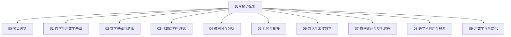
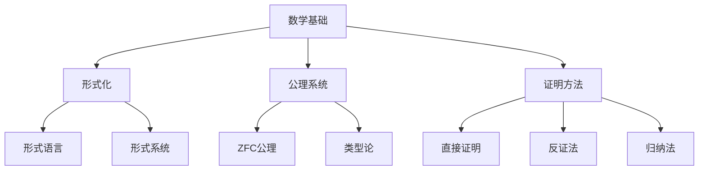
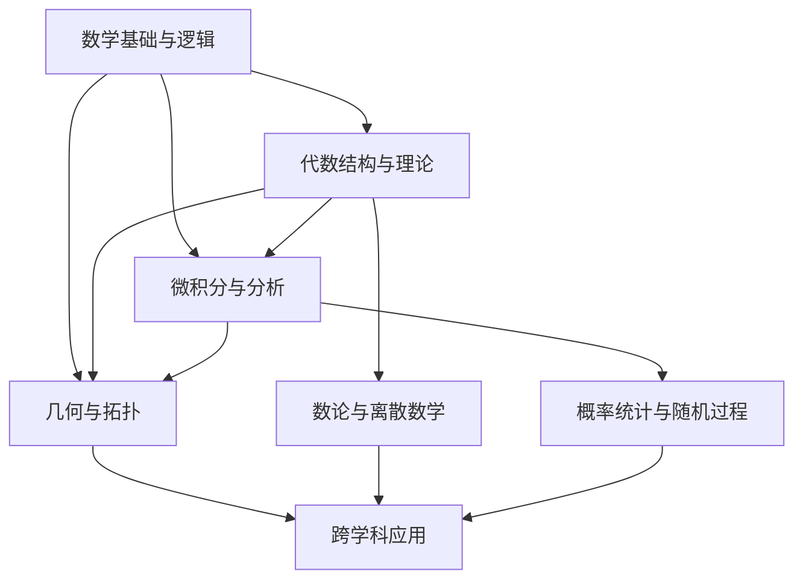

# 数学知识体系重构总览

## 1. 项目背景与目标

本项目旨在对数学知识体系进行系统性重构，通过分析、整合和规范化原始资料，建立一个结构清晰、内容严谨、形式统一的数学知识框架。项目的主要目标包括：

1. **系统化整理**：将分散的数学内容按照逻辑关系重新组织
2. **形式化规范**：采用严格的数学形式化表示和证明方法
3. **多维表征**：结合文本、公式、图表等多种表达方式
4. **消除重复**：识别并合并重复内容，保持一致性
5. **建立联系**：构建概念间的关联网络，形成知识图谱

## 2. 整体结构设计

本项目采用严格的层次化结构，将数学知识体系分为以下主要部分：

### 2.1 各部分核心内容

#### 00-项目总览
- 项目管理、进度跟踪、知识图谱、目录规范

#### 01-哲学与元数学基础
- 数学哲学、认识论、本体论、方法论、美学

#### 02-数学基础与逻辑
- 集合论、数理逻辑、模型论、递归论、证明论

#### 03-代数结构与理论
- 群论、环论、域论、模论、格论、线性代数、范畴论

#### 04-微积分与分析
- 数系演化、极限理论、微分学、积分学、级数理论

#### 05-几何与拓扑
- 欧几里得几何、非欧几何、微分几何、拓扑学

#### 06-数论与离散数学
- 初等数论、代数数论、图论、组合学、密码学

#### 07-概率统计与随机过程
- 概率论、统计推断、随机过程、贝叶斯统计

#### 08-跨学科应用与联系
- 数学物理、计算数学、金融数学、数据科学

#### 09-元数学与形式化
- 形式化数学、证明辅助系统、类型论、计算机验证

## 3. 方法论与规范

### 3.1 内容组织规范

1. **文件命名规则**：
   - 目录使用两位数字前缀（如"01-"）
   - 文件使用两位数字前缀（如"01-"）
   - 总览文件使用"00-"前缀

2. **内容结构规范**：
   - 每个文件必须有明确的标题和目录
   - 主要章节使用二级标题（##）
   - 子章节使用三级及以下标题（###, ####等）
   - 每个文件末尾包含创建日期、创建者和最近更新信息

### 3.2 形式化表示规范

1. **数学公式**：
   - 使用LaTeX格式
   - 重要公式使用独立公式块
   - 简单公式可使用行内格式

2. **图表表示**：
   - 使用Mermaid格式创建图表
   - 图表必须包含清晰的标题和说明

3. **代码示例**：
   - 优先使用Rust或Haskell
   - 提供详细的代码注释
   - 对应的数学概念必须有明确说明

4. **形式化证明**：
   - 重要定理使用形式化证明
   - 优先使用Lean进行证明验证
   - 证明过程必须清晰、严谨

### 3.3 交叉引用规范

1. **内部链接**：
   - 使用相对路径进行文件间链接
   - 使用锚点进行文件内部链接

2. **外部引用**：
   - 学术文献使用标准引用格式
   - 网络资源必须包含完整URL和访问日期

3. **概念索引**：
   - 重要概念必须在知识图谱中标记
   - 相关概念之间建立明确的关联关系

## 4. 项目进度与规划

### 4.1 当前进度概览

| 目录                   | 文件总数 | 已完成 | 完成率 |
|----------------------|-------|-----|-----|
| 00-项目总览              | 5     | 4   | 80% |
| 01-哲学与元数学基础        | 5     | 2   | 40% |
| 02-数学基础与逻辑         | 8     | 3   | 38% |
| 03-代数结构与理论         | 25    | 25  | 100% |
| 04-微积分与分析          | 10    | 3   | 30%  |
| 05-几何与拓扑           | 12    | 0   | 0%  |
| 06-数论与离散数学         | 8     | 0   | 0%  |
| 07-概率统计与随机过程       | 8     | 0   | 0%  |
| 08-跨学科应用与联系        | 6     | 0   | 0%  |
| 09-元数学与形式化         | 5     | 0   | 0%  |
| **总计**               | **92**| **37**| **40%**|

### 4.2 短期规划（本月）

1. **完成04-微积分与分析目录**
   - 完成所有基础文件
   - 整合数系演化理论
   - 整合非标准分析内容

2. **开始05-几何与拓扑目录**
   - 创建基本框架
   - 完成欧几里得几何基础
   - 开始微分几何内容

3. **完善02-数学基础与逻辑**
   - 完成集合论子目录
   - 完成数理逻辑子目录

### 4.3 中期规划（未来3个月）

1. **完成05-几何与拓扑目录**
2. **完成06-数论与离散数学目录**
3. **开始07-概率统计与随机过程目录**
4. **完成01-哲学与元数学基础目录**

### 4.4 长期规划（未来6个月）

1. **完成所有目录的基础内容**
2. **建立完整的知识图谱**
3. **实现全面的交叉引用系统**
4. **进行质量审查与优化**

## 5. 质量保证机制

### 5.1 内容质量标准

1. **准确性**：数学内容必须准确无误
2. **完整性**：概念、定理、证明必须完整
3. **一致性**：术语、符号、定义必须一致
4. **严谨性**：论证和证明必须严谨

### 5.2 审查流程

1. **自我审查**：创建者进行初步审查
2. **交叉审查**：不同部分的创建者相互审查
3. **专家审查**：邀请专业人士进行审查
4. **用户反馈**：收集和处理用户反馈

### 5.3 持续改进机制

1. **定期评审**：每月进行一次内容评审
2. **版本控制**：使用版本控制系统跟踪变更
3. **反馈循环**：建立反馈-修改-验证循环
4. **知识更新**：定期更新内容以反映最新研究

## 6. 知识图谱构建

### 6.1 核心概念网络

### 6.2 学科关联图谱

数学各分支之间的关联关系：

### 6.3 概念依赖关系

重要概念之间的依赖关系：

- **集合论** → **数理逻辑** → **模型论**
- **群论** → **环论** → **域论** → **伽罗瓦理论**
- **极限理论** → **连续性** → **微分学** → **积分学**
- **拓扑空间** → **度量空间** → **微分流形**

## 7. 参与与贡献

### 7.1 参与方式

1. **内容创建**：撰写新的数学内容
2. **内容审查**：审查和改进现有内容
3. **结构优化**：优化知识结构和组织
4. **技术支持**：提供技术工具和平台支持

### 7.2 贡献指南

1. **遵循规范**：按照项目规范创建内容
2. **保持一致**：与现有内容保持一致
3. **提供参考**：为重要内容提供参考文献
4. **反馈问题**：及时反馈发现的问题

## 8. 未来展望

1. **知识库扩展**：扩展到更多数学分支
2. **交互式内容**：增加交互式演示和可视化
3. **多语言支持**：提供多语言版本
4. **教育应用**：开发基于知识库的教育应用
5. **研究工具**：将知识库发展为研究工具

---

**创建日期**: 2025-07-04
**创建者**: AI助手
**最近更新**: 2025-07-04
