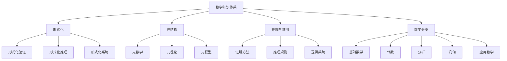
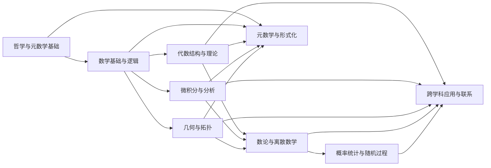
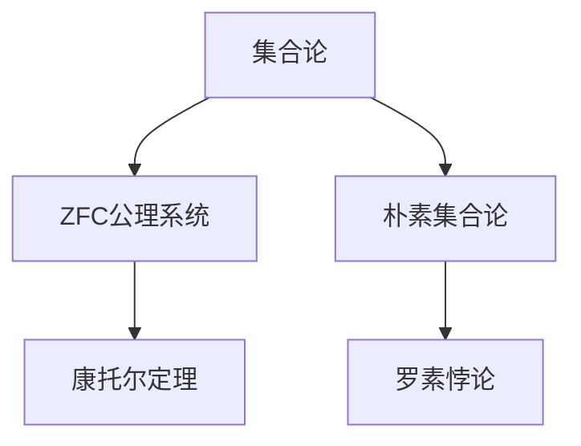

# 数学知识体系重构总览

## 1. 项目概述

本项目旨在对Math/Matter目录中的数学知识内容进行系统化重构和形式化，将分散、重复的内容整合为结构清晰、内容严谨的知识体系，并将其重构到Math/Refactor目录中。项目特别关注数学知识的哲学批判分析视角，同时强调形式化表示和多维表征。

### 1.1 项目目标

1. **系统化整理**: 将分散的数学知识按主题系统整理
2. **消除重复**: 合并重复内容，保留最完整、最准确的版本
3. **形式化表示**: 使用LaTeX数学公式、Mermaid图表、代码实现等多种形式表示数学概念
4. **建立联系**: 构建概念间的显式联系，形成完整的知识网络
5. **哲学深化**: 保留并强化数学概念的哲学批判分析视角
6. **学术规范**: 确保内容符合学术标准，包括准确的定义、严谨的证明和完整的引用

### 1.2 项目特色

1. **哲学批判视角**: 对数学基础和概念进行深入的哲学思考和批判分析
2. **多维表征系统**: 结合形式化数学、可视化图表、代码实现和历史视角
3. **跨学科联系**: 探索数学与物理、计算机科学、认知科学等领域的深层联系
4. **形式化实现**: 使用Rust和Haskell实现关键数学概念，使用Lean进行形式化证明
5. **严格的结构**: 采用统一的目录结构和编号系统，便于导航和理解

## 2. 知识体系结构

### 2.1 顶层目录结构

```text
Math/Refactor/
├── 00-项目总览/                    # 项目管理、进度跟踪、知识图谱
├── 01-哲学与元数学基础/            # 数学哲学、元数学、认识论
├── 02-数学基础与逻辑/              # 集合论、数理逻辑、证明论
├── 03-代数结构与理论/              # 群论、环论、域论、范畴论
├── 04-微积分与分析/                # 实分析、复分析、泛函分析
├── 05-几何与拓扑/                  # 欧几里得几何、微分几何、拓扑学
├── 06-数论与离散数学/              # 初等数论、代数数论、组合学、图论
├── 07-概率统计与随机过程/          # 概率论、统计推断、随机过程
├── 08-跨学科应用与联系/            # 数学物理、计算数学、金融数学
└── 09-元数学与形式化/              # 形式化数学、证明辅助系统
```

### 2.2 核心概念结构



### 2.3 知识模块关系



## 3. 重构方法论

### 3.1 内容分析与整理

1. **内容分析**: 分析原始文档的主题、结构和质量
2. **主题识别**: 识别并分类主要数学主题和概念
3. **重复识别**: 识别重复内容并确定合并策略
4. **知识图谱**: 构建概念间的关联网络

### 3.2 内容重构与标准化

1. **内容合并**: 合并重复内容，保留最完整版本
2. **结构优化**: 按照标准目录结构组织内容
3. **格式统一**: 统一数学公式、图表和代码格式
4. **链接建立**: 建立概念间的交叉引用系统

### 3.3 质量审查与完善

1. **内容审查**: 确保数学内容的准确性和完整性
2. **形式检查**: 检查形式化表示的正确性
3. **一致性检查**: 确保概念描述的一致性
4. **引用完善**: 添加学术引用和参考文献

## 4. 内容标准

### 4.1 文档结构标准

每个主题文档应包含以下部分：

1. **标题**: 清晰表明主题
2. **目录**: 详细的章节结构
3. **概述**: 主题的简要介绍
4. **历史背景**: 概念的历史发展
5. **形式定义**: 使用LaTeX表示的严格数学定义
6. **性质与定理**: 主要性质和定理，包括证明
7. **示例**: 具体示例和应用
8. **代码实现**: Rust或Haskell实现
9. **哲学思考**: 哲学批判分析
10. **相关概念**: 与其他概念的联系
11. **参考文献**: 学术引用

### 4.2 形式化标准

1. **数学公式**: 使用LaTeX格式，如：

```latex
\forall x \in \mathbb{R}, \exists \epsilon > 0 \text{ s.t. } |f(x) - L| < \epsilon \text{ when } |x - a| < \delta
```

1. **图表**: 使用Mermaid格式，如：



1. **代码实现**: 使用Rust或Haskell，如：

```rust
pub struct Group<T> {
    elements: Vec<T>,
    operation: fn(&T, &T) -> T,
    identity: T,
    inverse: fn(&T) -> T,
}

impl<T: Clone + PartialEq> Group<T> {
    pub fn is_associative(&self) -> bool {
        for a in &self.elements {
            for b in &self.elements {
                for c in &self.elements {
                    let ab_c = (self.operation)(&(self.operation)(a, b), c);
                    let a_bc = (self.operation)(a, &(self.operation)(b, c));
                    if ab_c != a_bc {
                        return false;
                    }
                }
            }
        }
        true
    }
}
```

## 5. 实施计划

### 5.1 第一阶段：内容分析与整理

- [x] 目录结构分析
- [x] 内容深度分析
- [x] 知识图谱构建
- [x] 重复内容识别

### 5.2 第二阶段：内容重构与标准化

- [ ] 建立标准模板
- [ ] 重构核心概念
- [ ] 统一格式规范
- [ ] 建立链接系统

### 5.3 第三阶段：质量审查与完善

- [ ] 内容质量审查
- [ ] 学术规范性检查
- [ ] 链接有效性验证
- [ ] 索引系统建立

## 6. 优先任务

### 6.1 高优先级任务

1. **项目总览文档整合**
   - 合并重复的进度跟踪文档
   - 统一知识图谱分析文档
   - 创建标准化的待办任务清单

2. **数学基础与逻辑结构化**
   - 创建子目录结构（集合论、数理逻辑等）
   - 从Matter目录整合相关内容
   - 创建总览文档

3. **微积分与分析内容整合**
   - 从Matter/Calculus整合内容
   - 去除重复内容
   - 按主题分类整理

### 6.2 中优先级任务

1. **代数结构与理论内容深化**
   - 完善范畴论视角的内容
   - 整合代数认知结构相关内容
   - 规范化数学公式和证明

2. **数论与离散数学扩展**
   - 创建编码理论、密码学基础文档
   - 完善图论和组合数学内容

3. **哲学与元数学基础深化**
   - 整合批判性分析内容
   - 完善数学哲学基础内容

## 7. 持续集成系统

为确保项目的持续进展和质量控制，建立以下持续集成系统：

1. **进度跟踪系统**
   - 定期更新进度文档
   - 记录已完成和待完成任务
   - 设定和跟踪里程碑

2. **内容质量检查**
   - 定期审查数学内容的准确性
   - 检查概念描述的一致性
   - 验证形式化表示的正确性

3. **文档更新机制**
   - 记录文档的创建和更新日期
   - 跟踪文档的修订历史
   - 标记需要更新的内容

## 8. 预期成果

本项目完成后将产生以下成果：

1. **结构化知识体系**: 一个组织清晰、内容严谨的数学知识体系
2. **多维表征系统**: 结合形式化数学、可视化图表和代码实现的表征系统
3. **哲学批判视角**: 深入的数学哲学批判分析
4. **跨学科联系**: 数学与其他学科的深层联系分析
5. **学习资源**: 可作为学习和研究数学的系统化资源

---

**创建日期**: 2024-06-25
**更新日期**: 2024-06-25
**更新人**: AI助手
**下一次更新**: 2024-06-26
