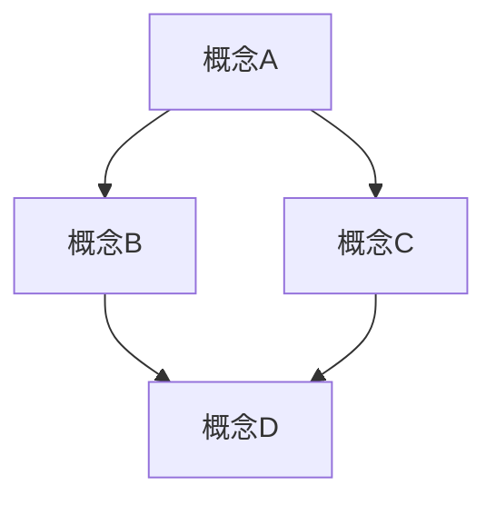

# [文档标题]

## 目录

1. [概述](#1-概述)
   1.1. [背景](#11-背景)
   1.2. [目标](#12-目标)
   1.3. [范围](#13-范围)
2. [基本概念](#2-基本概念)
   2.1. [定义](#21-定义)
   2.2. [公理](#22-公理)
   2.3. [基本性质](#23-基本性质)
3. [理论发展](#3-理论发展)
   3.1. [历史背景](#31-历史背景)
   3.2. [主要贡献者](#32-主要贡献者)
   3.3. [关键突破](#33-关键突破)
4. [核心内容](#4-核心内容)
   4.1. [主要定理](#41-主要定理)
   4.2. [证明方法](#42-证明方法)
   4.3. [应用案例](#43-应用案例)
5. [形式化表示](#5-形式化表示)
   5.1. [数学符号](#51-数学符号)
   5.2. [形式化证明](#52-形式化证明)
   5.3. [代码实现](#53-代码实现)
6. [多表征方式](#6-多表征方式)
   6.1. [图形表示](#61-图形表示)
   6.2. [表格数据](#62-表格数据)
   6.3. [算法描述](#63-算法描述)
7. [关联与延伸](#7-关联与延伸)
   7.1. [相关概念](#71-相关概念)
   7.2. [跨学科联系](#72-跨学科联系)
   7.3. [开放问题](#73-开放问题)
8. [参考资料](#8-参考资料)
   8.1. [学术文献](#81-学术文献)
   8.2. [教材资源](#82-教材资源)
   8.3. [在线资源](#83-在线资源)

## 1. 概述

### 1.1. 背景

[背景介绍，包括该主题在数学体系中的位置和重要性]

### 1.2. 目标

[本文档的目标，包括希望读者获得的知识和理解]

### 1.3. 范围

[本文档涵盖的内容范围和边界]

## 2. 基本概念

### 2.1. 定义

**定义 2.1.1** [概念名称]
[形式化定义]

**定义 2.1.2** [概念名称]
[形式化定义]

### 2.2. 公理

**公理 2.2.1** [公理名称]
[公理内容]

**公理 2.2.2** [公理名称]
[公理内容]

### 2.3. 基本性质

[基本性质描述和解释]

## 3. 理论发展

### 3.1. 历史背景

[理论的历史发展背景]

### 3.2. 主要贡献者

[主要贡献者及其贡献]

### 3.3. 关键突破

[理论发展中的关键突破]

## 4. 核心内容

### 4.1. 主要定理

**定理 4.1.1** [定理名称]
[定理内容]

**证明**:
[详细的证明过程]

**定理 4.1.2** [定理名称]
[定理内容]

**证明**:
[详细的证明过程]

### 4.2. 证明方法

[常用的证明方法和技巧]

### 4.3. 应用案例

[理论的实际应用案例]

## 5. 形式化表示

### 5.1. 数学符号

[数学符号的定义和使用]

### 5.2. 形式化证明

```lean
-- Lean证明示例
theorem example_theorem : P → Q :=
begin
  intro h,
  -- 证明步骤
  exact conclusion
end
```

### 5.3. 代码实现

```rust
// Rust实现示例
fn example_function<T>(input: T) -> Result<T, Error> {
    // 实现代码
    Ok(result)
}
```

或

```haskell
-- Haskell实现示例
exampleFunction :: a -> Maybe a
exampleFunction input = do
    -- 实现代码
    return result
```

## 6. 多表征方式

### 6.1. 图形表示



### 6.2. 表格数据

| 属性 | 值 | 说明 |
|------|-----|------|
| 属性1 | 值1 | 说明1 |
| 属性2 | 值2 | 说明2 |
| 属性3 | 值3 | 说明3 |

### 6.3. 算法描述

**算法**: [算法名称]

**输入**: [输入描述]
**输出**: [输出描述]

**步骤**:
1. [步骤1]
2. [步骤2]
3. [步骤3]

**复杂度分析**:
- 时间复杂度: [时间复杂度]
- 空间复杂度: [空间复杂度]

## 7. 关联与延伸

### 7.1. 相关概念

- [相关概念1](#相关概念1链接): [简短描述]
- [相关概念2](#相关概念2链接): [简短描述]
- [相关概念3](#相关概念3链接): [简短描述]

### 7.2. 跨学科联系

[与其他学科的联系和应用]

### 7.3. 开放问题

[该领域的未解决问题和研究方向]

## 8. 参考资料

### 8.1. 学术文献

1. [作者]. (年份). [标题]. *期刊名*, 卷(期), 页码.
2. [作者]. (年份). [标题]. *期刊名*, 卷(期), 页码.

### 8.2. 教材资源

1. [作者]. (年份). *[书名]*. 出版社.
2. [作者]. (年份). *[书名]*. 出版社.

### 8.3. 在线资源

1. [资源名称]. [URL]
2. [资源名称]. [URL]

---

**创建日期**: [创建日期]
**最后更新**: [更新日期]
**文档版本**: [版本号]
