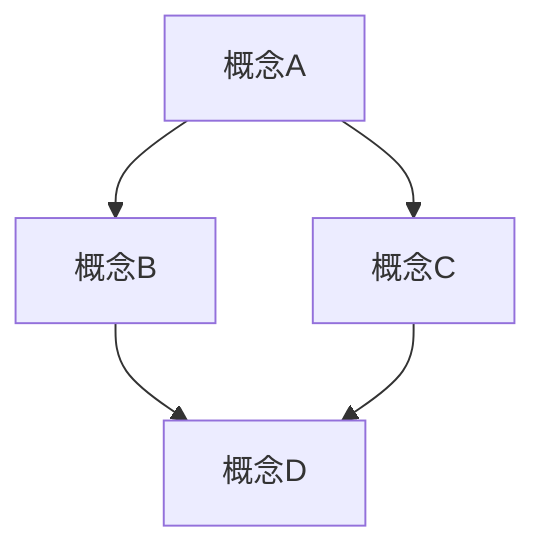

# [主题名称]

## 目录

- [\[主题名称\]](#主题名称)
  - [目录](#目录)
  - [1. 引言](#1-引言)
  - [2. 历史背景](#2-历史背景)
  - [3. 核心概念](#3-核心概念)
    - [3.1 概念A](#31-概念a)
    - [3.2 概念B](#32-概念b)
  - [4. 形式化定义](#4-形式化定义)
    - [4.1 定义](#41-定义)
    - [4.2 定理与证明](#42-定理与证明)
  - [5. 可视化表示](#5-可视化表示)
  - [6. 计算机实现](#6-计算机实现)
    - [6.1 Rust实现](#61-rust实现)
    - [6.2 Haskell实现](#62-haskell实现)
  - [7. 哲学思考与批判分析](#7-哲学思考与批判分析)
  - [8. 现代应用与发展](#8-现代应用与发展)
  - [9. 练习与问题](#9-练习与问题)
  - [10. 参考文献](#10-参考文献)

---

## 1. 引言

[简要介绍本主题的重要性、基本定义和在数学中的地位。包括主题的核心思想和主要应用领域。]

## 2. 历史背景

[描述本主题的历史发展过程，包括关键人物、重要突破和演变历程。强调历史上的重要转折点和思想变革。]

## 3. 核心概念

### 3.1 概念A

[详细解释概念A，包括其定义、性质和与其他概念的关系。使用清晰的语言和适当的例子。]

### 3.2 概念B

[详细解释概念B，包括其定义、性质和与其他概念的关系。使用清晰的语言和适当的例子。]

## 4. 形式化定义

### 4.1 定义

[使用严格的数学符号和LaTeX公式给出形式化定义。]

例如，群的定义：

设 $G$ 是一个集合，$\cdot$ 是 $G$ 上的二元运算。如果满足以下条件，则称 $(G, \cdot)$ 是一个群：

1. **封闭性**：对于任意 $a, b \in G$，都有 $a \cdot b \in G$
2. **结合律**：对于任意 $a, b, c \in G$，都有 $(a \cdot b) \cdot c = a \cdot (b \cdot c)$
3. **单位元**：存在 $e \in G$，使得对于任意 $a \in G$，都有 $e \cdot a = a \cdot e = a$
4. **逆元**：对于任意 $a \in G$，存在 $a^{-1} \in G$，使得 $a \cdot a^{-1} = a^{-1} \cdot a = e$

### 4.2 定理与证明

**定理 1**：[定理陈述]

**证明**：
[使用严格的数学推理和LaTeX公式给出完整证明。]

## 5. 可视化表示

[使用Mermaid图表或其他可视化方式展示概念间的关系或结构。]



## 6. 计算机实现

### 6.1 Rust实现

```rust
// Rust代码示例
struct ConceptA {
    property1: i32,
    property2: String,
}

impl ConceptA {
    fn new(p1: i32, p2: &str) -> Self {
        ConceptA {
            property1: p1,
            property2: p2.to_string(),
        }
    }
    
    fn operation(&self) -> i32 {
        // 实现操作
        self.property1 * 2
    }
}

// 使用示例
fn main() {
    let example = ConceptA::new(42, "example");
    println!("Result: {}", example.operation());
}
```

### 6.2 Haskell实现

```haskell
-- Haskell代码示例
data ConceptA = ConceptA { 
    property1 :: Int,
    property2 :: String
} deriving (Show)

-- 构造函数
createConceptA :: Int -> String -> ConceptA
createConceptA p1 p2 = ConceptA { property1 = p1, property2 = p2 }

-- 操作函数
operation :: ConceptA -> Int
operation concept = property1 concept * 2

-- 使用示例
main :: IO ()
main = do
    let example = createConceptA 42 "example"
    putStrLn $ "Result: " ++ show (operation example)
```

## 7. 哲学思考与批判分析

[探讨本主题的哲学基础、认识论意义和批判性思考。分析概念的局限性、不同观点和可能的扩展。]

## 8. 现代应用与发展

[描述本主题在现代数学、科学和技术中的应用。讨论最新的研究方向和未解决的问题。]

## 9. 练习与问题

1. [基础练习题]
2. [中等难度练习题]
3. [高级练习题]
4. [开放性问题]

## 10. 参考文献

1. [作者], [年份]. [标题]. [出版信息].
2. [作者], [年份]. [标题]. [出版信息].
3. [作者], [年份]. [标题]. [出版信息].

---

**相关主题**:

- [相关主题1](../XX-目录/YY-文件.md)
- [相关主题2](../XX-目录/ZZ-文件.md)

**最后更新**: YYYY-MM-DD
