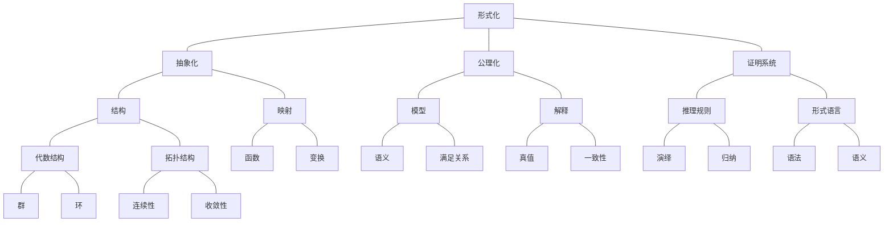
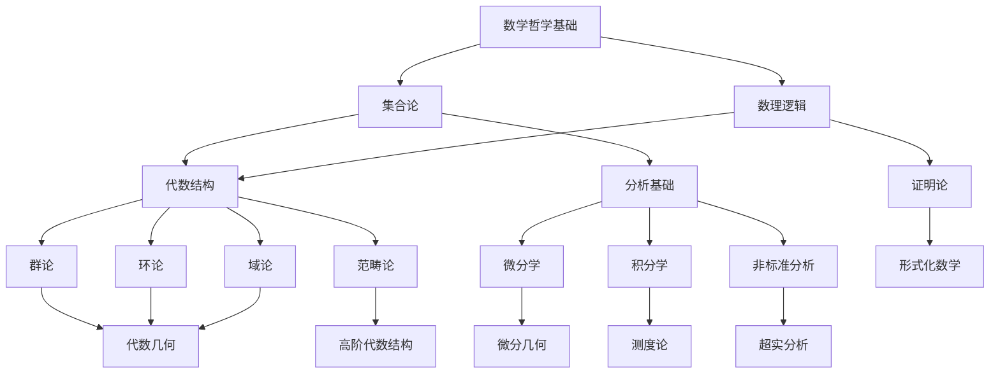

# 数学知识体系重构：知识图谱分析

## 1. 核心知识结构

### 1.1 数学主要分支关系

```mermaid
graph TD
    A[数学知识体系] --> B[哲学与元数学基础]
    A --> C[数学基础与逻辑]
    A --> D[代数结构与理论]
    A --> E[微积分与分析]
    A --> F[几何与拓扑]
    A --> G[数论与离散数学]
    A --> H[概率统计与随机过程]
    A --> I[跨学科应用与联系]
    A --> J[元数学与形式化]
    
    B --> B1[数学哲学]
    B --> B2[认识论]
    B --> B3[本体论]
    B --> B4[方法论]
    
    C --> C1[集合论]
    C --> C2[数理逻辑]
    C --> C3[模型论]
    C --> C4[递归论]
    C --> C5[证明论]
    
    D --> D1[群论]
    D --> D2[环论]
    D --> D3[域论]
    D --> D4[模论]
    D --> D5[格论]
    D --> D6[范畴论]
    
    E --> E1[数系演化]
    E --> E2[极限与连续性]
    E --> E3[微分学]
    E --> E4[积分学]
    E --> E5[级数理论]
    E --> E6[非标准分析]
    
    F --> F1[欧几里得几何]
    F --> F2[非欧几何]
    F --> F3[微分几何]
    F --> F4[拓扑学]
    F --> F5[代数几何]
    
    G --> G1[初等数论]
    G --> G2[代数数论]
    G --> G3[图论]
    G --> G4[组合数学]
    G --> G5[计算复杂性]
    
    H --> H1[概率论]
    H --> H2[数理统计]
    H --> H3[随机过程]
    H --> H4[统计推断]
    
    I --> I1[数学物理]
    I --> I2[计算数学]
    I --> I3[金融数学]
    I --> I4[生物数学]
    
    J --> J1[形式化数学]
    J --> J2[证明辅助系统]
    J --> J3[类型论]
    J --> J4[数学自动化]
```

### 1.2 核心概念关联网络

## 2. 知识内容分析

### 2.1 哲学与元数学基础

**核心主题**：

- 数学哲学基础（柏拉图主义、形式主义、直觉主义）
- 数学认识论（数学知识的本质、获取与确证）
- 数学本体论（数学对象的存在性质）
- 数学方法论（数学研究的方法与规范）
- 数学美学（数学中的美与和谐原则）

**批判性视角**：

- 数学基础的哲学争论
- 数学真理的本质与确定性
- 数学与现实世界的关系
- 数学直觉与形式化的张力

### 2.2 数学基础与逻辑

**核心主题**：

- 集合论（朴素集合论、公理化集合论、ZFC公理系统）
- 数理逻辑（命题逻辑、一阶逻辑、高阶逻辑）
- 模型论（结构、语言、满足关系）
- 递归论（可计算性、递归函数、图灵机）
- 证明论（形式系统、证明方法、哥德尔定理）

**批判性视角**：

- 集合论悖论与解决方案
- 完备性与不完备性问题
- 形式系统的局限性
- 数学基础的多元化视角

### 2.3 代数结构与理论

**核心主题**：

- 群论（群的定义、子群、商群、同态、群作用）
- 环论（环的定义、理想、商环、多项式环）
- 域论（域的定义、域扩张、有限域、代数闭域）
- 模论（模的定义、子模、商模、张量积）
- 格论（格的定义、分配格、布尔代数）
- 范畴论（范畴、函子、自然变换、伴随）

**批判性视角**：

- 抽象代数与认知结构的关联
- 代数结构的本质与统一性
- 范畴论视角下的数学统一
- 代数与软件编程的映射关系

### 2.4 微积分与分析

**核心主题**：

- 数系演化（自然数、整数、有理数、实数、复数）
- 极限与连续性理论（序列极限、函数极限、连续函数）
- 微分学（导数、微分、偏导数、梯度）
- 积分学（定积分、不定积分、多重积分）
- 级数理论（数项级数、函数级数、幂级数）
- 非标准分析（无穷小、超实数系统）

**批判性视角**：

- 微积分的合法性与基础
- 连续性概念的哲学分析
- 无穷概念的认知与形式化
- 非标准分析的优势与挑战

### 2.5 几何与拓扑

**核心主题**：

- 欧几里得几何（平面几何、空间几何）
- 非欧几何（黎曼几何、双曲几何）
- 微分几何（流形、张量、联络）
- 拓扑学（拓扑空间、同胚、基本群）
- 代数几何（代数簇、概形）

**批判性视角**：

- 几何直观与形式化的关系
- 空间概念的演化与扩展
- 拓扑不变量的本质
- 几何与物理世界的映射

### 2.6 数论与离散数学

**核心主题**：

- 初等数论（整除性、素数、同余）
- 代数数论（代数数、整环、理想类群）
- 图论（图的基本概念、路径、连通性）
- 组合数学（计数原理、生成函数）
- 计算复杂性理论（复杂性类、可计算性）

**批判性视角**：

- 数的本质与构造
- 离散与连续的界限
- 组合爆炸与计算边界
- 数学中的模式与结构

## 3. 内容重构策略

### 3.1 内容整合原则

1. **主题聚合**：将分散在不同文件中的相同主题内容整合到统一文档中
2. **层次结构**：建立清晰的概念层次，从基础到高级
3. **多重表征**：对每个概念提供多种表征方式（形式化定义、直观解释、可视化、代码实现）
4. **批判整合**：将哲学批判性分析融入各主题内容
5. **交叉引用**：建立概念间的明确链接和引用系统

### 3.2 优先重构主题

基于内容分析，确定以下优先重构主题：

1. **代数结构与理论**：
   - 合并范畴论视角的多个文件
   - 整合代数与认知结构的关联分析
   - 规范化群论、环论、域论的基础内容

2. **微积分与分析**：
   - 整合非标准分析的多个版本
   - 系统化数系演化理论
   - 统一微积分合法性的哲学分析

3. **数学基础与逻辑**：
   - 完善集合论与数理逻辑的基础内容
   - 整合模型论、递归论、证明论的内容
   - 补充形式化系统的批判性分析

### 3.3 内容表征方式

每个主题文档将包含以下表征方式：

1. **形式化定义**：使用LaTeX数学符号提供严格的数学定义
2. **直观解释**：提供概念的直观理解和解释
3. **可视化图表**：使用Mermaid图表展示概念关系和结构
4. **代码实现**：提供Rust和Haskell的代码实现
5. **形式化证明**：必要时使用Lean提供形式化证明
6. **批判性分析**：整合哲学与批判性思考
7. **应用案例**：提供理论应用的具体案例

## 4. 知识图谱构建

### 4.1 概念关联矩阵

| 核心概念 | 哲学基础 | 数学基础 | 代数 | 分析 | 几何 | 数论 | 应用 |
|---------|---------|---------|------|------|------|------|------|
| 形式化   | ★★★★★ | ★★★★★ | ★★★☆☆ | ★★★☆☆ | ★★☆☆☆ | ★★★☆☆ | ★★★★☆ |
| 抽象化   | ★★★★★ | ★★★★☆ | ★★★★★ | ★★★☆☆ | ★★★☆☆ | ★★☆☆☆ | ★★★★☆ |
| 结构     | ★★★☆☆ | ★★★★☆ | ★★★★★ | ★★★☆☆ | ★★★★☆ | ★★★★☆ | ★★★★☆ |
| 证明     | ★★★★☆ | ★★★★★ | ★★★★☆ | ★★★★☆ | ★★★☆☆ | ★★★★★ | ★★☆☆☆ |
| 连续性   | ★★★☆☆ | ★★★☆☆ | ★☆☆☆☆ | ★★★★★ | ★★★★☆ | ★☆☆☆☆ | ★★★☆☆ |
| 对称性   | ★★★★☆ | ★★☆☆☆ | ★★★★★ | ★★☆☆☆ | ★★★★★ | ★★★☆☆ | ★★★★☆ |
| 无穷     | ★★★★★ | ★★★★☆ | ★★☆☆☆ | ★★★★★ | ★★★☆☆ | ★★★☆☆ | ★★★☆☆ |

### 4.2 知识依赖图

## 5. 重构执行计划

### 5.1 短期任务（1-3天）

1. **完成目录结构规范化**
   - 合并重复目录
   - 统一文件命名规范
   - 创建子目录结构

2. **建立内容模板与规范**
   - 创建标准文档模板
   - 定义数学公式格式规范
   - 确立代码示例规范

3. **开始代数结构内容重构**
   - 分析Matter/Algebra目录内容
   - 整合范畴论视角文件
   - 创建群论、环论基础文档

### 5.2 中期任务（4-7天）

1. **完成代数结构与微积分内容重构**
   - 整合非标准分析内容
   - 完善数系演化理论
   - 深化代数与认知结构关联分析

2. **开始数学基础与逻辑内容重构**
   - 创建集合论子目录内容
   - 整合数理逻辑内容
   - 完善模型论、递归论内容

3. **建立交叉引用系统**
   - 创建概念索引
   - 建立文档间链接
   - 完善内部引用

### 5.3 长期任务（8-14天）

1. **完成所有主题内容重构**
   - 完善几何与拓扑内容
   - 整合数论与离散数学内容
   - 创建概率统计与随机过程内容

2. **实现全面形式化与规范化**
   - 统一所有数学公式
   - 添加代码实现
   - 完善形式化证明

3. **最终质量审查**
   - 检查内容准确性
   - 验证概念一致性
   - 确保格式规范

## 6. 知识重构挑战与对策

### 6.1 内容重复与冗余

**挑战**：Matter目录下存在大量重复内容，特别是微积分和代数领域

**对策**：

- 使用内容相似度分析识别重复内容
- 建立主题词表，按主题归类内容
- 采用"最佳版本+补充内容"的合并策略

### 6.2 概念不一致性

**挑战**：不同文件中对同一概念的表述不一致

**对策**：

- 创建统一的术语表和定义库
- 建立概念映射关系
- 采用最准确、最严格的定义作为标准

### 6.3 格式不统一

**挑战**：数学公式、图表、代码格式不一致

**对策**：

- 创建统一的格式模板
- 建立LaTeX公式规范
- 统一代码风格和注释

### 6.4 批判内容整合

**挑战**：如何有效整合哲学批判性分析内容

**对策**：

- 为每个主题文档添加"哲学思考与批判分析"部分
- 提取批判性分析的核心思想
- 建立批判视角与形式内容的有机联系

---

**创建日期**：2024-06-25
**最后更新**：2024-06-25
**文档版本**：v1.0
