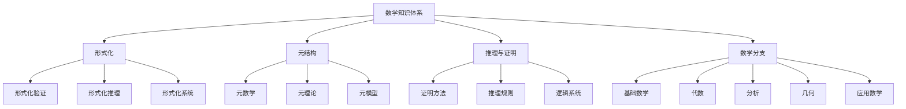
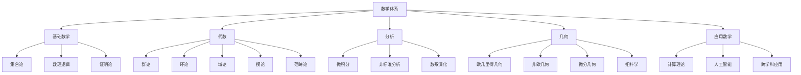
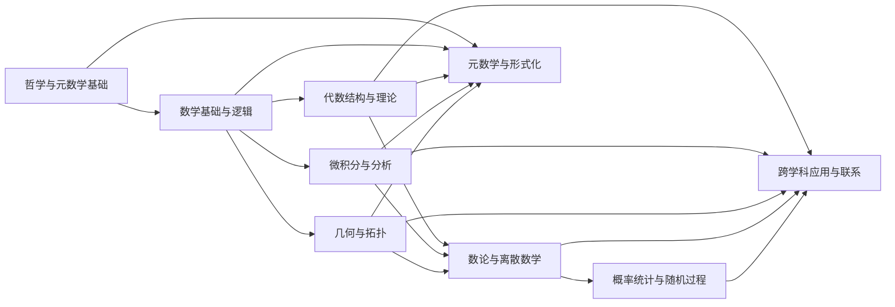
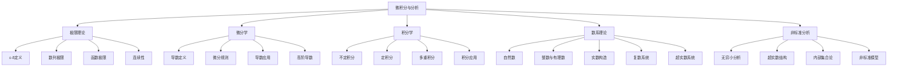
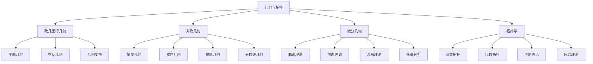
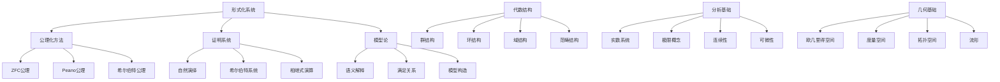
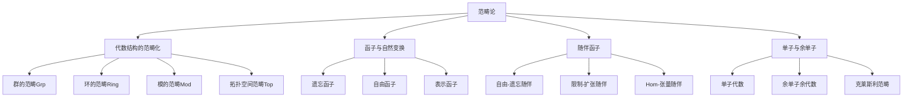
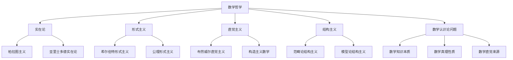

# 数学知识体系知识图谱分析

## 1. 知识体系核心结构

### 1.1 核心概念层次

### 1.2 主要数学分支

### 1.3 知识模块关系

## 2. 内容深度分析

### 2.1 核心概念文件分析

#### 2.1.1 数学核心概念分析.md (87KB, 888行)

**主题**: 形式化、推理与元结构
**核心内容**:

- 形式化验证：公理、定义、定理、证明
- 形式化推理：证明方法、推理规则、MIU系统示例
- 元结构：元数学、元理论与理论、元模型与模型
- 哥德尔不完备性定理的启示

**重点概念**:

- 形式化系统的构建
- 推理规则与证明方法
- 元数学与元理论的关系
- 哥德尔不完备性定理的影响

#### 2.1.2 数学逻辑.md (239KB, 2410行)

**主题**: 数理逻辑基础、计算理论、AI应用
**核心内容**:

- 模型论、递归论、证明论
- 计算理论：图灵机、λ演算、递归函数
- 量子计算与量子信息
- AI安全、伦理与对齐
- 算法公平性与偏见
- 新兴计算范式：人工生命、去中心化系统

**重点概念**:

- 数理逻辑体系构建
- 计算模型与可计算性
- 逻辑系统的限制与扩展
- 逻辑在AI中的应用

#### 2.1.3 数学概念联系.md (324KB, 3003行)

**主题**: 概念关联性分析
**核心内容**:

- 数学概念间的关联网络
- 跨领域概念映射
- 数学结构的统一视角
- 认知结构与数学概念的关系

**重点概念**:

- 概念间的层次结构
- 数学概念的映射关系
- 不同分支间的桥接概念
- 认知框架与数学理解

#### 2.1.4 数学概念分析和综合.md (292KB, 2409行)

**主题**: 概念分析与综合
**核心内容**:

- 数学概念的分解与重构
- 概念间的综合与统一
- 数学思想的历史演化
- 数学概念的哲学基础

**重点概念**:

- 概念分析方法论
- 概念综合与理论构建
- 数学思想的演化规律
- 数学哲学的主要流派

### 2.2 代数目录分析 (Algebra/)

#### 2.2.1 主题概述

1. **范畴论视角**:
   - 从范畴论角度审视代数结构
   - 将代数结构视为范畴中的对象
   - 通过态射探索结构间关系

2. **认知结构**:
   - 人脑认知与代数结构的关联
   - 代数思维的认知基础
   - 抽象思维与代数学习

3. **软件编程**:
   - 代数结构在编程中的应用
   - 函数式编程与范畴论关系
   - 代数数据类型与类型系统

#### 2.2.2 核心概念网络

```mermaid
graph TD
    A[代数结构理论] --> B[群论]
    A --> C[环论]
    A --> D[域论]
    A --> E[模论]
    A --> F[范畴论]
    
    B --> B1[群的定义与性质]
    B --> B2[子群与商群]
    B --> B3[群同态与同构]
    B --> B4[群作用]
    
    C --> C1[环的定义与性质]
    C --> C2[理想与商环]
    C --> C3[环同态与同构]
    
    D --> D1[域的定义与性质]
    D --> D2[域扩张]
    D --> D3[伽罗瓦理论]
    
    E --> E1[模的定义与性质]
    E --> E2[子模与商模]
    E --> E3[模同态与同构]
    E --> E4[张量积]
    
    F --> F1[范畴的定义与性质]
    F --> F2[函子与自然变换]
    F --> F3[极限与余极限]
    F --> F4[随伴函子]
    
    A --> G[认知结构]
    G --> G1[概念形成]
    G --> G2[抽象思维]
    G --> G3[模式识别]
    
    A --> H[软件实现]
    H --> H1[类型系统]
    H --> H2[函数式编程]
    H --> H3[代数数据类型]
```

### 2.3 微积分目录分析 (Calculus/)

#### 2.3.1 主要主题

1. **标准微积分**:
   - 极限理论
   - 导数与微分
   - 积分理论
   - 微分方程

2. **非标准分析**:
   - 无穷小量方法
   - 超实数系统
   - 非标准分析基础
   - 传统微积分的重新诠释

3. **数系演化**:
   - 从自然数到实数
   - 复数系统
   - 超实数与超复数
   - 数系扩张的哲学基础

4. **微积分基础**:
   - 微积分公理化
   - 微积分历史发展
   - 微积分悖论与解决

#### 2.3.2 核心概念网络

### 2.4 几何目录分析 (Geometry/)

#### 2.4.1 主要主题

1. **欧几里得几何**:
   - 平面几何
   - 空间几何
   - 欧几里得公理系统

2. **非欧几何**:
   - 黎曼几何
   - 双曲几何
   - 射影几何

3. **微分几何**:
   - 曲线与曲面理论
   - 流形理论
   - 联络与曲率

4. **拓扑学**:
   - 点集拓扑
   - 代数拓扑
   - 同伦理论

#### 2.4.2 核心概念网络

## 3. 知识关联分析

### 3.1 概念关联矩阵

| 主题     | 形式化 | 代数  | 分析  | 几何  | 逻辑  | 应用  | 哲学  |
|----------|--------|-------|-------|-------|-------|-------|-------|
| 形式化   | 1.0    | 0.8   | 0.7   | 0.6   | 0.9   | 0.7   | 0.8   |
| 代数     | 0.8    | 1.0   | 0.6   | 0.7   | 0.8   | 0.7   | 0.6   |
| 分析     | 0.7    | 0.6   | 1.0   | 0.8   | 0.7   | 0.8   | 0.6   |
| 几何     | 0.6    | 0.7   | 0.8   | 1.0   | 0.6   | 0.8   | 0.7   |
| 逻辑     | 0.9    | 0.8   | 0.7   | 0.6   | 1.0   | 0.7   | 0.9   |
| 应用     | 0.7    | 0.7   | 0.8   | 0.8   | 0.7   | 1.0   | 0.6   |
| 哲学     | 0.8    | 0.6   | 0.6   | 0.7   | 0.9   | 0.6   | 1.0   |

### 3.2 跨领域关联分析

1. **代数与几何**:
   - 代数几何
   - 李群与微分几何
   - 代数拓扑

2. **分析与代数**:
   - 泛函分析
   - 代数分析
   - 调和分析

3. **逻辑与计算**:
   - 计算理论
   - 类型论
   - 程序验证

4. **哲学与形式化**:
   - 数学基础
   - 数学认识论
   - 数学本体论

### 3.3 核心概念依赖关系

## 4. 重构策略

### 4.1 内容整合策略

#### 4.1.1 重复内容处理

- **识别方法**: 使用内容相似度分析识别重复内容
- **合并策略**:
  - 保留最完整版本
  - 整合补充内容
  - 统一概念表述
  - 保留多视角分析
- **版本控制**: 建立明确的版本历史，记录重要版本的内容差异

#### 4.1.2 内容标准化

- **格式统一**:
  - 统一标题层级结构
  - 统一数学公式格式(LaTeX)
  - 统一代码格式(Rust/Haskell)
  - 统一图表格式(Mermaid)
  
- **术语规范**:
  - 创建统一术语表
  - 确保同一概念使用一致术语
  - 在首次出现时提供术语定义
  - 标记跨学科术语的不同用法
  
- **引用系统**:
  - 建立内部交叉引用规范
  - 统一外部引用格式
  - 明确引用来源和重要性

### 4.2 结构优化策略

- **层次清晰**: 目录层次结构清晰可见
- **逻辑连贯**: 内容按逻辑顺序组织
- **导航便利**: 提供清晰的导航路径
- **关联明确**: 显示概念间的关联关系

### 4.3 内容呈现策略

- **形式与直观并重**: 结合形式化定义和直观解释
- **多种表征方式**: 使用数学符号、图表、代码等多种表达方式
- **渐进式深入**: 从基本概念到高级应用的自然过渡
- **交互式探索**: 鼓励读者思考和探索

## 5. 实施规划

### 5.1 第一阶段：结构规范化

- 完善目录结构
- 统一文件命名
- 创建索引文件
- 建立内容模板

### 5.2 第二阶段：内容分析

- 分析核心概念文件
- 分析各主题目录内容
- 识别重复和相关内容
- 创建概念关联图

### 5.3 第三阶段：内容整合

- 合并重复内容
- 应用统一格式
- 补充缺失内容
- 建立交叉引用

### 5.4 第四阶段：质量保证

- 内容准确性检查
- 格式一致性检查
- 引用完整性检查
- 概念一致性检查

## 6. 专题分析示例

### 6.1 范畴论视角下的代数结构

### 6.2 数学基础的哲学视角

---

**创建日期**: 2024年12月20日  
**版本**: 1.0  
**状态**: 初步分析
