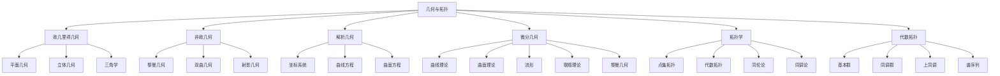
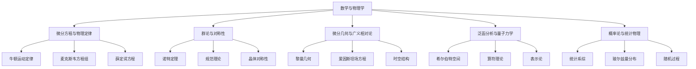
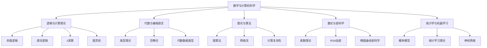
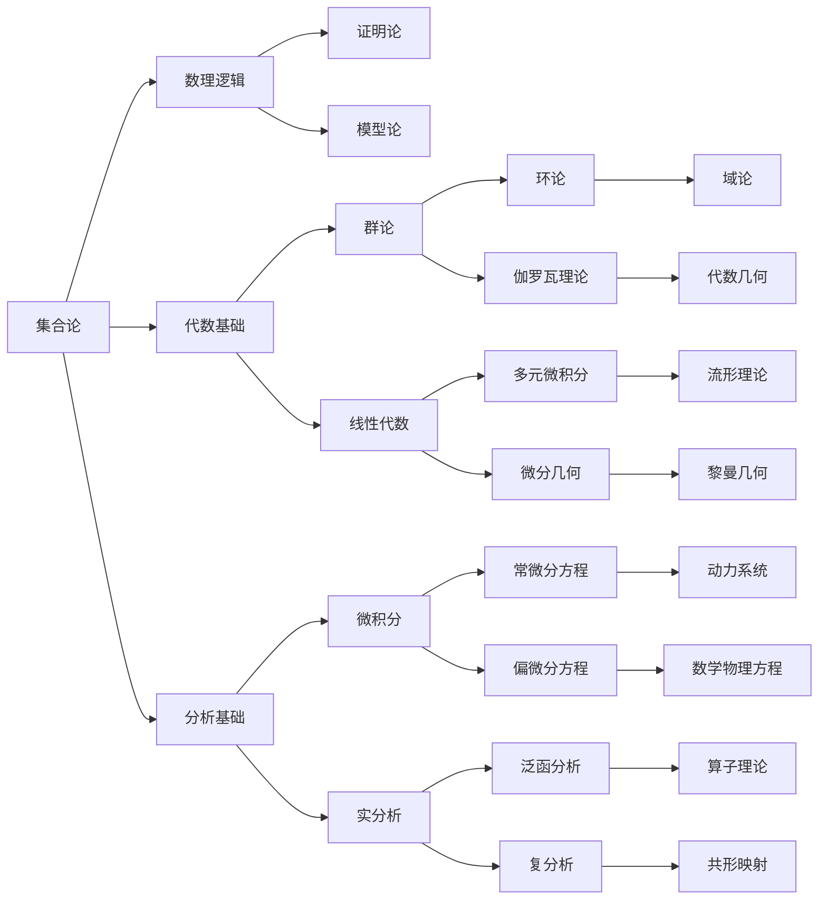

# 数学知识体系知识图谱

## 1. 知识体系总览

```mermaid
graph TD
    A[数学知识体系] --> B[哲学与元数学基础]
    A --> C[数学基础与逻辑]
    A --> D[代数结构与理论]
    A --> E[微积分与分析]
    A --> F[几何与拓扑]
    A --> G[数论与离散数学]
    A --> H[概率统计与随机过程]
    A --> I[跨学科应用与联系]
    A --> J[元数学与形式化]
    
    B --> B1[数学哲学]
    B --> B2[数学认识论]
    B --> B3[数学本体论]
    
    C --> C1[集合论]
    C --> C2[数理逻辑]
    C --> C3[模型论]
    C --> C4[递归论]
    C --> C5[证明论]
    
    D --> D1[群论]
    D --> D2[环论]
    D --> D3[域论]
    D --> D4[模论]
    D --> D5[格论]
    D --> D6[范畴论]
    D --> D7[线性代数]
    
    E --> E1[数系演化]
    E --> E2[极限与连续性]
    E --> E3[微分学]
    E --> E4[积分学]
    E --> E5[级数理论]
    E --> E6[多元微积分]
    E --> E7[非标准分析]
    
    F --> F1[欧几里得几何]
    F --> F2[非欧几何]
    F --> F3[解析几何]
    F --> F4[微分几何]
    F --> F5[拓扑学]
    F --> F6[代数拓扑]
    
    G --> G1[初等数论]
    G --> G2[代数数论]
    G --> G3[图论]
    G --> G4[组合数学]
    G --> G5[编码理论]
    G --> G6[密码学]
    
    H --> H1[概率论]
    H --> H2[统计学]
    H --> H3[随机过程]
    H --> H4[信息论]
    
    I --> I1[数学物理]
    I --> I2[计算数学]
    I --> I3[金融数学]
    I --> I4[数学生物学]
    
    J --> J1[形式化数学]
    J --> J2[证明辅助系统]
    J --> J3[计算复杂性理论]
```

## 2. 概念关联网络

### 2.1 核心概念关联矩阵

| 概念 | 形式化 | 代数 | 分析 | 几何 | 逻辑 | 数论 | 概率 | 应用 |
|------|--------|------|------|------|------|------|------|------|
| 形式化 | 1.0 | 0.8 | 0.7 | 0.6 | 0.9 | 0.7 | 0.5 | 0.6 |
| 代数 | 0.8 | 1.0 | 0.6 | 0.7 | 0.8 | 0.9 | 0.4 | 0.7 |
| 分析 | 0.7 | 0.6 | 1.0 | 0.8 | 0.7 | 0.6 | 0.7 | 0.8 |
| 几何 | 0.6 | 0.7 | 0.8 | 1.0 | 0.6 | 0.5 | 0.4 | 0.7 |
| 逻辑 | 0.9 | 0.8 | 0.7 | 0.6 | 1.0 | 0.7 | 0.6 | 0.7 |
| 数论 | 0.7 | 0.9 | 0.6 | 0.5 | 0.7 | 1.0 | 0.5 | 0.8 |
| 概率 | 0.5 | 0.4 | 0.7 | 0.4 | 0.6 | 0.5 | 1.0 | 0.9 |
| 应用 | 0.6 | 0.7 | 0.8 | 0.7 | 0.7 | 0.8 | 0.9 | 1.0 |

### 2.2 代数结构层次关系

```mermaid
graph TD
    A[代数结构] --> B[群论]
    A --> C[环论]
    A --> D[域论]
    A --> E[模论]
    A --> F[格论]
    A --> G[范畴论]
    
    B --> B1[群的定义与性质]
    B --> B2[子群与陪集]
    B --> B3[群同态与同构]
    B --> B4[群作用]
    B --> B5[群表示论]
    
    C --> C1[环的定义与性质]
    C --> C2[理想与商环]
    C --> C3[多项式环]
    C --> C4[主理想整环]
    
    D --> D1[域的定义与性质]
    D --> D2[域的扩张理论]
    D --> D3[有限域理论]
    D --> D4[伽罗瓦理论]
    
    E --> E1[模的定义与性质]
    E --> E2[子模与商模]
    E --> E3[模同态与同构]
    E --> E4[张量积]
    
    F --> F1[格的基本概念]
    F --> F2[分配格与模格]
    F --> F3[完备格]
    F --> F4[布尔代数]
    F --> F5[Heyting代数]
    
    G --> G1[范畴的基本概念]
    G --> G2[函子与自然变换]
    G --> G3[极限与余极限]
    G --> G4[伴随函子]
    G --> G5[单子与余单子]
```

### 2.3 分析学概念关联

```mermaid
graph TD
    A[分析学] --> B[数系演化]
    A --> C[极限理论]
    A --> D[连续性]
    A --> E[微分学]
    A --> F[积分学]
    A --> G[级数理论]
    
    B --> B1[自然数]
    B --> B2[整数]
    B --> B3[有理数]
    B --> B4[实数]
    B --> B5[复数]
    B --> B6[超实数]
    
    C --> C1[数列极限]
    C --> C2[函数极限]
    C --> C3[收敛性]
    C --> C4[Cauchy序列]
    
    D --> D1[函数连续性]
    D --> D2[一致连续性]
    D --> D3[连续函数性质]
    
    E --> E1[导数定义]
    E --> E2[微分规则]
    E --> E3[高阶导数]
    E --> E4[偏导数]
    E --> E5[方向导数]
    
    F --> F1[定积分]
    F --> F2[不定积分]
    F --> F3[多重积分]
    F --> F4[线积分]
    F --> F5[面积分]
    
    G --> G1[数项级数]
    G --> G2[函数项级数]
    G --> G3[幂级数]
    G --> G4[傅里叶级数]
```

### 2.4 几何与拓扑概念关联

## 3. 跨学科关联

### 3.1 数学与物理学关联

### 3.2 数学与计算机科学关联

## 4. 概念依赖关系

### 4.1 学习路径图

### 4.2 概念前置依赖

| 概念 | 前置依赖 |
|------|----------|
| 群论 | 集合论, 二元运算 |
| 环论 | 群论, 代数运算 |
| 域论 | 环论 |
| 微积分 | 实数理论, 极限理论 |
| 实分析 | 微积分, 度量空间 |
| 拓扑学 | 集合论, 度量空间 |
| 微分几何 | 多元微积分, 线性代数 |
| 代数拓扑 | 拓扑学, 代数结构 |
| 泛函分析 | 线性代数, 实分析, 拓扑学 |
| 数理逻辑 | 集合论, 形式语言 |
| 模型论 | 数理逻辑, 代数结构 |
| 范畴论 | 集合论, 函数, 代数结构 |

## 5. 知识整合策略

### 5.1 内容合并原则

1. **完整性优先**：保留内容最完整的版本
2. **一致性优先**：确保概念定义和术语使用一致
3. **结构优先**：优先考虑结构清晰的内容
4. **形式化优先**：优先保留形式化程度高的内容

### 5.2 知识组织原则

1. **层次化组织**：按照概念的层次关系组织内容
2. **模块化设计**：每个主题形成独立模块，便于学习和理解
3. **关联性链接**：建立概念间的关联链接，形成网络结构
4. **渐进式复杂度**：从基础到高级，逐步增加复杂度

---

**最后更新**：2025-07-10
**下一步计划**：完善各主题领域的详细知识图谱
