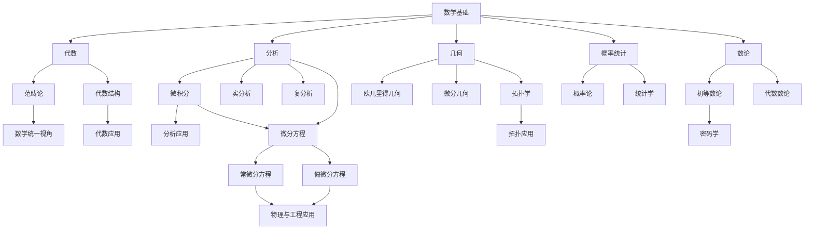
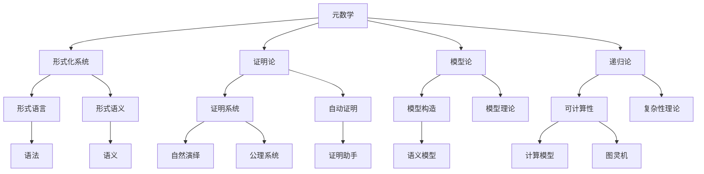
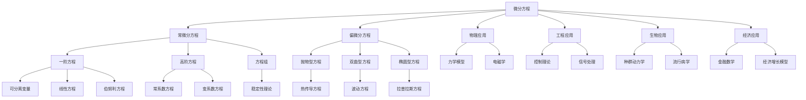
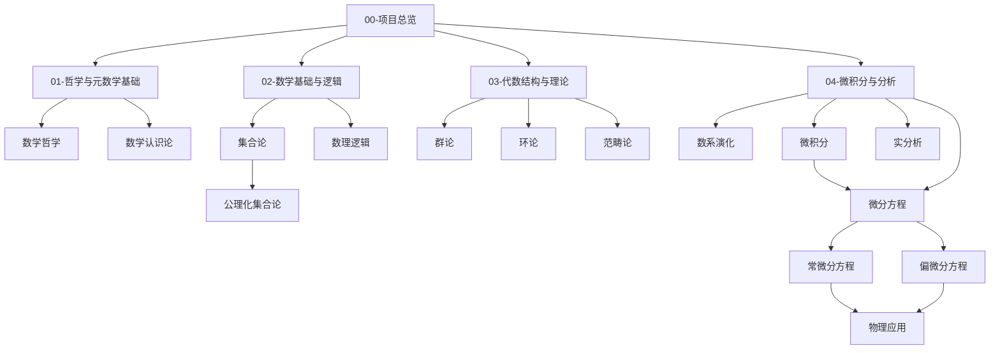

# 数学知识体系知识图谱

## 1. 知识领域总览

数学知识体系可分为以下核心领域，每个领域内有特定的概念结构和相互关系：

```text
数学知识体系
├── 数学哲学与元数学
│   ├── 数学哲学（数学本质、数学认识论）
│   ├── 数学方法论（证明方法、公理化方法）
│   └── 元数学理论（可计算性、形式化系统）
├── 数学基础理论
│   ├── 集合论（朴素集合论、公理化集合论）
│   ├── 数理逻辑（命题逻辑、一阶逻辑）
│   └── 证明论（形式证明、证明系统）
├── 代数结构理论
│   ├── 群论、环论、域论
│   ├── 线性代数
│   └── 范畴论
├── 分析学
│   ├── 微积分
│   ├── 微分方程（常微分方程、偏微分方程）
│   ├── 实分析、复分析
│   └── 泛函分析
├── 几何与拓扑
│   ├── 欧几里得几何、非欧几何
│   ├── 微分几何
│   └── 代数拓扑
├── 数论与离散数学
│   ├── 初等数论、代数数论
│   ├── 组合数学
│   └── 图论
├── 概率统计
│   ├── 概率论
│   ├── 数理统计
│   └── 随机过程
└── 应用数学
    ├── 数学物理
    ├── 计算数学
    └── 金融数学
```

## 2. 核心概念关系图

### 2.1 主要数学分支间的关系



### 2.2 元数学与形式化关系



### 2.3 微分方程与应用领域关系



## 3. 关键概念映射

### 3.1 代数结构层次关系

| 结构类型 | 基本运算 | 主要性质 | 典型例子 |
|---------|---------|---------|---------|
| 集合 | - | 元素关系 | ℕ, ℝ, ℂ |
| 幺半群 | 单一运算+单位元 | 结合律 | (ℕ, +, 0) |
| 群 | 单一运算+单位元+逆元 | 封闭性、结合律 | (ℤ, +, 0) |
| 环 | 加法+乘法 | 分配律 | (ℤ, +, ×) |
| 域 | 加法+乘法+除法 | 乘法可逆 | (ℚ, +, ×) |
| 向量空间 | 标量乘法+向量加法 | 线性性质 | ℝⁿ |
| 模 | 标量作用+加法 | 运算兼容性 | R上的模 |

### 3.2 分析学核心概念关联

| 概念 | 关联概念 | 核心思想 | 应用领域 |
|------|---------|---------|---------|
| 极限 | 收敛性、连续性 | 无限逼近 | 微积分、级数 |
| 导数 | 变化率、切线 | 瞬时变化 | 物理、优化 |
| 积分 | 面积、累加 | 连续累积 | 物理、概率 |
| 级数 | 收敛性、发散性 | 无限和 | 近似计算、分析 |
| 微分方程 | 导数关系、初值问题 | 变化规律 | 物理、工程 |
| 常微分方程 | 单变量导数关系 | 单参数变化规律 | 力学、电路、人口 |
| 偏微分方程 | 多变量偏导数关系 | 场的变化规律 | 流体、热传导、波动 |
| 测度 | 集合大小、可测性 | 广义长度 | 概率论、分析 |
| 泛函 | 函数空间、映射 | 函数到数的映射 | 变分法、泛函分析 |

### 3.3 微分方程分类与解法

| 方程类型 | 标准形式 | 求解方法 | 典型应用 |
|---------|---------|---------|---------|
| 可分离变量 | $\frac{dy}{dx} = f(x)g(y)$ | 分离变量积分 | 放射性衰变、简谐振动 |
| 一阶线性 | $\frac{dy}{dx} + P(x)y = Q(x)$ | 积分因子法 | 电路分析、混合问题 |
| 伯努利方程 | $\frac{dy}{dx} + P(x)y = Q(x)y^n$ | 变量替换转化为线性 | 物理过程建模 |
| 二阶常系数齐次 | $ay'' + by' + cy = 0$ | 特征方程法 | 弹簧振动、RLC电路 |
| 二阶常系数非齐次 | $ay'' + by' + cy = f(x)$ | 特解叠加法、常数变易法 | 受迫振动、共振现象 |
| 热方程 | $\frac{\partial u}{\partial t} = k\nabla^2 u$ | 分离变量、傅里叶方法 | 热传导、扩散过程 |
| 波动方程 | $\frac{\partial^2 u}{\partial t^2} = c^2\nabla^2 u$ | 达朗贝尔解、分离变量 | 波传播、振动分析 |
| 拉普拉斯方程 | $\nabla^2 u = 0$ | 分离变量、格林函数 | 静电场、流体静力学 |

## 4. 领域间的交叉关系

### 4.1 主要交叉领域

1. **代数与几何**：代数几何、群作用
2. **代数与数论**：代数数论、椭圆曲线
3. **分析与几何**：微分几何、调和分析
4. **代数与逻辑**：模型论、代数逻辑
5. **几何与拓扑**：微分拓扑、代数拓扑
6. **概率与分析**：随机分析、测度论
7. **微分方程与物理**：数学物理方程、场论
8. **微分方程与计算**：数值分析、计算流体力学

### 4.2 重要桥接概念

| 桥接概念 | 连接领域 | 核心作用 |
|---------|---------|---------|
| 黎曼曲面 | 复分析↔几何 | 复函数的几何表示 |
| 李群/李代数 | 代数↔微分几何 | 连续变换的代数结构 |
| 调和分析 | 分析↔代数 | 函数的频率分解 |
| 同调理论 | 代数↔拓扑 | 空间的代数不变量 |
| 代数簇 | 代数↔几何 | 多项式方程的几何解 |
| 微分形式 | 分析↔几何 | 积分的抽象表示 |
| 图论 | 离散数学↔应用 | 网络关系的数学模型 |
| 偏微分方程 | 分析↔物理 | 连续介质的数学描述 |
| 随机微分方程 | 微分方程↔概率论 | 随机过程的演化规律 |

## 5. 哲学批判视角下的数学

### 5.1 数学本质的多维度理解

| 维度 | 代表观点 | 批判视角 |
|------|---------|---------|
| 本体论 | 柏拉图主义、形式主义 | 数学对象的存在性质 |
| 认识论 | 直觉主义、逻辑主义 | 数学知识的获取方式 |
| 方法论 | 公理化方法、构造主义 | 数学研究的有效方法 |
| 美学 | 简洁性、意外联系 | 数学理论的审美价值 |
| 社会性 | 社会构建论、实用主义 | 数学的社会文化维度 |

### 5.2 数学危机与范式转换

1. **基础危机**：集合论悖论、哥德尔不完备性定理、连续统假设
2. **理论转换**：欧几里得→非欧几何、经典→量子理论
3. **方法转变**：几何→代数、离散→连续、局部→全局
4. **求解范式**：解析解→数值解→定性分析

## 6. 重构映射关系

### 6.1 原始内容与重构目标的映射

| 原始内容主题 | 主要来源文件 | 重构目标目录 |
|------------|------------|------------|
| 数学哲学与认知 | 数学核心概念分析.md | 01-哲学与元数学基础/ |
| 数理逻辑与形式化 | 数学逻辑.md | 02-数学基础与逻辑/ |
| 代数结构理论 | Algebra/ 目录文件 | 03-代数结构与理论/ |
| 微积分与数系 | Calculus/ 目录文件 | 04-微积分与分析/ |
| 微分方程 | Calculus/DifferentialEquations/ | 04-微积分与分析/03-微分学/ |
| 几何与拓扑 | Geometry/ 目录文件 | 05-几何与拓扑/ |
| 数论与离散数学 | 数学概念分析.md (相关章节) | 06-数论与离散数学/ |
| 概率统计 | 数学概念联系.md (相关章节) | 07-概率统计与随机过程/ |
| 跨学科应用 | 多个来源 | 08-跨学科应用与联系/ |
| 元数学理论 | MetaMath/ 目录与数学核心概念分析.md | 09-元数学与形式化/ |

### 6.2 重构后的概念网络



## 7. 重构实施路径

### 7.1 重构优先级顺序

1. **第一阶段**：基础框架建立
   - 00-项目总览
   - 03-代数结构与理论 (已完成)
   - 01-哲学与元数学基础 (部分完成)
   - 02-数学基础与逻辑 (部分完成)

2. **第二阶段**：核心内容重构
   - 04-微积分与分析
   - 09-元数学与形式化
   - 05-几何与拓扑

3. **第三阶段**：扩展内容开发
   - 06-数论与离散数学
   - 07-概率统计与随机过程
   - 08-跨学科应用与联系

### 7.2 主要重构任务

1. **内容整合任务**
   - 合并相似主题文档
   - 解决重复内容问题
   - 填补知识空白

2. **结构优化任务**
   - 建立统一的目录结构
   - 确保序号系统一致性
   - 优化内部链接系统

3. **质量提升任务**
   - 规范化数学公式
   - 完善证明过程
   - 添加多样化表征

## 8. 结论

本知识图谱为数学知识体系的重构提供了全面的概念地图，指明了各领域间的内在联系和整合路径。通过系统性地映射原始内容与目标结构的关系，为后续重构工作提供了清晰的指导框架。重构工作将按照优先级顺序进行，确保核心概念的准确性、完整性和一致性。

---

**创建日期**: 2025-07-03  
**最后更新**: 2025-07-03  
**更新人**: AI助手
