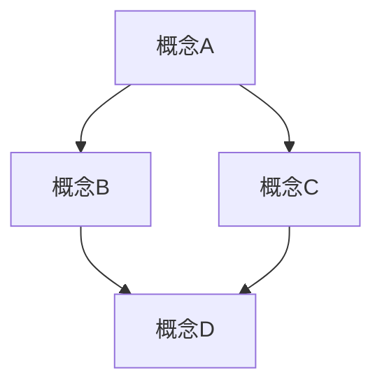

# 数学知识体系文档模板

本文档提供了三种标准模板：总览文档模板、概念文档模板和证明文档模板。这些模板旨在确保所有文档格式一致、结构清晰，并符合学术规范。

## 1. 总览文档模板

总览文档用于介绍一个主题领域的整体结构、核心概念和内部关联。

```markdown
# XX-[主题名称]总览

## 1. 主题概述

### 1.1 定义与范围

[简要定义该主题领域，说明其研究对象、基本问题和边界]

### 1.2 历史发展

[简述该领域的历史发展脉络，包括关键人物、重要成果和思想演变]

### 1.3 与其他领域的关系

[说明该主题与数学其他分支以及其他学科的关联]

## 2. 核心概念体系

### 2.1 基础概念

[列出并简要解释该领域的基础概念]

### 2.2 核心理论

[概述该领域的核心理论框架]

### 2.3 重要定理

[列出该领域最重要的定理及其意义]

## 3. 内部结构

### 3.1 子领域划分

[说明该主题的主要子领域及其关系]

### 3.2 层次结构

[解释该领域的概念层次结构和依赖关系]

### 3.3 研究方法

[介绍该领域常用的研究方法和思路]

## 4. 应用与扩展

### 4.1 理论应用

[说明该理论在数学内部的应用]

### 4.2 实际应用

[介绍该理论在实际问题中的应用]

### 4.3 前沿发展

[简述该领域的前沿研究方向和未解问题]

## 5. 学习路径

### 5.1 预备知识

[列出学习该主题所需的预备知识]

### 5.2 推荐资源

[推荐相关的学习资源，如书籍、论文等]

### 5.3 学习顺序

[建议的学习顺序和重点]

## 6. 本目录内容

### 6.1 文件结构

[列出本目录下的文件结构及其内容概述]

### 6.2 阅读指南

[提供阅读本目录内容的建议和指南]

---

**创建日期**: YYYY-MM-DD
**最后更新**: YYYY-MM-DD
**版本**: X.X
```

## 2. 概念文档模板

概念文档用于详细阐述一个数学概念，包括其定义、性质、应用等。

```markdown
# XX-[概念名称]

## 1. 概念定义

### 1.1 形式化定义

[给出该概念的严格数学定义]

```math
[LaTeX公式]
```

### 1.2 直观解释

[提供该概念的直观理解和解释]

### 1.3 定义的等价形式

[如果存在，列出该概念定义的等价形式]

## 2. 基本性质

### 2.1 核心性质

[列出并证明该概念的核心性质]

### 2.2 重要定理

[列出与该概念相关的重要定理]

### 2.3 典型例子

[提供该概念的典型例子和反例]

## 3. 概念关联

### 3.1 与其他概念的关系

[说明该概念与相关概念的联系和区别]

### 3.2 推广与特例

[介绍该概念的推广形式和特殊情况]

### 3.3 历史演变

[简述该概念在历史上的演变过程]

## 4. 应用场景

### 4.1 理论应用

[介绍该概念在数学理论中的应用]

### 4.2 实际应用

[介绍该概念在实际问题中的应用]

## 5. 计算方法

### 5.1 算法描述

[如适用，提供与该概念相关的算法]

### 5.2 代码实现

```rust
// Rust代码实现
```

或

```haskell
-- Haskell代码实现
```

## 6. 深入探讨

### 6.1 哲学思考

[探讨该概念的哲学意义]

### 6.2 认知视角

[从认知科学角度分析该概念]

### 6.3 批判性分析

[对该概念进行批判性分析]

---

**创建日期**: YYYY-MM-DD
**最后更新**: YYYY-MM-DD
**版本**: X.X

```text

## 3. 证明文档模板

证明文档用于详细阐述一个数学定理及其证明过程。

```markdown
# XX-[定理名称]证明

## 1. 定理陈述

### 1.1 形式化表述

[给出定理的严格数学表述]

```math
[LaTeX公式]
```

### 1.2 直观解释

[提供定理的直观理解和解释]

### 1.3 历史背景

[简述定理的历史背景和重要性]

## 2. 预备知识

### 2.1 相关定义

[列出证明中用到的关键定义]

### 2.2 引理

[列出并证明证明中需要用到的引理]

### 2.3 相关定理

[列出证明中会引用的其他定理]

## 3. 证明过程

### 3.1 证明思路

[概述证明的主要思路和策略]

### 3.2 详细证明

[给出定理的详细证明过程]

```math
[LaTeX公式]
```

### 3.3 关键步骤分析

[分析证明中的关键步骤和技巧]

## 4. 证明变体

### 4.1 替代证明

[如果存在，提供替代证明方法]

### 4.2 特殊情况

[讨论特殊情况下的简化证明]

## 5. 形式化验证

### 5.1 Lean实现

```lean
-- Lean证明代码
```

### 5.2 关键验证点

[解释形式化证明中的关键验证点]

## 6. 应用与推广

### 6.1 定理应用

[介绍定理的主要应用]

### 6.2 推广方向

[讨论定理可能的推广方向]

### 6.3 相关开放问题

[列出与定理相关的开放问题]

---

**创建日期**: YYYY-MM-DD
**最后更新**: YYYY-MM-DD
**版本**: X.X

```text

## 4. 使用指南

### 4.1 模板选择

- 对于主题目录的总体介绍，使用**总览文档模板**
- 对于具体数学概念的阐述，使用**概念文档模板**
- 对于数学定理及其证明，使用**证明文档模板**

### 4.2 内容调整

- 根据具体内容需要，可以适当调整模板的章节结构
- 不是所有章节都必须包含，可以根据实际情况选择性使用
- 保持章节编号的一致性和连续性

### 4.3 格式规范

#### 4.3.1 数学公式

使用LaTeX语法编写数学公式，例如：

```math
\int_{a}^{b} f(x) \, dx = F(b) - F(a)
```

#### 4.3.2 图表

使用Mermaid语法创建图表，例如：



#### 4.3.3 代码

优先使用Rust或Haskell编写代码示例：

```rust
fn factorial(n: u64) -> u64 {
    match n {
        0 | 1 => 1,
        n => n * factorial(n - 1)
    }
}
```

#### 4.3.4 引用

使用标准Markdown引用语法：

> 引用内容

#### 4.3.5 链接

使用相对路径进行内部链接：

[链接到相关概念](../XX-相关目录/XX-相关文件.md)

---

**创建日期**: 2025-07-04
**最后更新**: 2025-07-04
**版本**: 1.0
**作者**: AI助手
