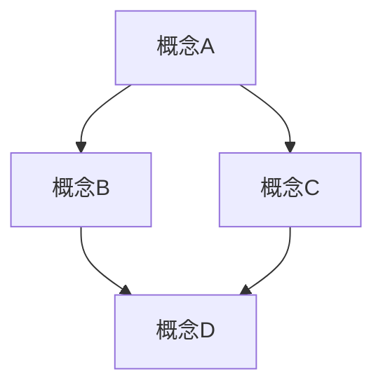

# 04-标准文档模板

本文档提供了数学知识体系重构项目中所有数学内容文件的标准模板，以确保内容的一致性、完整性和可读性。

## 1. 文档结构

### 1.1 基本结构

每个数学内容文档应包含以下部分：

```markdown
# XX-文档标题

## 1. 概述

简要介绍文档内容、主要概念及其在数学体系中的位置。

## 2. 定义与基本概念

### 2.1 核心定义

关键概念的精确定义，包含必要的数学符号。

### 2.2 基本性质

概念的基本性质和直接推论。

## 3. 主要结果

### 3.1 定理与证明

重要定理的陈述和证明。

### 3.2 应用与例子

概念的典型应用和说明性例子。

## 4. 历史与发展

概念的历史背景、发展过程和重要贡献者。

## 5. 相关概念与联系

与其他数学概念的关系和联系。

## 6. 进阶主题

更高级的相关主题或扩展（可选）。

## 7. 参考文献

引用的资料和进一步阅读建议。

---

**创建日期**: YYYY-MM-DD  
**最后更新**: YYYY-MM-DD  
**更新人**: 作者名
```

### 1.2 特殊文档结构

#### 1.2.1 总览文档

每个目录的总览文档（00-XX总览.md）应包含以下内容：

```markdown
# 00-XX总览

## 1. 领域概述

对该数学领域的整体介绍。

## 2. 历史发展

该领域的历史脉络和重要里程碑。

## 3. 主要分支

该领域的主要分支和子领域。

## 4. 核心概念框架

核心概念及其关系框架。

## 5. 目录结构

详细说明该目录下的文件组织结构。

## 6. 学习路径

建议的学习顺序和资源。

## 7. 参考资源

重要参考文献和学习资源。

---

**创建日期**: YYYY-MM-DD  
**最后更新**: YYYY-MM-DD  
**更新人**: 作者名
```

#### 1.2.2 证明专题文档

针对复杂证明的专题文档应包含：

```markdown
# XX-定理证明

## 1. 定理陈述

精确陈述定理内容。

## 2. 证明思路

概述证明的主要思路和关键步骤。

## 3. 预备知识

证明所需的前置知识和引理。

## 4. 详细证明

分步骤的详细证明过程。

## 5. 证明变体

不同证明方法的比较（若有）。

## 6. 历史与讨论

证明的历史和相关讨论。

## 7. 参考文献

相关参考文献。

---

**创建日期**: YYYY-MM-DD  
**最后更新**: YYYY-MM-DD  
**更新人**: 作者名
```

## 2. 格式规范

### 2.1 标题与层级

- 文档标题使用一级标题 (`#`)
- 主要部分使用二级标题 (`##`)
- 子部分使用三级标题 (`###`)
- 更细分的部分使用四级标题 (`####`)
- 最多使用到五级标题，避免过深的层级

### 2.2 数学公式

- 行内公式使用单个美元符号：`$E = mc^2$`
- 行间公式使用双美元符号：

  ```text
  $$
  \int_a^b f(x) \, dx = F(b) - F(a)
  $$
  ```

- 带编号的公式使用 equation 环境：

  ```text
  $$
  \begin{equation}
  E = mc^2
  \label{eq:einstein}
  \end{equation}
  $$
  ```

- 复杂的多行公式使用 align 环境：

  ```text
  $$
  \begin{align}
  x &= a + b \\
  &= c + d \\
  &= e
  \end{align}
  $$
  ```

### 2.3 定理、引理与证明

使用标准的定理-证明格式：

```markdown
**定理 2.1** (名称). *定理内容的陈述。*

**证明**. 证明内容...□
```

定理编号遵循 "章节号.定理序号" 的形式，如 "定理 2.1" 表示第2章第1个定理。

### 2.4 图表

使用 Mermaid 绘制图表：



```text

### 2.5 代码示例

代码示例使用正确的语言标记：

```rust
fn factorial(n: u64) -> u64 {
    match n {
        0 | 1 => 1,
        n => n * factorial(n - 1)
    }
}
```

```haskell
factorial :: Integer -> Integer
factorial 0 = 1
factorial n = n * factorial (n - 1)
```

```text

### 2.6 表格

使用标准Markdown表格格式：

```markdown
| 概念 | 定义 | 示例 |
|------|------|------|
| 群 | 满足结合律和存在单位元与逆元的代数结构 | $(Z, +)$ |
| 环 | 加法构成交换群且乘法满足结合律和分配律的代数结构 | $(Z, +, \times)$ |
```

### 2.7 引用与交叉引用

- 内部引用使用相对路径：`[集合论基础](../02-数学基础与逻辑/01-集合论/01-集合论基础.md)`
- 定理等内容的交叉引用使用标签：`如[定理2.1](#定理-21)`
- 外部参考文献引用：`[1]`，对应于参考文献部分

## 3. 内容规范

### 3.1 定义的精确性

- 所有数学定义必须准确、清晰，避免模糊表述
- 定义应明确说明所有必要条件
- 使用标准的数学符号和术语

### 3.2 证明的完整性

- 证明应包含所有关键步骤，避免跳跃性过大
- 清晰标明使用的定理、引理或前提条件
- 重要的或非显然的推导步骤应给出详细说明
- 证明结束使用方块符号"□"或"∎"表示证毕

### 3.3 例子的选择

- 选择能够说明概念本质的例子
- 包括标准例子和反例
- 从简单到复杂逐步展示
- 尽可能提供直观的几何或实际应用例子

### 3.4 历史准确性

- 确保历史信息的准确性和相关性
- 提及关键的历史人物和贡献
- 避免无关或过度详细的历史叙述

## 4. 多样表征

### 4.1 文本描述

提供清晰的文字解释，使用准确的术语和自然的语言表达。

### 4.2 符号表示

使用标准的数学符号，并在首次出现时解释其含义。

### 4.3 图形表示

适当使用图表、图形或示意图辅助理解，特别是几何概念。

### 4.4 代码实现

为适合计算实现的概念提供Rust或Haskell代码示例。

### 4.5 形式化表示

对于重要定理或性质，可以提供使用Lean等证明助手的形式化表示。

## 5. 文件命名规范

- 使用格式：`XX-名称.md`，其中XX为两位数序号
- 总览文件使用：`00-XX总览.md`
- 文件名使用有意义的描述性名称，避免缩写
- 不使用特殊字符（除了连字符"-"）

## 6. 目录组织规范

- 每个主题目录应包含一个`00-XX总览.md`文件
- 子目录也使用序号前缀：`XX-子目录名/`
- 目录深度控制在3层以内，避免过深的嵌套

## 7. 实例模板

以下是一个具体的内容示例：

```markdown
# 01-群的定义与性质

## 1. 概述

群论是研究满足特定代数性质的集合的数学分支，它在数学和物理学中有广泛应用。本文档介绍群的基本定义、性质及其在数学中的重要性。

## 2. 定义与基本概念

### 2.1 群的定义

**定义 2.1** (群). *一个群是一个二元组 $(G, \cdot)$，其中 $G$ 是一个非空集合，$\cdot$ 是 $G$ 上的二元运算，满足以下条件：*

1. **结合律**：对于任意 $a, b, c \in G$，有 $(a \cdot b) \cdot c = a \cdot (b \cdot c)$
2. **单位元**：存在元素 $e \in G$，使得对于任意 $a \in G$，有 $e \cdot a = a \cdot e = a$
3. **逆元**：对于每个 $a \in G$，存在 $b \in G$ 使得 $a \cdot b = b \cdot a = e$，称 $b$ 为 $a$ 的逆元，记作 $a^{-1}$

如果群 $(G, \cdot)$ 还满足：

4. **交换律**：对于任意 $a, b \in G$，有 $a \cdot b = b \cdot a$

则称该群为**交换群**或**阿贝尔群**。

### 2.2 基本性质

**性质 2.1**. *群的单位元是唯一的。*

**证明**. 假设 $e$ 和 $e'$ 都是群 $(G, \cdot)$ 的单位元。那么：
$e = e \cdot e'$（因为 $e'$ 是单位元）
$e = e'$（因为 $e$ 是单位元）
因此，单位元是唯一的。 □

**性质 2.2**. *群中每个元素的逆元是唯一的。*

## 3. 主要结果

### 3.1 定理与证明

**定理 3.1** (拉格朗日定理). *有限群 $G$ 的任意子群 $H$ 的阶都整除 $G$ 的阶。*

**证明**. [详细证明步骤...]

### 3.2 应用与例子

**例 3.1**. 整数加法群 $(Z, +)$ 是一个无限交换群，其中：
- 运算是普通的整数加法
- 单位元是 $0$
- 每个整数 $n$ 的逆元是 $-n$

## 4. 历史与发展

群论起源于19世纪初对代数方程解的研究，由伽罗瓦(Évariste Galois, 1811-1832)首先系统发展...

## 5. 相关概念与联系

群与其他代数结构的关系：
- 环可以看作是在群的基础上增加了另一个满足分配律的运算
- 任何向量空间的非零向量在乘法运算下都构成群

## 6. 进阶主题

- 群作用理论
- 群表示论

## 7. 参考文献

1. Dummit, D. S., & Foote, R. M. (2004). Abstract algebra (3rd ed.). John Wiley & Sons.
2. Lang, S. (2002). Algebra (3rd ed.). Springer.

---

**创建日期**: 2025-06-26  
**最后更新**: 2025-06-26  
**更新人**: AI助手
```

## 8. 注意事项

1. **保持一致性**：所有文档应遵循本模板的结构和格式
2. **适当调整**：根据具体内容的需要，可以适当调整部分结构
3. **持续更新**：随着项目的进展，模板可能会有所调整
4. **引用标准**：确保所有引用符合学术标准
5. **版权注意**：注明内容来源，尊重知识产权

---

**创建日期**: 2025-07-03  
**最后更新**: 2025-07-03  
**更新人**: AI助手
