# 元数学与形式化 - 综合知识图谱

## 1. 元数学与形式化的核心概念框架

```mermaid
graph TD
    A[元数学与形式化] --> B[形式化系统]
    A --> C[公理化方法]
    A --> D[证明论]
    A --> E[模型论]
    A --> F[递归论]
    A --> G[集合论基础]
    A --> H[哲学与元数学基础]
    
    B --> B1[形式语言]
    B --> B2[形式系统结构]
    B --> B3[形式系统性质]
    
    C --> C1[公理系统设计]
    C --> C2[公理独立性]
    C --> C3[公理系统一致性]
    C --> C4[公理系统完备性]
    
    D --> D1[形式证明系统]
    D --> D2[证明的结构分析]
    D --> D3[证明复杂性]
    D --> D4[构造性证明论]
    
    E --> E1[模型构造]
    E --> E2[语义与真值]
    E --> E3[模型完备性]
    E --> E4[稳定性理论]
    
    F --> F1[计算模型]
    F --> F2[可计算性]
    F --> F3[递归集与递归可枚举集]
    F --> F4[不可判定性]
    
    G --> G1[集合论公理系统]
    G --> G2[大基数理论]
    G --> G3[强迫法]
    G --> G4[内模型理论]
    
    H --> H1[数学基础学派]
    H --> H2[数学本体论]
    H --> H3[数学认识论]
    H --> H4[数学哲学问题]
```

## 2. 元数学与形式化的历史发展线索

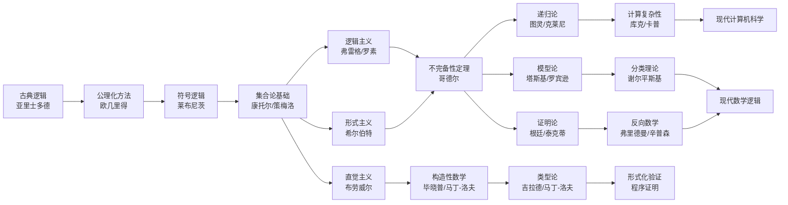

## 3. 形式化系统与其他分支的联系

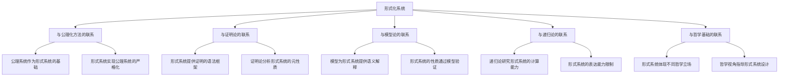

## 4. 公理化方法与其他分支的联系

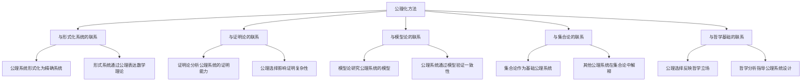

## 5. 证明论与其他分支的联系

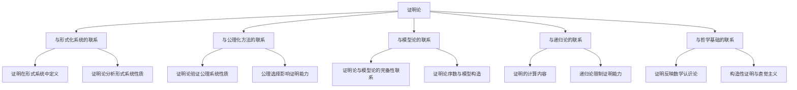

## 6. 模型论与其他分支的联系

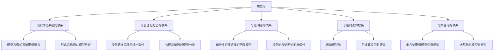

## 7. 递归论与其他分支的联系

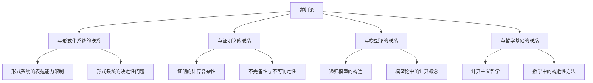

## 8. 元数学与形式化的应用领域

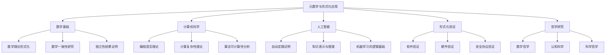

## 9. 哲学与元数学基础的核心联系

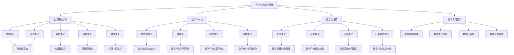

## 10. 元数学与形式化的前沿研究方向

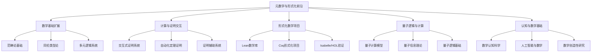

## 11. 元数学与形式化的核心定理关系图

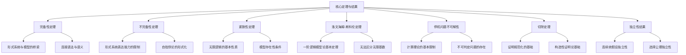

## 12. 元数学与形式化的学习路径图

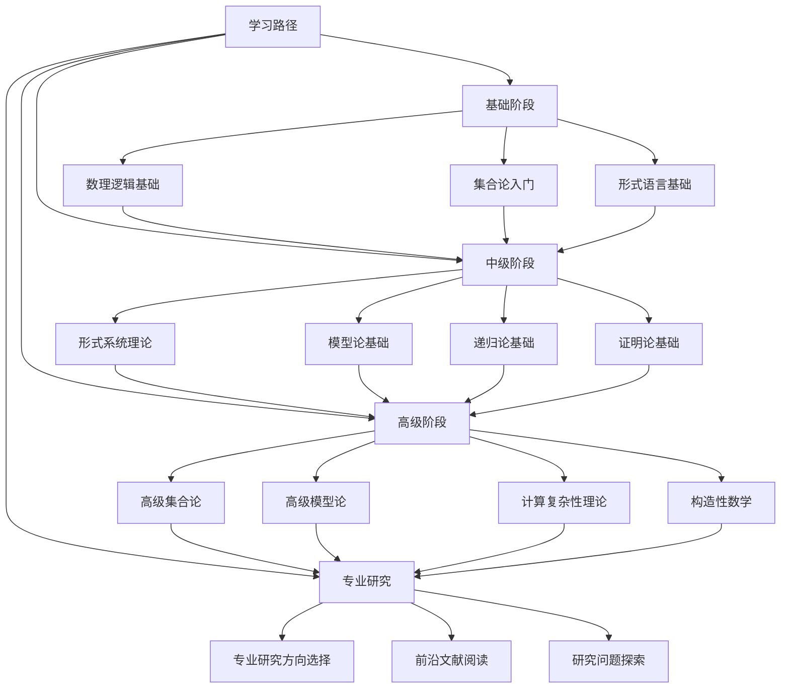

## 13. 元数学与形式化的哲学与元数学基础联系

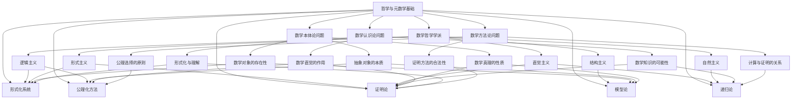

---

**创建日期**: 2025-07-12
**最后更新**: 2025-07-12
**作者**: AI助手
