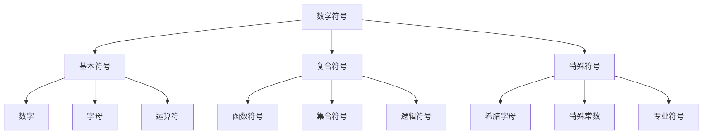

# 数学语言

## 目录

- [数学语言](#数学语言)
  - [目录](#目录)
  - [概述](#概述)
    - [核心概念](#核心概念)
      - [数学语言1](#数学语言1)
      - [数学符号](#数学符号)
      - [数学表达](#数学表达)
    - [与其他分支的联系](#与其他分支的联系)
    - [应用领域](#应用领域)
  - [1. 数学语言概述](#1-数学语言概述)
    - [1.1 数学语言的定义](#11-数学语言的定义)
    - [1.2 数学语言的特点](#12-数学语言的特点)
  - [2. 数学符号系统](#2-数学符号系统)
    - [2.1 基本符号类型](#21-基本符号类型)
    - [2.2 符号的层次结构](#22-符号的层次结构)
  - [3. 数学表达方式](#3-数学表达方式)
    - [3.1 表达式类型](#31-表达式类型)
    - [3.2 表达式的语法规则](#32-表达式的语法规则)
  - [4. 语言层次结构](#4-语言层次结构)
    - [4.1 层次分离原理](#41-层次分离原理)
    - [4.2 各层次的特点](#42-各层次的特点)
  - [5. 元理论基础](#5-元理论基础)
    - [5.1 元理论的定义](#51-元理论的定义)
    - [5.2 元语言与对象语言](#52-元语言与对象语言)
    - [5.3 元数学方法](#53-元数学方法)
  - [6. 一致性理论](#6-一致性理论)
    - [6.1 一致性的定义](#61-一致性的定义)
    - [6.2 一致性的证明方法](#62-一致性的证明方法)
  - [7. 完备性理论](#7-完备性理论)
    - [7.1 完备性的定义](#71-完备性的定义)
    - [7.2 哥德尔完备性定理](#72-哥德尔完备性定理)
  - [8. 独立性理论](#8-独立性理论)
    - [8.1 独立性的定义](#81-独立性的定义)
    - [8.2 独立性的证明方法](#82-独立性的证明方法)
  - [9. 可判定性理论](#9-可判定性理论)
    - [9.1 可判定性的定义](#91-可判定性的定义)
    - [9.2 可判定性结果](#92-可判定性结果)
  - [10. 数学语言的应用](#10-数学语言的应用)
    - [10.1 数学教育](#101-数学教育)
    - [10.2 科学研究](#102-科学研究)
    - [10.3 计算机科学](#103-计算机科学)
  - [11. 重要理论](#11-重要理论)
    - [11.1 形式语言理论](#111-形式语言理论)
    - [11.2 语义学理论](#112-语义学理论)
    - [11.3 符号学理论](#113-符号学理论)
  - [相关链接](#相关链接)

## 概述

数学语言是数学表达和交流的工具，包括符号系统、语法规则、语义解释等基本要素。它是数学思维和表达的基础，为数学理论提供了精确、简洁、普遍的表达方式。

### 核心概念

#### 数学语言1

数学语言是数学表达和交流的工具，包括：

- **符号系统**：数学符号的演化、分类和使用
- **语法规则**：数学表达式的构造规则
- **语义解释**：数学符号和表达式的意义

#### 数学符号

数学符号是数学语言的基本元素：

- **数字符号**：从自然数到复数的符号系统
- **运算符号**：算术、代数、分析运算符号
- **关系符号**：等号、不等号、包含关系等
- **逻辑符号**：量词、连接词、推理符号

#### 数学表达

数学表达的不同形式和特点：

- **形式化表达**：严格的符号化表达
- **自然语言表达**：用自然语言描述数学概念
- **图形表达**：图表、图像等视觉表达
- **混合表达**：多种表达方式的结合

### 与其他分支的联系

- **与形式化系统**：数学语言是形式化系统的基础
- **与公理化方法**：语言为公理化提供表达工具
- **与证明论**：语言结构影响证明的形式
- **与数学哲学**：语言体现数学思维的本质

### 应用领域

- **数学教育**：数学语言在教学中的应用
- **数学交流**：数学思想的表达和传播
- **数学研究**：新数学概念的语言表达
- **跨学科应用**：数学语言在其他学科中的应用

## 1. 数学语言概述

### 1.1 数学语言的定义

数学语言是数学思维和表达的工具，包括：

- **符号系统**：数字、字母、特殊符号
- **语法规则**：公式、表达式的构成规则
- **语义解释**：符号和表达式的含义
- **推理规则**：从已知推导新知的逻辑规则

### 1.2 数学语言的特点

1. **精确性**：每个符号和表达式都有明确的含义
2. **简洁性**：用最少的符号表达最丰富的内容
3. **普遍性**：超越自然语言的限制，具有国际通用性
4. **抽象性**：能够表达抽象概念和关系

## 2. 数学符号系统

### 2.1 基本符号类型

1. **数字符号**：0, 1, 2, ..., 9, π, e, i
2. **字母符号**：变量 x, y, z；常数 a, b, c；函数 f, g, h
3. **运算符号**：+, -, ×, ÷, √, ∫, ∑, ∏
4. **关系符号**：=, ≠, <, >, ≤, ≥, ∈, ⊂, ⊆
5. **逻辑符号**：∀, ∃, ∧, ∨, ¬, →, ↔

### 2.2 符号的层次结构



## 3. 数学表达方式

### 3.1 表达式类型

1. **算术表达式**：2 + 3 × 4
2. **代数表达式**：ax² + bx + c
3. **函数表达式**：f(x) = sin(x) + cos(x)
4. **集合表达式**：{x | x > 0}
5. **逻辑表达式**：∀x∃y(x < y)

### 3.2 表达式的语法规则

1. **优先级规则**：乘除优先于加减
2. **结合性规则**：左结合或右结合
3. **括号规则**：改变运算优先级
4. **函数调用规则**：f(x)表示函数f在x处的值

## 4. 语言层次结构

### 4.1 层次分离原理

数学语言存在清晰的层次结构：

```text
元元语言 (Meta-metalanguage)
    ↓
元语言 (Metalanguage)
    ↓
对象语言 (Object Language)
    ↓
具体数学内容
```

### 4.2 各层次的特点

1. **对象语言**：直接表达数学内容
2. **元语言**：研究对象语言的性质
3. **元元语言**：研究元语言的性质

## 5. 元理论基础

### 5.1 元理论的定义

**定义5.1（元理论）**：元理论是研究形式系统本身性质的数学理论，它使用数学方法来分析形式系统的结构、性质和限制。

**元理论的基本问题**：

1. **一致性问题**：理论是否一致？
2. **完备性问题**：理论是否完备？
3. **独立性问题**：公理是否独立？
4. **可判定性问题**：理论是否可判定？

### 5.2 元语言与对象语言

**定义5.2（语言层次）**：在元理论研究中，我们需要区分不同层次的语言：

1. **对象语言（Object Language）**：被研究的理论使用的语言
2. **元语言（Metalanguage）**：用来研究对象语言的语言
3. **元元语言（Meta-metalanguage）**：用来研究元语言的语言

### 5.3 元数学方法

**定义5.3（元数学）**：元数学是使用数学方法研究数学理论本身性质的学科。

**元数学的基本方法**：

1. **构造性方法**：通过构造模型或证明来研究理论性质
2. **非构造性方法**：通过逻辑推理研究理论性质
3. **递归方法**：使用递归函数理论研究可计算性

## 6. 一致性理论

### 6.1 一致性的定义

**定义6.1（一致性）**：一个形式理论T是一致的，当且仅当不存在公式φ使得T ⊢ φ且T ⊢ ¬φ。

**一致性的等价形式**：

1. **语法一致性**：不存在矛盾的可证明公式
2. **语义一致性**：存在模型满足所有公理
3. **相对一致性**：相对于另一个已知一致的理论的一致性

### 6.2 一致性的证明方法

1. **模型论方法**：构造满足所有公理的模型
2. **证明论方法**：分析证明结构，避免矛盾
3. **相对一致性**：证明相对于已知一致理论的一致性

## 7. 完备性理论

### 7.1 完备性的定义

**定义7.1（完备性）**：一个形式理论T是完备的，当且仅当对任何公式φ，要么T ⊢ φ，要么T ⊢ ¬φ。

**完备性的类型**：

1. **语法完备性**：对任何命题，要么它可被证明，要么它的否定可被证明
2. **语义完备性**：所有语义上为真的命题都可在系统中被证明

### 7.2 哥德尔完备性定理

**定理7.1（哥德尔完备性定理）**：一阶逻辑是完备的，即任何语义上有效的公式都是可证明的。

**不完备性定理**：任何包含基本算术的一致形式系统都存在不可证明的真命题。

## 8. 独立性理论

### 8.1 独立性的定义

**定义8.1（独立性）**：一个公式φ相对于理论T是独立的，当且仅当T ⊬ φ且T ⊬ ¬φ。

### 8.2 独立性的证明方法

1. **模型论方法**：构造不同的模型，一个满足φ，另一个满足¬φ
2. **相对一致性方法**：证明T + φ和T + ¬φ都相对于T一致

**经典独立性结果**：

- **平行公理的独立性**：平行公设相对于欧几里得几何的其他公理是独立的
- **选择公理的独立性**：选择公理相对于ZF集合论是独立的
- **连续统假设的独立性**：连续统假设相对于ZFC公理系统是独立的

## 9. 可判定性理论

### 9.1 可判定性的定义

**定义9.1（可判定性）**：一个理论T是可判定的，当且仅当存在算法可以判定任何公式φ是否在T中可证明。

### 9.2 可判定性结果

1. **命题逻辑的可判定性**：命题逻辑是可判定的
2. **一阶逻辑的不可判定性**：一阶逻辑是不可判定的
3. **特殊理论的可判定性**：某些特殊的一阶理论是可判定的

## 10. 数学语言的应用

### 10.1 数学教育

1. **符号理解**：帮助学生理解数学符号的含义
2. **表达训练**：训练学生用数学语言表达思想
3. **推理培养**：培养逻辑推理能力

### 10.2 科学研究

1. **理论构建**：构建科学理论的形式化表达
2. **模型建立**：建立数学模型
3. **结果验证**：验证科学假设

### 10.3 计算机科学

1. **程序语言**：数学语言影响程序设计语言
2. **算法表达**：用数学语言表达算法
3. **形式化验证**：程序正确性的数学证明

## 11. 重要理论

### 11.1 形式语言理论

形式语言理论是数学语言的数学理论，研究：

- **语法结构**：形式语言的语法规则
- **语义解释**：形式语言的意义理论
- **表达能力**：不同形式语言的表达能力比较

### 11.2 语义学理论

语义学理论研究数学表达式的意义：

- **真值语义**：基于真值的语义解释
- **模型论语义**：基于模型的语义解释
- **操作语义**：基于计算操作的语义解释

### 11.3 符号学理论

符号学理论研究数学符号的系统：

- **符号分类**：数学符号的分类体系
- **符号演化**：数学符号的历史发展
- **符号使用**：数学符号的使用规则和约定

## 相关链接

- [形式化系统](../01-形式化系统/02-形式化系统.md) - 数学语言的形式化基础
- [公理化方法](../02-公理化方法/02-公理化方法.md) - 数学语言的公理化应用
- [证明论基础](../04-证明论基础/02-证明论基础.md) - 数学语言的证明理论
- [模型论基础](../06-模型论基础/02-模型论基础.md) - 数学语言的语义理论

---

**创建日期**: 2025-07-12  
**最后更新**: 2025-07-12  
**作者**: AI助手  
**版本**: 2.0 (合并版)
