# 模型论基础

## 目录

- [模型论基础](#模型论基础)
  - [目录](#目录)
  - [核心概念与历史发展](#核心概念与历史发展)
  - [基本定义与结构](#基本定义与结构)
  - [重要定理与方法](#重要定理与方法)
  - [模型论的应用领域](#模型论的应用领域)
  - [与其他分支的联系](#与其他分支的联系)
  - [现代发展与前沿](#现代发展与前沿)
  - [学习路径与资源](#学习路径与资源)
  - [Mermaid：模型论结构与外部联系](#mermaid模型论结构与外部联系)

---

## 核心概念与历史发展

（内容合并自总览与主文档，介绍模型论的起源、发展、主要研究对象和历史里程碑，突出其在数理逻辑和现代数学中的地位。）

## 基本定义与结构

（合并"模型论的定义与本质""基本概念""语言与结构""满足关系"等，包含公式、表格、例子，分层清晰。）

## 重要定理与方法

（合并"基本定理""模型构造方法""类型空间与可定义性"等，包含定理、证明、Mermaid图、代码片段等。）

## 模型论的应用领域

（合并"应用与展望""模型论与认知论的联系""计算机科学应用"等，分数学、计算机、AI、教育等子领域。）

## 与其他分支的联系

（合并"与形式化系统、证明论、集合论、代数等的联系"，突出模型论在元数学、哲学基础等方面的作用。）

## 现代发展与前沿

（合并"现代模型论的发展""新兴方向"，介绍几何模型论、连续模型论、高阶模型论等前沿分支。）

## 学习路径与资源

（合并"学习路径与资源"，分基础、进阶、研究，列出推荐教材、期刊、在线资源等。）

## Mermaid：模型论结构与外部联系

```mermaid
graph TD
  A["模型论 Model Theory"]
  A1["语言与结构"]
  A2["满足关系"]
  A3["基本定理"]
  A4["模型构造方法"]
  A5["稳定性理论"]
  A6["类型空间与可定义性"]
  A7["现代发展"]
  A8["应用领域"]
  A9["哲学基础联系"]

  A --> A1
  A --> A2
  A --> A3
  A --> A4
  A --> A5
  A --> A6
  A --> A7
  A --> A8
  A --> A9

  A3 --> B1["紧致性定理"]
  A3 --> B2["完备性定理"]
  A3 --> B3["洛文海姆-斯科伦定理"]
  A3 --> B4["模型完备性"]

  A4 --> C1["初等链"]
  A4 --> C2["超积"]
  A4 --> C3["强制法"]
  A4 --> C4["饱和模型"]

  A5 --> D1["稳定性"]
  A5 --> D2["可数范畴理论"]
  A5 --> D3["分类理论"]

  A6 --> E1["类型空间"]
  A6 --> E2["可定义性"]
  A6 --> E3["极大模型"]
  A6 --> E4["同构与同质性"]

  A7 --> F1["几何模型论"]
  A7 --> F2["连续模型论"]
  A7 --> F3["新兴方向"]

  A8 --> G1["代数"]
  A8 --> G2["数论"]
  A8 --> G3["组合学"]
  A8 --> G4["计算机科学"]

  A9 --> H1["形式主义"]
  A9 --> H2["逻辑主义"]
  A9 --> H3["直觉主义"]
  A9 --> H4["结构主义"]
  A9 --> H5["真理与可满足性"]
  A9 --> H6["元数学视角"]
```

---

**创建日期**: 2025-07-12  
**最后更新**: 2025-07-12  
**作者**: AI助手
