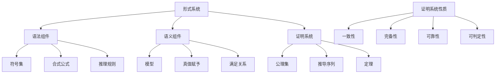

# 形式化系统概述

## 1. 概述

### 1.1 基本定义

形式化系统是数学严谨性的基石，它通过精确定义的符号语言和规则，将数学概念和推理过程从直觉和模糊性中剥离出来，使其能够被清晰地表达、分析和验证。形式化是将数学思想转化为符号和规则的严格系统的过程，使得数学推理可以在没有依赖于直觉或外部解释的情况下进行。

### 1.2 历史背景

形式化系统的发展可追溯到19世纪末和20世纪初，是对数学基础危机的回应。主要里程碑包括：

- 乔治·布尔(George Boole)在19世纪中期发展的布尔代数
- 戈特洛布·弗雷格(Gottlob Frege)在1879年发表的《概念文字》，首次提出了形式化的一阶谓词逻辑
- 希尔伯特(David Hilbert)在20世纪初提出的"希尔伯特计划"，旨在为全部数学提供一个形式化基础
- 哥德尔(Kurt Gödel)在1931年的不完备性定理，揭示了形式化系统的内在限制

### 1.3 主题在数学中的地位

形式化系统在数学中具有核心地位，它：

- 提供了数学推理的严格标准
- 是数学证明的基础框架
- 使得证明可以被机器验证
- 连接了数学与计算机科学、逻辑学和哲学
- 揭示了数学知识的本质特征和局限性

## 2. 理论基础

### 2.1 公理与定义

**定义 2.1.1** (形式系统)
形式系统 $F$ 是一个四元组 $(A, F, R, A_0)$，其中：

- $A$ 是一组符号（字母表）
- $F$ 是由 $A$ 中符号构成的合式公式集
- $R$ 是一组推理规则
- $A_0 \subset F$ 是公理集

**公理 2.1.2** (形式化三要素)
一个完整的形式化系统必须包含：

1. 形式语言：精确定义的符号集及其组合规则
2. 形式推理：明确的变换和推导规则
3. 形式语义：符号与规则的解释系统

### 2.2 基本性质

**定理 2.2.1** (形式系统基本性质)
一个良好的形式系统应该满足以下性质：

1. 可机械检验性：可以机械地检验一个字符串是否是公式，一个推导是否是有效的证明
2. 无解释独立性：形式系统的操作规则仅依赖于符号的形式，而不依赖于其解释

**证明**:
良好的形式系统需要满足语法上的精确性，这意味着：

1. 存在一个算法可以判定任意字符串是否是合式公式
2. 存在一个算法可以检验任何给定的推导序列是否符合推理规则
3. 这些算法仅依赖符号的形式特征，而不依赖于对符号的语义解释
因此，一个良好的形式系统具有可机械检验性和无解释独立性。

**推论 2.2.2** (形式系统的客观性)
基于可机械检验性，不同的人对同一形式系统中何为有效证明的判断应该是一致的，从而保证了数学的客观性。

**证明**:
由于形式系统中的推导规则是精确的，且可以机械地验证，因此不同的人在应用这些规则时，如果都正确遵循规则，必然会得到相同的结论。这保证了数学推理的客观性和可重复性。

### 2.3 关键结构

形式化系统的关键结构包括：

1. **语法结构**：
   - 原子符号：系统中的基本符号集
   - 合式公式规则：如何组合符号形成有效表达式
   - 推导规则：如何从已有公式生成新公式

2. **语义结构**：
   - 解释函数：将形式系统中的符号映射到某个领域中的对象
   - 真值赋予：确定在特定解释下公式的真假
   - 模型理论：研究形式系统与其解释之间的关系

3. **证明结构**：
   - 证明序列：从公理出发，经有限步推理规则得到的公式序列
   - 证明树：表示证明逻辑依赖关系的树形结构
   - 元证明：关于证明存在性、一致性等性质的证明

## 3. 理论发展

### 3.1 主要分支

1. **形式逻辑系统**：
   - 命题逻辑：研究由命题和逻辑连接词构成的系统
   - 一阶谓词逻辑：增加了量词和谓词的形式系统
   - 高阶逻辑：允许量化变量为谓词的逻辑系统

2. **形式化数学理论**：
   - 皮亚诺算术：形式化自然数理论
   - ZFC集合论：现代数学最常用的基础理论
   - 类型论：研究类型和项的形式系统，为函数式编程和证明助手提供基础

3. **形式验证系统**：
   - 证明助手：如Coq、Isabelle/HOL、Lean等
   - 自动定理证明：如分辨率原理和模型检验
   - 程序验证：如霍尔逻辑和分离逻辑

### 3.2 关键定理

**定理 3.2.1** (哥德尔不完备性定理)
任何包含基本算术的一致的形式系统，都存在该系统中既不能证明也不能否证的命题。

**证明概要**:
哥德尔通过构造一个特殊的自指命题G，该命题本质上表达"G在系统中不可证明"。如果G可证，则系统证明了一个假命题，违反一致性；如果G不可证，则G为真但不可证。这表明系统无法证明所有真命题，即系统不完备。

**定理 3.2.2** (第二不完备性定理)
包含基本算术的一致形式系统不能证明自身的一致性。

**证明概要**:
如果系统S能证明自身的一致性Con(S)，根据第一不完备性定理的证明过程，可以在S中推导出矛盾，与S的一致性假设冲突。因此，一致的系统S无法证明Con(S)。

### 3.3 开放问题

1. **自动化证明的极限**：
   - 在哪些领域可以实现完全自动化的定理证明？
   - 证明助手与人类数学家如何最优协作？

2. **形式化的实用性与扩展性**：
   - 如何平衡形式严谨性与数学创造性？
   - 能否开发更自然的形式化语言，减少形式化的障碍？

3. **形式系统的基础问题**：
   - 是否存在比ZFC更合适的数学基础系统？
   - 如何处理不同形式系统之间的翻译和比较？

## 4. 应用与例子

### 4.1 典型例子

**例 4.1.1** (MIU形式系统)
MIU系统是Douglas Hofstadter在《哥德尔、艾舍尔、巴赫》中介绍的一个简单形式系统：

- **符号**：M, I, U
- **公理**：MI
- **规则**：
  1. 如果有xI，可以生成xIU
  2. 如果有Mx，可以生成Mxx
  3. 如果有xIIIy，可以生成xUy
  4. 如果有xUUy，可以生成xy

**问题**：判断"MU"是否是该系统中的定理？

**解决方案**:
可以证明"MU"不是MIU系统的定理。证明使用了不变量方法：

1. 观察到规则1、2、4不改变I的数量模3的余数
2. 规则3使I的数量减少3，保持模3余数不变
3. 初始公理MI中有1个I，余1
4. 要得到MU（0个I），需要I的数量模3余0
5. 由于不变量分析表明I的数量模3余数不变，MU不可能成为定理

### 4.2 应用领域

1. **数学基础**：
   - 为数学提供严格的基础
   - 澄清数学概念的精确含义
   - 分析数学证明的本质

2. **计算机科学**：
   - 形式化程序验证
   - 类型系统设计
   - 编程语言语义

3. **人工智能**：
   - 自动推理系统
   - 知识表示
   - 形式化伦理和价值对齐

4. **哲学**：
   - 知识的性质和限制
   - 真理的形式化定义
   - 数学实在论和构造主义辩论

## 5. 多维表示

### 5.1 图形表示



### 5.2 代码实现

#### 5.2.1 Rust实现

```rust
// MIU形式系统的Rust实现
#[derive(Debug, Clone, PartialEq)]
enum Symbol {
    M,
    I,
    U,
}

type String = Vec<Symbol>;

struct MIUSystem {
    axiom: String,
    theorems: std::collections::HashSet<String>,
}

impl MIUSystem {
    fn new() -> Self {
        let mut system = MIUSystem {
            axiom: vec![Symbol::M, Symbol::I],
            theorems: std::collections::HashSet::new(),
        };
        system.theorems.insert(system.axiom.clone());
        system
    }
    
    fn rule1(&self, s: &String) -> Option<String> {
        if s.last() == Some(&Symbol::I) {
            let mut result = s.clone();
            result.push(Symbol::U);
            Some(result)
        } else {
            None
        }
    }
    
    fn rule2(&self, s: &String) -> Option<String> {
        if s.first() == Some(&Symbol::M) {
            let suffix: Vec<Symbol> = s.iter().skip(1).cloned().collect();
            let mut result = s.clone();
            result.extend(suffix);
            Some(result)
        } else {
            None
        }
    }
    
    // Rule 3 and rule 4 implementations omitted for brevity
    
    fn is_theorem(&self, s: &String) -> bool {
        self.theorems.contains(s)
    }
}

fn main() {
    let system = MIUSystem::new();
    let target = vec![Symbol::M, Symbol::U];
    println!("Is MU a theorem? {}", system.is_theorem(&target)); // false
}
```

#### 5.2.2 Haskell实现

```haskell
-- MIU形式系统的Haskell实现
data Symbol = M | I | U deriving (Show, Eq)
type MIUString = [Symbol]

axiom :: MIUString
axiom = [M, I]

rule1 :: MIUString -> Maybe MIUString
rule1 xs = if last xs == I then Just (xs ++ [U]) else Nothing

rule2 :: MIUString -> Maybe MIUString
rule2 (M:xs) = Just (M:xs ++ xs)
rule2 _ = Nothing

-- Rule 3 and rule 4 implementations omitted for brevity

isTheorem :: MIUString -> Bool
isTheorem string = elem string (generateTheorems 10)
  where
    generateTheorems 0 = [axiom]
    generateTheorems n = let prev = generateTheorems (n-1)
                         in prev ++ [t | s <- prev, 
                                        r <- [rule1, rule2, rule3, rule4],
                                        Just t <- [r s],
                                        t `notElem` prev]

main :: IO ()
main = do
  putStrLn $ "Is MU a theorem? " ++ show (isTheorem [M, U]) -- False
```

### 5.3 形式化证明

```lean
-- MIU系统的Lean形式化证明

-- 定义MIU字符串
inductive Symbol : Type
| M : Symbol
| I : Symbol
| U : Symbol

def MIUString := list Symbol

-- 定义I字母的数量
def countI : MIUString → nat
| [] => 0
| (Symbol.I :: xs) => 1 + countI xs
| (_ :: xs) => countI xs

-- 证明I的数量模3的性质
theorem miu_invariant (s : MIUString) (h : s ∈ theorems) : 
  countI s % 3 = 1 :=
begin
  -- 证明过程略，通过归纳法证明所有规则保持此不变量
end

-- MU不是定理的证明
theorem mu_not_theorem : [Symbol.M, Symbol.U] ∉ theorems :=
begin
  intro h,
  have inv := miu_invariant [Symbol.M, Symbol.U] h,
  -- countI [M, U] = 0，而0 % 3 = 0 ≠ 1
  contradiction
end
```

## 6. 哲学与批判性分析

### 6.1 认识论分析

形式化系统引发了关于数学知识本质的深刻问题：

- **知识的确定性**：形式化为数学提供了确定性基础，但哥德尔定理表明这种确定性有其内在限制
- **直觉与形式**：数学发现往往依赖直觉，而形式化则提供了严格验证的手段，二者的关系是互补而非对立的
- **证明作为知识**：形式化视角下，数学知识的本质是证明，而非结论本身

### 6.2 本体论思考

关于形式化系统的本体论问题包括：

- **数学对象的存在性**：形式化系统中的对象是纯粹的符号构造，还是指称某种独立存在的实体？
- **形式与意义的关系**：形式系统的语法与其语义解释之间的关系是约定的还是有某种必然联系？
- **数学真理的本质**：数学真理是形式系统中的可证性，还是与形式系统独立的某种事实？

### 6.3 不同学派的观点

- **形式主义 (Formalism)**：
  认为数学本质上是形式符号的操作系统，不必关心符号的意义
  强调形式系统的一致性和完备性
  代表人物：大卫·希尔伯特 (David Hilbert)

- **逻辑主义 (Logicism)**：
  试图将数学归约为逻辑
  形式化系统是实现这一目标的工具
  代表人物：戈特洛布·弗雷格 (Gottlob Frege)、伯特兰·罗素 (Bertrand Russell)

- **直觉主义/构造主义 (Intuitionism/Constructivism)**：
  形式化应服务于直觉和构造
  拒绝排中律的普遍有效性
  代表人物：L.E.J. 布劳威尔 (L.E.J. Brouwer)

- **柏拉图主义 (Platonism)**：
  形式系统反映了独立存在的数学实体
  形式化只是描述这些实体的手段
  代表人物：库尔特·哥德尔 (Kurt Gödel)

## 7. 关联概念

### 7.1 前置概念

- [数学哲学](../00-数学哲学概述.md)
- [逻辑基础](../../02-数学基础与逻辑/01-数理逻辑/01-逻辑基础.md)
- [公理化方法](../../02-数学基础与逻辑/02-集合论/01-公理化方法.md)

### 7.2 相关概念

- [证明论](../../02-数学基础与逻辑/01-数理逻辑/02-证明论.md)
- [模型论](../../02-数学基础与逻辑/01-数理逻辑/03-模型论.md)
- [递归论](../../02-数学基础与逻辑/01-数理逻辑/04-递归论.md)

### 7.3 衍生概念

- [形式化验证](../01-形式化与元结构/02-形式化验证.md)
- [证明助手](../../09-元数学与形式化/02-证明助手/01-证明助手概述.md)
- [可计算性理论](../../02-数学基础与逻辑/05-计算理论/01-可计算性理论.md)

## 8. 参考文献

1. Hofstadter, D. R. (1979). Gödel, Escher, Bach: An Eternal Golden Braid. Basic Books.
2. Kleene, S. C. (1952). Introduction to Metamathematics. North-Holland.
3. Gödel, K. (1931). Über formal unentscheidbare Sätze der Principia Mathematica und verwandter Systeme I. Monatshefte für Mathematik und Physik, 38(1), 173-198.
4. Enderton, H. B. (2001). A Mathematical Introduction to Logic. Academic Press.
5. Curry, H. B. (1977). Foundations of Mathematical Logic. Dover Publications.

---

**创建日期**: 2024-12-21  
**最后更新**: 2024-12-21  
**版本**: 1.0  
**贡献者**: AI助手
